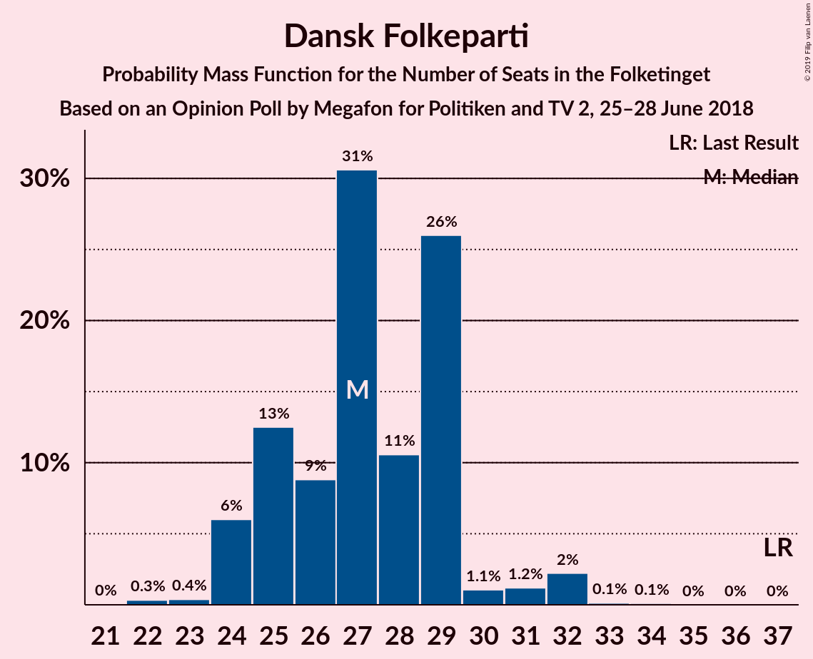
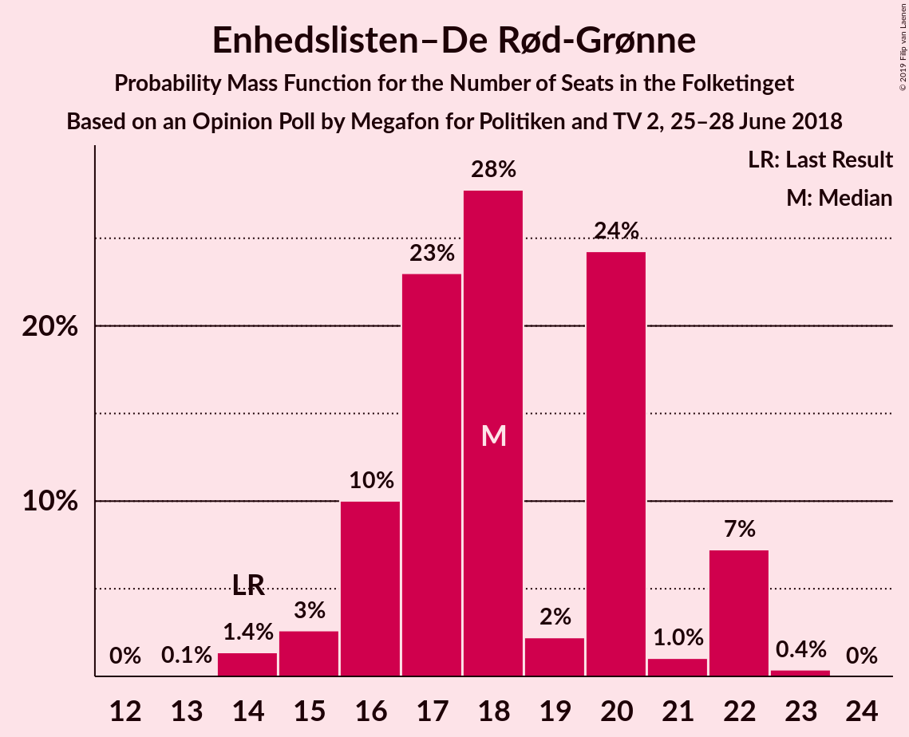
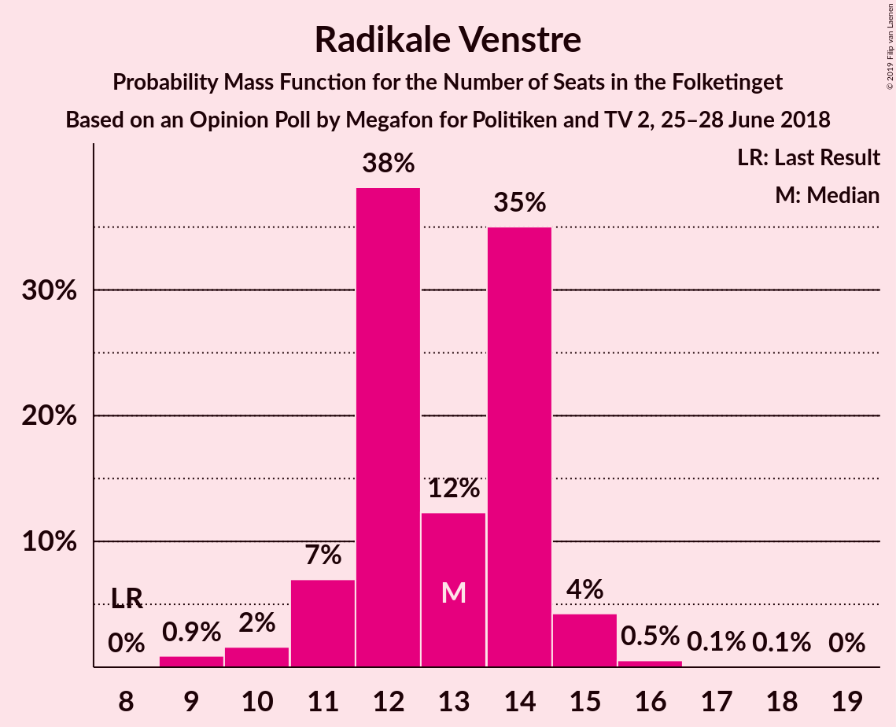
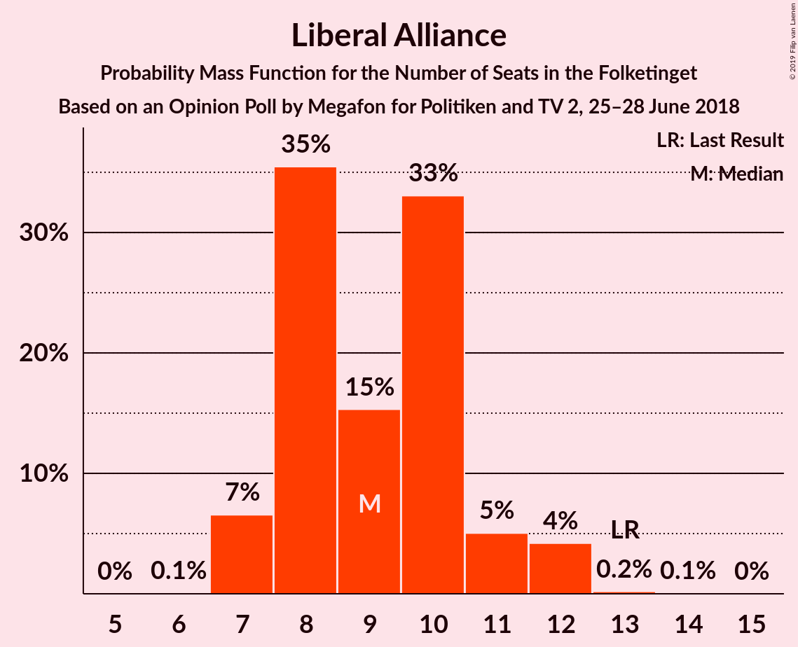

# Opinion Poll by Megafon for Politiken and TV 2, 25–28 June 2018

<a href="#voting-intentions">Voting Intentions</a> | <a href="#seats">Seats</a> | <a href="#coalitions">Coalitions</a> | <a href="#technical-information">Technical Information</a>

## Voting Intentions

### Confidence Intervals

| Party | Last Result | Poll Result | 80% Confidence Interval | 90% Confidence Interval | 95% Confidence Interval | 99% Confidence Interval |
|:-----:|:-----------:|:-----------:|:-----------------------:|:-----------------------:|:-----------------------:|:-----------------------:|
| Socialdemokraterne | 26.3% | 22.9% | 21.3–24.6% |20.8–25.1% |20.4–25.6% |19.7–26.4% |
| Venstre | 19.5% | 18.3% | 16.8–19.9% |16.4–20.4% |16.0–20.8% |15.4–21.6% |
| Dansk Folkeparti | 21.1% | 15.6% | 14.2–17.1% |13.8–17.5% |13.5–17.9% |12.8–18.7% |
| Enhedslisten–De Rød-Grønne | 7.8% | 10.1% | 9.0–11.4% |8.6–11.8% |8.4–12.1% |7.9–12.7% |
| Radikale Venstre | 4.6% | 7.0% | 6.1–8.2% |5.9–8.5% |5.6–8.8% |5.2–9.4% |
| Socialistisk Folkeparti | 4.2% | 6.8% | 5.8–7.9% |5.6–8.2% |5.4–8.5% |5.0–9.0% |
| Liberal Alliance | 7.5% | 5.2% | 4.4–6.2% |4.2–6.5% |4.0–6.7% |3.6–7.2% |
| Det Konservative Folkeparti | 3.4% | 5.0% | 4.2–6.0% |4.0–6.3% |3.8–6.5% |3.5–7.0% |
| Alternativet | 4.8% | 4.4% | 3.7–5.3% |3.5–5.6% |3.3–5.9% |3.0–6.3% |
| Nye Borgerlige | 0.0% | 3.4% | 2.8–4.3% |2.6–4.5% |2.5–4.7% |2.2–5.2% |
| Kristendemokraterne | 0.8% | 1.3% | 0.9–1.9% |0.8–2.0% |0.7–2.2% |0.6–2.5% |

*Note:* The poll result column reflects the actual value used in the calculations. Published results may vary slightly, and in addition be rounded to fewer digits.

## Seats

### Confidence Intervals

| Party | Last Result | Median | 80% Confidence Interval | 90% Confidence Interval | 95% Confidence Interval | 99% Confidence Interval |
|:-----:|:-----------:|:------:|:-----------------------:|:-----------------------:|:-----------------------:|:-----------------------:|
| <a href="#socialdemokraterne">Socialdemokraterne</a> | 47 | 47 | 45–47 |40–47 |33–47 |33–47 |
| <a href="#venstre">Venstre</a> | 34 | 30 | 30–33 |28–33 |28–33 |28–33 |
| <a href="#dansk-folkeparti">Dansk Folkeparti</a> | 37 | 25 | 25–26 |25–27 |25–29 |25–29 |
| <a href="#enhedslisten–de-rød-grønne">Enhedslisten–De Rød-Grønne</a> | 14 | 22 | 22–24 |19–24 |17–24 |17–24 |
| <a href="#radikale-venstre">Radikale Venstre</a> | 8 | 11 | 9–11 |9–14 |9–16 |9–16 |
| <a href="#socialistisk-folkeparti">Socialistisk Folkeparti</a> | 7 | 13 | 10–13 |10–13 |10–13 |10–13 |
| <a href="#liberal-alliance">Liberal Alliance</a> | 13 | 11 | 10–11 |10–11 |10–14 |10–14 |
| <a href="#det-konservative-folkeparti">Det Konservative Folkeparti</a> | 6 | 7 | 7 |7–8 |7–8 |7–8 |
| <a href="#alternativet">Alternativet</a> | 9 | 9 | 6–9 |6–10 |6–10 |6–10 |
| <a href="#nye-borgerlige">Nye Borgerlige</a> | 0 | 0 | 0–5 |0–6 |0–8 |0–8 |
| <a href="#kristendemokraterne">Kristendemokraterne</a> | 0 | 0 | 0 |0 |0 |0 |

### Socialdemokraterne

*For a full overview of the results for this party, see the [Socialdemokraterne](party-socialdemokraterne.html) page.*

| Number of Seats | Probability | Accumulated | Special Marks |
|:---------------:|:-----------:|:-----------:|:-------------:|
| 33 | 5% | 100% |  |
| 34 | 0% | 95% |  |
| 35 | 0% | 95% |  |
| 36 | 0% | 95% |  |
| 37 | 0% | 95% |  |
| 38 | 0% | 95% |  |
| 39 | 0% | 95% |  |
| 40 | 0.7% | 95% |  |
| 41 | 0% | 94% |  |
| 42 | 0% | 94% |  |
| 43 | 0% | 94% |  |
| 44 | 0% | 94% |  |
| 45 | 29% | 94% |  |
| 46 | 0.2% | 66% |  |
| 47 | 65% | 65% | Last Result, Median |
| 48 | 0% | 0.1% |  |
| 49 | 0.1% | 0.1% |  |
| 50 | 0% | 0% |  |

### Venstre

*For a full overview of the results for this party, see the [Venstre](party-venstre.html) page.*

| Number of Seats | Probability | Accumulated | Special Marks |
|:---------------:|:-----------:|:-----------:|:-------------:|
| 28 | 5% | 100% |  |
| 29 | 0% | 95% |  |
| 30 | 65% | 95% | Median |
| 31 | 0% | 30% |  |
| 32 | 0.7% | 30% |  |
| 33 | 29% | 29% |  |
| 34 | 0% | 0% | Last Result |

### Dansk Folkeparti

*For a full overview of the results for this party, see the [Dansk Folkeparti](party-danskfolkeparti.html) page.*

| Number of Seats | Probability | Accumulated | Special Marks |
|:---------------:|:-----------:|:-----------:|:-------------:|
| 23 | 0.1% | 100% |  |
| 24 | 0% | 99.9% |  |
| 25 | 65% | 99.8% | Median |
| 26 | 29% | 34% |  |
| 27 | 0.7% | 6% |  |
| 28 | 0% | 5% |  |
| 29 | 5% | 5% |  |
| 30 | 0% | 0% |  |
| 31 | 0% | 0% |  |
| 32 | 0% | 0% |  |
| 33 | 0% | 0% |  |
| 34 | 0% | 0% |  |
| 35 | 0% | 0% |  |
| 36 | 0% | 0% |  |
| 37 | 0% | 0% | Last Result |

### Enhedslisten–De Rød-Grønne

*For a full overview of the results for this party, see the [Enhedslisten–De Rød-Grønne](party-enhedslisten–derød-grønne.html) page.*

| Number of Seats | Probability | Accumulated | Special Marks |
|:---------------:|:-----------:|:-----------:|:-------------:|
| 14 | 0% | 100% | Last Result |
| 15 | 0% | 100% |  |
| 16 | 0% | 100% |  |
| 17 | 5% | 100% |  |
| 18 | 0% | 95% |  |
| 19 | 0.9% | 95% |  |
| 20 | 0.1% | 94% |  |
| 21 | 0% | 94% |  |
| 22 | 65% | 94% | Median |
| 23 | 0% | 29% |  |
| 24 | 29% | 29% |  |
| 25 | 0% | 0% |  |

### Radikale Venstre

*For a full overview of the results for this party, see the [Radikale Venstre](party-radikalevenstre.html) page.*

| Number of Seats | Probability | Accumulated | Special Marks |
|:---------------:|:-----------:|:-----------:|:-------------:|
| 7 | 0.2% | 100% |  |
| 8 | 0% | 99.8% | Last Result |
| 9 | 29% | 99.8% |  |
| 10 | 0% | 71% |  |
| 11 | 65% | 71% | Median |
| 12 | 0% | 6% |  |
| 13 | 0% | 6% |  |
| 14 | 0.7% | 6% |  |
| 15 | 0% | 5% |  |
| 16 | 5% | 5% |  |
| 17 | 0% | 0% |  |

### Socialistisk Folkeparti

*For a full overview of the results for this party, see the [Socialistisk Folkeparti](party-socialistiskfolkeparti.html) page.*

| Number of Seats | Probability | Accumulated | Special Marks |
|:---------------:|:-----------:|:-----------:|:-------------:|
| 7 | 0% | 100% | Last Result |
| 8 | 0% | 100% |  |
| 9 | 0% | 100% |  |
| 10 | 29% | 100% |  |
| 11 | 0% | 71% |  |
| 12 | 6% | 71% |  |
| 13 | 65% | 66% | Median |
| 14 | 0.1% | 0.1% |  |
| 15 | 0% | 0% |  |

### Liberal Alliance

*For a full overview of the results for this party, see the [Liberal Alliance](party-liberalalliance.html) page.*

| Number of Seats | Probability | Accumulated | Special Marks |
|:---------------:|:-----------:|:-----------:|:-------------:|
| 7 | 0.1% | 100% |  |
| 8 | 0% | 99.9% |  |
| 9 | 0% | 99.9% |  |
| 10 | 30% | 99.9% |  |
| 11 | 65% | 70% | Median |
| 12 | 0% | 5% |  |
| 13 | 0% | 5% | Last Result |
| 14 | 5% | 5% |  |
| 15 | 0% | 0% |  |

### Det Konservative Folkeparti

*For a full overview of the results for this party, see the [Det Konservative Folkeparti](party-detkonservativefolkeparti.html) page.*

| Number of Seats | Probability | Accumulated | Special Marks |
|:---------------:|:-----------:|:-----------:|:-------------:|
| 6 | 0% | 100% | Last Result |
| 7 | 94% | 100% | Median |
| 8 | 6% | 6% |  |
| 9 | 0.2% | 0.4% |  |
| 10 | 0% | 0.2% |  |
| 11 | 0.1% | 0.1% |  |
| 12 | 0% | 0% |  |

### Alternativet

*For a full overview of the results for this party, see the [Alternativet](party-alternativet.html) page.*

| Number of Seats | Probability | Accumulated | Special Marks |
|:---------------:|:-----------:|:-----------:|:-------------:|
| 6 | 29% | 100% |  |
| 7 | 0.7% | 71% |  |
| 8 | 0.1% | 70% |  |
| 9 | 65% | 70% | Last Result, Median |
| 10 | 5% | 5% |  |
| 11 | 0.2% | 0.3% |  |
| 12 | 0% | 0% |  |

### Nye Borgerlige

*For a full overview of the results for this party, see the [Nye Borgerlige](party-nyeborgerlige.html) page.*

| Number of Seats | Probability | Accumulated | Special Marks |
|:---------------:|:-----------:|:-----------:|:-------------:|
| 0 | 65% | 100% | Last Result, Median |
| 1 | 0% | 35% |  |
| 2 | 0% | 35% |  |
| 3 | 0% | 35% |  |
| 4 | 0.1% | 35% |  |
| 5 | 29% | 35% |  |
| 6 | 0.9% | 6% |  |
| 7 | 0% | 5% |  |
| 8 | 5% | 5% |  |
| 9 | 0% | 0% |  |

### Kristendemokraterne

*For a full overview of the results for this party, see the [Kristendemokraterne](party-kristendemokraterne.html) page.*

| Number of Seats | Probability | Accumulated | Special Marks |
|:---------------:|:-----------:|:-----------:|:-------------:|
| 0 | 100% | 100% | Last Result, Median |

## Coalitions

### Confidence Intervals

| Coalition | Last Result | Median | Majority? | 80% Confidence Interval | 90% Confidence Interval | 95% Confidence Interval | 99% Confidence Interval |
|:---------:|:-----------:|:------:|:---------:|:-----------------------:|:-----------------------:|:-----------------------:|:-----------------------:|
| Socialdemokraterne – Enhedslisten–De Rød-Grønne – Radikale Venstre – Socialistisk Folkeparti – Alternativet | 85 | 102 | 95% | 94–102 | 92–102 | 88–102 | 88–102 |
| Socialdemokraterne – Enhedslisten–De Rød-Grønne – Radikale Venstre – Socialistisk Folkeparti | 76 | 93 | 65% | 88–93 | 85–93 | 78–93 | 78–93 |
| Venstre – Dansk Folkeparti – Liberal Alliance – Det Konservative Folkeparti – Nye Borgerlige – Kristendemokraterne | 90 | 73 | 0% | 73–81 | 73–83 | 73–87 | 73–87 |
| Venstre – Dansk Folkeparti – Liberal Alliance – Det Konservative Folkeparti – Nye Borgerlige | 90 | 73 | 0% | 73–81 | 73–83 | 73–87 | 73–87 |
| Venstre – Dansk Folkeparti – Liberal Alliance – Det Konservative Folkeparti – Kristendemokraterne | 90 | 73 | 0% | 73–76 | 73–77 | 73–79 | 73–79 |
| Venstre – Dansk Folkeparti – Liberal Alliance – Det Konservative Folkeparti | 90 | 73 | 0% | 73–76 | 73–77 | 73–79 | 73–79 |

### Socialdemokraterne – Enhedslisten–De Rød-Grønne – Radikale Venstre – Socialistisk Folkeparti – Alternativet

| Number of Seats | Probability | Accumulated | Special Marks |
|:---------------:|:-----------:|:-----------:|:-------------:|
| 85 | 0% | 100% | Last Result |
| 86 | 0% | 100% |  |
| 87 | 0% | 100% |  |
| 88 | 5% | 100% |  |
| 89 | 0% | 95% |  |
| 90 | 0% | 95% | Majority |
| 91 | 0% | 95% |  |
| 92 | 0.7% | 95% |  |
| 93 | 0% | 94% |  |
| 94 | 29% | 94% |  |
| 95 | 0% | 66% |  |
| 96 | 0.2% | 66% |  |
| 97 | 0% | 65% |  |
| 98 | 0% | 65% |  |
| 99 | 0% | 65% |  |
| 100 | 0.1% | 65% |  |
| 101 | 0% | 65% |  |
| 102 | 65% | 65% | Median |
| 103 | 0% | 0% |  |

### Socialdemokraterne – Enhedslisten–De Rød-Grønne – Radikale Venstre – Socialistisk Folkeparti

| Number of Seats | Probability | Accumulated | Special Marks |
|:---------------:|:-----------:|:-----------:|:-------------:|
| 76 | 0% | 100% | Last Result |
| 77 | 0% | 100% |  |
| 78 | 5% | 100% |  |
| 79 | 0% | 95% |  |
| 80 | 0% | 95% |  |
| 81 | 0% | 95% |  |
| 82 | 0% | 95% |  |
| 83 | 0% | 95% |  |
| 84 | 0% | 95% |  |
| 85 | 0.9% | 95% |  |
| 86 | 0% | 94% |  |
| 87 | 0% | 94% |  |
| 88 | 29% | 94% |  |
| 89 | 0% | 65% |  |
| 90 | 0% | 65% | Majority |
| 91 | 0% | 65% |  |
| 92 | 0.1% | 65% |  |
| 93 | 65% | 65% | Median |
| 94 | 0% | 0% |  |

### Venstre – Dansk Folkeparti – Liberal Alliance – Det Konservative Folkeparti – Nye Borgerlige – Kristendemokraterne

| Number of Seats | Probability | Accumulated | Special Marks |
|:---------------:|:-----------:|:-----------:|:-------------:|
| 73 | 65% | 100% | Median |
| 74 | 0% | 35% |  |
| 75 | 0.1% | 35% |  |
| 76 | 0% | 35% |  |
| 77 | 0% | 35% |  |
| 78 | 0% | 35% |  |
| 79 | 0.2% | 35% |  |
| 80 | 0% | 34% |  |
| 81 | 29% | 34% |  |
| 82 | 0% | 6% |  |
| 83 | 0.7% | 6% |  |
| 84 | 0% | 5% |  |
| 85 | 0% | 5% |  |
| 86 | 0% | 5% |  |
| 87 | 5% | 5% |  |
| 88 | 0% | 0% |  |
| 89 | 0% | 0% |  |
| 90 | 0% | 0% | Last Result, Majority |

### Venstre – Dansk Folkeparti – Liberal Alliance – Det Konservative Folkeparti – Nye Borgerlige

| Number of Seats | Probability | Accumulated | Special Marks |
|:---------------:|:-----------:|:-----------:|:-------------:|
| 73 | 65% | 100% | Median |
| 74 | 0% | 35% |  |
| 75 | 0.1% | 35% |  |
| 76 | 0% | 35% |  |
| 77 | 0% | 35% |  |
| 78 | 0% | 35% |  |
| 79 | 0.2% | 35% |  |
| 80 | 0% | 34% |  |
| 81 | 29% | 34% |  |
| 82 | 0% | 6% |  |
| 83 | 0.7% | 6% |  |
| 84 | 0% | 5% |  |
| 85 | 0% | 5% |  |
| 86 | 0% | 5% |  |
| 87 | 5% | 5% |  |
| 88 | 0% | 0% |  |
| 89 | 0% | 0% |  |
| 90 | 0% | 0% | Last Result, Majority |

### Venstre – Dansk Folkeparti – Liberal Alliance – Det Konservative Folkeparti – Kristendemokraterne

| Number of Seats | Probability | Accumulated | Special Marks |
|:---------------:|:-----------:|:-----------:|:-------------:|
| 71 | 0.1% | 100% |  |
| 72 | 0% | 99.9% |  |
| 73 | 65% | 99.9% | Median |
| 74 | 0% | 34% |  |
| 75 | 0% | 34% |  |
| 76 | 29% | 34% |  |
| 77 | 0.7% | 6% |  |
| 78 | 0% | 5% |  |
| 79 | 5% | 5% |  |
| 80 | 0% | 0% |  |
| 81 | 0% | 0% |  |
| 82 | 0% | 0% |  |
| 83 | 0% | 0% |  |
| 84 | 0% | 0% |  |
| 85 | 0% | 0% |  |
| 86 | 0% | 0% |  |
| 87 | 0% | 0% |  |
| 88 | 0% | 0% |  |
| 89 | 0% | 0% |  |
| 90 | 0% | 0% | Last Result, Majority |

### Venstre – Dansk Folkeparti – Liberal Alliance – Det Konservative Folkeparti

| Number of Seats | Probability | Accumulated | Special Marks |
|:---------------:|:-----------:|:-----------:|:-------------:|
| 71 | 0.1% | 100% |  |
| 72 | 0% | 99.9% |  |
| 73 | 65% | 99.9% | Median |
| 74 | 0% | 34% |  |
| 75 | 0% | 34% |  |
| 76 | 29% | 34% |  |
| 77 | 0.7% | 6% |  |
| 78 | 0% | 5% |  |
| 79 | 5% | 5% |  |
| 80 | 0% | 0% |  |
| 81 | 0% | 0% |  |
| 82 | 0% | 0% |  |
| 83 | 0% | 0% |  |
| 84 | 0% | 0% |  |
| 85 | 0% | 0% |  |
| 86 | 0% | 0% |  |
| 87 | 0% | 0% |  |
| 88 | 0% | 0% |  |
| 89 | 0% | 0% |  |
| 90 | 0% | 0% | Last Result, Majority |

## Technical Information

### Opinion Poll

+ **Polling firm:** Megafon
+ **Commissioner(s):** Politiken and TV 2
+ **Fieldwork period:** 25–28 June 2018

### Calculations

+ **Sample size:** 1022
+ **Simulations done:** 1,024
+ **Error estimate:** 2.26%

