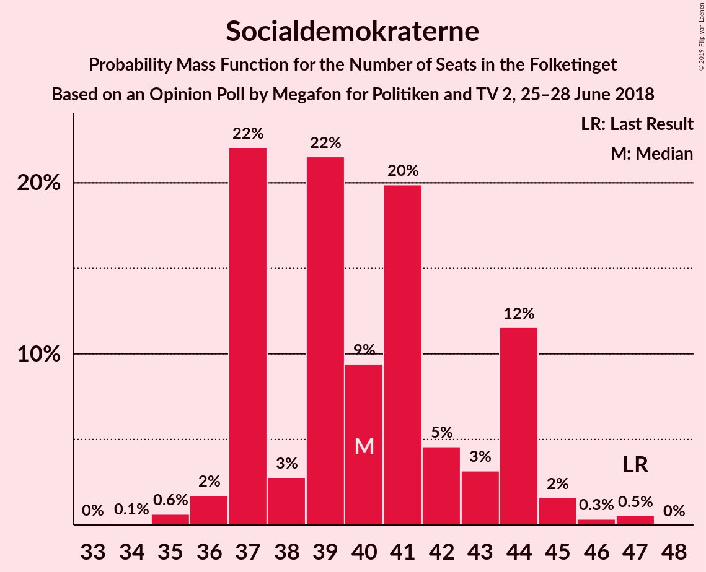
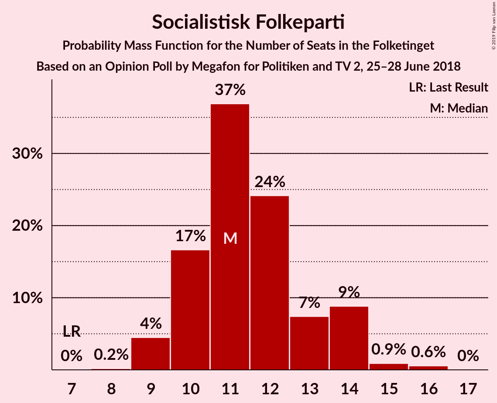
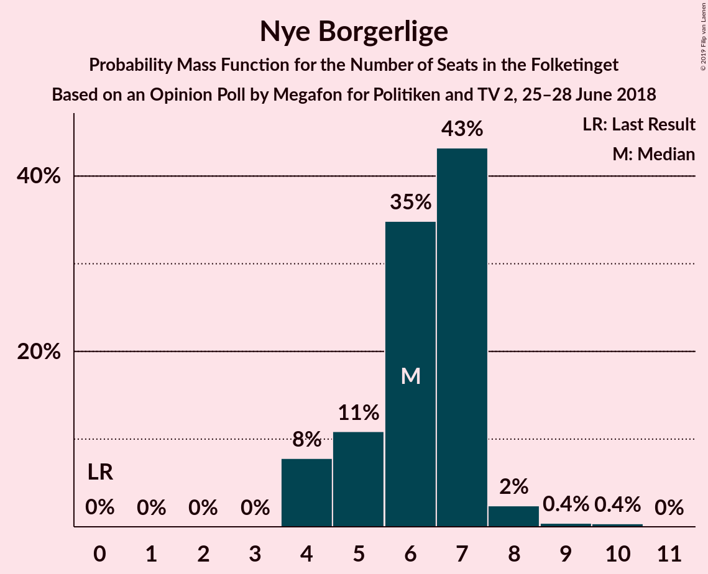
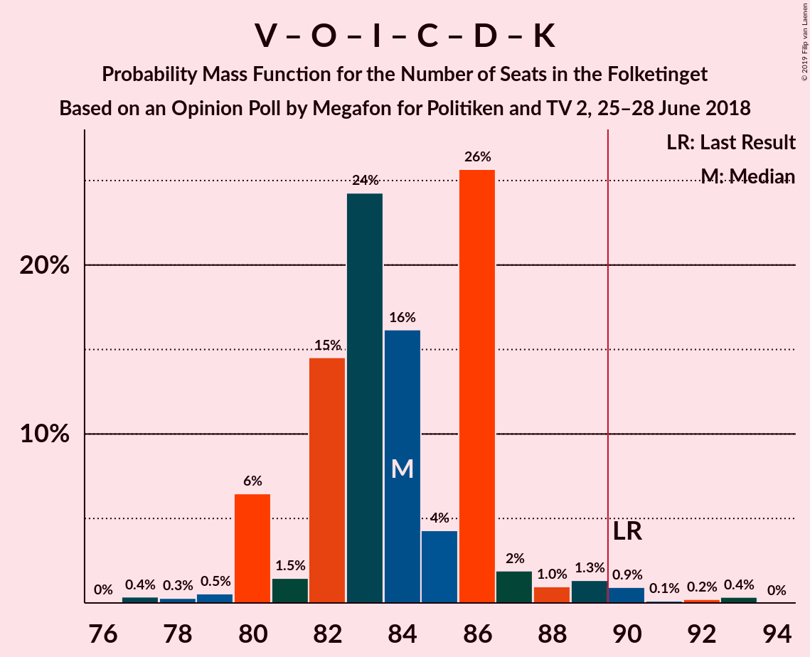

# Opinion Poll by Megafon for Politiken and TV 2, 25–28 June 2018

<a href="#voting-intentions">Voting Intentions</a> | <a href="#seats">Seats</a> | <a href="#coalitions">Coalitions</a> | <a href="#technical-information">Technical Information</a>

## Voting Intentions

### Confidence Intervals

| Party | Last Result | Poll Result | 80% Confidence Interval | 90% Confidence Interval | 95% Confidence Interval | 99% Confidence Interval |
|:-----:|:-----------:|:-----------:|:-----------------------:|:-----------------------:|:-----------------------:|:-----------------------:|
| Socialdemokraterne | 26.3% | 22.9% | 21.3–24.6% |20.8–25.1% |20.4–25.6% |19.7–26.4% |
| Venstre | 19.5% | 18.3% | 16.8–19.9% |16.4–20.4% |16.0–20.8% |15.4–21.6% |
| Dansk Folkeparti | 21.1% | 15.6% | 14.2–17.1% |13.8–17.5% |13.5–17.9% |12.8–18.7% |
| Enhedslisten–De Rød-Grønne | 7.8% | 10.1% | 9.0–11.4% |8.6–11.8% |8.4–12.1% |7.9–12.7% |
| Radikale Venstre | 4.6% | 7.0% | 6.1–8.2% |5.9–8.5% |5.6–8.8% |5.2–9.4% |
| Socialistisk Folkeparti | 4.2% | 6.8% | 5.8–7.9% |5.6–8.2% |5.4–8.5% |5.0–9.0% |
| Liberal Alliance | 7.5% | 5.2% | 4.4–6.2% |4.2–6.5% |4.0–6.7% |3.6–7.2% |
| Det Konservative Folkeparti | 3.4% | 5.0% | 4.2–6.0% |4.0–6.3% |3.8–6.5% |3.5–7.0% |
| Alternativet | 4.8% | 4.4% | 3.7–5.3% |3.5–5.6% |3.3–5.9% |3.0–6.3% |
| Nye Borgerlige | 0.0% | 3.4% | 2.8–4.3% |2.6–4.5% |2.5–4.7% |2.2–5.2% |
| Kristendemokraterne | 0.8% | 1.3% | 0.9–1.9% |0.8–2.0% |0.7–2.2% |0.6–2.5% |

*Note:* The poll result column reflects the actual value used in the calculations. Published results may vary slightly, and in addition be rounded to fewer digits.

## Seats

### Confidence Intervals

| Party | Last Result | Median | 80% Confidence Interval | 90% Confidence Interval | 95% Confidence Interval | 99% Confidence Interval |
|:-----:|:-----------:|:------:|:-----------------------:|:-----------------------:|:-----------------------:|:-----------------------:|
| <a href="#socialdemokraterne">Socialdemokraterne</a> | 47 | 41 | 37–43 |36–44 |35–45 |35–46 |
| <a href="#venstre">Venstre</a> | 34 | 32 | 29–35 |29–36 |29–37 |27–38 |
| <a href="#dansk-folkeparti">Dansk Folkeparti</a> | 37 | 26 | 23–29 |23–31 |23–31 |23–32 |
| <a href="#enhedslisten–de-rød-grønne">Enhedslisten–De Rød-Grønne</a> | 14 | 17 | 15–20 |14–20 |14–20 |13–22 |
| <a href="#radikale-venstre">Radikale Venstre</a> | 8 | 13 | 10–14 |10–15 |10–16 |10–16 |
| <a href="#socialistisk-folkeparti">Socialistisk Folkeparti</a> | 7 | 13 | 10–14 |10–16 |9–16 |8–16 |
| <a href="#liberal-alliance">Liberal Alliance</a> | 13 | 9 | 7–12 |7–12 |7–12 |7–12 |
| <a href="#det-konservative-folkeparti">Det Konservative Folkeparti</a> | 6 | 9 | 8–11 |7–11 |6–11 |6–13 |
| <a href="#alternativet">Alternativet</a> | 9 | 8 | 7–10 |6–10 |6–10 |5–12 |
| <a href="#nye-borgerlige">Nye Borgerlige</a> | 0 | 7 | 4–8 |4–9 |4–10 |4–10 |
| <a href="#kristendemokraterne">Kristendemokraterne</a> | 0 | 0 | 0 |0–4 |0–5 |0–5 |

### Socialdemokraterne

*For a full overview of the results for this party, see the [Socialdemokraterne](party-socialdemokraterne.html) page.*

| Number of Seats | Probability | Accumulated | Special Marks |
|:---------------:|:-----------:|:-----------:|:-------------:|
| 31 | 0.1% | 100% |  |
| 32 | 0.1% | 99.9% |  |
| 33 | 0% | 99.8% |  |
| 34 | 0.2% | 99.8% |  |
| 35 | 3% | 99.6% |  |
| 36 | 6% | 97% |  |
| 37 | 3% | 91% |  |
| 38 | 0.7% | 88% |  |
| 39 | 27% | 87% |  |
| 40 | 11% | 61% |  |
| 41 | 35% | 50% | Median |
| 42 | 4% | 15% |  |
| 43 | 4% | 10% |  |
| 44 | 4% | 7% |  |
| 45 | 2% | 3% |  |
| 46 | 0.4% | 0.9% |  |
| 47 | 0.4% | 0.4% | Last Result |
| 48 | 0% | 0.1% |  |
| 49 | 0% | 0% |  |

### Venstre

*For a full overview of the results for this party, see the [Venstre](party-venstre.html) page.*

| Number of Seats | Probability | Accumulated | Special Marks |
|:---------------:|:-----------:|:-----------:|:-------------:|
| 26 | 0.1% | 100% |  |
| 27 | 1.0% | 99.9% |  |
| 28 | 0.3% | 98.9% |  |
| 29 | 25% | 98.6% |  |
| 30 | 6% | 74% |  |
| 31 | 5% | 67% |  |
| 32 | 26% | 63% | Median |
| 33 | 15% | 36% |  |
| 34 | 9% | 22% | Last Result |
| 35 | 7% | 12% |  |
| 36 | 2% | 6% |  |
| 37 | 2% | 4% |  |
| 38 | 2% | 2% |  |
| 39 | 0% | 0.3% |  |
| 40 | 0.2% | 0.2% |  |
| 41 | 0% | 0% |  |

### Dansk Folkeparti

*For a full overview of the results for this party, see the [Dansk Folkeparti](party-danskfolkeparti.html) page.*

| Number of Seats | Probability | Accumulated | Special Marks |
|:---------------:|:-----------:|:-----------:|:-------------:|
| 21 | 0.1% | 100% |  |
| 22 | 0.3% | 99.9% |  |
| 23 | 11% | 99.5% |  |
| 24 | 3% | 89% |  |
| 25 | 29% | 86% |  |
| 26 | 11% | 57% | Median |
| 27 | 7% | 46% |  |
| 28 | 28% | 39% |  |
| 29 | 2% | 11% |  |
| 30 | 3% | 9% |  |
| 31 | 3% | 6% |  |
| 32 | 2% | 2% |  |
| 33 | 0.2% | 0.4% |  |
| 34 | 0.1% | 0.3% |  |
| 35 | 0.1% | 0.1% |  |
| 36 | 0% | 0% |  |
| 37 | 0% | 0% | Last Result |

### Enhedslisten–De Rød-Grønne

*For a full overview of the results for this party, see the [Enhedslisten–De Rød-Grønne](party-enhedslisten–derød-grønne.html) page.*

| Number of Seats | Probability | Accumulated | Special Marks |
|:---------------:|:-----------:|:-----------:|:-------------:|
| 12 | 0.5% | 100% |  |
| 13 | 0.2% | 99.5% |  |
| 14 | 5% | 99.3% | Last Result |
| 15 | 4% | 94% |  |
| 16 | 35% | 90% |  |
| 17 | 7% | 54% | Median |
| 18 | 14% | 48% |  |
| 19 | 3% | 34% |  |
| 20 | 29% | 31% |  |
| 21 | 0.6% | 2% |  |
| 22 | 0.9% | 1.1% |  |
| 23 | 0.1% | 0.2% |  |
| 24 | 0% | 0.1% |  |
| 25 | 0.1% | 0.1% |  |
| 26 | 0% | 0% |  |

### Radikale Venstre

*For a full overview of the results for this party, see the [Radikale Venstre](party-radikalevenstre.html) page.*

| Number of Seats | Probability | Accumulated | Special Marks |
|:---------------:|:-----------:|:-----------:|:-------------:|
| 8 | 0% | 100% | Last Result |
| 9 | 0.5% | 100% |  |
| 10 | 25% | 99.5% |  |
| 11 | 6% | 74% |  |
| 12 | 14% | 68% |  |
| 13 | 33% | 54% | Median |
| 14 | 11% | 21% |  |
| 15 | 5% | 10% |  |
| 16 | 4% | 5% |  |
| 17 | 0.2% | 0.4% |  |
| 18 | 0.3% | 0.3% |  |
| 19 | 0% | 0% |  |

### Socialistisk Folkeparti

*For a full overview of the results for this party, see the [Socialistisk Folkeparti](party-socialistiskfolkeparti.html) page.*

| Number of Seats | Probability | Accumulated | Special Marks |
|:---------------:|:-----------:|:-----------:|:-------------:|
| 7 | 0% | 100% | Last Result |
| 8 | 1.4% | 100% |  |
| 9 | 2% | 98.6% |  |
| 10 | 8% | 97% |  |
| 11 | 29% | 88% |  |
| 12 | 4% | 59% |  |
| 13 | 30% | 55% | Median |
| 14 | 16% | 25% |  |
| 15 | 2% | 9% |  |
| 16 | 7% | 8% |  |
| 17 | 0.1% | 0.1% |  |
| 18 | 0% | 0% |  |

### Liberal Alliance

*For a full overview of the results for this party, see the [Liberal Alliance](party-liberalalliance.html) page.*

| Number of Seats | Probability | Accumulated | Special Marks |
|:---------------:|:-----------:|:-----------:|:-------------:|
| 5 | 0.1% | 100% |  |
| 6 | 0.3% | 99.9% |  |
| 7 | 12% | 99.7% |  |
| 8 | 15% | 87% |  |
| 9 | 30% | 72% | Median |
| 10 | 8% | 42% |  |
| 11 | 10% | 35% |  |
| 12 | 25% | 25% |  |
| 13 | 0.1% | 0.1% | Last Result |
| 14 | 0% | 0% |  |

### Det Konservative Folkeparti

*For a full overview of the results for this party, see the [Det Konservative Folkeparti](party-detkonservativefolkeparti.html) page.*

| Number of Seats | Probability | Accumulated | Special Marks |
|:---------------:|:-----------:|:-----------:|:-------------:|
| 6 | 3% | 100% | Last Result |
| 7 | 3% | 97% |  |
| 8 | 32% | 94% |  |
| 9 | 31% | 62% | Median |
| 10 | 5% | 31% |  |
| 11 | 25% | 27% |  |
| 12 | 0.9% | 2% |  |
| 13 | 0.8% | 0.8% |  |
| 14 | 0% | 0% |  |

### Alternativet

*For a full overview of the results for this party, see the [Alternativet](party-alternativet.html) page.*

| Number of Seats | Probability | Accumulated | Special Marks |
|:---------------:|:-----------:|:-----------:|:-------------:|
| 4 | 0.2% | 100% |  |
| 5 | 2% | 99.8% |  |
| 6 | 5% | 98% |  |
| 7 | 16% | 94% |  |
| 8 | 32% | 77% | Median |
| 9 | 5% | 45% | Last Result |
| 10 | 38% | 40% |  |
| 11 | 1.4% | 2% |  |
| 12 | 0.2% | 0.5% |  |
| 13 | 0.3% | 0.3% |  |
| 14 | 0% | 0% |  |

### Nye Borgerlige

*For a full overview of the results for this party, see the [Nye Borgerlige](party-nyeborgerlige.html) page.*

| Number of Seats | Probability | Accumulated | Special Marks |
|:---------------:|:-----------:|:-----------:|:-------------:|
| 0 | 0.1% | 100% | Last Result |
| 1 | 0% | 99.9% |  |
| 2 | 0% | 99.9% |  |
| 3 | 0% | 99.9% |  |
| 4 | 11% | 99.9% |  |
| 5 | 20% | 89% |  |
| 6 | 6% | 69% |  |
| 7 | 29% | 63% | Median |
| 8 | 26% | 34% |  |
| 9 | 3% | 7% |  |
| 10 | 5% | 5% |  |
| 11 | 0% | 0% |  |

### Kristendemokraterne

*For a full overview of the results for this party, see the [Kristendemokraterne](party-kristendemokraterne.html) page.*

| Number of Seats | Probability | Accumulated | Special Marks |
|:---------------:|:-----------:|:-----------:|:-------------:|
| 0 | 91% | 100% | Last Result, Median |
| 1 | 0% | 9% |  |
| 2 | 0% | 9% |  |
| 3 | 0% | 9% |  |
| 4 | 7% | 9% |  |
| 5 | 3% | 3% |  |
| 6 | 0% | 0% |  |

## Coalitions

### Confidence Intervals

| Coalition | Last Result | Median | Majority? | 80% Confidence Interval | 90% Confidence Interval | 95% Confidence Interval | 99% Confidence Interval |
|:---------:|:-----------:|:------:|:---------:|:-----------------------:|:-----------------------:|:-----------------------:|:-----------------------:|
| Socialdemokraterne – Enhedslisten–De Rød-Grønne – Radikale Venstre – Socialistisk Folkeparti – Alternativet | 85 | 91 | 82% | 88–96 | 86–96 | 86–96 | 82–97 |
| Venstre – Dansk Folkeparti – Liberal Alliance – Det Konservative Folkeparti – Nye Borgerlige – Kristendemokraterne | 90 | 84 | 2% | 79–87 | 79–89 | 79–89 | 78–93 |
| Venstre – Dansk Folkeparti – Liberal Alliance – Det Konservative Folkeparti – Nye Borgerlige | 90 | 84 | 2% | 79–86 | 79–89 | 79–89 | 78–93 |
| Socialdemokraterne – Enhedslisten–De Rød-Grønne – Radikale Venstre – Socialistisk Folkeparti | 76 | 82 | 1.0% | 79–86 | 78–86 | 78–87 | 75–90 |
| Socialdemokraterne – Enhedslisten–De Rød-Grønne – Socialistisk Folkeparti – Alternativet | 77 | 79 | 0% | 74–82 | 74–82 | 73–84 | 68–84 |
| Venstre – Dansk Folkeparti – Liberal Alliance – Det Konservative Folkeparti – Kristendemokraterne | 90 | 77 | 0% | 75–80 | 75–81 | 75–82 | 73–84 |
| Venstre – Dansk Folkeparti – Liberal Alliance – Det Konservative Folkeparti | 90 | 77 | 0% | 75–79 | 75–81 | 73–81 | 72–84 |
| Socialdemokraterne – Enhedslisten–De Rød-Grønne – Socialistisk Folkeparti | 68 | 72 | 0% | 67–73 | 66–74 | 66–74 | 61–77 |
| Socialdemokraterne – Radikale Venstre – Socialistisk Folkeparti | 62 | 65 | 0% | 62–69 | 58–70 | 58–70 | 58–72 |
| Socialdemokraterne – Radikale Venstre | 55 | 52 | 0% | 51–55 | 48–56 | 48–57 | 48–58 |
| Venstre – Liberal Alliance – Det Konservative Folkeparti | 53 | 50 | 0% | 48–54 | 47–54 | 46–56 | 45–56 |
| Venstre – Det Konservative Folkeparti | 40 | 40 | 0% | 39–44 | 39–45 | 38–47 | 36–48 |
| Venstre | 34 | 32 | 0% | 29–35 | 29–36 | 29–37 | 27–38 |

### Socialdemokraterne – Enhedslisten–De Rød-Grønne – Radikale Venstre – Socialistisk Folkeparti – Alternativet

| Number of Seats | Probability | Accumulated | Special Marks |
|:---------------:|:-----------:|:-----------:|:-------------:|
| 80 | 0.1% | 100% |  |
| 81 | 0% | 99.9% |  |
| 82 | 0.8% | 99.9% |  |
| 83 | 0.2% | 99.1% |  |
| 84 | 0.6% | 99.0% |  |
| 85 | 0.3% | 98% | Last Result |
| 86 | 7% | 98% |  |
| 87 | 0.6% | 91% |  |
| 88 | 0.8% | 91% |  |
| 89 | 8% | 90% |  |
| 90 | 29% | 82% | Majority |
| 91 | 28% | 52% |  |
| 92 | 2% | 24% | Median |
| 93 | 7% | 22% |  |
| 94 | 0.7% | 15% |  |
| 95 | 3% | 14% |  |
| 96 | 11% | 11% |  |
| 97 | 0.3% | 0.6% |  |
| 98 | 0% | 0.3% |  |
| 99 | 0.2% | 0.3% |  |
| 100 | 0% | 0.1% |  |
| 101 | 0.1% | 0.1% |  |
| 102 | 0% | 0% |  |

### Venstre – Dansk Folkeparti – Liberal Alliance – Det Konservative Folkeparti – Nye Borgerlige – Kristendemokraterne

| Number of Seats | Probability | Accumulated | Special Marks |
|:---------------:|:-----------:|:-----------:|:-------------:|
| 74 | 0.1% | 100% |  |
| 75 | 0% | 99.9% |  |
| 76 | 0.2% | 99.9% |  |
| 77 | 0% | 99.7% |  |
| 78 | 0.3% | 99.7% |  |
| 79 | 11% | 99.4% |  |
| 80 | 3% | 89% |  |
| 81 | 0.7% | 86% |  |
| 82 | 7% | 85% |  |
| 83 | 2% | 78% | Median |
| 84 | 28% | 76% |  |
| 85 | 29% | 48% |  |
| 86 | 8% | 18% |  |
| 87 | 0.8% | 10% |  |
| 88 | 0.6% | 9% |  |
| 89 | 7% | 9% |  |
| 90 | 0.3% | 2% | Last Result, Majority |
| 91 | 0.6% | 2% |  |
| 92 | 0.2% | 1.0% |  |
| 93 | 0.8% | 0.9% |  |
| 94 | 0% | 0.1% |  |
| 95 | 0.1% | 0.1% |  |
| 96 | 0% | 0% |  |

### Venstre – Dansk Folkeparti – Liberal Alliance – Det Konservative Folkeparti – Nye Borgerlige

| Number of Seats | Probability | Accumulated | Special Marks |
|:---------------:|:-----------:|:-----------:|:-------------:|
| 74 | 0.1% | 100% |  |
| 75 | 0% | 99.9% |  |
| 76 | 0.2% | 99.9% |  |
| 77 | 0% | 99.7% |  |
| 78 | 2% | 99.6% |  |
| 79 | 11% | 98% |  |
| 80 | 5% | 87% |  |
| 81 | 4% | 82% |  |
| 82 | 9% | 78% |  |
| 83 | 0.9% | 70% | Median |
| 84 | 27% | 69% |  |
| 85 | 27% | 42% |  |
| 86 | 6% | 15% |  |
| 87 | 0.5% | 9% |  |
| 88 | 0.4% | 9% |  |
| 89 | 6% | 8% |  |
| 90 | 0.3% | 2% | Last Result, Majority |
| 91 | 0.6% | 2% |  |
| 92 | 0.1% | 1.0% |  |
| 93 | 0.8% | 0.9% |  |
| 94 | 0% | 0.1% |  |
| 95 | 0.1% | 0.1% |  |
| 96 | 0% | 0% |  |

### Socialdemokraterne – Enhedslisten–De Rød-Grønne – Radikale Venstre – Socialistisk Folkeparti

| Number of Seats | Probability | Accumulated | Special Marks |
|:---------------:|:-----------:|:-----------:|:-------------:|
| 74 | 0.2% | 100% |  |
| 75 | 0.8% | 99.8% |  |
| 76 | 0.1% | 99.0% | Last Result |
| 77 | 0.4% | 98.9% |  |
| 78 | 5% | 98% |  |
| 79 | 6% | 93% |  |
| 80 | 0.2% | 87% |  |
| 81 | 28% | 87% |  |
| 82 | 26% | 58% |  |
| 83 | 5% | 32% |  |
| 84 | 3% | 27% | Median |
| 85 | 4% | 24% |  |
| 86 | 17% | 20% |  |
| 87 | 1.0% | 3% |  |
| 88 | 1.1% | 2% |  |
| 89 | 0.2% | 1.2% |  |
| 90 | 0.7% | 1.0% | Majority |
| 91 | 0.2% | 0.3% |  |
| 92 | 0% | 0.1% |  |
| 93 | 0% | 0.1% |  |
| 94 | 0% | 0.1% |  |
| 95 | 0.1% | 0.1% |  |
| 96 | 0% | 0% |  |

### Socialdemokraterne – Enhedslisten–De Rød-Grønne – Socialistisk Folkeparti – Alternativet

| Number of Seats | Probability | Accumulated | Special Marks |
|:---------------:|:-----------:|:-----------:|:-------------:|
| 68 | 0.8% | 100% |  |
| 69 | 0.1% | 99.2% |  |
| 70 | 0.2% | 99.1% |  |
| 71 | 0.5% | 99.0% |  |
| 72 | 0.3% | 98% |  |
| 73 | 3% | 98% |  |
| 74 | 9% | 95% |  |
| 75 | 3% | 87% |  |
| 76 | 2% | 84% |  |
| 77 | 5% | 82% | Last Result |
| 78 | 26% | 78% |  |
| 79 | 4% | 52% | Median |
| 80 | 32% | 48% |  |
| 81 | 3% | 16% |  |
| 82 | 10% | 14% |  |
| 83 | 0.1% | 4% |  |
| 84 | 3% | 3% |  |
| 85 | 0.1% | 0.3% |  |
| 86 | 0.1% | 0.2% |  |
| 87 | 0% | 0.1% |  |
| 88 | 0% | 0% |  |

### Venstre – Dansk Folkeparti – Liberal Alliance – Det Konservative Folkeparti – Kristendemokraterne

| Number of Seats | Probability | Accumulated | Special Marks |
|:---------------:|:-----------:|:-----------:|:-------------:|
| 68 | 0.1% | 100% |  |
| 69 | 0.2% | 99.9% |  |
| 70 | 0.1% | 99.7% |  |
| 71 | 0% | 99.6% |  |
| 72 | 0.1% | 99.6% |  |
| 73 | 0.1% | 99.5% |  |
| 74 | 1.5% | 99.4% |  |
| 75 | 12% | 98% |  |
| 76 | 2% | 86% | Median |
| 77 | 56% | 84% |  |
| 78 | 3% | 28% |  |
| 79 | 12% | 25% |  |
| 80 | 7% | 13% |  |
| 81 | 3% | 6% |  |
| 82 | 0.9% | 3% |  |
| 83 | 0.5% | 2% |  |
| 84 | 0.8% | 1.3% |  |
| 85 | 0.1% | 0.5% |  |
| 86 | 0.1% | 0.4% |  |
| 87 | 0.2% | 0.3% |  |
| 88 | 0.1% | 0.1% |  |
| 89 | 0% | 0% |  |
| 90 | 0% | 0% | Last Result, Majority |

### Venstre – Dansk Folkeparti – Liberal Alliance – Det Konservative Folkeparti

| Number of Seats | Probability | Accumulated | Special Marks |
|:---------------:|:-----------:|:-----------:|:-------------:|
| 68 | 0.1% | 100% |  |
| 69 | 0.2% | 99.9% |  |
| 70 | 0.2% | 99.7% |  |
| 71 | 0% | 99.6% |  |
| 72 | 1.2% | 99.6% |  |
| 73 | 2% | 98% |  |
| 74 | 2% | 97% |  |
| 75 | 13% | 95% |  |
| 76 | 6% | 82% | Median |
| 77 | 56% | 76% |  |
| 78 | 2% | 21% |  |
| 79 | 11% | 19% |  |
| 80 | 2% | 7% |  |
| 81 | 3% | 5% |  |
| 82 | 0.5% | 2% |  |
| 83 | 0.5% | 2% |  |
| 84 | 0.8% | 1.2% |  |
| 85 | 0% | 0.3% |  |
| 86 | 0.1% | 0.3% |  |
| 87 | 0.1% | 0.2% |  |
| 88 | 0.1% | 0.1% |  |
| 89 | 0% | 0% |  |
| 90 | 0% | 0% | Last Result, Majority |

### Socialdemokraterne – Enhedslisten–De Rød-Grønne – Socialistisk Folkeparti

| Number of Seats | Probability | Accumulated | Special Marks |
|:---------------:|:-----------:|:-----------:|:-------------:|
| 61 | 0.8% | 100% |  |
| 62 | 0.4% | 99.2% |  |
| 63 | 0.2% | 98.8% |  |
| 64 | 0.2% | 98.6% |  |
| 65 | 0.5% | 98% |  |
| 66 | 8% | 98% |  |
| 67 | 10% | 90% |  |
| 68 | 25% | 80% | Last Result |
| 69 | 1.1% | 56% |  |
| 70 | 3% | 55% |  |
| 71 | 1.3% | 52% | Median |
| 72 | 37% | 51% |  |
| 73 | 8% | 14% |  |
| 74 | 4% | 6% |  |
| 75 | 1.2% | 2% |  |
| 76 | 0.1% | 1.1% |  |
| 77 | 0.8% | 1.0% |  |
| 78 | 0.1% | 0.2% |  |
| 79 | 0% | 0.1% |  |
| 80 | 0% | 0.1% |  |
| 81 | 0% | 0.1% |  |
| 82 | 0% | 0% |  |

### Socialdemokraterne – Radikale Venstre – Socialistisk Folkeparti

| Number of Seats | Probability | Accumulated | Special Marks |
|:---------------:|:-----------:|:-----------:|:-------------:|
| 55 | 0.1% | 100% |  |
| 56 | 0% | 99.8% |  |
| 57 | 0.2% | 99.8% |  |
| 58 | 5% | 99.6% |  |
| 59 | 0.9% | 95% |  |
| 60 | 0.3% | 94% |  |
| 61 | 0.7% | 94% |  |
| 62 | 26% | 93% | Last Result |
| 63 | 0.5% | 67% |  |
| 64 | 3% | 66% |  |
| 65 | 31% | 63% |  |
| 66 | 4% | 32% |  |
| 67 | 3% | 28% | Median |
| 68 | 14% | 25% |  |
| 69 | 1.3% | 11% |  |
| 70 | 8% | 9% |  |
| 71 | 0.7% | 2% |  |
| 72 | 0.7% | 1.1% |  |
| 73 | 0% | 0.4% |  |
| 74 | 0.1% | 0.4% |  |
| 75 | 0.2% | 0.2% |  |
| 76 | 0% | 0.1% |  |
| 77 | 0.1% | 0.1% |  |
| 78 | 0% | 0% |  |

### Socialdemokraterne – Radikale Venstre

| Number of Seats | Probability | Accumulated | Special Marks |
|:---------------:|:-----------:|:-----------:|:-------------:|
| 43 | 0.2% | 100% |  |
| 44 | 0% | 99.8% |  |
| 45 | 0.1% | 99.8% |  |
| 46 | 0.1% | 99.7% |  |
| 47 | 0% | 99.6% |  |
| 48 | 5% | 99.6% |  |
| 49 | 2% | 94% |  |
| 50 | 0.3% | 92% |  |
| 51 | 28% | 92% |  |
| 52 | 26% | 64% |  |
| 53 | 3% | 38% |  |
| 54 | 23% | 35% | Median |
| 55 | 3% | 12% | Last Result |
| 56 | 4% | 8% |  |
| 57 | 2% | 4% |  |
| 58 | 1.3% | 2% |  |
| 59 | 0% | 0.5% |  |
| 60 | 0% | 0.5% |  |
| 61 | 0.2% | 0.4% |  |
| 62 | 0.2% | 0.3% |  |
| 63 | 0% | 0.1% |  |
| 64 | 0% | 0.1% |  |
| 65 | 0.1% | 0.1% |  |
| 66 | 0% | 0% |  |

### Venstre – Liberal Alliance – Det Konservative Folkeparti

| Number of Seats | Probability | Accumulated | Special Marks |
|:---------------:|:-----------:|:-----------:|:-------------:|
| 42 | 0% | 100% |  |
| 43 | 0% | 99.9% |  |
| 44 | 0.1% | 99.9% |  |
| 45 | 0.4% | 99.8% |  |
| 46 | 3% | 99.4% |  |
| 47 | 2% | 97% |  |
| 48 | 6% | 95% |  |
| 49 | 36% | 89% |  |
| 50 | 5% | 53% | Median |
| 51 | 3% | 48% |  |
| 52 | 32% | 45% |  |
| 53 | 0.2% | 13% | Last Result |
| 54 | 10% | 13% |  |
| 55 | 0.2% | 3% |  |
| 56 | 3% | 3% |  |
| 57 | 0.1% | 0.2% |  |
| 58 | 0.1% | 0.2% |  |
| 59 | 0.1% | 0.1% |  |
| 60 | 0% | 0% |  |

### Venstre – Det Konservative Folkeparti

| Number of Seats | Probability | Accumulated | Special Marks |
|:---------------:|:-----------:|:-----------:|:-------------:|
| 34 | 0% | 100% |  |
| 35 | 0.1% | 99.9% |  |
| 36 | 0.9% | 99.9% |  |
| 37 | 0.6% | 99.0% |  |
| 38 | 3% | 98% |  |
| 39 | 7% | 96% |  |
| 40 | 53% | 89% | Last Result |
| 41 | 4% | 36% | Median |
| 42 | 9% | 32% |  |
| 43 | 11% | 22% |  |
| 44 | 6% | 12% |  |
| 45 | 1.1% | 6% |  |
| 46 | 2% | 5% |  |
| 47 | 1.0% | 3% |  |
| 48 | 2% | 2% |  |
| 49 | 0% | 0% |  |

### Venstre

| Number of Seats | Probability | Accumulated | Special Marks |
|:---------------:|:-----------:|:-----------:|:-------------:|
| 26 | 0.1% | 100% |  |
| 27 | 1.0% | 99.9% |  |
| 28 | 0.3% | 98.9% |  |
| 29 | 25% | 98.6% |  |
| 30 | 6% | 74% |  |
| 31 | 5% | 67% |  |
| 32 | 26% | 63% | Median |
| 33 | 15% | 36% |  |
| 34 | 9% | 22% | Last Result |
| 35 | 7% | 12% |  |
| 36 | 2% | 6% |  |
| 37 | 2% | 4% |  |
| 38 | 2% | 2% |  |
| 39 | 0% | 0.3% |  |
| 40 | 0.2% | 0.2% |  |
| 41 | 0% | 0% |  |

## Technical Information

### Opinion Poll

+ **Polling firm:** Megafon
+ **Commissioner(s):** Politiken and TV 2
+ **Fieldwork period:** 25–28 June 2018

### Calculations

+ **Sample size:** 1022
+ **Simulations done:** 131,072
+ **Error estimate:** 2.21%

