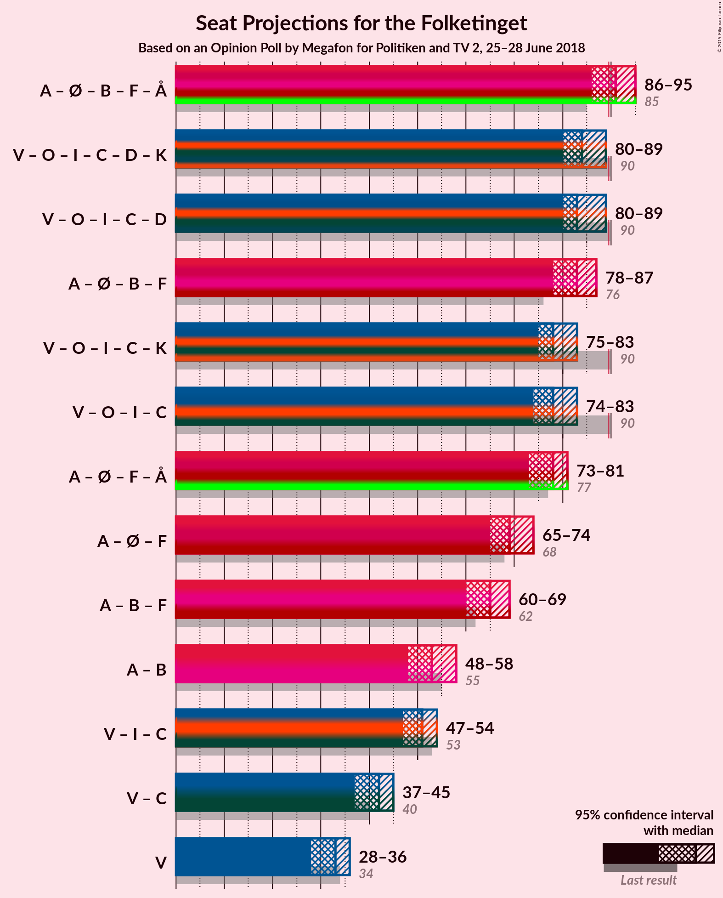

# Opinion Poll by Megafon for Politiken and TV 2, 25–28 June 2018

<a href="#voting-intentions">Voting Intentions</a> | <a href="#seats">Seats</a> | <a href="#coalitions">Coalitions</a> | <a href="#technical-information">Technical Information</a>

## Voting Intentions

### Confidence Intervals

| Party | Last Result | Poll Result | 80% Confidence Interval | 90% Confidence Interval | 95% Confidence Interval | 99% Confidence Interval |
|:-----:|:-----------:|:-----------:|:-----------------------:|:-----------------------:|:-----------------------:|:-----------------------:|
| Socialdemokraterne | 26.3% | 22.9% | 21.3–24.6% |20.8–25.1% |20.4–25.6% |19.7–26.4% |
| Venstre | 19.5% | 18.3% | 16.8–19.9% |16.4–20.4% |16.0–20.8% |15.4–21.6% |
| Dansk Folkeparti | 21.1% | 15.6% | 14.2–17.1% |13.8–17.5% |13.5–17.9% |12.8–18.7% |
| Enhedslisten–De Rød-Grønne | 7.8% | 10.1% | 9.0–11.4% |8.6–11.8% |8.4–12.1% |7.9–12.7% |
| Radikale Venstre | 4.6% | 7.0% | 6.1–8.2% |5.9–8.5% |5.6–8.8% |5.2–9.4% |
| Socialistisk Folkeparti | 4.2% | 6.8% | 5.8–7.9% |5.6–8.2% |5.4–8.5% |5.0–9.0% |
| Liberal Alliance | 7.5% | 5.2% | 4.4–6.2% |4.2–6.5% |4.0–6.7% |3.6–7.2% |
| Det Konservative Folkeparti | 3.4% | 5.0% | 4.2–6.0% |4.0–6.3% |3.8–6.5% |3.5–7.0% |
| Alternativet | 4.8% | 4.4% | 3.7–5.3% |3.5–5.6% |3.3–5.9% |3.0–6.3% |
| Nye Borgerlige | 0.0% | 3.4% | 2.8–4.3% |2.6–4.5% |2.5–4.7% |2.2–5.2% |
| Kristendemokraterne | 0.8% | 1.3% | 0.9–1.9% |0.8–2.0% |0.7–2.2% |0.6–2.5% |

*Note:* The poll result column reflects the actual value used in the calculations. Published results may vary slightly, and in addition be rounded to fewer digits.

## Seats

### Confidence Intervals

| Party | Last Result | Median | 80% Confidence Interval | 90% Confidence Interval | 95% Confidence Interval | 99% Confidence Interval |
|:-----:|:-----------:|:------:|:-----------------------:|:-----------------------:|:-----------------------:|:-----------------------:|
| <a href="#socialdemokraterne">Socialdemokraterne</a> | 47 | 40 | 37–44 |37–44 |37–45 |35–47 |
| <a href="#venstre">Venstre</a> | 34 | 33 | 30–35 |29–35 |28–36 |27–37 |
| <a href="#dansk-folkeparti">Dansk Folkeparti</a> | 37 | 27 | 25–29 |24–29 |24–31 |23–32 |
| <a href="#enhedslisten–de-rød-grønne">Enhedslisten–De Rød-Grønne</a> | 14 | 18 | 16–20 |16–22 |15–22 |14–22 |
| <a href="#radikale-venstre">Radikale Venstre</a> | 8 | 13 | 12–14 |11–14 |10–15 |9–16 |
| <a href="#socialistisk-folkeparti">Socialistisk Folkeparti</a> | 7 | 11 | 10–14 |10–14 |9–14 |9–16 |
| <a href="#liberal-alliance">Liberal Alliance</a> | 13 | 9 | 8–10 |7–11 |7–12 |7–12 |
| <a href="#det-konservative-folkeparti">Det Konservative Folkeparti</a> | 6 | 9 | 8–10 |7–10 |7–11 |7–12 |
| <a href="#alternativet">Alternativet</a> | 9 | 9 | 7–10 |6–10 |6–10 |6–11 |
| <a href="#nye-borgerlige">Nye Borgerlige</a> | 0 | 6 | 5–7 |4–7 |4–8 |4–9 |
| <a href="#kristendemokraterne">Kristendemokraterne</a> | 0 | 0 | 0 |0 |0–4 |0–4 |

### Socialdemokraterne

*For a full overview of the results for this party, see the [Socialdemokraterne](party-socialdemokraterne.html) page.*

| Number of Seats | Probability | Accumulated | Special Marks |
|:---------------:|:-----------:|:-----------:|:-------------:|
| 34 | 0.1% | 100% |  |
| 35 | 0.6% | 99.9% |  |
| 36 | 2% | 99.2% |  |
| 37 | 22% | 98% |  |
| 38 | 3% | 75% |  |
| 39 | 22% | 73% |  |
| 40 | 9% | 51% | Median |
| 41 | 20% | 42% |  |
| 42 | 5% | 22% |  |
| 43 | 3% | 17% |  |
| 44 | 12% | 14% |  |
| 45 | 2% | 3% |  |
| 46 | 0.3% | 0.9% |  |
| 47 | 0.5% | 0.6% | Last Result |
| 48 | 0% | 0% |  |

### Venstre

*For a full overview of the results for this party, see the [Venstre](party-venstre.html) page.*

| Number of Seats | Probability | Accumulated | Special Marks |
|:---------------:|:-----------:|:-----------:|:-------------:|
| 26 | 0.1% | 100% |  |
| 27 | 0.9% | 99.9% |  |
| 28 | 3% | 99.0% |  |
| 29 | 1.1% | 96% |  |
| 30 | 26% | 95% |  |
| 31 | 11% | 69% |  |
| 32 | 3% | 58% |  |
| 33 | 36% | 55% | Median |
| 34 | 3% | 19% | Last Result |
| 35 | 11% | 16% |  |
| 36 | 3% | 5% |  |
| 37 | 0.7% | 1.0% |  |
| 38 | 0.1% | 0.3% |  |
| 39 | 0.2% | 0.3% |  |
| 40 | 0% | 0% |  |

### Dansk Folkeparti

*For a full overview of the results for this party, see the [Dansk Folkeparti](party-danskfolkeparti.html) page.*

| Number of Seats | Probability | Accumulated | Special Marks |
|:---------------:|:-----------:|:-----------:|:-------------:|
| 22 | 0.3% | 100% |  |
| 23 | 0.4% | 99.6% |  |
| 24 | 6% | 99.3% |  |
| 25 | 13% | 93% |  |
| 26 | 9% | 81% |  |
| 27 | 31% | 72% | Median |
| 28 | 11% | 41% |  |
| 29 | 26% | 31% |  |
| 30 | 1.1% | 5% |  |
| 31 | 1.2% | 4% |  |
| 32 | 2% | 2% |  |
| 33 | 0.1% | 0.3% |  |
| 34 | 0.1% | 0.1% |  |
| 35 | 0% | 0% |  |
| 36 | 0% | 0% |  |
| 37 | 0% | 0% | Last Result |

### Enhedslisten–De Rød-Grønne

*For a full overview of the results for this party, see the [Enhedslisten–De Rød-Grønne](party-enhedslisten–derød-grønne.html) page.*

| Number of Seats | Probability | Accumulated | Special Marks |
|:---------------:|:-----------:|:-----------:|:-------------:|
| 13 | 0.1% | 100% |  |
| 14 | 1.4% | 99.9% | Last Result |
| 15 | 3% | 98.5% |  |
| 16 | 10% | 96% |  |
| 17 | 23% | 86% |  |
| 18 | 28% | 63% | Median |
| 19 | 2% | 35% |  |
| 20 | 24% | 33% |  |
| 21 | 1.0% | 9% |  |
| 22 | 7% | 8% |  |
| 23 | 0.4% | 0.4% |  |
| 24 | 0% | 0% |  |

### Radikale Venstre

*For a full overview of the results for this party, see the [Radikale Venstre](party-radikalevenstre.html) page.*

| Number of Seats | Probability | Accumulated | Special Marks |
|:---------------:|:-----------:|:-----------:|:-------------:|
| 8 | 0% | 100% | Last Result |
| 9 | 0.9% | 100% |  |
| 10 | 2% | 99.1% |  |
| 11 | 7% | 97% |  |
| 12 | 38% | 90% |  |
| 13 | 12% | 52% | Median |
| 14 | 35% | 40% |  |
| 15 | 4% | 5% |  |
| 16 | 0.5% | 0.7% |  |
| 17 | 0.1% | 0.2% |  |
| 18 | 0.1% | 0.1% |  |
| 19 | 0% | 0% |  |

### Socialistisk Folkeparti

*For a full overview of the results for this party, see the [Socialistisk Folkeparti](party-socialistiskfolkeparti.html) page.*

| Number of Seats | Probability | Accumulated | Special Marks |
|:---------------:|:-----------:|:-----------:|:-------------:|
| 7 | 0% | 100% | Last Result |
| 8 | 0.2% | 100% |  |
| 9 | 4% | 99.8% |  |
| 10 | 17% | 95% |  |
| 11 | 37% | 79% | Median |
| 12 | 24% | 42% |  |
| 13 | 7% | 18% |  |
| 14 | 9% | 10% |  |
| 15 | 0.9% | 1.5% |  |
| 16 | 0.6% | 0.6% |  |
| 17 | 0% | 0% |  |

### Liberal Alliance

*For a full overview of the results for this party, see the [Liberal Alliance](party-liberalalliance.html) page.*

| Number of Seats | Probability | Accumulated | Special Marks |
|:---------------:|:-----------:|:-----------:|:-------------:|
| 6 | 0.1% | 100% |  |
| 7 | 7% | 99.9% |  |
| 8 | 35% | 93% |  |
| 9 | 15% | 58% | Median |
| 10 | 33% | 43% |  |
| 11 | 5% | 10% |  |
| 12 | 4% | 4% |  |
| 13 | 0.2% | 0.3% | Last Result |
| 14 | 0.1% | 0.1% |  |
| 15 | 0% | 0% |  |

### Det Konservative Folkeparti

*For a full overview of the results for this party, see the [Det Konservative Folkeparti](party-detkonservativefolkeparti.html) page.*

| Number of Seats | Probability | Accumulated | Special Marks |
|:---------------:|:-----------:|:-----------:|:-------------:|
| 6 | 0.3% | 100% | Last Result |
| 7 | 6% | 99.6% |  |
| 8 | 14% | 94% |  |
| 9 | 53% | 80% | Median |
| 10 | 22% | 27% |  |
| 11 | 3% | 5% |  |
| 12 | 2% | 2% |  |
| 13 | 0.1% | 0.1% |  |
| 14 | 0% | 0% |  |

### Alternativet

*For a full overview of the results for this party, see the [Alternativet](party-alternativet.html) page.*

| Number of Seats | Probability | Accumulated | Special Marks |
|:---------------:|:-----------:|:-----------:|:-------------:|
| 5 | 0.2% | 100% |  |
| 6 | 7% | 99.7% |  |
| 7 | 13% | 92% |  |
| 8 | 13% | 79% |  |
| 9 | 52% | 66% | Last Result, Median |
| 10 | 14% | 15% |  |
| 11 | 1.1% | 1.2% |  |
| 12 | 0% | 0.1% |  |
| 13 | 0% | 0% |  |

### Nye Borgerlige

*For a full overview of the results for this party, see the [Nye Borgerlige](party-nyeborgerlige.html) page.*

| Number of Seats | Probability | Accumulated | Special Marks |
|:---------------:|:-----------:|:-----------:|:-------------:|
| 0 | 0% | 100% | Last Result |
| 1 | 0% | 100% |  |
| 2 | 0% | 100% |  |
| 3 | 0% | 100% |  |
| 4 | 8% | 100% |  |
| 5 | 11% | 92% |  |
| 6 | 35% | 81% | Median |
| 7 | 43% | 46% |  |
| 8 | 2% | 3% |  |
| 9 | 0.4% | 0.8% |  |
| 10 | 0.4% | 0.4% |  |
| 11 | 0% | 0% |  |

### Kristendemokraterne

*For a full overview of the results for this party, see the [Kristendemokraterne](party-kristendemokraterne.html) page.*

| Number of Seats | Probability | Accumulated | Special Marks |
|:---------------:|:-----------:|:-----------:|:-------------:|
| 0 | 97% | 100% | Last Result, Median |
| 1 | 0% | 3% |  |
| 2 | 0% | 3% |  |
| 3 | 0% | 3% |  |
| 4 | 3% | 3% |  |
| 5 | 0.3% | 0.3% |  |
| 6 | 0% | 0% |  |

## Coalitions

### Confidence Intervals

| Coalition | Last Result | Median | Majority? | 80% Confidence Interval | 90% Confidence Interval | 95% Confidence Interval | 99% Confidence Interval |
|:---------:|:-----------:|:------:|:---------:|:-----------------------:|:-----------------------:|:-----------------------:|:-----------------------:|
| Socialdemokraterne – Enhedslisten–De Rød-Grønne – Radikale Venstre – Socialistisk Folkeparti – Alternativet | 85 | 91 | 68% | 89–93 | 88–95 | 86–95 | 83–97 |
| Venstre – Dansk Folkeparti – Liberal Alliance – Det Konservative Folkeparti – Nye Borgerlige – Kristendemokraterne | 90 | 84 | 2% | 82–86 | 80–87 | 80–89 | 78–92 |
| Venstre – Dansk Folkeparti – Liberal Alliance – Det Konservative Folkeparti – Nye Borgerlige | 90 | 83 | 1.2% | 81–86 | 80–86 | 80–89 | 77–90 |
| Socialdemokraterne – Enhedslisten–De Rød-Grønne – Radikale Venstre – Socialistisk Folkeparti | 76 | 83 | 0.3% | 80–86 | 80–86 | 78–87 | 76–89 |
| Venstre – Dansk Folkeparti – Liberal Alliance – Det Konservative Folkeparti – Kristendemokraterne | 90 | 78 | 0% | 76–79 | 76–81 | 75–83 | 72–85 |
| Venstre – Dansk Folkeparti – Liberal Alliance – Det Konservative Folkeparti | 90 | 78 | 0% | 76–79 | 76–81 | 74–83 | 71–84 |
| Socialdemokraterne – Enhedslisten–De Rød-Grønne – Socialistisk Folkeparti – Alternativet | 77 | 78 | 0% | 76–81 | 76–81 | 73–81 | 71–84 |
| Socialdemokraterne – Enhedslisten–De Rød-Grønne – Socialistisk Folkeparti | 68 | 69 | 0% | 68–73 | 67–73 | 65–74 | 63–76 |
| Socialdemokraterne – Radikale Venstre – Socialistisk Folkeparti | 62 | 65 | 0% | 60–68 | 60–68 | 60–69 | 58–71 |
| Socialdemokraterne – Radikale Venstre | 55 | 53 | 0% | 49–56 | 49–58 | 48–58 | 47–59 |
| Venstre – Liberal Alliance – Det Konservative Folkeparti | 53 | 51 | 0% | 47–53 | 47–54 | 47–54 | 43–57 |
| Venstre – Det Konservative Folkeparti | 40 | 42 | 0% | 39–44 | 38–45 | 37–45 | 35–47 |
| Venstre | 34 | 33 | 0% | 30–35 | 29–35 | 28–36 | 27–37 |

### Socialdemokraterne – Enhedslisten–De Rød-Grønne – Radikale Venstre – Socialistisk Folkeparti – Alternativet

| Number of Seats | Probability | Accumulated | Special Marks |
|:---------------:|:-----------:|:-----------:|:-------------:|
| 82 | 0.4% | 100% |  |
| 83 | 0.2% | 99.6% |  |
| 84 | 0.1% | 99.4% |  |
| 85 | 0.9% | 99.3% | Last Result |
| 86 | 1.3% | 98% |  |
| 87 | 1.0% | 97% |  |
| 88 | 2% | 96% |  |
| 89 | 26% | 94% |  |
| 90 | 4% | 68% | Majority |
| 91 | 16% | 64% | Median |
| 92 | 24% | 48% |  |
| 93 | 15% | 24% |  |
| 94 | 1.5% | 9% |  |
| 95 | 6% | 8% |  |
| 96 | 0.5% | 1.3% |  |
| 97 | 0.3% | 0.7% |  |
| 98 | 0.4% | 0.4% |  |
| 99 | 0% | 0.1% |  |
| 100 | 0% | 0% |  |

### Venstre – Dansk Folkeparti – Liberal Alliance – Det Konservative Folkeparti – Nye Borgerlige – Kristendemokraterne

| Number of Seats | Probability | Accumulated | Special Marks |
|:---------------:|:-----------:|:-----------:|:-------------:|
| 76 | 0% | 100% |  |
| 77 | 0.4% | 99.9% |  |
| 78 | 0.3% | 99.6% |  |
| 79 | 0.5% | 99.3% |  |
| 80 | 6% | 98.7% |  |
| 81 | 1.5% | 92% |  |
| 82 | 15% | 91% |  |
| 83 | 24% | 76% |  |
| 84 | 16% | 52% | Median |
| 85 | 4% | 36% |  |
| 86 | 26% | 32% |  |
| 87 | 2% | 6% |  |
| 88 | 1.0% | 4% |  |
| 89 | 1.3% | 3% |  |
| 90 | 0.9% | 2% | Last Result, Majority |
| 91 | 0.1% | 0.7% |  |
| 92 | 0.2% | 0.6% |  |
| 93 | 0.4% | 0.4% |  |
| 94 | 0% | 0% |  |

### Venstre – Dansk Folkeparti – Liberal Alliance – Det Konservative Folkeparti – Nye Borgerlige

| Number of Seats | Probability | Accumulated | Special Marks |
|:---------------:|:-----------:|:-----------:|:-------------:|
| 76 | 0.2% | 100% |  |
| 77 | 0.4% | 99.8% |  |
| 78 | 0.3% | 99.4% |  |
| 79 | 0.6% | 99.0% |  |
| 80 | 7% | 98% |  |
| 81 | 2% | 91% |  |
| 82 | 15% | 89% |  |
| 83 | 25% | 75% |  |
| 84 | 15% | 50% | Median |
| 85 | 4% | 35% |  |
| 86 | 26% | 31% |  |
| 87 | 1.3% | 5% |  |
| 88 | 0.9% | 4% |  |
| 89 | 1.5% | 3% |  |
| 90 | 0.9% | 1.2% | Last Result, Majority |
| 91 | 0.1% | 0.3% |  |
| 92 | 0.2% | 0.2% |  |
| 93 | 0% | 0% |  |

### Socialdemokraterne – Enhedslisten–De Rød-Grønne – Radikale Venstre – Socialistisk Folkeparti

| Number of Seats | Probability | Accumulated | Special Marks |
|:---------------:|:-----------:|:-----------:|:-------------:|
| 74 | 0.3% | 100% |  |
| 75 | 0.1% | 99.6% |  |
| 76 | 0.7% | 99.6% | Last Result |
| 77 | 0.7% | 98.9% |  |
| 78 | 1.5% | 98% |  |
| 79 | 1.2% | 97% |  |
| 80 | 26% | 95% |  |
| 81 | 3% | 70% |  |
| 82 | 5% | 67% | Median |
| 83 | 30% | 62% |  |
| 84 | 14% | 33% |  |
| 85 | 8% | 19% |  |
| 86 | 7% | 10% |  |
| 87 | 2% | 3% |  |
| 88 | 0.3% | 1.0% |  |
| 89 | 0.3% | 0.7% |  |
| 90 | 0.3% | 0.3% | Majority |
| 91 | 0% | 0.1% |  |
| 92 | 0% | 0% |  |

### Venstre – Dansk Folkeparti – Liberal Alliance – Det Konservative Folkeparti – Kristendemokraterne

| Number of Seats | Probability | Accumulated | Special Marks |
|:---------------:|:-----------:|:-----------:|:-------------:|
| 71 | 0.4% | 100% |  |
| 72 | 0.5% | 99.5% |  |
| 73 | 0.4% | 99.1% |  |
| 74 | 0.4% | 98.6% |  |
| 75 | 2% | 98% |  |
| 76 | 34% | 97% |  |
| 77 | 7% | 62% |  |
| 78 | 23% | 56% | Median |
| 79 | 26% | 33% |  |
| 80 | 1.5% | 8% |  |
| 81 | 1.4% | 6% |  |
| 82 | 2% | 5% |  |
| 83 | 2% | 3% |  |
| 84 | 0.5% | 1.2% |  |
| 85 | 0.2% | 0.7% |  |
| 86 | 0.1% | 0.5% |  |
| 87 | 0% | 0.4% |  |
| 88 | 0.3% | 0.3% |  |
| 89 | 0% | 0% |  |
| 90 | 0% | 0% | Last Result, Majority |

### Venstre – Dansk Folkeparti – Liberal Alliance – Det Konservative Folkeparti

| Number of Seats | Probability | Accumulated | Special Marks |
|:---------------:|:-----------:|:-----------:|:-------------:|
| 70 | 0.2% | 100% |  |
| 71 | 0.4% | 99.8% |  |
| 72 | 0.5% | 99.4% |  |
| 73 | 0.7% | 98.8% |  |
| 74 | 1.5% | 98% |  |
| 75 | 2% | 97% |  |
| 76 | 34% | 95% |  |
| 77 | 6% | 61% |  |
| 78 | 22% | 55% | Median |
| 79 | 26% | 32% |  |
| 80 | 1.3% | 7% |  |
| 81 | 1.4% | 5% |  |
| 82 | 1.2% | 4% |  |
| 83 | 2% | 3% |  |
| 84 | 0.8% | 1.1% |  |
| 85 | 0.2% | 0.3% |  |
| 86 | 0.1% | 0.1% |  |
| 87 | 0% | 0% |  |
| 88 | 0% | 0% |  |
| 89 | 0% | 0% |  |
| 90 | 0% | 0% | Last Result, Majority |

### Socialdemokraterne – Enhedslisten–De Rød-Grønne – Socialistisk Folkeparti – Alternativet

| Number of Seats | Probability | Accumulated | Special Marks |
|:---------------:|:-----------:|:-----------:|:-------------:|
| 69 | 0% | 100% |  |
| 70 | 0.1% | 99.9% |  |
| 71 | 0.9% | 99.8% |  |
| 72 | 0.2% | 99.0% |  |
| 73 | 1.5% | 98.7% |  |
| 74 | 1.0% | 97% |  |
| 75 | 1.2% | 96% |  |
| 76 | 7% | 95% |  |
| 77 | 24% | 88% | Last Result |
| 78 | 17% | 65% | Median |
| 79 | 30% | 48% |  |
| 80 | 6% | 18% |  |
| 81 | 10% | 12% |  |
| 82 | 1.1% | 2% |  |
| 83 | 0.4% | 1.3% |  |
| 84 | 0.5% | 0.8% |  |
| 85 | 0.1% | 0.4% |  |
| 86 | 0.1% | 0.3% |  |
| 87 | 0.1% | 0.1% |  |
| 88 | 0% | 0% |  |

### Socialdemokraterne – Enhedslisten–De Rød-Grønne – Socialistisk Folkeparti

| Number of Seats | Probability | Accumulated | Special Marks |
|:---------------:|:-----------:|:-----------:|:-------------:|
| 62 | 0.1% | 100% |  |
| 63 | 0.9% | 99.9% |  |
| 64 | 0.3% | 99.0% |  |
| 65 | 2% | 98.7% |  |
| 66 | 2% | 97% |  |
| 67 | 5% | 95% |  |
| 68 | 25% | 91% | Last Result |
| 69 | 27% | 66% | Median |
| 70 | 1.4% | 38% |  |
| 71 | 8% | 37% |  |
| 72 | 19% | 29% |  |
| 73 | 5% | 10% |  |
| 74 | 3% | 5% |  |
| 75 | 0.3% | 1.3% |  |
| 76 | 0.8% | 1.0% |  |
| 77 | 0.2% | 0.3% |  |
| 78 | 0.1% | 0.1% |  |
| 79 | 0% | 0% |  |

### Socialdemokraterne – Radikale Venstre – Socialistisk Folkeparti

| Number of Seats | Probability | Accumulated | Special Marks |
|:---------------:|:-----------:|:-----------:|:-------------:|
| 57 | 0% | 100% |  |
| 58 | 0.5% | 99.9% |  |
| 59 | 1.0% | 99.4% |  |
| 60 | 21% | 98% |  |
| 61 | 2% | 77% |  |
| 62 | 9% | 75% | Last Result |
| 63 | 5% | 66% |  |
| 64 | 6% | 61% | Median |
| 65 | 18% | 55% |  |
| 66 | 12% | 37% |  |
| 67 | 1.3% | 24% |  |
| 68 | 19% | 23% |  |
| 69 | 2% | 4% |  |
| 70 | 1.3% | 2% |  |
| 71 | 0.5% | 0.9% |  |
| 72 | 0.1% | 0.4% |  |
| 73 | 0.2% | 0.3% |  |
| 74 | 0% | 0.1% |  |
| 75 | 0% | 0% |  |

### Socialdemokraterne – Radikale Venstre

| Number of Seats | Probability | Accumulated | Special Marks |
|:---------------:|:-----------:|:-----------:|:-------------:|
| 46 | 0.4% | 100% |  |
| 47 | 0.1% | 99.5% |  |
| 48 | 2% | 99.4% |  |
| 49 | 22% | 97% |  |
| 50 | 0.7% | 75% |  |
| 51 | 4% | 74% |  |
| 52 | 12% | 71% |  |
| 53 | 17% | 59% | Median |
| 54 | 12% | 41% |  |
| 55 | 11% | 29% | Last Result |
| 56 | 9% | 18% |  |
| 57 | 1.4% | 8% |  |
| 58 | 6% | 7% |  |
| 59 | 0.6% | 0.7% |  |
| 60 | 0.1% | 0.1% |  |
| 61 | 0% | 0% |  |

### Venstre – Liberal Alliance – Det Konservative Folkeparti

| Number of Seats | Probability | Accumulated | Special Marks |
|:---------------:|:-----------:|:-----------:|:-------------:|
| 43 | 1.0% | 100% |  |
| 44 | 0.2% | 98.9% |  |
| 45 | 0.2% | 98.7% |  |
| 46 | 0.8% | 98% |  |
| 47 | 16% | 98% |  |
| 48 | 8% | 82% |  |
| 49 | 13% | 73% |  |
| 50 | 5% | 61% |  |
| 51 | 18% | 56% | Median |
| 52 | 26% | 38% |  |
| 53 | 3% | 11% | Last Result |
| 54 | 7% | 9% |  |
| 55 | 0.8% | 2% |  |
| 56 | 0.2% | 1.1% |  |
| 57 | 0.7% | 0.9% |  |
| 58 | 0.2% | 0.2% |  |
| 59 | 0% | 0% |  |

### Venstre – Det Konservative Folkeparti

| Number of Seats | Probability | Accumulated | Special Marks |
|:---------------:|:-----------:|:-----------:|:-------------:|
| 34 | 0% | 100% |  |
| 35 | 1.2% | 99.9% |  |
| 36 | 0.1% | 98.8% |  |
| 37 | 3% | 98.6% |  |
| 38 | 4% | 96% |  |
| 39 | 29% | 91% |  |
| 40 | 4% | 63% | Last Result |
| 41 | 4% | 59% |  |
| 42 | 25% | 55% | Median |
| 43 | 15% | 31% |  |
| 44 | 9% | 16% |  |
| 45 | 6% | 8% |  |
| 46 | 0.3% | 2% |  |
| 47 | 0.9% | 1.3% |  |
| 48 | 0.3% | 0.3% |  |
| 49 | 0% | 0% |  |

### Venstre

| Number of Seats | Probability | Accumulated | Special Marks |
|:---------------:|:-----------:|:-----------:|:-------------:|
| 26 | 0.1% | 100% |  |
| 27 | 0.9% | 99.9% |  |
| 28 | 3% | 99.0% |  |
| 29 | 1.1% | 96% |  |
| 30 | 26% | 95% |  |
| 31 | 11% | 69% |  |
| 32 | 3% | 58% |  |
| 33 | 36% | 55% | Median |
| 34 | 3% | 19% | Last Result |
| 35 | 11% | 16% |  |
| 36 | 3% | 5% |  |
| 37 | 0.7% | 1.0% |  |
| 38 | 0.1% | 0.3% |  |
| 39 | 0.2% | 0.3% |  |
| 40 | 0% | 0% |  |

## Technical Information

### Opinion Poll

+ **Polling firm:** Megafon
+ **Commissioner(s):** Politiken and TV 2
+ **Fieldwork period:** 25–28 June 2018

### Calculations

+ **Sample size:** 1022
+ **Simulations done:** 1,048,576
+ **Error estimate:** 2.13%

