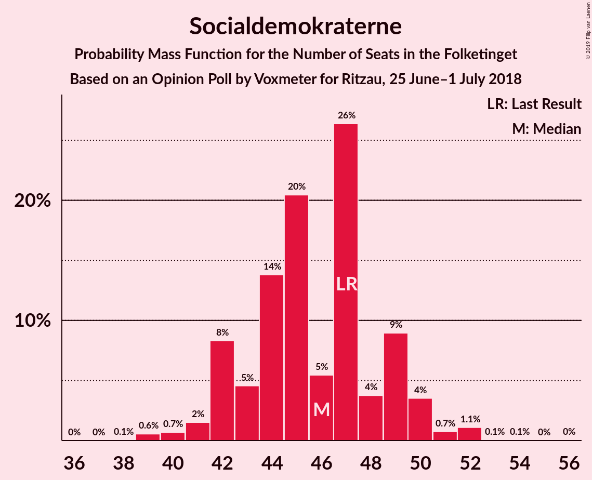
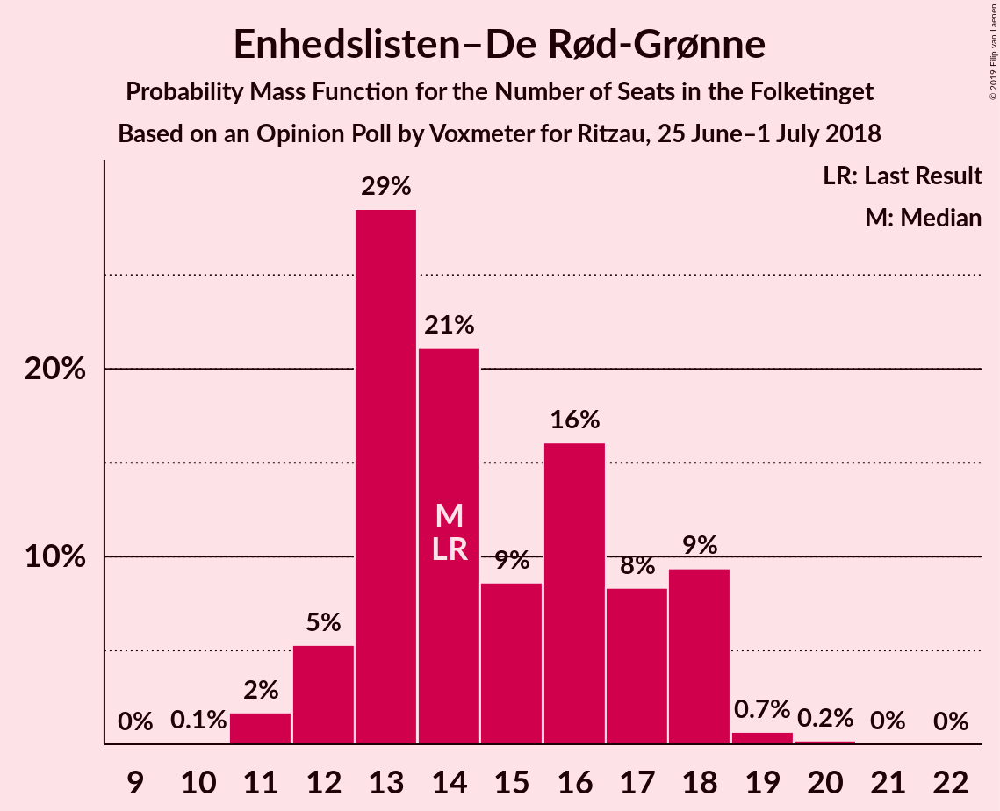
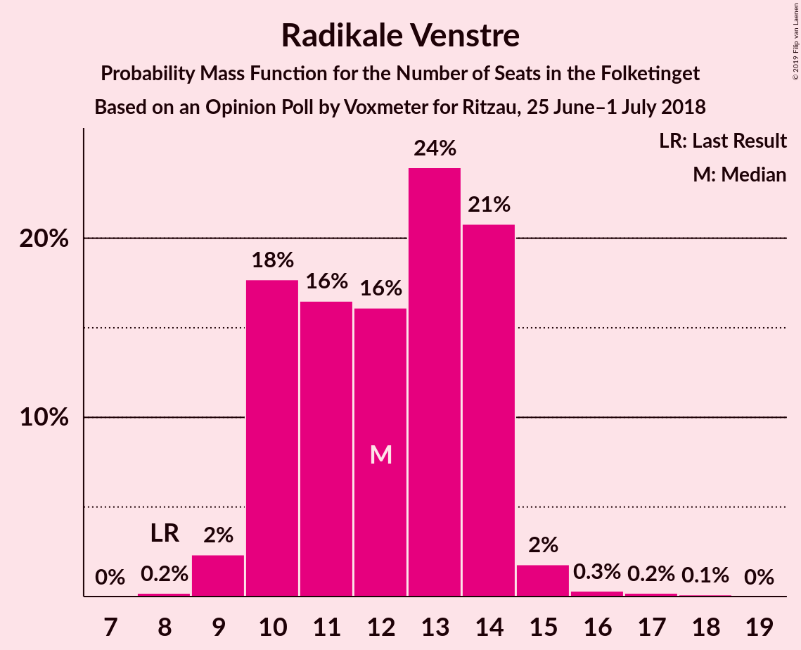
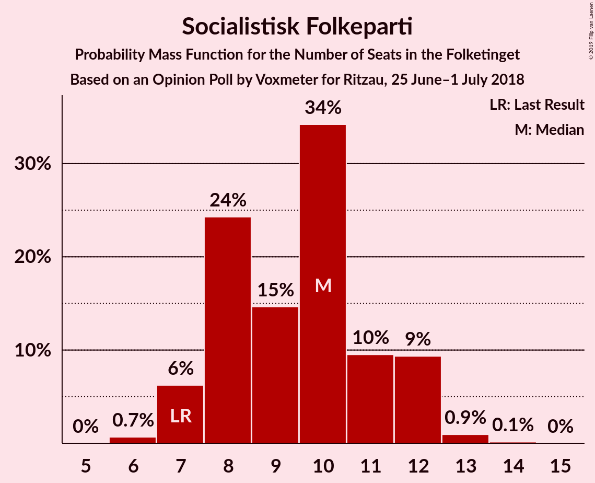
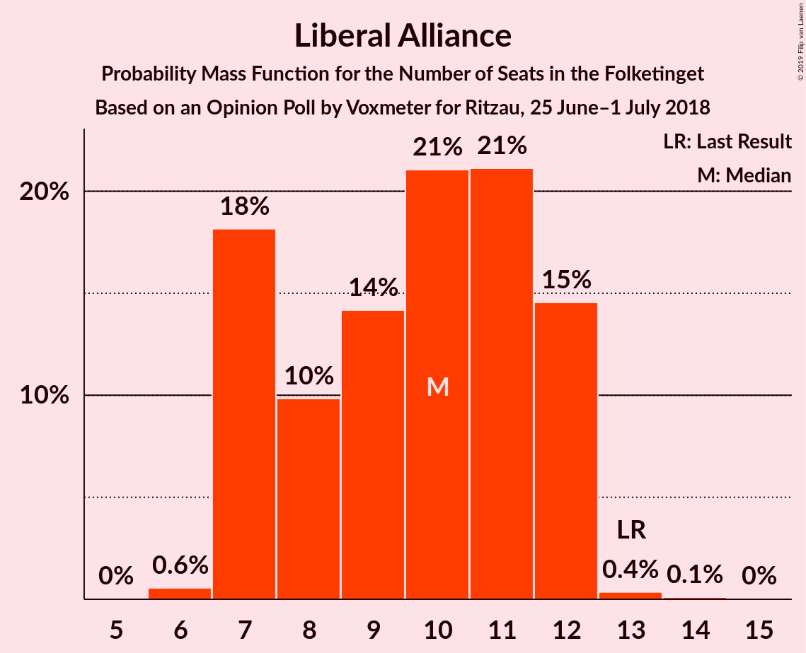

# Opinion Poll by Voxmeter for Ritzau, 25 June–1 July 2018

<a href="#voting-intentions">Voting Intentions</a> | <a href="#seats">Seats</a> | <a href="#coalitions">Coalitions</a> | <a href="#technical-information">Technical Information</a>

## Voting Intentions

### Confidence Intervals

| Party | Last Result | Poll Result | 80% Confidence Interval | 90% Confidence Interval | 95% Confidence Interval | 99% Confidence Interval |
|:-----:|:-----------:|:-----------:|:-----------------------:|:-----------------------:|:-----------------------:|:-----------------------:|
| Socialdemokraterne | 26.3% | 25.7% | 24.0–27.5% |23.5–28.0% |23.1–28.5% |22.3–29.3% |
| Dansk Folkeparti | 21.1% | 19.8% | 18.3–21.5% |17.8–21.9% |17.5–22.3% |16.8–23.2% |
| Venstre | 19.5% | 19.3% | 17.8–21.0% |17.4–21.4% |17.0–21.8% |16.3–22.6% |
| Enhedslisten–De Rød-Grønne | 7.8% | 8.2% | 7.2–9.4% |7.0–9.8% |6.7–10.1% |6.3–10.7% |
| Radikale Venstre | 4.6% | 6.8% | 5.9–7.9% |5.6–8.2% |5.4–8.5% |5.0–9.1% |
| Socialistisk Folkeparti | 4.2% | 5.3% | 4.5–6.3% |4.3–6.6% |4.1–6.9% |3.8–7.4% |
| Liberal Alliance | 7.5% | 5.1% | 4.4–6.1% |4.1–6.4% |3.9–6.7% |3.6–7.2% |
| Alternativet | 4.8% | 4.1% | 3.4–5.0% |3.2–5.2% |3.0–5.5% |2.7–5.9% |
| Det Konservative Folkeparti | 3.4% | 3.6% | 2.9–4.5% |2.8–4.7% |2.6–4.9% |2.3–5.4% |
| Nye Borgerlige | 0.0% | 1.0% | 0.7–1.5% |0.6–1.6% |0.5–1.8% |0.4–2.1% |
| Kristendemokraterne | 0.8% | 0.9% | 0.6–1.4% |0.5–1.5% |0.5–1.7% |0.4–1.9% |

*Note:* The poll result column reflects the actual value used in the calculations. Published results may vary slightly, and in addition be rounded to fewer digits.

## Seats

### Confidence Intervals

| Party | Last Result | Median | 80% Confidence Interval | 90% Confidence Interval | 95% Confidence Interval | 99% Confidence Interval |
|:-----:|:-----------:|:------:|:-----------------------:|:-----------------------:|:-----------------------:|:-----------------------:|
| <a href="#socialdemokraterne">Socialdemokraterne</a> | 47 | 46 | 42–49 |42–50 |41–50 |39–52 |
| <a href="#dansk-folkeparti">Dansk Folkeparti</a> | 37 | 35 | 32–39 |30–39 |30–40 |30–41 |
| <a href="#venstre">Venstre</a> | 34 | 34 | 31–37 |30–38 |30–39 |29–42 |
| <a href="#enhedslisten–de-rød-grønne">Enhedslisten–De Rød-Grønne</a> | 14 | 14 | 13–18 |12–18 |12–18 |11–19 |
| <a href="#radikale-venstre">Radikale Venstre</a> | 8 | 12 | 10–14 |10–14 |9–14 |9–16 |
| <a href="#socialistisk-folkeparti">Socialistisk Folkeparti</a> | 7 | 10 | 8–12 |7–12 |7–12 |6–13 |
| <a href="#liberal-alliance">Liberal Alliance</a> | 13 | 10 | 7–12 |7–12 |7–12 |6–13 |
| <a href="#alternativet">Alternativet</a> | 9 | 7 | 6–9 |6–9 |5–9 |5–10 |
| <a href="#det-konservative-folkeparti">Det Konservative Folkeparti</a> | 6 | 7 | 5–9 |5–9 |5–9 |4–10 |
| <a href="#nye-borgerlige">Nye Borgerlige</a> | 0 | 0 | 0 |0 |0 |0–4 |
| <a href="#kristendemokraterne">Kristendemokraterne</a> | 0 | 0 | 0 |0 |0 |0–4 |

### Socialdemokraterne

*For a full overview of the results for this party, see the [Socialdemokraterne](party-socialdemokraterne.html) page.*

| Number of Seats | Probability | Accumulated | Special Marks |
|:---------------:|:-----------:|:-----------:|:-------------:|
| 38 | 0.1% | 100% |  |
| 39 | 0.6% | 99.9% |  |
| 40 | 0.7% | 99.4% |  |
| 41 | 2% | 98.7% |  |
| 42 | 8% | 97% |  |
| 43 | 5% | 89% |  |
| 44 | 14% | 84% |  |
| 45 | 20% | 70% |  |
| 46 | 5% | 50% | Median |
| 47 | 26% | 45% | Last Result |
| 48 | 4% | 18% |  |
| 49 | 9% | 14% |  |
| 50 | 4% | 6% |  |
| 51 | 0.7% | 2% |  |
| 52 | 1.1% | 1.2% |  |
| 53 | 0.1% | 0.2% |  |
| 54 | 0.1% | 0.1% |  |
| 55 | 0% | 0% |  |

### Dansk Folkeparti

*For a full overview of the results for this party, see the [Dansk Folkeparti](party-danskfolkeparti.html) page.*

| Number of Seats | Probability | Accumulated | Special Marks |
|:---------------:|:-----------:|:-----------:|:-------------:|
| 28 | 0% | 100% |  |
| 29 | 0.3% | 99.9% |  |
| 30 | 5% | 99.7% |  |
| 31 | 4% | 95% |  |
| 32 | 9% | 91% |  |
| 33 | 11% | 82% |  |
| 34 | 12% | 71% |  |
| 35 | 18% | 60% | Median |
| 36 | 13% | 41% |  |
| 37 | 9% | 28% | Last Result |
| 38 | 8% | 19% |  |
| 39 | 9% | 12% |  |
| 40 | 1.3% | 3% |  |
| 41 | 1.2% | 2% |  |
| 42 | 0.4% | 0.5% |  |
| 43 | 0% | 0% |  |

### Venstre

*For a full overview of the results for this party, see the [Venstre](party-venstre.html) page.*

| Number of Seats | Probability | Accumulated | Special Marks |
|:---------------:|:-----------:|:-----------:|:-------------:|
| 27 | 0.1% | 100% |  |
| 28 | 0.2% | 99.9% |  |
| 29 | 1.2% | 99.7% |  |
| 30 | 5% | 98% |  |
| 31 | 8% | 93% |  |
| 32 | 9% | 86% |  |
| 33 | 22% | 77% |  |
| 34 | 13% | 54% | Last Result, Median |
| 35 | 9% | 41% |  |
| 36 | 20% | 32% |  |
| 37 | 5% | 12% |  |
| 38 | 3% | 6% |  |
| 39 | 2% | 4% |  |
| 40 | 0.9% | 2% |  |
| 41 | 0.3% | 1.0% |  |
| 42 | 0.7% | 0.7% |  |
| 43 | 0% | 0% |  |

### Enhedslisten–De Rød-Grønne

*For a full overview of the results for this party, see the [Enhedslisten–De Rød-Grønne](party-enhedslisten–derød-grønne.html) page.*

| Number of Seats | Probability | Accumulated | Special Marks |
|:---------------:|:-----------:|:-----------:|:-------------:|
| 10 | 0.1% | 100% |  |
| 11 | 2% | 99.9% |  |
| 12 | 5% | 98% |  |
| 13 | 29% | 93% |  |
| 14 | 21% | 64% | Last Result, Median |
| 15 | 9% | 43% |  |
| 16 | 16% | 35% |  |
| 17 | 8% | 19% |  |
| 18 | 9% | 10% |  |
| 19 | 0.7% | 0.9% |  |
| 20 | 0.2% | 0.3% |  |
| 21 | 0% | 0.1% |  |
| 22 | 0% | 0% |  |

### Radikale Venstre

*For a full overview of the results for this party, see the [Radikale Venstre](party-radikalevenstre.html) page.*

| Number of Seats | Probability | Accumulated | Special Marks |
|:---------------:|:-----------:|:-----------:|:-------------:|
| 8 | 0.2% | 100% | Last Result |
| 9 | 2% | 99.8% |  |
| 10 | 18% | 97% |  |
| 11 | 16% | 80% |  |
| 12 | 16% | 63% | Median |
| 13 | 24% | 47% |  |
| 14 | 21% | 23% |  |
| 15 | 2% | 2% |  |
| 16 | 0.3% | 0.6% |  |
| 17 | 0.2% | 0.3% |  |
| 18 | 0.1% | 0.1% |  |
| 19 | 0% | 0% |  |

### Socialistisk Folkeparti

*For a full overview of the results for this party, see the [Socialistisk Folkeparti](party-socialistiskfolkeparti.html) page.*

| Number of Seats | Probability | Accumulated | Special Marks |
|:---------------:|:-----------:|:-----------:|:-------------:|
| 6 | 0.7% | 100% |  |
| 7 | 6% | 99.3% | Last Result |
| 8 | 24% | 93% |  |
| 9 | 15% | 69% |  |
| 10 | 34% | 54% | Median |
| 11 | 10% | 20% |  |
| 12 | 9% | 10% |  |
| 13 | 0.9% | 1.1% |  |
| 14 | 0.1% | 0.2% |  |
| 15 | 0% | 0% |  |

### Liberal Alliance

*For a full overview of the results for this party, see the [Liberal Alliance](party-liberalalliance.html) page.*

| Number of Seats | Probability | Accumulated | Special Marks |
|:---------------:|:-----------:|:-----------:|:-------------:|
| 6 | 0.6% | 100% |  |
| 7 | 18% | 99.4% |  |
| 8 | 10% | 81% |  |
| 9 | 14% | 71% |  |
| 10 | 21% | 57% | Median |
| 11 | 21% | 36% |  |
| 12 | 15% | 15% |  |
| 13 | 0.4% | 0.5% | Last Result |
| 14 | 0.1% | 0.1% |  |
| 15 | 0% | 0% |  |

### Alternativet

*For a full overview of the results for this party, see the [Alternativet](party-alternativet.html) page.*

| Number of Seats | Probability | Accumulated | Special Marks |
|:---------------:|:-----------:|:-----------:|:-------------:|
| 4 | 0.2% | 100% |  |
| 5 | 3% | 99.8% |  |
| 6 | 23% | 97% |  |
| 7 | 30% | 74% | Median |
| 8 | 27% | 44% |  |
| 9 | 14% | 16% | Last Result |
| 10 | 2% | 2% |  |
| 11 | 0.2% | 0.3% |  |
| 12 | 0.1% | 0.1% |  |
| 13 | 0% | 0% |  |

### Det Konservative Folkeparti

*For a full overview of the results for this party, see the [Det Konservative Folkeparti](party-detkonservativefolkeparti.html) page.*

| Number of Seats | Probability | Accumulated | Special Marks |
|:---------------:|:-----------:|:-----------:|:-------------:|
| 4 | 0.8% | 100% |  |
| 5 | 15% | 99.1% |  |
| 6 | 25% | 85% | Last Result |
| 7 | 26% | 59% | Median |
| 8 | 23% | 34% |  |
| 9 | 10% | 10% |  |
| 10 | 0.5% | 0.6% |  |
| 11 | 0% | 0% |  |

### Nye Borgerlige

*For a full overview of the results for this party, see the [Nye Borgerlige](party-nyeborgerlige.html) page.*

| Number of Seats | Probability | Accumulated | Special Marks |
|:---------------:|:-----------:|:-----------:|:-------------:|
| 0 | 98.8% | 100% | Last Result, Median |
| 1 | 0% | 1.2% |  |
| 2 | 0% | 1.2% |  |
| 3 | 0% | 1.2% |  |
| 4 | 1.1% | 1.1% |  |
| 5 | 0% | 0% |  |

### Kristendemokraterne

*For a full overview of the results for this party, see the [Kristendemokraterne](party-kristendemokraterne.html) page.*

| Number of Seats | Probability | Accumulated | Special Marks |
|:---------------:|:-----------:|:-----------:|:-------------:|
| 0 | 99.4% | 100% | Last Result, Median |
| 1 | 0% | 0.6% |  |
| 2 | 0% | 0.6% |  |
| 3 | 0% | 0.6% |  |
| 4 | 0.6% | 0.6% |  |
| 5 | 0% | 0% |  |

## Coalitions

### Confidence Intervals

| Coalition | Last Result | Median | Majority? | 80% Confidence Interval | 90% Confidence Interval | 95% Confidence Interval | 99% Confidence Interval |
|:---------:|:-----------:|:------:|:---------:|:-----------------------:|:-----------------------:|:-----------------------:|:-----------------------:|
| Socialdemokraterne – Enhedslisten–De Rød-Grønne – Radikale Venstre – Socialistisk Folkeparti – Alternativet | 85 | 89 | 45% | 87–91 | 86–93 | 84–97 | 80–98 |
| Dansk Folkeparti – Venstre – Liberal Alliance – Det Konservative Folkeparti – Nye Borgerlige – Kristendemokraterne | 90 | 86 | 4% | 84–88 | 82–89 | 78–91 | 77–95 |
| Dansk Folkeparti – Venstre – Liberal Alliance – Det Konservative Folkeparti – Kristendemokraterne | 90 | 86 | 4% | 84–88 | 81–89 | 78–91 | 77–95 |
| Dansk Folkeparti – Venstre – Liberal Alliance – Det Konservative Folkeparti – Nye Borgerlige | 90 | 86 | 4% | 84–88 | 82–89 | 78–91 | 77–95 |
| Dansk Folkeparti – Venstre – Liberal Alliance – Det Konservative Folkeparti | 90 | 86 | 4% | 84–88 | 81–89 | 78–91 | 77–95 |
| Socialdemokraterne – Enhedslisten–De Rød-Grønne – Radikale Venstre – Socialistisk Folkeparti | 76 | 82 | 0.9% | 79–85 | 78–87 | 77–89 | 75–90 |
| Socialdemokraterne – Enhedslisten–De Rød-Grønne – Socialistisk Folkeparti – Alternativet | 77 | 77 | 0% | 74–80 | 74–81 | 73–85 | 69–85 |
| Socialdemokraterne – Enhedslisten–De Rød-Grønne – Socialistisk Folkeparti | 68 | 69 | 0% | 67–73 | 66–75 | 65–77 | 63–77 |
| Socialdemokraterne – Radikale Venstre – Socialistisk Folkeparti | 62 | 67 | 0% | 64–71 | 63–73 | 62–73 | 61–74 |
| Socialdemokraterne – Radikale Venstre | 55 | 57 | 0% | 55–61 | 53–63 | 53–64 | 51–65 |
| Venstre – Liberal Alliance – Det Konservative Folkeparti | 53 | 51 | 0% | 47–54 | 47–54 | 45–55 | 43–56 |
| Venstre – Det Konservative Folkeparti | 40 | 41 | 0% | 38–45 | 37–45 | 36–46 | 35–48 |
| Venstre | 34 | 34 | 0% | 31–37 | 30–38 | 30–39 | 29–42 |

### Socialdemokraterne – Enhedslisten–De Rød-Grønne – Radikale Venstre – Socialistisk Folkeparti – Alternativet

| Number of Seats | Probability | Accumulated | Special Marks |
|:---------------:|:-----------:|:-----------:|:-------------:|
| 80 | 0.5% | 100% |  |
| 81 | 0.1% | 99.5% |  |
| 82 | 0.1% | 99.4% |  |
| 83 | 0.3% | 99.3% |  |
| 84 | 2% | 99.0% |  |
| 85 | 2% | 97% | Last Result |
| 86 | 5% | 96% |  |
| 87 | 3% | 91% |  |
| 88 | 21% | 87% |  |
| 89 | 22% | 67% | Median |
| 90 | 23% | 45% | Majority |
| 91 | 12% | 21% |  |
| 92 | 2% | 9% |  |
| 93 | 2% | 7% |  |
| 94 | 1.3% | 5% |  |
| 95 | 0.3% | 4% |  |
| 96 | 0.3% | 3% |  |
| 97 | 2% | 3% |  |
| 98 | 0.8% | 1.0% |  |
| 99 | 0.1% | 0.2% |  |
| 100 | 0% | 0% |  |

### Dansk Folkeparti – Venstre – Liberal Alliance – Det Konservative Folkeparti – Nye Borgerlige – Kristendemokraterne

| Number of Seats | Probability | Accumulated | Special Marks |
|:---------------:|:-----------:|:-----------:|:-------------:|
| 76 | 0.1% | 100% |  |
| 77 | 0.8% | 99.8% |  |
| 78 | 2% | 99.0% |  |
| 79 | 0.3% | 97% |  |
| 80 | 0.3% | 97% |  |
| 81 | 1.3% | 96% |  |
| 82 | 2% | 95% |  |
| 83 | 2% | 93% |  |
| 84 | 12% | 91% |  |
| 85 | 23% | 79% |  |
| 86 | 22% | 55% | Median |
| 87 | 21% | 33% |  |
| 88 | 3% | 13% |  |
| 89 | 5% | 9% |  |
| 90 | 2% | 4% | Last Result, Majority |
| 91 | 2% | 3% |  |
| 92 | 0.3% | 1.0% |  |
| 93 | 0.1% | 0.7% |  |
| 94 | 0.1% | 0.6% |  |
| 95 | 0.5% | 0.5% |  |
| 96 | 0% | 0% |  |

### Dansk Folkeparti – Venstre – Liberal Alliance – Det Konservative Folkeparti – Kristendemokraterne

| Number of Seats | Probability | Accumulated | Special Marks |
|:---------------:|:-----------:|:-----------:|:-------------:|
| 76 | 0.2% | 100% |  |
| 77 | 0.8% | 99.8% |  |
| 78 | 2% | 99.0% |  |
| 79 | 0.3% | 97% |  |
| 80 | 0.3% | 97% |  |
| 81 | 1.5% | 96% |  |
| 82 | 2% | 95% |  |
| 83 | 2% | 93% |  |
| 84 | 12% | 90% |  |
| 85 | 24% | 78% |  |
| 86 | 22% | 54% | Median |
| 87 | 21% | 33% |  |
| 88 | 3% | 12% |  |
| 89 | 4% | 9% |  |
| 90 | 1.5% | 4% | Last Result, Majority |
| 91 | 2% | 3% |  |
| 92 | 0.3% | 1.0% |  |
| 93 | 0.1% | 0.7% |  |
| 94 | 0.1% | 0.6% |  |
| 95 | 0.5% | 0.5% |  |
| 96 | 0% | 0% |  |

### Dansk Folkeparti – Venstre – Liberal Alliance – Det Konservative Folkeparti – Nye Borgerlige

| Number of Seats | Probability | Accumulated | Special Marks |
|:---------------:|:-----------:|:-----------:|:-------------:|
| 76 | 0.1% | 100% |  |
| 77 | 0.8% | 99.8% |  |
| 78 | 2% | 99.0% |  |
| 79 | 0.3% | 97% |  |
| 80 | 0.3% | 97% |  |
| 81 | 1.3% | 96% |  |
| 82 | 2% | 95% |  |
| 83 | 2% | 93% |  |
| 84 | 12% | 90% |  |
| 85 | 23% | 78% |  |
| 86 | 22% | 55% | Median |
| 87 | 21% | 33% |  |
| 88 | 3% | 12% |  |
| 89 | 5% | 9% |  |
| 90 | 1.5% | 4% | Last Result, Majority |
| 91 | 2% | 3% |  |
| 92 | 0.3% | 1.0% |  |
| 93 | 0.1% | 0.7% |  |
| 94 | 0.1% | 0.6% |  |
| 95 | 0.5% | 0.5% |  |
| 96 | 0% | 0% |  |

### Dansk Folkeparti – Venstre – Liberal Alliance – Det Konservative Folkeparti

| Number of Seats | Probability | Accumulated | Special Marks |
|:---------------:|:-----------:|:-----------:|:-------------:|
| 76 | 0.2% | 100% |  |
| 77 | 0.8% | 99.8% |  |
| 78 | 2% | 99.0% |  |
| 79 | 0.3% | 97% |  |
| 80 | 0.3% | 97% |  |
| 81 | 1.5% | 96% |  |
| 82 | 2% | 95% |  |
| 83 | 3% | 93% |  |
| 84 | 12% | 90% |  |
| 85 | 24% | 78% |  |
| 86 | 22% | 54% | Median |
| 87 | 21% | 32% |  |
| 88 | 3% | 12% |  |
| 89 | 4% | 9% |  |
| 90 | 1.5% | 4% | Last Result, Majority |
| 91 | 2% | 3% |  |
| 92 | 0.3% | 0.9% |  |
| 93 | 0.1% | 0.7% |  |
| 94 | 0.1% | 0.6% |  |
| 95 | 0.5% | 0.5% |  |
| 96 | 0% | 0% |  |

### Socialdemokraterne – Enhedslisten–De Rød-Grønne – Radikale Venstre – Socialistisk Folkeparti

| Number of Seats | Probability | Accumulated | Special Marks |
|:---------------:|:-----------:|:-----------:|:-------------:|
| 73 | 0% | 100% |  |
| 74 | 0.1% | 99.9% |  |
| 75 | 1.0% | 99.9% |  |
| 76 | 1.3% | 98.9% | Last Result |
| 77 | 2% | 98% |  |
| 78 | 2% | 96% |  |
| 79 | 9% | 94% |  |
| 80 | 8% | 85% |  |
| 81 | 26% | 76% |  |
| 82 | 5% | 51% | Median |
| 83 | 23% | 46% |  |
| 84 | 11% | 23% |  |
| 85 | 3% | 11% |  |
| 86 | 2% | 8% |  |
| 87 | 1.1% | 6% |  |
| 88 | 1.4% | 4% |  |
| 89 | 2% | 3% |  |
| 90 | 0.7% | 0.9% | Majority |
| 91 | 0.1% | 0.2% |  |
| 92 | 0% | 0% |  |

### Socialdemokraterne – Enhedslisten–De Rød-Grønne – Socialistisk Folkeparti – Alternativet

| Number of Seats | Probability | Accumulated | Special Marks |
|:---------------:|:-----------:|:-----------:|:-------------:|
| 68 | 0.5% | 100% |  |
| 69 | 0.3% | 99.5% |  |
| 70 | 0.1% | 99.2% |  |
| 71 | 0.7% | 99.1% |  |
| 72 | 0.7% | 98% |  |
| 73 | 2% | 98% |  |
| 74 | 10% | 96% |  |
| 75 | 19% | 86% |  |
| 76 | 12% | 67% |  |
| 77 | 6% | 54% | Last Result, Median |
| 78 | 13% | 48% |  |
| 79 | 19% | 35% |  |
| 80 | 10% | 17% |  |
| 81 | 2% | 7% |  |
| 82 | 0.3% | 4% |  |
| 83 | 0.8% | 4% |  |
| 84 | 0.2% | 3% |  |
| 85 | 3% | 3% |  |
| 86 | 0.1% | 0.2% |  |
| 87 | 0% | 0.2% |  |
| 88 | 0.1% | 0.1% |  |
| 89 | 0% | 0% |  |

### Socialdemokraterne – Enhedslisten–De Rød-Grønne – Socialistisk Folkeparti

| Number of Seats | Probability | Accumulated | Special Marks |
|:---------------:|:-----------:|:-----------:|:-------------:|
| 62 | 0.3% | 100% |  |
| 63 | 0.9% | 99.7% |  |
| 64 | 0.5% | 98.8% |  |
| 65 | 2% | 98% |  |
| 66 | 5% | 96% |  |
| 67 | 15% | 91% |  |
| 68 | 15% | 76% | Last Result |
| 69 | 14% | 61% |  |
| 70 | 8% | 47% | Median |
| 71 | 8% | 39% |  |
| 72 | 4% | 31% |  |
| 73 | 18% | 27% |  |
| 74 | 3% | 9% |  |
| 75 | 2% | 5% |  |
| 76 | 0.2% | 4% |  |
| 77 | 3% | 4% |  |
| 78 | 0.2% | 0.3% |  |
| 79 | 0.1% | 0.1% |  |
| 80 | 0% | 0.1% |  |
| 81 | 0% | 0% |  |

### Socialdemokraterne – Radikale Venstre – Socialistisk Folkeparti

| Number of Seats | Probability | Accumulated | Special Marks |
|:---------------:|:-----------:|:-----------:|:-------------:|
| 58 | 0% | 100% |  |
| 59 | 0.2% | 99.9% |  |
| 60 | 0.2% | 99.8% |  |
| 61 | 0.8% | 99.6% |  |
| 62 | 4% | 98.8% | Last Result |
| 63 | 2% | 95% |  |
| 64 | 5% | 93% |  |
| 65 | 7% | 88% |  |
| 66 | 17% | 81% |  |
| 67 | 20% | 64% |  |
| 68 | 18% | 44% | Median |
| 69 | 6% | 26% |  |
| 70 | 8% | 20% |  |
| 71 | 2% | 11% |  |
| 72 | 4% | 9% |  |
| 73 | 4% | 5% |  |
| 74 | 1.3% | 2% |  |
| 75 | 0.2% | 0.5% |  |
| 76 | 0.2% | 0.3% |  |
| 77 | 0.1% | 0.1% |  |
| 78 | 0% | 0% |  |

### Socialdemokraterne – Radikale Venstre

| Number of Seats | Probability | Accumulated | Special Marks |
|:---------------:|:-----------:|:-----------:|:-------------:|
| 49 | 0.1% | 100% |  |
| 50 | 0.1% | 99.9% |  |
| 51 | 0.4% | 99.8% |  |
| 52 | 0.8% | 99.4% |  |
| 53 | 4% | 98.6% |  |
| 54 | 3% | 94% |  |
| 55 | 6% | 92% | Last Result |
| 56 | 10% | 85% |  |
| 57 | 28% | 75% |  |
| 58 | 13% | 47% | Median |
| 59 | 7% | 33% |  |
| 60 | 11% | 26% |  |
| 61 | 5% | 15% |  |
| 62 | 0.6% | 9% |  |
| 63 | 5% | 9% |  |
| 64 | 3% | 4% |  |
| 65 | 1.0% | 1.2% |  |
| 66 | 0.1% | 0.2% |  |
| 67 | 0% | 0% |  |

### Venstre – Liberal Alliance – Det Konservative Folkeparti

| Number of Seats | Probability | Accumulated | Special Marks |
|:---------------:|:-----------:|:-----------:|:-------------:|
| 42 | 0.1% | 100% |  |
| 43 | 0.7% | 99.9% |  |
| 44 | 0.4% | 99.2% |  |
| 45 | 2% | 98.8% |  |
| 46 | 2% | 97% |  |
| 47 | 9% | 95% |  |
| 48 | 6% | 86% |  |
| 49 | 11% | 79% |  |
| 50 | 17% | 69% |  |
| 51 | 6% | 52% | Median |
| 52 | 27% | 46% |  |
| 53 | 8% | 18% | Last Result |
| 54 | 7% | 10% |  |
| 55 | 3% | 3% |  |
| 56 | 0.5% | 0.9% |  |
| 57 | 0.2% | 0.4% |  |
| 58 | 0.2% | 0.2% |  |
| 59 | 0% | 0% |  |

### Venstre – Det Konservative Folkeparti

| Number of Seats | Probability | Accumulated | Special Marks |
|:---------------:|:-----------:|:-----------:|:-------------:|
| 33 | 0.1% | 100% |  |
| 34 | 0.3% | 99.9% |  |
| 35 | 2% | 99.6% |  |
| 36 | 1.2% | 98% |  |
| 37 | 5% | 97% |  |
| 38 | 17% | 91% |  |
| 39 | 6% | 75% |  |
| 40 | 8% | 69% | Last Result |
| 41 | 13% | 61% | Median |
| 42 | 28% | 48% |  |
| 43 | 6% | 21% |  |
| 44 | 1.3% | 15% |  |
| 45 | 10% | 14% |  |
| 46 | 2% | 4% |  |
| 47 | 0.7% | 1.3% |  |
| 48 | 0.3% | 0.6% |  |
| 49 | 0.2% | 0.2% |  |
| 50 | 0% | 0% |  |

### Venstre

| Number of Seats | Probability | Accumulated | Special Marks |
|:---------------:|:-----------:|:-----------:|:-------------:|
| 27 | 0.1% | 100% |  |
| 28 | 0.2% | 99.9% |  |
| 29 | 1.2% | 99.7% |  |
| 30 | 5% | 98% |  |
| 31 | 8% | 93% |  |
| 32 | 9% | 86% |  |
| 33 | 22% | 77% |  |
| 34 | 13% | 54% | Last Result, Median |
| 35 | 9% | 41% |  |
| 36 | 20% | 32% |  |
| 37 | 5% | 12% |  |
| 38 | 3% | 6% |  |
| 39 | 2% | 4% |  |
| 40 | 0.9% | 2% |  |
| 41 | 0.3% | 1.0% |  |
| 42 | 0.7% | 0.7% |  |
| 43 | 0% | 0% |  |

## Technical Information

### Opinion Poll

+ **Polling firm:** Voxmeter
+ **Commissioner(s):** Ritzau
+ **Fieldwork period:** 25 June–1 July 2018

### Calculations

+ **Sample size:** 1031
+ **Simulations done:** 1,048,576
+ **Error estimate:** 2.65%

