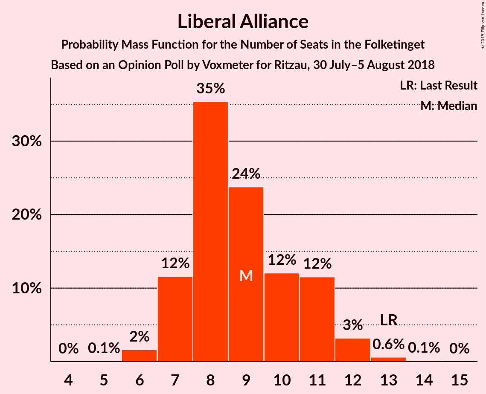
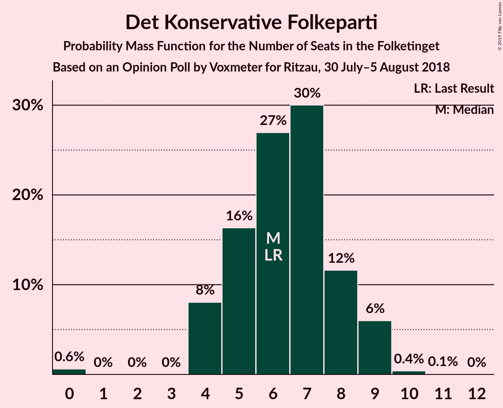

# Opinion Poll by Voxmeter for Ritzau, 30 July–5 August 2018

<a href="#voting-intentions">Voting Intentions</a> | <a href="#seats">Seats</a> | <a href="#coalitions">Coalitions</a> | <a href="#technical-information">Technical Information</a>

## Voting Intentions

### Confidence Intervals

| Party | Last Result | Poll Result | 80% Confidence Interval | 90% Confidence Interval | 95% Confidence Interval | 99% Confidence Interval |
|:-----:|:-----------:|:-----------:|:-----------------------:|:-----------------------:|:-----------------------:|:-----------------------:|
| Socialdemokraterne | 26.3% | 25.2% | 23.5–27.0% |23.1–27.5% |22.6–28.0% |21.9–28.9% |
| Dansk Folkeparti | 21.1% | 20.7% | 19.2–22.4% |18.7–22.9% |18.4–23.3% |17.6–24.2% |
| Venstre | 19.5% | 19.9% | 18.4–21.6% |18.0–22.1% |17.6–22.5% |16.9–23.3% |
| Enhedslisten–De Rød-Grønne | 7.8% | 9.1% | 8.0–10.3% |7.7–10.7% |7.5–11.0% |7.0–11.6% |
| Radikale Venstre | 4.6% | 6.0% | 5.1–7.0% |4.9–7.3% |4.7–7.6% |4.3–8.1% |
| Socialistisk Folkeparti | 4.2% | 5.1% | 4.3–6.1% |4.1–6.4% |3.9–6.6% |3.6–7.1% |
| Liberal Alliance | 7.5% | 4.8% | 4.0–5.8% |3.8–6.0% |3.6–6.3% |3.3–6.8% |
| Alternativet | 4.8% | 3.6% | 3.0–4.5% |2.8–4.7% |2.6–5.0% |2.3–5.4% |
| Det Konservative Folkeparti | 3.4% | 3.4% | 2.8–4.3% |2.6–4.5% |2.5–4.7% |2.2–5.2% |
| Nye Borgerlige | 0.0% | 1.0% | 0.7–1.5% |0.6–1.7% |0.5–1.8% |0.4–2.1% |
| Kristendemokraterne | 0.8% | 0.9% | 0.6–1.4% |0.5–1.5% |0.5–1.7% |0.4–2.0% |

*Note:* The poll result column reflects the actual value used in the calculations. Published results may vary slightly, and in addition be rounded to fewer digits.

## Seats

### Confidence Intervals

| Party | Last Result | Median | 80% Confidence Interval | 90% Confidence Interval | 95% Confidence Interval | 99% Confidence Interval |
|:-----:|:-----------:|:------:|:-----------------------:|:-----------------------:|:-----------------------:|:-----------------------:|
| <a href="#socialdemokraterne">Socialdemokraterne</a> | 47 | 42 | 42–45 |42–47 |41–51 |39–51 |
| <a href="#dansk-folkeparti">Dansk Folkeparti</a> | 37 | 38 | 34–38 |33–38 |33–40 |31–45 |
| <a href="#venstre">Venstre</a> | 34 | 36 | 35–37 |34–39 |33–39 |31–41 |
| <a href="#enhedslisten–de-rød-grønne">Enhedslisten–De Rød-Grønne</a> | 14 | 18 | 16–19 |16–19 |13–19 |12–21 |
| <a href="#radikale-venstre">Radikale Venstre</a> | 8 | 10 | 10–12 |9–12 |9–12 |8–14 |
| <a href="#socialistisk-folkeparti">Socialistisk Folkeparti</a> | 7 | 10 | 9–11 |8–11 |7–11 |7–12 |
| <a href="#liberal-alliance">Liberal Alliance</a> | 13 | 8 | 8–10 |7–11 |7–11 |6–12 |
| <a href="#alternativet">Alternativet</a> | 9 | 6 | 5–7 |4–7 |4–8 |4–9 |
| <a href="#det-konservative-folkeparti">Det Konservative Folkeparti</a> | 6 | 7 | 5–7 |5–7 |5–8 |4–9 |
| <a href="#nye-borgerlige">Nye Borgerlige</a> | 0 | 0 | 0 |0 |0 |0–3 |
| <a href="#kristendemokraterne">Kristendemokraterne</a> | 0 | 0 | 0 |0 |0 |0 |

### Socialdemokraterne

*For a full overview of the results for this party, see the [Socialdemokraterne](party-socialdemokraterne.html) page.*

| Number of Seats | Probability | Accumulated | Special Marks |
|:---------------:|:-----------:|:-----------:|:-------------:|
| 38 | 0.1% | 100% |  |
| 39 | 0.6% | 99.9% |  |
| 40 | 2% | 99.3% |  |
| 41 | 0.3% | 98% |  |
| 42 | 57% | 97% | Median |
| 43 | 10% | 40% |  |
| 44 | 7% | 31% |  |
| 45 | 14% | 24% |  |
| 46 | 3% | 9% |  |
| 47 | 1.2% | 6% | Last Result |
| 48 | 0.4% | 5% |  |
| 49 | 0.4% | 5% |  |
| 50 | 0.4% | 4% |  |
| 51 | 4% | 4% |  |
| 52 | 0.1% | 0.2% |  |
| 53 | 0% | 0.1% |  |
| 54 | 0.1% | 0.1% |  |
| 55 | 0% | 0% |  |

### Dansk Folkeparti

*For a full overview of the results for this party, see the [Dansk Folkeparti](party-danskfolkeparti.html) page.*

| Number of Seats | Probability | Accumulated | Special Marks |
|:---------------:|:-----------:|:-----------:|:-------------:|
| 30 | 0.2% | 100% |  |
| 31 | 0.3% | 99.8% |  |
| 32 | 0.2% | 99.5% |  |
| 33 | 6% | 99.3% |  |
| 34 | 8% | 93% |  |
| 35 | 9% | 85% |  |
| 36 | 11% | 76% |  |
| 37 | 4% | 65% | Last Result |
| 38 | 57% | 61% | Median |
| 39 | 0.4% | 3% |  |
| 40 | 0.6% | 3% |  |
| 41 | 2% | 2% |  |
| 42 | 0.1% | 0.7% |  |
| 43 | 0% | 0.7% |  |
| 44 | 0% | 0.6% |  |
| 45 | 0.6% | 0.6% |  |
| 46 | 0% | 0% |  |

### Venstre

*For a full overview of the results for this party, see the [Venstre](party-venstre.html) page.*

| Number of Seats | Probability | Accumulated | Special Marks |
|:---------------:|:-----------:|:-----------:|:-------------:|
| 29 | 0% | 100% |  |
| 30 | 0.4% | 99.9% |  |
| 31 | 0.8% | 99.6% |  |
| 32 | 0.4% | 98.8% |  |
| 33 | 1.4% | 98% |  |
| 34 | 6% | 97% | Last Result |
| 35 | 2% | 91% |  |
| 36 | 63% | 89% | Median |
| 37 | 17% | 26% |  |
| 38 | 2% | 10% |  |
| 39 | 6% | 8% |  |
| 40 | 1.2% | 2% |  |
| 41 | 1.1% | 1.2% |  |
| 42 | 0.1% | 0.1% |  |
| 43 | 0% | 0.1% |  |
| 44 | 0% | 0% |  |

### Enhedslisten–De Rød-Grønne

*For a full overview of the results for this party, see the [Enhedslisten–De Rød-Grønne](party-enhedslisten–derød-grønne.html) page.*

| Number of Seats | Probability | Accumulated | Special Marks |
|:---------------:|:-----------:|:-----------:|:-------------:|
| 11 | 0.1% | 100% |  |
| 12 | 2% | 99.9% |  |
| 13 | 0.5% | 98% |  |
| 14 | 0.8% | 97% | Last Result |
| 15 | 1.0% | 97% |  |
| 16 | 14% | 95% |  |
| 17 | 2% | 82% |  |
| 18 | 68% | 79% | Median |
| 19 | 10% | 11% |  |
| 20 | 0.2% | 0.8% |  |
| 21 | 0.6% | 0.6% |  |
| 22 | 0% | 0% |  |

### Radikale Venstre

*For a full overview of the results for this party, see the [Radikale Venstre](party-radikalevenstre.html) page.*

| Number of Seats | Probability | Accumulated | Special Marks |
|:---------------:|:-----------:|:-----------:|:-------------:|
| 7 | 0.3% | 100% |  |
| 8 | 0.4% | 99.7% | Last Result |
| 9 | 5% | 99.2% |  |
| 10 | 66% | 94% | Median |
| 11 | 9% | 28% |  |
| 12 | 17% | 19% |  |
| 13 | 0.7% | 2% |  |
| 14 | 0.6% | 0.8% |  |
| 15 | 0.2% | 0.2% |  |
| 16 | 0% | 0.1% |  |
| 17 | 0% | 0% |  |

### Socialistisk Folkeparti

*For a full overview of the results for this party, see the [Socialistisk Folkeparti](party-socialistiskfolkeparti.html) page.*

| Number of Seats | Probability | Accumulated | Special Marks |
|:---------------:|:-----------:|:-----------:|:-------------:|
| 6 | 0.2% | 100% |  |
| 7 | 3% | 99.8% | Last Result |
| 8 | 6% | 97% |  |
| 9 | 7% | 90% |  |
| 10 | 69% | 83% | Median |
| 11 | 14% | 14% |  |
| 12 | 0.6% | 0.6% |  |
| 13 | 0.1% | 0.1% |  |
| 14 | 0% | 0% |  |

### Liberal Alliance

*For a full overview of the results for this party, see the [Liberal Alliance](party-liberalalliance.html) page.*

| Number of Seats | Probability | Accumulated | Special Marks |
|:---------------:|:-----------:|:-----------:|:-------------:|
| 6 | 0.8% | 100% |  |
| 7 | 7% | 99.2% |  |
| 8 | 77% | 93% | Median |
| 9 | 6% | 16% |  |
| 10 | 2% | 10% |  |
| 11 | 7% | 8% |  |
| 12 | 0.1% | 0.6% |  |
| 13 | 0.4% | 0.5% | Last Result |
| 14 | 0% | 0% |  |

### Alternativet

*For a full overview of the results for this party, see the [Alternativet](party-alternativet.html) page.*

| Number of Seats | Probability | Accumulated | Special Marks |
|:---------------:|:-----------:|:-----------:|:-------------:|
| 4 | 7% | 100% |  |
| 5 | 13% | 93% |  |
| 6 | 64% | 80% | Median |
| 7 | 12% | 16% |  |
| 8 | 4% | 5% |  |
| 9 | 0.9% | 0.9% | Last Result |
| 10 | 0.1% | 0.1% |  |
| 11 | 0% | 0% |  |

### Det Konservative Folkeparti

*For a full overview of the results for this party, see the [Det Konservative Folkeparti](party-detkonservativefolkeparti.html) page.*

| Number of Seats | Probability | Accumulated | Special Marks |
|:---------------:|:-----------:|:-----------:|:-------------:|
| 0 | 0.2% | 100% |  |
| 1 | 0% | 99.8% |  |
| 2 | 0% | 99.8% |  |
| 3 | 0% | 99.8% |  |
| 4 | 0.8% | 99.8% |  |
| 5 | 19% | 99.0% |  |
| 6 | 9% | 80% | Last Result |
| 7 | 67% | 71% | Median |
| 8 | 3% | 4% |  |
| 9 | 1.1% | 1.3% |  |
| 10 | 0.2% | 0.2% |  |
| 11 | 0% | 0% |  |

### Nye Borgerlige

*For a full overview of the results for this party, see the [Nye Borgerlige](party-nyeborgerlige.html) page.*

| Number of Seats | Probability | Accumulated | Special Marks |
|:---------------:|:-----------:|:-----------:|:-------------:|
| 0 | 99.5% | 100% | Last Result, Median |
| 1 | 0% | 0.5% |  |
| 2 | 0% | 0.5% |  |
| 3 | 0% | 0.5% |  |
| 4 | 0.5% | 0.5% |  |
| 5 | 0% | 0% |  |

### Kristendemokraterne

*For a full overview of the results for this party, see the [Kristendemokraterne](party-kristendemokraterne.html) page.*

| Number of Seats | Probability | Accumulated | Special Marks |
|:---------------:|:-----------:|:-----------:|:-------------:|
| 0 | 99.9% | 100% | Last Result, Median |
| 1 | 0% | 0.1% |  |
| 2 | 0% | 0.1% |  |
| 3 | 0% | 0.1% |  |
| 4 | 0.1% | 0.1% |  |
| 5 | 0% | 0% |  |

## Coalitions

### Confidence Intervals

| Coalition | Last Result | Median | Majority? | 80% Confidence Interval | 90% Confidence Interval | 95% Confidence Interval | 99% Confidence Interval |
|:---------:|:-----------:|:------:|:---------:|:-----------------------:|:-----------------------:|:-----------------------:|:-----------------------:|
| Socialdemokraterne – Enhedslisten–De Rød-Grønne – Radikale Venstre – Socialistisk Folkeparti – Alternativet | 85 | 86 | 8% | 86–89 | 85–93 | 84–95 | 82–95 |
| Dansk Folkeparti – Venstre – Liberal Alliance – Det Konservative Folkeparti – Nye Borgerlige – Kristendemokraterne | 90 | 89 | 5% | 86–89 | 82–90 | 80–91 | 80–93 |
| Dansk Folkeparti – Venstre – Liberal Alliance – Det Konservative Folkeparti – Kristendemokraterne | 90 | 89 | 5% | 86–89 | 82–90 | 80–91 | 80–93 |
| Dansk Folkeparti – Venstre – Liberal Alliance – Det Konservative Folkeparti – Nye Borgerlige | 90 | 89 | 5% | 86–89 | 82–90 | 80–91 | 80–93 |
| Dansk Folkeparti – Venstre – Liberal Alliance – Det Konservative Folkeparti | 90 | 89 | 5% | 86–89 | 82–89 | 80–91 | 80–93 |
| Socialdemokraterne – Enhedslisten–De Rød-Grønne – Radikale Venstre – Socialistisk Folkeparti | 76 | 80 | 0.1% | 80–84 | 80–85 | 77–89 | 75–89 |
| Socialdemokraterne – Enhedslisten–De Rød-Grønne – Socialistisk Folkeparti – Alternativet | 77 | 76 | 0% | 75–78 | 74–83 | 73–86 | 71–86 |
| Socialdemokraterne – Enhedslisten–De Rød-Grønne – Socialistisk Folkeparti | 68 | 70 | 0% | 70–72 | 68–75 | 67–80 | 64–80 |
| Socialdemokraterne – Radikale Venstre – Socialistisk Folkeparti | 62 | 62 | 0% | 62–68 | 62–68 | 61–70 | 57–70 |
| Socialdemokraterne – Radikale Venstre | 55 | 52 | 0% | 52–57 | 52–58 | 52–60 | 49–62 |
| Venstre – Liberal Alliance – Det Konservative Folkeparti | 53 | 51 | 0% | 50–54 | 47–54 | 46–54 | 45–58 |
| Venstre – Det Konservative Folkeparti | 40 | 43 | 0% | 41–44 | 39–46 | 39–46 | 37–48 |
| Venstre | 34 | 36 | 0% | 35–37 | 34–39 | 33–39 | 31–41 |

### Socialdemokraterne – Enhedslisten–De Rød-Grønne – Radikale Venstre – Socialistisk Folkeparti – Alternativet

| Number of Seats | Probability | Accumulated | Special Marks |
|:---------------:|:-----------:|:-----------:|:-------------:|
| 79 | 0.1% | 100% |  |
| 80 | 0.1% | 99.9% |  |
| 81 | 0.1% | 99.8% |  |
| 82 | 1.2% | 99.7% |  |
| 83 | 0.9% | 98.5% |  |
| 84 | 2% | 98% |  |
| 85 | 0.5% | 95% | Last Result |
| 86 | 65% | 95% | Median |
| 87 | 0.5% | 30% |  |
| 88 | 6% | 29% |  |
| 89 | 15% | 23% |  |
| 90 | 0.4% | 8% | Majority |
| 91 | 0.5% | 8% |  |
| 92 | 0.7% | 7% |  |
| 93 | 3% | 7% |  |
| 94 | 0.4% | 4% |  |
| 95 | 3% | 4% |  |
| 96 | 0% | 0.1% |  |
| 97 | 0.1% | 0.1% |  |
| 98 | 0% | 0% |  |

### Dansk Folkeparti – Venstre – Liberal Alliance – Det Konservative Folkeparti – Nye Borgerlige – Kristendemokraterne

| Number of Seats | Probability | Accumulated | Special Marks |
|:---------------:|:-----------:|:-----------:|:-------------:|
| 78 | 0.1% | 100% |  |
| 79 | 0% | 99.9% |  |
| 80 | 3% | 99.9% |  |
| 81 | 0.4% | 96% |  |
| 82 | 3% | 96% |  |
| 83 | 0.7% | 93% |  |
| 84 | 0.5% | 93% |  |
| 85 | 0.4% | 92% |  |
| 86 | 15% | 92% |  |
| 87 | 6% | 77% |  |
| 88 | 0.5% | 71% |  |
| 89 | 65% | 70% | Median |
| 90 | 0.5% | 5% | Last Result, Majority |
| 91 | 2% | 5% |  |
| 92 | 0.9% | 2% |  |
| 93 | 1.2% | 1.5% |  |
| 94 | 0.1% | 0.3% |  |
| 95 | 0.1% | 0.2% |  |
| 96 | 0.1% | 0.1% |  |
| 97 | 0% | 0% |  |

### Dansk Folkeparti – Venstre – Liberal Alliance – Det Konservative Folkeparti – Kristendemokraterne

| Number of Seats | Probability | Accumulated | Special Marks |
|:---------------:|:-----------:|:-----------:|:-------------:|
| 78 | 0.1% | 100% |  |
| 79 | 0% | 99.9% |  |
| 80 | 3% | 99.9% |  |
| 81 | 0.4% | 96% |  |
| 82 | 3% | 96% |  |
| 83 | 0.9% | 93% |  |
| 84 | 0.5% | 92% |  |
| 85 | 0.3% | 92% |  |
| 86 | 15% | 92% |  |
| 87 | 6% | 77% |  |
| 88 | 0.7% | 71% |  |
| 89 | 65% | 70% | Median |
| 90 | 0.5% | 5% | Last Result, Majority |
| 91 | 2% | 5% |  |
| 92 | 0.7% | 2% |  |
| 93 | 1.2% | 1.4% |  |
| 94 | 0.1% | 0.2% |  |
| 95 | 0% | 0.1% |  |
| 96 | 0.1% | 0.1% |  |
| 97 | 0% | 0% |  |

### Dansk Folkeparti – Venstre – Liberal Alliance – Det Konservative Folkeparti – Nye Borgerlige

| Number of Seats | Probability | Accumulated | Special Marks |
|:---------------:|:-----------:|:-----------:|:-------------:|
| 78 | 0.1% | 100% |  |
| 79 | 0% | 99.9% |  |
| 80 | 4% | 99.9% |  |
| 81 | 0.4% | 96% |  |
| 82 | 3% | 96% |  |
| 83 | 0.7% | 93% |  |
| 84 | 0.5% | 93% |  |
| 85 | 0.4% | 92% |  |
| 86 | 15% | 92% |  |
| 87 | 6% | 77% |  |
| 88 | 0.4% | 71% |  |
| 89 | 65% | 70% | Median |
| 90 | 0.5% | 5% | Last Result, Majority |
| 91 | 2% | 5% |  |
| 92 | 0.9% | 2% |  |
| 93 | 1.2% | 1.5% |  |
| 94 | 0.1% | 0.3% |  |
| 95 | 0.1% | 0.2% |  |
| 96 | 0.1% | 0.1% |  |
| 97 | 0% | 0% |  |

### Dansk Folkeparti – Venstre – Liberal Alliance – Det Konservative Folkeparti

| Number of Seats | Probability | Accumulated | Special Marks |
|:---------------:|:-----------:|:-----------:|:-------------:|
| 78 | 0.1% | 100% |  |
| 79 | 0% | 99.9% |  |
| 80 | 4% | 99.9% |  |
| 81 | 0.4% | 96% |  |
| 82 | 3% | 96% |  |
| 83 | 0.9% | 93% |  |
| 84 | 0.5% | 92% |  |
| 85 | 0.3% | 92% |  |
| 86 | 15% | 91% |  |
| 87 | 6% | 77% |  |
| 88 | 0.6% | 71% |  |
| 89 | 65% | 70% | Median |
| 90 | 0.5% | 5% | Last Result, Majority |
| 91 | 2% | 5% |  |
| 92 | 0.7% | 2% |  |
| 93 | 1.2% | 1.4% |  |
| 94 | 0.1% | 0.2% |  |
| 95 | 0% | 0.1% |  |
| 96 | 0.1% | 0.1% |  |
| 97 | 0% | 0% |  |

### Socialdemokraterne – Enhedslisten–De Rød-Grønne – Radikale Venstre – Socialistisk Folkeparti

| Number of Seats | Probability | Accumulated | Special Marks |
|:---------------:|:-----------:|:-----------:|:-------------:|
| 73 | 0.1% | 100% |  |
| 74 | 0.1% | 99.8% |  |
| 75 | 1.2% | 99.8% |  |
| 76 | 0.1% | 98.6% | Last Result |
| 77 | 1.1% | 98.5% |  |
| 78 | 0.7% | 97% |  |
| 79 | 2% | 97% |  |
| 80 | 60% | 95% | Median |
| 81 | 6% | 35% |  |
| 82 | 10% | 29% |  |
| 83 | 0.6% | 19% |  |
| 84 | 11% | 18% |  |
| 85 | 3% | 7% |  |
| 86 | 0.6% | 5% |  |
| 87 | 0.2% | 4% |  |
| 88 | 0.3% | 4% |  |
| 89 | 3% | 4% |  |
| 90 | 0% | 0.1% | Majority |
| 91 | 0.1% | 0.1% |  |
| 92 | 0% | 0% |  |

### Socialdemokraterne – Enhedslisten–De Rød-Grønne – Socialistisk Folkeparti – Alternativet

| Number of Seats | Probability | Accumulated | Special Marks |
|:---------------:|:-----------:|:-----------:|:-------------:|
| 68 | 0.1% | 100% |  |
| 69 | 0.2% | 99.9% |  |
| 70 | 0.1% | 99.7% |  |
| 71 | 0.2% | 99.6% |  |
| 72 | 0.7% | 99.4% |  |
| 73 | 3% | 98.7% |  |
| 74 | 3% | 96% |  |
| 75 | 7% | 93% |  |
| 76 | 57% | 86% | Median |
| 77 | 14% | 29% | Last Result |
| 78 | 5% | 14% |  |
| 79 | 0.9% | 9% |  |
| 80 | 0.9% | 8% |  |
| 81 | 0.6% | 7% |  |
| 82 | 0.5% | 7% |  |
| 83 | 3% | 6% |  |
| 84 | 0.2% | 4% |  |
| 85 | 0% | 3% |  |
| 86 | 3% | 3% |  |
| 87 | 0% | 0% |  |

### Socialdemokraterne – Enhedslisten–De Rød-Grønne – Socialistisk Folkeparti

| Number of Seats | Probability | Accumulated | Special Marks |
|:---------------:|:-----------:|:-----------:|:-------------:|
| 61 | 0.1% | 100% |  |
| 62 | 0.1% | 99.9% |  |
| 63 | 0.2% | 99.8% |  |
| 64 | 0.7% | 99.6% |  |
| 65 | 0% | 98.9% |  |
| 66 | 0.8% | 98.8% |  |
| 67 | 1.1% | 98% |  |
| 68 | 4% | 97% | Last Result |
| 69 | 1.4% | 93% |  |
| 70 | 61% | 91% | Median |
| 71 | 11% | 30% |  |
| 72 | 10% | 19% |  |
| 73 | 0.6% | 9% |  |
| 74 | 1.4% | 8% |  |
| 75 | 3% | 7% |  |
| 76 | 0.3% | 4% |  |
| 77 | 0.1% | 4% |  |
| 78 | 0.1% | 4% |  |
| 79 | 0% | 3% |  |
| 80 | 3% | 3% |  |
| 81 | 0% | 0% |  |

### Socialdemokraterne – Radikale Venstre – Socialistisk Folkeparti

| Number of Seats | Probability | Accumulated | Special Marks |
|:---------------:|:-----------:|:-----------:|:-------------:|
| 57 | 0.7% | 100% |  |
| 58 | 0.4% | 99.3% |  |
| 59 | 0% | 98.9% |  |
| 60 | 0.3% | 98.9% |  |
| 61 | 2% | 98.6% |  |
| 62 | 57% | 97% | Last Result, Median |
| 63 | 10% | 39% |  |
| 64 | 7% | 29% |  |
| 65 | 0.3% | 22% |  |
| 66 | 3% | 21% |  |
| 67 | 0.6% | 18% |  |
| 68 | 13% | 17% |  |
| 69 | 0.9% | 5% |  |
| 70 | 4% | 4% |  |
| 71 | 0% | 0.3% |  |
| 72 | 0.1% | 0.3% |  |
| 73 | 0% | 0.2% |  |
| 74 | 0.1% | 0.2% |  |
| 75 | 0% | 0.1% |  |
| 76 | 0.1% | 0.1% |  |
| 77 | 0% | 0% |  |

### Socialdemokraterne – Radikale Venstre

| Number of Seats | Probability | Accumulated | Special Marks |
|:---------------:|:-----------:|:-----------:|:-------------:|
| 49 | 1.0% | 100% |  |
| 50 | 0.2% | 99.0% |  |
| 51 | 0.9% | 98.8% |  |
| 52 | 57% | 98% | Median |
| 53 | 6% | 41% |  |
| 54 | 2% | 35% |  |
| 55 | 12% | 33% | Last Result |
| 56 | 2% | 21% |  |
| 57 | 11% | 19% |  |
| 58 | 3% | 8% |  |
| 59 | 0.4% | 5% |  |
| 60 | 4% | 4% |  |
| 61 | 0.1% | 0.6% |  |
| 62 | 0.3% | 0.5% |  |
| 63 | 0% | 0.2% |  |
| 64 | 0.1% | 0.2% |  |
| 65 | 0.1% | 0.1% |  |
| 66 | 0% | 0% |  |

### Venstre – Liberal Alliance – Det Konservative Folkeparti

| Number of Seats | Probability | Accumulated | Special Marks |
|:---------------:|:-----------:|:-----------:|:-------------:|
| 43 | 0.1% | 100% |  |
| 44 | 0.3% | 99.9% |  |
| 45 | 0.3% | 99.6% |  |
| 46 | 4% | 99.3% |  |
| 47 | 3% | 96% |  |
| 48 | 0.9% | 93% |  |
| 49 | 1.4% | 92% |  |
| 50 | 13% | 91% |  |
| 51 | 57% | 78% | Median |
| 52 | 7% | 21% |  |
| 53 | 0.6% | 14% | Last Result |
| 54 | 11% | 14% |  |
| 55 | 0.9% | 2% |  |
| 56 | 0.2% | 1.1% |  |
| 57 | 0.1% | 1.0% |  |
| 58 | 0.9% | 0.9% |  |
| 59 | 0% | 0% |  |

### Venstre – Det Konservative Folkeparti

| Number of Seats | Probability | Accumulated | Special Marks |
|:---------------:|:-----------:|:-----------:|:-------------:|
| 35 | 0.1% | 100% |  |
| 36 | 0.4% | 99.9% |  |
| 37 | 0.8% | 99.5% |  |
| 38 | 0.4% | 98.7% |  |
| 39 | 7% | 98% |  |
| 40 | 0.9% | 91% | Last Result |
| 41 | 0.9% | 90% |  |
| 42 | 11% | 90% |  |
| 43 | 68% | 79% | Median |
| 44 | 2% | 11% |  |
| 45 | 1.2% | 8% |  |
| 46 | 5% | 7% |  |
| 47 | 0.2% | 2% |  |
| 48 | 1.4% | 2% |  |
| 49 | 0.1% | 0.1% |  |
| 50 | 0% | 0% |  |

### Venstre

| Number of Seats | Probability | Accumulated | Special Marks |
|:---------------:|:-----------:|:-----------:|:-------------:|
| 29 | 0% | 100% |  |
| 30 | 0.4% | 99.9% |  |
| 31 | 0.8% | 99.6% |  |
| 32 | 0.4% | 98.8% |  |
| 33 | 1.4% | 98% |  |
| 34 | 6% | 97% | Last Result |
| 35 | 2% | 91% |  |
| 36 | 63% | 89% | Median |
| 37 | 17% | 26% |  |
| 38 | 2% | 10% |  |
| 39 | 6% | 8% |  |
| 40 | 1.2% | 2% |  |
| 41 | 1.1% | 1.2% |  |
| 42 | 0.1% | 0.1% |  |
| 43 | 0% | 0.1% |  |
| 44 | 0% | 0% |  |

## Technical Information

### Opinion Poll

+ **Polling firm:** Voxmeter
+ **Commissioner(s):** Ritzau
+ **Fieldwork period:** 30 July–5 August 2018

### Calculations

+ **Sample size:** 1023
+ **Simulations done:** 131,072
+ **Error estimate:** 3.12%

