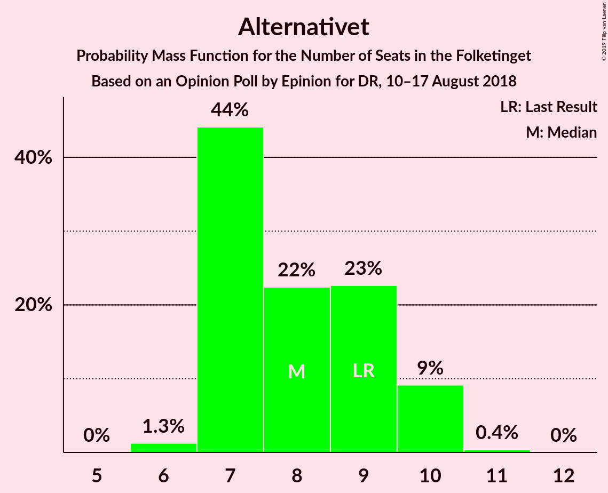

# Opinion Poll by Epinion for DR, 10–17 August 2018

<a href="#voting-intentions">Voting Intentions</a> | <a href="#seats">Seats</a> | <a href="#coalitions">Coalitions</a> | <a href="#technical-information">Technical Information</a>

## Voting Intentions

### Confidence Intervals

| Party | Last Result | Poll Result | 80% Confidence Interval | 90% Confidence Interval | 95% Confidence Interval | 99% Confidence Interval |
|:-----:|:-----------:|:-----------:|:-----------------------:|:-----------------------:|:-----------------------:|:-----------------------:|
| Socialdemokraterne | 26.3% | 26.4% | 25.0–27.9% |24.6–28.3% |24.3–28.6% |23.6–29.3% |
| Dansk Folkeparti | 21.1% | 19.7% | 18.4–21.0% |18.1–21.4% |17.8–21.7% |17.2–22.4% |
| Venstre | 19.5% | 18.4% | 17.2–19.7% |16.9–20.1% |16.6–20.4% |16.0–21.1% |
| Enhedslisten–De Rød-Grønne | 7.8% | 9.1% | 8.2–10.1% |8.0–10.4% |7.8–10.7% |7.4–11.1% |
| Radikale Venstre | 4.6% | 5.6% | 4.9–6.4% |4.7–6.7% |4.6–6.9% |4.3–7.3% |
| Socialistisk Folkeparti | 4.2% | 4.6% | 4.0–5.3% |3.8–5.6% |3.7–5.7% |3.4–6.1% |
| Liberal Alliance | 7.5% | 4.5% | 3.9–5.3% |3.7–5.5% |3.6–5.7% |3.3–6.1% |
| Alternativet | 4.8% | 4.5% | 3.9–5.3% |3.7–5.5% |3.6–5.7% |3.3–6.1% |
| Det Konservative Folkeparti | 3.4% | 4.1% | 3.5–4.8% |3.3–5.0% |3.2–5.2% |2.9–5.5% |
| Nye Borgerlige | 0.0% | 2.6% | 2.2–3.2% |2.0–3.4% |1.9–3.5% |1.7–3.8% |
| Kristendemokraterne | 0.8% | 0.6% | 0.4–0.9% |0.3–1.0% |0.3–1.1% |0.2–1.3% |

*Note:* The poll result column reflects the actual value used in the calculations. Published results may vary slightly, and in addition be rounded to fewer digits.

## Seats

### Confidence Intervals

| Party | Last Result | Median | 80% Confidence Interval | 90% Confidence Interval | 95% Confidence Interval | 99% Confidence Interval |
|:-----:|:-----------:|:------:|:-----------------------:|:-----------------------:|:-----------------------:|:-----------------------:|
| <a href="#socialdemokraterne">Socialdemokraterne</a> | 47 | 47 | 40–49 |40–49 |40–49 |40–49 |
| <a href="#dansk-folkeparti">Dansk Folkeparti</a> | 37 | 34 | 28–35 |28–35 |28–35 |28–35 |
| <a href="#venstre">Venstre</a> | 34 | 31 | 28–37 |28–37 |28–37 |28–37 |
| <a href="#enhedslisten–de-rød-grønne">Enhedslisten–De Rød-Grønne</a> | 14 | 18 | 15–20 |15–20 |15–20 |15–20 |
| <a href="#radikale-venstre">Radikale Venstre</a> | 8 | 10 | 9–12 |9–12 |9–12 |9–12 |
| <a href="#socialistisk-folkeparti">Socialistisk Folkeparti</a> | 7 | 8 | 7–9 |7–9 |7–9 |7–9 |
| <a href="#liberal-alliance">Liberal Alliance</a> | 13 | 8 | 8–10 |8–10 |8–10 |8–10 |
| <a href="#alternativet">Alternativet</a> | 9 | 7 | 7–10 |7–10 |7–10 |7–10 |
| <a href="#det-konservative-folkeparti">Det Konservative Folkeparti</a> | 6 | 7 | 5–10 |5–10 |5–10 |5–10 |
| <a href="#nye-borgerlige">Nye Borgerlige</a> | 0 | 6 | 4–7 |4–7 |4–7 |4–7 |
| <a href="#kristendemokraterne">Kristendemokraterne</a> | 0 | 0 | 0 |0 |0 |0 |

### Socialdemokraterne

*For a full overview of the results for this party, see the [Socialdemokraterne](party-socialdemokraterne.html) page.*

| Number of Seats | Probability | Accumulated | Special Marks |
|:---------------:|:-----------:|:-----------:|:-------------:|
| 40 | 19% | 100% |  |
| 41 | 0% | 80% |  |
| 42 | 0% | 80% |  |
| 43 | 0% | 80% |  |
| 44 | 0% | 80% |  |
| 45 | 0% | 80% |  |
| 46 | 13% | 80% |  |
| 47 | 22% | 68% | Last Result, Median |
| 48 | 0% | 46% |  |
| 49 | 46% | 46% |  |
| 50 | 0% | 0% |  |

### Dansk Folkeparti

*For a full overview of the results for this party, see the [Dansk Folkeparti](party-danskfolkeparti.html) page.*

| Number of Seats | Probability | Accumulated | Special Marks |
|:---------------:|:-----------:|:-----------:|:-------------:|
| 28 | 22% | 100% |  |
| 29 | 0% | 78% |  |
| 30 | 0% | 78% |  |
| 31 | 0% | 78% |  |
| 32 | 13% | 78% |  |
| 33 | 0% | 66% |  |
| 34 | 46% | 66% | Median |
| 35 | 20% | 20% |  |
| 36 | 0% | 0.1% |  |
| 37 | 0% | 0% | Last Result |

### Venstre

*For a full overview of the results for this party, see the [Venstre](party-venstre.html) page.*

| Number of Seats | Probability | Accumulated | Special Marks |
|:---------------:|:-----------:|:-----------:|:-------------:|
| 28 | 46% | 100% |  |
| 29 | 0% | 54% |  |
| 30 | 0% | 54% |  |
| 31 | 22% | 54% | Median |
| 32 | 0% | 32% |  |
| 33 | 0% | 32% |  |
| 34 | 19% | 32% | Last Result |
| 35 | 0% | 13% |  |
| 36 | 0% | 13% |  |
| 37 | 13% | 13% |  |
| 38 | 0% | 0% |  |

### Enhedslisten–De Rød-Grønne

*For a full overview of the results for this party, see the [Enhedslisten–De Rød-Grønne](party-enhedslisten–derød-grønne.html) page.*

| Number of Seats | Probability | Accumulated | Special Marks |
|:---------------:|:-----------:|:-----------:|:-------------:|
| 14 | 0% | 100% | Last Result |
| 15 | 32% | 100% |  |
| 16 | 0% | 68% |  |
| 17 | 0% | 68% |  |
| 18 | 22% | 68% | Median |
| 19 | 0% | 46% |  |
| 20 | 46% | 46% |  |
| 21 | 0% | 0% |  |

### Radikale Venstre

*For a full overview of the results for this party, see the [Radikale Venstre](party-radikalevenstre.html) page.*

| Number of Seats | Probability | Accumulated | Special Marks |
|:---------------:|:-----------:|:-----------:|:-------------:|
| 8 | 0% | 100% | Last Result |
| 9 | 46% | 100% |  |
| 10 | 34% | 54% | Median |
| 11 | 0% | 19% |  |
| 12 | 19% | 19% |  |
| 13 | 0% | 0% |  |

### Socialistisk Folkeparti

*For a full overview of the results for this party, see the [Socialistisk Folkeparti](party-socialistiskfolkeparti.html) page.*

| Number of Seats | Probability | Accumulated | Special Marks |
|:---------------:|:-----------:|:-----------:|:-------------:|
| 7 | 46% | 100% | Last Result |
| 8 | 13% | 54% | Median |
| 9 | 41% | 41% |  |
| 10 | 0% | 0% |  |

### Liberal Alliance

*For a full overview of the results for this party, see the [Liberal Alliance](party-liberalalliance.html) page.*

| Number of Seats | Probability | Accumulated | Special Marks |
|:---------------:|:-----------:|:-----------:|:-------------:|
| 8 | 78% | 100% | Median |
| 9 | 0% | 22% |  |
| 10 | 22% | 22% |  |
| 11 | 0% | 0% |  |
| 12 | 0% | 0% |  |
| 13 | 0% | 0% | Last Result |

### Alternativet

*For a full overview of the results for this party, see the [Alternativet](party-alternativet.html) page.*

| Number of Seats | Probability | Accumulated | Special Marks |
|:---------------:|:-----------:|:-----------:|:-------------:|
| 7 | 78% | 100% | Median |
| 8 | 0% | 22% |  |
| 9 | 0% | 22% | Last Result |
| 10 | 22% | 22% |  |
| 11 | 0% | 0% |  |

### Det Konservative Folkeparti

*For a full overview of the results for this party, see the [Det Konservative Folkeparti](party-detkonservativefolkeparti.html) page.*

| Number of Seats | Probability | Accumulated | Special Marks |
|:---------------:|:-----------:|:-----------:|:-------------:|
| 5 | 13% | 100% |  |
| 6 | 0% | 87% | Last Result |
| 7 | 46% | 87% | Median |
| 8 | 22% | 41% |  |
| 9 | 0% | 19% |  |
| 10 | 19% | 19% |  |
| 11 | 0% | 0% |  |

### Nye Borgerlige

*For a full overview of the results for this party, see the [Nye Borgerlige](party-nyeborgerlige.html) page.*

| Number of Seats | Probability | Accumulated | Special Marks |
|:---------------:|:-----------:|:-----------:|:-------------:|
| 0 | 0% | 100% | Last Result |
| 1 | 0% | 100% |  |
| 2 | 0% | 100% |  |
| 3 | 0% | 100% |  |
| 4 | 22% | 100% |  |
| 5 | 20% | 78% |  |
| 6 | 46% | 59% | Median |
| 7 | 13% | 13% |  |
| 8 | 0% | 0% |  |

### Kristendemokraterne

*For a full overview of the results for this party, see the [Kristendemokraterne](party-kristendemokraterne.html) page.*

| Number of Seats | Probability | Accumulated | Special Marks |
|:---------------:|:-----------:|:-----------:|:-------------:|
| 0 | 100% | 100% | Last Result, Median |

## Coalitions

### Confidence Intervals

| Coalition | Last Result | Median | Majority? | 80% Confidence Interval | 90% Confidence Interval | 95% Confidence Interval | 99% Confidence Interval |
|:---------:|:-----------:|:------:|:---------:|:-----------------------:|:-----------------------:|:-----------------------:|:-----------------------:|
| Socialdemokraterne – Enhedslisten–De Rød-Grønne – Radikale Venstre – Socialistisk Folkeparti – Alternativet | 85 | 92 | 68% | 83–94 | 83–94 | 83–94 | 83–94 |
| Dansk Folkeparti – Venstre – Liberal Alliance – Det Konservative Folkeparti – Nye Borgerlige – Kristendemokraterne | 90 | 83 | 20% | 81–92 | 81–92 | 81–92 | 81–92 |
| Dansk Folkeparti – Venstre – Liberal Alliance – Det Konservative Folkeparti – Nye Borgerlige | 90 | 83 | 20% | 81–92 | 81–92 | 81–92 | 81–92 |
| Dansk Folkeparti – Venstre – Liberal Alliance – Det Konservative Folkeparti – Kristendemokraterne | 90 | 77 | 0% | 77–87 | 77–87 | 77–87 | 77–87 |
| Dansk Folkeparti – Venstre – Liberal Alliance – Det Konservative Folkeparti | 90 | 77 | 0% | 77–87 | 77–87 | 77–87 | 77–87 |
| Socialdemokraterne – Enhedslisten–De Rød-Grønne – Radikale Venstre – Socialistisk Folkeparti | 76 | 84 | 0% | 76–85 | 76–85 | 76–85 | 76–85 |

### Socialdemokraterne – Enhedslisten–De Rød-Grønne – Radikale Venstre – Socialistisk Folkeparti – Alternativet

| Number of Seats | Probability | Accumulated | Special Marks |
|:---------------:|:-----------:|:-----------:|:-------------:|
| 83 | 19% | 100% |  |
| 84 | 0% | 81% |  |
| 85 | 0% | 81% | Last Result |
| 86 | 13% | 80% |  |
| 87 | 0% | 68% |  |
| 88 | 0% | 68% |  |
| 89 | 0% | 68% |  |
| 90 | 0% | 68% | Median, Majority |
| 91 | 0% | 68% |  |
| 92 | 46% | 68% |  |
| 93 | 0% | 22% |  |
| 94 | 22% | 22% |  |
| 95 | 0% | 0% |  |

### Dansk Folkeparti – Venstre – Liberal Alliance – Det Konservative Folkeparti – Nye Borgerlige – Kristendemokraterne

| Number of Seats | Probability | Accumulated | Special Marks |
|:---------------:|:-----------:|:-----------:|:-------------:|
| 81 | 22% | 100% |  |
| 82 | 0% | 78% |  |
| 83 | 46% | 78% |  |
| 84 | 0% | 32% |  |
| 85 | 0% | 32% |  |
| 86 | 0% | 32% | Median |
| 87 | 0% | 32% |  |
| 88 | 0% | 32% |  |
| 89 | 13% | 32% |  |
| 90 | 0% | 20% | Last Result, Majority |
| 91 | 0% | 19% |  |
| 92 | 19% | 19% |  |
| 93 | 0% | 0% |  |

### Dansk Folkeparti – Venstre – Liberal Alliance – Det Konservative Folkeparti – Nye Borgerlige

| Number of Seats | Probability | Accumulated | Special Marks |
|:---------------:|:-----------:|:-----------:|:-------------:|
| 81 | 22% | 100% |  |
| 82 | 0% | 78% |  |
| 83 | 46% | 78% |  |
| 84 | 0% | 32% |  |
| 85 | 0% | 32% |  |
| 86 | 0% | 32% | Median |
| 87 | 0% | 32% |  |
| 88 | 0% | 32% |  |
| 89 | 13% | 32% |  |
| 90 | 0% | 20% | Last Result, Majority |
| 91 | 0% | 19% |  |
| 92 | 19% | 19% |  |
| 93 | 0% | 0% |  |

### Dansk Folkeparti – Venstre – Liberal Alliance – Det Konservative Folkeparti – Kristendemokraterne

| Number of Seats | Probability | Accumulated | Special Marks |
|:---------------:|:-----------:|:-----------:|:-------------:|
| 77 | 68% | 100% |  |
| 78 | 0% | 32% |  |
| 79 | 0% | 32% |  |
| 80 | 0% | 32% | Median |
| 81 | 0% | 32% |  |
| 82 | 13% | 32% |  |
| 83 | 0% | 20% |  |
| 84 | 0% | 20% |  |
| 85 | 0% | 20% |  |
| 86 | 0% | 19% |  |
| 87 | 19% | 19% |  |
| 88 | 0% | 0% |  |
| 89 | 0% | 0% |  |
| 90 | 0% | 0% | Last Result, Majority |

### Dansk Folkeparti – Venstre – Liberal Alliance – Det Konservative Folkeparti

| Number of Seats | Probability | Accumulated | Special Marks |
|:---------------:|:-----------:|:-----------:|:-------------:|
| 77 | 68% | 100% |  |
| 78 | 0% | 32% |  |
| 79 | 0% | 32% |  |
| 80 | 0% | 32% | Median |
| 81 | 0% | 32% |  |
| 82 | 13% | 32% |  |
| 83 | 0% | 20% |  |
| 84 | 0% | 20% |  |
| 85 | 0% | 20% |  |
| 86 | 0% | 19% |  |
| 87 | 19% | 19% |  |
| 88 | 0% | 0% |  |
| 89 | 0% | 0% |  |
| 90 | 0% | 0% | Last Result, Majority |

### Socialdemokraterne – Enhedslisten–De Rød-Grønne – Radikale Venstre – Socialistisk Folkeparti

| Number of Seats | Probability | Accumulated | Special Marks |
|:---------------:|:-----------:|:-----------:|:-------------:|
| 76 | 19% | 100% | Last Result |
| 77 | 0% | 81% |  |
| 78 | 0% | 80% |  |
| 79 | 13% | 80% |  |
| 80 | 0% | 68% |  |
| 81 | 0% | 68% |  |
| 82 | 0% | 68% |  |
| 83 | 0% | 68% | Median |
| 84 | 22% | 68% |  |
| 85 | 46% | 46% |  |
| 86 | 0% | 0% |  |

## Technical Information

### Opinion Poll

+ **Polling firm:** Epinion
+ **Commissioner(s):** DR
+ **Fieldwork period:** 10–17 August 2018

### Calculations

+ **Sample size:** 1569
+ **Simulations done:** 1,024
+ **Error estimate:** 2.90%

