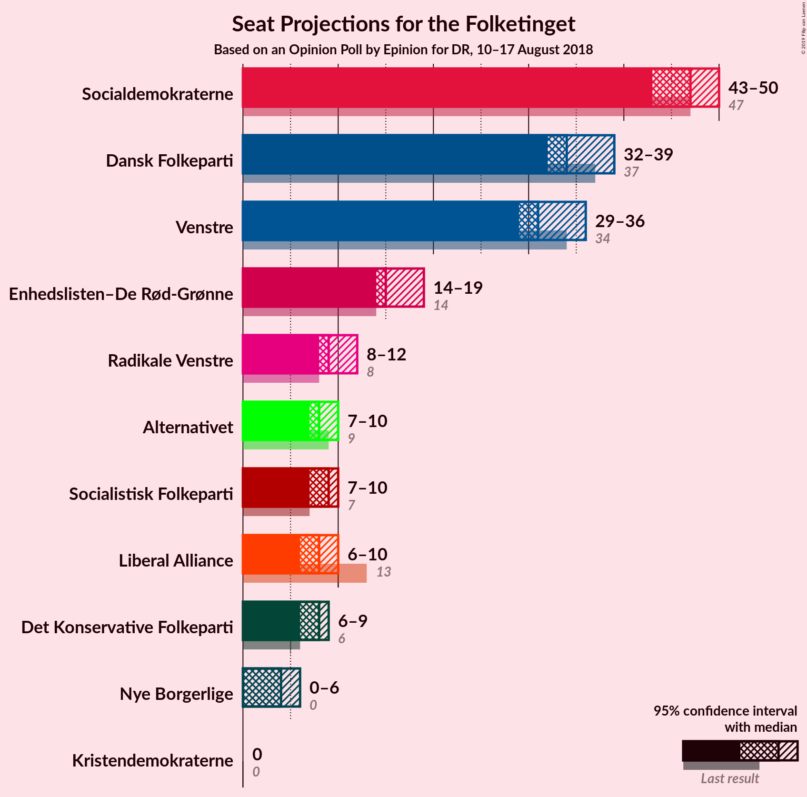
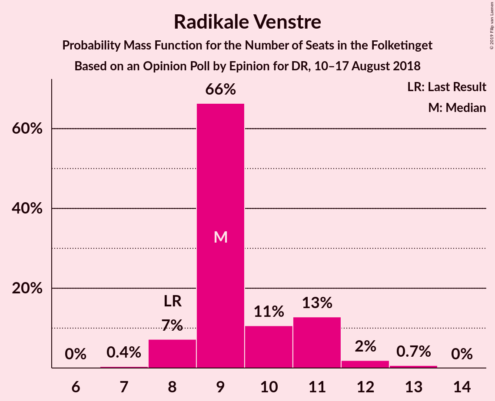
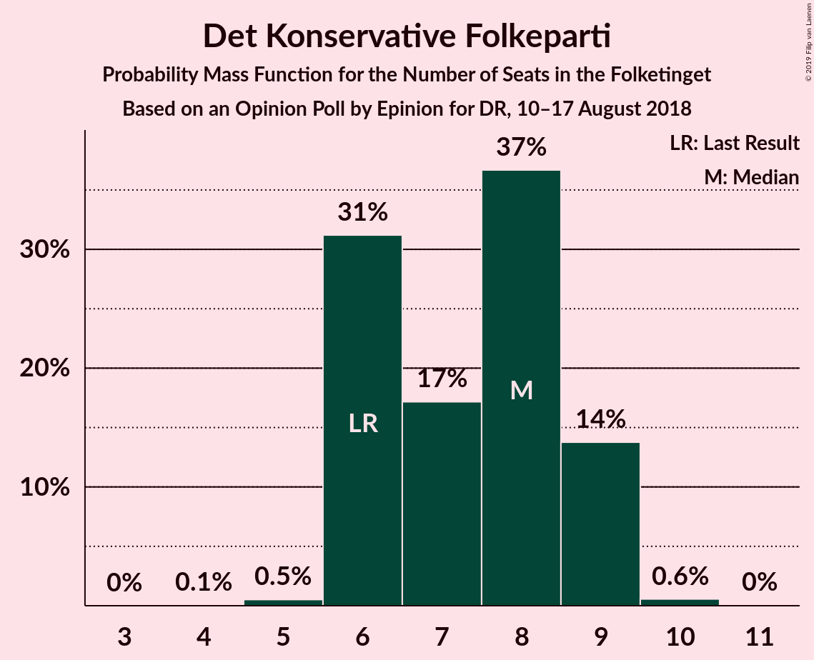

# Opinion Poll by Epinion for DR, 10–17 August 2018

<a href="#voting-intentions">Voting Intentions</a> | <a href="#seats">Seats</a> | <a href="#coalitions">Coalitions</a> | <a href="#technical-information">Technical Information</a>

## Voting Intentions

### Confidence Intervals

| Party | Last Result | Poll Result | 80% Confidence Interval | 90% Confidence Interval | 95% Confidence Interval | 99% Confidence Interval |
|:-----:|:-----------:|:-----------:|:-----------------------:|:-----------------------:|:-----------------------:|:-----------------------:|
| Socialdemokraterne | 26.3% | 26.4% | 25.0–27.9% |24.6–28.3% |24.3–28.6% |23.6–29.3% |
| Dansk Folkeparti | 21.1% | 19.7% | 18.4–21.0% |18.1–21.4% |17.8–21.7% |17.2–22.4% |
| Venstre | 19.5% | 18.4% | 17.2–19.7% |16.9–20.1% |16.6–20.4% |16.0–21.1% |
| Enhedslisten–De Rød-Grønne | 7.8% | 9.1% | 8.2–10.1% |8.0–10.4% |7.8–10.7% |7.4–11.1% |
| Radikale Venstre | 4.6% | 5.6% | 4.9–6.4% |4.7–6.7% |4.6–6.9% |4.3–7.3% |
| Socialistisk Folkeparti | 4.2% | 4.6% | 4.0–5.3% |3.8–5.6% |3.7–5.7% |3.4–6.1% |
| Liberal Alliance | 7.5% | 4.5% | 3.9–5.3% |3.7–5.5% |3.6–5.7% |3.3–6.1% |
| Alternativet | 4.8% | 4.5% | 3.9–5.3% |3.7–5.5% |3.6–5.7% |3.3–6.1% |
| Det Konservative Folkeparti | 3.4% | 4.1% | 3.5–4.8% |3.3–5.0% |3.2–5.2% |2.9–5.5% |
| Nye Borgerlige | 0.0% | 2.6% | 2.2–3.2% |2.0–3.4% |1.9–3.5% |1.7–3.8% |
| Kristendemokraterne | 0.8% | 0.6% | 0.4–0.9% |0.3–1.0% |0.3–1.1% |0.2–1.3% |

*Note:* The poll result column reflects the actual value used in the calculations. Published results may vary slightly, and in addition be rounded to fewer digits.

## Seats

### Confidence Intervals

| Party | Last Result | Median | 80% Confidence Interval | 90% Confidence Interval | 95% Confidence Interval | 99% Confidence Interval |
|:-----:|:-----------:|:------:|:-----------------------:|:-----------------------:|:-----------------------:|:-----------------------:|
| <a href="#socialdemokraterne">Socialdemokraterne</a> | 47 | 50 | 46–50 |45–50 |44–50 |43–50 |
| <a href="#dansk-folkeparti">Dansk Folkeparti</a> | 37 | 34 | 34 |34 |32–35 |32–35 |
| <a href="#venstre">Venstre</a> | 34 | 30 | 30–33 |30–33 |30–36 |28–36 |
| <a href="#enhedslisten–de-rød-grønne">Enhedslisten–De Rød-Grønne</a> | 14 | 15 | 15–17 |15–17 |15–17 |14–18 |
| <a href="#radikale-venstre">Radikale Venstre</a> | 8 | 9 | 9 |9–10 |8–10 |8–11 |
| <a href="#socialistisk-folkeparti">Socialistisk Folkeparti</a> | 7 | 9 | 8–9 |8–9 |7–9 |7–11 |
| <a href="#liberal-alliance">Liberal Alliance</a> | 13 | 9 | 7–9 |7–9 |7–9 |7–9 |
| <a href="#alternativet">Alternativet</a> | 9 | 7 | 7–10 |7–10 |7–10 |7–10 |
| <a href="#det-konservative-folkeparti">Det Konservative Folkeparti</a> | 6 | 8 | 7–8 |7–8 |7–9 |6–9 |
| <a href="#nye-borgerlige">Nye Borgerlige</a> | 0 | 4 | 4 |4–6 |4–6 |4–6 |
| <a href="#kristendemokraterne">Kristendemokraterne</a> | 0 | 0 | 0 |0 |0 |0 |

### Socialdemokraterne

*For a full overview of the results for this party, see the [Socialdemokraterne](party-socialdemokraterne.html) page.*

| Number of Seats | Probability | Accumulated | Special Marks |
|:---------------:|:-----------:|:-----------:|:-------------:|
| 40 | 0.1% | 100% |  |
| 41 | 0% | 99.9% |  |
| 42 | 0% | 99.9% |  |
| 43 | 0.7% | 99.8% |  |
| 44 | 3% | 99.2% |  |
| 45 | 2% | 96% |  |
| 46 | 9% | 94% |  |
| 47 | 1.1% | 84% | Last Result |
| 48 | 2% | 83% |  |
| 49 | 0.1% | 81% |  |
| 50 | 81% | 81% | Median |
| 51 | 0.5% | 0.5% |  |
| 52 | 0% | 0% |  |

### Dansk Folkeparti

*For a full overview of the results for this party, see the [Dansk Folkeparti](party-danskfolkeparti.html) page.*

| Number of Seats | Probability | Accumulated | Special Marks |
|:---------------:|:-----------:|:-----------:|:-------------:|
| 31 | 0.1% | 100% |  |
| 32 | 4% | 99.9% |  |
| 33 | 0.2% | 96% |  |
| 34 | 92% | 95% | Median |
| 35 | 3% | 4% |  |
| 36 | 0.2% | 0.3% |  |
| 37 | 0% | 0.1% | Last Result |
| 38 | 0% | 0.1% |  |
| 39 | 0% | 0% |  |

### Venstre

*For a full overview of the results for this party, see the [Venstre](party-venstre.html) page.*

| Number of Seats | Probability | Accumulated | Special Marks |
|:---------------:|:-----------:|:-----------:|:-------------:|
| 27 | 0.2% | 100% |  |
| 28 | 0.9% | 99.8% |  |
| 29 | 0% | 98.9% |  |
| 30 | 83% | 98.9% | Median |
| 31 | 0.1% | 16% |  |
| 32 | 0.3% | 16% |  |
| 33 | 13% | 16% |  |
| 34 | 0.1% | 3% | Last Result |
| 35 | 0% | 3% |  |
| 36 | 3% | 3% |  |
| 37 | 0% | 0% |  |

### Enhedslisten–De Rød-Grønne

*For a full overview of the results for this party, see the [Enhedslisten–De Rød-Grønne](party-enhedslisten–derød-grønne.html) page.*

| Number of Seats | Probability | Accumulated | Special Marks |
|:---------------:|:-----------:|:-----------:|:-------------:|
| 14 | 0.9% | 100% | Last Result |
| 15 | 83% | 99.1% | Median |
| 16 | 4% | 16% |  |
| 17 | 11% | 13% |  |
| 18 | 2% | 2% |  |
| 19 | 0.1% | 0.1% |  |
| 20 | 0% | 0.1% |  |
| 21 | 0% | 0% |  |

### Radikale Venstre

*For a full overview of the results for this party, see the [Radikale Venstre](party-radikalevenstre.html) page.*

| Number of Seats | Probability | Accumulated | Special Marks |
|:---------------:|:-----------:|:-----------:|:-------------:|
| 8 | 3% | 100% | Last Result |
| 9 | 92% | 97% | Median |
| 10 | 4% | 5% |  |
| 11 | 0.7% | 1.1% |  |
| 12 | 0.1% | 0.3% |  |
| 13 | 0.2% | 0.2% |  |
| 14 | 0% | 0.1% |  |
| 15 | 0% | 0% |  |

### Socialistisk Folkeparti

*For a full overview of the results for this party, see the [Socialistisk Folkeparti](party-socialistiskfolkeparti.html) page.*

| Number of Seats | Probability | Accumulated | Special Marks |
|:---------------:|:-----------:|:-----------:|:-------------:|
| 6 | 0.2% | 100% |  |
| 7 | 4% | 99.8% | Last Result |
| 8 | 10% | 96% |  |
| 9 | 85% | 86% | Median |
| 10 | 0.1% | 0.9% |  |
| 11 | 0.8% | 0.8% |  |
| 12 | 0% | 0% |  |

### Liberal Alliance

*For a full overview of the results for this party, see the [Liberal Alliance](party-liberalalliance.html) page.*

| Number of Seats | Probability | Accumulated | Special Marks |
|:---------------:|:-----------:|:-----------:|:-------------:|
| 5 | 0.1% | 100% |  |
| 6 | 0.1% | 99.9% |  |
| 7 | 12% | 99.8% |  |
| 8 | 1.2% | 88% |  |
| 9 | 86% | 87% | Median |
| 10 | 0.4% | 0.5% |  |
| 11 | 0.1% | 0.1% |  |
| 12 | 0% | 0% |  |
| 13 | 0% | 0% | Last Result |

### Alternativet

*For a full overview of the results for this party, see the [Alternativet](party-alternativet.html) page.*

| Number of Seats | Probability | Accumulated | Special Marks |
|:---------------:|:-----------:|:-----------:|:-------------:|
| 6 | 0.3% | 100% |  |
| 7 | 86% | 99.7% | Median |
| 8 | 0.3% | 14% |  |
| 9 | 1.2% | 14% | Last Result |
| 10 | 13% | 13% |  |
| 11 | 0% | 0% |  |

### Det Konservative Folkeparti

*For a full overview of the results for this party, see the [Det Konservative Folkeparti](party-detkonservativefolkeparti.html) page.*

| Number of Seats | Probability | Accumulated | Special Marks |
|:---------------:|:-----------:|:-----------:|:-------------:|
| 5 | 0.1% | 100% |  |
| 6 | 2% | 99.9% | Last Result |
| 7 | 14% | 98% |  |
| 8 | 81% | 84% | Median |
| 9 | 3% | 3% |  |
| 10 | 0.1% | 0.1% |  |
| 11 | 0% | 0% |  |

### Nye Borgerlige

*For a full overview of the results for this party, see the [Nye Borgerlige](party-nyeborgerlige.html) page.*

| Number of Seats | Probability | Accumulated | Special Marks |
|:---------------:|:-----------:|:-----------:|:-------------:|
| 0 | 0% | 100% | Last Result |
| 1 | 0% | 100% |  |
| 2 | 0% | 100% |  |
| 3 | 0% | 100% |  |
| 4 | 91% | 100% | Median |
| 5 | 3% | 9% |  |
| 6 | 6% | 6% |  |
| 7 | 0.1% | 0.1% |  |
| 8 | 0% | 0% |  |

### Kristendemokraterne

*For a full overview of the results for this party, see the [Kristendemokraterne](party-kristendemokraterne.html) page.*

| Number of Seats | Probability | Accumulated | Special Marks |
|:---------------:|:-----------:|:-----------:|:-------------:|
| 0 | 100% | 100% | Last Result, Median |

## Coalitions

### Confidence Intervals

| Coalition | Last Result | Median | Majority? | 80% Confidence Interval | 90% Confidence Interval | 95% Confidence Interval | 99% Confidence Interval |
|:---------:|:-----------:|:------:|:---------:|:-----------------------:|:-----------------------:|:-----------------------:|:-----------------------:|
| Socialdemokraterne – Enhedslisten–De Rød-Grønne – Radikale Venstre – Socialistisk Folkeparti – Alternativet | 85 | 90 | 94% | 90 | 86–90 | 85–92 | 81–93 |
| Dansk Folkeparti – Venstre – Liberal Alliance – Det Konservative Folkeparti – Nye Borgerlige – Kristendemokraterne | 90 | 85 | 4% | 85 | 85–89 | 83–90 | 82–94 |
| Dansk Folkeparti – Venstre – Liberal Alliance – Det Konservative Folkeparti – Nye Borgerlige | 90 | 85 | 4% | 85 | 85–89 | 83–90 | 82–94 |
| Dansk Folkeparti – Venstre – Liberal Alliance – Det Konservative Folkeparti – Kristendemokraterne | 90 | 81 | 0% | 81 | 81–84 | 77–84 | 77–88 |
| Dansk Folkeparti – Venstre – Liberal Alliance – Det Konservative Folkeparti | 90 | 81 | 0% | 81 | 81–84 | 77–84 | 77–88 |
| Socialdemokraterne – Enhedslisten–De Rød-Grønne – Radikale Venstre – Socialistisk Folkeparti | 76 | 83 | 0% | 80–83 | 79–83 | 75–84 | 74–85 |
| Socialdemokraterne – Enhedslisten–De Rød-Grønne – Socialistisk Folkeparti – Alternativet | 77 | 81 | 0% | 81 | 77–81 | 76–82 | 72–84 |
| Socialdemokraterne – Enhedslisten–De Rød-Grønne – Socialistisk Folkeparti | 68 | 74 | 0% | 71–74 | 69–74 | 67–75 | 65–75 |
| Socialdemokraterne – Radikale Venstre – Socialistisk Folkeparti | 62 | 68 | 0% | 63–68 | 63–68 | 59–68 | 59–69 |
| Socialdemokraterne – Radikale Venstre | 55 | 59 | 0% | 55–59 | 55–59 | 52–59 | 52–61 |
| Venstre – Liberal Alliance – Det Konservative Folkeparti | 53 | 47 | 0% | 47 | 47–49 | 45–52 | 43–54 |
| Venstre – Det Konservative Folkeparti | 40 | 38 | 0% | 38–40 | 38–40 | 36–45 | 35–45 |
| Venstre | 34 | 30 | 0% | 30–33 | 30–33 | 30–36 | 28–36 |

### Socialdemokraterne – Enhedslisten–De Rød-Grønne – Radikale Venstre – Socialistisk Folkeparti – Alternativet

| Number of Seats | Probability | Accumulated | Special Marks |
|:---------------:|:-----------:|:-----------:|:-------------:|
| 81 | 0.6% | 100% |  |
| 82 | 0% | 99.4% |  |
| 83 | 0% | 99.4% |  |
| 84 | 0% | 99.4% |  |
| 85 | 3% | 99.4% | Last Result |
| 86 | 2% | 96% |  |
| 87 | 0.1% | 94% |  |
| 88 | 0% | 94% |  |
| 89 | 0.3% | 94% |  |
| 90 | 90% | 94% | Median, Majority |
| 91 | 0.3% | 3% |  |
| 92 | 2% | 3% |  |
| 93 | 0.8% | 1.2% |  |
| 94 | 0.3% | 0.3% |  |
| 95 | 0% | 0% |  |

### Dansk Folkeparti – Venstre – Liberal Alliance – Det Konservative Folkeparti – Nye Borgerlige – Kristendemokraterne

| Number of Seats | Probability | Accumulated | Special Marks |
|:---------------:|:-----------:|:-----------:|:-------------:|
| 81 | 0.3% | 100% |  |
| 82 | 0.8% | 99.7% |  |
| 83 | 2% | 98.8% |  |
| 84 | 0.3% | 97% |  |
| 85 | 90% | 97% | Median |
| 86 | 0.3% | 6% |  |
| 87 | 0% | 6% |  |
| 88 | 0.1% | 6% |  |
| 89 | 2% | 6% |  |
| 90 | 3% | 4% | Last Result, Majority |
| 91 | 0% | 0.6% |  |
| 92 | 0% | 0.6% |  |
| 93 | 0% | 0.6% |  |
| 94 | 0.6% | 0.6% |  |
| 95 | 0% | 0% |  |

### Dansk Folkeparti – Venstre – Liberal Alliance – Det Konservative Folkeparti – Nye Borgerlige

| Number of Seats | Probability | Accumulated | Special Marks |
|:---------------:|:-----------:|:-----------:|:-------------:|
| 81 | 0.3% | 100% |  |
| 82 | 0.8% | 99.7% |  |
| 83 | 2% | 98.8% |  |
| 84 | 0.3% | 97% |  |
| 85 | 90% | 97% | Median |
| 86 | 0.3% | 6% |  |
| 87 | 0% | 6% |  |
| 88 | 0.1% | 6% |  |
| 89 | 2% | 6% |  |
| 90 | 3% | 4% | Last Result, Majority |
| 91 | 0% | 0.6% |  |
| 92 | 0% | 0.6% |  |
| 93 | 0% | 0.6% |  |
| 94 | 0.6% | 0.6% |  |
| 95 | 0% | 0% |  |

### Dansk Folkeparti – Venstre – Liberal Alliance – Det Konservative Folkeparti – Kristendemokraterne

| Number of Seats | Probability | Accumulated | Special Marks |
|:---------------:|:-----------:|:-----------:|:-------------:|
| 76 | 0.3% | 100% |  |
| 77 | 3% | 99.7% |  |
| 78 | 0% | 97% |  |
| 79 | 0.1% | 97% |  |
| 80 | 0.4% | 97% |  |
| 81 | 90% | 97% | Median |
| 82 | 0.2% | 6% |  |
| 83 | 0.1% | 6% |  |
| 84 | 5% | 6% |  |
| 85 | 0.1% | 0.7% |  |
| 86 | 0% | 0.7% |  |
| 87 | 0% | 0.6% |  |
| 88 | 0.6% | 0.6% |  |
| 89 | 0% | 0% |  |
| 90 | 0% | 0% | Last Result, Majority |

### Dansk Folkeparti – Venstre – Liberal Alliance – Det Konservative Folkeparti

| Number of Seats | Probability | Accumulated | Special Marks |
|:---------------:|:-----------:|:-----------:|:-------------:|
| 76 | 0.3% | 100% |  |
| 77 | 3% | 99.7% |  |
| 78 | 0% | 97% |  |
| 79 | 0.1% | 97% |  |
| 80 | 0.4% | 97% |  |
| 81 | 90% | 97% | Median |
| 82 | 0.2% | 6% |  |
| 83 | 0.1% | 6% |  |
| 84 | 5% | 6% |  |
| 85 | 0.1% | 0.7% |  |
| 86 | 0% | 0.7% |  |
| 87 | 0% | 0.6% |  |
| 88 | 0.6% | 0.6% |  |
| 89 | 0% | 0% |  |
| 90 | 0% | 0% | Last Result, Majority |

### Socialdemokraterne – Enhedslisten–De Rød-Grønne – Radikale Venstre – Socialistisk Folkeparti

| Number of Seats | Probability | Accumulated | Special Marks |
|:---------------:|:-----------:|:-----------:|:-------------:|
| 74 | 0.6% | 100% |  |
| 75 | 3% | 99.4% |  |
| 76 | 0.1% | 96% | Last Result |
| 77 | 0.1% | 96% |  |
| 78 | 0.1% | 96% |  |
| 79 | 2% | 96% |  |
| 80 | 9% | 94% |  |
| 81 | 0% | 84% |  |
| 82 | 0.1% | 84% |  |
| 83 | 81% | 84% | Median |
| 84 | 0.8% | 3% |  |
| 85 | 2% | 2% |  |
| 86 | 0% | 0% |  |

### Socialdemokraterne – Enhedslisten–De Rød-Grønne – Socialistisk Folkeparti – Alternativet

| Number of Seats | Probability | Accumulated | Special Marks |
|:---------------:|:-----------:|:-----------:|:-------------:|
| 72 | 0.7% | 100% |  |
| 73 | 0% | 99.3% |  |
| 74 | 0% | 99.3% |  |
| 75 | 0.1% | 99.3% |  |
| 76 | 2% | 99.2% |  |
| 77 | 3% | 97% | Last Result |
| 78 | 0.1% | 94% |  |
| 79 | 0.2% | 94% |  |
| 80 | 0.6% | 94% |  |
| 81 | 90% | 93% | Median |
| 82 | 2% | 3% |  |
| 83 | 0.2% | 1.1% |  |
| 84 | 0.8% | 0.8% |  |
| 85 | 0% | 0% |  |

### Socialdemokraterne – Enhedslisten–De Rød-Grønne – Socialistisk Folkeparti

| Number of Seats | Probability | Accumulated | Special Marks |
|:---------------:|:-----------:|:-----------:|:-------------:|
| 63 | 0.1% | 100% |  |
| 64 | 0% | 99.9% |  |
| 65 | 0.6% | 99.9% |  |
| 66 | 0% | 99.3% |  |
| 67 | 3% | 99.3% |  |
| 68 | 0.1% | 96% | Last Result |
| 69 | 2% | 96% |  |
| 70 | 0.3% | 94% |  |
| 71 | 9% | 94% |  |
| 72 | 0.3% | 84% |  |
| 73 | 0.1% | 84% |  |
| 74 | 81% | 84% | Median |
| 75 | 3% | 3% |  |
| 76 | 0% | 0% |  |

### Socialdemokraterne – Radikale Venstre – Socialistisk Folkeparti

| Number of Seats | Probability | Accumulated | Special Marks |
|:---------------:|:-----------:|:-----------:|:-------------:|
| 59 | 3% | 100% |  |
| 60 | 0.6% | 97% |  |
| 61 | 0% | 96% |  |
| 62 | 0.3% | 96% | Last Result |
| 63 | 9% | 96% |  |
| 64 | 2% | 86% |  |
| 65 | 0.2% | 84% |  |
| 66 | 0% | 84% |  |
| 67 | 3% | 84% |  |
| 68 | 81% | 81% | Median |
| 69 | 0.5% | 0.5% |  |
| 70 | 0% | 0% |  |

### Socialdemokraterne – Radikale Venstre

| Number of Seats | Probability | Accumulated | Special Marks |
|:---------------:|:-----------:|:-----------:|:-------------:|
| 51 | 0.1% | 100% |  |
| 52 | 4% | 99.9% |  |
| 53 | 0.1% | 96% |  |
| 54 | 0.1% | 96% |  |
| 55 | 11% | 96% | Last Result |
| 56 | 1.0% | 85% |  |
| 57 | 0.1% | 84% |  |
| 58 | 2% | 84% |  |
| 59 | 81% | 81% | Median |
| 60 | 0.1% | 0.6% |  |
| 61 | 0% | 0.5% |  |
| 62 | 0.5% | 0.5% |  |
| 63 | 0% | 0% |  |

### Venstre – Liberal Alliance – Det Konservative Folkeparti

| Number of Seats | Probability | Accumulated | Special Marks |
|:---------------:|:-----------:|:-----------:|:-------------:|
| 42 | 0.3% | 100% |  |
| 43 | 0.8% | 99.7% |  |
| 44 | 0% | 98.9% |  |
| 45 | 2% | 98.8% |  |
| 46 | 0.3% | 97% |  |
| 47 | 90% | 97% | Median |
| 48 | 0.4% | 6% |  |
| 49 | 3% | 6% |  |
| 50 | 0.2% | 3% |  |
| 51 | 0% | 3% |  |
| 52 | 2% | 3% |  |
| 53 | 0% | 0.6% | Last Result |
| 54 | 0.6% | 0.6% |  |
| 55 | 0% | 0% |  |

### Venstre – Det Konservative Folkeparti

| Number of Seats | Probability | Accumulated | Special Marks |
|:---------------:|:-----------:|:-----------:|:-------------:|
| 34 | 0.2% | 100% |  |
| 35 | 0.9% | 99.8% |  |
| 36 | 2% | 98.9% |  |
| 37 | 0% | 97% |  |
| 38 | 81% | 97% | Median |
| 39 | 0.3% | 16% |  |
| 40 | 13% | 16% | Last Result |
| 41 | 0.1% | 3% |  |
| 42 | 0% | 3% |  |
| 43 | 0.1% | 3% |  |
| 44 | 0% | 3% |  |
| 45 | 3% | 3% |  |
| 46 | 0% | 0% |  |

### Venstre

| Number of Seats | Probability | Accumulated | Special Marks |
|:---------------:|:-----------:|:-----------:|:-------------:|
| 27 | 0.2% | 100% |  |
| 28 | 0.9% | 99.8% |  |
| 29 | 0% | 98.9% |  |
| 30 | 83% | 98.9% | Median |
| 31 | 0.1% | 16% |  |
| 32 | 0.3% | 16% |  |
| 33 | 13% | 16% |  |
| 34 | 0.1% | 3% | Last Result |
| 35 | 0% | 3% |  |
| 36 | 3% | 3% |  |
| 37 | 0% | 0% |  |

## Technical Information

### Opinion Poll

+ **Polling firm:** Epinion
+ **Commissioner(s):** DR
+ **Fieldwork period:** 10–17 August 2018

### Calculations

+ **Sample size:** 1569
+ **Simulations done:** 131,072
+ **Error estimate:** 2.18%

