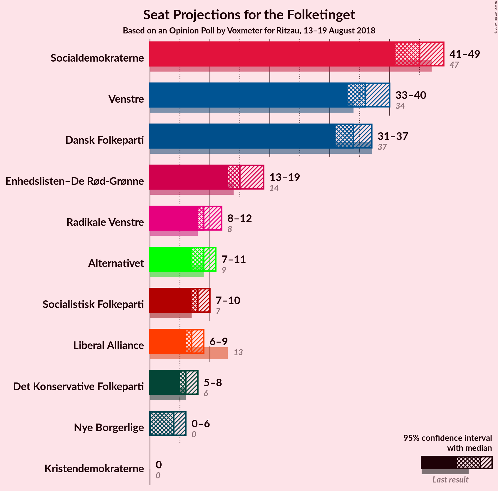
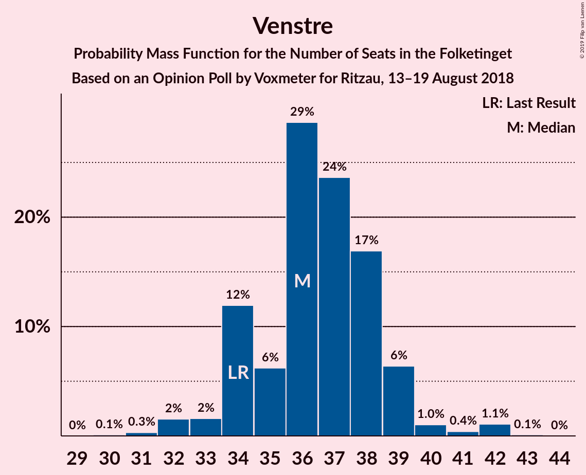
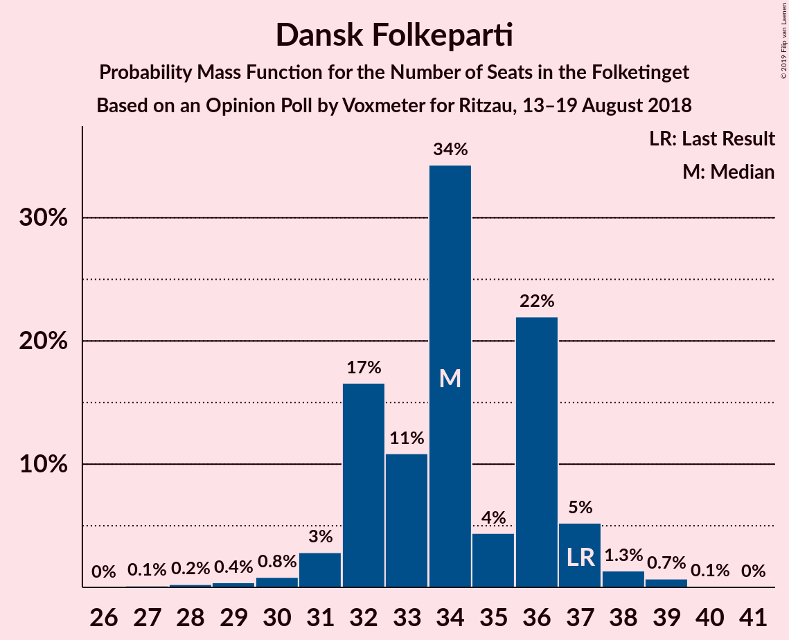
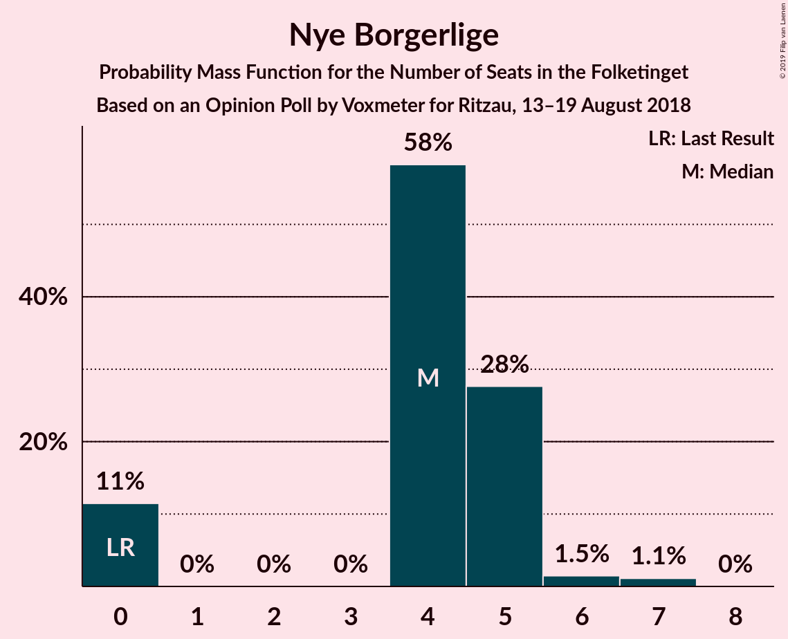

# Opinion Poll by Voxmeter for Ritzau, 13–19 August 2018

<a href="#voting-intentions">Voting Intentions</a> | <a href="#seats">Seats</a> | <a href="#coalitions">Coalitions</a> | <a href="#technical-information">Technical Information</a>

## Voting Intentions

### Confidence Intervals

| Party | Last Result | Poll Result | 80% Confidence Interval | 90% Confidence Interval | 95% Confidence Interval | 99% Confidence Interval |
|:-----:|:-----------:|:-----------:|:-----------------------:|:-----------------------:|:-----------------------:|:-----------------------:|
| Socialdemokraterne | 26.3% | 26.0% | 24.3–27.8% |23.8–28.3% |23.4–28.8% |22.6–29.6% |
| Venstre | 19.5% | 20.4% | 18.8–22.1% |18.4–22.5% |18.0–22.9% |17.3–23.8% |
| Dansk Folkeparti | 21.1% | 18.9% | 17.4–20.6% |17.0–21.0% |16.6–21.4% |15.9–22.2% |
| Enhedslisten–De Rød-Grønne | 7.8% | 8.6% | 7.6–9.9% |7.3–10.2% |7.1–10.5% |6.6–11.1% |
| Radikale Venstre | 4.6% | 5.3% | 4.5–6.3% |4.3–6.6% |4.1–6.9% |3.8–7.4% |
| Alternativet | 4.8% | 4.8% | 4.0–5.7% |3.8–6.0% |3.6–6.2% |3.3–6.7% |
| Socialistisk Folkeparti | 4.2% | 4.6% | 3.8–5.5% |3.6–5.8% |3.4–6.0% |3.1–6.5% |
| Liberal Alliance | 7.5% | 4.5% | 3.7–5.4% |3.5–5.7% |3.4–5.9% |3.0–6.4% |
| Det Konservative Folkeparti | 3.4% | 3.4% | 2.8–4.2% |2.6–4.5% |2.5–4.7% |2.2–5.1% |
| Nye Borgerlige | 0.0% | 2.2% | 1.7–2.9% |1.6–3.2% |1.5–3.3% |1.3–3.7% |
| Kristendemokraterne | 0.8% | 0.8% | 0.5–1.3% |0.4–1.4% |0.4–1.5% |0.3–1.8% |

*Note:* The poll result column reflects the actual value used in the calculations. Published results may vary slightly, and in addition be rounded to fewer digits.

## Seats

### Confidence Intervals

| Party | Last Result | Median | 80% Confidence Interval | 90% Confidence Interval | 95% Confidence Interval | 99% Confidence Interval |
|:-----:|:-----------:|:------:|:-----------------------:|:-----------------------:|:-----------------------:|:-----------------------:|
| <a href="#socialdemokraterne">Socialdemokraterne</a> | 47 | 45 | 43–47 |42–48 |41–49 |40–51 |
| <a href="#venstre">Venstre</a> | 34 | 36 | 34–38 |34–39 |33–40 |32–42 |
| <a href="#dansk-folkeparti">Dansk Folkeparti</a> | 37 | 34 | 32–36 |32–37 |31–37 |29–39 |
| <a href="#enhedslisten–de-rød-grønne">Enhedslisten–De Rød-Grønne</a> | 14 | 15 | 14–18 |14–18 |13–19 |12–19 |
| <a href="#radikale-venstre">Radikale Venstre</a> | 8 | 9 | 8–10 |8–11 |8–12 |7–13 |
| <a href="#alternativet">Alternativet</a> | 9 | 9 | 8–10 |7–11 |7–11 |6–12 |
| <a href="#socialistisk-folkeparti">Socialistisk Folkeparti</a> | 7 | 8 | 7–8 |7–9 |7–10 |6–11 |
| <a href="#liberal-alliance">Liberal Alliance</a> | 13 | 7 | 7–9 |7–9 |6–9 |6–11 |
| <a href="#det-konservative-folkeparti">Det Konservative Folkeparti</a> | 6 | 6 | 5–8 |5–8 |5–8 |4–9 |
| <a href="#nye-borgerlige">Nye Borgerlige</a> | 0 | 4 | 0–5 |0–5 |0–6 |0–7 |
| <a href="#kristendemokraterne">Kristendemokraterne</a> | 0 | 0 | 0 |0 |0 |0 |

### Socialdemokraterne

*For a full overview of the results for this party, see the [Socialdemokraterne](party-socialdemokraterne.html) page.*

| Number of Seats | Probability | Accumulated | Special Marks |
|:---------------:|:-----------:|:-----------:|:-------------:|
| 39 | 0% | 100% |  |
| 40 | 0.7% | 99.9% |  |
| 41 | 3% | 99.3% |  |
| 42 | 3% | 96% |  |
| 43 | 6% | 93% |  |
| 44 | 30% | 87% |  |
| 45 | 15% | 57% | Median |
| 46 | 8% | 42% |  |
| 47 | 26% | 34% | Last Result |
| 48 | 4% | 8% |  |
| 49 | 2% | 4% |  |
| 50 | 0.5% | 1.4% |  |
| 51 | 0.6% | 0.9% |  |
| 52 | 0.2% | 0.3% |  |
| 53 | 0.1% | 0.2% |  |
| 54 | 0% | 0.1% |  |
| 55 | 0% | 0% |  |

### Venstre

*For a full overview of the results for this party, see the [Venstre](party-venstre.html) page.*

| Number of Seats | Probability | Accumulated | Special Marks |
|:---------------:|:-----------:|:-----------:|:-------------:|
| 30 | 0.1% | 100% |  |
| 31 | 0.3% | 99.9% |  |
| 32 | 2% | 99.5% |  |
| 33 | 2% | 98% |  |
| 34 | 12% | 96% | Last Result |
| 35 | 6% | 84% |  |
| 36 | 29% | 78% | Median |
| 37 | 24% | 50% |  |
| 38 | 17% | 26% |  |
| 39 | 6% | 9% |  |
| 40 | 1.0% | 3% |  |
| 41 | 0.4% | 2% |  |
| 42 | 1.1% | 1.2% |  |
| 43 | 0.1% | 0.1% |  |
| 44 | 0% | 0% |  |

### Dansk Folkeparti

*For a full overview of the results for this party, see the [Dansk Folkeparti](party-danskfolkeparti.html) page.*

| Number of Seats | Probability | Accumulated | Special Marks |
|:---------------:|:-----------:|:-----------:|:-------------:|
| 27 | 0.1% | 100% |  |
| 28 | 0.2% | 99.8% |  |
| 29 | 0.4% | 99.6% |  |
| 30 | 0.8% | 99.2% |  |
| 31 | 3% | 98% |  |
| 32 | 17% | 96% |  |
| 33 | 11% | 79% |  |
| 34 | 34% | 68% | Median |
| 35 | 4% | 34% |  |
| 36 | 22% | 29% |  |
| 37 | 5% | 7% | Last Result |
| 38 | 1.3% | 2% |  |
| 39 | 0.7% | 0.8% |  |
| 40 | 0.1% | 0.1% |  |
| 41 | 0% | 0% |  |

### Enhedslisten–De Rød-Grønne

*For a full overview of the results for this party, see the [Enhedslisten–De Rød-Grønne](party-enhedslisten–derød-grønne.html) page.*

| Number of Seats | Probability | Accumulated | Special Marks |
|:---------------:|:-----------:|:-----------:|:-------------:|
| 11 | 0.1% | 100% |  |
| 12 | 1.4% | 99.9% |  |
| 13 | 2% | 98% |  |
| 14 | 30% | 97% | Last Result |
| 15 | 30% | 66% | Median |
| 16 | 10% | 36% |  |
| 17 | 16% | 26% |  |
| 18 | 8% | 10% |  |
| 19 | 2% | 3% |  |
| 20 | 0.3% | 0.4% |  |
| 21 | 0.1% | 0.1% |  |
| 22 | 0% | 0% |  |

### Radikale Venstre

*For a full overview of the results for this party, see the [Radikale Venstre](party-radikalevenstre.html) page.*

| Number of Seats | Probability | Accumulated | Special Marks |
|:---------------:|:-----------:|:-----------:|:-------------:|
| 6 | 0.2% | 100% |  |
| 7 | 1.0% | 99.8% |  |
| 8 | 10% | 98.9% | Last Result |
| 9 | 39% | 89% | Median |
| 10 | 42% | 50% |  |
| 11 | 4% | 8% |  |
| 12 | 3% | 5% |  |
| 13 | 2% | 2% |  |
| 14 | 0.1% | 0.2% |  |
| 15 | 0.1% | 0.1% |  |
| 16 | 0% | 0% |  |

### Alternativet

*For a full overview of the results for this party, see the [Alternativet](party-alternativet.html) page.*

| Number of Seats | Probability | Accumulated | Special Marks |
|:---------------:|:-----------:|:-----------:|:-------------:|
| 5 | 0.1% | 100% |  |
| 6 | 0.5% | 99.9% |  |
| 7 | 6% | 99.4% |  |
| 8 | 32% | 94% |  |
| 9 | 26% | 61% | Last Result, Median |
| 10 | 27% | 36% |  |
| 11 | 8% | 8% |  |
| 12 | 0.5% | 0.6% |  |
| 13 | 0% | 0% |  |

### Socialistisk Folkeparti

*For a full overview of the results for this party, see the [Socialistisk Folkeparti](party-socialistiskfolkeparti.html) page.*

| Number of Seats | Probability | Accumulated | Special Marks |
|:---------------:|:-----------:|:-----------:|:-------------:|
| 5 | 0.2% | 100% |  |
| 6 | 1.1% | 99.8% |  |
| 7 | 34% | 98.7% | Last Result |
| 8 | 56% | 65% | Median |
| 9 | 4% | 9% |  |
| 10 | 3% | 4% |  |
| 11 | 0.7% | 1.1% |  |
| 12 | 0.3% | 0.4% |  |
| 13 | 0.1% | 0.1% |  |
| 14 | 0% | 0% |  |

### Liberal Alliance

*For a full overview of the results for this party, see the [Liberal Alliance](party-liberalalliance.html) page.*

| Number of Seats | Probability | Accumulated | Special Marks |
|:---------------:|:-----------:|:-----------:|:-------------:|
| 5 | 0.1% | 100% |  |
| 6 | 3% | 99.9% |  |
| 7 | 64% | 97% | Median |
| 8 | 15% | 33% |  |
| 9 | 16% | 18% |  |
| 10 | 0.8% | 1.5% |  |
| 11 | 0.4% | 0.7% |  |
| 12 | 0.2% | 0.3% |  |
| 13 | 0.1% | 0.1% | Last Result |
| 14 | 0% | 0% |  |

### Det Konservative Folkeparti

*For a full overview of the results for this party, see the [Det Konservative Folkeparti](party-detkonservativefolkeparti.html) page.*

| Number of Seats | Probability | Accumulated | Special Marks |
|:---------------:|:-----------:|:-----------:|:-------------:|
| 3 | 0% | 100% |  |
| 4 | 1.1% | 99.9% |  |
| 5 | 43% | 98.9% |  |
| 6 | 9% | 56% | Last Result, Median |
| 7 | 34% | 46% |  |
| 8 | 11% | 12% |  |
| 9 | 0.5% | 0.6% |  |
| 10 | 0.1% | 0.1% |  |
| 11 | 0% | 0% |  |

### Nye Borgerlige

*For a full overview of the results for this party, see the [Nye Borgerlige](party-nyeborgerlige.html) page.*

| Number of Seats | Probability | Accumulated | Special Marks |
|:---------------:|:-----------:|:-----------:|:-------------:|
| 0 | 11% | 100% | Last Result |
| 1 | 0% | 89% |  |
| 2 | 0% | 89% |  |
| 3 | 0% | 89% |  |
| 4 | 58% | 89% | Median |
| 5 | 28% | 30% |  |
| 6 | 1.5% | 3% |  |
| 7 | 1.1% | 1.1% |  |
| 8 | 0% | 0% |  |

### Kristendemokraterne

*For a full overview of the results for this party, see the [Kristendemokraterne](party-kristendemokraterne.html) page.*

| Number of Seats | Probability | Accumulated | Special Marks |
|:---------------:|:-----------:|:-----------:|:-------------:|
| 0 | 99.9% | 100% | Last Result, Median |
| 1 | 0% | 0.1% |  |
| 2 | 0% | 0.1% |  |
| 3 | 0% | 0.1% |  |
| 4 | 0.1% | 0.1% |  |
| 5 | 0% | 0% |  |

## Coalitions

### Confidence Intervals

| Coalition | Last Result | Median | Majority? | 80% Confidence Interval | 90% Confidence Interval | 95% Confidence Interval | 99% Confidence Interval |
|:---------:|:-----------:|:------:|:---------:|:-----------------------:|:-----------------------:|:-----------------------:|:-----------------------:|
| Venstre – Dansk Folkeparti – Liberal Alliance – Det Konservative Folkeparti – Nye Borgerlige – Kristendemokraterne | 90 | 86 | 34% | 85–92 | 85–93 | 83–94 | 80–94 |
| Venstre – Dansk Folkeparti – Liberal Alliance – Det Konservative Folkeparti – Nye Borgerlige | 90 | 86 | 34% | 85–92 | 85–93 | 83–94 | 80–94 |
| Socialdemokraterne – Enhedslisten–De Rød-Grønne – Radikale Venstre – Alternativet – Socialistisk Folkeparti | 85 | 89 | 11% | 83–90 | 82–90 | 81–92 | 81–95 |
| Venstre – Dansk Folkeparti – Liberal Alliance – Det Konservative Folkeparti – Kristendemokraterne | 90 | 83 | 6% | 82–88 | 81–90 | 79–90 | 77–91 |
| Venstre – Dansk Folkeparti – Liberal Alliance – Det Konservative Folkeparti | 90 | 83 | 6% | 82–88 | 81–90 | 79–90 | 77–91 |
| Socialdemokraterne – Enhedslisten–De Rød-Grønne – Radikale Venstre – Socialistisk Folkeparti | 76 | 79 | 0% | 75–81 | 74–81 | 72–83 | 72–85 |
| Socialdemokraterne – Enhedslisten–De Rød-Grønne – Alternativet – Socialistisk Folkeparti | 77 | 79 | 0% | 74–81 | 73–81 | 72–82 | 72–84 |
| Socialdemokraterne – Enhedslisten–De Rød-Grønne – Socialistisk Folkeparti | 68 | 69 | 0% | 66–72 | 64–73 | 64–73 | 63–76 |
| Socialdemokraterne – Radikale Venstre – Socialistisk Folkeparti | 62 | 63 | 0% | 60–65 | 58–65 | 58–67 | 58–70 |
| Socialdemokraterne – Radikale Venstre | 55 | 55 | 0% | 51–57 | 51–57 | 51–59 | 50–62 |
| Venstre – Liberal Alliance – Det Konservative Folkeparti | 53 | 50 | 0% | 48–53 | 48–55 | 46–56 | 44–56 |
| Venstre – Det Konservative Folkeparti | 40 | 43 | 0% | 41–44 | 40–46 | 38–47 | 37–49 |
| Venstre | 34 | 36 | 0% | 34–38 | 34–39 | 33–40 | 32–42 |

### Venstre – Dansk Folkeparti – Liberal Alliance – Det Konservative Folkeparti – Nye Borgerlige – Kristendemokraterne

| Number of Seats | Probability | Accumulated | Special Marks |
|:---------------:|:-----------:|:-----------:|:-------------:|
| 78 | 0.1% | 100% |  |
| 79 | 0% | 99.9% |  |
| 80 | 0.4% | 99.8% |  |
| 81 | 0.8% | 99.5% |  |
| 82 | 0.4% | 98.7% |  |
| 83 | 0.9% | 98% |  |
| 84 | 1.1% | 97% |  |
| 85 | 7% | 96% |  |
| 86 | 40% | 89% |  |
| 87 | 10% | 49% | Median |
| 88 | 4% | 39% |  |
| 89 | 0.8% | 35% |  |
| 90 | 0.8% | 34% | Last Result, Majority |
| 91 | 3% | 33% |  |
| 92 | 22% | 30% |  |
| 93 | 4% | 8% |  |
| 94 | 4% | 4% |  |
| 95 | 0% | 0.1% |  |
| 96 | 0% | 0.1% |  |
| 97 | 0% | 0% |  |

### Venstre – Dansk Folkeparti – Liberal Alliance – Det Konservative Folkeparti – Nye Borgerlige

| Number of Seats | Probability | Accumulated | Special Marks |
|:---------------:|:-----------:|:-----------:|:-------------:|
| 78 | 0.1% | 100% |  |
| 79 | 0% | 99.9% |  |
| 80 | 0.4% | 99.8% |  |
| 81 | 0.8% | 99.5% |  |
| 82 | 0.4% | 98.7% |  |
| 83 | 0.9% | 98% |  |
| 84 | 1.1% | 97% |  |
| 85 | 7% | 96% |  |
| 86 | 40% | 89% |  |
| 87 | 10% | 49% | Median |
| 88 | 4% | 39% |  |
| 89 | 0.7% | 35% |  |
| 90 | 0.8% | 34% | Last Result, Majority |
| 91 | 3% | 33% |  |
| 92 | 22% | 30% |  |
| 93 | 4% | 8% |  |
| 94 | 4% | 4% |  |
| 95 | 0% | 0.1% |  |
| 96 | 0% | 0.1% |  |
| 97 | 0% | 0% |  |

### Socialdemokraterne – Enhedslisten–De Rød-Grønne – Radikale Venstre – Alternativet – Socialistisk Folkeparti

| Number of Seats | Probability | Accumulated | Special Marks |
|:---------------:|:-----------:|:-----------:|:-------------:|
| 79 | 0% | 100% |  |
| 80 | 0% | 99.9% |  |
| 81 | 4% | 99.9% |  |
| 82 | 4% | 96% |  |
| 83 | 22% | 92% |  |
| 84 | 3% | 70% |  |
| 85 | 0.8% | 67% | Last Result |
| 86 | 0.8% | 66% | Median |
| 87 | 4% | 65% |  |
| 88 | 10% | 61% |  |
| 89 | 40% | 51% |  |
| 90 | 7% | 11% | Majority |
| 91 | 1.1% | 4% |  |
| 92 | 0.9% | 3% |  |
| 93 | 0.4% | 2% |  |
| 94 | 0.8% | 1.3% |  |
| 95 | 0.4% | 0.5% |  |
| 96 | 0% | 0.2% |  |
| 97 | 0.1% | 0.1% |  |
| 98 | 0% | 0% |  |

### Venstre – Dansk Folkeparti – Liberal Alliance – Det Konservative Folkeparti – Kristendemokraterne

| Number of Seats | Probability | Accumulated | Special Marks |
|:---------------:|:-----------:|:-----------:|:-------------:|
| 75 | 0% | 100% |  |
| 76 | 0.4% | 99.9% |  |
| 77 | 0.2% | 99.5% |  |
| 78 | 0.4% | 99.4% |  |
| 79 | 2% | 99.0% |  |
| 80 | 2% | 97% |  |
| 81 | 2% | 96% |  |
| 82 | 39% | 93% |  |
| 83 | 10% | 54% | Median |
| 84 | 2% | 44% |  |
| 85 | 7% | 42% |  |
| 86 | 2% | 36% |  |
| 87 | 23% | 34% |  |
| 88 | 2% | 11% |  |
| 89 | 4% | 10% |  |
| 90 | 4% | 6% | Last Result, Majority |
| 91 | 2% | 2% |  |
| 92 | 0.1% | 0.2% |  |
| 93 | 0% | 0.1% |  |
| 94 | 0% | 0% |  |

### Venstre – Dansk Folkeparti – Liberal Alliance – Det Konservative Folkeparti

| Number of Seats | Probability | Accumulated | Special Marks |
|:---------------:|:-----------:|:-----------:|:-------------:|
| 75 | 0% | 100% |  |
| 76 | 0.4% | 99.9% |  |
| 77 | 0.2% | 99.5% |  |
| 78 | 0.4% | 99.4% |  |
| 79 | 2% | 99.0% |  |
| 80 | 2% | 97% |  |
| 81 | 2% | 96% |  |
| 82 | 39% | 93% |  |
| 83 | 10% | 54% | Median |
| 84 | 2% | 44% |  |
| 85 | 7% | 42% |  |
| 86 | 2% | 36% |  |
| 87 | 23% | 34% |  |
| 88 | 2% | 11% |  |
| 89 | 4% | 10% |  |
| 90 | 4% | 6% | Last Result, Majority |
| 91 | 2% | 2% |  |
| 92 | 0.1% | 0.2% |  |
| 93 | 0% | 0.1% |  |
| 94 | 0% | 0% |  |

### Socialdemokraterne – Enhedslisten–De Rød-Grønne – Radikale Venstre – Socialistisk Folkeparti

| Number of Seats | Probability | Accumulated | Special Marks |
|:---------------:|:-----------:|:-----------:|:-------------:|
| 71 | 0.1% | 100% |  |
| 72 | 4% | 99.9% |  |
| 73 | 1.0% | 96% |  |
| 74 | 4% | 95% |  |
| 75 | 21% | 91% |  |
| 76 | 2% | 70% | Last Result |
| 77 | 9% | 68% | Median |
| 78 | 2% | 59% |  |
| 79 | 29% | 58% |  |
| 80 | 14% | 28% |  |
| 81 | 10% | 14% |  |
| 82 | 1.1% | 4% |  |
| 83 | 1.2% | 3% |  |
| 84 | 1.0% | 2% |  |
| 85 | 0.4% | 0.8% |  |
| 86 | 0.2% | 0.4% |  |
| 87 | 0.1% | 0.2% |  |
| 88 | 0% | 0.1% |  |
| 89 | 0.1% | 0.1% |  |
| 90 | 0% | 0% | Majority |

### Socialdemokraterne – Enhedslisten–De Rød-Grønne – Alternativet – Socialistisk Folkeparti

| Number of Seats | Probability | Accumulated | Special Marks |
|:---------------:|:-----------:|:-----------:|:-------------:|
| 70 | 0.1% | 100% |  |
| 71 | 0.2% | 99.9% |  |
| 72 | 3% | 99.7% |  |
| 73 | 5% | 96% |  |
| 74 | 24% | 91% |  |
| 75 | 4% | 68% |  |
| 76 | 2% | 64% |  |
| 77 | 2% | 63% | Last Result, Median |
| 78 | 2% | 61% |  |
| 79 | 44% | 59% |  |
| 80 | 2% | 15% |  |
| 81 | 8% | 12% |  |
| 82 | 2% | 4% |  |
| 83 | 1.4% | 2% |  |
| 84 | 0.3% | 0.7% |  |
| 85 | 0.2% | 0.4% |  |
| 86 | 0.2% | 0.3% |  |
| 87 | 0% | 0% |  |

### Socialdemokraterne – Enhedslisten–De Rød-Grønne – Socialistisk Folkeparti

| Number of Seats | Probability | Accumulated | Special Marks |
|:---------------:|:-----------:|:-----------:|:-------------:|
| 61 | 0% | 100% |  |
| 62 | 0.2% | 99.9% |  |
| 63 | 0.7% | 99.7% |  |
| 64 | 6% | 99.0% |  |
| 65 | 2% | 93% |  |
| 66 | 22% | 91% |  |
| 67 | 5% | 69% |  |
| 68 | 8% | 64% | Last Result, Median |
| 69 | 26% | 56% |  |
| 70 | 13% | 29% |  |
| 71 | 4% | 16% |  |
| 72 | 7% | 12% |  |
| 73 | 3% | 5% |  |
| 74 | 1.0% | 2% |  |
| 75 | 0.4% | 1.0% |  |
| 76 | 0.5% | 0.6% |  |
| 77 | 0.1% | 0.1% |  |
| 78 | 0% | 0.1% |  |
| 79 | 0% | 0% |  |

### Socialdemokraterne – Radikale Venstre – Socialistisk Folkeparti

| Number of Seats | Probability | Accumulated | Special Marks |
|:---------------:|:-----------:|:-----------:|:-------------:|
| 57 | 0.2% | 100% |  |
| 58 | 6% | 99.8% |  |
| 59 | 3% | 94% |  |
| 60 | 22% | 91% |  |
| 61 | 9% | 69% |  |
| 62 | 3% | 60% | Last Result, Median |
| 63 | 18% | 57% |  |
| 64 | 7% | 39% |  |
| 65 | 28% | 32% |  |
| 66 | 2% | 5% |  |
| 67 | 0.7% | 3% |  |
| 68 | 0.6% | 2% |  |
| 69 | 0.3% | 1.2% |  |
| 70 | 0.6% | 0.9% |  |
| 71 | 0.2% | 0.3% |  |
| 72 | 0.1% | 0.1% |  |
| 73 | 0% | 0% |  |

### Socialdemokraterne – Radikale Venstre

| Number of Seats | Probability | Accumulated | Special Marks |
|:---------------:|:-----------:|:-----------:|:-------------:|
| 48 | 0.1% | 100% |  |
| 49 | 0.1% | 99.9% |  |
| 50 | 2% | 99.8% |  |
| 51 | 8% | 98% |  |
| 52 | 0.7% | 89% |  |
| 53 | 28% | 89% |  |
| 54 | 2% | 60% | Median |
| 55 | 20% | 58% | Last Result |
| 56 | 5% | 38% |  |
| 57 | 29% | 33% |  |
| 58 | 2% | 4% |  |
| 59 | 1.2% | 3% |  |
| 60 | 0.4% | 1.3% |  |
| 61 | 0.1% | 0.9% |  |
| 62 | 0.6% | 0.8% |  |
| 63 | 0.2% | 0.2% |  |
| 64 | 0% | 0% |  |

### Venstre – Liberal Alliance – Det Konservative Folkeparti

| Number of Seats | Probability | Accumulated | Special Marks |
|:---------------:|:-----------:|:-----------:|:-------------:|
| 43 | 0% | 100% |  |
| 44 | 0.9% | 99.9% |  |
| 45 | 0.7% | 99.0% |  |
| 46 | 0.9% | 98% |  |
| 47 | 1.0% | 97% |  |
| 48 | 28% | 96% |  |
| 49 | 5% | 68% | Median |
| 50 | 21% | 63% |  |
| 51 | 28% | 42% |  |
| 52 | 0.9% | 14% |  |
| 53 | 6% | 13% | Last Result |
| 54 | 2% | 7% |  |
| 55 | 1.2% | 5% |  |
| 56 | 4% | 4% |  |
| 57 | 0.1% | 0.3% |  |
| 58 | 0.2% | 0.2% |  |
| 59 | 0% | 0% |  |

### Venstre – Det Konservative Folkeparti

| Number of Seats | Probability | Accumulated | Special Marks |
|:---------------:|:-----------:|:-----------:|:-------------:|
| 35 | 0% | 100% |  |
| 36 | 0.1% | 99.9% |  |
| 37 | 0.5% | 99.8% |  |
| 38 | 2% | 99.3% |  |
| 39 | 0.8% | 97% |  |
| 40 | 2% | 97% | Last Result |
| 41 | 35% | 94% |  |
| 42 | 5% | 59% | Median |
| 43 | 18% | 54% |  |
| 44 | 26% | 36% |  |
| 45 | 3% | 10% |  |
| 46 | 2% | 7% |  |
| 47 | 3% | 4% |  |
| 48 | 0.7% | 1.3% |  |
| 49 | 0.5% | 0.6% |  |
| 50 | 0.1% | 0.1% |  |
| 51 | 0% | 0% |  |

### Venstre

| Number of Seats | Probability | Accumulated | Special Marks |
|:---------------:|:-----------:|:-----------:|:-------------:|
| 30 | 0.1% | 100% |  |
| 31 | 0.3% | 99.9% |  |
| 32 | 2% | 99.5% |  |
| 33 | 2% | 98% |  |
| 34 | 12% | 96% | Last Result |
| 35 | 6% | 84% |  |
| 36 | 29% | 78% | Median |
| 37 | 24% | 50% |  |
| 38 | 17% | 26% |  |
| 39 | 6% | 9% |  |
| 40 | 1.0% | 3% |  |
| 41 | 0.4% | 2% |  |
| 42 | 1.1% | 1.2% |  |
| 43 | 0.1% | 0.1% |  |
| 44 | 0% | 0% |  |

## Technical Information

### Opinion Poll

+ **Polling firm:** Voxmeter
+ **Commissioner(s):** Ritzau
+ **Fieldwork period:** 13–19 August 2018

### Calculations

+ **Sample size:** 1031
+ **Simulations done:** 1,048,576
+ **Error estimate:** 1.57%

