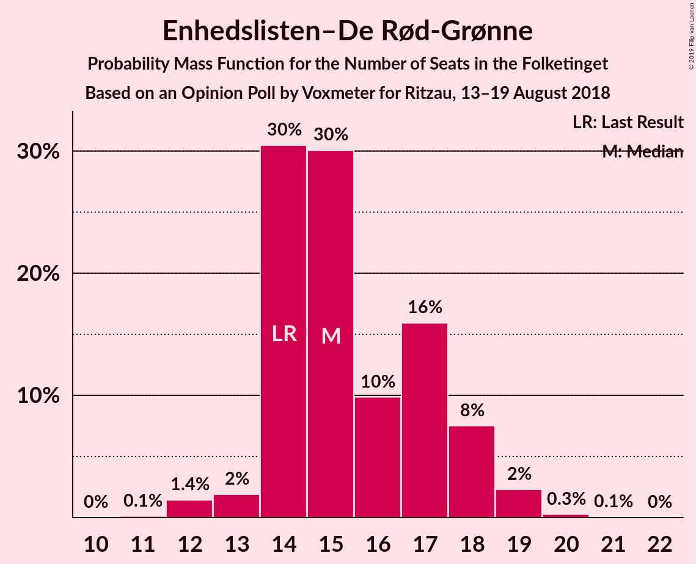
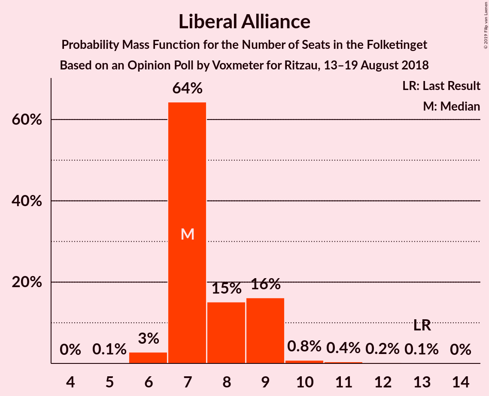

# Opinion Poll by Voxmeter for Ritzau, 13–19 August 2018

<a href="#voting-intentions">Voting Intentions</a> | <a href="#seats">Seats</a> | <a href="#coalitions">Coalitions</a> | <a href="#technical-information">Technical Information</a>

## Voting Intentions

### Confidence Intervals

| Party | Last Result | Poll Result | 80% Confidence Interval | 90% Confidence Interval | 95% Confidence Interval | 99% Confidence Interval |
|:-----:|:-----------:|:-----------:|:-----------------------:|:-----------------------:|:-----------------------:|:-----------------------:|
| Socialdemokraterne | 26.3% | 26.0% | 24.3–27.8% |23.8–28.3% |23.4–28.8% |22.6–29.6% |
| Venstre | 19.5% | 20.4% | 18.8–22.1% |18.4–22.5% |18.0–22.9% |17.3–23.8% |
| Dansk Folkeparti | 21.1% | 18.9% | 17.4–20.6% |17.0–21.0% |16.6–21.4% |15.9–22.2% |
| Enhedslisten–De Rød-Grønne | 7.8% | 8.6% | 7.6–9.9% |7.3–10.2% |7.1–10.5% |6.6–11.1% |
| Radikale Venstre | 4.6% | 5.3% | 4.5–6.3% |4.3–6.6% |4.1–6.9% |3.8–7.4% |
| Alternativet | 4.8% | 4.8% | 4.0–5.7% |3.8–6.0% |3.6–6.2% |3.3–6.7% |
| Socialistisk Folkeparti | 4.2% | 4.6% | 3.8–5.5% |3.6–5.8% |3.4–6.0% |3.1–6.5% |
| Liberal Alliance | 7.5% | 4.5% | 3.7–5.4% |3.5–5.7% |3.4–5.9% |3.0–6.4% |
| Det Konservative Folkeparti | 3.4% | 3.4% | 2.8–4.2% |2.6–4.5% |2.5–4.7% |2.2–5.1% |
| Nye Borgerlige | 0.0% | 2.2% | 1.7–2.9% |1.6–3.2% |1.5–3.3% |1.3–3.7% |
| Kristendemokraterne | 0.8% | 0.8% | 0.5–1.3% |0.4–1.4% |0.4–1.5% |0.3–1.8% |

*Note:* The poll result column reflects the actual value used in the calculations. Published results may vary slightly, and in addition be rounded to fewer digits.

## Seats

### Confidence Intervals

| Party | Last Result | Median | 80% Confidence Interval | 90% Confidence Interval | 95% Confidence Interval | 99% Confidence Interval |
|:-----:|:-----------:|:------:|:-----------------------:|:-----------------------:|:-----------------------:|:-----------------------:|
| <a href="#socialdemokraterne">Socialdemokraterne</a> | 47 | 43 | 43–54 |43–54 |43–54 |40–54 |
| <a href="#venstre">Venstre</a> | 34 | 37 | 34–37 |34–37 |34–38 |32–44 |
| <a href="#dansk-folkeparti">Dansk Folkeparti</a> | 37 | 33 | 30–33 |30–33 |30–33 |28–33 |
| <a href="#enhedslisten–de-rød-grønne">Enhedslisten–De Rød-Grønne</a> | 14 | 16 | 14–16 |14–16 |14–16 |12–18 |
| <a href="#radikale-venstre">Radikale Venstre</a> | 8 | 17 | 6–17 |6–17 |6–17 |6–17 |
| <a href="#alternativet">Alternativet</a> | 9 | 8 | 5–11 |5–11 |5–11 |5–11 |
| <a href="#socialistisk-folkeparti">Socialistisk Folkeparti</a> | 7 | 8 | 8–10 |8–10 |8–10 |6–11 |
| <a href="#liberal-alliance">Liberal Alliance</a> | 13 | 8 | 5–12 |5–12 |5–12 |5–12 |
| <a href="#det-konservative-folkeparti">Det Konservative Folkeparti</a> | 6 | 5 | 5–8 |5–8 |5–8 |4–9 |
| <a href="#nye-borgerlige">Nye Borgerlige</a> | 0 | 0 | 0–8 |0–8 |0–8 |0–8 |
| <a href="#kristendemokraterne">Kristendemokraterne</a> | 0 | 0 | 0 |0 |0 |0 |

### Socialdemokraterne

*For a full overview of the results for this party, see the [Socialdemokraterne](party-socialdemokraterne.html) page.*

| Number of Seats | Probability | Accumulated | Special Marks |
|:---------------:|:-----------:|:-----------:|:-------------:|
| 37 | 0.1% | 100% |  |
| 38 | 0% | 99.9% |  |
| 39 | 0% | 99.9% |  |
| 40 | 0.6% | 99.9% |  |
| 41 | 0% | 99.3% |  |
| 42 | 0% | 99.3% |  |
| 43 | 50% | 99.3% | Median |
| 44 | 0% | 49% |  |
| 45 | 0% | 49% |  |
| 46 | 15% | 49% |  |
| 47 | 0.2% | 34% | Last Result |
| 48 | 14% | 34% |  |
| 49 | 0% | 20% |  |
| 50 | 0% | 20% |  |
| 51 | 0% | 20% |  |
| 52 | 0.6% | 20% |  |
| 53 | 0% | 19% |  |
| 54 | 19% | 19% |  |
| 55 | 0% | 0.2% |  |
| 56 | 0% | 0.2% |  |
| 57 | 0% | 0.2% |  |
| 58 | 0.2% | 0.2% |  |
| 59 | 0% | 0% |  |

### Venstre

*For a full overview of the results for this party, see the [Venstre](party-venstre.html) page.*

| Number of Seats | Probability | Accumulated | Special Marks |
|:---------------:|:-----------:|:-----------:|:-------------:|
| 29 | 0.2% | 100% |  |
| 30 | 0.2% | 99.8% |  |
| 31 | 0% | 99.6% |  |
| 32 | 0.2% | 99.6% |  |
| 33 | 0% | 99.4% |  |
| 34 | 13% | 99.4% | Last Result |
| 35 | 15% | 87% |  |
| 36 | 0% | 72% |  |
| 37 | 69% | 72% | Median |
| 38 | 0.6% | 3% |  |
| 39 | 0% | 2% |  |
| 40 | 0% | 2% |  |
| 41 | 0% | 2% |  |
| 42 | 0% | 2% |  |
| 43 | 0% | 2% |  |
| 44 | 2% | 2% |  |
| 45 | 0% | 0% |  |

### Dansk Folkeparti

*For a full overview of the results for this party, see the [Dansk Folkeparti](party-danskfolkeparti.html) page.*

| Number of Seats | Probability | Accumulated | Special Marks |
|:---------------:|:-----------:|:-----------:|:-------------:|
| 27 | 0% | 100% |  |
| 28 | 0.8% | 99.9% |  |
| 29 | 0% | 99.1% |  |
| 30 | 13% | 99.1% |  |
| 31 | 0.6% | 87% |  |
| 32 | 35% | 86% |  |
| 33 | 50% | 51% | Median |
| 34 | 0.1% | 0.4% |  |
| 35 | 0% | 0.3% |  |
| 36 | 0% | 0.3% |  |
| 37 | 0% | 0.3% | Last Result |
| 38 | 0.2% | 0.3% |  |
| 39 | 0.1% | 0.2% |  |
| 40 | 0.1% | 0.1% |  |
| 41 | 0% | 0% |  |

### Enhedslisten–De Rød-Grønne

*For a full overview of the results for this party, see the [Enhedslisten–De Rød-Grønne](party-enhedslisten–derød-grønne.html) page.*

| Number of Seats | Probability | Accumulated | Special Marks |
|:---------------:|:-----------:|:-----------:|:-------------:|
| 12 | 0.8% | 100% |  |
| 13 | 0.1% | 99.2% |  |
| 14 | 14% | 99.1% | Last Result |
| 15 | 19% | 85% |  |
| 16 | 65% | 66% | Median |
| 17 | 0% | 0.8% |  |
| 18 | 0.8% | 0.8% |  |
| 19 | 0% | 0% |  |

### Radikale Venstre

*For a full overview of the results for this party, see the [Radikale Venstre](party-radikalevenstre.html) page.*

| Number of Seats | Probability | Accumulated | Special Marks |
|:---------------:|:-----------:|:-----------:|:-------------:|
| 5 | 0.1% | 100% |  |
| 6 | 20% | 99.9% |  |
| 7 | 15% | 80% |  |
| 8 | 14% | 65% | Last Result |
| 9 | 0.2% | 51% |  |
| 10 | 0% | 51% |  |
| 11 | 0% | 51% |  |
| 12 | 0% | 51% |  |
| 13 | 0% | 51% |  |
| 14 | 0% | 51% |  |
| 15 | 0% | 51% |  |
| 16 | 0.2% | 50% |  |
| 17 | 50% | 50% | Median |
| 18 | 0% | 0% |  |

### Alternativet

*For a full overview of the results for this party, see the [Alternativet](party-alternativet.html) page.*

| Number of Seats | Probability | Accumulated | Special Marks |
|:---------------:|:-----------:|:-----------:|:-------------:|
| 5 | 20% | 100% |  |
| 6 | 0.2% | 80% |  |
| 7 | 13% | 79% |  |
| 8 | 50% | 66% | Median |
| 9 | 0% | 16% | Last Result |
| 10 | 0.6% | 16% |  |
| 11 | 15% | 15% |  |
| 12 | 0% | 0% |  |

### Socialistisk Folkeparti

*For a full overview of the results for this party, see the [Socialistisk Folkeparti](party-socialistiskfolkeparti.html) page.*

| Number of Seats | Probability | Accumulated | Special Marks |
|:---------------:|:-----------:|:-----------:|:-------------:|
| 4 | 0.1% | 100% |  |
| 5 | 0% | 99.9% |  |
| 6 | 0.6% | 99.9% |  |
| 7 | 0.1% | 99.3% | Last Result |
| 8 | 50% | 99.3% | Median |
| 9 | 13% | 49% |  |
| 10 | 34% | 35% |  |
| 11 | 1.3% | 1.4% |  |
| 12 | 0% | 0% |  |

### Liberal Alliance

*For a full overview of the results for this party, see the [Liberal Alliance](party-liberalalliance.html) page.*

| Number of Seats | Probability | Accumulated | Special Marks |
|:---------------:|:-----------:|:-----------:|:-------------:|
| 5 | 15% | 100% |  |
| 6 | 0% | 85% |  |
| 7 | 20% | 85% |  |
| 8 | 51% | 65% | Median |
| 9 | 1.5% | 14% |  |
| 10 | 0.2% | 13% |  |
| 11 | 0% | 13% |  |
| 12 | 13% | 13% |  |
| 13 | 0% | 0% | Last Result |

### Det Konservative Folkeparti

*For a full overview of the results for this party, see the [Det Konservative Folkeparti](party-detkonservativefolkeparti.html) page.*

| Number of Seats | Probability | Accumulated | Special Marks |
|:---------------:|:-----------:|:-----------:|:-------------:|
| 4 | 1.4% | 100% |  |
| 5 | 82% | 98.6% | Median |
| 6 | 0.2% | 17% | Last Result |
| 7 | 0.3% | 16% |  |
| 8 | 16% | 16% |  |
| 9 | 0.6% | 0.6% |  |
| 10 | 0% | 0% |  |

### Nye Borgerlige

*For a full overview of the results for this party, see the [Nye Borgerlige](party-nyeborgerlige.html) page.*

| Number of Seats | Probability | Accumulated | Special Marks |
|:---------------:|:-----------:|:-----------:|:-------------:|
| 0 | 52% | 100% | Last Result, Median |
| 1 | 0% | 48% |  |
| 2 | 0% | 48% |  |
| 3 | 0% | 48% |  |
| 4 | 20% | 48% |  |
| 5 | 16% | 28% |  |
| 6 | 0% | 13% |  |
| 7 | 0.1% | 13% |  |
| 8 | 13% | 13% |  |
| 9 | 0% | 0% |  |

### Kristendemokraterne

*For a full overview of the results for this party, see the [Kristendemokraterne](party-kristendemokraterne.html) page.*

| Number of Seats | Probability | Accumulated | Special Marks |
|:---------------:|:-----------:|:-----------:|:-------------:|
| 0 | 99.9% | 100% | Last Result, Median |
| 1 | 0% | 0.1% |  |
| 2 | 0% | 0.1% |  |
| 3 | 0% | 0.1% |  |
| 4 | 0.1% | 0.1% |  |
| 5 | 0% | 0% |  |

## Coalitions

### Confidence Intervals

| Coalition | Last Result | Median | Majority? | 80% Confidence Interval | 90% Confidence Interval | 95% Confidence Interval | 99% Confidence Interval |
|:---------:|:-----------:|:------:|:---------:|:-----------------------:|:-----------------------:|:-----------------------:|:-----------------------:|
| Socialdemokraterne – Enhedslisten–De Rød-Grønne – Radikale Venstre – Alternativet – Socialistisk Folkeparti | 85 | 92 | 85% | 86–92 | 86–92 | 86–92 | 82–92 |
| Venstre – Dansk Folkeparti – Liberal Alliance – Det Konservative Folkeparti – Nye Borgerlige – Kristendemokraterne | 90 | 83 | 0.8% | 83–89 | 83–89 | 83–89 | 83–93 |
| Venstre – Dansk Folkeparti – Liberal Alliance – Det Konservative Folkeparti – Nye Borgerlige | 90 | 83 | 0.8% | 83–89 | 83–89 | 83–89 | 83–93 |
| Venstre – Dansk Folkeparti – Liberal Alliance – Det Konservative Folkeparti – Kristendemokraterne | 90 | 83 | 0% | 80–83 | 80–83 | 80–85 | 80–89 |
| Venstre – Dansk Folkeparti – Liberal Alliance – Det Konservative Folkeparti | 90 | 83 | 0% | 80–83 | 80–83 | 80–85 | 80–89 |
| Socialdemokraterne – Enhedslisten–De Rød-Grønne – Radikale Venstre – Socialistisk Folkeparti | 76 | 84 | 0.2% | 79–85 | 79–85 | 79–85 | 75–85 |

### Socialdemokraterne – Enhedslisten–De Rød-Grønne – Radikale Venstre – Alternativet – Socialistisk Folkeparti

| Number of Seats | Probability | Accumulated | Special Marks |
|:---------------:|:-----------:|:-----------:|:-------------:|
| 82 | 0.7% | 100% |  |
| 83 | 0% | 99.3% |  |
| 84 | 0.2% | 99.3% |  |
| 85 | 0% | 99.2% | Last Result |
| 86 | 14% | 99.2% |  |
| 87 | 0% | 85% |  |
| 88 | 0% | 85% |  |
| 89 | 0% | 85% |  |
| 90 | 34% | 85% | Majority |
| 91 | 0% | 51% |  |
| 92 | 50% | 51% | Median |
| 93 | 0% | 0.3% |  |
| 94 | 0.1% | 0.3% |  |
| 95 | 0% | 0.2% |  |
| 96 | 0% | 0.2% |  |
| 97 | 0% | 0.2% |  |
| 98 | 0% | 0.2% |  |
| 99 | 0% | 0.2% |  |
| 100 | 0% | 0.2% |  |
| 101 | 0.2% | 0.2% |  |
| 102 | 0% | 0% |  |

### Venstre – Dansk Folkeparti – Liberal Alliance – Det Konservative Folkeparti – Nye Borgerlige – Kristendemokraterne

| Number of Seats | Probability | Accumulated | Special Marks |
|:---------------:|:-----------:|:-----------:|:-------------:|
| 74 | 0.2% | 100% |  |
| 75 | 0% | 99.8% |  |
| 76 | 0% | 99.8% |  |
| 77 | 0% | 99.8% |  |
| 78 | 0% | 99.8% |  |
| 79 | 0% | 99.8% |  |
| 80 | 0% | 99.8% |  |
| 81 | 0.1% | 99.8% |  |
| 82 | 0% | 99.7% |  |
| 83 | 50% | 99.7% | Median |
| 84 | 0% | 49% |  |
| 85 | 34% | 49% |  |
| 86 | 0% | 15% |  |
| 87 | 0% | 15% |  |
| 88 | 0% | 15% |  |
| 89 | 14% | 15% |  |
| 90 | 0% | 0.8% | Last Result, Majority |
| 91 | 0.2% | 0.8% |  |
| 92 | 0% | 0.7% |  |
| 93 | 0.7% | 0.7% |  |
| 94 | 0% | 0% |  |

### Venstre – Dansk Folkeparti – Liberal Alliance – Det Konservative Folkeparti – Nye Borgerlige

| Number of Seats | Probability | Accumulated | Special Marks |
|:---------------:|:-----------:|:-----------:|:-------------:|
| 74 | 0.2% | 100% |  |
| 75 | 0% | 99.8% |  |
| 76 | 0% | 99.8% |  |
| 77 | 0% | 99.8% |  |
| 78 | 0% | 99.8% |  |
| 79 | 0% | 99.8% |  |
| 80 | 0% | 99.8% |  |
| 81 | 0% | 99.8% |  |
| 82 | 0% | 99.7% |  |
| 83 | 50% | 99.7% | Median |
| 84 | 0% | 49% |  |
| 85 | 34% | 49% |  |
| 86 | 0% | 15% |  |
| 87 | 0% | 15% |  |
| 88 | 0% | 15% |  |
| 89 | 14% | 15% |  |
| 90 | 0% | 0.8% | Last Result, Majority |
| 91 | 0.2% | 0.8% |  |
| 92 | 0% | 0.7% |  |
| 93 | 0.7% | 0.7% |  |
| 94 | 0% | 0% |  |

### Venstre – Dansk Folkeparti – Liberal Alliance – Det Konservative Folkeparti – Kristendemokraterne

| Number of Seats | Probability | Accumulated | Special Marks |
|:---------------:|:-----------:|:-----------:|:-------------:|
| 74 | 0.2% | 100% |  |
| 75 | 0% | 99.8% |  |
| 76 | 0% | 99.8% |  |
| 77 | 0% | 99.8% |  |
| 78 | 0% | 99.8% |  |
| 79 | 0% | 99.8% |  |
| 80 | 15% | 99.8% |  |
| 81 | 32% | 85% |  |
| 82 | 0% | 53% |  |
| 83 | 50% | 53% | Median |
| 84 | 0% | 3% |  |
| 85 | 0.6% | 3% |  |
| 86 | 0.2% | 2% |  |
| 87 | 0.1% | 2% |  |
| 88 | 0.6% | 2% |  |
| 89 | 1.3% | 1.3% |  |
| 90 | 0% | 0% | Last Result, Majority |

### Venstre – Dansk Folkeparti – Liberal Alliance – Det Konservative Folkeparti

| Number of Seats | Probability | Accumulated | Special Marks |
|:---------------:|:-----------:|:-----------:|:-------------:|
| 74 | 0.2% | 100% |  |
| 75 | 0% | 99.8% |  |
| 76 | 0% | 99.8% |  |
| 77 | 0% | 99.8% |  |
| 78 | 0% | 99.8% |  |
| 79 | 0% | 99.8% |  |
| 80 | 15% | 99.8% |  |
| 81 | 32% | 85% |  |
| 82 | 0% | 53% |  |
| 83 | 50% | 53% | Median |
| 84 | 0% | 3% |  |
| 85 | 0.6% | 3% |  |
| 86 | 0.2% | 2% |  |
| 87 | 0.1% | 2% |  |
| 88 | 0.6% | 2% |  |
| 89 | 1.3% | 1.3% |  |
| 90 | 0% | 0% | Last Result, Majority |

### Socialdemokraterne – Enhedslisten–De Rød-Grønne – Radikale Venstre – Socialistisk Folkeparti

| Number of Seats | Probability | Accumulated | Special Marks |
|:---------------:|:-----------:|:-----------:|:-------------:|
| 74 | 0.1% | 100% |  |
| 75 | 0.6% | 99.9% |  |
| 76 | 0.7% | 99.3% | Last Result |
| 77 | 0% | 98.6% |  |
| 78 | 0% | 98.6% |  |
| 79 | 27% | 98.6% |  |
| 80 | 0% | 71% |  |
| 81 | 1.4% | 71% |  |
| 82 | 0% | 70% |  |
| 83 | 0% | 70% |  |
| 84 | 50% | 70% | Median |
| 85 | 19% | 19% |  |
| 86 | 0% | 0.3% |  |
| 87 | 0% | 0.2% |  |
| 88 | 0% | 0.2% |  |
| 89 | 0% | 0.2% |  |
| 90 | 0% | 0.2% | Majority |
| 91 | 0% | 0.2% |  |
| 92 | 0% | 0.2% |  |
| 93 | 0% | 0.2% |  |
| 94 | 0.2% | 0.2% |  |
| 95 | 0% | 0% |  |

## Technical Information

### Opinion Poll

+ **Polling firm:** Voxmeter
+ **Commissioner(s):** Ritzau
+ **Fieldwork period:** 13–19 August 2018

### Calculations

+ **Sample size:** 1031
+ **Simulations done:** 1,024
+ **Error estimate:** 4.94%

