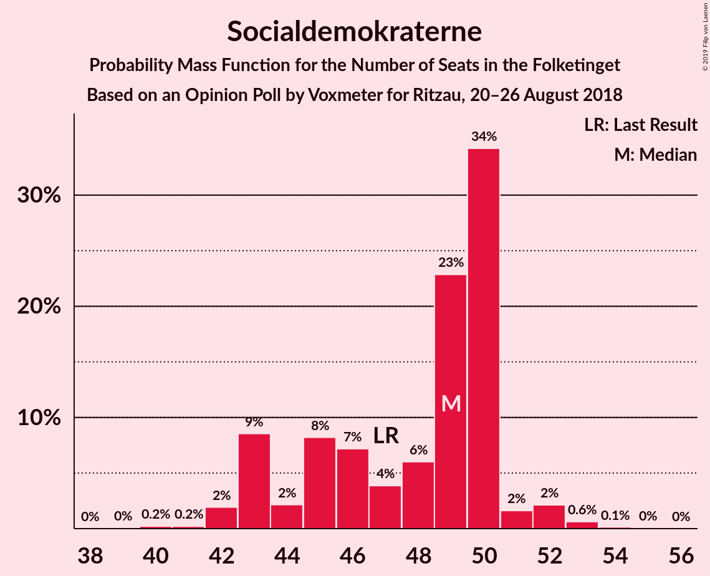

# Opinion Poll by Voxmeter for Ritzau, 20–26 August 2018

<a href="#voting-intentions">Voting Intentions</a> | <a href="#seats">Seats</a> | <a href="#coalitions">Coalitions</a> | <a href="#technical-information">Technical Information</a>

## Voting Intentions

### Confidence Intervals

| Party | Last Result | Poll Result | 80% Confidence Interval | 90% Confidence Interval | 95% Confidence Interval | 99% Confidence Interval |
|:-----:|:-----------:|:-----------:|:-----------------------:|:-----------------------:|:-----------------------:|:-----------------------:|
| Socialdemokraterne | 26.3% | 26.6% | 24.9–28.4% |24.4–28.9% |24.0–29.4% |23.2–30.3% |
| Venstre | 19.5% | 19.3% | 17.8–21.0% |17.4–21.4% |17.0–21.8% |16.3–22.6% |
| Dansk Folkeparti | 21.1% | 18.3% | 16.8–19.9% |16.4–20.3% |16.0–20.7% |15.3–21.5% |
| Enhedslisten–De Rød-Grønne | 7.8% | 8.7% | 7.7–10.0% |7.4–10.3% |7.2–10.6% |6.7–11.2% |
| Radikale Venstre | 4.6% | 5.8% | 4.9–6.8% |4.7–7.1% |4.5–7.4% |4.1–7.9% |
| Liberal Alliance | 7.5% | 5.1% | 4.3–6.1% |4.1–6.4% |3.9–6.6% |3.6–7.1% |
| Alternativet | 4.8% | 5.0% | 4.2–6.0% |4.0–6.2% |3.8–6.5% |3.5–7.0% |
| Socialistisk Folkeparti | 4.2% | 4.3% | 3.6–5.2% |3.4–5.5% |3.2–5.7% |2.9–6.2% |
| Det Konservative Folkeparti | 3.4% | 3.9% | 3.3–4.8% |3.1–5.1% |2.9–5.3% |2.6–5.8% |
| Nye Borgerlige | 0.0% | 2.0% | 1.6–2.7% |1.4–2.9% |1.3–3.1% |1.1–3.4% |
| Kristendemokraterne | 0.8% | 0.8% | 0.5–1.2% |0.4–1.4% |0.4–1.5% |0.3–1.8% |

*Note:* The poll result column reflects the actual value used in the calculations. Published results may vary slightly, and in addition be rounded to fewer digits.

## Seats

### Confidence Intervals

| Party | Last Result | Median | 80% Confidence Interval | 90% Confidence Interval | 95% Confidence Interval | 99% Confidence Interval |
|:-----:|:-----------:|:------:|:-----------------------:|:-----------------------:|:-----------------------:|:-----------------------:|
| <a href="#socialdemokraterne">Socialdemokraterne</a> | 47 | 45 | 45 |45 |45–46 |45–50 |
| <a href="#venstre">Venstre</a> | 34 | 37 | 37 |37 |37 |33–41 |
| <a href="#dansk-folkeparti">Dansk Folkeparti</a> | 37 | 28 | 28 |28 |28 |28–30 |
| <a href="#enhedslisten–de-rød-grønne">Enhedslisten–De Rød-Grønne</a> | 14 | 17 | 17 |17 |16–17 |13–17 |
| <a href="#radikale-venstre">Radikale Venstre</a> | 8 | 12 | 12 |12 |12–13 |9–16 |
| <a href="#liberal-alliance">Liberal Alliance</a> | 13 | 11 | 11 |11 |10–11 |7–11 |
| <a href="#alternativet">Alternativet</a> | 9 | 5 | 5 |5 |5–8 |5–8 |
| <a href="#socialistisk-folkeparti">Socialistisk Folkeparti</a> | 7 | 10 | 10 |10 |5–10 |5–11 |
| <a href="#det-konservative-folkeparti">Det Konservative Folkeparti</a> | 6 | 6 | 6 |6 |6 |6–9 |
| <a href="#nye-borgerlige">Nye Borgerlige</a> | 0 | 4 | 4 |4 |4 |0–4 |
| <a href="#kristendemokraterne">Kristendemokraterne</a> | 0 | 0 | 0 |0 |0 |0 |

### Socialdemokraterne

*For a full overview of the results for this party, see the [Socialdemokraterne](party-socialdemokraterne.html) page.*

| Number of Seats | Probability | Accumulated | Special Marks |
|:---------------:|:-----------:|:-----------:|:-------------:|
| 43 | 0.2% | 100% |  |
| 44 | 0% | 99.8% |  |
| 45 | 97% | 99.8% | Median |
| 46 | 0.9% | 3% |  |
| 47 | 0% | 2% | Last Result |
| 48 | 1.2% | 2% |  |
| 49 | 0% | 0.5% |  |
| 50 | 0% | 0.5% |  |
| 51 | 0% | 0.5% |  |
| 52 | 0.3% | 0.5% |  |
| 53 | 0% | 0.2% |  |
| 54 | 0% | 0.2% |  |
| 55 | 0% | 0.2% |  |
| 56 | 0% | 0.2% |  |
| 57 | 0.2% | 0.2% |  |
| 58 | 0% | 0% |  |

### Venstre

*For a full overview of the results for this party, see the [Venstre](party-venstre.html) page.*

| Number of Seats | Probability | Accumulated | Special Marks |
|:---------------:|:-----------:|:-----------:|:-------------:|
| 28 | 0.1% | 100% |  |
| 29 | 0% | 99.9% |  |
| 30 | 0% | 99.9% |  |
| 31 | 0.2% | 99.9% |  |
| 32 | 0% | 99.7% |  |
| 33 | 0.3% | 99.7% |  |
| 34 | 0.5% | 99.3% | Last Result |
| 35 | 0.3% | 98.8% |  |
| 36 | 0% | 98.5% |  |
| 37 | 97% | 98.5% | Median |
| 38 | 0% | 2% |  |
| 39 | 0.2% | 2% |  |
| 40 | 0.6% | 2% |  |
| 41 | 1.2% | 1.2% |  |
| 42 | 0% | 0% |  |

### Dansk Folkeparti

*For a full overview of the results for this party, see the [Dansk Folkeparti](party-danskfolkeparti.html) page.*

| Number of Seats | Probability | Accumulated | Special Marks |
|:---------------:|:-----------:|:-----------:|:-------------:|
| 28 | 98.8% | 100% | Median |
| 29 | 0.4% | 1.2% |  |
| 30 | 0.3% | 0.8% |  |
| 31 | 0% | 0.4% |  |
| 32 | 0% | 0.4% |  |
| 33 | 0.3% | 0.4% |  |
| 34 | 0% | 0.2% |  |
| 35 | 0% | 0.2% |  |
| 36 | 0% | 0.2% |  |
| 37 | 0.1% | 0.2% | Last Result |
| 38 | 0.1% | 0.1% |  |
| 39 | 0% | 0% |  |

### Enhedslisten–De Rød-Grønne

*For a full overview of the results for this party, see the [Enhedslisten–De Rød-Grønne](party-enhedslisten–derød-grønne.html) page.*

| Number of Seats | Probability | Accumulated | Special Marks |
|:---------------:|:-----------:|:-----------:|:-------------:|
| 13 | 0.6% | 100% |  |
| 14 | 0% | 99.4% | Last Result |
| 15 | 0% | 99.4% |  |
| 16 | 3% | 99.4% |  |
| 17 | 97% | 97% | Median |
| 18 | 0.2% | 0.3% |  |
| 19 | 0.1% | 0.1% |  |
| 20 | 0% | 0% |  |

### Radikale Venstre

*For a full overview of the results for this party, see the [Radikale Venstre](party-radikalevenstre.html) page.*

| Number of Seats | Probability | Accumulated | Special Marks |
|:---------------:|:-----------:|:-----------:|:-------------:|
| 7 | 0.3% | 100% |  |
| 8 | 0.1% | 99.7% | Last Result |
| 9 | 0.2% | 99.6% |  |
| 10 | 0% | 99.4% |  |
| 11 | 0% | 99.4% |  |
| 12 | 96% | 99.3% | Median |
| 13 | 1.4% | 3% |  |
| 14 | 0.2% | 1.4% |  |
| 15 | 0.8% | 1.3% |  |
| 16 | 0.5% | 0.5% |  |
| 17 | 0% | 0% |  |

### Liberal Alliance

*For a full overview of the results for this party, see the [Liberal Alliance](party-liberalalliance.html) page.*

| Number of Seats | Probability | Accumulated | Special Marks |
|:---------------:|:-----------:|:-----------:|:-------------:|
| 7 | 0.5% | 100% |  |
| 8 | 0.1% | 99.5% |  |
| 9 | 0% | 99.4% |  |
| 10 | 3% | 99.4% |  |
| 11 | 97% | 97% | Median |
| 12 | 0.1% | 0.1% |  |
| 13 | 0% | 0% | Last Result |

### Alternativet

*For a full overview of the results for this party, see the [Alternativet](party-alternativet.html) page.*

| Number of Seats | Probability | Accumulated | Special Marks |
|:---------------:|:-----------:|:-----------:|:-------------:|
| 5 | 97% | 100% | Median |
| 6 | 0.1% | 3% |  |
| 7 | 0.6% | 3% |  |
| 8 | 2% | 3% |  |
| 9 | 0.2% | 0.4% | Last Result |
| 10 | 0.2% | 0.2% |  |
| 11 | 0% | 0% |  |

### Socialistisk Folkeparti

*For a full overview of the results for this party, see the [Socialistisk Folkeparti](party-socialistiskfolkeparti.html) page.*

| Number of Seats | Probability | Accumulated | Special Marks |
|:---------------:|:-----------:|:-----------:|:-------------:|
| 5 | 3% | 100% |  |
| 6 | 0.3% | 97% |  |
| 7 | 0.1% | 97% | Last Result |
| 8 | 0.1% | 97% |  |
| 9 | 0% | 97% |  |
| 10 | 96% | 97% | Median |
| 11 | 0.5% | 0.5% |  |
| 12 | 0% | 0% |  |

### Det Konservative Folkeparti

*For a full overview of the results for this party, see the [Det Konservative Folkeparti](party-detkonservativefolkeparti.html) page.*

| Number of Seats | Probability | Accumulated | Special Marks |
|:---------------:|:-----------:|:-----------:|:-------------:|
| 5 | 0.2% | 100% |  |
| 6 | 98% | 99.8% | Last Result, Median |
| 7 | 0.6% | 2% |  |
| 8 | 0.8% | 2% |  |
| 9 | 0.5% | 0.7% |  |
| 10 | 0% | 0.2% |  |
| 11 | 0.1% | 0.1% |  |
| 12 | 0% | 0% |  |

### Nye Borgerlige

*For a full overview of the results for this party, see the [Nye Borgerlige](party-nyeborgerlige.html) page.*

| Number of Seats | Probability | Accumulated | Special Marks |
|:---------------:|:-----------:|:-----------:|:-------------:|
| 0 | 2% | 100% | Last Result |
| 1 | 0% | 98% |  |
| 2 | 0% | 98% |  |
| 3 | 0% | 98% |  |
| 4 | 97% | 98% | Median |
| 5 | 0.4% | 0.4% |  |
| 6 | 0% | 0% |  |

### Kristendemokraterne

*For a full overview of the results for this party, see the [Kristendemokraterne](party-kristendemokraterne.html) page.*

| Number of Seats | Probability | Accumulated | Special Marks |
|:---------------:|:-----------:|:-----------:|:-------------:|
| 0 | 100% | 100% | Last Result, Median |

## Coalitions

### Confidence Intervals

| Coalition | Last Result | Median | Majority? | 80% Confidence Interval | 90% Confidence Interval | 95% Confidence Interval | 99% Confidence Interval |
|:---------:|:-----------:|:------:|:---------:|:-----------------------:|:-----------------------:|:-----------------------:|:-----------------------:|
| Socialdemokraterne – Enhedslisten–De Rød-Grønne – Radikale Venstre – Alternativet – Socialistisk Folkeparti | 85 | 89 | 3% | 89 | 89 | 89–90 | 89–91 |
| Venstre – Dansk Folkeparti – Liberal Alliance – Det Konservative Folkeparti – Nye Borgerlige – Kristendemokraterne | 90 | 86 | 0.1% | 86 | 86 | 85–86 | 84–86 |
| Venstre – Dansk Folkeparti – Liberal Alliance – Det Konservative Folkeparti – Nye Borgerlige | 90 | 86 | 0.1% | 86 | 86 | 85–86 | 84–86 |
| Socialdemokraterne – Enhedslisten–De Rød-Grønne – Radikale Venstre – Socialistisk Folkeparti | 76 | 84 | 0% | 84 | 84 | 83–84 | 81–84 |
| Venstre – Dansk Folkeparti – Liberal Alliance – Det Konservative Folkeparti – Kristendemokraterne | 90 | 82 | 0% | 82 | 82 | 82 | 79–86 |
| Venstre – Dansk Folkeparti – Liberal Alliance – Det Konservative Folkeparti | 90 | 82 | 0% | 82 | 82 | 82 | 79–86 |

### Socialdemokraterne – Enhedslisten–De Rød-Grønne – Radikale Venstre – Alternativet – Socialistisk Folkeparti

| Number of Seats | Probability | Accumulated | Special Marks |
|:---------------:|:-----------:|:-----------:|:-------------:|
| 82 | 0.1% | 100% |  |
| 83 | 0% | 99.9% |  |
| 84 | 0% | 99.9% |  |
| 85 | 0% | 99.9% | Last Result |
| 86 | 0% | 99.9% |  |
| 87 | 0.1% | 99.9% |  |
| 88 | 0.2% | 99.8% |  |
| 89 | 97% | 99.7% | Median |
| 90 | 2% | 3% | Majority |
| 91 | 0.4% | 0.8% |  |
| 92 | 0% | 0.4% |  |
| 93 | 0.2% | 0.4% |  |
| 94 | 0.2% | 0.2% |  |
| 95 | 0% | 0% |  |

### Venstre – Dansk Folkeparti – Liberal Alliance – Det Konservative Folkeparti – Nye Borgerlige – Kristendemokraterne

| Number of Seats | Probability | Accumulated | Special Marks |
|:---------------:|:-----------:|:-----------:|:-------------:|
| 81 | 0.2% | 100% |  |
| 82 | 0.2% | 99.8% |  |
| 83 | 0% | 99.6% |  |
| 84 | 0.4% | 99.6% |  |
| 85 | 2% | 99.2% |  |
| 86 | 97% | 97% | Median |
| 87 | 0.2% | 0.3% |  |
| 88 | 0.1% | 0.2% |  |
| 89 | 0% | 0.1% |  |
| 90 | 0% | 0.1% | Last Result, Majority |
| 91 | 0% | 0.1% |  |
| 92 | 0% | 0.1% |  |
| 93 | 0.1% | 0.1% |  |
| 94 | 0% | 0% |  |

### Venstre – Dansk Folkeparti – Liberal Alliance – Det Konservative Folkeparti – Nye Borgerlige

| Number of Seats | Probability | Accumulated | Special Marks |
|:---------------:|:-----------:|:-----------:|:-------------:|
| 81 | 0.2% | 100% |  |
| 82 | 0.2% | 99.8% |  |
| 83 | 0.1% | 99.6% |  |
| 84 | 0.4% | 99.6% |  |
| 85 | 2% | 99.1% |  |
| 86 | 97% | 97% | Median |
| 87 | 0.2% | 0.3% |  |
| 88 | 0.1% | 0.2% |  |
| 89 | 0% | 0.1% |  |
| 90 | 0% | 0.1% | Last Result, Majority |
| 91 | 0% | 0.1% |  |
| 92 | 0% | 0.1% |  |
| 93 | 0.1% | 0.1% |  |
| 94 | 0% | 0% |  |

### Socialdemokraterne – Enhedslisten–De Rød-Grønne – Radikale Venstre – Socialistisk Folkeparti

| Number of Seats | Probability | Accumulated | Special Marks |
|:---------------:|:-----------:|:-----------:|:-------------:|
| 76 | 0.1% | 100% | Last Result |
| 77 | 0% | 99.9% |  |
| 78 | 0% | 99.9% |  |
| 79 | 0.2% | 99.9% |  |
| 80 | 0.1% | 99.7% |  |
| 81 | 0.6% | 99.6% |  |
| 82 | 1.2% | 99.0% |  |
| 83 | 1.0% | 98% |  |
| 84 | 97% | 97% | Median |
| 85 | 0% | 0.2% |  |
| 86 | 0% | 0.2% |  |
| 87 | 0% | 0.2% |  |
| 88 | 0.2% | 0.2% |  |
| 89 | 0% | 0% |  |

### Venstre – Dansk Folkeparti – Liberal Alliance – Det Konservative Folkeparti – Kristendemokraterne

| Number of Seats | Probability | Accumulated | Special Marks |
|:---------------:|:-----------:|:-----------:|:-------------:|
| 77 | 0.2% | 100% |  |
| 78 | 0.2% | 99.8% |  |
| 79 | 0.3% | 99.6% |  |
| 80 | 0% | 99.3% |  |
| 81 | 0.5% | 99.3% |  |
| 82 | 96% | 98.8% | Median |
| 83 | 0% | 2% |  |
| 84 | 0.2% | 2% |  |
| 85 | 1.2% | 2% |  |
| 86 | 0.7% | 1.0% |  |
| 87 | 0.2% | 0.3% |  |
| 88 | 0.2% | 0.2% |  |
| 89 | 0% | 0% |  |
| 90 | 0% | 0% | Last Result, Majority |

### Venstre – Dansk Folkeparti – Liberal Alliance – Det Konservative Folkeparti

| Number of Seats | Probability | Accumulated | Special Marks |
|:---------------:|:-----------:|:-----------:|:-------------:|
| 77 | 0.2% | 100% |  |
| 78 | 0.2% | 99.8% |  |
| 79 | 0.3% | 99.6% |  |
| 80 | 0% | 99.3% |  |
| 81 | 0.5% | 99.3% |  |
| 82 | 96% | 98.7% | Median |
| 83 | 0% | 2% |  |
| 84 | 0.1% | 2% |  |
| 85 | 1.2% | 2% |  |
| 86 | 0.7% | 1.0% |  |
| 87 | 0.2% | 0.3% |  |
| 88 | 0.2% | 0.2% |  |
| 89 | 0% | 0% |  |
| 90 | 0% | 0% | Last Result, Majority |

## Technical Information

### Opinion Poll

+ **Polling firm:** Voxmeter
+ **Commissioner(s):** Ritzau
+ **Fieldwork period:** 20–26 August 2018

### Calculations

+ **Sample size:** 1041
+ **Simulations done:** 1,024
+ **Error estimate:** 3.20%

