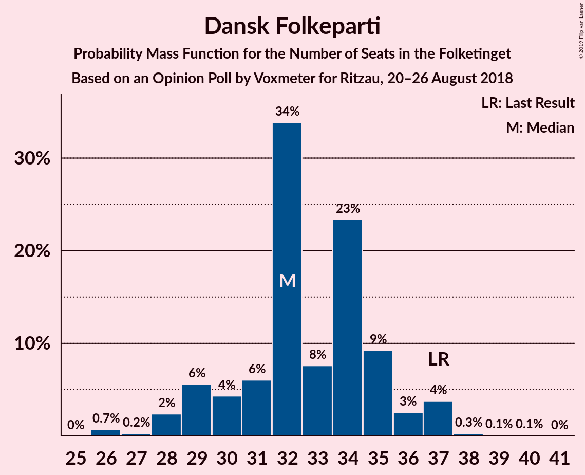
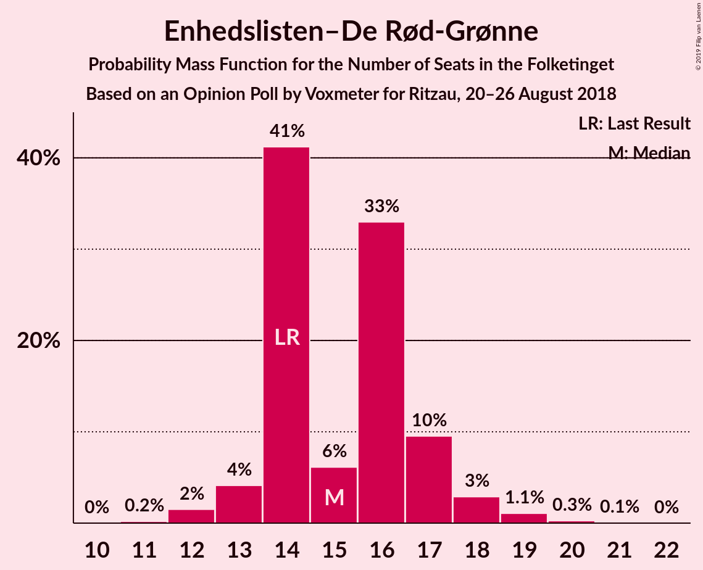
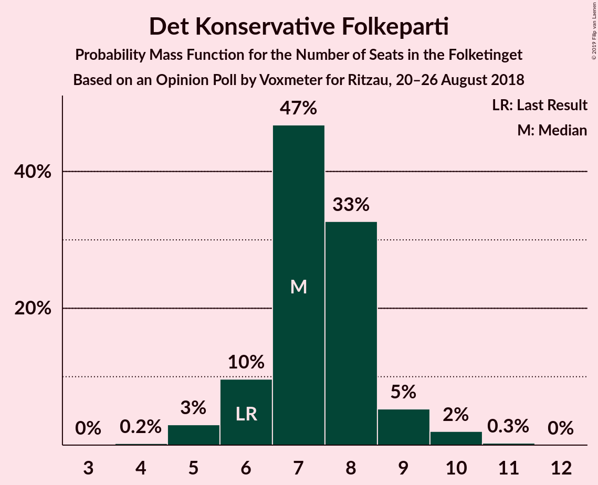
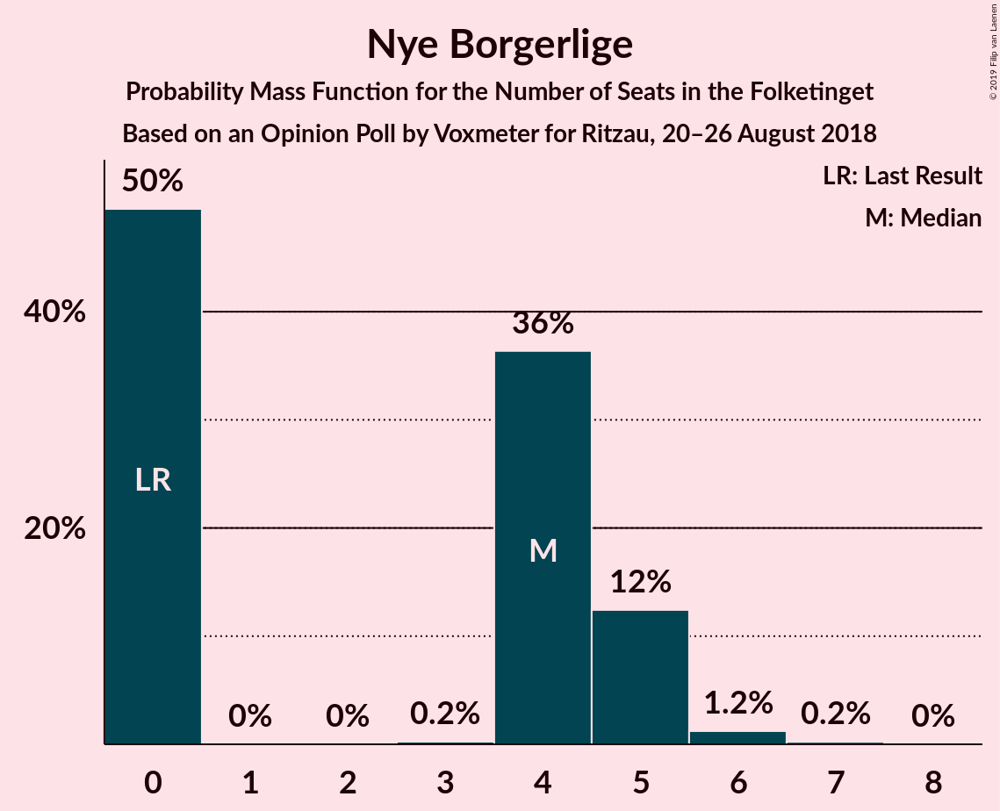

# Opinion Poll by Voxmeter for Ritzau, 20–26 August 2018

<a href="#voting-intentions">Voting Intentions</a> | <a href="#seats">Seats</a> | <a href="#coalitions">Coalitions</a> | <a href="#technical-information">Technical Information</a>

## Voting Intentions

### Confidence Intervals

| Party | Last Result | Poll Result | 80% Confidence Interval | 90% Confidence Interval | 95% Confidence Interval | 99% Confidence Interval |
|:-----:|:-----------:|:-----------:|:-----------------------:|:-----------------------:|:-----------------------:|:-----------------------:|
| Socialdemokraterne | 26.3% | 26.6% | 24.9–28.4% |24.4–28.9% |24.0–29.4% |23.2–30.3% |
| Venstre | 19.5% | 19.3% | 17.8–21.0% |17.4–21.4% |17.0–21.8% |16.3–22.6% |
| Dansk Folkeparti | 21.1% | 18.3% | 16.8–19.9% |16.4–20.3% |16.0–20.7% |15.3–21.5% |
| Enhedslisten–De Rød-Grønne | 7.8% | 8.7% | 7.7–10.0% |7.4–10.3% |7.2–10.6% |6.7–11.2% |
| Radikale Venstre | 4.6% | 5.8% | 4.9–6.8% |4.7–7.1% |4.5–7.4% |4.1–7.9% |
| Liberal Alliance | 7.5% | 5.1% | 4.3–6.1% |4.1–6.4% |3.9–6.6% |3.6–7.1% |
| Alternativet | 4.8% | 5.0% | 4.2–6.0% |4.0–6.2% |3.8–6.5% |3.5–7.0% |
| Socialistisk Folkeparti | 4.2% | 4.3% | 3.6–5.2% |3.4–5.5% |3.2–5.7% |2.9–6.2% |
| Det Konservative Folkeparti | 3.4% | 3.9% | 3.3–4.8% |3.1–5.1% |2.9–5.3% |2.6–5.8% |
| Nye Borgerlige | 0.0% | 2.0% | 1.6–2.7% |1.4–2.9% |1.3–3.1% |1.1–3.4% |
| Kristendemokraterne | 0.8% | 0.8% | 0.5–1.2% |0.4–1.4% |0.4–1.5% |0.3–1.8% |

*Note:* The poll result column reflects the actual value used in the calculations. Published results may vary slightly, and in addition be rounded to fewer digits.

## Seats

### Confidence Intervals

| Party | Last Result | Median | 80% Confidence Interval | 90% Confidence Interval | 95% Confidence Interval | 99% Confidence Interval |
|:-----:|:-----------:|:------:|:-----------------------:|:-----------------------:|:-----------------------:|:-----------------------:|
| <a href="#socialdemokraterne">Socialdemokraterne</a> | 47 | 49 | 43–49 |43–49 |43–50 |43–51 |
| <a href="#venstre">Venstre</a> | 34 | 35 | 35 |30–36 |29–36 |29–37 |
| <a href="#dansk-folkeparti">Dansk Folkeparti</a> | 37 | 32 | 32–34 |31–34 |30–35 |30–37 |
| <a href="#enhedslisten–de-rød-grønne">Enhedslisten–De Rød-Grønne</a> | 14 | 16 | 16 |14–17 |14–18 |12–18 |
| <a href="#radikale-venstre">Radikale Venstre</a> | 8 | 10 | 10 |10–11 |10–12 |7–13 |
| <a href="#liberal-alliance">Liberal Alliance</a> | 13 | 8 | 7–8 |7–11 |6–12 |6–12 |
| <a href="#alternativet">Alternativet</a> | 9 | 10 | 9–11 |9–11 |8–11 |7–11 |
| <a href="#socialistisk-folkeparti">Socialistisk Folkeparti</a> | 7 | 7 | 7–8 |7–8 |7–8 |6–10 |
| <a href="#det-konservative-folkeparti">Det Konservative Folkeparti</a> | 6 | 8 | 7–8 |7–8 |6–8 |5–9 |
| <a href="#nye-borgerlige">Nye Borgerlige</a> | 0 | 0 | 0–4 |0–5 |0–5 |0–6 |
| <a href="#kristendemokraterne">Kristendemokraterne</a> | 0 | 0 | 0 |0 |0 |0 |

### Socialdemokraterne

*For a full overview of the results for this party, see the [Socialdemokraterne](party-socialdemokraterne.html) page.*

| Number of Seats | Probability | Accumulated | Special Marks |
|:---------------:|:-----------:|:-----------:|:-------------:|
| 41 | 0% | 100% |  |
| 42 | 0% | 99.9% |  |
| 43 | 21% | 99.9% |  |
| 44 | 1.5% | 79% |  |
| 45 | 2% | 78% |  |
| 46 | 4% | 76% |  |
| 47 | 1.4% | 72% | Last Result |
| 48 | 0.1% | 70% |  |
| 49 | 65% | 70% | Median |
| 50 | 4% | 5% |  |
| 51 | 0.8% | 0.9% |  |
| 52 | 0.1% | 0.2% |  |
| 53 | 0% | 0% |  |

### Venstre

*For a full overview of the results for this party, see the [Venstre](party-venstre.html) page.*

| Number of Seats | Probability | Accumulated | Special Marks |
|:---------------:|:-----------:|:-----------:|:-------------:|
| 29 | 5% | 100% |  |
| 30 | 0.5% | 95% |  |
| 31 | 0.6% | 95% |  |
| 32 | 1.4% | 94% |  |
| 33 | 1.1% | 92% |  |
| 34 | 0.2% | 91% | Last Result |
| 35 | 85% | 91% | Median |
| 36 | 4% | 6% |  |
| 37 | 1.4% | 2% |  |
| 38 | 0% | 0.3% |  |
| 39 | 0% | 0.2% |  |
| 40 | 0% | 0.2% |  |
| 41 | 0.2% | 0.2% |  |
| 42 | 0% | 0% |  |

### Dansk Folkeparti

*For a full overview of the results for this party, see the [Dansk Folkeparti](party-danskfolkeparti.html) page.*

| Number of Seats | Probability | Accumulated | Special Marks |
|:---------------:|:-----------:|:-----------:|:-------------:|
| 28 | 0.3% | 100% |  |
| 29 | 0.1% | 99.6% |  |
| 30 | 4% | 99.6% |  |
| 31 | 5% | 96% |  |
| 32 | 66% | 91% | Median |
| 33 | 0.3% | 25% |  |
| 34 | 21% | 24% |  |
| 35 | 2% | 4% |  |
| 36 | 1.2% | 2% |  |
| 37 | 0.1% | 0.6% | Last Result |
| 38 | 0.5% | 0.5% |  |
| 39 | 0% | 0% |  |

### Enhedslisten–De Rød-Grønne

*For a full overview of the results for this party, see the [Enhedslisten–De Rød-Grønne](party-enhedslisten–derød-grønne.html) page.*

| Number of Seats | Probability | Accumulated | Special Marks |
|:---------------:|:-----------:|:-----------:|:-------------:|
| 11 | 0.1% | 100% |  |
| 12 | 1.0% | 99.9% |  |
| 13 | 0.1% | 98.9% |  |
| 14 | 4% | 98.7% | Last Result |
| 15 | 2% | 95% |  |
| 16 | 86% | 93% | Median |
| 17 | 2% | 7% |  |
| 18 | 4% | 4% |  |
| 19 | 0.2% | 0.2% |  |
| 20 | 0% | 0% |  |

### Radikale Venstre

*For a full overview of the results for this party, see the [Radikale Venstre](party-radikalevenstre.html) page.*

| Number of Seats | Probability | Accumulated | Special Marks |
|:---------------:|:-----------:|:-----------:|:-------------:|
| 7 | 1.3% | 100% |  |
| 8 | 0.4% | 98.7% | Last Result |
| 9 | 0.2% | 98% |  |
| 10 | 90% | 98% | Median |
| 11 | 3% | 8% |  |
| 12 | 4% | 5% |  |
| 13 | 0.5% | 0.6% |  |
| 14 | 0% | 0.1% |  |
| 15 | 0.1% | 0.1% |  |
| 16 | 0% | 0% |  |

### Liberal Alliance

*For a full overview of the results for this party, see the [Liberal Alliance](party-liberalalliance.html) page.*

| Number of Seats | Probability | Accumulated | Special Marks |
|:---------------:|:-----------:|:-----------:|:-------------:|
| 6 | 4% | 100% |  |
| 7 | 21% | 96% |  |
| 8 | 66% | 75% | Median |
| 9 | 2% | 9% |  |
| 10 | 1.2% | 7% |  |
| 11 | 1.0% | 6% |  |
| 12 | 4% | 5% |  |
| 13 | 0.3% | 0.3% | Last Result |
| 14 | 0% | 0% |  |

### Alternativet

*For a full overview of the results for this party, see the [Alternativet](party-alternativet.html) page.*

| Number of Seats | Probability | Accumulated | Special Marks |
|:---------------:|:-----------:|:-----------:|:-------------:|
| 6 | 0.3% | 100% |  |
| 7 | 0.5% | 99.7% |  |
| 8 | 3% | 99.3% |  |
| 9 | 8% | 96% | Last Result |
| 10 | 66% | 88% | Median |
| 11 | 22% | 22% |  |
| 12 | 0.1% | 0.1% |  |
| 13 | 0.1% | 0.1% |  |
| 14 | 0% | 0% |  |

### Socialistisk Folkeparti

*For a full overview of the results for this party, see the [Socialistisk Folkeparti](party-socialistiskfolkeparti.html) page.*

| Number of Seats | Probability | Accumulated | Special Marks |
|:---------------:|:-----------:|:-----------:|:-------------:|
| 5 | 0.4% | 100% |  |
| 6 | 1.4% | 99.6% |  |
| 7 | 70% | 98% | Last Result, Median |
| 8 | 27% | 28% |  |
| 9 | 0.6% | 1.1% |  |
| 10 | 0.5% | 0.5% |  |
| 11 | 0% | 0.1% |  |
| 12 | 0.1% | 0.1% |  |
| 13 | 0% | 0% |  |

### Det Konservative Folkeparti

*For a full overview of the results for this party, see the [Det Konservative Folkeparti](party-detkonservativefolkeparti.html) page.*

| Number of Seats | Probability | Accumulated | Special Marks |
|:---------------:|:-----------:|:-----------:|:-------------:|
| 4 | 0.1% | 100% |  |
| 5 | 1.1% | 99.9% |  |
| 6 | 1.3% | 98.8% | Last Result |
| 7 | 30% | 97% |  |
| 8 | 66% | 68% | Median |
| 9 | 1.5% | 2% |  |
| 10 | 0.1% | 0.1% |  |
| 11 | 0% | 0% |  |

### Nye Borgerlige

*For a full overview of the results for this party, see the [Nye Borgerlige](party-nyeborgerlige.html) page.*

| Number of Seats | Probability | Accumulated | Special Marks |
|:---------------:|:-----------:|:-----------:|:-------------:|
| 0 | 66% | 100% | Last Result, Median |
| 1 | 0% | 34% |  |
| 2 | 0% | 34% |  |
| 3 | 0.2% | 34% |  |
| 4 | 28% | 33% |  |
| 5 | 5% | 6% |  |
| 6 | 0.5% | 0.5% |  |
| 7 | 0% | 0% |  |

### Kristendemokraterne

*For a full overview of the results for this party, see the [Kristendemokraterne](party-kristendemokraterne.html) page.*

| Number of Seats | Probability | Accumulated | Special Marks |
|:---------------:|:-----------:|:-----------:|:-------------:|
| 0 | 100% | 100% | Last Result, Median |

## Coalitions

### Confidence Intervals

| Coalition | Last Result | Median | Majority? | 80% Confidence Interval | 90% Confidence Interval | 95% Confidence Interval | 99% Confidence Interval |
|:---------:|:-----------:|:------:|:---------:|:-----------------------:|:-----------------------:|:-----------------------:|:-----------------------:|
| Socialdemokraterne – Enhedslisten–De Rød-Grønne – Radikale Venstre – Alternativet – Socialistisk Folkeparti | 85 | 92 | 76% | 88–92 | 88–92 | 87–93 | 81–95 |
| Venstre – Dansk Folkeparti – Liberal Alliance – Det Konservative Folkeparti – Nye Borgerlige – Kristendemokraterne | 90 | 83 | 1.5% | 83–87 | 83–87 | 82–88 | 80–94 |
| Venstre – Dansk Folkeparti – Liberal Alliance – Det Konservative Folkeparti – Nye Borgerlige | 90 | 83 | 1.5% | 83–87 | 83–87 | 82–88 | 80–94 |
| Venstre – Dansk Folkeparti – Liberal Alliance – Det Konservative Folkeparti – Kristendemokraterne | 90 | 83 | 0.2% | 80–83 | 80–83 | 78–84 | 78–89 |
| Venstre – Dansk Folkeparti – Liberal Alliance – Det Konservative Folkeparti | 90 | 83 | 0.2% | 80–83 | 80–83 | 78–84 | 78–89 |
| Socialdemokraterne – Enhedslisten–De Rød-Grønne – Radikale Venstre – Socialistisk Folkeparti | 76 | 82 | 0% | 77–82 | 77–82 | 77–84 | 73–86 |
| Socialdemokraterne – Enhedslisten–De Rød-Grønne – Alternativet – Socialistisk Folkeparti | 77 | 82 | 0% | 78–82 | 78–82 | 78–82 | 71–83 |
| Socialdemokraterne – Enhedslisten–De Rød-Grønne – Socialistisk Folkeparti | 68 | 72 | 0% | 67–72 | 67–72 | 67–72 | 63–75 |
| Socialdemokraterne – Radikale Venstre – Socialistisk Folkeparti | 62 | 66 | 0% | 61–66 | 61–67 | 61–70 | 61–70 |
| Socialdemokraterne – Radikale Venstre | 55 | 59 | 0% | 53–59 | 53–59 | 53–62 | 53–62 |
| Venstre – Liberal Alliance – Det Konservative Folkeparti | 53 | 51 | 0% | 49–51 | 48–51 | 47–53 | 45–53 |
| Venstre – Det Konservative Folkeparti | 40 | 43 | 0% | 42–43 | 37–43 | 36–43 | 36–44 |
| Venstre | 34 | 35 | 0% | 35 | 30–36 | 29–36 | 29–37 |

### Socialdemokraterne – Enhedslisten–De Rød-Grønne – Radikale Venstre – Alternativet – Socialistisk Folkeparti

| Number of Seats | Probability | Accumulated | Special Marks |
|:---------------:|:-----------:|:-----------:|:-------------:|
| 81 | 1.0% | 100% |  |
| 82 | 0% | 99.0% |  |
| 83 | 0.1% | 98.9% |  |
| 84 | 0% | 98.9% |  |
| 85 | 0.3% | 98.8% | Last Result |
| 86 | 0% | 98.5% |  |
| 87 | 1.2% | 98% |  |
| 88 | 21% | 97% |  |
| 89 | 0.3% | 76% |  |
| 90 | 5% | 76% | Majority |
| 91 | 2% | 71% |  |
| 92 | 65% | 69% | Median |
| 93 | 3% | 4% |  |
| 94 | 0.3% | 0.8% |  |
| 95 | 0.5% | 0.6% |  |
| 96 | 0% | 0.1% |  |
| 97 | 0% | 0.1% |  |
| 98 | 0.1% | 0.1% |  |
| 99 | 0% | 0% |  |

### Venstre – Dansk Folkeparti – Liberal Alliance – Det Konservative Folkeparti – Nye Borgerlige – Kristendemokraterne

| Number of Seats | Probability | Accumulated | Special Marks |
|:---------------:|:-----------:|:-----------:|:-------------:|
| 77 | 0.1% | 100% |  |
| 78 | 0% | 99.9% |  |
| 79 | 0% | 99.9% |  |
| 80 | 0.5% | 99.9% |  |
| 81 | 0.3% | 99.4% |  |
| 82 | 3% | 99.2% |  |
| 83 | 65% | 96% | Median |
| 84 | 2% | 31% |  |
| 85 | 5% | 29% |  |
| 86 | 0.3% | 24% |  |
| 87 | 21% | 24% |  |
| 88 | 1.2% | 3% |  |
| 89 | 0% | 2% |  |
| 90 | 0.3% | 1.5% | Last Result, Majority |
| 91 | 0% | 1.2% |  |
| 92 | 0.1% | 1.1% |  |
| 93 | 0% | 1.1% |  |
| 94 | 1.0% | 1.0% |  |
| 95 | 0% | 0% |  |

### Venstre – Dansk Folkeparti – Liberal Alliance – Det Konservative Folkeparti – Nye Borgerlige

| Number of Seats | Probability | Accumulated | Special Marks |
|:---------------:|:-----------:|:-----------:|:-------------:|
| 77 | 0.1% | 100% |  |
| 78 | 0% | 99.9% |  |
| 79 | 0% | 99.9% |  |
| 80 | 0.5% | 99.9% |  |
| 81 | 0.3% | 99.4% |  |
| 82 | 3% | 99.2% |  |
| 83 | 65% | 96% | Median |
| 84 | 2% | 31% |  |
| 85 | 5% | 29% |  |
| 86 | 0.3% | 24% |  |
| 87 | 21% | 24% |  |
| 88 | 1.2% | 3% |  |
| 89 | 0% | 2% |  |
| 90 | 0.3% | 1.5% | Last Result, Majority |
| 91 | 0% | 1.2% |  |
| 92 | 0.1% | 1.1% |  |
| 93 | 0% | 1.0% |  |
| 94 | 1.0% | 1.0% |  |
| 95 | 0% | 0% |  |

### Venstre – Dansk Folkeparti – Liberal Alliance – Det Konservative Folkeparti – Kristendemokraterne

| Number of Seats | Probability | Accumulated | Special Marks |
|:---------------:|:-----------:|:-----------:|:-------------:|
| 76 | 0.1% | 100% |  |
| 77 | 0.1% | 99.9% |  |
| 78 | 4% | 99.8% |  |
| 79 | 0.1% | 96% |  |
| 80 | 6% | 96% |  |
| 81 | 0.9% | 90% |  |
| 82 | 0.1% | 89% |  |
| 83 | 85% | 89% | Median |
| 84 | 1.2% | 3% |  |
| 85 | 0.3% | 2% |  |
| 86 | 0.3% | 2% |  |
| 87 | 0.2% | 2% |  |
| 88 | 0.3% | 2% |  |
| 89 | 1.0% | 1.2% |  |
| 90 | 0.1% | 0.2% | Last Result, Majority |
| 91 | 0% | 0% |  |

### Venstre – Dansk Folkeparti – Liberal Alliance – Det Konservative Folkeparti

| Number of Seats | Probability | Accumulated | Special Marks |
|:---------------:|:-----------:|:-----------:|:-------------:|
| 76 | 0.1% | 100% |  |
| 77 | 0.1% | 99.9% |  |
| 78 | 4% | 99.8% |  |
| 79 | 0.1% | 96% |  |
| 80 | 6% | 96% |  |
| 81 | 0.9% | 90% |  |
| 82 | 0.1% | 89% |  |
| 83 | 85% | 89% | Median |
| 84 | 1.2% | 3% |  |
| 85 | 0.3% | 2% |  |
| 86 | 0.3% | 2% |  |
| 87 | 0.2% | 2% |  |
| 88 | 0.3% | 1.5% |  |
| 89 | 1.0% | 1.2% |  |
| 90 | 0.1% | 0.2% | Last Result, Majority |
| 91 | 0% | 0% |  |

### Socialdemokraterne – Enhedslisten–De Rød-Grønne – Radikale Venstre – Socialistisk Folkeparti

| Number of Seats | Probability | Accumulated | Special Marks |
|:---------------:|:-----------:|:-----------:|:-------------:|
| 73 | 1.0% | 100% |  |
| 74 | 0% | 98.9% |  |
| 75 | 0% | 98.9% |  |
| 76 | 0.2% | 98.9% | Last Result |
| 77 | 21% | 98.7% |  |
| 78 | 0.2% | 78% |  |
| 79 | 0.9% | 77% |  |
| 80 | 0.4% | 76% |  |
| 81 | 6% | 76% |  |
| 82 | 65% | 70% | Median |
| 83 | 0.6% | 5% |  |
| 84 | 4% | 4% |  |
| 85 | 0.1% | 0.7% |  |
| 86 | 0.5% | 0.6% |  |
| 87 | 0.1% | 0.1% |  |
| 88 | 0% | 0.1% |  |
| 89 | 0.1% | 0.1% |  |
| 90 | 0% | 0% | Majority |

### Socialdemokraterne – Enhedslisten–De Rød-Grønne – Alternativet – Socialistisk Folkeparti

| Number of Seats | Probability | Accumulated | Special Marks |
|:---------------:|:-----------:|:-----------:|:-------------:|
| 71 | 1.0% | 100% |  |
| 72 | 0% | 99.0% |  |
| 73 | 0% | 98.9% |  |
| 74 | 0.1% | 98.9% |  |
| 75 | 0.1% | 98.8% |  |
| 76 | 0.1% | 98.7% |  |
| 77 | 0.6% | 98.7% | Last Result |
| 78 | 22% | 98% |  |
| 79 | 0.3% | 76% |  |
| 80 | 7% | 76% |  |
| 81 | 4% | 69% |  |
| 82 | 65% | 66% | Median |
| 83 | 0.3% | 0.8% |  |
| 84 | 0.5% | 0.5% |  |
| 85 | 0% | 0% |  |

### Socialdemokraterne – Enhedslisten–De Rød-Grønne – Socialistisk Folkeparti

| Number of Seats | Probability | Accumulated | Special Marks |
|:---------------:|:-----------:|:-----------:|:-------------:|
| 63 | 1.0% | 100% |  |
| 64 | 0% | 98.9% |  |
| 65 | 0% | 98.9% |  |
| 66 | 0.1% | 98.9% |  |
| 67 | 21% | 98.8% |  |
| 68 | 0.7% | 78% | Last Result |
| 69 | 0.6% | 77% |  |
| 70 | 3% | 77% |  |
| 71 | 5% | 74% |  |
| 72 | 68% | 70% | Median |
| 73 | 0.5% | 1.4% |  |
| 74 | 0.2% | 0.9% |  |
| 75 | 0.7% | 0.7% |  |
| 76 | 0% | 0.1% |  |
| 77 | 0% | 0% |  |

### Socialdemokraterne – Radikale Venstre – Socialistisk Folkeparti

| Number of Seats | Probability | Accumulated | Special Marks |
|:---------------:|:-----------:|:-----------:|:-------------:|
| 58 | 0% | 100% |  |
| 59 | 0% | 99.9% |  |
| 60 | 0.2% | 99.9% |  |
| 61 | 22% | 99.8% |  |
| 62 | 0.5% | 78% | Last Result |
| 63 | 5% | 78% |  |
| 64 | 2% | 73% |  |
| 65 | 1.4% | 71% |  |
| 66 | 64% | 70% | Median |
| 67 | 1.4% | 6% |  |
| 68 | 0.2% | 4% |  |
| 69 | 0.5% | 4% |  |
| 70 | 3% | 3% |  |
| 71 | 0% | 0.2% |  |
| 72 | 0% | 0.1% |  |
| 73 | 0.1% | 0.1% |  |
| 74 | 0% | 0% |  |

### Socialdemokraterne – Radikale Venstre

| Number of Seats | Probability | Accumulated | Special Marks |
|:---------------:|:-----------:|:-----------:|:-------------:|
| 51 | 0.1% | 100% |  |
| 52 | 0% | 99.9% |  |
| 53 | 21% | 99.8% |  |
| 54 | 1.4% | 79% |  |
| 55 | 0.5% | 78% | Last Result |
| 56 | 7% | 77% |  |
| 57 | 0.1% | 71% |  |
| 58 | 0.6% | 71% |  |
| 59 | 65% | 70% | Median |
| 60 | 0.2% | 5% |  |
| 61 | 0.6% | 5% |  |
| 62 | 4% | 4% |  |
| 63 | 0% | 0.2% |  |
| 64 | 0.1% | 0.2% |  |
| 65 | 0.1% | 0.1% |  |
| 66 | 0% | 0% |  |

### Venstre – Liberal Alliance – Det Konservative Folkeparti

| Number of Seats | Probability | Accumulated | Special Marks |
|:---------------:|:-----------:|:-----------:|:-------------:|
| 44 | 0.1% | 100% |  |
| 45 | 2% | 99.9% |  |
| 46 | 0.2% | 98% |  |
| 47 | 0.5% | 98% |  |
| 48 | 4% | 97% |  |
| 49 | 25% | 93% |  |
| 50 | 0.3% | 68% |  |
| 51 | 65% | 68% | Median |
| 52 | 0.4% | 3% |  |
| 53 | 2% | 3% | Last Result |
| 54 | 0.1% | 0.4% |  |
| 55 | 0.1% | 0.4% |  |
| 56 | 0.3% | 0.3% |  |
| 57 | 0% | 0% |  |

### Venstre – Det Konservative Folkeparti

| Number of Seats | Probability | Accumulated | Special Marks |
|:---------------:|:-----------:|:-----------:|:-------------:|
| 35 | 0.2% | 100% |  |
| 36 | 3% | 99.7% |  |
| 37 | 1.4% | 96% |  |
| 38 | 0.6% | 95% |  |
| 39 | 1.3% | 94% |  |
| 40 | 1.3% | 93% | Last Result |
| 41 | 1.3% | 92% |  |
| 42 | 21% | 90% |  |
| 43 | 68% | 69% | Median |
| 44 | 1.4% | 2% |  |
| 45 | 0.1% | 0.4% |  |
| 46 | 0.1% | 0.3% |  |
| 47 | 0% | 0.2% |  |
| 48 | 0.2% | 0.2% |  |
| 49 | 0% | 0% |  |

### Venstre

| Number of Seats | Probability | Accumulated | Special Marks |
|:---------------:|:-----------:|:-----------:|:-------------:|
| 29 | 5% | 100% |  |
| 30 | 0.5% | 95% |  |
| 31 | 0.6% | 95% |  |
| 32 | 1.4% | 94% |  |
| 33 | 1.1% | 92% |  |
| 34 | 0.2% | 91% | Last Result |
| 35 | 85% | 91% | Median |
| 36 | 4% | 6% |  |
| 37 | 1.4% | 2% |  |
| 38 | 0% | 0.3% |  |
| 39 | 0% | 0.2% |  |
| 40 | 0% | 0.2% |  |
| 41 | 0.2% | 0.2% |  |
| 42 | 0% | 0% |  |

## Technical Information

### Opinion Poll

+ **Polling firm:** Voxmeter
+ **Commissioner(s):** Ritzau
+ **Fieldwork period:** 20–26 August 2018

### Calculations

+ **Sample size:** 1041
+ **Simulations done:** 131,072
+ **Error estimate:** 2.73%

