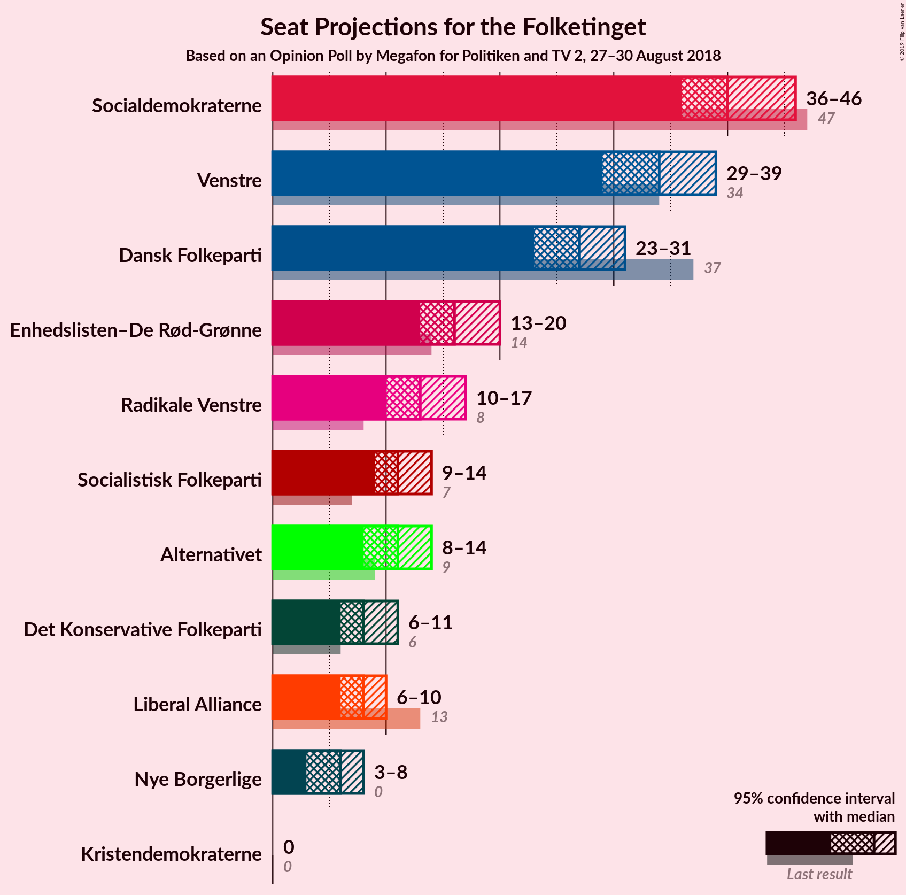
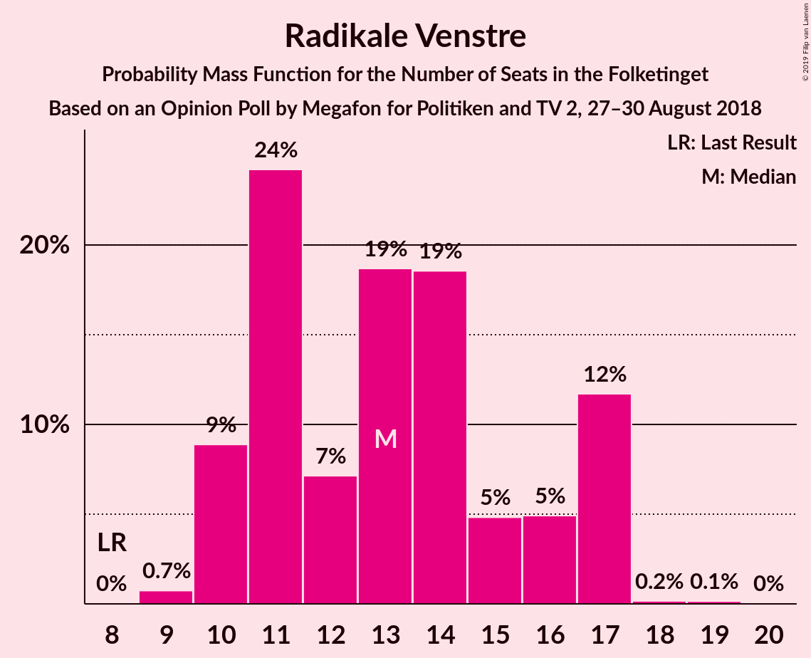
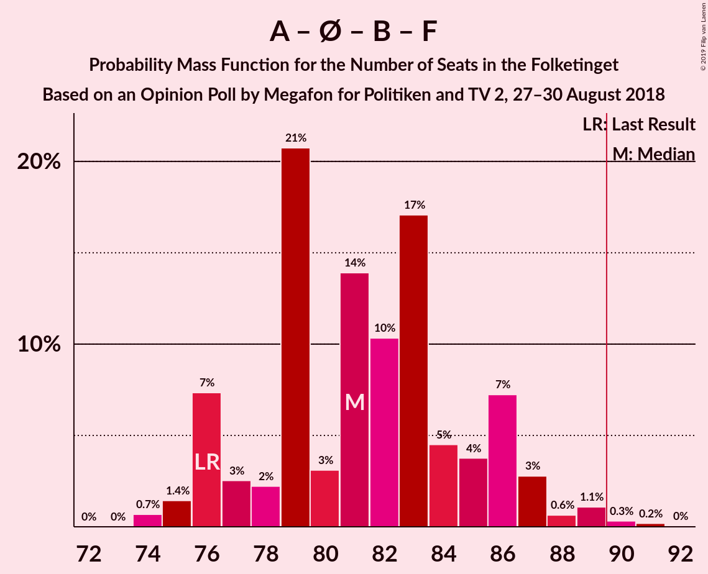

# Opinion Poll by Megafon for Politiken and TV 2, 27–30 August 2018

<a href="#voting-intentions">Voting Intentions</a> | <a href="#seats">Seats</a> | <a href="#coalitions">Coalitions</a> | <a href="#technical-information">Technical Information</a>

## Voting Intentions

### Confidence Intervals

| Party | Last Result | Poll Result | 80% Confidence Interval | 90% Confidence Interval | 95% Confidence Interval | 99% Confidence Interval |
|:-----:|:-----------:|:-----------:|:-----------------------:|:-----------------------:|:-----------------------:|:-----------------------:|
| Socialdemokraterne | 26.3% | 23.6% | 21.9–25.3% |21.5–25.8% |21.1–26.3% |20.3–27.1% |
| Venstre | 19.5% | 19.4% | 17.9–21.0% |17.4–21.5% |17.1–21.9% |16.4–22.7% |
| Dansk Folkeparti | 21.1% | 15.4% | 14.0–16.9% |13.6–17.3% |13.3–17.7% |12.7–18.5% |
| Enhedslisten–De Rød-Grønne | 7.8% | 9.1% | 8.0–10.3% |7.7–10.7% |7.4–11.0% |7.0–11.6% |
| Radikale Venstre | 4.6% | 7.3% | 6.4–8.5% |6.1–8.8% |5.9–9.1% |5.4–9.6% |
| Socialistisk Folkeparti | 4.2% | 6.8% | 5.9–7.9% |5.6–8.2% |5.4–8.5% |5.0–9.1% |
| Alternativet | 4.8% | 5.9% | 5.1–7.0% |4.8–7.3% |4.6–7.6% |4.3–8.1% |
| Det Konservative Folkeparti | 3.4% | 4.7% | 3.9–5.6% |3.7–5.9% |3.5–6.2% |3.2–6.6% |
| Liberal Alliance | 7.5% | 4.2% | 3.5–5.1% |3.3–5.4% |3.1–5.6% |2.8–6.1% |
| Nye Borgerlige | 0.0% | 3.0% | 2.4–3.8% |2.3–4.1% |2.1–4.3% |1.9–4.7% |
| Kristendemokraterne | 0.8% | 0.6% | 0.4–1.0% |0.3–1.2% |0.3–1.3% |0.2–1.5% |

*Note:* The poll result column reflects the actual value used in the calculations. Published results may vary slightly, and in addition be rounded to fewer digits.

## Seats

### Confidence Intervals

| Party | Last Result | Median | 80% Confidence Interval | 90% Confidence Interval | 95% Confidence Interval | 99% Confidence Interval |
|:-----:|:-----------:|:------:|:-----------------------:|:-----------------------:|:-----------------------:|:-----------------------:|
| <a href="#socialdemokraterne">Socialdemokraterne</a> | 47 | 40 | 38–44 |36–45 |36–46 |34–48 |
| <a href="#venstre">Venstre</a> | 34 | 34 | 31–36 |30–37 |29–39 |28–40 |
| <a href="#dansk-folkeparti">Dansk Folkeparti</a> | 37 | 27 | 25–31 |23–31 |23–31 |22–33 |
| <a href="#enhedslisten–de-rød-grønne">Enhedslisten–De Rød-Grønne</a> | 14 | 16 | 14–18 |14–19 |13–20 |12–21 |
| <a href="#radikale-venstre">Radikale Venstre</a> | 8 | 13 | 11–17 |10–17 |10–17 |9–17 |
| <a href="#socialistisk-folkeparti">Socialistisk Folkeparti</a> | 7 | 11 | 10–14 |10–14 |9–14 |9–16 |
| <a href="#alternativet">Alternativet</a> | 9 | 11 | 9–12 |9–13 |8–14 |7–15 |
| <a href="#det-konservative-folkeparti">Det Konservative Folkeparti</a> | 6 | 8 | 7–10 |6–10 |6–11 |6–12 |
| <a href="#liberal-alliance">Liberal Alliance</a> | 13 | 8 | 6–10 |6–10 |6–10 |5–11 |
| <a href="#nye-borgerlige">Nye Borgerlige</a> | 0 | 6 | 4–7 |4–8 |3–8 |0–8 |
| <a href="#kristendemokraterne">Kristendemokraterne</a> | 0 | 0 | 0 |0 |0 |0 |

### Socialdemokraterne

*For a full overview of the results for this party, see the [Socialdemokraterne](party-socialdemokraterne.html) page.*

| Number of Seats | Probability | Accumulated | Special Marks |
|:---------------:|:-----------:|:-----------:|:-------------:|
| 33 | 0.2% | 100% |  |
| 34 | 0.3% | 99.8% |  |
| 35 | 0.7% | 99.5% |  |
| 36 | 5% | 98.8% |  |
| 37 | 3% | 94% |  |
| 38 | 7% | 91% |  |
| 39 | 6% | 84% |  |
| 40 | 40% | 77% | Median |
| 41 | 5% | 37% |  |
| 42 | 12% | 32% |  |
| 43 | 7% | 20% |  |
| 44 | 5% | 13% |  |
| 45 | 6% | 8% |  |
| 46 | 1.0% | 3% |  |
| 47 | 0.4% | 2% | Last Result |
| 48 | 1.0% | 1.2% |  |
| 49 | 0.1% | 0.1% |  |
| 50 | 0% | 0% |  |

### Venstre

*For a full overview of the results for this party, see the [Venstre](party-venstre.html) page.*

| Number of Seats | Probability | Accumulated | Special Marks |
|:---------------:|:-----------:|:-----------:|:-------------:|
| 26 | 0.1% | 100% |  |
| 27 | 0.1% | 99.9% |  |
| 28 | 2% | 99.8% |  |
| 29 | 2% | 98% |  |
| 30 | 4% | 96% |  |
| 31 | 3% | 92% |  |
| 32 | 10% | 89% |  |
| 33 | 28% | 79% |  |
| 34 | 15% | 51% | Last Result, Median |
| 35 | 24% | 36% |  |
| 36 | 5% | 12% |  |
| 37 | 2% | 7% |  |
| 38 | 1.4% | 5% |  |
| 39 | 2% | 3% |  |
| 40 | 0.8% | 1.1% |  |
| 41 | 0.2% | 0.3% |  |
| 42 | 0.1% | 0.1% |  |
| 43 | 0% | 0% |  |

### Dansk Folkeparti

*For a full overview of the results for this party, see the [Dansk Folkeparti](party-danskfolkeparti.html) page.*

| Number of Seats | Probability | Accumulated | Special Marks |
|:---------------:|:-----------:|:-----------:|:-------------:|
| 21 | 0.1% | 100% |  |
| 22 | 0.8% | 99.9% |  |
| 23 | 4% | 99.1% |  |
| 24 | 3% | 95% |  |
| 25 | 10% | 92% |  |
| 26 | 25% | 82% |  |
| 27 | 7% | 57% | Median |
| 28 | 6% | 50% |  |
| 29 | 23% | 44% |  |
| 30 | 9% | 21% |  |
| 31 | 10% | 12% |  |
| 32 | 0.8% | 1.5% |  |
| 33 | 0.5% | 0.7% |  |
| 34 | 0.2% | 0.2% |  |
| 35 | 0% | 0% |  |
| 36 | 0% | 0% |  |
| 37 | 0% | 0% | Last Result |

### Enhedslisten–De Rød-Grønne

*For a full overview of the results for this party, see the [Enhedslisten–De Rød-Grønne](party-enhedslisten–derød-grønne.html) page.*

| Number of Seats | Probability | Accumulated | Special Marks |
|:---------------:|:-----------:|:-----------:|:-------------:|
| 11 | 0.1% | 100% |  |
| 12 | 2% | 99.9% |  |
| 13 | 3% | 98% |  |
| 14 | 24% | 95% | Last Result |
| 15 | 13% | 71% |  |
| 16 | 15% | 58% | Median |
| 17 | 26% | 43% |  |
| 18 | 10% | 17% |  |
| 19 | 4% | 7% |  |
| 20 | 2% | 3% |  |
| 21 | 0.8% | 1.0% |  |
| 22 | 0.1% | 0.2% |  |
| 23 | 0% | 0% |  |

### Radikale Venstre

*For a full overview of the results for this party, see the [Radikale Venstre](party-radikalevenstre.html) page.*

| Number of Seats | Probability | Accumulated | Special Marks |
|:---------------:|:-----------:|:-----------:|:-------------:|
| 8 | 0% | 100% | Last Result |
| 9 | 0.7% | 100% |  |
| 10 | 9% | 99.2% |  |
| 11 | 24% | 90% |  |
| 12 | 7% | 66% |  |
| 13 | 19% | 59% | Median |
| 14 | 19% | 40% |  |
| 15 | 5% | 22% |  |
| 16 | 5% | 17% |  |
| 17 | 12% | 12% |  |
| 18 | 0.2% | 0.3% |  |
| 19 | 0.1% | 0.2% |  |
| 20 | 0% | 0% |  |

### Socialistisk Folkeparti

*For a full overview of the results for this party, see the [Socialistisk Folkeparti](party-socialistiskfolkeparti.html) page.*

| Number of Seats | Probability | Accumulated | Special Marks |
|:---------------:|:-----------:|:-----------:|:-------------:|
| 7 | 0% | 100% | Last Result |
| 8 | 0.4% | 100% |  |
| 9 | 3% | 99.6% |  |
| 10 | 11% | 97% |  |
| 11 | 37% | 86% | Median |
| 12 | 26% | 49% |  |
| 13 | 7% | 23% |  |
| 14 | 13% | 15% |  |
| 15 | 2% | 2% |  |
| 16 | 0.4% | 0.8% |  |
| 17 | 0.3% | 0.4% |  |
| 18 | 0% | 0% |  |

### Alternativet

*For a full overview of the results for this party, see the [Alternativet](party-alternativet.html) page.*

| Number of Seats | Probability | Accumulated | Special Marks |
|:---------------:|:-----------:|:-----------:|:-------------:|
| 7 | 0.8% | 100% |  |
| 8 | 3% | 99.2% |  |
| 9 | 14% | 96% | Last Result |
| 10 | 16% | 82% |  |
| 11 | 22% | 65% | Median |
| 12 | 34% | 43% |  |
| 13 | 7% | 9% |  |
| 14 | 2% | 3% |  |
| 15 | 0.3% | 0.8% |  |
| 16 | 0.4% | 0.4% |  |
| 17 | 0% | 0% |  |

### Det Konservative Folkeparti

*For a full overview of the results for this party, see the [Det Konservative Folkeparti](party-detkonservativefolkeparti.html) page.*

| Number of Seats | Probability | Accumulated | Special Marks |
|:---------------:|:-----------:|:-----------:|:-------------:|
| 5 | 0.3% | 100% |  |
| 6 | 5% | 99.7% | Last Result |
| 7 | 22% | 94% |  |
| 8 | 30% | 72% | Median |
| 9 | 30% | 42% |  |
| 10 | 9% | 12% |  |
| 11 | 3% | 3% |  |
| 12 | 0.5% | 0.6% |  |
| 13 | 0.1% | 0.1% |  |
| 14 | 0% | 0% |  |

### Liberal Alliance

*For a full overview of the results for this party, see the [Liberal Alliance](party-liberalalliance.html) page.*

| Number of Seats | Probability | Accumulated | Special Marks |
|:---------------:|:-----------:|:-----------:|:-------------:|
| 4 | 0.2% | 100% |  |
| 5 | 2% | 99.8% |  |
| 6 | 10% | 98% |  |
| 7 | 35% | 88% |  |
| 8 | 31% | 53% | Median |
| 9 | 8% | 22% |  |
| 10 | 13% | 14% |  |
| 11 | 0.6% | 0.8% |  |
| 12 | 0.2% | 0.2% |  |
| 13 | 0% | 0% | Last Result |

### Nye Borgerlige

*For a full overview of the results for this party, see the [Nye Borgerlige](party-nyeborgerlige.html) page.*

| Number of Seats | Probability | Accumulated | Special Marks |
|:---------------:|:-----------:|:-----------:|:-------------:|
| 0 | 1.1% | 100% | Last Result |
| 1 | 0% | 98.9% |  |
| 2 | 0% | 98.9% |  |
| 3 | 2% | 98.9% |  |
| 4 | 19% | 97% |  |
| 5 | 19% | 78% |  |
| 6 | 47% | 59% | Median |
| 7 | 6% | 11% |  |
| 8 | 5% | 5% |  |
| 9 | 0.5% | 0.5% |  |
| 10 | 0% | 0% |  |

### Kristendemokraterne

*For a full overview of the results for this party, see the [Kristendemokraterne](party-kristendemokraterne.html) page.*

| Number of Seats | Probability | Accumulated | Special Marks |
|:---------------:|:-----------:|:-----------:|:-------------:|
| 0 | 100% | 100% | Last Result, Median |

## Coalitions

### Confidence Intervals

| Coalition | Last Result | Median | Majority? | 80% Confidence Interval | 90% Confidence Interval | 95% Confidence Interval | 99% Confidence Interval |
|:---------:|:-----------:|:------:|:---------:|:-----------------------:|:-----------------------:|:-----------------------:|:-----------------------:|
| Socialdemokraterne – Enhedslisten–De Rød-Grønne – Radikale Venstre – Socialistisk Folkeparti – Alternativet | 85 | 92 | 86% | 87–96 | 86–97 | 86–99 | 84–100 |
| Venstre – Dansk Folkeparti – Det Konservative Folkeparti – Liberal Alliance – Nye Borgerlige – Kristendemokraterne | 90 | 83 | 1.0% | 79–88 | 78–89 | 76–89 | 75–91 |
| Venstre – Dansk Folkeparti – Det Konservative Folkeparti – Liberal Alliance – Nye Borgerlige | 90 | 83 | 1.0% | 79–88 | 78–89 | 76–89 | 75–91 |
| Socialdemokraterne – Enhedslisten–De Rød-Grønne – Radikale Venstre – Socialistisk Folkeparti | 76 | 81 | 0.6% | 77–86 | 76–87 | 76–87 | 74–90 |
| Socialdemokraterne – Enhedslisten–De Rød-Grønne – Socialistisk Folkeparti – Alternativet | 77 | 80 | 0.1% | 76–83 | 75–84 | 74–85 | 73–87 |
| Venstre – Dansk Folkeparti – Det Konservative Folkeparti – Liberal Alliance – Kristendemokraterne | 90 | 77 | 0% | 73–83 | 72–83 | 71–83 | 70–84 |
| Venstre – Dansk Folkeparti – Det Konservative Folkeparti – Liberal Alliance | 90 | 77 | 0% | 73–83 | 72–83 | 71–83 | 70–84 |
| Socialdemokraterne – Enhedslisten–De Rød-Grønne – Socialistisk Folkeparti | 68 | 68 | 0% | 66–72 | 64–74 | 63–74 | 62–76 |
| Socialdemokraterne – Radikale Venstre – Socialistisk Folkeparti | 62 | 66 | 0% | 61–70 | 61–70 | 61–71 | 59–73 |
| Socialdemokraterne – Radikale Venstre | 55 | 53 | 0% | 50–58 | 50–58 | 49–59 | 47–61 |
| Venstre – Det Konservative Folkeparti – Liberal Alliance | 53 | 50 | 0% | 46–52 | 46–53 | 44–55 | 43–57 |
| Venstre – Det Konservative Folkeparti | 40 | 42 | 0% | 39–45 | 38–46 | 37–48 | 36–49 |
| Venstre | 34 | 34 | 0% | 31–36 | 30–37 | 29–39 | 28–40 |

### Socialdemokraterne – Enhedslisten–De Rød-Grønne – Radikale Venstre – Socialistisk Folkeparti – Alternativet

| Number of Seats | Probability | Accumulated | Special Marks |
|:---------------:|:-----------:|:-----------:|:-------------:|
| 83 | 0.2% | 100% |  |
| 84 | 0.3% | 99.7% |  |
| 85 | 0.5% | 99.5% | Last Result |
| 86 | 7% | 99.0% |  |
| 87 | 2% | 92% |  |
| 88 | 1.1% | 89% |  |
| 89 | 2% | 88% |  |
| 90 | 9% | 86% | Majority |
| 91 | 22% | 78% | Median |
| 92 | 11% | 56% |  |
| 93 | 10% | 45% |  |
| 94 | 5% | 35% |  |
| 95 | 14% | 29% |  |
| 96 | 5% | 15% |  |
| 97 | 6% | 10% |  |
| 98 | 1.3% | 4% |  |
| 99 | 2% | 3% |  |
| 100 | 0.3% | 0.6% |  |
| 101 | 0% | 0.3% |  |
| 102 | 0.1% | 0.3% |  |
| 103 | 0.2% | 0.2% |  |
| 104 | 0.1% | 0.1% |  |
| 105 | 0% | 0% |  |

### Venstre – Dansk Folkeparti – Det Konservative Folkeparti – Liberal Alliance – Nye Borgerlige – Kristendemokraterne

| Number of Seats | Probability | Accumulated | Special Marks |
|:---------------:|:-----------:|:-----------:|:-------------:|
| 71 | 0.1% | 100% |  |
| 72 | 0.2% | 99.9% |  |
| 73 | 0.1% | 99.8% |  |
| 74 | 0% | 99.7% |  |
| 75 | 0.3% | 99.7% |  |
| 76 | 2% | 99.4% |  |
| 77 | 1.3% | 97% |  |
| 78 | 6% | 96% |  |
| 79 | 5% | 90% |  |
| 80 | 14% | 85% |  |
| 81 | 5% | 71% |  |
| 82 | 10% | 65% |  |
| 83 | 11% | 55% | Median |
| 84 | 22% | 44% |  |
| 85 | 9% | 22% |  |
| 86 | 2% | 14% |  |
| 87 | 1.1% | 12% |  |
| 88 | 2% | 11% |  |
| 89 | 7% | 8% |  |
| 90 | 0.5% | 1.0% | Last Result, Majority |
| 91 | 0.3% | 0.5% |  |
| 92 | 0.2% | 0.3% |  |
| 93 | 0% | 0% |  |

### Venstre – Dansk Folkeparti – Det Konservative Folkeparti – Liberal Alliance – Nye Borgerlige

| Number of Seats | Probability | Accumulated | Special Marks |
|:---------------:|:-----------:|:-----------:|:-------------:|
| 71 | 0.1% | 100% |  |
| 72 | 0.2% | 99.9% |  |
| 73 | 0.1% | 99.8% |  |
| 74 | 0% | 99.7% |  |
| 75 | 0.3% | 99.7% |  |
| 76 | 2% | 99.4% |  |
| 77 | 1.3% | 97% |  |
| 78 | 6% | 96% |  |
| 79 | 5% | 90% |  |
| 80 | 14% | 85% |  |
| 81 | 5% | 71% |  |
| 82 | 10% | 65% |  |
| 83 | 11% | 55% | Median |
| 84 | 22% | 44% |  |
| 85 | 9% | 22% |  |
| 86 | 2% | 14% |  |
| 87 | 1.1% | 12% |  |
| 88 | 2% | 11% |  |
| 89 | 7% | 8% |  |
| 90 | 0.5% | 1.0% | Last Result, Majority |
| 91 | 0.3% | 0.5% |  |
| 92 | 0.2% | 0.3% |  |
| 93 | 0% | 0% |  |

### Socialdemokraterne – Enhedslisten–De Rød-Grønne – Radikale Venstre – Socialistisk Folkeparti

| Number of Seats | Probability | Accumulated | Special Marks |
|:---------------:|:-----------:|:-----------:|:-------------:|
| 73 | 0% | 100% |  |
| 74 | 0.7% | 99.9% |  |
| 75 | 1.4% | 99.3% |  |
| 76 | 7% | 98% | Last Result |
| 77 | 3% | 90% |  |
| 78 | 2% | 88% |  |
| 79 | 21% | 86% |  |
| 80 | 3% | 65% | Median |
| 81 | 14% | 62% |  |
| 82 | 10% | 48% |  |
| 83 | 17% | 38% |  |
| 84 | 5% | 21% |  |
| 85 | 4% | 16% |  |
| 86 | 7% | 12% |  |
| 87 | 3% | 5% |  |
| 88 | 0.6% | 2% |  |
| 89 | 1.1% | 2% |  |
| 90 | 0.3% | 0.6% | Majority |
| 91 | 0.2% | 0.2% |  |
| 92 | 0% | 0% |  |

### Socialdemokraterne – Enhedslisten–De Rød-Grønne – Socialistisk Folkeparti – Alternativet

| Number of Seats | Probability | Accumulated | Special Marks |
|:---------------:|:-----------:|:-----------:|:-------------:|
| 71 | 0.2% | 100% |  |
| 72 | 0.1% | 99.7% |  |
| 73 | 1.0% | 99.6% |  |
| 74 | 2% | 98.7% |  |
| 75 | 2% | 96% |  |
| 76 | 13% | 94% |  |
| 77 | 5% | 82% | Last Result |
| 78 | 21% | 77% | Median |
| 79 | 6% | 56% |  |
| 80 | 27% | 50% |  |
| 81 | 5% | 24% |  |
| 82 | 5% | 19% |  |
| 83 | 7% | 14% |  |
| 84 | 4% | 7% |  |
| 85 | 1.5% | 3% |  |
| 86 | 0.7% | 1.5% |  |
| 87 | 0.3% | 0.8% |  |
| 88 | 0.3% | 0.5% |  |
| 89 | 0.1% | 0.2% |  |
| 90 | 0% | 0.1% | Majority |
| 91 | 0% | 0% |  |

### Venstre – Dansk Folkeparti – Det Konservative Folkeparti – Liberal Alliance – Kristendemokraterne

| Number of Seats | Probability | Accumulated | Special Marks |
|:---------------:|:-----------:|:-----------:|:-------------:|
| 67 | 0.2% | 100% |  |
| 68 | 0% | 99.8% |  |
| 69 | 0.1% | 99.7% |  |
| 70 | 0.9% | 99.6% |  |
| 71 | 2% | 98.7% |  |
| 72 | 2% | 97% |  |
| 73 | 6% | 95% |  |
| 74 | 6% | 89% |  |
| 75 | 9% | 83% |  |
| 76 | 16% | 74% |  |
| 77 | 14% | 59% | Median |
| 78 | 20% | 45% |  |
| 79 | 7% | 25% |  |
| 80 | 2% | 17% |  |
| 81 | 4% | 16% |  |
| 82 | 0.9% | 11% |  |
| 83 | 9% | 10% |  |
| 84 | 0.8% | 1.1% |  |
| 85 | 0.1% | 0.4% |  |
| 86 | 0.3% | 0.3% |  |
| 87 | 0% | 0% |  |
| 88 | 0% | 0% |  |
| 89 | 0% | 0% |  |
| 90 | 0% | 0% | Last Result, Majority |

### Venstre – Dansk Folkeparti – Det Konservative Folkeparti – Liberal Alliance

| Number of Seats | Probability | Accumulated | Special Marks |
|:---------------:|:-----------:|:-----------:|:-------------:|
| 67 | 0.2% | 100% |  |
| 68 | 0% | 99.8% |  |
| 69 | 0.1% | 99.7% |  |
| 70 | 0.9% | 99.6% |  |
| 71 | 2% | 98.7% |  |
| 72 | 2% | 97% |  |
| 73 | 6% | 95% |  |
| 74 | 6% | 89% |  |
| 75 | 9% | 83% |  |
| 76 | 16% | 74% |  |
| 77 | 14% | 59% | Median |
| 78 | 20% | 45% |  |
| 79 | 7% | 25% |  |
| 80 | 2% | 17% |  |
| 81 | 4% | 16% |  |
| 82 | 0.9% | 11% |  |
| 83 | 9% | 10% |  |
| 84 | 0.7% | 1.1% |  |
| 85 | 0.1% | 0.4% |  |
| 86 | 0.3% | 0.3% |  |
| 87 | 0% | 0% |  |
| 88 | 0% | 0% |  |
| 89 | 0% | 0% |  |
| 90 | 0% | 0% | Last Result, Majority |

### Socialdemokraterne – Enhedslisten–De Rød-Grønne – Socialistisk Folkeparti

| Number of Seats | Probability | Accumulated | Special Marks |
|:---------------:|:-----------:|:-----------:|:-------------:|
| 61 | 0.3% | 100% |  |
| 62 | 0.5% | 99.7% |  |
| 63 | 2% | 99.1% |  |
| 64 | 3% | 97% |  |
| 65 | 2% | 95% |  |
| 66 | 18% | 92% |  |
| 67 | 16% | 74% | Median |
| 68 | 22% | 58% | Last Result |
| 69 | 12% | 36% |  |
| 70 | 5% | 24% |  |
| 71 | 3% | 18% |  |
| 72 | 5% | 15% |  |
| 73 | 4% | 10% |  |
| 74 | 4% | 5% |  |
| 75 | 0.5% | 2% |  |
| 76 | 0.8% | 1.0% |  |
| 77 | 0.1% | 0.2% |  |
| 78 | 0.1% | 0.1% |  |
| 79 | 0% | 0% |  |

### Socialdemokraterne – Radikale Venstre – Socialistisk Folkeparti

| Number of Seats | Probability | Accumulated | Special Marks |
|:---------------:|:-----------:|:-----------:|:-------------:|
| 58 | 0.2% | 100% |  |
| 59 | 0.6% | 99.7% |  |
| 60 | 1.5% | 99.1% |  |
| 61 | 11% | 98% |  |
| 62 | 19% | 87% | Last Result |
| 63 | 4% | 67% |  |
| 64 | 7% | 63% | Median |
| 65 | 5% | 56% |  |
| 66 | 8% | 52% |  |
| 67 | 13% | 43% |  |
| 68 | 5% | 30% |  |
| 69 | 13% | 26% |  |
| 70 | 9% | 13% |  |
| 71 | 3% | 4% |  |
| 72 | 0.5% | 1.2% |  |
| 73 | 0.4% | 0.7% |  |
| 74 | 0.1% | 0.3% |  |
| 75 | 0.2% | 0.2% |  |
| 76 | 0% | 0% |  |

### Socialdemokraterne – Radikale Venstre

| Number of Seats | Probability | Accumulated | Special Marks |
|:---------------:|:-----------:|:-----------:|:-------------:|
| 46 | 0.3% | 100% |  |
| 47 | 0.2% | 99.7% |  |
| 48 | 1.1% | 99.5% |  |
| 49 | 3% | 98% |  |
| 50 | 14% | 95% |  |
| 51 | 22% | 81% |  |
| 52 | 4% | 59% |  |
| 53 | 5% | 54% | Median |
| 54 | 3% | 49% |  |
| 55 | 4% | 46% | Last Result |
| 56 | 17% | 43% |  |
| 57 | 14% | 25% |  |
| 58 | 8% | 11% |  |
| 59 | 1.1% | 3% |  |
| 60 | 1.0% | 2% |  |
| 61 | 0.4% | 0.6% |  |
| 62 | 0.1% | 0.2% |  |
| 63 | 0.1% | 0.1% |  |
| 64 | 0.1% | 0.1% |  |
| 65 | 0% | 0% |  |

### Venstre – Det Konservative Folkeparti – Liberal Alliance

| Number of Seats | Probability | Accumulated | Special Marks |
|:---------------:|:-----------:|:-----------:|:-------------:|
| 41 | 0.1% | 100% |  |
| 42 | 0.3% | 99.9% |  |
| 43 | 0.5% | 99.6% |  |
| 44 | 2% | 99.1% |  |
| 45 | 2% | 97% |  |
| 46 | 7% | 95% |  |
| 47 | 4% | 88% |  |
| 48 | 6% | 85% |  |
| 49 | 27% | 78% |  |
| 50 | 17% | 51% | Median |
| 51 | 12% | 34% |  |
| 52 | 13% | 22% |  |
| 53 | 4% | 9% | Last Result |
| 54 | 2% | 5% |  |
| 55 | 2% | 3% |  |
| 56 | 0.3% | 1.0% |  |
| 57 | 0.3% | 0.7% |  |
| 58 | 0.2% | 0.4% |  |
| 59 | 0.2% | 0.2% |  |
| 60 | 0% | 0% |  |

### Venstre – Det Konservative Folkeparti

| Number of Seats | Probability | Accumulated | Special Marks |
|:---------------:|:-----------:|:-----------:|:-------------:|
| 35 | 0.2% | 100% |  |
| 36 | 1.1% | 99.8% |  |
| 37 | 4% | 98.8% |  |
| 38 | 3% | 95% |  |
| 39 | 7% | 92% |  |
| 40 | 5% | 85% | Last Result |
| 41 | 27% | 80% |  |
| 42 | 12% | 53% | Median |
| 43 | 17% | 41% |  |
| 44 | 13% | 24% |  |
| 45 | 5% | 11% |  |
| 46 | 3% | 6% |  |
| 47 | 0.7% | 3% |  |
| 48 | 2% | 3% |  |
| 49 | 0.4% | 0.7% |  |
| 50 | 0.2% | 0.3% |  |
| 51 | 0% | 0.1% |  |
| 52 | 0% | 0% |  |

### Venstre

| Number of Seats | Probability | Accumulated | Special Marks |
|:---------------:|:-----------:|:-----------:|:-------------:|
| 26 | 0.1% | 100% |  |
| 27 | 0.1% | 99.9% |  |
| 28 | 2% | 99.8% |  |
| 29 | 2% | 98% |  |
| 30 | 4% | 96% |  |
| 31 | 3% | 92% |  |
| 32 | 10% | 89% |  |
| 33 | 28% | 79% |  |
| 34 | 15% | 51% | Last Result, Median |
| 35 | 24% | 36% |  |
| 36 | 5% | 12% |  |
| 37 | 2% | 7% |  |
| 38 | 1.4% | 5% |  |
| 39 | 2% | 3% |  |
| 40 | 0.8% | 1.1% |  |
| 41 | 0.2% | 0.3% |  |
| 42 | 0.1% | 0.1% |  |
| 43 | 0% | 0% |  |

## Technical Information

### Opinion Poll

+ **Polling firm:** Megafon
+ **Commissioner(s):** Politiken and TV 2
+ **Fieldwork period:** 27–30 August 2018

### Calculations

+ **Sample size:** 1027
+ **Simulations done:** 1,048,576
+ **Error estimate:** 3.52%

