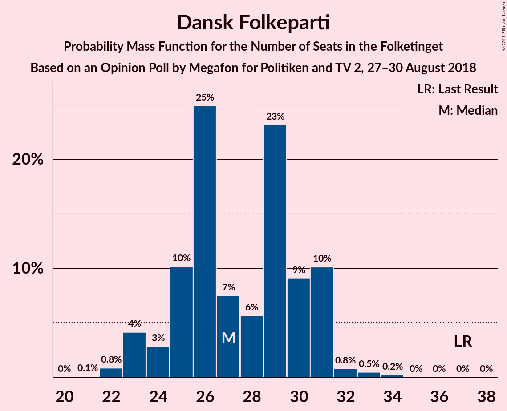
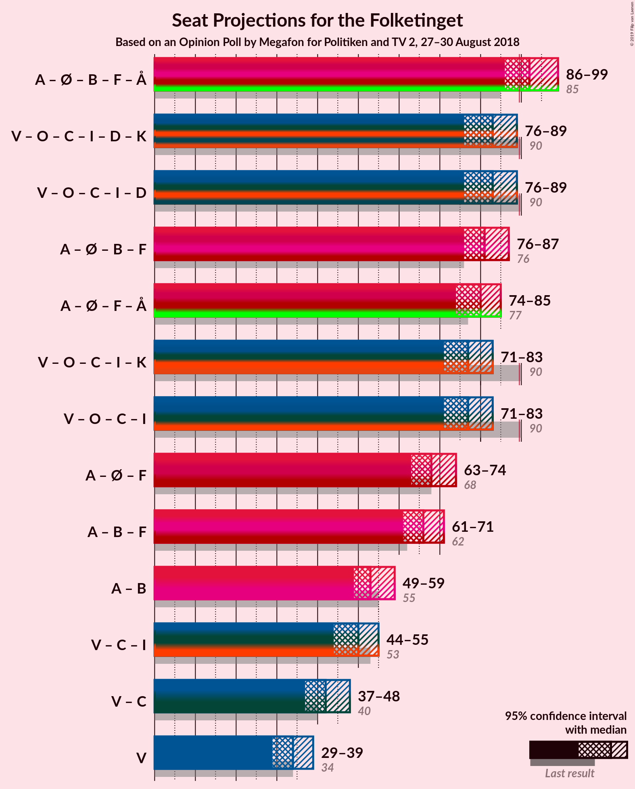

# Opinion Poll by Megafon for Politiken and TV 2, 27–30 August 2018

<a href="#voting-intentions">Voting Intentions</a> | <a href="#seats">Seats</a> | <a href="#coalitions">Coalitions</a> | <a href="#technical-information">Technical Information</a>

## Voting Intentions

### Confidence Intervals

| Party | Last Result | Poll Result | 80% Confidence Interval | 90% Confidence Interval | 95% Confidence Interval | 99% Confidence Interval |
|:-----:|:-----------:|:-----------:|:-----------------------:|:-----------------------:|:-----------------------:|:-----------------------:|
| Socialdemokraterne | 26.3% | 23.6% | 21.9–25.3% |21.5–25.8% |21.1–26.3% |20.3–27.1% |
| Venstre | 19.5% | 19.4% | 17.9–21.0% |17.4–21.5% |17.1–21.9% |16.4–22.7% |
| Dansk Folkeparti | 21.1% | 15.4% | 14.0–16.9% |13.6–17.3% |13.3–17.7% |12.7–18.5% |
| Enhedslisten–De Rød-Grønne | 7.8% | 9.1% | 8.0–10.3% |7.7–10.7% |7.4–11.0% |7.0–11.6% |
| Radikale Venstre | 4.6% | 7.3% | 6.4–8.5% |6.1–8.8% |5.9–9.1% |5.4–9.6% |
| Socialistisk Folkeparti | 4.2% | 6.8% | 5.9–7.9% |5.6–8.2% |5.4–8.5% |5.0–9.1% |
| Alternativet | 4.8% | 5.9% | 5.1–7.0% |4.8–7.3% |4.6–7.6% |4.3–8.1% |
| Det Konservative Folkeparti | 3.4% | 4.7% | 3.9–5.6% |3.7–5.9% |3.5–6.2% |3.2–6.6% |
| Liberal Alliance | 7.5% | 4.2% | 3.5–5.1% |3.3–5.4% |3.1–5.6% |2.8–6.1% |
| Nye Borgerlige | 0.0% | 3.0% | 2.4–3.8% |2.3–4.1% |2.1–4.3% |1.9–4.7% |
| Kristendemokraterne | 0.8% | 0.6% | 0.4–1.0% |0.3–1.2% |0.3–1.3% |0.2–1.5% |

*Note:* The poll result column reflects the actual value used in the calculations. Published results may vary slightly, and in addition be rounded to fewer digits.

## Seats

### Confidence Intervals

| Party | Last Result | Median | 80% Confidence Interval | 90% Confidence Interval | 95% Confidence Interval | 99% Confidence Interval |
|:-----:|:-----------:|:------:|:-----------------------:|:-----------------------:|:-----------------------:|:-----------------------:|
| <a href="#socialdemokraterne">Socialdemokraterne</a> | 47 | 40 | 36–40 |33–40 |33–50 |33–50 |
| <a href="#venstre">Venstre</a> | 34 | 36 | 36 |36 |33–36 |32–37 |
| <a href="#dansk-folkeparti">Dansk Folkeparti</a> | 37 | 28 | 24–28 |24–28 |24–30 |24–30 |
| <a href="#enhedslisten–de-rød-grønne">Enhedslisten–De Rød-Grønne</a> | 14 | 20 | 17–20 |14–20 |13–20 |13–20 |
| <a href="#radikale-venstre">Radikale Venstre</a> | 8 | 9 | 9–11 |9–13 |9–13 |9–13 |
| <a href="#socialistisk-folkeparti">Socialistisk Folkeparti</a> | 7 | 13 | 12–13 |11–13 |11–13 |11–14 |
| <a href="#alternativet">Alternativet</a> | 9 | 10 | 10–13 |10–13 |9–14 |9–15 |
| <a href="#det-konservative-folkeparti">Det Konservative Folkeparti</a> | 6 | 8 | 8–10 |8–11 |8–11 |8–11 |
| <a href="#liberal-alliance">Liberal Alliance</a> | 13 | 6 | 6–8 |6–8 |4–8 |4–10 |
| <a href="#nye-borgerlige">Nye Borgerlige</a> | 0 | 5 | 5–7 |5–9 |5–9 |0–9 |
| <a href="#kristendemokraterne">Kristendemokraterne</a> | 0 | 0 | 0 |0 |0 |0 |

### Socialdemokraterne

*For a full overview of the results for this party, see the [Socialdemokraterne](party-socialdemokraterne.html) page.*

| Number of Seats | Probability | Accumulated | Special Marks |
|:---------------:|:-----------:|:-----------:|:-------------:|
| 33 | 8% | 100% |  |
| 34 | 0% | 92% |  |
| 35 | 0% | 92% |  |
| 36 | 2% | 92% |  |
| 37 | 0% | 90% |  |
| 38 | 0.6% | 90% |  |
| 39 | 0% | 89% |  |
| 40 | 85% | 89% | Median |
| 41 | 0% | 4% |  |
| 42 | 0% | 4% |  |
| 43 | 0% | 4% |  |
| 44 | 0.3% | 4% |  |
| 45 | 0.1% | 4% |  |
| 46 | 0% | 3% |  |
| 47 | 0% | 3% | Last Result |
| 48 | 0% | 3% |  |
| 49 | 0% | 3% |  |
| 50 | 3% | 3% |  |
| 51 | 0% | 0% |  |

### Venstre

*For a full overview of the results for this party, see the [Venstre](party-venstre.html) page.*

| Number of Seats | Probability | Accumulated | Special Marks |
|:---------------:|:-----------:|:-----------:|:-------------:|
| 25 | 0.3% | 100% |  |
| 26 | 0% | 99.7% |  |
| 27 | 0% | 99.7% |  |
| 28 | 0% | 99.7% |  |
| 29 | 0% | 99.7% |  |
| 30 | 0% | 99.7% |  |
| 31 | 0% | 99.7% |  |
| 32 | 0.6% | 99.7% |  |
| 33 | 3% | 99.1% |  |
| 34 | 0% | 96% | Last Result |
| 35 | 0% | 96% |  |
| 36 | 93% | 96% | Median |
| 37 | 2% | 2% |  |
| 38 | 0% | 0% |  |

### Dansk Folkeparti

*For a full overview of the results for this party, see the [Dansk Folkeparti](party-danskfolkeparti.html) page.*

| Number of Seats | Probability | Accumulated | Special Marks |
|:---------------:|:-----------:|:-----------:|:-------------:|
| 22 | 0.1% | 100% |  |
| 23 | 0% | 99.8% |  |
| 24 | 10% | 99.8% |  |
| 25 | 0% | 90% |  |
| 26 | 0% | 90% |  |
| 27 | 0.1% | 90% |  |
| 28 | 85% | 89% | Median |
| 29 | 0.6% | 4% |  |
| 30 | 4% | 4% |  |
| 31 | 0% | 0% |  |
| 32 | 0% | 0% |  |
| 33 | 0% | 0% |  |
| 34 | 0% | 0% |  |
| 35 | 0% | 0% |  |
| 36 | 0% | 0% |  |
| 37 | 0% | 0% | Last Result |

### Enhedslisten–De Rød-Grønne

*For a full overview of the results for this party, see the [Enhedslisten–De Rød-Grønne](party-enhedslisten–derød-grønne.html) page.*

| Number of Seats | Probability | Accumulated | Special Marks |
|:---------------:|:-----------:|:-----------:|:-------------:|
| 12 | 0.1% | 100% |  |
| 13 | 3% | 99.9% |  |
| 14 | 3% | 96% | Last Result |
| 15 | 0% | 94% |  |
| 16 | 0% | 94% |  |
| 17 | 8% | 94% |  |
| 18 | 0.6% | 86% |  |
| 19 | 0% | 85% |  |
| 20 | 85% | 85% | Median |
| 21 | 0% | 0% |  |

### Radikale Venstre

*For a full overview of the results for this party, see the [Radikale Venstre](party-radikalevenstre.html) page.*

| Number of Seats | Probability | Accumulated | Special Marks |
|:---------------:|:-----------:|:-----------:|:-------------:|
| 8 | 0% | 100% | Last Result |
| 9 | 86% | 100% | Median |
| 10 | 3% | 14% |  |
| 11 | 2% | 11% |  |
| 12 | 0.4% | 9% |  |
| 13 | 8% | 8% |  |
| 14 | 0% | 0% |  |

### Socialistisk Folkeparti

*For a full overview of the results for this party, see the [Socialistisk Folkeparti](party-socialistiskfolkeparti.html) page.*

| Number of Seats | Probability | Accumulated | Special Marks |
|:---------------:|:-----------:|:-----------:|:-------------:|
| 7 | 0% | 100% | Last Result |
| 8 | 0% | 100% |  |
| 9 | 0% | 100% |  |
| 10 | 0% | 100% |  |
| 11 | 8% | 100% |  |
| 12 | 3% | 92% |  |
| 13 | 87% | 88% | Median |
| 14 | 0.6% | 1.0% |  |
| 15 | 0% | 0.4% |  |
| 16 | 0.4% | 0.4% |  |
| 17 | 0% | 0% |  |

### Alternativet

*For a full overview of the results for this party, see the [Alternativet](party-alternativet.html) page.*

| Number of Seats | Probability | Accumulated | Special Marks |
|:---------------:|:-----------:|:-----------:|:-------------:|
| 9 | 3% | 100% | Last Result |
| 10 | 85% | 97% | Median |
| 11 | 0.3% | 11% |  |
| 12 | 0% | 11% |  |
| 13 | 8% | 11% |  |
| 14 | 0.6% | 3% |  |
| 15 | 2% | 2% |  |
| 16 | 0% | 0% |  |

### Det Konservative Folkeparti

*For a full overview of the results for this party, see the [Det Konservative Folkeparti](party-detkonservativefolkeparti.html) page.*

| Number of Seats | Probability | Accumulated | Special Marks |
|:---------------:|:-----------:|:-----------:|:-------------:|
| 6 | 0% | 100% | Last Result |
| 7 | 0% | 99.9% |  |
| 8 | 85% | 99.9% | Median |
| 9 | 3% | 15% |  |
| 10 | 2% | 11% |  |
| 11 | 9% | 9% |  |
| 12 | 0% | 0% |  |

### Liberal Alliance

*For a full overview of the results for this party, see the [Liberal Alliance](party-liberalalliance.html) page.*

| Number of Seats | Probability | Accumulated | Special Marks |
|:---------------:|:-----------:|:-----------:|:-------------:|
| 4 | 3% | 100% |  |
| 5 | 0% | 97% |  |
| 6 | 85% | 97% | Median |
| 7 | 0.4% | 11% |  |
| 8 | 10% | 11% |  |
| 9 | 0% | 0.7% |  |
| 10 | 0.7% | 0.7% |  |
| 11 | 0% | 0% |  |
| 12 | 0% | 0% |  |
| 13 | 0% | 0% | Last Result |

### Nye Borgerlige

*For a full overview of the results for this party, see the [Nye Borgerlige](party-nyeborgerlige.html) page.*

| Number of Seats | Probability | Accumulated | Special Marks |
|:---------------:|:-----------:|:-----------:|:-------------:|
| 0 | 0.7% | 100% | Last Result |
| 1 | 0% | 99.3% |  |
| 2 | 0% | 99.3% |  |
| 3 | 0% | 99.3% |  |
| 4 | 0% | 99.3% |  |
| 5 | 89% | 99.3% | Median |
| 6 | 0% | 10% |  |
| 7 | 2% | 10% |  |
| 8 | 0% | 8% |  |
| 9 | 8% | 8% |  |
| 10 | 0% | 0% |  |

### Kristendemokraterne

*For a full overview of the results for this party, see the [Kristendemokraterne](party-kristendemokraterne.html) page.*

| Number of Seats | Probability | Accumulated | Special Marks |
|:---------------:|:-----------:|:-----------:|:-------------:|
| 0 | 100% | 100% | Last Result, Median |

## Coalitions

### Confidence Intervals

| Coalition | Last Result | Median | Majority? | 80% Confidence Interval | 90% Confidence Interval | 95% Confidence Interval | 99% Confidence Interval |
|:---------:|:-----------:|:------:|:---------:|:-----------------------:|:-----------------------:|:-----------------------:|:-----------------------:|
| Socialdemokraterne – Enhedslisten–De Rød-Grønne – Radikale Venstre – Socialistisk Folkeparti – Alternativet | 85 | 92 | 90% | 89–92 | 87–92 | 87–94 | 87–94 |
| Venstre – Dansk Folkeparti – Det Konservative Folkeparti – Liberal Alliance – Nye Borgerlige – Kristendemokraterne | 90 | 83 | 0% | 83–86 | 83–88 | 81–88 | 81–88 |
| Venstre – Dansk Folkeparti – Det Konservative Folkeparti – Liberal Alliance – Nye Borgerlige | 90 | 83 | 0% | 83–86 | 83–88 | 81–88 | 81–88 |
| Socialdemokraterne – Enhedslisten–De Rød-Grønne – Radikale Venstre – Socialistisk Folkeparti | 76 | 82 | 0% | 74–82 | 74–82 | 74–85 | 74–85 |
| Venstre – Dansk Folkeparti – Det Konservative Folkeparti – Liberal Alliance – Kristendemokraterne | 90 | 78 | 0% | 78–79 | 78–79 | 76–79 | 76–82 |
| Venstre – Dansk Folkeparti – Det Konservative Folkeparti – Liberal Alliance | 90 | 78 | 0% | 78–79 | 78–79 | 76–79 | 76–82 |

### Socialdemokraterne – Enhedslisten–De Rød-Grønne – Radikale Venstre – Socialistisk Folkeparti – Alternativet

| Number of Seats | Probability | Accumulated | Special Marks |
|:---------------:|:-----------:|:-----------:|:-------------:|
| 85 | 0% | 100% | Last Result |
| 86 | 0% | 100% |  |
| 87 | 8% | 100% |  |
| 88 | 0% | 92% |  |
| 89 | 2% | 92% |  |
| 90 | 0% | 90% | Majority |
| 91 | 0% | 90% |  |
| 92 | 85% | 90% | Median |
| 93 | 0.6% | 5% |  |
| 94 | 3% | 4% |  |
| 95 | 0% | 0.5% |  |
| 96 | 0% | 0.5% |  |
| 97 | 0.3% | 0.5% |  |
| 98 | 0.1% | 0.2% |  |
| 99 | 0% | 0% |  |

### Venstre – Dansk Folkeparti – Det Konservative Folkeparti – Liberal Alliance – Nye Borgerlige – Kristendemokraterne

| Number of Seats | Probability | Accumulated | Special Marks |
|:---------------:|:-----------:|:-----------:|:-------------:|
| 77 | 0.1% | 100% |  |
| 78 | 0.3% | 99.8% |  |
| 79 | 0% | 99.5% |  |
| 80 | 0% | 99.5% |  |
| 81 | 3% | 99.5% |  |
| 82 | 0.6% | 96% |  |
| 83 | 85% | 95% | Median |
| 84 | 0% | 10% |  |
| 85 | 0% | 10% |  |
| 86 | 2% | 10% |  |
| 87 | 0% | 8% |  |
| 88 | 8% | 8% |  |
| 89 | 0% | 0% |  |
| 90 | 0% | 0% | Last Result, Majority |

### Venstre – Dansk Folkeparti – Det Konservative Folkeparti – Liberal Alliance – Nye Borgerlige

| Number of Seats | Probability | Accumulated | Special Marks |
|:---------------:|:-----------:|:-----------:|:-------------:|
| 77 | 0.1% | 100% |  |
| 78 | 0.3% | 99.8% |  |
| 79 | 0% | 99.5% |  |
| 80 | 0% | 99.5% |  |
| 81 | 3% | 99.5% |  |
| 82 | 0.6% | 96% |  |
| 83 | 85% | 95% | Median |
| 84 | 0% | 10% |  |
| 85 | 0% | 10% |  |
| 86 | 2% | 10% |  |
| 87 | 0% | 8% |  |
| 88 | 8% | 8% |  |
| 89 | 0% | 0% |  |
| 90 | 0% | 0% | Last Result, Majority |

### Socialdemokraterne – Enhedslisten–De Rød-Grønne – Radikale Venstre – Socialistisk Folkeparti

| Number of Seats | Probability | Accumulated | Special Marks |
|:---------------:|:-----------:|:-----------:|:-------------:|
| 74 | 10% | 100% |  |
| 75 | 0% | 90% |  |
| 76 | 0% | 90% | Last Result |
| 77 | 0% | 90% |  |
| 78 | 0% | 90% |  |
| 79 | 0.6% | 90% |  |
| 80 | 0% | 89% |  |
| 81 | 0% | 89% |  |
| 82 | 85% | 89% | Median |
| 83 | 0% | 4% |  |
| 84 | 0% | 4% |  |
| 85 | 4% | 4% |  |
| 86 | 0.3% | 0.4% |  |
| 87 | 0.1% | 0.1% |  |
| 88 | 0% | 0% |  |

### Venstre – Dansk Folkeparti – Det Konservative Folkeparti – Liberal Alliance – Kristendemokraterne

| Number of Seats | Probability | Accumulated | Special Marks |
|:---------------:|:-----------:|:-----------:|:-------------:|
| 72 | 0% | 100% |  |
| 73 | 0.3% | 99.9% |  |
| 74 | 0% | 99.7% |  |
| 75 | 0% | 99.7% |  |
| 76 | 3% | 99.6% |  |
| 77 | 0.1% | 96% |  |
| 78 | 85% | 96% | Median |
| 79 | 10% | 11% |  |
| 80 | 0% | 0.6% |  |
| 81 | 0% | 0.6% |  |
| 82 | 0.6% | 0.6% |  |
| 83 | 0% | 0% |  |
| 84 | 0% | 0% |  |
| 85 | 0% | 0% |  |
| 86 | 0% | 0% |  |
| 87 | 0% | 0% |  |
| 88 | 0% | 0% |  |
| 89 | 0% | 0% |  |
| 90 | 0% | 0% | Last Result, Majority |

### Venstre – Dansk Folkeparti – Det Konservative Folkeparti – Liberal Alliance

| Number of Seats | Probability | Accumulated | Special Marks |
|:---------------:|:-----------:|:-----------:|:-------------:|
| 72 | 0% | 100% |  |
| 73 | 0.3% | 99.9% |  |
| 74 | 0% | 99.7% |  |
| 75 | 0% | 99.7% |  |
| 76 | 3% | 99.6% |  |
| 77 | 0.1% | 96% |  |
| 78 | 85% | 96% | Median |
| 79 | 10% | 11% |  |
| 80 | 0% | 0.6% |  |
| 81 | 0% | 0.6% |  |
| 82 | 0.6% | 0.6% |  |
| 83 | 0% | 0% |  |
| 84 | 0% | 0% |  |
| 85 | 0% | 0% |  |
| 86 | 0% | 0% |  |
| 87 | 0% | 0% |  |
| 88 | 0% | 0% |  |
| 89 | 0% | 0% |  |
| 90 | 0% | 0% | Last Result, Majority |

## Technical Information

### Opinion Poll

+ **Polling firm:** Megafon
+ **Commissioner(s):** Politiken and TV 2
+ **Fieldwork period:** 27–30 August 2018

### Calculations

+ **Sample size:** 1027
+ **Simulations done:** 1,024
+ **Error estimate:** 4.18%

