# Opinion Poll by Voxmeter for Ritzau, 27 August–2 September 2018

<a href="#voting-intentions">Voting Intentions</a> | <a href="#seats">Seats</a> | <a href="#coalitions">Coalitions</a> | <a href="#technical-information">Technical Information</a>

## Voting Intentions

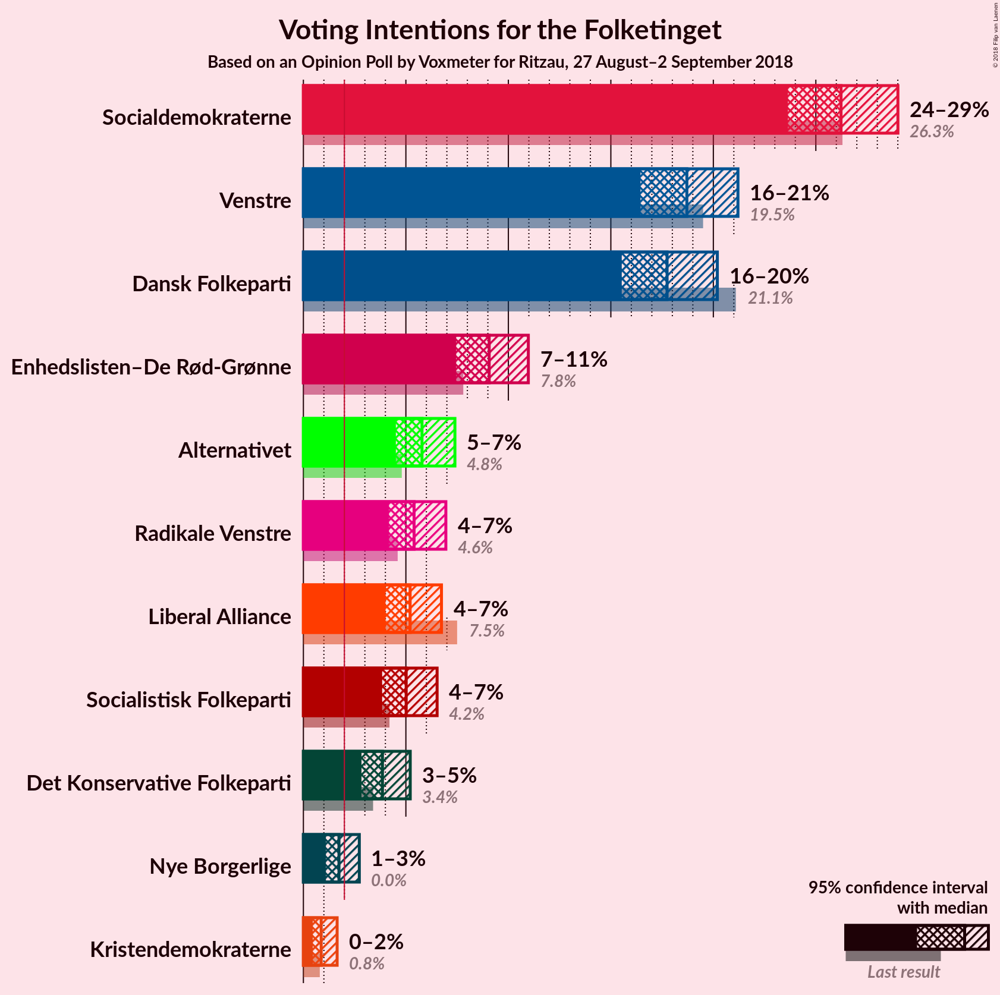

### Confidence Intervals

| Party | Last Result | Poll Result | 80% Confidence Interval | 90% Confidence Interval | 95% Confidence Interval | 99% Confidence Interval |
|:-----:|:-----------:|:-----------:|:-----------------------:|:-----------------------:|:-----------------------:|:-----------------------:|
| Socialdemokraterne | 26.3% | 26.2% | 24.5–28.0% |24.1–28.5% |23.6–29.0% |22.8–29.9% |
| Venstre | 19.5% | 18.7% | 17.2–20.3% |16.8–20.8% |16.4–21.2% |15.8–22.0% |
| Dansk Folkeparti | 21.1% | 17.7% | 16.3–19.3% |15.9–19.8% |15.5–20.2% |14.9–21.0% |
| Enhedslisten–De Rød-Grønne | 7.8% | 9.1% | 8.0–10.3% |7.7–10.7% |7.5–11.0% |7.0–11.6% |
| Alternativet | 4.8% | 5.8% | 5.0–6.8% |4.7–7.1% |4.5–7.4% |4.1–7.9% |
| Radikale Venstre | 4.6% | 5.4% | 4.6–6.4% |4.4–6.7% |4.2–7.0% |3.8–7.5% |
| Liberal Alliance | 7.5% | 5.2% | 4.4–6.2% |4.2–6.5% |4.0–6.7% |3.7–7.3% |
| Socialistisk Folkeparti | 4.2% | 5.0% | 4.2–6.0% |4.0–6.3% |3.8–6.5% |3.5–7.0% |
| Det Konservative Folkeparti | 3.4% | 3.9% | 3.2–4.7% |3.0–5.0% |2.8–5.2% |2.5–5.7% |
| Nye Borgerlige | 0.0% | 1.7% | 1.3–2.4% |1.2–2.6% |1.1–2.7% |0.9–3.1% |
| Kristendemokraterne | 0.8% | 0.9% | 0.6–1.4% |0.5–1.5% |0.5–1.6% |0.4–1.9% |

*Note:* The poll result column reflects the actual value used in the calculations. Published results may vary slightly, and in addition be rounded to fewer digits.

## Seats

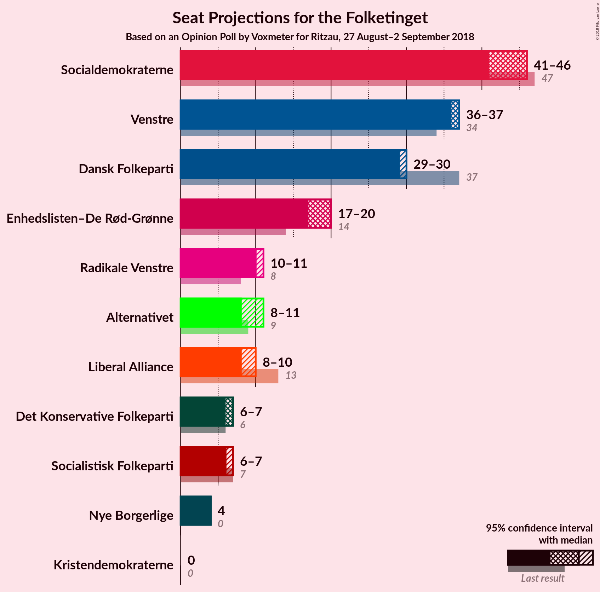

### Confidence Intervals

| Party | Last Result | Median | 80% Confidence Interval | 90% Confidence Interval | 95% Confidence Interval | 99% Confidence Interval |
|:-----:|:-----------:|:------:|:-----------------------:|:-----------------------:|:-----------------------:|:-----------------------:|
| <a href="#socialdemokraterne">Socialdemokraterne</a> | 47 | 46 | 43–48 |42–51 |42–52 |41–53 |
| <a href="#venstre">Venstre</a> | 34 | 32 | 31–37 |30–37 |29–38 |28–39 |
| <a href="#dansk-folkeparti">Dansk Folkeparti</a> | 37 | 31 | 29–33 |28–33 |26–35 |26–38 |
| <a href="#enhedslisten–de-rød-grønne">Enhedslisten–De Rød-Grønne</a> | 14 | 15 | 14–20 |13–20 |13–20 |12–21 |
| <a href="#alternativet">Alternativet</a> | 9 | 11 | 10–13 |9–13 |8–14 |7–14 |
| <a href="#radikale-venstre">Radikale Venstre</a> | 8 | 10 | 8–11 |8–11 |8–12 |8–13 |
| <a href="#liberal-alliance">Liberal Alliance</a> | 13 | 9 | 8–11 |8–11 |7–12 |6–13 |
| <a href="#socialistisk-folkeparti">Socialistisk Folkeparti</a> | 7 | 9 | 7–11 |7–11 |7–11 |6–12 |
| <a href="#det-konservative-folkeparti">Det Konservative Folkeparti</a> | 6 | 7 | 6–9 |6–10 |6–10 |4–10 |
| <a href="#nye-borgerlige">Nye Borgerlige</a> | 0 | 4 | 0–5 |0–5 |0–5 |0–5 |
| <a href="#kristendemokraterne">Kristendemokraterne</a> | 0 | 0 | 0 |0 |0 |0–4 |

### Socialdemokraterne

*For a full overview of the results for this party, see the [Socialdemokraterne](party-socialdemokraterne.html) page.*

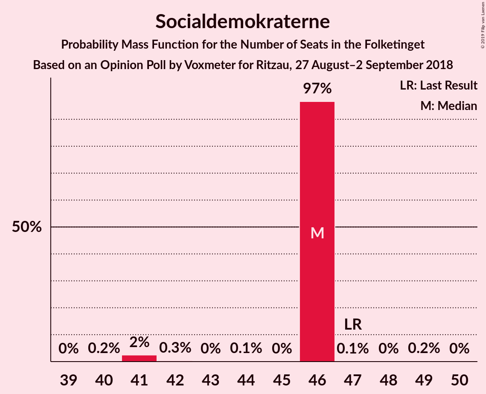

| Number of Seats | Probability | Accumulated | Special Marks |
|:---------------:|:-----------:|:-----------:|:-------------:|
| 39 | 0.2% | 100% |  |
| 40 | 0.1% | 99.8% |  |
| 41 | 0.7% | 99.7% |  |
| 42 | 5% | 99.0% |  |
| 43 | 11% | 94% |  |
| 44 | 0.9% | 83% |  |
| 45 | 3% | 82% |  |
| 46 | 47% | 80% | Median |
| 47 | 4% | 33% | Last Result |
| 48 | 20% | 29% |  |
| 49 | 2% | 9% |  |
| 50 | 2% | 7% |  |
| 51 | 2% | 5% |  |
| 52 | 3% | 3% |  |
| 53 | 0.5% | 0.6% |  |
| 54 | 0% | 0.1% |  |
| 55 | 0.1% | 0.1% |  |
| 56 | 0% | 0% |  |

### Venstre

*For a full overview of the results for this party, see the [Venstre](party-venstre.html) page.*

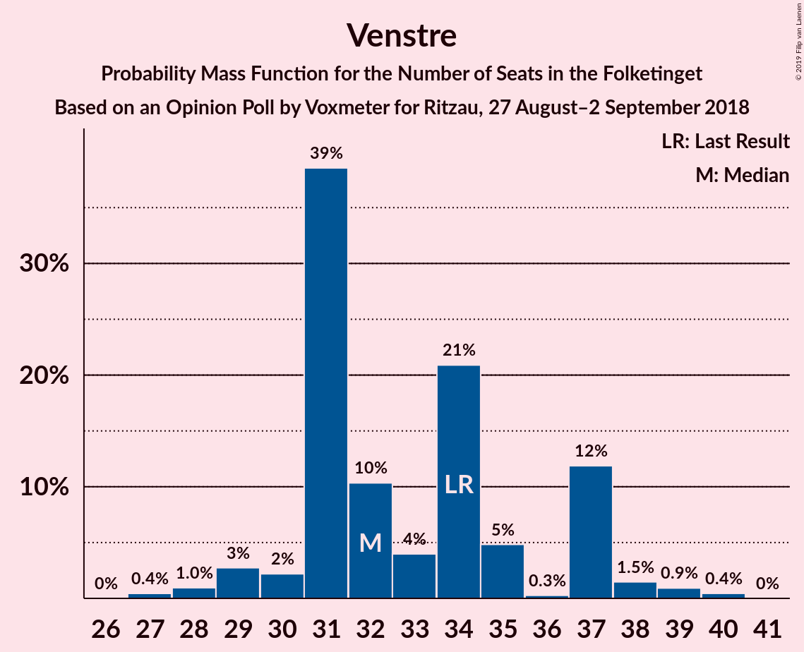

| Number of Seats | Probability | Accumulated | Special Marks |
|:---------------:|:-----------:|:-----------:|:-------------:|
| 27 | 0.4% | 100% |  |
| 28 | 1.0% | 99.5% |  |
| 29 | 3% | 98.6% |  |
| 30 | 2% | 96% |  |
| 31 | 39% | 94% |  |
| 32 | 10% | 55% | Median |
| 33 | 4% | 45% |  |
| 34 | 21% | 41% | Last Result |
| 35 | 5% | 20% |  |
| 36 | 0.3% | 15% |  |
| 37 | 12% | 15% |  |
| 38 | 1.5% | 3% |  |
| 39 | 0.9% | 1.4% |  |
| 40 | 0.4% | 0.5% |  |
| 41 | 0% | 0% |  |

### Dansk Folkeparti

*For a full overview of the results for this party, see the [Dansk Folkeparti](party-danskfolkeparti.html) page.*

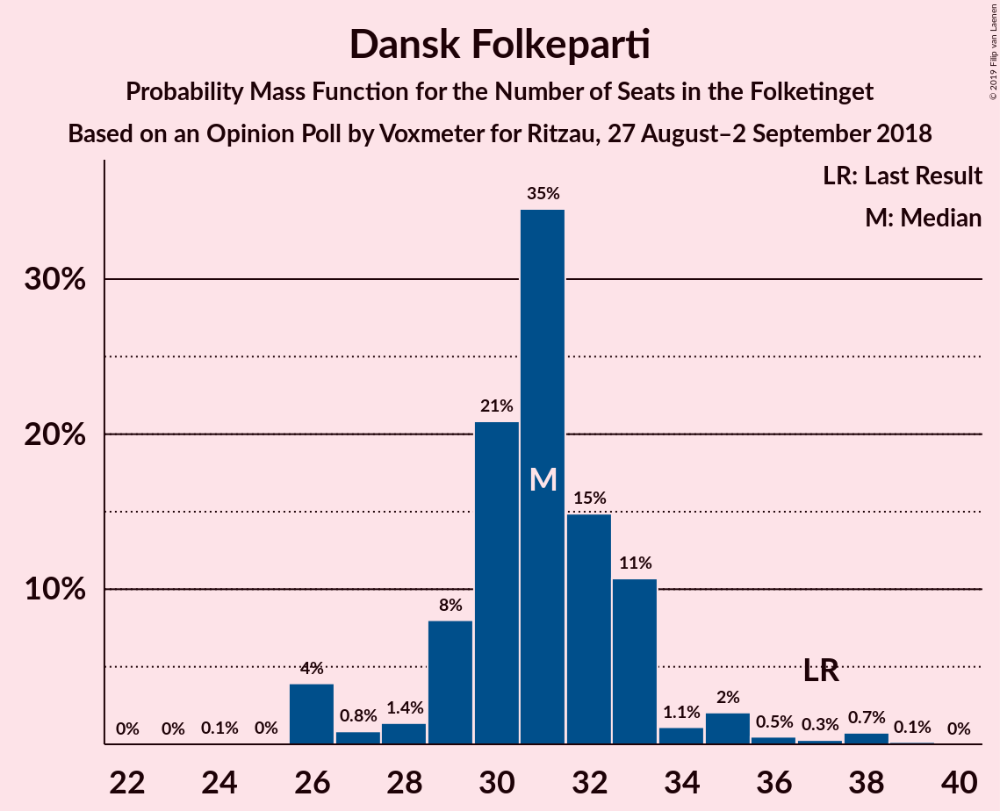

| Number of Seats | Probability | Accumulated | Special Marks |
|:---------------:|:-----------:|:-----------:|:-------------:|
| 24 | 0.1% | 100% |  |
| 25 | 0% | 99.9% |  |
| 26 | 4% | 99.9% |  |
| 27 | 0.8% | 96% |  |
| 28 | 1.4% | 95% |  |
| 29 | 8% | 94% |  |
| 30 | 21% | 86% |  |
| 31 | 35% | 65% | Median |
| 32 | 15% | 30% |  |
| 33 | 11% | 16% |  |
| 34 | 1.1% | 5% |  |
| 35 | 2% | 4% |  |
| 36 | 0.5% | 2% |  |
| 37 | 0.3% | 1.2% | Last Result |
| 38 | 0.7% | 0.9% |  |
| 39 | 0.1% | 0.2% |  |
| 40 | 0% | 0% |  |

### Enhedslisten–De Rød-Grønne

*For a full overview of the results for this party, see the [Enhedslisten–De Rød-Grønne](party-enhedslisten–derød-grønne.html) page.*

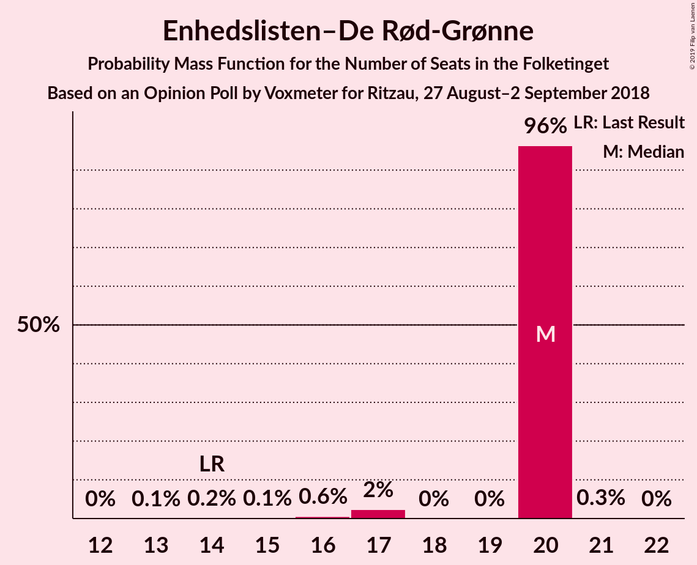

| Number of Seats | Probability | Accumulated | Special Marks |
|:---------------:|:-----------:|:-----------:|:-------------:|
| 11 | 0.1% | 100% |  |
| 12 | 2% | 99.9% |  |
| 13 | 8% | 98% |  |
| 14 | 40% | 90% | Last Result |
| 15 | 3% | 51% | Median |
| 16 | 30% | 48% |  |
| 17 | 5% | 18% |  |
| 18 | 2% | 14% |  |
| 19 | 2% | 12% |  |
| 20 | 10% | 10% |  |
| 21 | 0.3% | 0.5% |  |
| 22 | 0% | 0.2% |  |
| 23 | 0.1% | 0.1% |  |
| 24 | 0% | 0% |  |

### Alternativet

*For a full overview of the results for this party, see the [Alternativet](party-alternativet.html) page.*

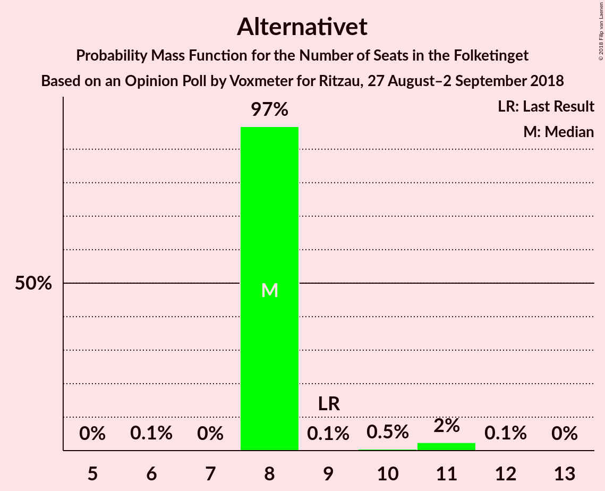

| Number of Seats | Probability | Accumulated | Special Marks |
|:---------------:|:-----------:|:-----------:|:-------------:|
| 7 | 0.6% | 100% |  |
| 8 | 3% | 99.4% |  |
| 9 | 6% | 97% | Last Result |
| 10 | 40% | 91% |  |
| 11 | 19% | 51% | Median |
| 12 | 2% | 32% |  |
| 13 | 26% | 30% |  |
| 14 | 4% | 4% |  |
| 15 | 0.1% | 0.1% |  |
| 16 | 0% | 0% |  |

### Radikale Venstre

*For a full overview of the results for this party, see the [Radikale Venstre](party-radikalevenstre.html) page.*

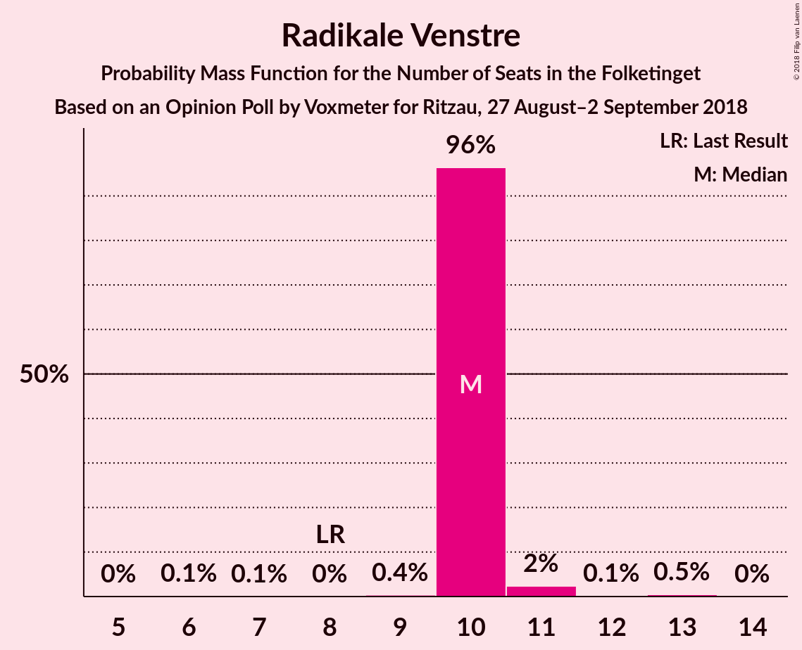

| Number of Seats | Probability | Accumulated | Special Marks |
|:---------------:|:-----------:|:-----------:|:-------------:|
| 7 | 0.4% | 100% |  |
| 8 | 19% | 99.5% | Last Result |
| 9 | 8% | 81% |  |
| 10 | 32% | 73% | Median |
| 11 | 37% | 41% |  |
| 12 | 3% | 4% |  |
| 13 | 0.7% | 0.8% |  |
| 14 | 0.1% | 0.1% |  |
| 15 | 0% | 0% |  |

### Liberal Alliance

*For a full overview of the results for this party, see the [Liberal Alliance](party-liberalalliance.html) page.*

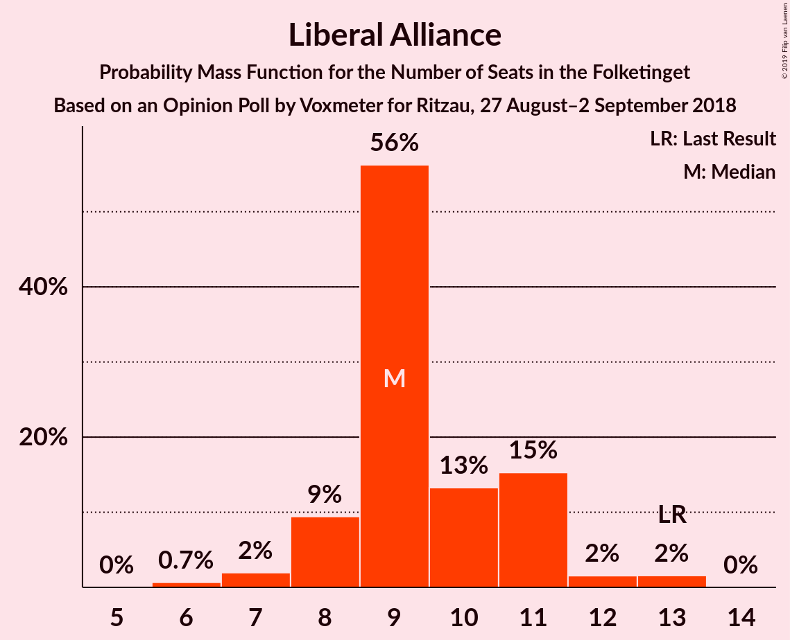

| Number of Seats | Probability | Accumulated | Special Marks |
|:---------------:|:-----------:|:-----------:|:-------------:|
| 6 | 0.7% | 100% |  |
| 7 | 2% | 99.3% |  |
| 8 | 9% | 97% |  |
| 9 | 56% | 88% | Median |
| 10 | 13% | 32% |  |
| 11 | 15% | 18% |  |
| 12 | 2% | 3% |  |
| 13 | 2% | 2% | Last Result |
| 14 | 0% | 0% |  |

### Socialistisk Folkeparti

*For a full overview of the results for this party, see the [Socialistisk Folkeparti](party-socialistiskfolkeparti.html) page.*

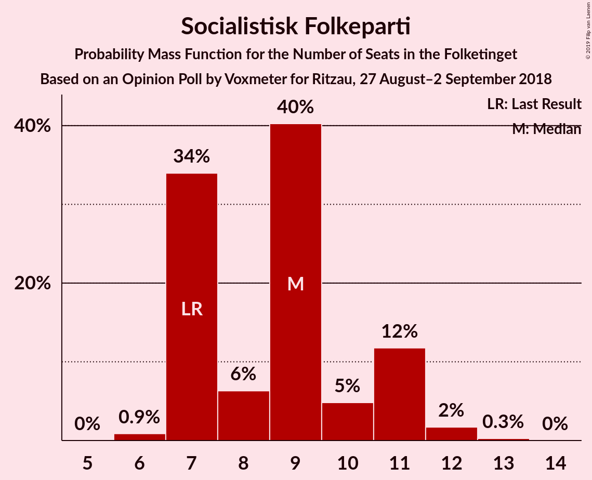

| Number of Seats | Probability | Accumulated | Special Marks |
|:---------------:|:-----------:|:-----------:|:-------------:|
| 6 | 0.9% | 100% |  |
| 7 | 34% | 99.1% | Last Result |
| 8 | 6% | 65% |  |
| 9 | 40% | 59% | Median |
| 10 | 5% | 19% |  |
| 11 | 12% | 14% |  |
| 12 | 2% | 2% |  |
| 13 | 0.3% | 0.3% |  |
| 14 | 0% | 0% |  |

### Det Konservative Folkeparti

*For a full overview of the results for this party, see the [Det Konservative Folkeparti](party-detkonservativefolkeparti.html) page.*

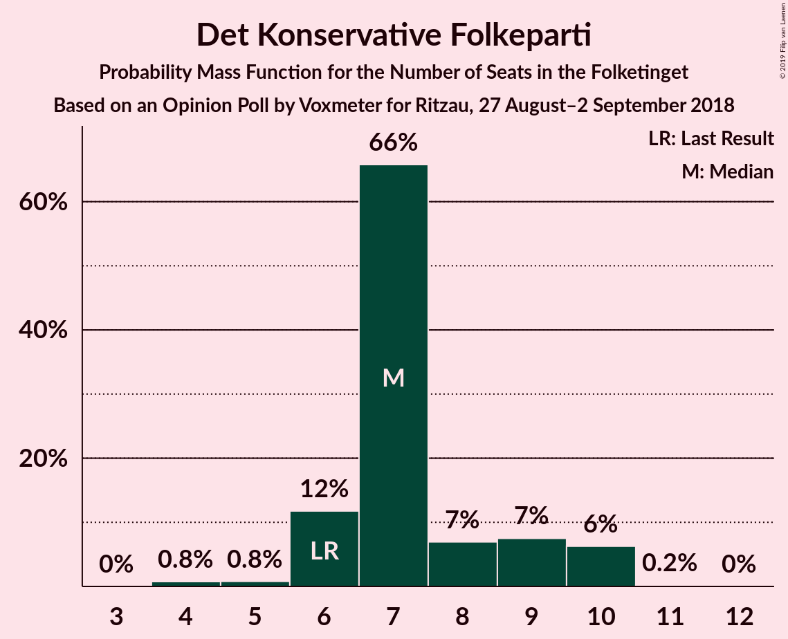

| Number of Seats | Probability | Accumulated | Special Marks |
|:---------------:|:-----------:|:-----------:|:-------------:|
| 4 | 0.8% | 100% |  |
| 5 | 0.8% | 99.2% |  |
| 6 | 12% | 98% | Last Result |
| 7 | 66% | 87% | Median |
| 8 | 7% | 21% |  |
| 9 | 7% | 14% |  |
| 10 | 6% | 6% |  |
| 11 | 0.2% | 0.2% |  |
| 12 | 0% | 0% |  |

### Nye Borgerlige

*For a full overview of the results for this party, see the [Nye Borgerlige](party-nyeborgerlige.html) page.*

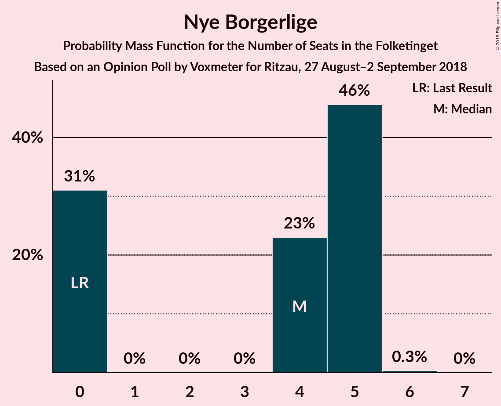

| Number of Seats | Probability | Accumulated | Special Marks |
|:---------------:|:-----------:|:-----------:|:-------------:|
| 0 | 31% | 100% | Last Result |
| 1 | 0% | 69% |  |
| 2 | 0% | 69% |  |
| 3 | 0% | 69% |  |
| 4 | 23% | 69% | Median |
| 5 | 46% | 46% |  |
| 6 | 0.3% | 0.3% |  |
| 7 | 0% | 0% |  |

### Kristendemokraterne

*For a full overview of the results for this party, see the [Kristendemokraterne](party-kristendemokraterne.html) page.*

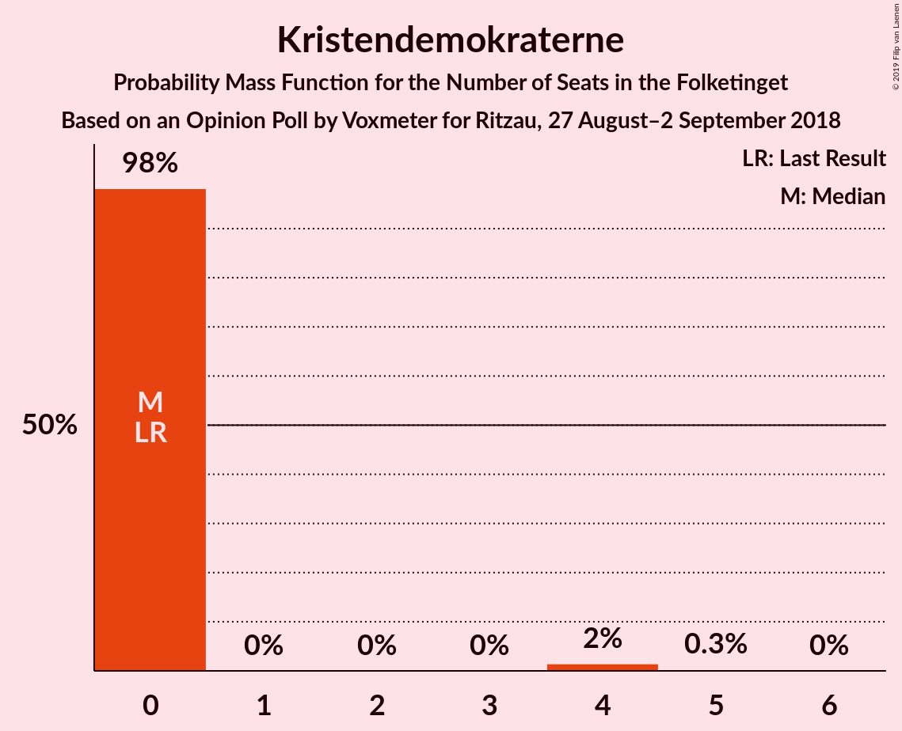

| Number of Seats | Probability | Accumulated | Special Marks |
|:---------------:|:-----------:|:-----------:|:-------------:|
| 0 | 98% | 100% | Last Result, Median |
| 1 | 0% | 2% |  |
| 2 | 0% | 2% |  |
| 3 | 0% | 2% |  |
| 4 | 2% | 2% |  |
| 5 | 0.3% | 0.3% |  |
| 6 | 0% | 0% |  |

## Coalitions

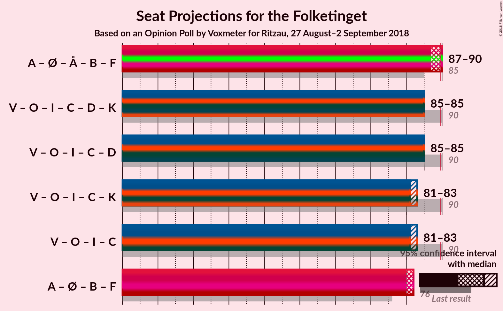

### Confidence Intervals

| Coalition | Last Result | Median | Majority? | 80% Confidence Interval | 90% Confidence Interval | 95% Confidence Interval | 99% Confidence Interval |
|:---------:|:-----------:|:------:|:---------:|:-----------------------:|:-----------------------:|:-----------------------:|:-----------------------:|
| Socialdemokraterne – Enhedslisten–De Rød-Grønne – Alternativet – Radikale Venstre – Socialistisk Folkeparti | 85 | 90 | 86% | 87–97 | 84–98 | 84–98 | 84–100 |
| Venstre – Dansk Folkeparti – Liberal Alliance – Det Konservative Folkeparti – Nye Borgerlige – Kristendemokraterne | 90 | 85 | 7% | 78–88 | 77–91 | 77–91 | 75–91 |
| Venstre – Dansk Folkeparti – Liberal Alliance – Det Konservative Folkeparti – Nye Borgerlige | 90 | 85 | 7% | 78–88 | 77–91 | 77–91 | 75–91 |
| Socialdemokraterne – Enhedslisten–De Rød-Grønne – Alternativet – Socialistisk Folkeparti | 77 | 80 | 8% | 78–88 | 76–90 | 76–90 | 76–91 |
| Venstre – Dansk Folkeparti – Liberal Alliance – Det Konservative Folkeparti – Kristendemokraterne | 90 | 80 | 0.4% | 77–87 | 77–87 | 76–87 | 75–88 |
| Venstre – Dansk Folkeparti – Liberal Alliance – Det Konservative Folkeparti | 90 | 80 | 0.4% | 77–87 | 77–87 | 76–87 | 75–88 |
| Socialdemokraterne – Enhedslisten–De Rød-Grønne – Radikale Venstre – Socialistisk Folkeparti | 76 | 80 | 1.4% | 76–87 | 73–87 | 73–87 | 73–91 |
| Socialdemokraterne – Enhedslisten–De Rød-Grønne – Socialistisk Folkeparti | 68 | 69 | 0% | 66–78 | 65–79 | 65–79 | 65–82 |
| Socialdemokraterne – Radikale Venstre – Socialistisk Folkeparti | 62 | 65 | 0% | 60–67 | 60–70 | 60–71 | 59–72 |
| Socialdemokraterne – Radikale Venstre | 55 | 56 | 0% | 51–59 | 51–60 | 51–62 | 50–63 |
| Venstre – Liberal Alliance – Det Konservative Folkeparti | 53 | 49 | 0% | 47–54 | 47–54 | 46–54 | 43–58 |
| Venstre – Det Konservative Folkeparti | 40 | 38 | 0% | 38–45 | 37–46 | 36–46 | 34–47 |
| Venstre | 34 | 32 | 0% | 31–37 | 30–37 | 29–38 | 28–39 |

### Socialdemokraterne – Enhedslisten–De Rød-Grønne – Alternativet – Radikale Venstre – Socialistisk Folkeparti

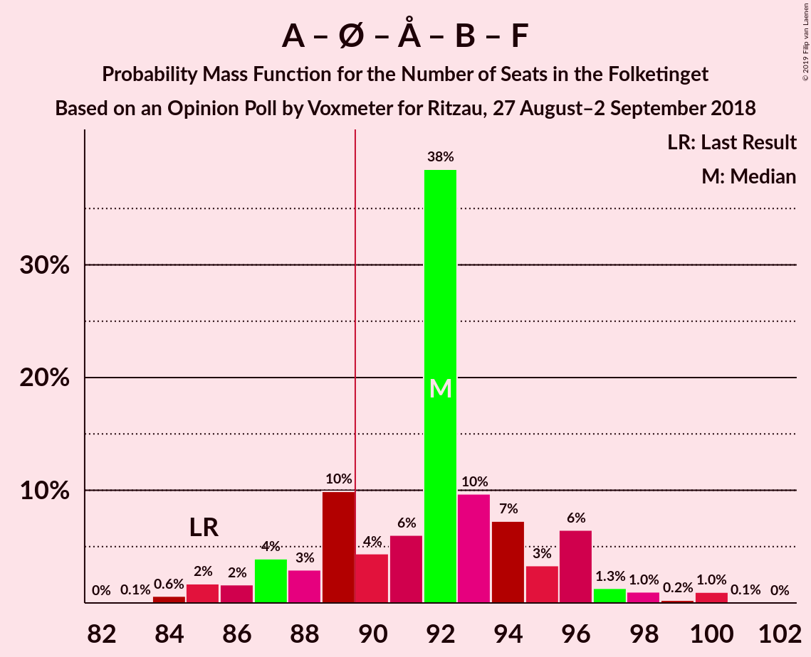

| Number of Seats | Probability | Accumulated | Special Marks |
|:---------------:|:-----------:|:-----------:|:-------------:|
| 82 | 0% | 100% |  |
| 83 | 0.1% | 99.9% |  |
| 84 | 7% | 99.9% |  |
| 85 | 0.5% | 93% | Last Result |
| 86 | 0.5% | 93% |  |
| 87 | 2% | 92% |  |
| 88 | 2% | 90% |  |
| 89 | 2% | 88% |  |
| 90 | 37% | 86% | Majority |
| 91 | 4% | 48% | Median |
| 92 | 25% | 45% |  |
| 93 | 2% | 20% |  |
| 94 | 0.4% | 18% |  |
| 95 | 2% | 17% |  |
| 96 | 4% | 15% |  |
| 97 | 2% | 11% |  |
| 98 | 7% | 9% |  |
| 99 | 0.1% | 2% |  |
| 100 | 2% | 2% |  |
| 101 | 0.1% | 0.3% |  |
| 102 | 0.1% | 0.2% |  |
| 103 | 0.1% | 0.1% |  |
| 104 | 0% | 0% |  |

### Venstre – Dansk Folkeparti – Liberal Alliance – Det Konservative Folkeparti – Nye Borgerlige – Kristendemokraterne

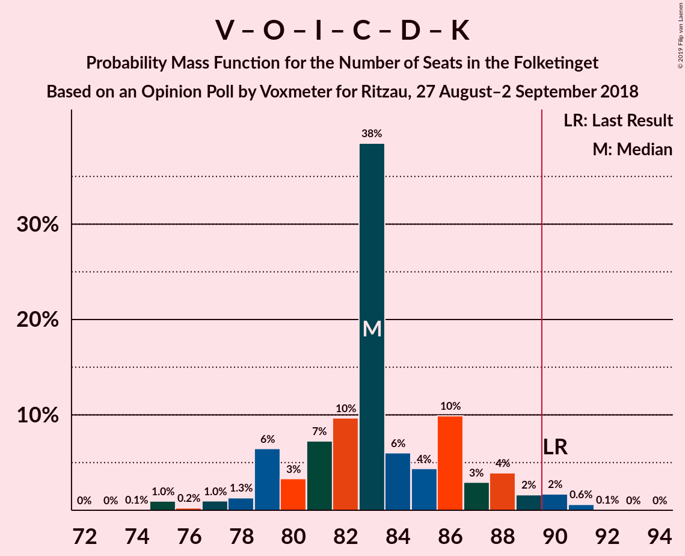

| Number of Seats | Probability | Accumulated | Special Marks |
|:---------------:|:-----------:|:-----------:|:-------------:|
| 72 | 0.1% | 100% |  |
| 73 | 0.1% | 99.9% |  |
| 74 | 0.1% | 99.8% |  |
| 75 | 2% | 99.7% |  |
| 76 | 0.1% | 98% |  |
| 77 | 7% | 98% |  |
| 78 | 2% | 91% |  |
| 79 | 4% | 89% |  |
| 80 | 2% | 85% |  |
| 81 | 0.4% | 83% |  |
| 82 | 2% | 82% |  |
| 83 | 25% | 80% | Median |
| 84 | 4% | 55% |  |
| 85 | 37% | 52% |  |
| 86 | 2% | 14% |  |
| 87 | 2% | 12% |  |
| 88 | 2% | 10% |  |
| 89 | 0.5% | 8% |  |
| 90 | 0.5% | 7% | Last Result, Majority |
| 91 | 7% | 7% |  |
| 92 | 0.1% | 0.1% |  |
| 93 | 0% | 0.1% |  |
| 94 | 0% | 0% |  |

### Venstre – Dansk Folkeparti – Liberal Alliance – Det Konservative Folkeparti – Nye Borgerlige

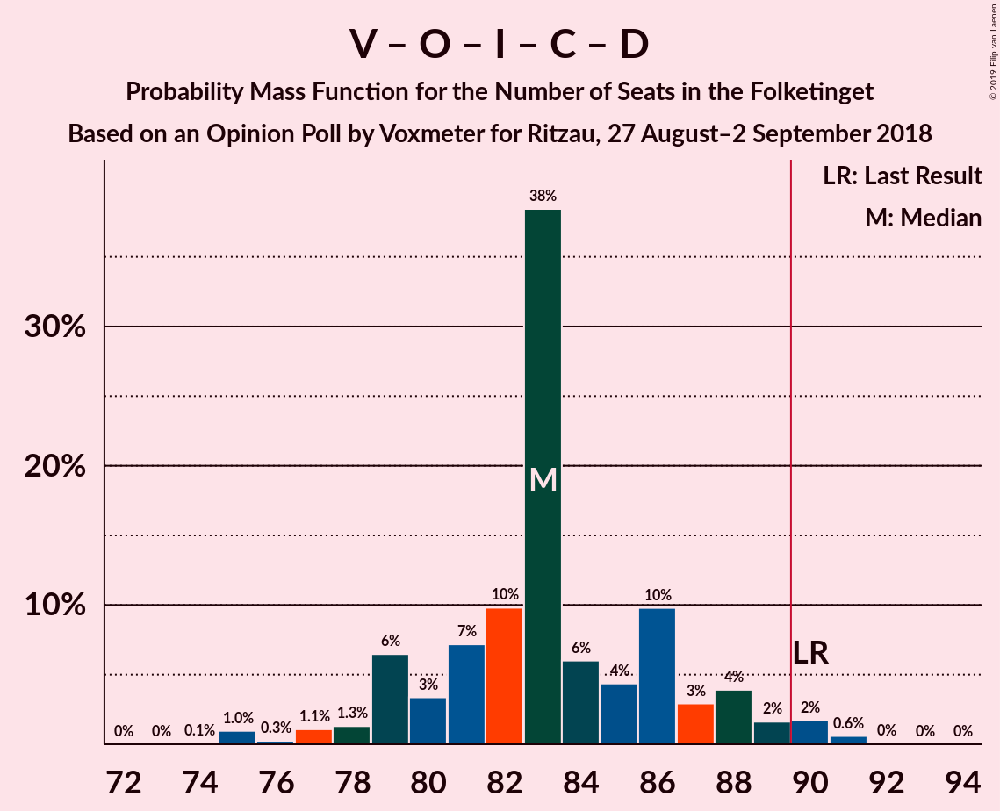

| Number of Seats | Probability | Accumulated | Special Marks |
|:---------------:|:-----------:|:-----------:|:-------------:|
| 72 | 0.1% | 100% |  |
| 73 | 0.1% | 99.9% |  |
| 74 | 0.1% | 99.8% |  |
| 75 | 2% | 99.7% |  |
| 76 | 0.1% | 98% |  |
| 77 | 7% | 98% |  |
| 78 | 2% | 91% |  |
| 79 | 4% | 89% |  |
| 80 | 2% | 85% |  |
| 81 | 0.4% | 83% |  |
| 82 | 4% | 82% |  |
| 83 | 25% | 79% | Median |
| 84 | 4% | 54% |  |
| 85 | 37% | 50% |  |
| 86 | 0.8% | 13% |  |
| 87 | 2% | 12% |  |
| 88 | 2% | 10% |  |
| 89 | 0.4% | 8% |  |
| 90 | 0.5% | 7% | Last Result, Majority |
| 91 | 7% | 7% |  |
| 92 | 0.1% | 0.1% |  |
| 93 | 0% | 0.1% |  |
| 94 | 0% | 0% |  |

### Socialdemokraterne – Enhedslisten–De Rød-Grønne – Alternativet – Socialistisk Folkeparti

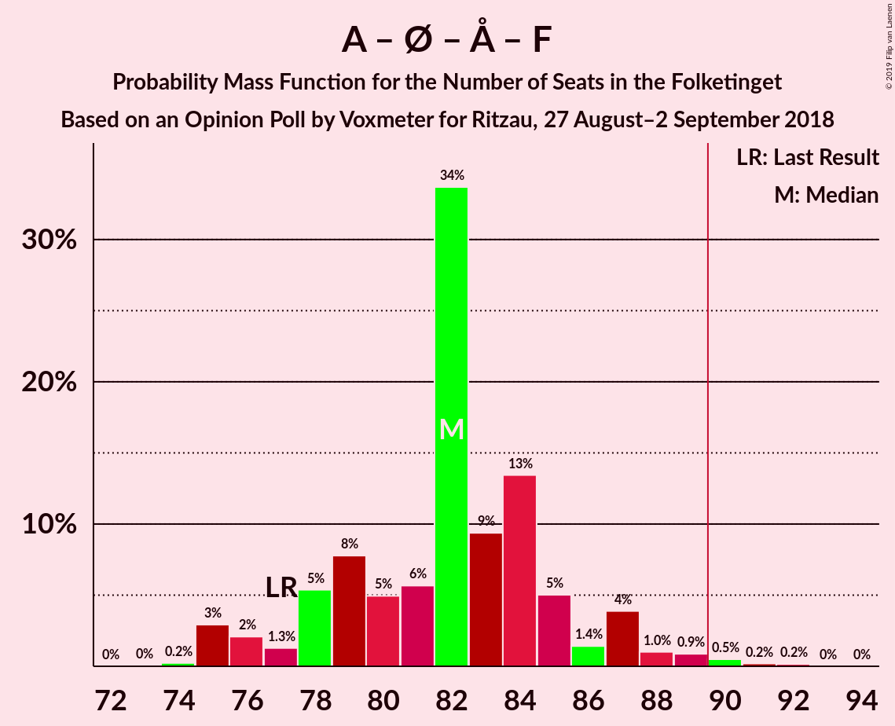

| Number of Seats | Probability | Accumulated | Special Marks |
|:---------------:|:-----------:|:-----------:|:-------------:|
| 73 | 0.2% | 100% |  |
| 74 | 0.1% | 99.8% |  |
| 75 | 0.2% | 99.8% |  |
| 76 | 7% | 99.6% |  |
| 77 | 1.4% | 93% | Last Result |
| 78 | 4% | 91% |  |
| 79 | 35% | 87% |  |
| 80 | 4% | 53% |  |
| 81 | 1.4% | 48% | Median |
| 82 | 26% | 47% |  |
| 83 | 3% | 21% |  |
| 84 | 2% | 18% |  |
| 85 | 1.4% | 16% |  |
| 86 | 2% | 15% |  |
| 87 | 2% | 13% |  |
| 88 | 1.3% | 11% |  |
| 89 | 0.8% | 9% |  |
| 90 | 7% | 8% | Majority |
| 91 | 1.4% | 1.5% |  |
| 92 | 0% | 0.1% |  |
| 93 | 0.1% | 0.1% |  |
| 94 | 0% | 0% |  |

### Venstre – Dansk Folkeparti – Liberal Alliance – Det Konservative Folkeparti – Kristendemokraterne

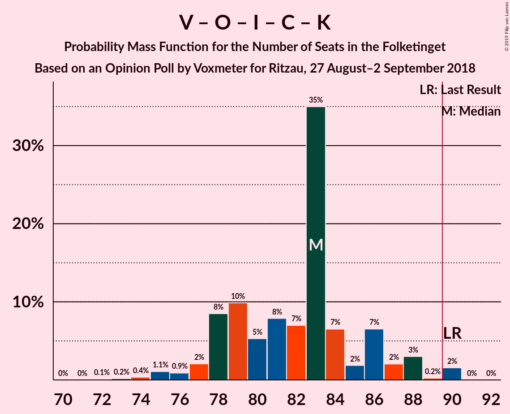

| Number of Seats | Probability | Accumulated | Special Marks |
|:---------------:|:-----------:|:-----------:|:-------------:|
| 72 | 0.1% | 100% |  |
| 73 | 0.1% | 99.9% |  |
| 74 | 0.1% | 99.8% |  |
| 75 | 2% | 99.7% |  |
| 76 | 0.4% | 98% |  |
| 77 | 7% | 97% |  |
| 78 | 26% | 90% |  |
| 79 | 4% | 63% | Median |
| 80 | 22% | 59% |  |
| 81 | 13% | 37% |  |
| 82 | 3% | 24% |  |
| 83 | 0.6% | 21% |  |
| 84 | 4% | 20% |  |
| 85 | 5% | 16% |  |
| 86 | 0.9% | 11% |  |
| 87 | 8% | 11% |  |
| 88 | 2% | 2% |  |
| 89 | 0% | 0.4% |  |
| 90 | 0.4% | 0.4% | Last Result, Majority |
| 91 | 0% | 0% |  |

### Venstre – Dansk Folkeparti – Liberal Alliance – Det Konservative Folkeparti

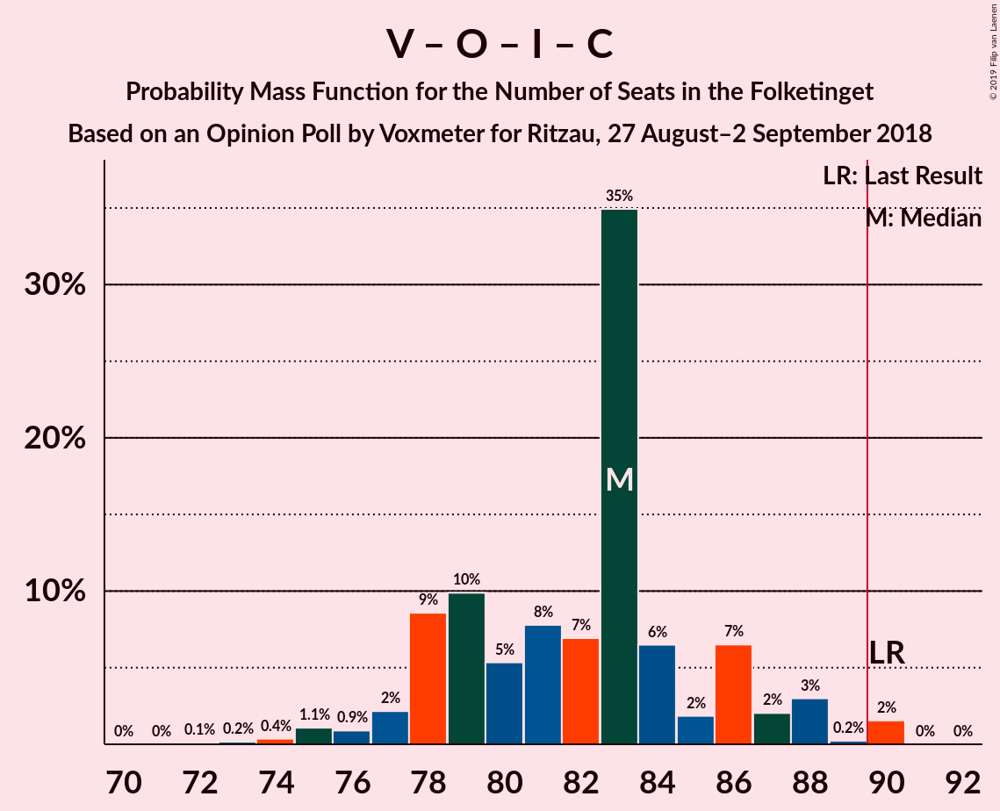

| Number of Seats | Probability | Accumulated | Special Marks |
|:---------------:|:-----------:|:-----------:|:-------------:|
| 72 | 0.1% | 100% |  |
| 73 | 0.1% | 99.9% |  |
| 74 | 0.1% | 99.8% |  |
| 75 | 2% | 99.6% |  |
| 76 | 0.4% | 98% |  |
| 77 | 7% | 97% |  |
| 78 | 28% | 90% |  |
| 79 | 4% | 62% | Median |
| 80 | 22% | 58% |  |
| 81 | 13% | 36% |  |
| 82 | 2% | 22% |  |
| 83 | 0.5% | 20% |  |
| 84 | 4% | 20% |  |
| 85 | 5% | 16% |  |
| 86 | 0.9% | 11% |  |
| 87 | 8% | 10% |  |
| 88 | 2% | 2% |  |
| 89 | 0% | 0.4% |  |
| 90 | 0.4% | 0.4% | Last Result, Majority |
| 91 | 0% | 0% |  |

### Socialdemokraterne – Enhedslisten–De Rød-Grønne – Radikale Venstre – Socialistisk Folkeparti

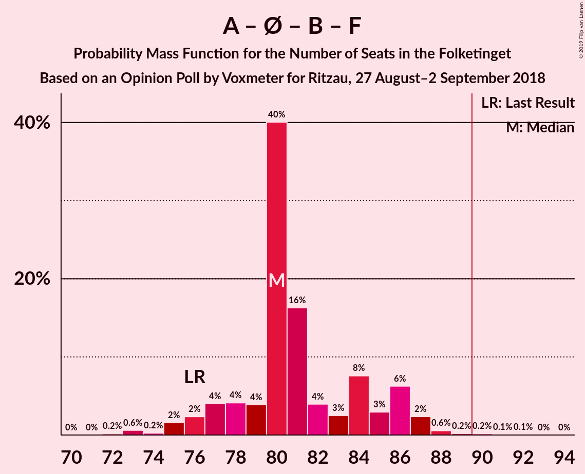

| Number of Seats | Probability | Accumulated | Special Marks |
|:---------------:|:-----------:|:-----------:|:-------------:|
| 73 | 7% | 100% |  |
| 74 | 0.5% | 93% |  |
| 75 | 0.7% | 93% |  |
| 76 | 4% | 92% | Last Result |
| 77 | 2% | 88% |  |
| 78 | 3% | 86% |  |
| 79 | 25% | 83% |  |
| 80 | 34% | 58% | Median |
| 81 | 2% | 24% |  |
| 82 | 3% | 22% |  |
| 83 | 0.4% | 19% |  |
| 84 | 3% | 19% |  |
| 85 | 3% | 16% |  |
| 86 | 2% | 13% |  |
| 87 | 9% | 11% |  |
| 88 | 0% | 2% |  |
| 89 | 0.4% | 2% |  |
| 90 | 0% | 1.4% | Majority |
| 91 | 1.1% | 1.4% |  |
| 92 | 0.1% | 0.2% |  |
| 93 | 0.1% | 0.1% |  |
| 94 | 0% | 0% |  |

### Socialdemokraterne – Enhedslisten–De Rød-Grønne – Socialistisk Folkeparti

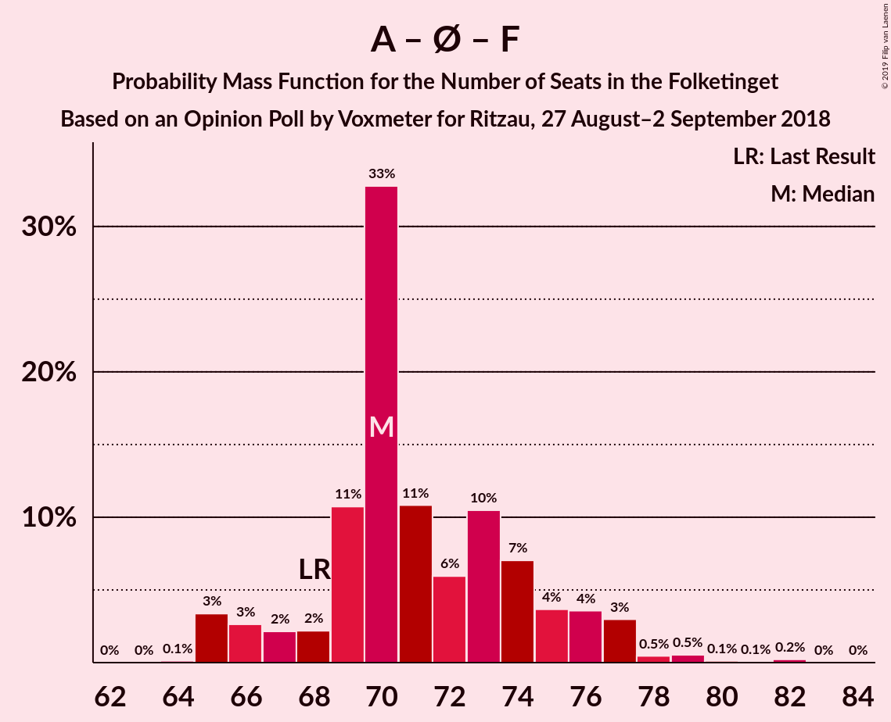

| Number of Seats | Probability | Accumulated | Special Marks |
|:---------------:|:-----------:|:-----------:|:-------------:|
| 63 | 0.1% | 100% |  |
| 64 | 0.4% | 99.9% |  |
| 65 | 8% | 99.5% |  |
| 66 | 4% | 92% |  |
| 67 | 0.4% | 88% |  |
| 68 | 2% | 87% | Last Result |
| 69 | 60% | 85% |  |
| 70 | 2% | 25% | Median |
| 71 | 0.4% | 23% |  |
| 72 | 0.6% | 22% |  |
| 73 | 3% | 22% |  |
| 74 | 4% | 19% |  |
| 75 | 2% | 15% |  |
| 76 | 0.1% | 13% |  |
| 77 | 2% | 13% |  |
| 78 | 2% | 10% |  |
| 79 | 7% | 8% |  |
| 80 | 0.1% | 1.4% |  |
| 81 | 0.1% | 1.3% |  |
| 82 | 1.1% | 1.1% |  |
| 83 | 0% | 0% |  |

### Socialdemokraterne – Radikale Venstre – Socialistisk Folkeparti

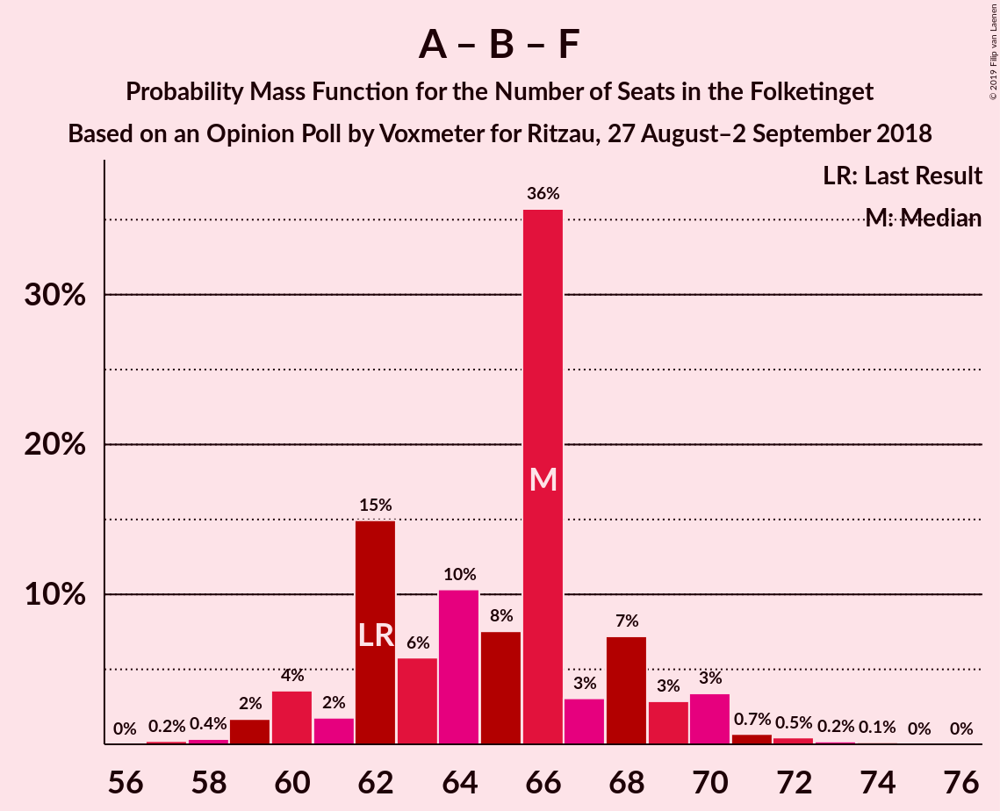

| Number of Seats | Probability | Accumulated | Special Marks |
|:---------------:|:-----------:|:-----------:|:-------------:|
| 56 | 0.1% | 100% |  |
| 57 | 0.1% | 99.9% |  |
| 58 | 0.1% | 99.7% |  |
| 59 | 0.2% | 99.6% |  |
| 60 | 11% | 99.4% |  |
| 61 | 1.1% | 88% |  |
| 62 | 4% | 87% | Last Result |
| 63 | 2% | 83% |  |
| 64 | 21% | 81% |  |
| 65 | 28% | 61% | Median |
| 66 | 13% | 32% |  |
| 67 | 10% | 19% |  |
| 68 | 2% | 9% |  |
| 69 | 0.2% | 7% |  |
| 70 | 2% | 7% |  |
| 71 | 3% | 5% |  |
| 72 | 2% | 2% |  |
| 73 | 0.1% | 0.3% |  |
| 74 | 0% | 0.1% |  |
| 75 | 0.1% | 0.1% |  |
| 76 | 0% | 0% |  |

### Socialdemokraterne – Radikale Venstre

| Number of Seats | Probability | Accumulated | Special Marks |
|:---------------:|:-----------:|:-----------:|:-------------:|
| 48 | 0% | 100% |  |
| 49 | 0.1% | 99.9% |  |
| 50 | 0.4% | 99.8% |  |
| 51 | 10% | 99.4% |  |
| 52 | 5% | 89% |  |
| 53 | 0.9% | 84% |  |
| 54 | 1.3% | 83% |  |
| 55 | 1.2% | 82% | Last Result |
| 56 | 35% | 81% | Median |
| 57 | 21% | 45% |  |
| 58 | 4% | 24% |  |
| 59 | 15% | 21% |  |
| 60 | 2% | 6% |  |
| 61 | 0.4% | 4% |  |
| 62 | 2% | 4% |  |
| 63 | 1.0% | 1.2% |  |
| 64 | 0% | 0.2% |  |
| 65 | 0.2% | 0.2% |  |
| 66 | 0% | 0% |  |

### Venstre – Liberal Alliance – Det Konservative Folkeparti

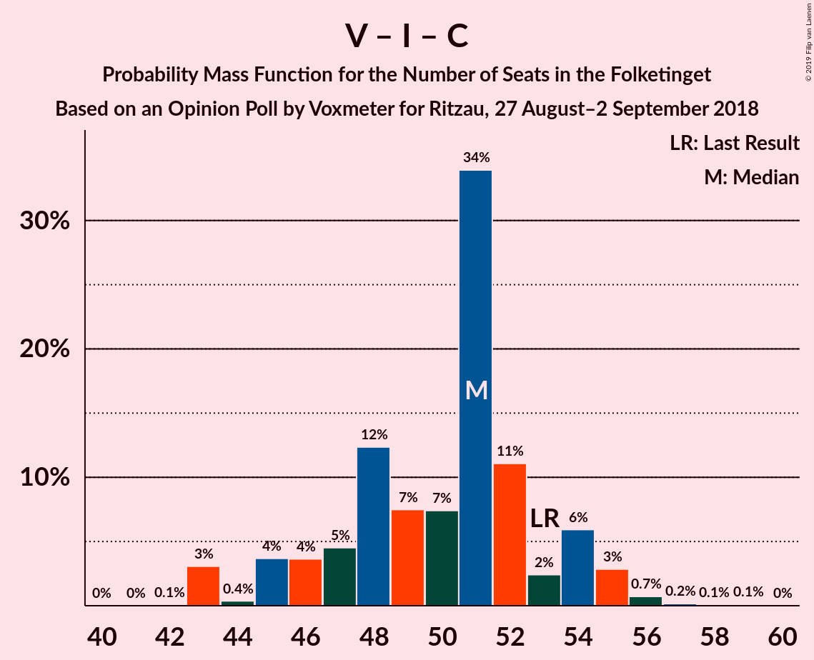

| Number of Seats | Probability | Accumulated | Special Marks |
|:---------------:|:-----------:|:-----------:|:-------------:|
| 42 | 0.2% | 100% |  |
| 43 | 1.1% | 99.8% |  |
| 44 | 0.7% | 98.7% |  |
| 45 | 0.2% | 98% |  |
| 46 | 2% | 98% |  |
| 47 | 27% | 96% |  |
| 48 | 9% | 69% | Median |
| 49 | 15% | 60% |  |
| 50 | 21% | 45% |  |
| 51 | 1.5% | 24% |  |
| 52 | 3% | 22% |  |
| 53 | 4% | 19% | Last Result |
| 54 | 14% | 15% |  |
| 55 | 0.2% | 1.2% |  |
| 56 | 0% | 1.0% |  |
| 57 | 0.1% | 0.9% |  |
| 58 | 0.7% | 0.8% |  |
| 59 | 0.1% | 0.1% |  |
| 60 | 0% | 0% |  |

### Venstre – Det Konservative Folkeparti

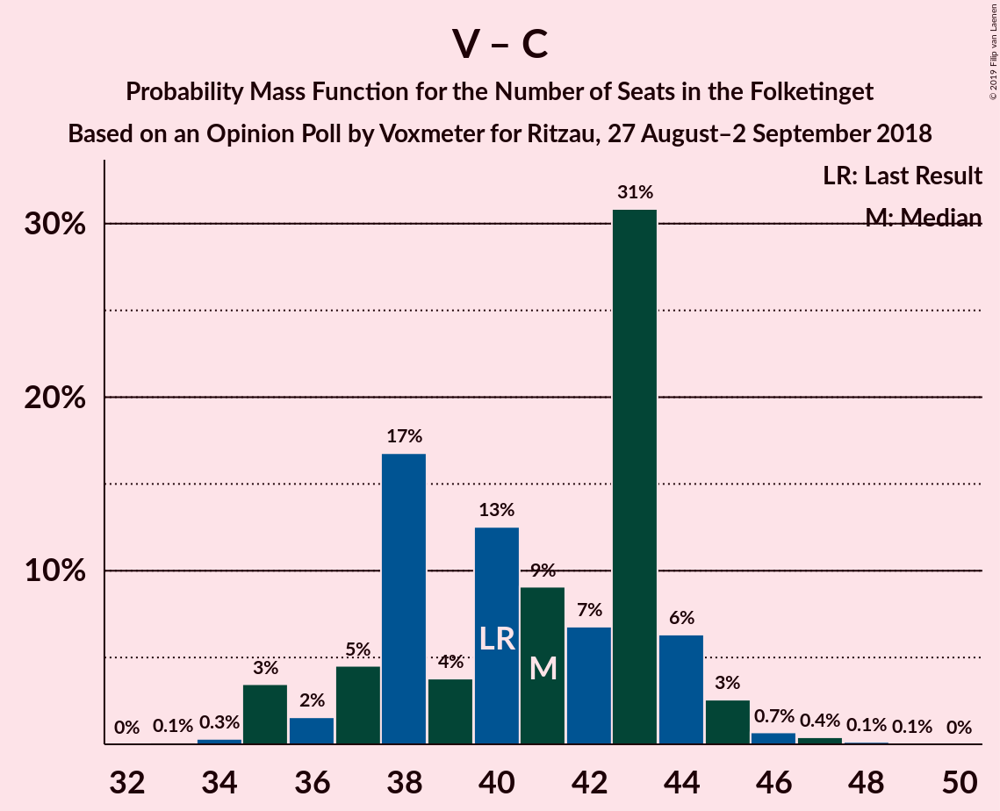

| Number of Seats | Probability | Accumulated | Special Marks |
|:---------------:|:-----------:|:-----------:|:-------------:|
| 33 | 0.4% | 100% |  |
| 34 | 0.2% | 99.6% |  |
| 35 | 1.4% | 99.4% |  |
| 36 | 1.2% | 98% |  |
| 37 | 3% | 97% |  |
| 38 | 46% | 94% |  |
| 39 | 3% | 48% | Median |
| 40 | 0.8% | 45% | Last Result |
| 41 | 22% | 44% |  |
| 42 | 4% | 23% |  |
| 43 | 3% | 19% |  |
| 44 | 2% | 16% |  |
| 45 | 7% | 15% |  |
| 46 | 7% | 8% |  |
| 47 | 0.7% | 1.0% |  |
| 48 | 0.2% | 0.2% |  |
| 49 | 0% | 0.1% |  |
| 50 | 0% | 0% |  |

### Venstre

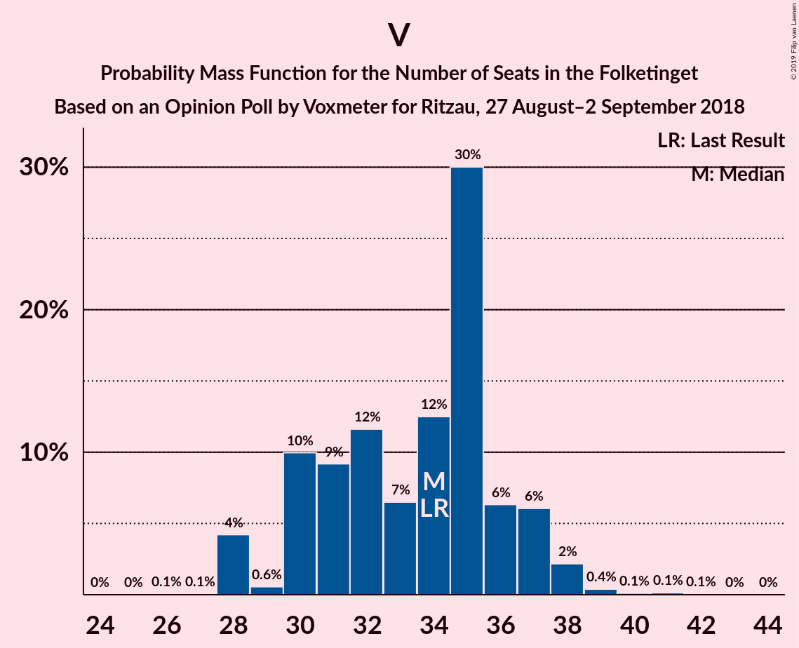

| Number of Seats | Probability | Accumulated | Special Marks |
|:---------------:|:-----------:|:-----------:|:-------------:|
| 27 | 0.4% | 100% |  |
| 28 | 1.0% | 99.5% |  |
| 29 | 3% | 98.6% |  |
| 30 | 2% | 96% |  |
| 31 | 39% | 94% |  |
| 32 | 10% | 55% | Median |
| 33 | 4% | 45% |  |
| 34 | 21% | 41% | Last Result |
| 35 | 5% | 20% |  |
| 36 | 0.3% | 15% |  |
| 37 | 12% | 15% |  |
| 38 | 1.5% | 3% |  |
| 39 | 0.9% | 1.4% |  |
| 40 | 0.4% | 0.5% |  |
| 41 | 0% | 0% |  |

## Technical Information

### Opinion Poll

+ **Polling firm:** Voxmeter
+ **Commissioner(s):** Ritzau
+ **Fieldwork period:** 27 August–2 September 2018

### Calculations

+ **Sample size:** 1037
+ **Simulations done:** 131,072
+ **Error estimate:** 1.98%

