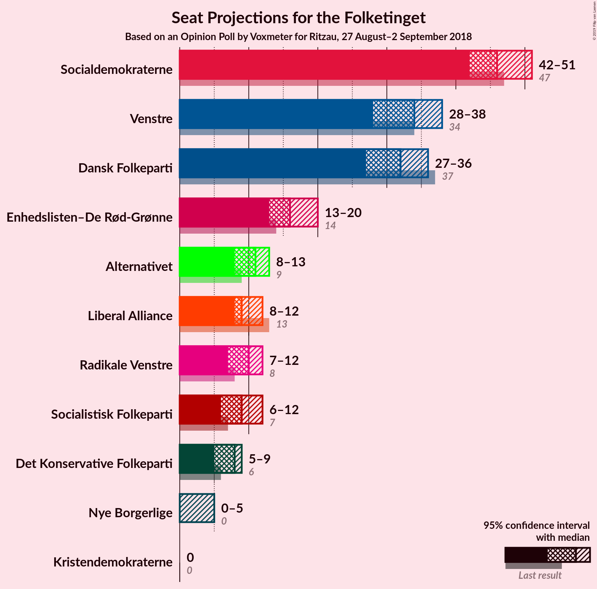
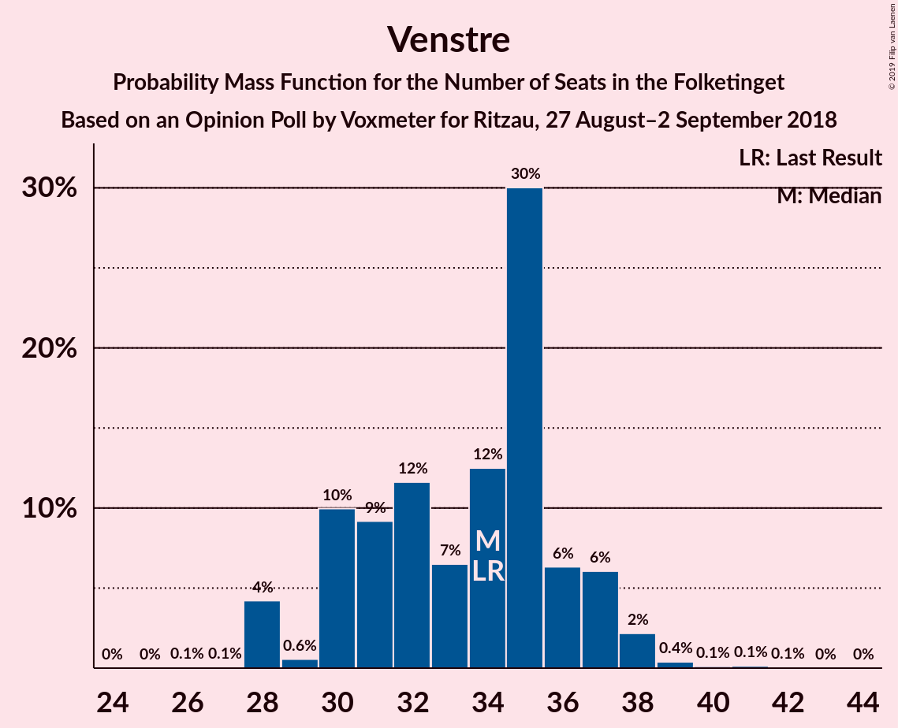
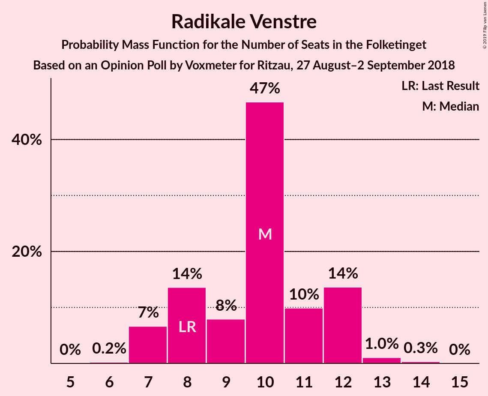
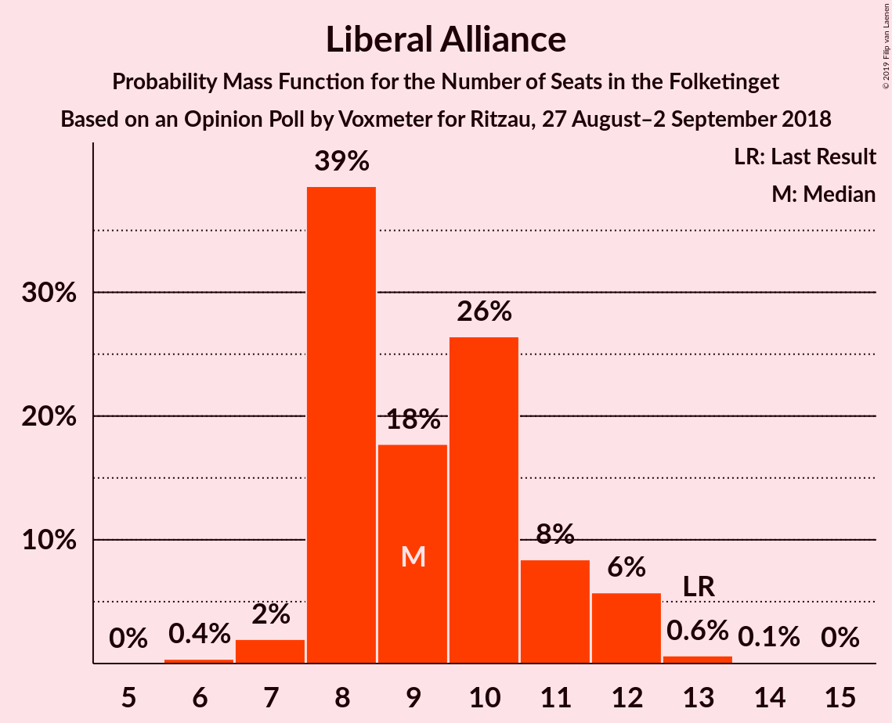
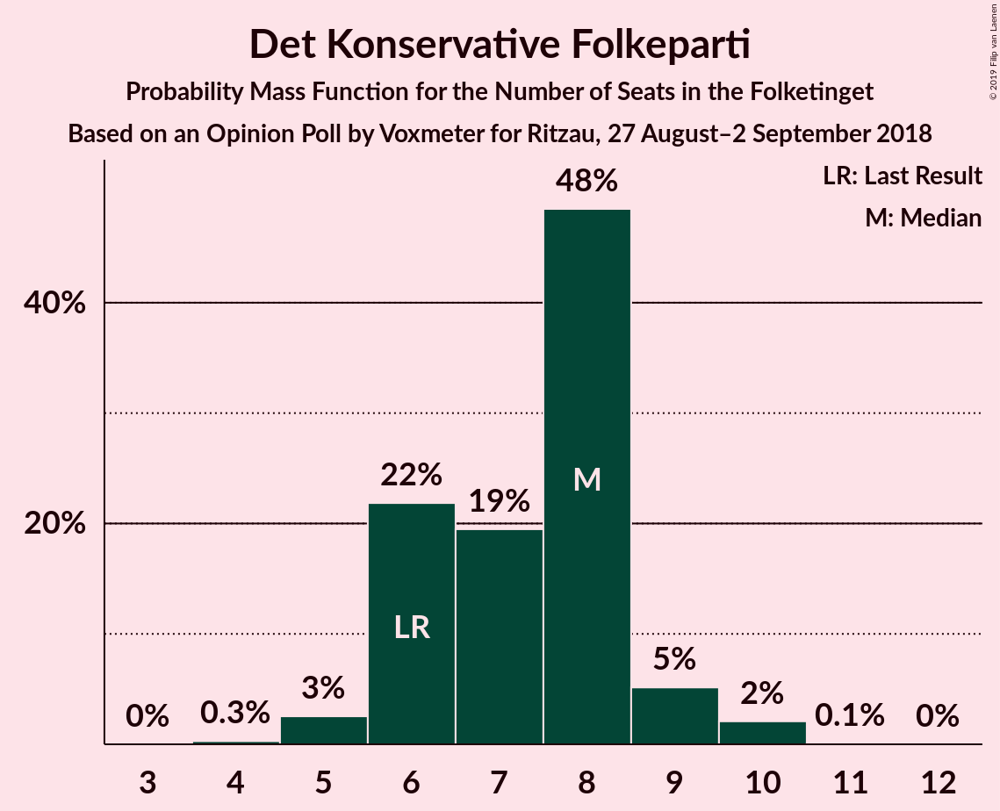

# Opinion Poll by Voxmeter for Ritzau, 27 August–2 September 2018

<a href="#voting-intentions">Voting Intentions</a> | <a href="#seats">Seats</a> | <a href="#coalitions">Coalitions</a> | <a href="#technical-information">Technical Information</a>

## Voting Intentions

### Confidence Intervals

| Party | Last Result | Poll Result | 80% Confidence Interval | 90% Confidence Interval | 95% Confidence Interval | 99% Confidence Interval |
|:-----:|:-----------:|:-----------:|:-----------------------:|:-----------------------:|:-----------------------:|:-----------------------:|
| Socialdemokraterne | 26.3% | 26.2% | 24.5–28.0% |24.1–28.5% |23.6–29.0% |22.8–29.9% |
| Venstre | 19.5% | 18.7% | 17.2–20.3% |16.8–20.8% |16.4–21.2% |15.8–22.0% |
| Dansk Folkeparti | 21.1% | 17.7% | 16.3–19.3% |15.9–19.8% |15.5–20.2% |14.9–21.0% |
| Enhedslisten–De Rød-Grønne | 7.8% | 9.1% | 8.0–10.3% |7.7–10.7% |7.5–11.0% |7.0–11.6% |
| Alternativet | 4.8% | 5.8% | 5.0–6.8% |4.7–7.1% |4.5–7.4% |4.1–7.9% |
| Radikale Venstre | 4.6% | 5.4% | 4.6–6.4% |4.4–6.7% |4.2–7.0% |3.8–7.5% |
| Liberal Alliance | 7.5% | 5.2% | 4.4–6.2% |4.2–6.5% |4.0–6.7% |3.7–7.3% |
| Socialistisk Folkeparti | 4.2% | 5.0% | 4.2–6.0% |4.0–6.3% |3.8–6.5% |3.5–7.0% |
| Det Konservative Folkeparti | 3.4% | 3.9% | 3.2–4.7% |3.0–5.0% |2.8–5.2% |2.5–5.7% |
| Nye Borgerlige | 0.0% | 1.7% | 1.3–2.4% |1.2–2.6% |1.1–2.7% |0.9–3.1% |
| Kristendemokraterne | 0.8% | 0.9% | 0.6–1.4% |0.5–1.5% |0.5–1.6% |0.4–1.9% |

*Note:* The poll result column reflects the actual value used in the calculations. Published results may vary slightly, and in addition be rounded to fewer digits.

## Seats

### Confidence Intervals

| Party | Last Result | Median | 80% Confidence Interval | 90% Confidence Interval | 95% Confidence Interval | 99% Confidence Interval |
|:-----:|:-----------:|:------:|:-----------------------:|:-----------------------:|:-----------------------:|:-----------------------:|
| <a href="#socialdemokraterne">Socialdemokraterne</a> | 47 | 46 | 46 |46 |41–46 |41–46 |
| <a href="#venstre">Venstre</a> | 34 | 37 | 37 |37 |36–37 |32–37 |
| <a href="#dansk-folkeparti">Dansk Folkeparti</a> | 37 | 29 | 29 |29 |29–30 |29–35 |
| <a href="#enhedslisten–de-rød-grønne">Enhedslisten–De Rød-Grønne</a> | 14 | 20 | 20 |20 |17–20 |16–20 |
| <a href="#alternativet">Alternativet</a> | 9 | 8 | 8 |8 |8–11 |8–11 |
| <a href="#radikale-venstre">Radikale Venstre</a> | 8 | 10 | 10 |10 |10–11 |9–12 |
| <a href="#liberal-alliance">Liberal Alliance</a> | 13 | 8 | 8 |8 |8–10 |8–11 |
| <a href="#socialistisk-folkeparti">Socialistisk Folkeparti</a> | 7 | 6 | 6 |6 |6–7 |6–10 |
| <a href="#det-konservative-folkeparti">Det Konservative Folkeparti</a> | 6 | 7 | 7 |7 |6–7 |6–9 |
| <a href="#nye-borgerlige">Nye Borgerlige</a> | 0 | 4 | 4 |4 |4 |0–5 |
| <a href="#kristendemokraterne">Kristendemokraterne</a> | 0 | 0 | 0 |0 |0 |0 |

### Socialdemokraterne

*For a full overview of the results for this party, see the [Socialdemokraterne](party-socialdemokraterne.html) page.*

| Number of Seats | Probability | Accumulated | Special Marks |
|:---------------:|:-----------:|:-----------:|:-------------:|
| 40 | 0.2% | 100% |  |
| 41 | 2% | 99.8% |  |
| 42 | 0.3% | 97% |  |
| 43 | 0% | 97% |  |
| 44 | 0.1% | 97% |  |
| 45 | 0% | 97% |  |
| 46 | 97% | 97% | Median |
| 47 | 0.1% | 0.3% | Last Result |
| 48 | 0% | 0.2% |  |
| 49 | 0.2% | 0.2% |  |
| 50 | 0% | 0% |  |

### Venstre

*For a full overview of the results for this party, see the [Venstre](party-venstre.html) page.*

| Number of Seats | Probability | Accumulated | Special Marks |
|:---------------:|:-----------:|:-----------:|:-------------:|
| 28 | 0.1% | 100% |  |
| 29 | 0% | 99.9% |  |
| 30 | 0.1% | 99.9% |  |
| 31 | 0.2% | 99.8% |  |
| 32 | 0.7% | 99.6% |  |
| 33 | 0% | 98.9% |  |
| 34 | 0.4% | 98.9% | Last Result |
| 35 | 0% | 98.5% |  |
| 36 | 2% | 98.5% |  |
| 37 | 96% | 97% | Median |
| 38 | 0% | 0.3% |  |
| 39 | 0% | 0.3% |  |
| 40 | 0.3% | 0.3% |  |
| 41 | 0% | 0% |  |

### Dansk Folkeparti

*For a full overview of the results for this party, see the [Dansk Folkeparti](party-danskfolkeparti.html) page.*

| Number of Seats | Probability | Accumulated | Special Marks |
|:---------------:|:-----------:|:-----------:|:-------------:|
| 28 | 0.3% | 100% |  |
| 29 | 96% | 99.7% | Median |
| 30 | 2% | 3% |  |
| 31 | 0.3% | 1.4% |  |
| 32 | 0% | 1.1% |  |
| 33 | 0.3% | 1.1% |  |
| 34 | 0% | 0.8% |  |
| 35 | 0.4% | 0.8% |  |
| 36 | 0.1% | 0.4% |  |
| 37 | 0.3% | 0.3% | Last Result |
| 38 | 0% | 0% |  |

### Enhedslisten–De Rød-Grønne

*For a full overview of the results for this party, see the [Enhedslisten–De Rød-Grønne](party-enhedslisten–derød-grønne.html) page.*

| Number of Seats | Probability | Accumulated | Special Marks |
|:---------------:|:-----------:|:-----------:|:-------------:|
| 13 | 0.1% | 100% |  |
| 14 | 0.2% | 99.9% | Last Result |
| 15 | 0.1% | 99.7% |  |
| 16 | 0.6% | 99.6% |  |
| 17 | 2% | 99.0% |  |
| 18 | 0% | 97% |  |
| 19 | 0% | 97% |  |
| 20 | 96% | 97% | Median |
| 21 | 0.3% | 0.3% |  |
| 22 | 0% | 0% |  |

### Alternativet

*For a full overview of the results for this party, see the [Alternativet](party-alternativet.html) page.*

| Number of Seats | Probability | Accumulated | Special Marks |
|:---------------:|:-----------:|:-----------:|:-------------:|
| 6 | 0.1% | 100% |  |
| 7 | 0% | 99.9% |  |
| 8 | 97% | 99.9% | Median |
| 9 | 0.1% | 3% | Last Result |
| 10 | 0.5% | 3% |  |
| 11 | 2% | 3% |  |
| 12 | 0.1% | 0.1% |  |
| 13 | 0% | 0% |  |

### Radikale Venstre

*For a full overview of the results for this party, see the [Radikale Venstre](party-radikalevenstre.html) page.*

| Number of Seats | Probability | Accumulated | Special Marks |
|:---------------:|:-----------:|:-----------:|:-------------:|
| 6 | 0.1% | 100% |  |
| 7 | 0.1% | 99.9% |  |
| 8 | 0% | 99.8% | Last Result |
| 9 | 0.4% | 99.8% |  |
| 10 | 96% | 99.4% | Median |
| 11 | 2% | 3% |  |
| 12 | 0.1% | 0.6% |  |
| 13 | 0.5% | 0.5% |  |
| 14 | 0% | 0% |  |

### Liberal Alliance

*For a full overview of the results for this party, see the [Liberal Alliance](party-liberalalliance.html) page.*

| Number of Seats | Probability | Accumulated | Special Marks |
|:---------------:|:-----------:|:-----------:|:-------------:|
| 7 | 0.3% | 100% |  |
| 8 | 96% | 99.7% | Median |
| 9 | 0.4% | 3% |  |
| 10 | 0.3% | 3% |  |
| 11 | 2% | 2% |  |
| 12 | 0% | 0% |  |
| 13 | 0% | 0% | Last Result |

### Socialistisk Folkeparti

*For a full overview of the results for this party, see the [Socialistisk Folkeparti](party-socialistiskfolkeparti.html) page.*

| Number of Seats | Probability | Accumulated | Special Marks |
|:---------------:|:-----------:|:-----------:|:-------------:|
| 6 | 96% | 100% | Median |
| 7 | 2% | 4% | Last Result |
| 8 | 0.4% | 2% |  |
| 9 | 0.7% | 1.2% |  |
| 10 | 0.1% | 0.6% |  |
| 11 | 0.3% | 0.5% |  |
| 12 | 0% | 0.1% |  |
| 13 | 0% | 0.1% |  |
| 14 | 0.1% | 0.1% |  |
| 15 | 0% | 0% |  |

### Det Konservative Folkeparti

*For a full overview of the results for this party, see the [Det Konservative Folkeparti](party-detkonservativefolkeparti.html) page.*

| Number of Seats | Probability | Accumulated | Special Marks |
|:---------------:|:-----------:|:-----------:|:-------------:|
| 4 | 0.1% | 100% |  |
| 5 | 0% | 99.9% |  |
| 6 | 3% | 99.9% | Last Result |
| 7 | 96% | 97% | Median |
| 8 | 0.1% | 1.0% |  |
| 9 | 0.6% | 0.9% |  |
| 10 | 0.2% | 0.3% |  |
| 11 | 0.1% | 0.1% |  |
| 12 | 0% | 0% |  |

### Nye Borgerlige

*For a full overview of the results for this party, see the [Nye Borgerlige](party-nyeborgerlige.html) page.*

| Number of Seats | Probability | Accumulated | Special Marks |
|:---------------:|:-----------:|:-----------:|:-------------:|
| 0 | 2% | 100% | Last Result |
| 1 | 0% | 98% |  |
| 2 | 0% | 98% |  |
| 3 | 0% | 98% |  |
| 4 | 96% | 98% | Median |
| 5 | 2% | 2% |  |
| 6 | 0% | 0% |  |

### Kristendemokraterne

*For a full overview of the results for this party, see the [Kristendemokraterne](party-kristendemokraterne.html) page.*

| Number of Seats | Probability | Accumulated | Special Marks |
|:---------------:|:-----------:|:-----------:|:-------------:|
| 0 | 99.6% | 100% | Last Result, Median |
| 1 | 0% | 0.4% |  |
| 2 | 0% | 0.4% |  |
| 3 | 0% | 0.4% |  |
| 4 | 0.4% | 0.4% |  |
| 5 | 0% | 0% |  |

## Coalitions

### Confidence Intervals

| Coalition | Last Result | Median | Majority? | 80% Confidence Interval | 90% Confidence Interval | 95% Confidence Interval | 99% Confidence Interval |
|:---------:|:-----------:|:------:|:---------:|:-----------------------:|:-----------------------:|:-----------------------:|:-----------------------:|
| Socialdemokraterne – Enhedslisten–De Rød-Grønne – Alternativet – Radikale Venstre – Socialistisk Folkeparti | 85 | 90 | 97% | 90 | 90 | 87–90 | 87–93 |
| Venstre – Dansk Folkeparti – Liberal Alliance – Det Konservative Folkeparti – Nye Borgerlige – Kristendemokraterne | 90 | 85 | 0.2% | 85 | 85 | 85 | 82–88 |
| Venstre – Dansk Folkeparti – Liberal Alliance – Det Konservative Folkeparti – Nye Borgerlige | 90 | 85 | 0.2% | 85 | 85 | 85 | 82–88 |
| Venstre – Dansk Folkeparti – Liberal Alliance – Det Konservative Folkeparti – Kristendemokraterne | 90 | 81 | 0.2% | 81 | 81 | 81–83 | 81–85 |
| Venstre – Dansk Folkeparti – Liberal Alliance – Det Konservative Folkeparti | 90 | 81 | 0.2% | 81 | 81 | 81–83 | 81–85 |
| Socialdemokraterne – Enhedslisten–De Rød-Grønne – Radikale Venstre – Socialistisk Folkeparti | 76 | 82 | 0% | 82 | 82 | 80–82 | 76–82 |

### Socialdemokraterne – Enhedslisten–De Rød-Grønne – Alternativet – Radikale Venstre – Socialistisk Folkeparti

| Number of Seats | Probability | Accumulated | Special Marks |
|:---------------:|:-----------:|:-----------:|:-------------:|
| 81 | 0.2% | 100% |  |
| 82 | 0% | 99.8% |  |
| 83 | 0% | 99.8% |  |
| 84 | 0% | 99.8% |  |
| 85 | 0% | 99.8% | Last Result |
| 86 | 0.3% | 99.8% |  |
| 87 | 2% | 99.5% |  |
| 88 | 0% | 97% |  |
| 89 | 0% | 97% |  |
| 90 | 97% | 97% | Median, Majority |
| 91 | 0% | 0.6% |  |
| 92 | 0% | 0.6% |  |
| 93 | 0.4% | 0.6% |  |
| 94 | 0% | 0.2% |  |
| 95 | 0% | 0.2% |  |
| 96 | 0% | 0.2% |  |
| 97 | 0% | 0.1% |  |
| 98 | 0% | 0.1% |  |
| 99 | 0% | 0.1% |  |
| 100 | 0% | 0.1% |  |
| 101 | 0.1% | 0.1% |  |
| 102 | 0% | 0% |  |

### Venstre – Dansk Folkeparti – Liberal Alliance – Det Konservative Folkeparti – Nye Borgerlige – Kristendemokraterne

| Number of Seats | Probability | Accumulated | Special Marks |
|:---------------:|:-----------:|:-----------:|:-------------:|
| 74 | 0.1% | 100% |  |
| 75 | 0% | 99.9% |  |
| 76 | 0% | 99.9% |  |
| 77 | 0% | 99.9% |  |
| 78 | 0% | 99.9% |  |
| 79 | 0% | 99.9% |  |
| 80 | 0% | 99.8% |  |
| 81 | 0% | 99.8% |  |
| 82 | 0.4% | 99.8% |  |
| 83 | 0% | 99.4% |  |
| 84 | 0.1% | 99.4% |  |
| 85 | 97% | 99.4% | Median |
| 86 | 0% | 2% |  |
| 87 | 0% | 2% |  |
| 88 | 2% | 2% |  |
| 89 | 0.3% | 0.5% |  |
| 90 | 0% | 0.2% | Last Result, Majority |
| 91 | 0% | 0.2% |  |
| 92 | 0% | 0.2% |  |
| 93 | 0% | 0.2% |  |
| 94 | 0.2% | 0.2% |  |
| 95 | 0% | 0% |  |

### Venstre – Dansk Folkeparti – Liberal Alliance – Det Konservative Folkeparti – Nye Borgerlige

| Number of Seats | Probability | Accumulated | Special Marks |
|:---------------:|:-----------:|:-----------:|:-------------:|
| 74 | 0.1% | 100% |  |
| 75 | 0% | 99.9% |  |
| 76 | 0% | 99.9% |  |
| 77 | 0% | 99.9% |  |
| 78 | 0% | 99.9% |  |
| 79 | 0% | 99.9% |  |
| 80 | 0% | 99.8% |  |
| 81 | 0.3% | 99.8% |  |
| 82 | 0.4% | 99.5% |  |
| 83 | 0% | 99.1% |  |
| 84 | 0.1% | 99.1% |  |
| 85 | 97% | 99.1% | Median |
| 86 | 0% | 2% |  |
| 87 | 0% | 2% |  |
| 88 | 2% | 2% |  |
| 89 | 0.3% | 0.4% |  |
| 90 | 0% | 0.2% | Last Result, Majority |
| 91 | 0% | 0.2% |  |
| 92 | 0% | 0.2% |  |
| 93 | 0% | 0.2% |  |
| 94 | 0.2% | 0.2% |  |
| 95 | 0% | 0% |  |

### Venstre – Dansk Folkeparti – Liberal Alliance – Det Konservative Folkeparti – Kristendemokraterne

| Number of Seats | Probability | Accumulated | Special Marks |
|:---------------:|:-----------:|:-----------:|:-------------:|
| 74 | 0.1% | 100% |  |
| 75 | 0% | 99.9% |  |
| 76 | 0% | 99.9% |  |
| 77 | 0% | 99.9% |  |
| 78 | 0% | 99.9% |  |
| 79 | 0% | 99.9% |  |
| 80 | 0.1% | 99.8% |  |
| 81 | 96% | 99.8% | Median |
| 82 | 0.4% | 4% |  |
| 83 | 2% | 3% |  |
| 84 | 0.1% | 1.2% |  |
| 85 | 0.7% | 1.1% |  |
| 86 | 0% | 0.4% |  |
| 87 | 0% | 0.4% |  |
| 88 | 0% | 0.4% |  |
| 89 | 0.3% | 0.4% |  |
| 90 | 0.2% | 0.2% | Last Result, Majority |
| 91 | 0% | 0% |  |

### Venstre – Dansk Folkeparti – Liberal Alliance – Det Konservative Folkeparti

| Number of Seats | Probability | Accumulated | Special Marks |
|:---------------:|:-----------:|:-----------:|:-------------:|
| 74 | 0.1% | 100% |  |
| 75 | 0% | 99.9% |  |
| 76 | 0% | 99.9% |  |
| 77 | 0% | 99.9% |  |
| 78 | 0% | 99.9% |  |
| 79 | 0% | 99.9% |  |
| 80 | 0.1% | 99.8% |  |
| 81 | 97% | 99.8% | Median |
| 82 | 0.4% | 3% |  |
| 83 | 2% | 3% |  |
| 84 | 0.1% | 0.8% |  |
| 85 | 0.3% | 0.7% |  |
| 86 | 0% | 0.4% |  |
| 87 | 0% | 0.4% |  |
| 88 | 0% | 0.4% |  |
| 89 | 0.3% | 0.4% |  |
| 90 | 0.2% | 0.2% | Last Result, Majority |
| 91 | 0% | 0% |  |

### Socialdemokraterne – Enhedslisten–De Rød-Grønne – Radikale Venstre – Socialistisk Folkeparti

| Number of Seats | Probability | Accumulated | Special Marks |
|:---------------:|:-----------:|:-----------:|:-------------:|
| 73 | 0.2% | 100% |  |
| 74 | 0% | 99.8% |  |
| 75 | 0% | 99.8% |  |
| 76 | 2% | 99.8% | Last Result |
| 77 | 0% | 98% |  |
| 78 | 0% | 98% |  |
| 79 | 0.1% | 98% |  |
| 80 | 0.4% | 98% |  |
| 81 | 0.1% | 97% |  |
| 82 | 97% | 97% | Median |
| 83 | 0% | 0.2% |  |
| 84 | 0% | 0.2% |  |
| 85 | 0% | 0.1% |  |
| 86 | 0% | 0.1% |  |
| 87 | 0% | 0.1% |  |
| 88 | 0% | 0.1% |  |
| 89 | 0.1% | 0.1% |  |
| 90 | 0% | 0% | Majority |

## Technical Information

### Opinion Poll

+ **Polling firm:** Voxmeter
+ **Commissioner(s):** Ritzau
+ **Fieldwork period:** 27 August–2 September 2018

### Calculations

+ **Sample size:** 1037
+ **Simulations done:** 1,024
+ **Error estimate:** 3.28%

