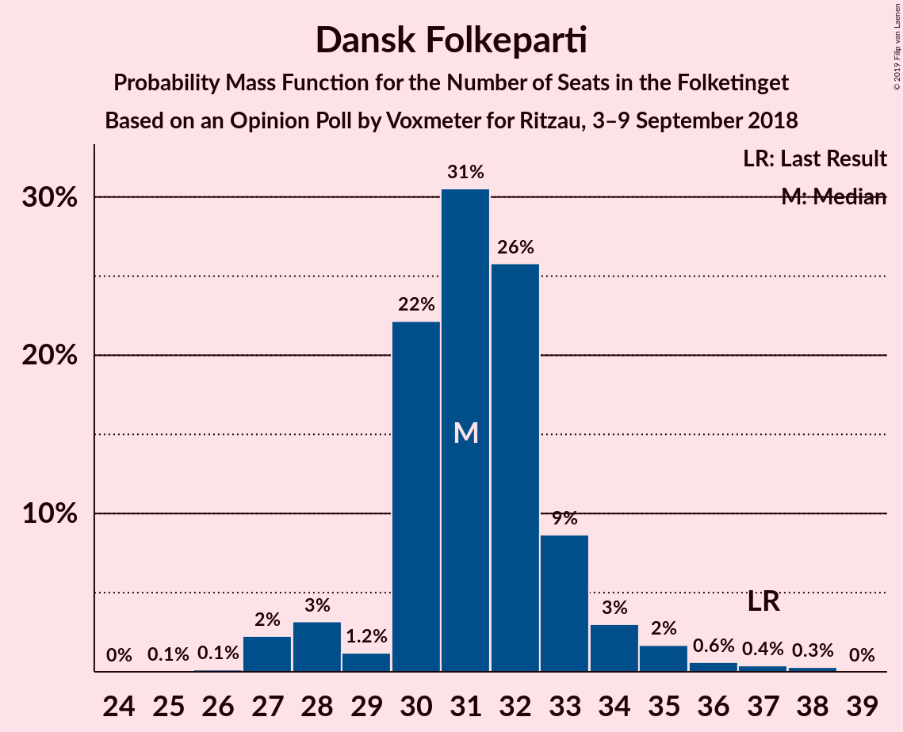
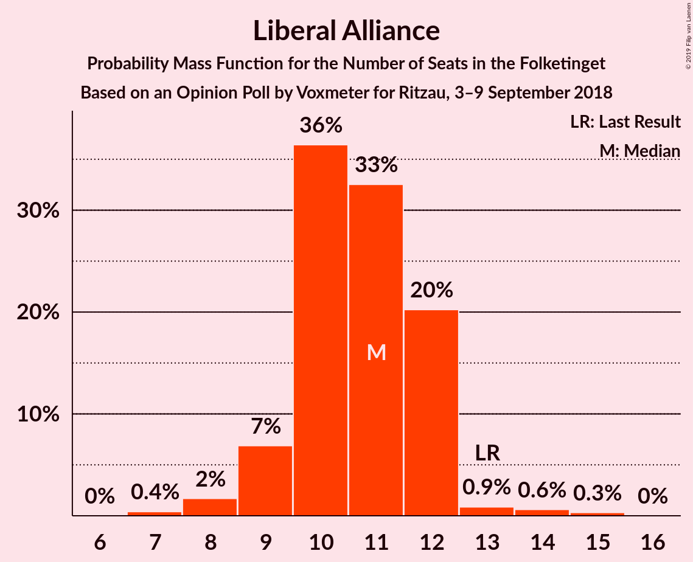
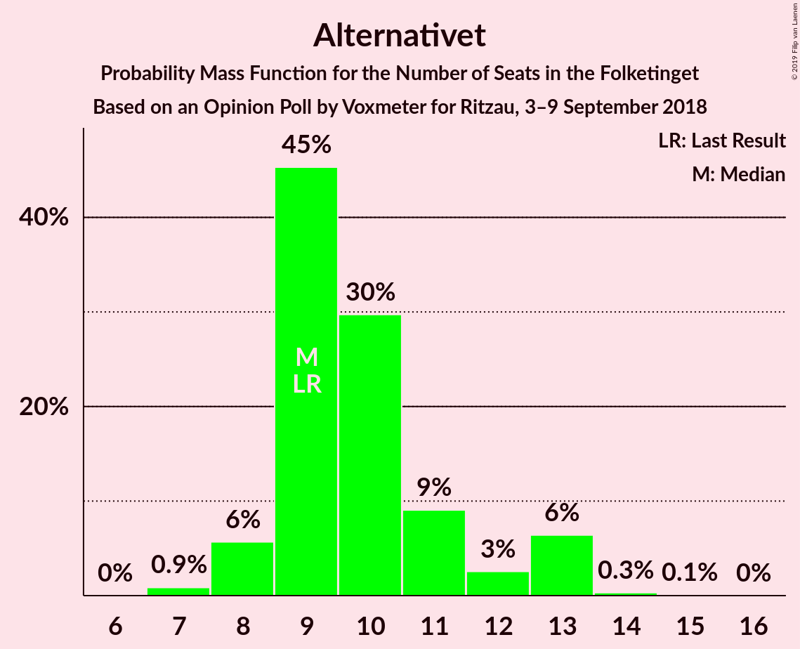
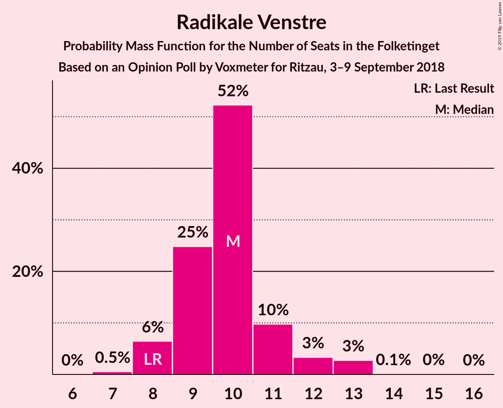
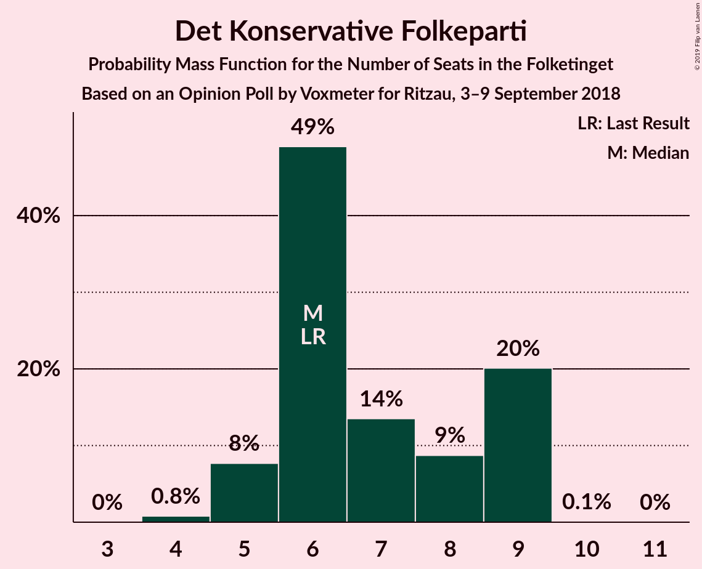
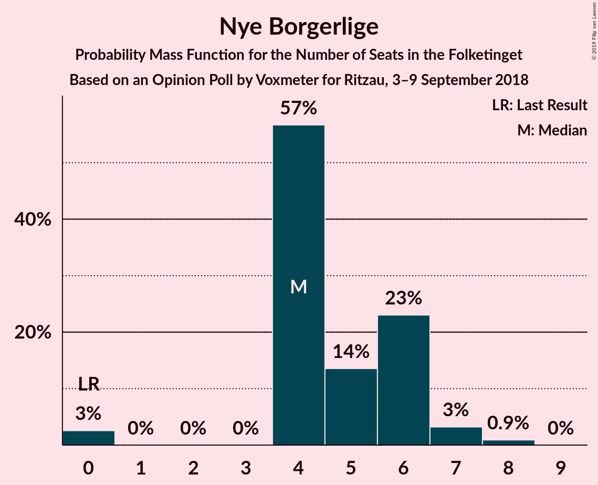
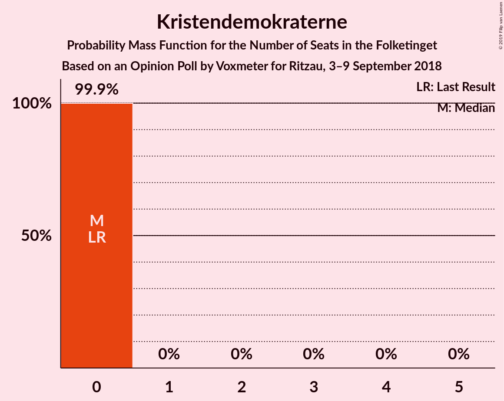
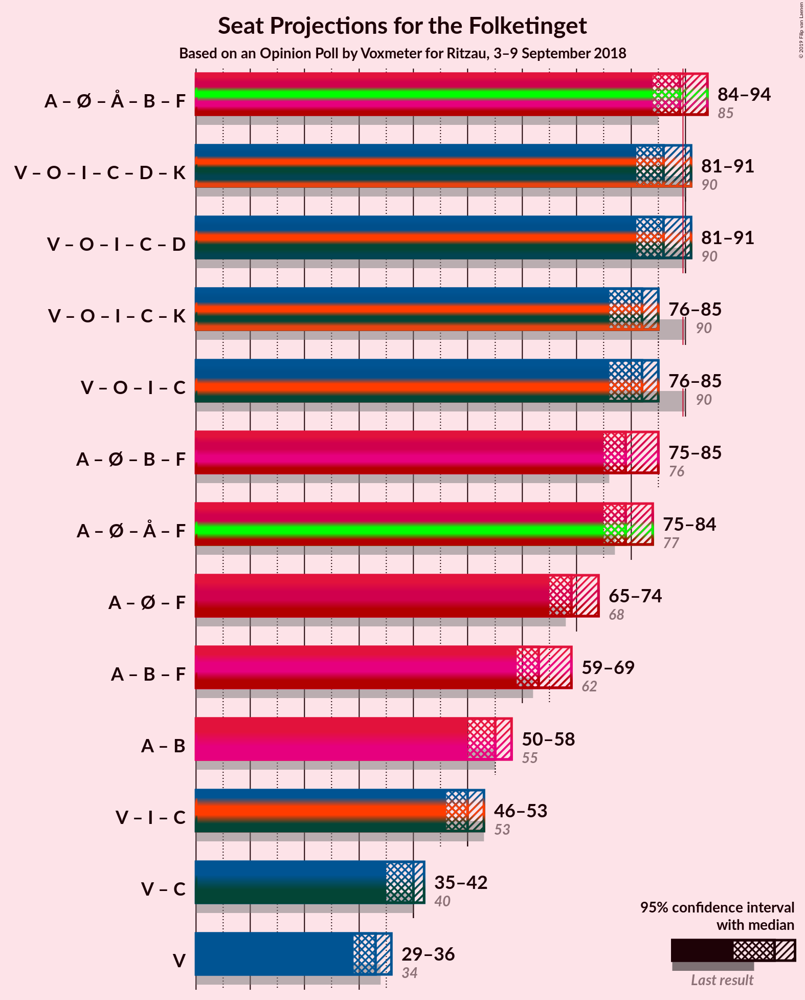

# Opinion Poll by Voxmeter for Ritzau, 3–9 September 2018

<a href="#voting-intentions">Voting Intentions</a> | <a href="#seats">Seats</a> | <a href="#coalitions">Coalitions</a> | <a href="#technical-information">Technical Information</a>

## Voting Intentions

### Confidence Intervals

| Party | Last Result | Poll Result | 80% Confidence Interval | 90% Confidence Interval | 95% Confidence Interval | 99% Confidence Interval |
|:-----:|:-----------:|:-----------:|:-----------------------:|:-----------------------:|:-----------------------:|:-----------------------:|
| Socialdemokraterne | 26.3% | 25.2% | 23.5–27.0% |23.1–27.5% |22.7–28.0% |21.9–28.8% |
| Venstre | 19.5% | 18.2% | 16.8–19.8% |16.3–20.3% |16.0–20.7% |15.3–21.5% |
| Dansk Folkeparti | 21.1% | 17.9% | 16.5–19.5% |16.1–20.0% |15.7–20.4% |15.0–21.2% |
| Enhedslisten–De Rød-Grønne | 7.8% | 8.9% | 7.9–10.2% |7.6–10.5% |7.3–10.8% |6.9–11.4% |
| Liberal Alliance | 7.5% | 5.9% | 5.1–7.0% |4.9–7.3% |4.7–7.6% |4.3–8.1% |
| Alternativet | 4.8% | 5.7% | 4.8–6.7% |4.6–7.0% |4.4–7.2% |4.0–7.8% |
| Radikale Venstre | 4.6% | 5.5% | 4.6–6.5% |4.4–6.8% |4.2–7.0% |3.9–7.5% |
| Socialistisk Folkeparti | 4.2% | 5.3% | 4.5–6.3% |4.3–6.6% |4.1–6.8% |3.7–7.3% |
| Det Konservative Folkeparti | 3.4% | 3.5% | 2.9–4.4% |2.7–4.6% |2.6–4.9% |2.3–5.3% |
| Nye Borgerlige | 0.0% | 2.8% | 2.2–3.6% |2.1–3.8% |1.9–4.0% |1.7–4.4% |
| Kristendemokraterne | 0.8% | 0.9% | 0.6–1.4% |0.5–1.5% |0.5–1.6% |0.4–1.9% |

*Note:* The poll result column reflects the actual value used in the calculations. Published results may vary slightly, and in addition be rounded to fewer digits.

## Seats

### Confidence Intervals

| Party | Last Result | Median | 80% Confidence Interval | 90% Confidence Interval | 95% Confidence Interval | 99% Confidence Interval |
|:-----:|:-----------:|:------:|:-----------------------:|:-----------------------:|:-----------------------:|:-----------------------:|
| <a href="#socialdemokraterne">Socialdemokraterne</a> | 47 | 40 | 40–43 |35–43 |35–45 |35–46 |
| <a href="#venstre">Venstre</a> | 34 | 30 | 30–33 |30–33 |30–33 |27–33 |
| <a href="#dansk-folkeparti">Dansk Folkeparti</a> | 37 | 30 | 30–36 |30–36 |30–36 |30–36 |
| <a href="#enhedslisten–de-rød-grønne">Enhedslisten–De Rød-Grønne</a> | 14 | 18 | 15–18 |15–18 |15–20 |14–20 |
| <a href="#liberal-alliance">Liberal Alliance</a> | 13 | 11 | 11 |11 |8–11 |8–12 |
| <a href="#alternativet">Alternativet</a> | 9 | 14 | 10–14 |10–14 |6–14 |6–15 |
| <a href="#radikale-venstre">Radikale Venstre</a> | 8 | 10 | 5–10 |5–10 |5–10 |5–10 |
| <a href="#socialistisk-folkeparti">Socialistisk Folkeparti</a> | 7 | 10 | 10 |10–13 |10–13 |8–13 |
| <a href="#det-konservative-folkeparti">Det Konservative Folkeparti</a> | 6 | 6 | 6 |6–7 |5–7 |5–9 |
| <a href="#nye-borgerlige">Nye Borgerlige</a> | 0 | 6 | 6 |6 |6 |6–7 |
| <a href="#kristendemokraterne">Kristendemokraterne</a> | 0 | 0 | 0 |0 |0 |0 |

### Socialdemokraterne

*For a full overview of the results for this party, see the [Socialdemokraterne](party-socialdemokraterne.html) page.*

| Number of Seats | Probability | Accumulated | Special Marks |
|:---------------:|:-----------:|:-----------:|:-------------:|
| 35 | 8% | 100% |  |
| 36 | 0% | 92% |  |
| 37 | 0% | 92% |  |
| 38 | 0% | 92% |  |
| 39 | 0% | 92% |  |
| 40 | 63% | 92% | Median |
| 41 | 0% | 29% |  |
| 42 | 0% | 29% |  |
| 43 | 26% | 29% |  |
| 44 | 0% | 3% |  |
| 45 | 3% | 3% |  |
| 46 | 0.5% | 0.8% |  |
| 47 | 0% | 0.2% | Last Result |
| 48 | 0.2% | 0.2% |  |
| 49 | 0% | 0% |  |

### Venstre

*For a full overview of the results for this party, see the [Venstre](party-venstre.html) page.*

| Number of Seats | Probability | Accumulated | Special Marks |
|:---------------:|:-----------:|:-----------:|:-------------:|
| 27 | 0.5% | 100% |  |
| 28 | 0% | 99.5% |  |
| 29 | 0.2% | 99.5% |  |
| 30 | 63% | 99.3% | Median |
| 31 | 0% | 36% |  |
| 32 | 3% | 36% |  |
| 33 | 33% | 33% |  |
| 34 | 0% | 0% | Last Result |

### Dansk Folkeparti

*For a full overview of the results for this party, see the [Dansk Folkeparti](party-danskfolkeparti.html) page.*

| Number of Seats | Probability | Accumulated | Special Marks |
|:---------------:|:-----------:|:-----------:|:-------------:|
| 30 | 64% | 100% | Median |
| 31 | 0% | 36% |  |
| 32 | 8% | 36% |  |
| 33 | 0.2% | 29% |  |
| 34 | 0% | 28% |  |
| 35 | 0% | 28% |  |
| 36 | 28% | 28% |  |
| 37 | 0% | 0% | Last Result |

### Enhedslisten–De Rød-Grønne

*For a full overview of the results for this party, see the [Enhedslisten–De Rød-Grønne](party-enhedslisten–derød-grønne.html) page.*

| Number of Seats | Probability | Accumulated | Special Marks |
|:---------------:|:-----------:|:-----------:|:-------------:|
| 14 | 0.7% | 100% | Last Result |
| 15 | 33% | 99.3% |  |
| 16 | 0% | 66% |  |
| 17 | 0% | 66% |  |
| 18 | 63% | 66% | Median |
| 19 | 0% | 3% |  |
| 20 | 3% | 3% |  |
| 21 | 0% | 0% |  |

### Liberal Alliance

*For a full overview of the results for this party, see the [Liberal Alliance](party-liberalalliance.html) page.*

| Number of Seats | Probability | Accumulated | Special Marks |
|:---------------:|:-----------:|:-----------:|:-------------:|
| 8 | 3% | 100% |  |
| 9 | 0% | 97% |  |
| 10 | 0% | 97% |  |
| 11 | 97% | 97% | Median |
| 12 | 0.5% | 0.5% |  |
| 13 | 0% | 0% | Last Result |

### Alternativet

*For a full overview of the results for this party, see the [Alternativet](party-alternativet.html) page.*

| Number of Seats | Probability | Accumulated | Special Marks |
|:---------------:|:-----------:|:-----------:|:-------------:|
| 6 | 3% | 100% |  |
| 7 | 0% | 97% |  |
| 8 | 0% | 97% |  |
| 9 | 0% | 97% | Last Result |
| 10 | 26% | 97% |  |
| 11 | 0% | 72% |  |
| 12 | 0% | 72% |  |
| 13 | 8% | 72% |  |
| 14 | 63% | 64% | Median |
| 15 | 0.5% | 0.7% |  |
| 16 | 0.2% | 0.2% |  |
| 17 | 0% | 0% |  |

### Radikale Venstre

*For a full overview of the results for this party, see the [Radikale Venstre](party-radikalevenstre.html) page.*

| Number of Seats | Probability | Accumulated | Special Marks |
|:---------------:|:-----------:|:-----------:|:-------------:|
| 5 | 26% | 100% |  |
| 6 | 0% | 74% |  |
| 7 | 3% | 74% |  |
| 8 | 0% | 71% | Last Result |
| 9 | 0.2% | 71% |  |
| 10 | 71% | 71% | Median |
| 11 | 0% | 0% |  |

### Socialistisk Folkeparti

*For a full overview of the results for this party, see the [Socialistisk Folkeparti](party-socialistiskfolkeparti.html) page.*

| Number of Seats | Probability | Accumulated | Special Marks |
|:---------------:|:-----------:|:-----------:|:-------------:|
| 7 | 0% | 100% | Last Result |
| 8 | 0.5% | 100% |  |
| 9 | 0% | 99.5% |  |
| 10 | 92% | 99.5% | Median |
| 11 | 0.2% | 8% |  |
| 12 | 0% | 8% |  |
| 13 | 8% | 8% |  |
| 14 | 0% | 0% |  |

### Det Konservative Folkeparti

*For a full overview of the results for this party, see the [Det Konservative Folkeparti](party-detkonservativefolkeparti.html) page.*

| Number of Seats | Probability | Accumulated | Special Marks |
|:---------------:|:-----------:|:-----------:|:-------------:|
| 4 | 0.2% | 100% |  |
| 5 | 3% | 99.8% |  |
| 6 | 89% | 97% | Last Result, Median |
| 7 | 8% | 8% |  |
| 8 | 0% | 0.5% |  |
| 9 | 0.5% | 0.5% |  |
| 10 | 0% | 0% |  |

### Nye Borgerlige

*For a full overview of the results for this party, see the [Nye Borgerlige](party-nyeborgerlige.html) page.*

| Number of Seats | Probability | Accumulated | Special Marks |
|:---------------:|:-----------:|:-----------:|:-------------:|
| 0 | 0.2% | 100% | Last Result |
| 1 | 0% | 99.8% |  |
| 2 | 0% | 99.8% |  |
| 3 | 0% | 99.8% |  |
| 4 | 0% | 99.8% |  |
| 5 | 0% | 99.8% |  |
| 6 | 99.2% | 99.8% | Median |
| 7 | 0.5% | 0.5% |  |
| 8 | 0% | 0% |  |

### Kristendemokraterne

*For a full overview of the results for this party, see the [Kristendemokraterne](party-kristendemokraterne.html) page.*

| Number of Seats | Probability | Accumulated | Special Marks |
|:---------------:|:-----------:|:-----------:|:-------------:|
| 0 | 100% | 100% | Last Result, Median |

## Coalitions

### Confidence Intervals

| Coalition | Last Result | Median | Majority? | 80% Confidence Interval | 90% Confidence Interval | 95% Confidence Interval | 99% Confidence Interval |
|:---------:|:-----------:|:------:|:---------:|:-----------------------:|:-----------------------:|:-----------------------:|:-----------------------:|
| Socialdemokraterne – Enhedslisten–De Rød-Grønne – Alternativet – Radikale Venstre – Socialistisk Folkeparti | 85 | 92 | 64% | 83–92 | 83–92 | 83–92 | 83–92 |
| Venstre – Dansk Folkeparti – Liberal Alliance – Det Konservative Folkeparti – Nye Borgerlige – Kristendemokraterne | 90 | 83 | 26% | 83–92 | 83–92 | 83–92 | 83–92 |
| Venstre – Dansk Folkeparti – Liberal Alliance – Det Konservative Folkeparti – Nye Borgerlige | 90 | 83 | 26% | 83–92 | 83–92 | 83–92 | 83–92 |
| Venstre – Dansk Folkeparti – Liberal Alliance – Det Konservative Folkeparti – Kristendemokraterne | 90 | 77 | 0% | 77–86 | 77–86 | 77–86 | 77–86 |
| Venstre – Dansk Folkeparti – Liberal Alliance – Det Konservative Folkeparti | 90 | 77 | 0% | 77–86 | 77–86 | 77–86 | 77–86 |
| Socialdemokraterne – Enhedslisten–De Rød-Grønne – Radikale Venstre – Socialistisk Folkeparti | 76 | 78 | 0% | 73–78 | 73–78 | 73–82 | 73–82 |

### Socialdemokraterne – Enhedslisten–De Rød-Grønne – Alternativet – Radikale Venstre – Socialistisk Folkeparti

| Number of Seats | Probability | Accumulated | Special Marks |
|:---------------:|:-----------:|:-----------:|:-------------:|
| 83 | 26% | 100% |  |
| 84 | 0% | 74% |  |
| 85 | 0% | 74% | Last Result |
| 86 | 8% | 74% |  |
| 87 | 0% | 67% |  |
| 88 | 3% | 67% |  |
| 89 | 0% | 64% |  |
| 90 | 0.5% | 64% | Majority |
| 91 | 0% | 64% |  |
| 92 | 63% | 64% | Median |
| 93 | 0% | 0.2% |  |
| 94 | 0% | 0.2% |  |
| 95 | 0% | 0.2% |  |
| 96 | 0% | 0.2% |  |
| 97 | 0% | 0.2% |  |
| 98 | 0.2% | 0.2% |  |
| 99 | 0% | 0% |  |

### Venstre – Dansk Folkeparti – Liberal Alliance – Det Konservative Folkeparti – Nye Borgerlige – Kristendemokraterne

| Number of Seats | Probability | Accumulated | Special Marks |
|:---------------:|:-----------:|:-----------:|:-------------:|
| 77 | 0.2% | 100% |  |
| 78 | 0% | 99.8% |  |
| 79 | 0% | 99.8% |  |
| 80 | 0% | 99.8% |  |
| 81 | 0% | 99.8% |  |
| 82 | 0% | 99.8% |  |
| 83 | 63% | 99.8% | Median |
| 84 | 0% | 36% |  |
| 85 | 0.5% | 36% |  |
| 86 | 0% | 36% |  |
| 87 | 3% | 36% |  |
| 88 | 0% | 33% |  |
| 89 | 8% | 33% |  |
| 90 | 0% | 26% | Last Result, Majority |
| 91 | 0% | 26% |  |
| 92 | 26% | 26% |  |
| 93 | 0% | 0% |  |

### Venstre – Dansk Folkeparti – Liberal Alliance – Det Konservative Folkeparti – Nye Borgerlige

| Number of Seats | Probability | Accumulated | Special Marks |
|:---------------:|:-----------:|:-----------:|:-------------:|
| 77 | 0.2% | 100% |  |
| 78 | 0% | 99.8% |  |
| 79 | 0% | 99.8% |  |
| 80 | 0% | 99.8% |  |
| 81 | 0% | 99.8% |  |
| 82 | 0% | 99.8% |  |
| 83 | 63% | 99.8% | Median |
| 84 | 0% | 36% |  |
| 85 | 0.5% | 36% |  |
| 86 | 0% | 36% |  |
| 87 | 3% | 36% |  |
| 88 | 0% | 33% |  |
| 89 | 8% | 33% |  |
| 90 | 0% | 26% | Last Result, Majority |
| 91 | 0% | 26% |  |
| 92 | 26% | 26% |  |
| 93 | 0% | 0% |  |

### Venstre – Dansk Folkeparti – Liberal Alliance – Det Konservative Folkeparti – Kristendemokraterne

| Number of Seats | Probability | Accumulated | Special Marks |
|:---------------:|:-----------:|:-----------:|:-------------:|
| 77 | 64% | 100% | Median |
| 78 | 0.5% | 36% |  |
| 79 | 0% | 36% |  |
| 80 | 0% | 36% |  |
| 81 | 3% | 36% |  |
| 82 | 0% | 33% |  |
| 83 | 8% | 33% |  |
| 84 | 0% | 26% |  |
| 85 | 0% | 26% |  |
| 86 | 26% | 26% |  |
| 87 | 0% | 0% |  |
| 88 | 0% | 0% |  |
| 89 | 0% | 0% |  |
| 90 | 0% | 0% | Last Result, Majority |

### Venstre – Dansk Folkeparti – Liberal Alliance – Det Konservative Folkeparti

| Number of Seats | Probability | Accumulated | Special Marks |
|:---------------:|:-----------:|:-----------:|:-------------:|
| 77 | 64% | 100% | Median |
| 78 | 0.5% | 36% |  |
| 79 | 0% | 36% |  |
| 80 | 0% | 36% |  |
| 81 | 3% | 36% |  |
| 82 | 0% | 33% |  |
| 83 | 8% | 33% |  |
| 84 | 0% | 26% |  |
| 85 | 0% | 26% |  |
| 86 | 26% | 26% |  |
| 87 | 0% | 0% |  |
| 88 | 0% | 0% |  |
| 89 | 0% | 0% |  |
| 90 | 0% | 0% | Last Result, Majority |

### Socialdemokraterne – Enhedslisten–De Rød-Grønne – Radikale Venstre – Socialistisk Folkeparti

| Number of Seats | Probability | Accumulated | Special Marks |
|:---------------:|:-----------:|:-----------:|:-------------:|
| 73 | 33% | 100% |  |
| 74 | 0% | 67% |  |
| 75 | 0.5% | 67% |  |
| 76 | 0% | 66% | Last Result |
| 77 | 0% | 66% |  |
| 78 | 63% | 66% | Median |
| 79 | 0% | 3% |  |
| 80 | 0% | 3% |  |
| 81 | 0% | 3% |  |
| 82 | 3% | 3% |  |
| 83 | 0% | 0% |  |

## Technical Information

### Opinion Poll

+ **Polling firm:** Voxmeter
+ **Commissioner(s):** Ritzau
+ **Fieldwork period:** 3–9 September 2018

### Calculations

+ **Sample size:** 1043
+ **Simulations done:** 1,024
+ **Error estimate:** 4.45%

