# Opinion Poll by Voxmeter for Ritzau, 10–16 September 2018

<a href="#voting-intentions">Voting Intentions</a> | <a href="#seats">Seats</a> | <a href="#coalitions">Coalitions</a> | <a href="#technical-information">Technical Information</a>

## Voting Intentions

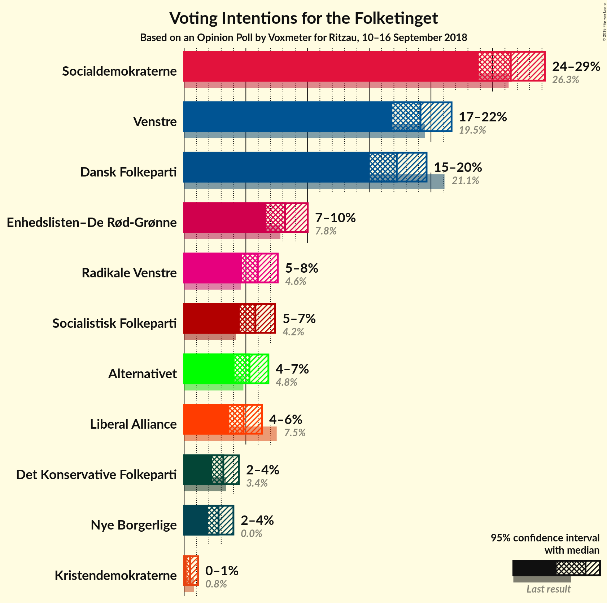

### Confidence Intervals

| Party | Last Result | Poll Result | 80% Confidence Interval | 90% Confidence Interval | 95% Confidence Interval | 99% Confidence Interval |
|:-----:|:-----------:|:-----------:|:-----------------------:|:-----------------------:|:-----------------------:|:-----------------------:|
| Socialdemokraterne | 26.3% | 26.5% | 24.8–28.3% |24.3–28.8% |23.9–29.2% |23.1–30.1% |
| Venstre | 19.5% | 19.2% | 17.6–20.8% |17.2–21.3% |16.9–21.7% |16.2–22.5% |
| Dansk Folkeparti | 21.1% | 17.2% | 15.8–18.8% |15.4–19.3% |15.0–19.6% |14.4–20.4% |
| Enhedslisten–De Rød-Grønne | 7.8% | 8.2% | 7.2–9.4% |6.9–9.7% |6.7–10.0% |6.2–10.6% |
| Radikale Venstre | 4.6% | 6.0% | 5.1–7.0% |4.9–7.3% |4.7–7.6% |4.3–8.1% |
| Socialistisk Folkeparti | 4.2% | 5.8% | 4.9–6.8% |4.7–7.1% |4.5–7.4% |4.1–7.9% |
| Alternativet | 4.8% | 5.3% | 4.5–6.3% |4.3–6.6% |4.1–6.8% |3.7–7.3% |
| Liberal Alliance | 7.5% | 4.8% | 4.1–5.8% |3.8–6.1% |3.7–6.3% |3.3–6.8% |
| Det Konservative Folkeparti | 3.4% | 3.2% | 2.6–4.0% |2.4–4.2% |2.3–4.4% |2.0–4.9% |
| Nye Borgerlige | 0.0% | 2.8% | 2.2–3.6% |2.1–3.8% |2.0–4.0% |1.7–4.4% |
| Kristendemokraterne | 0.8% | 0.5% | 0.3–0.9% |0.2–1.0% |0.2–1.1% |0.1–1.4% |

*Note:* The poll result column reflects the actual value used in the calculations. Published results may vary slightly, and in addition be rounded to fewer digits.

## Seats

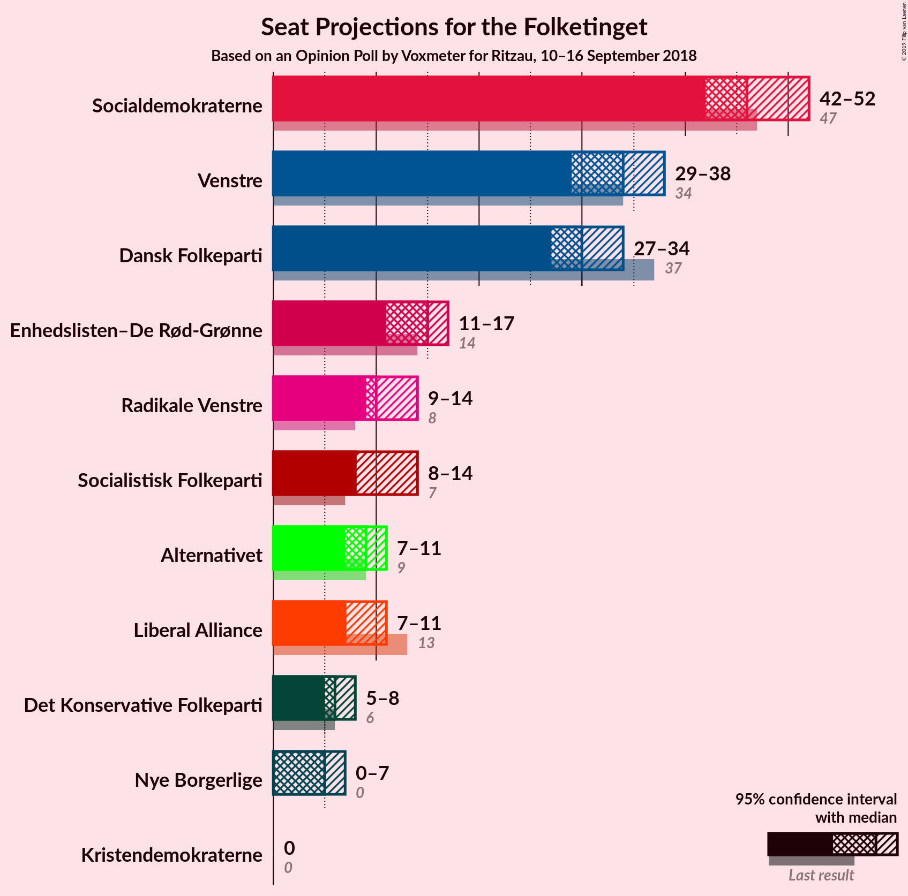

### Confidence Intervals

| Party | Last Result | Median | 80% Confidence Interval | 90% Confidence Interval | 95% Confidence Interval | 99% Confidence Interval |
|:-----:|:-----------:|:------:|:-----------------------:|:-----------------------:|:-----------------------:|:-----------------------:|
| <a href="#socialdemokraterne">Socialdemokraterne</a> | 47 | 45 | 43–45 |43–52 |43–52 |43–52 |
| <a href="#venstre">Venstre</a> | 34 | 33 | 33–35 |30–35 |30–35 |30–40 |
| <a href="#dansk-folkeparti">Dansk Folkeparti</a> | 37 | 26 | 24–29 |24–33 |24–33 |24–33 |
| <a href="#enhedslisten–de-rød-grønne">Enhedslisten–De Rød-Grønne</a> | 14 | 17 | 16–17 |13–17 |13–17 |12–19 |
| <a href="#radikale-venstre">Radikale Venstre</a> | 8 | 8 | 8–12 |8–12 |8–12 |7–14 |
| <a href="#socialistisk-folkeparti">Socialistisk Folkeparti</a> | 7 | 12 | 11–13 |10–13 |10–13 |9–13 |
| <a href="#alternativet">Alternativet</a> | 9 | 13 | 10–13 |8–13 |8–13 |6–13 |
| <a href="#liberal-alliance">Liberal Alliance</a> | 13 | 9 | 9–10 |7–10 |7–10 |7–10 |
| <a href="#det-konservative-folkeparti">Det Konservative Folkeparti</a> | 6 | 6 | 5–6 |5–9 |5–9 |5–9 |
| <a href="#nye-borgerlige">Nye Borgerlige</a> | 0 | 6 | 4–7 |4–7 |0–7 |0–9 |
| <a href="#kristendemokraterne">Kristendemokraterne</a> | 0 | 0 | 0 |0 |0 |0 |

### Socialdemokraterne

*For a full overview of the results for this party, see the [Socialdemokraterne](party-socialdemokraterne.html) page.*

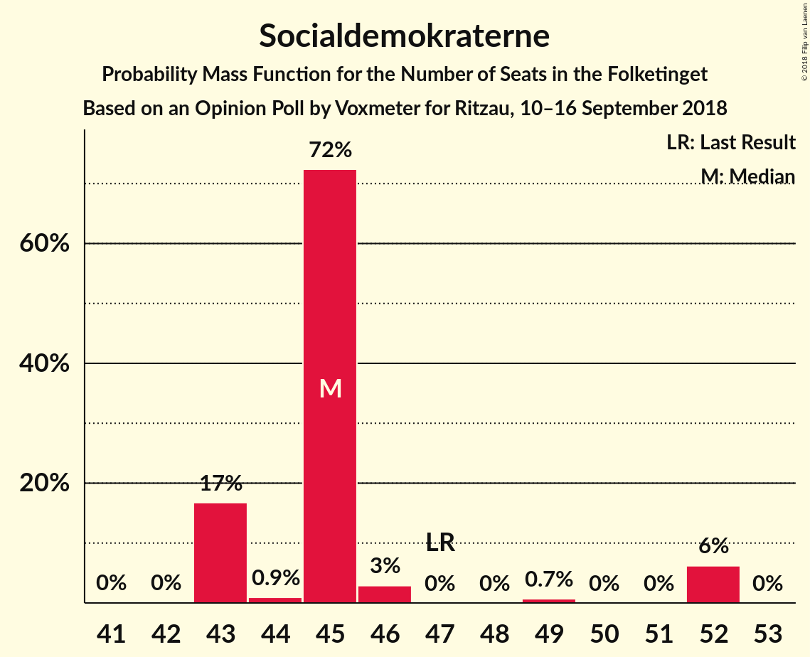

| Number of Seats | Probability | Accumulated | Special Marks |
|:---------------:|:-----------:|:-----------:|:-------------:|
| 41 | 0% | 100% |  |
| 42 | 0% | 99.9% |  |
| 43 | 17% | 99.9% |  |
| 44 | 0.9% | 83% |  |
| 45 | 72% | 82% | Median |
| 46 | 3% | 10% |  |
| 47 | 0% | 7% | Last Result |
| 48 | 0% | 7% |  |
| 49 | 0.7% | 7% |  |
| 50 | 0% | 6% |  |
| 51 | 0% | 6% |  |
| 52 | 6% | 6% |  |
| 53 | 0% | 0% |  |

### Venstre

*For a full overview of the results for this party, see the [Venstre](party-venstre.html) page.*

| Number of Seats | Probability | Accumulated | Special Marks |
|:---------------:|:-----------:|:-----------:|:-------------:|
| 30 | 6% | 100% |  |
| 31 | 0% | 94% |  |
| 32 | 0% | 94% |  |
| 33 | 76% | 94% | Median |
| 34 | 0% | 18% | Last Result |
| 35 | 16% | 18% |  |
| 36 | 0.9% | 2% |  |
| 37 | 0% | 0.7% |  |
| 38 | 0% | 0.7% |  |
| 39 | 0% | 0.7% |  |
| 40 | 0.7% | 0.7% |  |
| 41 | 0% | 0% |  |

### Dansk Folkeparti

*For a full overview of the results for this party, see the [Dansk Folkeparti](party-danskfolkeparti.html) page.*

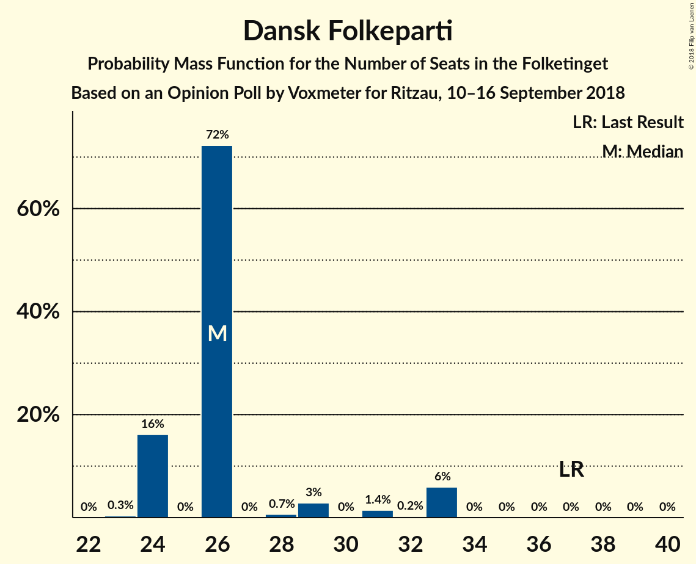

| Number of Seats | Probability | Accumulated | Special Marks |
|:---------------:|:-----------:|:-----------:|:-------------:|
| 23 | 0.3% | 100% |  |
| 24 | 16% | 99.7% |  |
| 25 | 0% | 84% |  |
| 26 | 72% | 84% | Median |
| 27 | 0% | 11% |  |
| 28 | 0.7% | 11% |  |
| 29 | 3% | 11% |  |
| 30 | 0% | 8% |  |
| 31 | 1.4% | 8% |  |
| 32 | 0.2% | 6% |  |
| 33 | 6% | 6% |  |
| 34 | 0% | 0.1% |  |
| 35 | 0% | 0.1% |  |
| 36 | 0% | 0.1% |  |
| 37 | 0% | 0.1% | Last Result |
| 38 | 0% | 0.1% |  |
| 39 | 0% | 0% |  |

### Enhedslisten–De Rød-Grønne

*For a full overview of the results for this party, see the [Enhedslisten–De Rød-Grønne](party-enhedslisten–derød-grønne.html) page.*

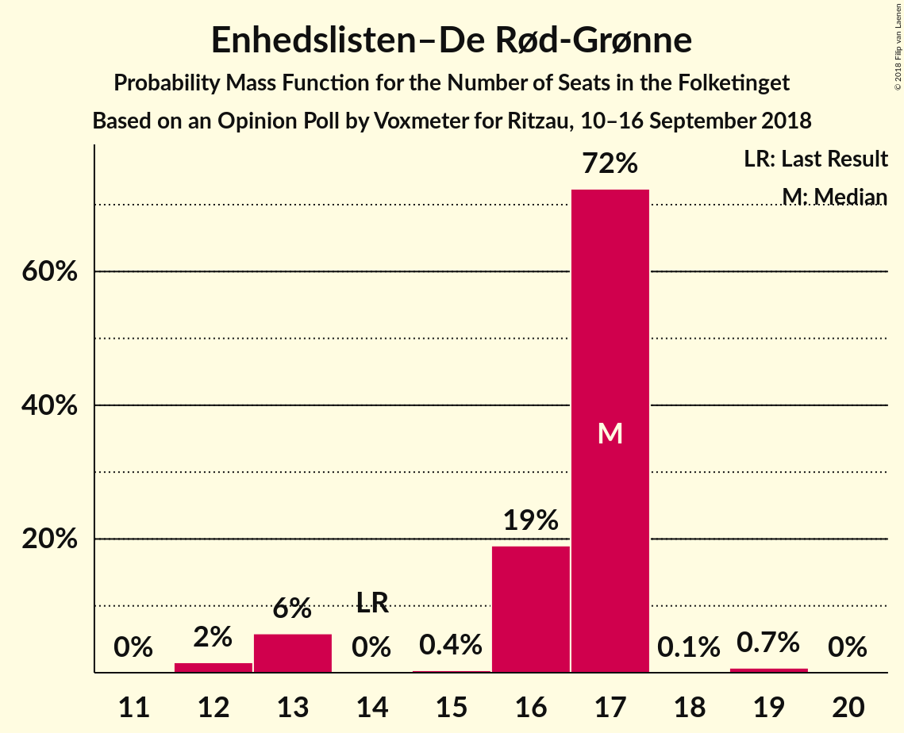

| Number of Seats | Probability | Accumulated | Special Marks |
|:---------------:|:-----------:|:-----------:|:-------------:|
| 12 | 2% | 100% |  |
| 13 | 6% | 98% |  |
| 14 | 0% | 93% | Last Result |
| 15 | 0.4% | 93% |  |
| 16 | 19% | 92% |  |
| 17 | 72% | 73% | Median |
| 18 | 0.1% | 0.8% |  |
| 19 | 0.7% | 0.7% |  |
| 20 | 0% | 0% |  |

### Radikale Venstre

*For a full overview of the results for this party, see the [Radikale Venstre](party-radikalevenstre.html) page.*

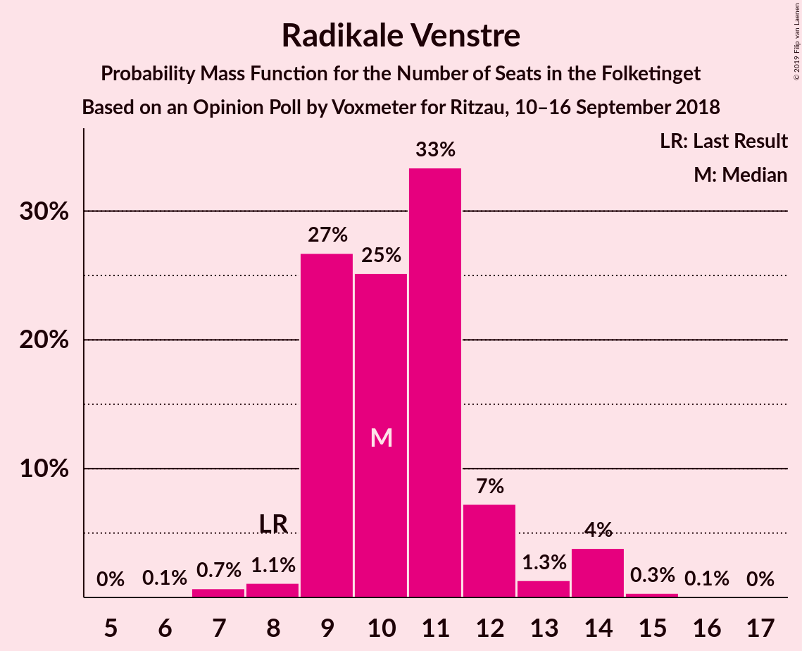

| Number of Seats | Probability | Accumulated | Special Marks |
|:---------------:|:-----------:|:-----------:|:-------------:|
| 7 | 0.7% | 100% |  |
| 8 | 72% | 99.3% | Last Result, Median |
| 9 | 6% | 27% |  |
| 10 | 0% | 21% |  |
| 11 | 0.1% | 21% |  |
| 12 | 19% | 21% |  |
| 13 | 0.7% | 1.4% |  |
| 14 | 0.7% | 0.8% |  |
| 15 | 0.1% | 0.1% |  |
| 16 | 0% | 0% |  |

### Socialistisk Folkeparti

*For a full overview of the results for this party, see the [Socialistisk Folkeparti](party-socialistiskfolkeparti.html) page.*

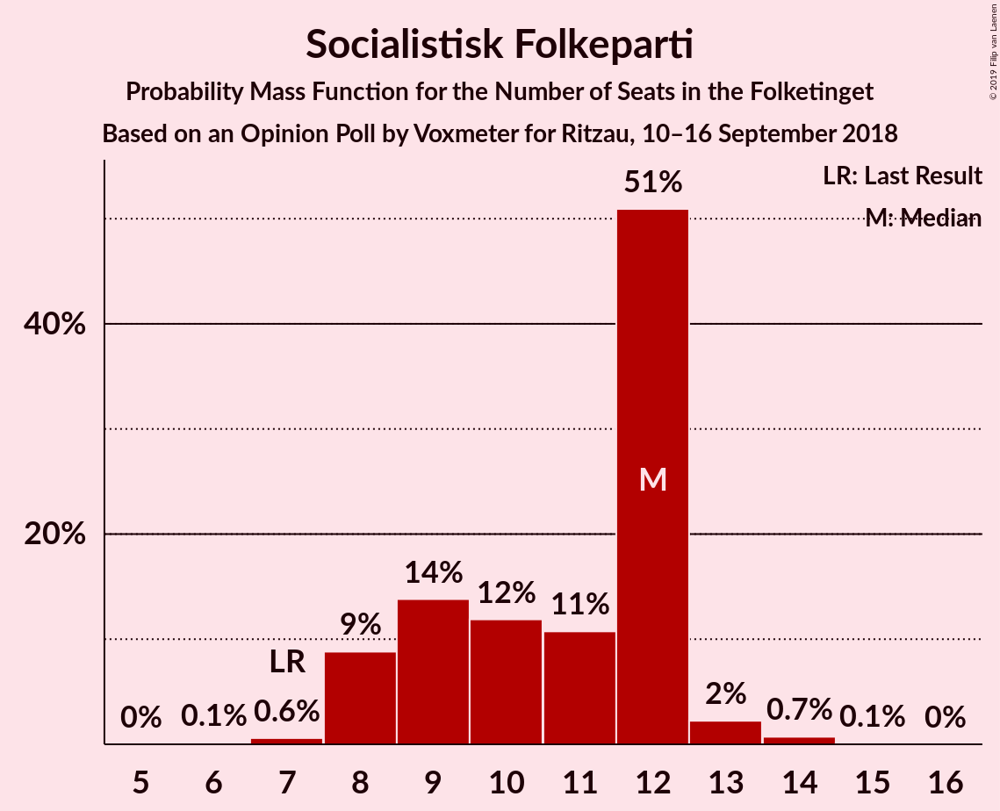

| Number of Seats | Probability | Accumulated | Special Marks |
|:---------------:|:-----------:|:-----------:|:-------------:|
| 6 | 0.1% | 100% |  |
| 7 | 0% | 99.9% | Last Result |
| 8 | 0% | 99.9% |  |
| 9 | 1.1% | 99.9% |  |
| 10 | 6% | 98.8% |  |
| 11 | 4% | 93% |  |
| 12 | 72% | 89% | Median |
| 13 | 16% | 16% |  |
| 14 | 0% | 0.3% |  |
| 15 | 0% | 0.2% |  |
| 16 | 0.2% | 0.2% |  |
| 17 | 0% | 0% |  |

### Alternativet

*For a full overview of the results for this party, see the [Alternativet](party-alternativet.html) page.*

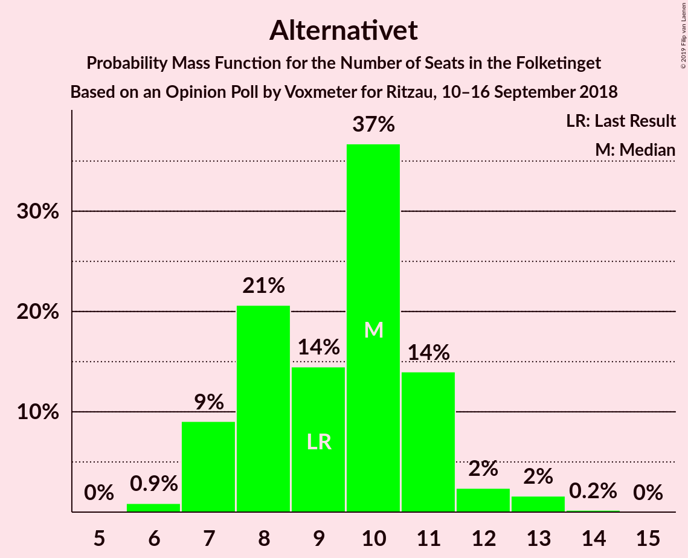

| Number of Seats | Probability | Accumulated | Special Marks |
|:---------------:|:-----------:|:-----------:|:-------------:|
| 6 | 0.7% | 100% |  |
| 7 | 0% | 99.3% |  |
| 8 | 7% | 99.2% |  |
| 9 | 0% | 93% | Last Result |
| 10 | 19% | 93% |  |
| 11 | 1.3% | 74% |  |
| 12 | 0.1% | 72% |  |
| 13 | 72% | 72% | Median |
| 14 | 0% | 0% |  |

### Liberal Alliance

*For a full overview of the results for this party, see the [Liberal Alliance](party-liberalalliance.html) page.*

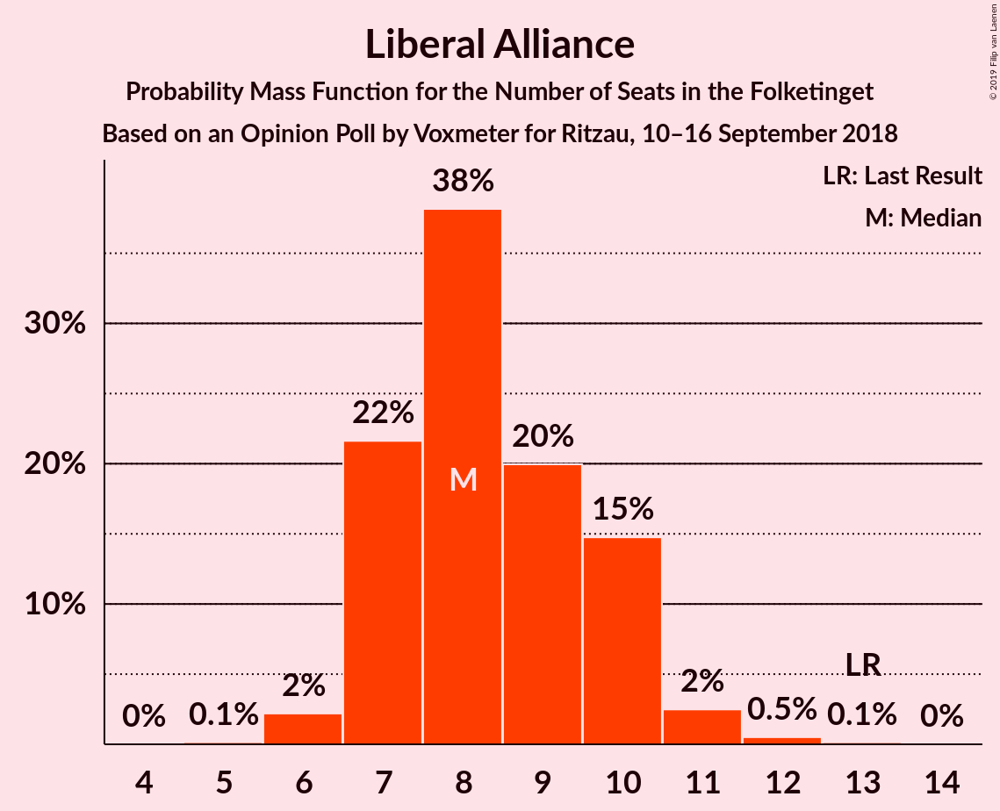

| Number of Seats | Probability | Accumulated | Special Marks |
|:---------------:|:-----------:|:-----------:|:-------------:|
| 6 | 0.1% | 100% |  |
| 7 | 7% | 99.9% |  |
| 8 | 3% | 93% |  |
| 9 | 73% | 90% | Median |
| 10 | 17% | 17% |  |
| 11 | 0% | 0% |  |
| 12 | 0% | 0% |  |
| 13 | 0% | 0% | Last Result |

### Det Konservative Folkeparti

*For a full overview of the results for this party, see the [Det Konservative Folkeparti](party-detkonservativefolkeparti.html) page.*

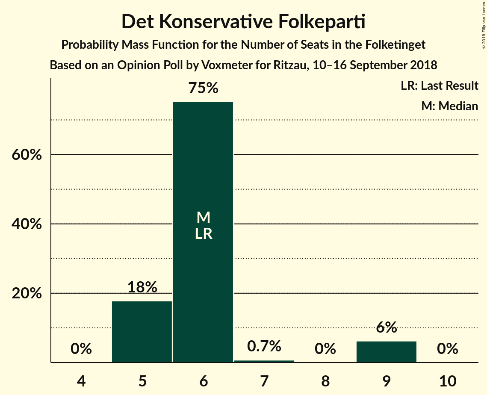

| Number of Seats | Probability | Accumulated | Special Marks |
|:---------------:|:-----------:|:-----------:|:-------------:|
| 4 | 0% | 100% |  |
| 5 | 18% | 99.9% |  |
| 6 | 75% | 82% | Last Result, Median |
| 7 | 0.7% | 7% |  |
| 8 | 0% | 6% |  |
| 9 | 6% | 6% |  |
| 10 | 0% | 0% |  |

### Nye Borgerlige

*For a full overview of the results for this party, see the [Nye Borgerlige](party-nyeborgerlige.html) page.*

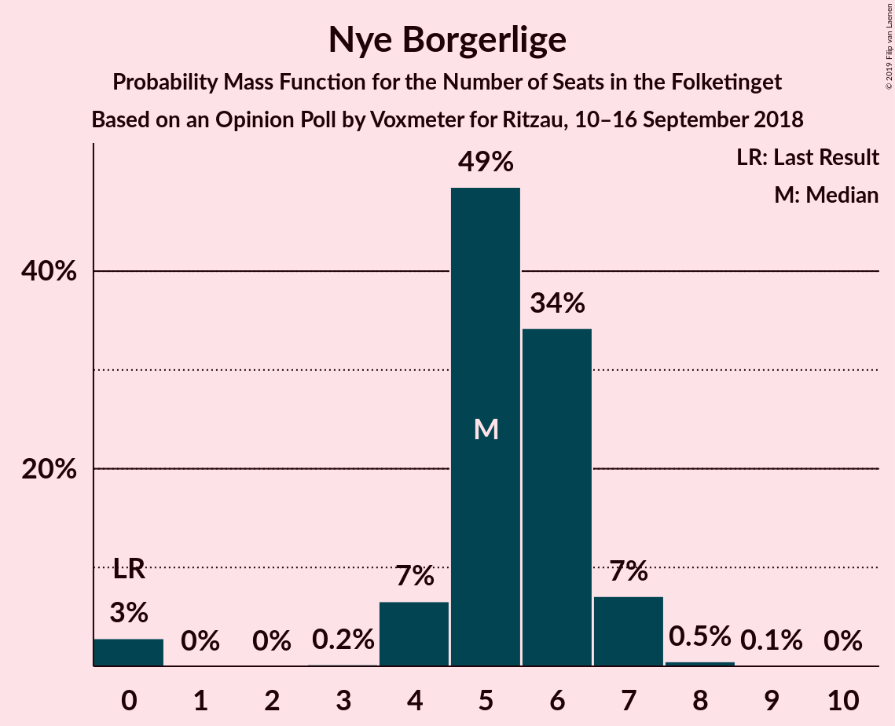

| Number of Seats | Probability | Accumulated | Special Marks |
|:---------------:|:-----------:|:-----------:|:-------------:|
| 0 | 4% | 100% | Last Result |
| 1 | 0% | 96% |  |
| 2 | 0% | 96% |  |
| 3 | 0% | 96% |  |
| 4 | 6% | 96% |  |
| 5 | 0.7% | 90% |  |
| 6 | 72% | 89% | Median |
| 7 | 16% | 17% |  |
| 8 | 0% | 0.7% |  |
| 9 | 0.6% | 0.6% |  |
| 10 | 0% | 0% |  |

### Kristendemokraterne

*For a full overview of the results for this party, see the [Kristendemokraterne](party-kristendemokraterne.html) page.*

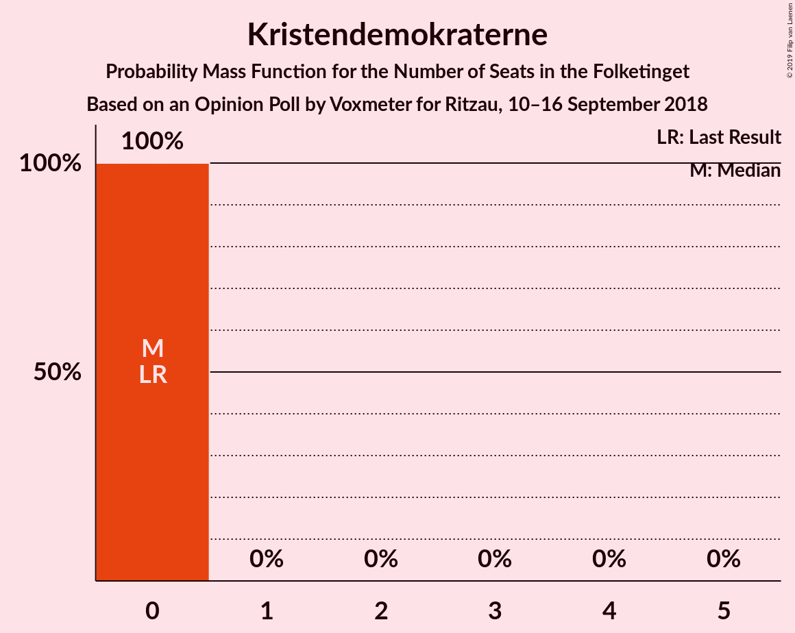

| Number of Seats | Probability | Accumulated | Special Marks |
|:---------------:|:-----------:|:-----------:|:-------------:|
| 0 | 100% | 100% | Last Result, Median |

## Coalitions

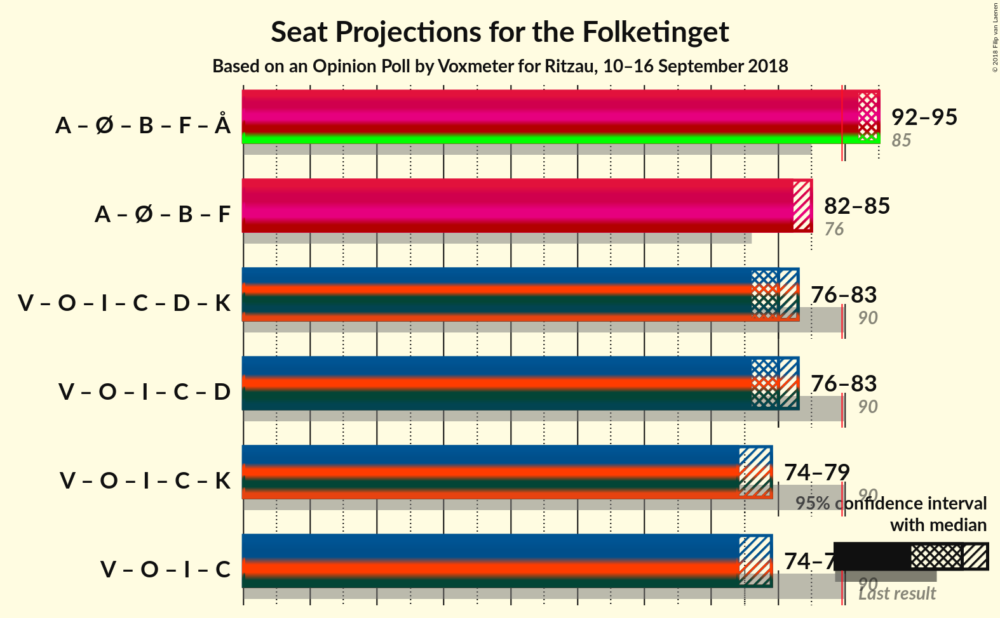

### Confidence Intervals

| Coalition | Last Result | Median | Majority? | 80% Confidence Interval | 90% Confidence Interval | 95% Confidence Interval | 99% Confidence Interval |
|:---------:|:-----------:|:------:|:---------:|:-----------------------:|:-----------------------:|:-----------------------:|:-----------------------:|
| Socialdemokraterne – Enhedslisten–De Rød-Grønne – Radikale Venstre – Socialistisk Folkeparti – Alternativet | 85 | 95 | 99.3% | 94–95 | 92–95 | 92–95 | 87–95 |
| Socialdemokraterne – Enhedslisten–De Rød-Grønne – Radikale Venstre – Socialistisk Folkeparti | 76 | 82 | 0% | 82–84 | 82–84 | 82–85 | 79–86 |
| Venstre – Dansk Folkeparti – Liberal Alliance – Det Konservative Folkeparti – Nye Borgerlige – Kristendemokraterne | 90 | 80 | 0% | 80–81 | 80–83 | 76–83 | 76–88 |
| Venstre – Dansk Folkeparti – Liberal Alliance – Det Konservative Folkeparti – Nye Borgerlige | 90 | 80 | 0% | 80–81 | 80–83 | 76–83 | 76–88 |
| Venstre – Dansk Folkeparti – Liberal Alliance – Det Konservative Folkeparti – Kristendemokraterne | 90 | 74 | 0% | 74–76 | 74–79 | 74–79 | 74–85 |
| Venstre – Dansk Folkeparti – Liberal Alliance – Det Konservative Folkeparti | 90 | 74 | 0% | 74–76 | 74–79 | 74–79 | 74–85 |

### Socialdemokraterne – Enhedslisten–De Rød-Grønne – Radikale Venstre – Socialistisk Folkeparti – Alternativet

| Number of Seats | Probability | Accumulated | Special Marks |
|:---------------:|:-----------:|:-----------:|:-------------:|
| 85 | 0% | 100% | Last Result |
| 86 | 0% | 100% |  |
| 87 | 0.6% | 100% |  |
| 88 | 0% | 99.4% |  |
| 89 | 0% | 99.4% |  |
| 90 | 0.7% | 99.3% | Majority |
| 91 | 0.1% | 98.6% |  |
| 92 | 7% | 98.5% |  |
| 93 | 0% | 92% |  |
| 94 | 16% | 92% |  |
| 95 | 75% | 76% | Median |
| 96 | 0.1% | 0.4% |  |
| 97 | 0% | 0.3% |  |
| 98 | 0% | 0.3% |  |
| 99 | 0.3% | 0.3% |  |
| 100 | 0% | 0% |  |

### Socialdemokraterne – Enhedslisten–De Rød-Grønne – Radikale Venstre – Socialistisk Folkeparti

| Number of Seats | Probability | Accumulated | Special Marks |
|:---------------:|:-----------:|:-----------:|:-------------:|
| 76 | 0% | 100% | Last Result |
| 77 | 0% | 100% |  |
| 78 | 0% | 100% |  |
| 79 | 1.4% | 100% |  |
| 80 | 0% | 98.6% |  |
| 81 | 0.3% | 98.6% |  |
| 82 | 72% | 98% | Median |
| 83 | 0% | 26% |  |
| 84 | 22% | 26% |  |
| 85 | 3% | 4% |  |
| 86 | 0.7% | 1.0% |  |
| 87 | 0% | 0.3% |  |
| 88 | 0.3% | 0.3% |  |
| 89 | 0% | 0% |  |

### Venstre – Dansk Folkeparti – Liberal Alliance – Det Konservative Folkeparti – Nye Borgerlige – Kristendemokraterne

| Number of Seats | Probability | Accumulated | Special Marks |
|:---------------:|:-----------:|:-----------:|:-------------:|
| 76 | 3% | 100% |  |
| 77 | 0% | 97% |  |
| 78 | 0% | 97% |  |
| 79 | 0.1% | 97% |  |
| 80 | 72% | 97% | Median |
| 81 | 16% | 24% |  |
| 82 | 0% | 8% |  |
| 83 | 7% | 8% |  |
| 84 | 0.1% | 1.5% |  |
| 85 | 0.7% | 1.4% |  |
| 86 | 0% | 0.7% |  |
| 87 | 0% | 0.6% |  |
| 88 | 0.6% | 0.6% |  |
| 89 | 0% | 0% |  |
| 90 | 0% | 0% | Last Result, Majority |

### Venstre – Dansk Folkeparti – Liberal Alliance – Det Konservative Folkeparti – Nye Borgerlige

| Number of Seats | Probability | Accumulated | Special Marks |
|:---------------:|:-----------:|:-----------:|:-------------:|
| 76 | 3% | 100% |  |
| 77 | 0% | 97% |  |
| 78 | 0% | 97% |  |
| 79 | 0.1% | 97% |  |
| 80 | 72% | 97% | Median |
| 81 | 16% | 24% |  |
| 82 | 0% | 8% |  |
| 83 | 7% | 8% |  |
| 84 | 0.1% | 1.5% |  |
| 85 | 0.7% | 1.4% |  |
| 86 | 0% | 0.7% |  |
| 87 | 0% | 0.6% |  |
| 88 | 0.6% | 0.6% |  |
| 89 | 0% | 0% |  |
| 90 | 0% | 0% | Last Result, Majority |

### Venstre – Dansk Folkeparti – Liberal Alliance – Det Konservative Folkeparti – Kristendemokraterne

| Number of Seats | Probability | Accumulated | Special Marks |
|:---------------:|:-----------:|:-----------:|:-------------:|
| 72 | 0.3% | 100% |  |
| 73 | 0% | 99.7% |  |
| 74 | 88% | 99.7% | Median |
| 75 | 0% | 11% |  |
| 76 | 3% | 11% |  |
| 77 | 0% | 8% |  |
| 78 | 0.7% | 8% |  |
| 79 | 7% | 8% |  |
| 80 | 0% | 1.0% |  |
| 81 | 0% | 1.0% |  |
| 82 | 0% | 1.0% |  |
| 83 | 0.3% | 1.0% |  |
| 84 | 0% | 0.7% |  |
| 85 | 0.7% | 0.7% |  |
| 86 | 0% | 0% |  |
| 87 | 0% | 0% |  |
| 88 | 0% | 0% |  |
| 89 | 0% | 0% |  |
| 90 | 0% | 0% | Last Result, Majority |

### Venstre – Dansk Folkeparti – Liberal Alliance – Det Konservative Folkeparti

| Number of Seats | Probability | Accumulated | Special Marks |
|:---------------:|:-----------:|:-----------:|:-------------:|
| 72 | 0.3% | 100% |  |
| 73 | 0% | 99.7% |  |
| 74 | 88% | 99.7% | Median |
| 75 | 0% | 11% |  |
| 76 | 3% | 11% |  |
| 77 | 0% | 8% |  |
| 78 | 0.7% | 8% |  |
| 79 | 7% | 8% |  |
| 80 | 0% | 1.0% |  |
| 81 | 0% | 1.0% |  |
| 82 | 0% | 1.0% |  |
| 83 | 0.3% | 1.0% |  |
| 84 | 0% | 0.7% |  |
| 85 | 0.7% | 0.7% |  |
| 86 | 0% | 0% |  |
| 87 | 0% | 0% |  |
| 88 | 0% | 0% |  |
| 89 | 0% | 0% |  |
| 90 | 0% | 0% | Last Result, Majority |

## Technical Information

### Opinion Poll

+ **Polling firm:** Voxmeter
+ **Commissioner(s):** Ritzau
+ **Fieldwork period:** 10–16 September 2018

### Calculations

+ **Sample size:** 1039
+ **Simulations done:** 1,024
+ **Error estimate:** 4.10%

