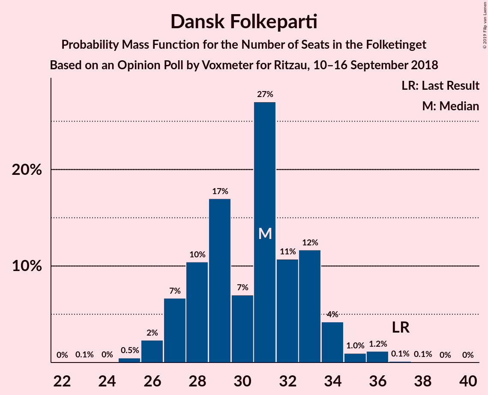
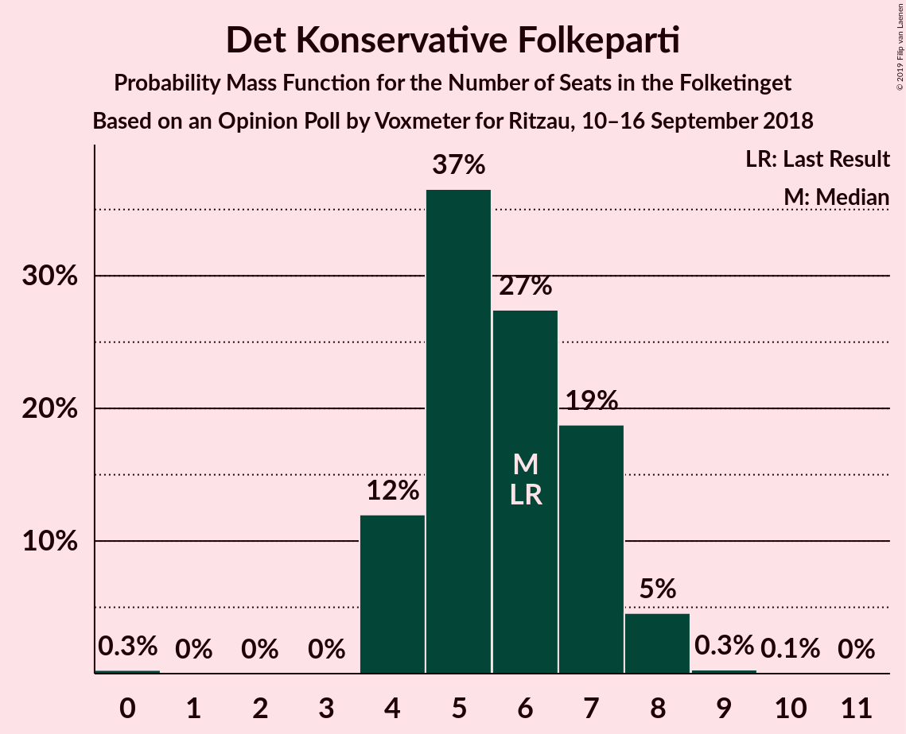
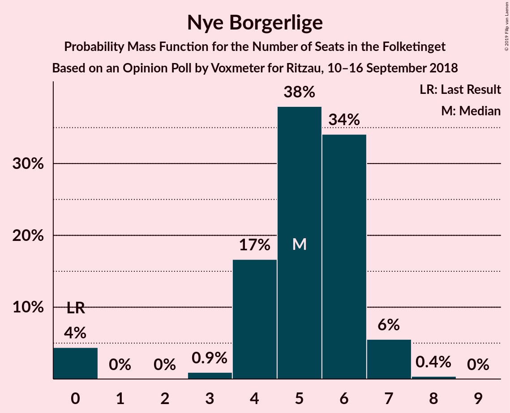

# Opinion Poll by Voxmeter for Ritzau, 10–16 September 2018

<a href="#voting-intentions">Voting Intentions</a> | <a href="#seats">Seats</a> | <a href="#coalitions">Coalitions</a> | <a href="#technical-information">Technical Information</a>

## Voting Intentions

### Confidence Intervals

| Party | Last Result | Poll Result | 80% Confidence Interval | 90% Confidence Interval | 95% Confidence Interval | 99% Confidence Interval |
|:-----:|:-----------:|:-----------:|:-----------------------:|:-----------------------:|:-----------------------:|:-----------------------:|
| Socialdemokraterne | 26.3% | 26.5% | 24.8–28.3% |24.3–28.8% |23.9–29.2% |23.1–30.1% |
| Venstre | 19.5% | 19.2% | 17.6–20.8% |17.2–21.3% |16.9–21.7% |16.2–22.5% |
| Dansk Folkeparti | 21.1% | 17.2% | 15.8–18.8% |15.4–19.3% |15.0–19.6% |14.4–20.4% |
| Enhedslisten–De Rød-Grønne | 7.8% | 8.2% | 7.2–9.4% |6.9–9.7% |6.7–10.0% |6.2–10.6% |
| Radikale Venstre | 4.6% | 6.0% | 5.1–7.0% |4.9–7.3% |4.7–7.6% |4.3–8.1% |
| Socialistisk Folkeparti | 4.2% | 5.8% | 4.9–6.8% |4.7–7.1% |4.5–7.4% |4.1–7.9% |
| Alternativet | 4.8% | 5.3% | 4.5–6.3% |4.3–6.6% |4.1–6.8% |3.7–7.3% |
| Liberal Alliance | 7.5% | 4.8% | 4.1–5.8% |3.8–6.1% |3.7–6.3% |3.3–6.8% |
| Det Konservative Folkeparti | 3.4% | 3.2% | 2.6–4.0% |2.4–4.2% |2.3–4.4% |2.0–4.9% |
| Nye Borgerlige | 0.0% | 2.8% | 2.2–3.6% |2.1–3.8% |2.0–4.0% |1.7–4.4% |
| Kristendemokraterne | 0.8% | 0.5% | 0.3–0.9% |0.2–1.0% |0.2–1.1% |0.1–1.4% |

*Note:* The poll result column reflects the actual value used in the calculations. Published results may vary slightly, and in addition be rounded to fewer digits.

## Seats

### Confidence Intervals

| Party | Last Result | Median | 80% Confidence Interval | 90% Confidence Interval | 95% Confidence Interval | 99% Confidence Interval |
|:-----:|:-----------:|:------:|:-----------------------:|:-----------------------:|:-----------------------:|:-----------------------:|
| <a href="#socialdemokraterne">Socialdemokraterne</a> | 47 | 46 | 44–52 |43–52 |42–52 |41–52 |
| <a href="#venstre">Venstre</a> | 34 | 34 | 31–38 |29–38 |29–38 |29–39 |
| <a href="#dansk-folkeparti">Dansk Folkeparti</a> | 37 | 30 | 28–33 |27–34 |27–34 |23–35 |
| <a href="#enhedslisten–de-rød-grønne">Enhedslisten–De Rød-Grønne</a> | 14 | 15 | 14–16 |13–17 |11–17 |11–20 |
| <a href="#radikale-venstre">Radikale Venstre</a> | 8 | 10 | 9–12 |9–13 |9–14 |7–14 |
| <a href="#socialistisk-folkeparti">Socialistisk Folkeparti</a> | 7 | 8 | 8–12 |8–14 |8–14 |8–14 |
| <a href="#alternativet">Alternativet</a> | 9 | 9 | 8–11 |8–11 |7–11 |7–13 |
| <a href="#liberal-alliance">Liberal Alliance</a> | 13 | 7 | 7–10 |7–11 |7–11 |6–12 |
| <a href="#det-konservative-folkeparti">Det Konservative Folkeparti</a> | 6 | 6 | 5–8 |5–8 |5–8 |0–9 |
| <a href="#nye-borgerlige">Nye Borgerlige</a> | 0 | 5 | 5–6 |4–7 |0–7 |0–8 |
| <a href="#kristendemokraterne">Kristendemokraterne</a> | 0 | 0 | 0 |0 |0 |0 |

### Socialdemokraterne

*For a full overview of the results for this party, see the [Socialdemokraterne](party-socialdemokraterne.html) page.*

| Number of Seats | Probability | Accumulated | Special Marks |
|:---------------:|:-----------:|:-----------:|:-------------:|
| 39 | 0.2% | 100% |  |
| 40 | 0.3% | 99.8% |  |
| 41 | 1.3% | 99.6% |  |
| 42 | 1.2% | 98% |  |
| 43 | 4% | 97% |  |
| 44 | 4% | 93% |  |
| 45 | 7% | 89% |  |
| 46 | 46% | 83% | Median |
| 47 | 0.9% | 37% | Last Result |
| 48 | 7% | 36% |  |
| 49 | 6% | 29% |  |
| 50 | 0.7% | 23% |  |
| 51 | 2% | 22% |  |
| 52 | 20% | 20% |  |
| 53 | 0.2% | 0.3% |  |
| 54 | 0% | 0.1% |  |
| 55 | 0% | 0.1% |  |
| 56 | 0% | 0% |  |

### Venstre

*For a full overview of the results for this party, see the [Venstre](party-venstre.html) page.*

| Number of Seats | Probability | Accumulated | Special Marks |
|:---------------:|:-----------:|:-----------:|:-------------:|
| 28 | 0.1% | 100% |  |
| 29 | 6% | 99.8% |  |
| 30 | 2% | 93% |  |
| 31 | 5% | 91% |  |
| 32 | 12% | 86% |  |
| 33 | 20% | 74% |  |
| 34 | 20% | 54% | Last Result, Median |
| 35 | 2% | 34% |  |
| 36 | 2% | 32% |  |
| 37 | 3% | 30% |  |
| 38 | 26% | 27% |  |
| 39 | 2% | 2% |  |
| 40 | 0% | 0.1% |  |
| 41 | 0% | 0% |  |

### Dansk Folkeparti

*For a full overview of the results for this party, see the [Dansk Folkeparti](party-danskfolkeparti.html) page.*

| Number of Seats | Probability | Accumulated | Special Marks |
|:---------------:|:-----------:|:-----------:|:-------------:|
| 23 | 0.8% | 100% |  |
| 24 | 0% | 99.2% |  |
| 25 | 0.6% | 99.1% |  |
| 26 | 0.9% | 98.5% |  |
| 27 | 3% | 98% |  |
| 28 | 18% | 95% |  |
| 29 | 22% | 77% |  |
| 30 | 28% | 54% | Median |
| 31 | 11% | 26% |  |
| 32 | 2% | 15% |  |
| 33 | 5% | 13% |  |
| 34 | 6% | 8% |  |
| 35 | 1.3% | 2% |  |
| 36 | 0.3% | 0.4% |  |
| 37 | 0% | 0.1% | Last Result |
| 38 | 0.1% | 0.1% |  |
| 39 | 0% | 0% |  |

### Enhedslisten–De Rød-Grønne

*For a full overview of the results for this party, see the [Enhedslisten–De Rød-Grønne](party-enhedslisten–derød-grønne.html) page.*

| Number of Seats | Probability | Accumulated | Special Marks |
|:---------------:|:-----------:|:-----------:|:-------------:|
| 10 | 0.4% | 100% |  |
| 11 | 2% | 99.6% |  |
| 12 | 2% | 97% |  |
| 13 | 5% | 96% |  |
| 14 | 7% | 91% | Last Result |
| 15 | 55% | 84% | Median |
| 16 | 20% | 29% |  |
| 17 | 7% | 9% |  |
| 18 | 1.3% | 2% |  |
| 19 | 0.1% | 0.8% |  |
| 20 | 0.6% | 0.7% |  |
| 21 | 0.1% | 0.1% |  |
| 22 | 0% | 0% |  |

### Radikale Venstre

*For a full overview of the results for this party, see the [Radikale Venstre](party-radikalevenstre.html) page.*

| Number of Seats | Probability | Accumulated | Special Marks |
|:---------------:|:-----------:|:-----------:|:-------------:|
| 6 | 0.1% | 100% |  |
| 7 | 0.7% | 99.9% |  |
| 8 | 1.1% | 99.2% | Last Result |
| 9 | 27% | 98% |  |
| 10 | 25% | 71% | Median |
| 11 | 33% | 46% |  |
| 12 | 7% | 13% |  |
| 13 | 1.3% | 6% |  |
| 14 | 4% | 4% |  |
| 15 | 0.3% | 0.4% |  |
| 16 | 0.1% | 0.1% |  |
| 17 | 0% | 0% |  |

### Socialistisk Folkeparti

*For a full overview of the results for this party, see the [Socialistisk Folkeparti](party-socialistiskfolkeparti.html) page.*

| Number of Seats | Probability | Accumulated | Special Marks |
|:---------------:|:-----------:|:-----------:|:-------------:|
| 7 | 0.1% | 100% | Last Result |
| 8 | 52% | 99.8% | Median |
| 9 | 8% | 48% |  |
| 10 | 7% | 40% |  |
| 11 | 3% | 33% |  |
| 12 | 22% | 30% |  |
| 13 | 3% | 8% |  |
| 14 | 5% | 5% |  |
| 15 | 0.2% | 0.2% |  |
| 16 | 0% | 0% |  |

### Alternativet

*For a full overview of the results for this party, see the [Alternativet](party-alternativet.html) page.*

| Number of Seats | Probability | Accumulated | Special Marks |
|:---------------:|:-----------:|:-----------:|:-------------:|
| 6 | 0.1% | 100% |  |
| 7 | 3% | 99.9% |  |
| 8 | 36% | 97% |  |
| 9 | 29% | 61% | Last Result, Median |
| 10 | 8% | 32% |  |
| 11 | 22% | 24% |  |
| 12 | 1.1% | 2% |  |
| 13 | 0.5% | 0.6% |  |
| 14 | 0.1% | 0.1% |  |
| 15 | 0% | 0% |  |

### Liberal Alliance

*For a full overview of the results for this party, see the [Liberal Alliance](party-liberalalliance.html) page.*

| Number of Seats | Probability | Accumulated | Special Marks |
|:---------------:|:-----------:|:-----------:|:-------------:|
| 5 | 0.2% | 100% |  |
| 6 | 0.5% | 99.8% |  |
| 7 | 50% | 99.3% | Median |
| 8 | 23% | 50% |  |
| 9 | 9% | 27% |  |
| 10 | 10% | 17% |  |
| 11 | 7% | 7% |  |
| 12 | 0.4% | 0.5% |  |
| 13 | 0.1% | 0.1% | Last Result |
| 14 | 0% | 0% |  |

### Det Konservative Folkeparti

*For a full overview of the results for this party, see the [Det Konservative Folkeparti](party-detkonservativefolkeparti.html) page.*

| Number of Seats | Probability | Accumulated | Special Marks |
|:---------------:|:-----------:|:-----------:|:-------------:|
| 0 | 0.8% | 100% |  |
| 1 | 0% | 99.2% |  |
| 2 | 0% | 99.2% |  |
| 3 | 0.4% | 99.2% |  |
| 4 | 1.1% | 98.8% |  |
| 5 | 34% | 98% |  |
| 6 | 37% | 64% | Last Result, Median |
| 7 | 5% | 26% |  |
| 8 | 21% | 21% |  |
| 9 | 0.4% | 0.6% |  |
| 10 | 0.2% | 0.2% |  |
| 11 | 0% | 0% |  |

### Nye Borgerlige

*For a full overview of the results for this party, see the [Nye Borgerlige](party-nyeborgerlige.html) page.*

| Number of Seats | Probability | Accumulated | Special Marks |
|:---------------:|:-----------:|:-----------:|:-------------:|
| 0 | 3% | 100% | Last Result |
| 1 | 0% | 97% |  |
| 2 | 0% | 97% |  |
| 3 | 0.2% | 97% |  |
| 4 | 7% | 97% |  |
| 5 | 49% | 90% | Median |
| 6 | 34% | 42% |  |
| 7 | 7% | 8% |  |
| 8 | 0.5% | 0.6% |  |
| 9 | 0.1% | 0.1% |  |
| 10 | 0% | 0% |  |

### Kristendemokraterne

*For a full overview of the results for this party, see the [Kristendemokraterne](party-kristendemokraterne.html) page.*

| Number of Seats | Probability | Accumulated | Special Marks |
|:---------------:|:-----------:|:-----------:|:-------------:|
| 0 | 100% | 100% | Last Result, Median |

## Coalitions

### Confidence Intervals

| Coalition | Last Result | Median | Majority? | 80% Confidence Interval | 90% Confidence Interval | 95% Confidence Interval | 99% Confidence Interval |
|:---------:|:-----------:|:------:|:---------:|:-----------------------:|:-----------------------:|:-----------------------:|:-----------------------:|
| Socialdemokraterne – Enhedslisten–De Rød-Grønne – Radikale Venstre – Socialistisk Folkeparti – Alternativet | 85 | 92 | 66% | 88–95 | 88–96 | 87–97 | 84–98 |
| Venstre – Dansk Folkeparti – Liberal Alliance – Det Konservative Folkeparti – Nye Borgerlige – Kristendemokraterne | 90 | 83 | 1.1% | 80–87 | 79–87 | 78–88 | 77–91 |
| Venstre – Dansk Folkeparti – Liberal Alliance – Det Konservative Folkeparti – Nye Borgerlige | 90 | 83 | 1.1% | 80–87 | 79–87 | 78–88 | 77–91 |
| Socialdemokraterne – Enhedslisten–De Rød-Grønne – Radikale Venstre – Socialistisk Folkeparti | 76 | 82 | 0.2% | 80–86 | 79–86 | 78–88 | 75–88 |
| Socialdemokraterne – Enhedslisten–De Rød-Grønne – Socialistisk Folkeparti – Alternativet | 77 | 81 | 0.1% | 77–85 | 77–85 | 77–85 | 75–88 |
| Venstre – Dansk Folkeparti – Liberal Alliance – Det Konservative Folkeparti – Kristendemokraterne | 90 | 78 | 0% | 75–81 | 74–82 | 73–83 | 72–86 |
| Venstre – Dansk Folkeparti – Liberal Alliance – Det Konservative Folkeparti | 90 | 78 | 0% | 75–81 | 74–82 | 73–83 | 72–86 |
| Socialdemokraterne – Enhedslisten–De Rød-Grønne – Socialistisk Folkeparti | 68 | 72 | 0% | 69–76 | 69–76 | 68–76 | 66–77 |
| Socialdemokraterne – Radikale Venstre – Socialistisk Folkeparti | 62 | 67 | 0% | 65–70 | 64–70 | 62–72 | 62–75 |
| Socialdemokraterne – Radikale Venstre | 55 | 57 | 0% | 55–62 | 53–62 | 52–62 | 50–66 |
| Venstre – Liberal Alliance – Det Konservative Folkeparti | 53 | 49 | 0% | 45–51 | 44–52 | 44–52 | 42–56 |
| Venstre – Det Konservative Folkeparti | 40 | 40 | 0% | 36–44 | 34–44 | 34–44 | 34–47 |
| Venstre | 34 | 34 | 0% | 31–38 | 29–38 | 29–38 | 29–39 |

### Socialdemokraterne – Enhedslisten–De Rød-Grønne – Radikale Venstre – Socialistisk Folkeparti – Alternativet

| Number of Seats | Probability | Accumulated | Special Marks |
|:---------------:|:-----------:|:-----------:|:-------------:|
| 84 | 0.8% | 100% |  |
| 85 | 0.3% | 99.2% | Last Result |
| 86 | 0.9% | 98.9% |  |
| 87 | 1.4% | 98% |  |
| 88 | 25% | 97% | Median |
| 89 | 5% | 71% |  |
| 90 | 10% | 66% | Majority |
| 91 | 3% | 56% |  |
| 92 | 3% | 53% |  |
| 93 | 19% | 49% |  |
| 94 | 4% | 31% |  |
| 95 | 22% | 27% |  |
| 96 | 1.1% | 5% |  |
| 97 | 3% | 4% |  |
| 98 | 0.4% | 0.7% |  |
| 99 | 0.2% | 0.3% |  |
| 100 | 0.1% | 0.1% |  |
| 101 | 0% | 0% |  |

### Venstre – Dansk Folkeparti – Liberal Alliance – Det Konservative Folkeparti – Nye Borgerlige – Kristendemokraterne

| Number of Seats | Probability | Accumulated | Special Marks |
|:---------------:|:-----------:|:-----------:|:-------------:|
| 75 | 0.1% | 100% |  |
| 76 | 0.2% | 99.9% |  |
| 77 | 0.4% | 99.7% |  |
| 78 | 3% | 99.3% |  |
| 79 | 1.1% | 96% |  |
| 80 | 22% | 95% |  |
| 81 | 4% | 73% |  |
| 82 | 19% | 69% | Median |
| 83 | 3% | 51% |  |
| 84 | 3% | 47% |  |
| 85 | 10% | 44% |  |
| 86 | 5% | 34% |  |
| 87 | 25% | 29% |  |
| 88 | 1.4% | 3% |  |
| 89 | 0.9% | 2% |  |
| 90 | 0.3% | 1.1% | Last Result, Majority |
| 91 | 0.8% | 0.8% |  |
| 92 | 0% | 0% |  |

### Venstre – Dansk Folkeparti – Liberal Alliance – Det Konservative Folkeparti – Nye Borgerlige

| Number of Seats | Probability | Accumulated | Special Marks |
|:---------------:|:-----------:|:-----------:|:-------------:|
| 75 | 0.1% | 100% |  |
| 76 | 0.2% | 99.9% |  |
| 77 | 0.4% | 99.7% |  |
| 78 | 3% | 99.3% |  |
| 79 | 1.1% | 96% |  |
| 80 | 22% | 95% |  |
| 81 | 4% | 73% |  |
| 82 | 19% | 69% | Median |
| 83 | 3% | 51% |  |
| 84 | 3% | 47% |  |
| 85 | 10% | 44% |  |
| 86 | 5% | 34% |  |
| 87 | 25% | 29% |  |
| 88 | 1.4% | 3% |  |
| 89 | 0.9% | 2% |  |
| 90 | 0.3% | 1.1% | Last Result, Majority |
| 91 | 0.8% | 0.8% |  |
| 92 | 0% | 0% |  |

### Socialdemokraterne – Enhedslisten–De Rød-Grønne – Radikale Venstre – Socialistisk Folkeparti

| Number of Seats | Probability | Accumulated | Special Marks |
|:---------------:|:-----------:|:-----------:|:-------------:|
| 74 | 0.1% | 100% |  |
| 75 | 0.6% | 99.9% |  |
| 76 | 0.4% | 99.3% | Last Result |
| 77 | 0.7% | 98.9% |  |
| 78 | 0.8% | 98% |  |
| 79 | 4% | 97% | Median |
| 80 | 29% | 93% |  |
| 81 | 1.3% | 64% |  |
| 82 | 27% | 63% |  |
| 83 | 4% | 36% |  |
| 84 | 5% | 32% |  |
| 85 | 5% | 27% |  |
| 86 | 19% | 22% |  |
| 87 | 0.6% | 3% |  |
| 88 | 2% | 3% |  |
| 89 | 0.3% | 0.4% |  |
| 90 | 0.1% | 0.2% | Majority |
| 91 | 0% | 0.1% |  |
| 92 | 0% | 0% |  |

### Socialdemokraterne – Enhedslisten–De Rød-Grønne – Socialistisk Folkeparti – Alternativet

| Number of Seats | Probability | Accumulated | Special Marks |
|:---------------:|:-----------:|:-----------:|:-------------:|
| 71 | 0.3% | 100% |  |
| 72 | 0% | 99.7% |  |
| 73 | 0.1% | 99.7% |  |
| 74 | 0.1% | 99.6% |  |
| 75 | 0.6% | 99.5% |  |
| 76 | 1.2% | 98.9% |  |
| 77 | 25% | 98% | Last Result |
| 78 | 6% | 73% | Median |
| 79 | 9% | 66% |  |
| 80 | 7% | 57% |  |
| 81 | 1.4% | 51% |  |
| 82 | 2% | 49% |  |
| 83 | 2% | 48% |  |
| 84 | 18% | 45% |  |
| 85 | 26% | 28% |  |
| 86 | 0.3% | 2% |  |
| 87 | 0.3% | 2% |  |
| 88 | 1.1% | 1.2% |  |
| 89 | 0.1% | 0.1% |  |
| 90 | 0% | 0.1% | Majority |
| 91 | 0% | 0% |  |

### Venstre – Dansk Folkeparti – Liberal Alliance – Det Konservative Folkeparti – Kristendemokraterne

| Number of Seats | Probability | Accumulated | Special Marks |
|:---------------:|:-----------:|:-----------:|:-------------:|
| 71 | 0.1% | 100% |  |
| 72 | 0.9% | 99.8% |  |
| 73 | 2% | 99.0% |  |
| 74 | 4% | 97% |  |
| 75 | 21% | 93% |  |
| 76 | 0.8% | 71% |  |
| 77 | 20% | 71% | Median |
| 78 | 2% | 50% |  |
| 79 | 10% | 48% |  |
| 80 | 4% | 38% |  |
| 81 | 30% | 35% |  |
| 82 | 2% | 5% |  |
| 83 | 2% | 4% |  |
| 84 | 0.8% | 2% |  |
| 85 | 0.2% | 0.9% |  |
| 86 | 0.7% | 0.8% |  |
| 87 | 0% | 0.1% |  |
| 88 | 0% | 0% |  |
| 89 | 0% | 0% |  |
| 90 | 0% | 0% | Last Result, Majority |

### Venstre – Dansk Folkeparti – Liberal Alliance – Det Konservative Folkeparti

| Number of Seats | Probability | Accumulated | Special Marks |
|:---------------:|:-----------:|:-----------:|:-------------:|
| 71 | 0.1% | 100% |  |
| 72 | 0.9% | 99.8% |  |
| 73 | 2% | 99.0% |  |
| 74 | 4% | 97% |  |
| 75 | 21% | 93% |  |
| 76 | 0.8% | 71% |  |
| 77 | 20% | 71% | Median |
| 78 | 2% | 50% |  |
| 79 | 10% | 48% |  |
| 80 | 4% | 38% |  |
| 81 | 30% | 35% |  |
| 82 | 2% | 5% |  |
| 83 | 2% | 4% |  |
| 84 | 0.8% | 2% |  |
| 85 | 0.2% | 0.9% |  |
| 86 | 0.7% | 0.8% |  |
| 87 | 0% | 0.1% |  |
| 88 | 0% | 0% |  |
| 89 | 0% | 0% |  |
| 90 | 0% | 0% | Last Result, Majority |

### Socialdemokraterne – Enhedslisten–De Rød-Grønne – Socialistisk Folkeparti

| Number of Seats | Probability | Accumulated | Special Marks |
|:---------------:|:-----------:|:-----------:|:-------------:|
| 63 | 0.3% | 100% |  |
| 64 | 0.1% | 99.7% |  |
| 65 | 0% | 99.6% |  |
| 66 | 0.5% | 99.5% |  |
| 67 | 0.8% | 99.0% |  |
| 68 | 2% | 98% | Last Result |
| 69 | 26% | 96% | Median |
| 70 | 11% | 70% |  |
| 71 | 7% | 59% |  |
| 72 | 4% | 52% |  |
| 73 | 17% | 48% |  |
| 74 | 6% | 31% |  |
| 75 | 1.1% | 24% |  |
| 76 | 22% | 23% |  |
| 77 | 1.4% | 2% |  |
| 78 | 0.2% | 0.2% |  |
| 79 | 0% | 0.1% |  |
| 80 | 0% | 0% |  |

### Socialdemokraterne – Radikale Venstre – Socialistisk Folkeparti

| Number of Seats | Probability | Accumulated | Special Marks |
|:---------------:|:-----------:|:-----------:|:-------------:|
| 59 | 0.1% | 100% |  |
| 60 | 0.1% | 99.9% |  |
| 61 | 0.2% | 99.9% |  |
| 62 | 3% | 99.6% | Last Result |
| 63 | 1.4% | 97% |  |
| 64 | 2% | 96% | Median |
| 65 | 28% | 94% |  |
| 66 | 4% | 65% |  |
| 67 | 22% | 61% |  |
| 68 | 5% | 39% |  |
| 69 | 6% | 35% |  |
| 70 | 23% | 28% |  |
| 71 | 2% | 5% |  |
| 72 | 1.0% | 3% |  |
| 73 | 0.4% | 2% |  |
| 74 | 0.1% | 2% |  |
| 75 | 2% | 2% |  |
| 76 | 0% | 0.1% |  |
| 77 | 0% | 0.1% |  |
| 78 | 0% | 0.1% |  |
| 79 | 0% | 0% |  |

### Socialdemokraterne – Radikale Venstre

| Number of Seats | Probability | Accumulated | Special Marks |
|:---------------:|:-----------:|:-----------:|:-------------:|
| 50 | 1.2% | 100% |  |
| 51 | 0.2% | 98.7% |  |
| 52 | 3% | 98% |  |
| 53 | 1.3% | 95% |  |
| 54 | 1.1% | 94% |  |
| 55 | 21% | 93% | Last Result |
| 56 | 9% | 72% | Median |
| 57 | 25% | 64% |  |
| 58 | 5% | 38% |  |
| 59 | 7% | 33% |  |
| 60 | 4% | 27% |  |
| 61 | 1.3% | 23% |  |
| 62 | 19% | 21% |  |
| 63 | 0.3% | 2% |  |
| 64 | 0.3% | 2% |  |
| 65 | 0.1% | 2% |  |
| 66 | 1.5% | 2% |  |
| 67 | 0% | 0% |  |

### Venstre – Liberal Alliance – Det Konservative Folkeparti

| Number of Seats | Probability | Accumulated | Special Marks |
|:---------------:|:-----------:|:-----------:|:-------------:|
| 40 | 0% | 100% |  |
| 41 | 0.1% | 99.9% |  |
| 42 | 2% | 99.9% |  |
| 43 | 0.2% | 98% |  |
| 44 | 4% | 98% |  |
| 45 | 7% | 94% |  |
| 46 | 20% | 87% |  |
| 47 | 9% | 67% | Median |
| 48 | 5% | 58% |  |
| 49 | 21% | 53% |  |
| 50 | 0.7% | 33% |  |
| 51 | 26% | 32% |  |
| 52 | 4% | 6% |  |
| 53 | 0.1% | 2% | Last Result |
| 54 | 0.9% | 2% |  |
| 55 | 0.3% | 0.9% |  |
| 56 | 0.4% | 0.6% |  |
| 57 | 0.2% | 0.2% |  |
| 58 | 0% | 0% |  |

### Venstre – Det Konservative Folkeparti

| Number of Seats | Probability | Accumulated | Special Marks |
|:---------------:|:-----------:|:-----------:|:-------------:|
| 32 | 0% | 100% |  |
| 33 | 0.3% | 99.9% |  |
| 34 | 5% | 99.6% |  |
| 35 | 2% | 95% |  |
| 36 | 6% | 93% |  |
| 37 | 2% | 87% |  |
| 38 | 10% | 86% |  |
| 39 | 20% | 75% |  |
| 40 | 6% | 56% | Last Result, Median |
| 41 | 19% | 49% |  |
| 42 | 3% | 31% |  |
| 43 | 1.1% | 28% |  |
| 44 | 25% | 27% |  |
| 45 | 1.1% | 2% |  |
| 46 | 0% | 0.7% |  |
| 47 | 0.7% | 0.7% |  |
| 48 | 0% | 0% |  |

### Venstre

| Number of Seats | Probability | Accumulated | Special Marks |
|:---------------:|:-----------:|:-----------:|:-------------:|
| 28 | 0.1% | 100% |  |
| 29 | 6% | 99.8% |  |
| 30 | 2% | 93% |  |
| 31 | 5% | 91% |  |
| 32 | 12% | 86% |  |
| 33 | 20% | 74% |  |
| 34 | 20% | 54% | Last Result, Median |
| 35 | 2% | 34% |  |
| 36 | 2% | 32% |  |
| 37 | 3% | 30% |  |
| 38 | 26% | 27% |  |
| 39 | 2% | 2% |  |
| 40 | 0% | 0.1% |  |
| 41 | 0% | 0% |  |

## Technical Information

### Opinion Poll

+ **Polling firm:** Voxmeter
+ **Commissioner(s):** Ritzau
+ **Fieldwork period:** 10–16 September 2018

### Calculations

+ **Sample size:** 1039
+ **Simulations done:** 131,072
+ **Error estimate:** 3.28%

