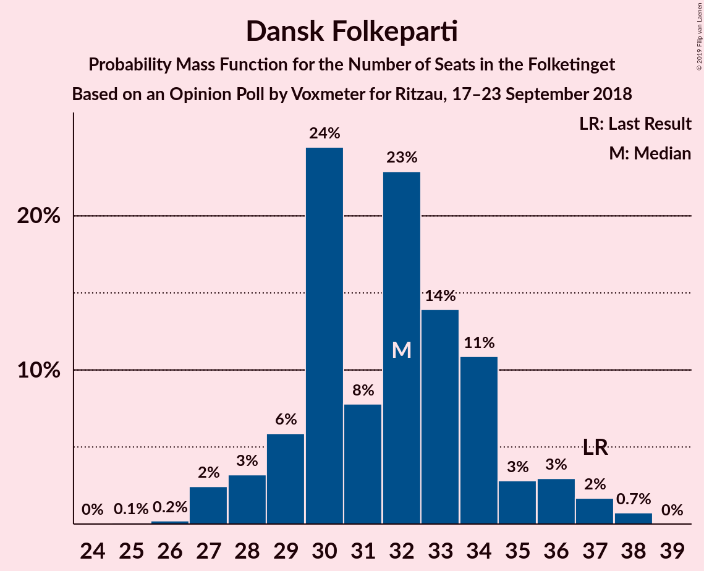
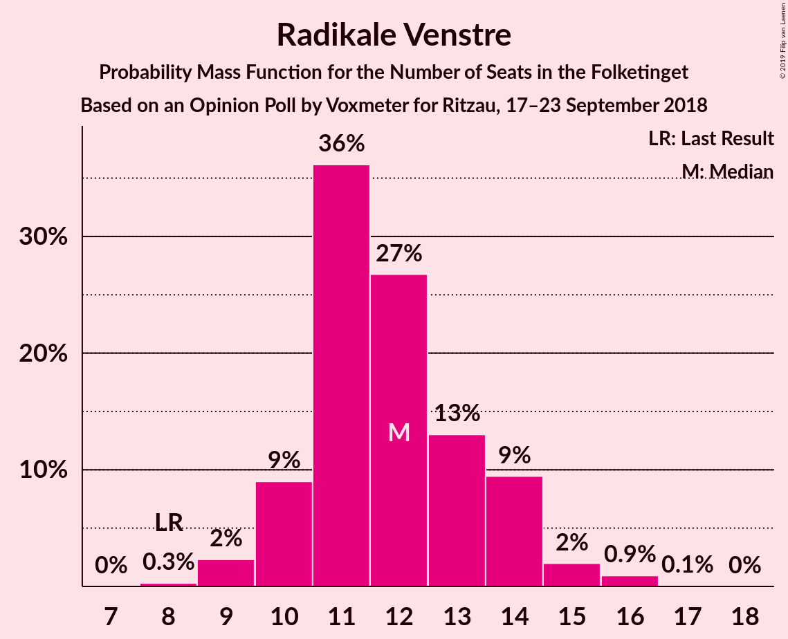
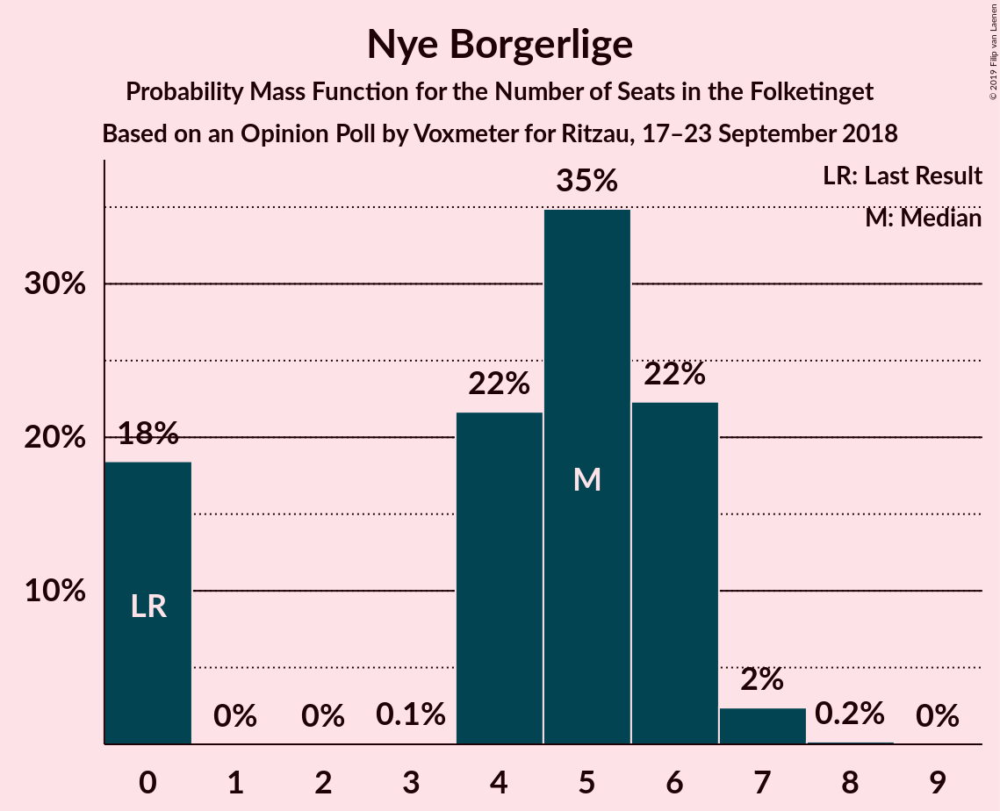
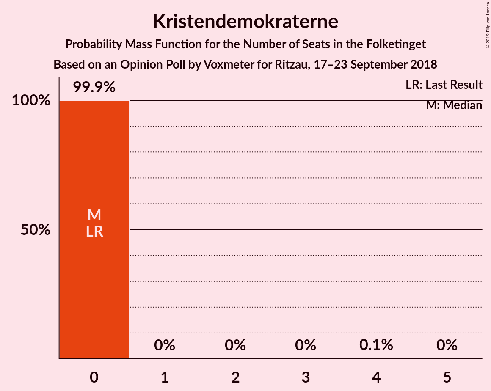

# Opinion Poll by Voxmeter for Ritzau, 17–23 September 2018

<a href="#voting-intentions">Voting Intentions</a> | <a href="#seats">Seats</a> | <a href="#coalitions">Coalitions</a> | <a href="#technical-information">Technical Information</a>

## Voting Intentions

### Confidence Intervals

| Party | Last Result | Poll Result | 80% Confidence Interval | 90% Confidence Interval | 95% Confidence Interval | 99% Confidence Interval |
|:-----:|:-----------:|:-----------:|:-----------------------:|:-----------------------:|:-----------------------:|:-----------------------:|
| Socialdemokraterne | 26.3% | 26.1% | 24.4–27.9% |23.9–28.4% |23.5–28.9% |22.7–29.7% |
| Venstre | 19.5% | 19.1% | 17.6–20.8% |17.2–21.2% |16.8–21.6% |16.2–22.4% |
| Dansk Folkeparti | 21.1% | 17.7% | 16.2–19.3% |15.8–19.7% |15.5–20.1% |14.8–20.9% |
| Enhedslisten–De Rød-Grønne | 7.8% | 7.9% | 7.0–9.1% |6.7–9.4% |6.4–9.7% |6.0–10.3% |
| Radikale Venstre | 4.6% | 6.7% | 5.8–7.8% |5.5–8.1% |5.3–8.4% |4.9–8.9% |
| Socialistisk Folkeparti | 4.2% | 5.3% | 4.5–6.3% |4.2–6.5% |4.1–6.8% |3.7–7.3% |
| Liberal Alliance | 7.5% | 5.1% | 4.3–6.1% |4.1–6.3% |3.9–6.6% |3.6–7.1% |
| Alternativet | 4.8% | 4.5% | 3.8–5.4% |3.6–5.7% |3.4–5.9% |3.1–6.4% |
| Det Konservative Folkeparti | 3.4% | 3.8% | 3.2–4.7% |3.0–5.0% |2.8–5.2% |2.5–5.6% |
| Nye Borgerlige | 0.0% | 2.6% | 2.0–3.3% |1.9–3.6% |1.8–3.7% |1.6–4.1% |
| Kristendemokraterne | 0.8% | 0.8% | 0.5–1.2% |0.4–1.4% |0.4–1.5% |0.3–1.8% |

*Note:* The poll result column reflects the actual value used in the calculations. Published results may vary slightly, and in addition be rounded to fewer digits.

## Seats

### Confidence Intervals

| Party | Last Result | Median | 80% Confidence Interval | 90% Confidence Interval | 95% Confidence Interval | 99% Confidence Interval |
|:-----:|:-----------:|:------:|:-----------------------:|:-----------------------:|:-----------------------:|:-----------------------:|
| <a href="#socialdemokraterne">Socialdemokraterne</a> | 47 | 45 | 45–47 |43–48 |43–48 |42–50 |
| <a href="#venstre">Venstre</a> | 34 | 34 | 31–35 |31–35 |31–35 |30–40 |
| <a href="#dansk-folkeparti">Dansk Folkeparti</a> | 37 | 30 | 30–34 |29–35 |29–37 |28–38 |
| <a href="#enhedslisten–de-rød-grønne">Enhedslisten–De Rød-Grønne</a> | 14 | 15 | 13–16 |12–16 |12–16 |11–16 |
| <a href="#radikale-venstre">Radikale Venstre</a> | 8 | 11 | 11–12 |11–13 |10–14 |9–14 |
| <a href="#socialistisk-folkeparti">Socialistisk Folkeparti</a> | 7 | 8 | 8–10 |8–10 |7–10 |7–11 |
| <a href="#liberal-alliance">Liberal Alliance</a> | 13 | 10 | 9–11 |8–12 |8–12 |7–12 |
| <a href="#alternativet">Alternativet</a> | 9 | 8 | 8–9 |7–9 |7–9 |7–10 |
| <a href="#det-konservative-folkeparti">Det Konservative Folkeparti</a> | 6 | 8 | 6–8 |5–8 |5–8 |5–8 |
| <a href="#nye-borgerlige">Nye Borgerlige</a> | 0 | 5 | 5–6 |4–6 |4–6 |0–6 |
| <a href="#kristendemokraterne">Kristendemokraterne</a> | 0 | 0 | 0 |0 |0 |0 |

### Socialdemokraterne

*For a full overview of the results for this party, see the [Socialdemokraterne](party-socialdemokraterne.html) page.*

| Number of Seats | Probability | Accumulated | Special Marks |
|:---------------:|:-----------:|:-----------:|:-------------:|
| 39 | 0.1% | 100% |  |
| 40 | 0.1% | 99.9% |  |
| 41 | 0% | 99.8% |  |
| 42 | 0.8% | 99.7% |  |
| 43 | 5% | 98.9% |  |
| 44 | 0.5% | 94% |  |
| 45 | 62% | 93% | Median |
| 46 | 21% | 31% |  |
| 47 | 4% | 11% | Last Result |
| 48 | 5% | 7% |  |
| 49 | 0.9% | 2% |  |
| 50 | 0.5% | 0.7% |  |
| 51 | 0% | 0.2% |  |
| 52 | 0.1% | 0.2% |  |
| 53 | 0% | 0.1% |  |
| 54 | 0% | 0.1% |  |
| 55 | 0% | 0% |  |

### Venstre

*For a full overview of the results for this party, see the [Venstre](party-venstre.html) page.*

| Number of Seats | Probability | Accumulated | Special Marks |
|:---------------:|:-----------:|:-----------:|:-------------:|
| 30 | 0.7% | 100% |  |
| 31 | 26% | 99.3% |  |
| 32 | 7% | 73% |  |
| 33 | 0.4% | 66% |  |
| 34 | 50% | 66% | Last Result, Median |
| 35 | 13% | 16% |  |
| 36 | 0.8% | 2% |  |
| 37 | 0.1% | 2% |  |
| 38 | 0% | 1.5% |  |
| 39 | 0.6% | 1.5% |  |
| 40 | 0.8% | 0.9% |  |
| 41 | 0% | 0% |  |

### Dansk Folkeparti

*For a full overview of the results for this party, see the [Dansk Folkeparti](party-danskfolkeparti.html) page.*

| Number of Seats | Probability | Accumulated | Special Marks |
|:---------------:|:-----------:|:-----------:|:-------------:|
| 26 | 0.1% | 100% |  |
| 27 | 0.3% | 99.8% |  |
| 28 | 0.7% | 99.5% |  |
| 29 | 6% | 98.9% |  |
| 30 | 58% | 93% | Median |
| 31 | 0.6% | 36% |  |
| 32 | 0.6% | 35% |  |
| 33 | 3% | 35% |  |
| 34 | 26% | 32% |  |
| 35 | 1.1% | 6% |  |
| 36 | 0.9% | 5% |  |
| 37 | 2% | 4% | Last Result |
| 38 | 2% | 2% |  |
| 39 | 0% | 0% |  |

### Enhedslisten–De Rød-Grønne

*For a full overview of the results for this party, see the [Enhedslisten–De Rød-Grønne](party-enhedslisten–derød-grønne.html) page.*

| Number of Seats | Probability | Accumulated | Special Marks |
|:---------------:|:-----------:|:-----------:|:-------------:|
| 10 | 0.2% | 100% |  |
| 11 | 0.3% | 99.8% |  |
| 12 | 5% | 99.4% |  |
| 13 | 31% | 94% |  |
| 14 | 2% | 63% | Last Result |
| 15 | 16% | 61% | Median |
| 16 | 45% | 45% |  |
| 17 | 0.2% | 0.4% |  |
| 18 | 0.2% | 0.2% |  |
| 19 | 0% | 0% |  |

### Radikale Venstre

*For a full overview of the results for this party, see the [Radikale Venstre](party-radikalevenstre.html) page.*

| Number of Seats | Probability | Accumulated | Special Marks |
|:---------------:|:-----------:|:-----------:|:-------------:|
| 8 | 0.2% | 100% | Last Result |
| 9 | 0.4% | 99.7% |  |
| 10 | 2% | 99.3% |  |
| 11 | 82% | 97% | Median |
| 12 | 6% | 15% |  |
| 13 | 5% | 9% |  |
| 14 | 4% | 4% |  |
| 15 | 0.4% | 0.5% |  |
| 16 | 0.1% | 0.1% |  |
| 17 | 0% | 0% |  |

### Socialistisk Folkeparti

*For a full overview of the results for this party, see the [Socialistisk Folkeparti](party-socialistiskfolkeparti.html) page.*

| Number of Seats | Probability | Accumulated | Special Marks |
|:---------------:|:-----------:|:-----------:|:-------------:|
| 6 | 0.2% | 100% |  |
| 7 | 4% | 99.8% | Last Result |
| 8 | 50% | 96% | Median |
| 9 | 35% | 46% |  |
| 10 | 9% | 10% |  |
| 11 | 0.8% | 1.1% |  |
| 12 | 0.2% | 0.3% |  |
| 13 | 0.1% | 0.1% |  |
| 14 | 0% | 0% |  |

### Liberal Alliance

*For a full overview of the results for this party, see the [Liberal Alliance](party-liberalalliance.html) page.*

| Number of Seats | Probability | Accumulated | Special Marks |
|:---------------:|:-----------:|:-----------:|:-------------:|
| 6 | 0.1% | 100% |  |
| 7 | 1.0% | 99.9% |  |
| 8 | 5% | 98.9% |  |
| 9 | 6% | 94% |  |
| 10 | 66% | 88% | Median |
| 11 | 17% | 22% |  |
| 12 | 6% | 6% |  |
| 13 | 0% | 0% | Last Result |

### Alternativet

*For a full overview of the results for this party, see the [Alternativet](party-alternativet.html) page.*

| Number of Seats | Probability | Accumulated | Special Marks |
|:---------------:|:-----------:|:-----------:|:-------------:|
| 5 | 0.1% | 100% |  |
| 6 | 0.2% | 99.9% |  |
| 7 | 6% | 99.7% |  |
| 8 | 83% | 94% | Median |
| 9 | 9% | 11% | Last Result |
| 10 | 2% | 2% |  |
| 11 | 0.2% | 0.2% |  |
| 12 | 0% | 0% |  |

### Det Konservative Folkeparti

*For a full overview of the results for this party, see the [Det Konservative Folkeparti](party-detkonservativefolkeparti.html) page.*

| Number of Seats | Probability | Accumulated | Special Marks |
|:---------------:|:-----------:|:-----------:|:-------------:|
| 4 | 0.2% | 100% |  |
| 5 | 7% | 99.8% |  |
| 6 | 18% | 93% | Last Result |
| 7 | 25% | 75% |  |
| 8 | 50% | 50% | Median |
| 9 | 0.3% | 0.3% |  |
| 10 | 0% | 0% |  |

### Nye Borgerlige

*For a full overview of the results for this party, see the [Nye Borgerlige](party-nyeborgerlige.html) page.*

| Number of Seats | Probability | Accumulated | Special Marks |
|:---------------:|:-----------:|:-----------:|:-------------:|
| 0 | 1.1% | 100% | Last Result |
| 1 | 0% | 98.9% |  |
| 2 | 0% | 98.9% |  |
| 3 | 0% | 98.9% |  |
| 4 | 6% | 98.8% |  |
| 5 | 66% | 93% | Median |
| 6 | 27% | 27% |  |
| 7 | 0.1% | 0.1% |  |
| 8 | 0% | 0% |  |

### Kristendemokraterne

*For a full overview of the results for this party, see the [Kristendemokraterne](party-kristendemokraterne.html) page.*

| Number of Seats | Probability | Accumulated | Special Marks |
|:---------------:|:-----------:|:-----------:|:-------------:|
| 0 | 100% | 100% | Last Result, Median |

## Coalitions

### Confidence Intervals

| Coalition | Last Result | Median | Majority? | 80% Confidence Interval | 90% Confidence Interval | 95% Confidence Interval | 99% Confidence Interval |
|:---------:|:-----------:|:------:|:---------:|:-----------------------:|:-----------------------:|:-----------------------:|:-----------------------:|
| Socialdemokraterne – Enhedslisten–De Rød-Grønne – Radikale Venstre – Socialistisk Folkeparti – Alternativet | 85 | 88 | 7% | 87–88 | 86–91 | 86–91 | 81–94 |
| Venstre – Dansk Folkeparti – Liberal Alliance – Det Konservative Folkeparti – Nye Borgerlige – Kristendemokraterne | 90 | 87 | 2% | 87–88 | 84–89 | 84–89 | 81–94 |
| Venstre – Dansk Folkeparti – Liberal Alliance – Det Konservative Folkeparti – Nye Borgerlige | 90 | 87 | 2% | 87–88 | 84–89 | 84–89 | 81–94 |
| Venstre – Dansk Folkeparti – Liberal Alliance – Det Konservative Folkeparti – Kristendemokraterne | 90 | 82 | 0.1% | 82–83 | 80–83 | 79–84 | 78–88 |
| Venstre – Dansk Folkeparti – Liberal Alliance – Det Konservative Folkeparti | 90 | 82 | 0.1% | 82–83 | 80–83 | 79–84 | 78–88 |
| Socialdemokraterne – Enhedslisten–De Rød-Grønne – Radikale Venstre – Socialistisk Folkeparti | 76 | 80 | 0.1% | 79–80 | 78–82 | 78–82 | 74–87 |
| Socialdemokraterne – Enhedslisten–De Rød-Grønne – Socialistisk Folkeparti – Alternativet | 77 | 77 | 0% | 75–77 | 74–78 | 73–79 | 69–83 |
| Socialdemokraterne – Enhedslisten–De Rød-Grønne – Socialistisk Folkeparti | 68 | 69 | 0% | 66–69 | 66–69 | 66–71 | 62–75 |
| Socialdemokraterne – Radikale Venstre – Socialistisk Folkeparti | 62 | 65 | 0% | 64–67 | 64–68 | 64–69 | 62–72 |
| Socialdemokraterne – Radikale Venstre | 55 | 56 | 0% | 56–58 | 55–60 | 55–62 | 54–62 |
| Venstre – Liberal Alliance – Det Konservative Folkeparti | 53 | 52 | 0% | 47–52 | 46–54 | 45–54 | 45–55 |
| Venstre – Det Konservative Folkeparti | 40 | 42 | 0% | 38–42 | 37–42 | 37–42 | 36–46 |
| Venstre | 34 | 34 | 0% | 31–35 | 31–35 | 31–35 | 30–40 |

### Socialdemokraterne – Enhedslisten–De Rød-Grønne – Radikale Venstre – Socialistisk Folkeparti – Alternativet

| Number of Seats | Probability | Accumulated | Special Marks |
|:---------------:|:-----------:|:-----------:|:-------------:|
| 81 | 0.8% | 100% |  |
| 82 | 0% | 99.1% |  |
| 83 | 0% | 99.1% |  |
| 84 | 0.4% | 99.1% |  |
| 85 | 0.3% | 98.7% | Last Result |
| 86 | 4% | 98% |  |
| 87 | 25% | 94% | Median |
| 88 | 61% | 69% |  |
| 89 | 1.1% | 9% |  |
| 90 | 2% | 7% | Majority |
| 91 | 3% | 5% |  |
| 92 | 0.1% | 2% |  |
| 93 | 0.4% | 2% |  |
| 94 | 1.0% | 1.2% |  |
| 95 | 0.1% | 0.2% |  |
| 96 | 0% | 0.1% |  |
| 97 | 0.1% | 0.1% |  |
| 98 | 0% | 0% |  |

### Venstre – Dansk Folkeparti – Liberal Alliance – Det Konservative Folkeparti – Nye Borgerlige – Kristendemokraterne

| Number of Seats | Probability | Accumulated | Special Marks |
|:---------------:|:-----------:|:-----------:|:-------------:|
| 78 | 0.1% | 100% |  |
| 79 | 0% | 99.9% |  |
| 80 | 0.1% | 99.9% |  |
| 81 | 1.0% | 99.8% |  |
| 82 | 0.4% | 98.8% |  |
| 83 | 0.1% | 98% |  |
| 84 | 3% | 98% |  |
| 85 | 2% | 95% |  |
| 86 | 1.1% | 93% |  |
| 87 | 61% | 91% | Median |
| 88 | 25% | 31% |  |
| 89 | 4% | 6% |  |
| 90 | 0.3% | 2% | Last Result, Majority |
| 91 | 0.4% | 1.3% |  |
| 92 | 0% | 0.9% |  |
| 93 | 0% | 0.9% |  |
| 94 | 0.8% | 0.9% |  |
| 95 | 0% | 0% |  |

### Venstre – Dansk Folkeparti – Liberal Alliance – Det Konservative Folkeparti – Nye Borgerlige

| Number of Seats | Probability | Accumulated | Special Marks |
|:---------------:|:-----------:|:-----------:|:-------------:|
| 78 | 0.1% | 100% |  |
| 79 | 0% | 99.9% |  |
| 80 | 0.1% | 99.9% |  |
| 81 | 1.0% | 99.8% |  |
| 82 | 0.4% | 98.8% |  |
| 83 | 0.1% | 98% |  |
| 84 | 3% | 98% |  |
| 85 | 2% | 95% |  |
| 86 | 1.1% | 93% |  |
| 87 | 61% | 91% | Median |
| 88 | 25% | 31% |  |
| 89 | 4% | 6% |  |
| 90 | 0.3% | 2% | Last Result, Majority |
| 91 | 0.4% | 1.3% |  |
| 92 | 0% | 0.9% |  |
| 93 | 0% | 0.9% |  |
| 94 | 0.8% | 0.9% |  |
| 95 | 0% | 0% |  |

### Venstre – Dansk Folkeparti – Liberal Alliance – Det Konservative Folkeparti – Kristendemokraterne

| Number of Seats | Probability | Accumulated | Special Marks |
|:---------------:|:-----------:|:-----------:|:-------------:|
| 74 | 0.1% | 100% |  |
| 75 | 0% | 99.9% |  |
| 76 | 0.1% | 99.9% |  |
| 77 | 0.1% | 99.8% |  |
| 78 | 0.5% | 99.7% |  |
| 79 | 2% | 99.2% |  |
| 80 | 3% | 97% |  |
| 81 | 3% | 94% |  |
| 82 | 78% | 90% | Median |
| 83 | 8% | 12% |  |
| 84 | 2% | 4% |  |
| 85 | 0.4% | 2% |  |
| 86 | 0.4% | 1.3% |  |
| 87 | 0% | 0.9% |  |
| 88 | 0.8% | 0.9% |  |
| 89 | 0% | 0.1% |  |
| 90 | 0% | 0.1% | Last Result, Majority |
| 91 | 0% | 0% |  |

### Venstre – Dansk Folkeparti – Liberal Alliance – Det Konservative Folkeparti

| Number of Seats | Probability | Accumulated | Special Marks |
|:---------------:|:-----------:|:-----------:|:-------------:|
| 74 | 0.1% | 100% |  |
| 75 | 0% | 99.9% |  |
| 76 | 0.1% | 99.9% |  |
| 77 | 0.1% | 99.8% |  |
| 78 | 0.5% | 99.7% |  |
| 79 | 2% | 99.2% |  |
| 80 | 3% | 97% |  |
| 81 | 3% | 94% |  |
| 82 | 78% | 90% | Median |
| 83 | 8% | 12% |  |
| 84 | 2% | 4% |  |
| 85 | 0.4% | 2% |  |
| 86 | 0.4% | 1.3% |  |
| 87 | 0% | 0.9% |  |
| 88 | 0.8% | 0.9% |  |
| 89 | 0% | 0.1% |  |
| 90 | 0% | 0.1% | Last Result, Majority |
| 91 | 0% | 0% |  |

### Socialdemokraterne – Enhedslisten–De Rød-Grønne – Radikale Venstre – Socialistisk Folkeparti

| Number of Seats | Probability | Accumulated | Special Marks |
|:---------------:|:-----------:|:-----------:|:-------------:|
| 73 | 0% | 100% |  |
| 74 | 0.8% | 99.9% |  |
| 75 | 0.2% | 99.1% |  |
| 76 | 0.5% | 98.9% | Last Result |
| 77 | 0.2% | 98% |  |
| 78 | 6% | 98% |  |
| 79 | 25% | 92% | Median |
| 80 | 60% | 67% |  |
| 81 | 0.6% | 8% |  |
| 82 | 5% | 7% |  |
| 83 | 0.5% | 2% |  |
| 84 | 0.1% | 2% |  |
| 85 | 0.4% | 2% |  |
| 86 | 0.1% | 1.2% |  |
| 87 | 0.9% | 1.1% |  |
| 88 | 0.1% | 0.2% |  |
| 89 | 0.1% | 0.2% |  |
| 90 | 0.1% | 0.1% | Majority |
| 91 | 0% | 0% |  |

### Socialdemokraterne – Enhedslisten–De Rød-Grønne – Socialistisk Folkeparti – Alternativet

| Number of Seats | Probability | Accumulated | Special Marks |
|:---------------:|:-----------:|:-----------:|:-------------:|
| 69 | 0.8% | 100% |  |
| 70 | 0% | 99.2% |  |
| 71 | 0.1% | 99.2% |  |
| 72 | 0% | 99.1% |  |
| 73 | 4% | 99.0% |  |
| 74 | 0.5% | 95% |  |
| 75 | 6% | 95% |  |
| 76 | 20% | 89% | Median |
| 77 | 63% | 68% | Last Result |
| 78 | 1.1% | 6% |  |
| 79 | 2% | 4% |  |
| 80 | 0.2% | 2% |  |
| 81 | 1.2% | 2% |  |
| 82 | 0.1% | 0.6% |  |
| 83 | 0.4% | 0.6% |  |
| 84 | 0.1% | 0.2% |  |
| 85 | 0% | 0% |  |

### Socialdemokraterne – Enhedslisten–De Rød-Grønne – Socialistisk Folkeparti

| Number of Seats | Probability | Accumulated | Special Marks |
|:---------------:|:-----------:|:-----------:|:-------------:|
| 62 | 0.8% | 100% |  |
| 63 | 0.1% | 99.1% |  |
| 64 | 0% | 99.1% |  |
| 65 | 0.5% | 99.0% |  |
| 66 | 10% | 98.6% |  |
| 67 | 0.5% | 89% |  |
| 68 | 24% | 88% | Last Result, Median |
| 69 | 60% | 64% |  |
| 70 | 0.3% | 4% |  |
| 71 | 2% | 4% |  |
| 72 | 0.4% | 2% |  |
| 73 | 0.1% | 2% |  |
| 74 | 0.9% | 2% |  |
| 75 | 0.5% | 0.7% |  |
| 76 | 0.1% | 0.1% |  |
| 77 | 0% | 0% |  |

### Socialdemokraterne – Radikale Venstre – Socialistisk Folkeparti

| Number of Seats | Probability | Accumulated | Special Marks |
|:---------------:|:-----------:|:-----------:|:-------------:|
| 59 | 0.1% | 100% |  |
| 60 | 0.1% | 99.9% |  |
| 61 | 0.1% | 99.8% |  |
| 62 | 1.0% | 99.8% | Last Result |
| 63 | 0.3% | 98.7% |  |
| 64 | 45% | 98% | Median |
| 65 | 19% | 53% |  |
| 66 | 23% | 34% |  |
| 67 | 4% | 12% |  |
| 68 | 3% | 8% |  |
| 69 | 3% | 5% |  |
| 70 | 0.3% | 2% |  |
| 71 | 0.5% | 2% |  |
| 72 | 1.0% | 1.2% |  |
| 73 | 0% | 0.2% |  |
| 74 | 0% | 0.2% |  |
| 75 | 0.1% | 0.2% |  |
| 76 | 0% | 0.1% |  |
| 77 | 0.1% | 0.1% |  |
| 78 | 0% | 0% |  |

### Socialdemokraterne – Radikale Venstre

| Number of Seats | Probability | Accumulated | Special Marks |
|:---------------:|:-----------:|:-----------:|:-------------:|
| 49 | 0.1% | 100% |  |
| 50 | 0% | 99.9% |  |
| 51 | 0% | 99.9% |  |
| 52 | 0% | 99.9% |  |
| 53 | 0.1% | 99.8% |  |
| 54 | 1.4% | 99.7% |  |
| 55 | 5% | 98% | Last Result |
| 56 | 58% | 93% | Median |
| 57 | 21% | 35% |  |
| 58 | 7% | 14% |  |
| 59 | 2% | 8% |  |
| 60 | 1.1% | 5% |  |
| 61 | 0.1% | 4% |  |
| 62 | 4% | 4% |  |
| 63 | 0% | 0.3% |  |
| 64 | 0.1% | 0.2% |  |
| 65 | 0% | 0.1% |  |
| 66 | 0% | 0.1% |  |
| 67 | 0% | 0.1% |  |
| 68 | 0.1% | 0.1% |  |
| 69 | 0% | 0% |  |

### Venstre – Liberal Alliance – Det Konservative Folkeparti

| Number of Seats | Probability | Accumulated | Special Marks |
|:---------------:|:-----------:|:-----------:|:-------------:|
| 45 | 3% | 100% |  |
| 46 | 4% | 97% |  |
| 47 | 5% | 93% |  |
| 48 | 21% | 88% |  |
| 49 | 0.4% | 66% |  |
| 50 | 0.1% | 66% |  |
| 51 | 0.7% | 65% |  |
| 52 | 57% | 65% | Median |
| 53 | 0.4% | 7% | Last Result |
| 54 | 7% | 7% |  |
| 55 | 0.4% | 0.6% |  |
| 56 | 0% | 0.1% |  |
| 57 | 0% | 0.1% |  |
| 58 | 0% | 0% |  |

### Venstre – Det Konservative Folkeparti

| Number of Seats | Probability | Accumulated | Special Marks |
|:---------------:|:-----------:|:-----------:|:-------------:|
| 36 | 2% | 100% |  |
| 37 | 5% | 98% |  |
| 38 | 27% | 93% |  |
| 39 | 0.5% | 66% |  |
| 40 | 0.3% | 66% | Last Result |
| 41 | 14% | 65% |  |
| 42 | 50% | 52% | Median |
| 43 | 0.4% | 2% |  |
| 44 | 0.1% | 2% |  |
| 45 | 0.4% | 2% |  |
| 46 | 0.9% | 1.1% |  |
| 47 | 0.2% | 0.3% |  |
| 48 | 0% | 0.1% |  |
| 49 | 0% | 0% |  |

### Venstre

| Number of Seats | Probability | Accumulated | Special Marks |
|:---------------:|:-----------:|:-----------:|:-------------:|
| 30 | 0.7% | 100% |  |
| 31 | 26% | 99.3% |  |
| 32 | 7% | 73% |  |
| 33 | 0.4% | 66% |  |
| 34 | 50% | 66% | Last Result, Median |
| 35 | 13% | 16% |  |
| 36 | 0.8% | 2% |  |
| 37 | 0.1% | 2% |  |
| 38 | 0% | 1.5% |  |
| 39 | 0.6% | 1.5% |  |
| 40 | 0.8% | 0.9% |  |
| 41 | 0% | 0% |  |

## Technical Information

### Opinion Poll

+ **Polling firm:** Voxmeter
+ **Commissioner(s):** Ritzau
+ **Fieldwork period:** 17–23 September 2018

### Calculations

+ **Sample size:** 1046
+ **Simulations done:** 131,072
+ **Error estimate:** 1.94%

