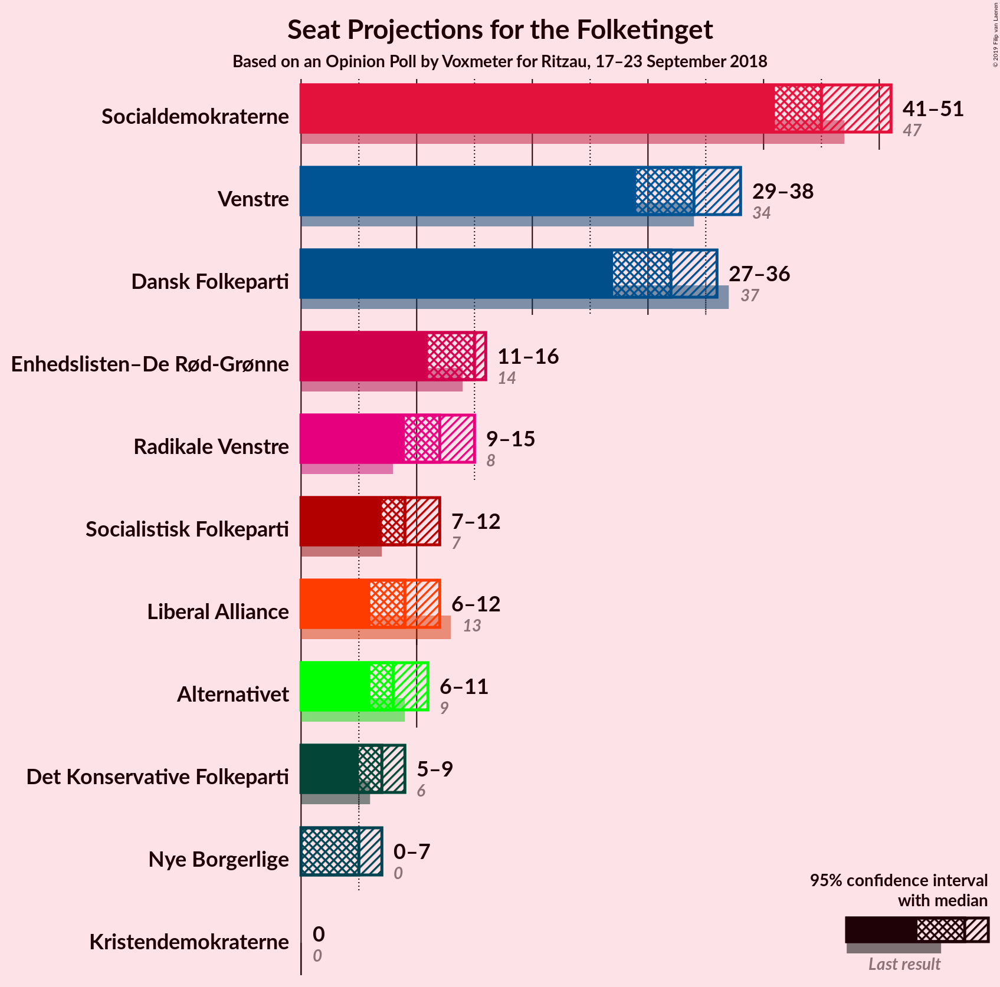
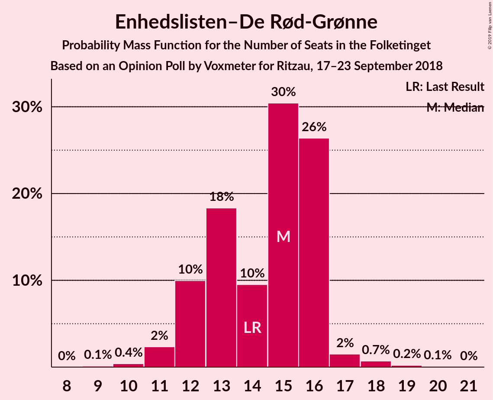
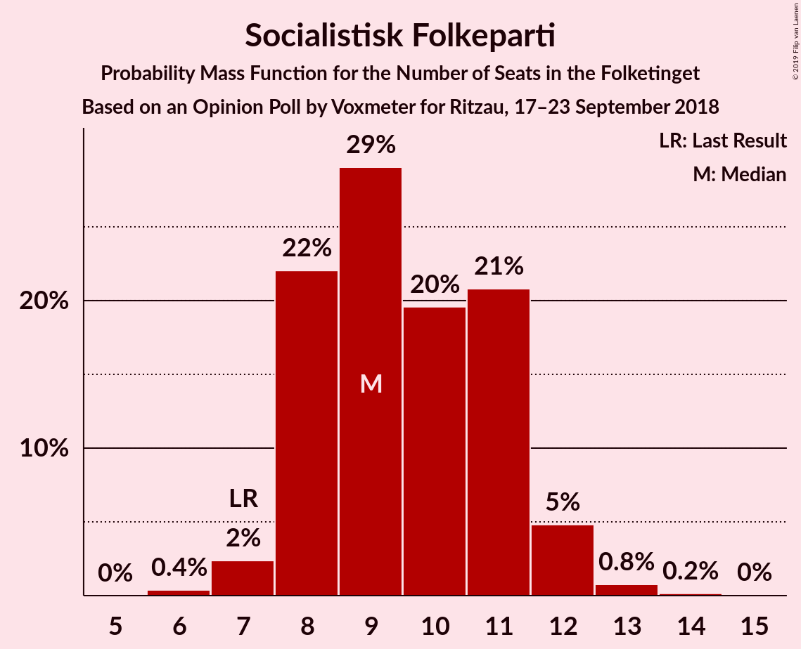
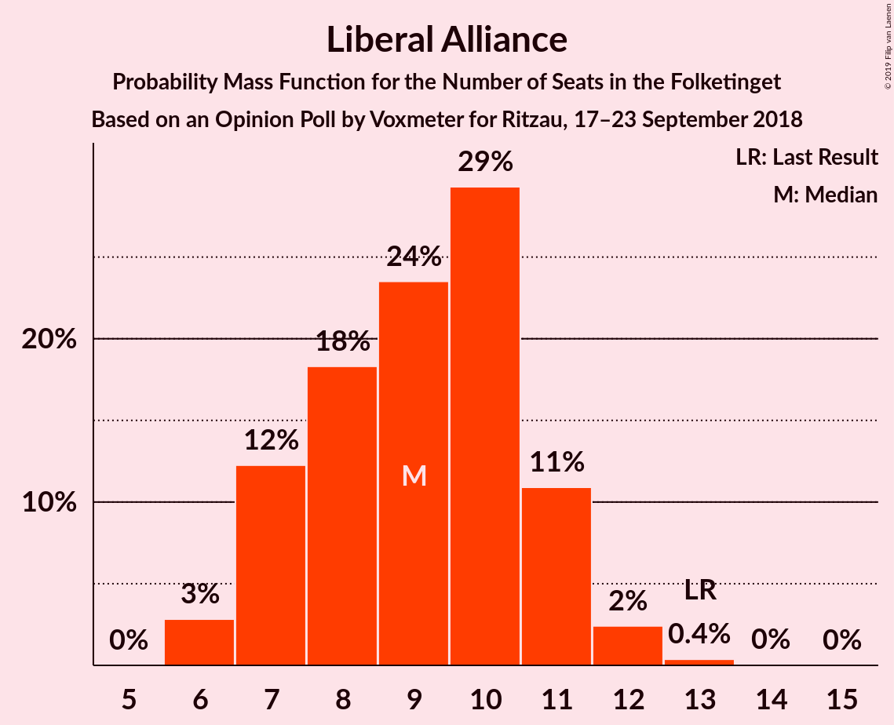
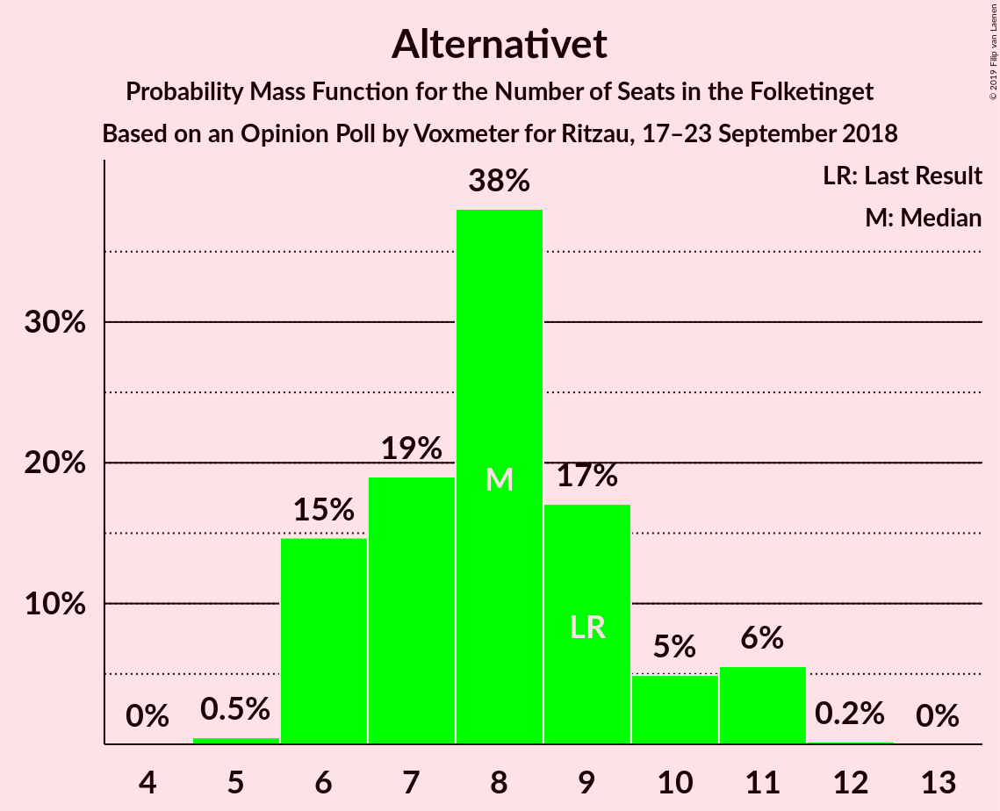

# Opinion Poll by Voxmeter for Ritzau, 17–23 September 2018

<a href="#voting-intentions">Voting Intentions</a> | <a href="#seats">Seats</a> | <a href="#coalitions">Coalitions</a> | <a href="#technical-information">Technical Information</a>

## Voting Intentions

### Confidence Intervals

| Party | Last Result | Poll Result | 80% Confidence Interval | 90% Confidence Interval | 95% Confidence Interval | 99% Confidence Interval |
|:-----:|:-----------:|:-----------:|:-----------------------:|:-----------------------:|:-----------------------:|:-----------------------:|
| Socialdemokraterne | 26.3% | 26.1% | 24.4–27.9% |23.9–28.4% |23.5–28.9% |22.7–29.7% |
| Venstre | 19.5% | 19.1% | 17.6–20.8% |17.2–21.2% |16.8–21.6% |16.2–22.4% |
| Dansk Folkeparti | 21.1% | 17.7% | 16.2–19.3% |15.8–19.7% |15.5–20.1% |14.8–20.9% |
| Enhedslisten–De Rød-Grønne | 7.8% | 7.9% | 7.0–9.1% |6.7–9.4% |6.4–9.7% |6.0–10.3% |
| Radikale Venstre | 4.6% | 6.7% | 5.8–7.8% |5.5–8.1% |5.3–8.4% |4.9–8.9% |
| Socialistisk Folkeparti | 4.2% | 5.3% | 4.5–6.3% |4.2–6.5% |4.1–6.8% |3.7–7.3% |
| Liberal Alliance | 7.5% | 5.1% | 4.3–6.1% |4.1–6.3% |3.9–6.6% |3.6–7.1% |
| Alternativet | 4.8% | 4.5% | 3.8–5.4% |3.6–5.7% |3.4–5.9% |3.1–6.4% |
| Det Konservative Folkeparti | 3.4% | 3.8% | 3.2–4.7% |3.0–5.0% |2.8–5.2% |2.5–5.6% |
| Nye Borgerlige | 0.0% | 2.6% | 2.0–3.3% |1.9–3.6% |1.8–3.7% |1.6–4.1% |
| Kristendemokraterne | 0.8% | 0.8% | 0.5–1.2% |0.4–1.4% |0.4–1.5% |0.3–1.8% |

*Note:* The poll result column reflects the actual value used in the calculations. Published results may vary slightly, and in addition be rounded to fewer digits.

## Seats

### Confidence Intervals

| Party | Last Result | Median | 80% Confidence Interval | 90% Confidence Interval | 95% Confidence Interval | 99% Confidence Interval |
|:-----:|:-----------:|:------:|:-----------------------:|:-----------------------:|:-----------------------:|:-----------------------:|
| <a href="#socialdemokraterne">Socialdemokraterne</a> | 47 | 45 | 42–49 |42–49 |41–51 |40–52 |
| <a href="#venstre">Venstre</a> | 34 | 34 | 30–37 |30–38 |29–38 |28–39 |
| <a href="#dansk-folkeparti">Dansk Folkeparti</a> | 37 | 32 | 29–34 |28–36 |27–36 |27–38 |
| <a href="#enhedslisten–de-rød-grønne">Enhedslisten–De Rød-Grønne</a> | 14 | 15 | 12–16 |12–16 |11–16 |10–18 |
| <a href="#radikale-venstre">Radikale Venstre</a> | 8 | 12 | 10–14 |10–14 |9–15 |9–16 |
| <a href="#socialistisk-folkeparti">Socialistisk Folkeparti</a> | 7 | 9 | 8–11 |8–12 |7–12 |7–13 |
| <a href="#liberal-alliance">Liberal Alliance</a> | 13 | 9 | 7–11 |7–11 |6–12 |6–12 |
| <a href="#alternativet">Alternativet</a> | 9 | 8 | 6–10 |6–11 |6–11 |6–11 |
| <a href="#det-konservative-folkeparti">Det Konservative Folkeparti</a> | 6 | 7 | 6–8 |5–9 |5–9 |5–10 |
| <a href="#nye-borgerlige">Nye Borgerlige</a> | 0 | 5 | 0–6 |0–6 |0–7 |0–7 |
| <a href="#kristendemokraterne">Kristendemokraterne</a> | 0 | 0 | 0 |0 |0 |0 |

### Socialdemokraterne

*For a full overview of the results for this party, see the [Socialdemokraterne](party-socialdemokraterne.html) page.*

| Number of Seats | Probability | Accumulated | Special Marks |
|:---------------:|:-----------:|:-----------:|:-------------:|
| 39 | 0.1% | 100% |  |
| 40 | 2% | 99.9% |  |
| 41 | 2% | 98% |  |
| 42 | 8% | 96% |  |
| 43 | 5% | 88% |  |
| 44 | 7% | 83% |  |
| 45 | 26% | 76% | Median |
| 46 | 25% | 50% |  |
| 47 | 8% | 25% | Last Result |
| 48 | 4% | 16% |  |
| 49 | 8% | 13% |  |
| 50 | 2% | 5% |  |
| 51 | 2% | 3% |  |
| 52 | 0.5% | 0.9% |  |
| 53 | 0.3% | 0.4% |  |
| 54 | 0% | 0.1% |  |
| 55 | 0% | 0% |  |

### Venstre

*For a full overview of the results for this party, see the [Venstre](party-venstre.html) page.*

| Number of Seats | Probability | Accumulated | Special Marks |
|:---------------:|:-----------:|:-----------:|:-------------:|
| 27 | 0.1% | 100% |  |
| 28 | 1.4% | 99.9% |  |
| 29 | 3% | 98.5% |  |
| 30 | 7% | 96% |  |
| 31 | 15% | 89% |  |
| 32 | 7% | 73% |  |
| 33 | 4% | 66% |  |
| 34 | 22% | 62% | Last Result, Median |
| 35 | 9% | 40% |  |
| 36 | 6% | 32% |  |
| 37 | 20% | 25% |  |
| 38 | 3% | 5% |  |
| 39 | 2% | 2% |  |
| 40 | 0.4% | 0.5% |  |
| 41 | 0% | 0% |  |

### Dansk Folkeparti

*For a full overview of the results for this party, see the [Dansk Folkeparti](party-danskfolkeparti.html) page.*

| Number of Seats | Probability | Accumulated | Special Marks |
|:---------------:|:-----------:|:-----------:|:-------------:|
| 25 | 0.1% | 100% |  |
| 26 | 0.2% | 99.9% |  |
| 27 | 2% | 99.7% |  |
| 28 | 3% | 97% |  |
| 29 | 6% | 94% |  |
| 30 | 24% | 88% |  |
| 31 | 8% | 64% |  |
| 32 | 23% | 56% | Median |
| 33 | 14% | 33% |  |
| 34 | 11% | 19% |  |
| 35 | 3% | 8% |  |
| 36 | 3% | 5% |  |
| 37 | 2% | 2% | Last Result |
| 38 | 0.7% | 0.7% |  |
| 39 | 0% | 0% |  |

### Enhedslisten–De Rød-Grønne

*For a full overview of the results for this party, see the [Enhedslisten–De Rød-Grønne](party-enhedslisten–derød-grønne.html) page.*

| Number of Seats | Probability | Accumulated | Special Marks |
|:---------------:|:-----------:|:-----------:|:-------------:|
| 9 | 0.1% | 100% |  |
| 10 | 0.4% | 99.9% |  |
| 11 | 2% | 99.5% |  |
| 12 | 10% | 97% |  |
| 13 | 18% | 87% |  |
| 14 | 10% | 69% | Last Result |
| 15 | 30% | 59% | Median |
| 16 | 26% | 29% |  |
| 17 | 2% | 2% |  |
| 18 | 0.7% | 1.0% |  |
| 19 | 0.2% | 0.3% |  |
| 20 | 0.1% | 0.1% |  |
| 21 | 0% | 0% |  |

### Radikale Venstre

*For a full overview of the results for this party, see the [Radikale Venstre](party-radikalevenstre.html) page.*

| Number of Seats | Probability | Accumulated | Special Marks |
|:---------------:|:-----------:|:-----------:|:-------------:|
| 8 | 0.3% | 100% | Last Result |
| 9 | 2% | 99.7% |  |
| 10 | 9% | 97% |  |
| 11 | 36% | 88% |  |
| 12 | 27% | 52% | Median |
| 13 | 13% | 25% |  |
| 14 | 9% | 12% |  |
| 15 | 2% | 3% |  |
| 16 | 0.9% | 1.0% |  |
| 17 | 0.1% | 0.1% |  |
| 18 | 0% | 0% |  |

### Socialistisk Folkeparti

*For a full overview of the results for this party, see the [Socialistisk Folkeparti](party-socialistiskfolkeparti.html) page.*

| Number of Seats | Probability | Accumulated | Special Marks |
|:---------------:|:-----------:|:-----------:|:-------------:|
| 6 | 0.4% | 100% |  |
| 7 | 2% | 99.6% | Last Result |
| 8 | 22% | 97% |  |
| 9 | 29% | 75% | Median |
| 10 | 20% | 46% |  |
| 11 | 21% | 27% |  |
| 12 | 5% | 6% |  |
| 13 | 0.8% | 1.0% |  |
| 14 | 0.2% | 0.2% |  |
| 15 | 0% | 0% |  |

### Liberal Alliance

*For a full overview of the results for this party, see the [Liberal Alliance](party-liberalalliance.html) page.*

| Number of Seats | Probability | Accumulated | Special Marks |
|:---------------:|:-----------:|:-----------:|:-------------:|
| 6 | 3% | 100% |  |
| 7 | 12% | 97% |  |
| 8 | 18% | 85% |  |
| 9 | 24% | 67% | Median |
| 10 | 29% | 43% |  |
| 11 | 11% | 14% |  |
| 12 | 2% | 3% |  |
| 13 | 0.4% | 0.4% | Last Result |
| 14 | 0% | 0.1% |  |
| 15 | 0% | 0% |  |

### Alternativet

*For a full overview of the results for this party, see the [Alternativet](party-alternativet.html) page.*

| Number of Seats | Probability | Accumulated | Special Marks |
|:---------------:|:-----------:|:-----------:|:-------------:|
| 5 | 0.5% | 100% |  |
| 6 | 15% | 99.5% |  |
| 7 | 19% | 85% |  |
| 8 | 38% | 66% | Median |
| 9 | 17% | 28% | Last Result |
| 10 | 5% | 11% |  |
| 11 | 6% | 6% |  |
| 12 | 0.2% | 0.2% |  |
| 13 | 0% | 0% |  |

### Det Konservative Folkeparti

*For a full overview of the results for this party, see the [Det Konservative Folkeparti](party-detkonservativefolkeparti.html) page.*

| Number of Seats | Probability | Accumulated | Special Marks |
|:---------------:|:-----------:|:-----------:|:-------------:|
| 4 | 0.5% | 100% |  |
| 5 | 6% | 99.5% |  |
| 6 | 27% | 93% | Last Result |
| 7 | 36% | 66% | Median |
| 8 | 24% | 30% |  |
| 9 | 4% | 6% |  |
| 10 | 2% | 2% |  |
| 11 | 0.1% | 0.1% |  |
| 12 | 0% | 0% |  |

### Nye Borgerlige

*For a full overview of the results for this party, see the [Nye Borgerlige](party-nyeborgerlige.html) page.*

| Number of Seats | Probability | Accumulated | Special Marks |
|:---------------:|:-----------:|:-----------:|:-------------:|
| 0 | 18% | 100% | Last Result |
| 1 | 0% | 82% |  |
| 2 | 0% | 82% |  |
| 3 | 0.1% | 82% |  |
| 4 | 22% | 81% |  |
| 5 | 35% | 60% | Median |
| 6 | 22% | 25% |  |
| 7 | 2% | 3% |  |
| 8 | 0.2% | 0.2% |  |
| 9 | 0% | 0% |  |

### Kristendemokraterne

*For a full overview of the results for this party, see the [Kristendemokraterne](party-kristendemokraterne.html) page.*

| Number of Seats | Probability | Accumulated | Special Marks |
|:---------------:|:-----------:|:-----------:|:-------------:|
| 0 | 99.9% | 100% | Last Result, Median |
| 1 | 0% | 0.1% |  |
| 2 | 0% | 0.1% |  |
| 3 | 0% | 0.1% |  |
| 4 | 0.1% | 0.1% |  |
| 5 | 0% | 0% |  |

## Coalitions

### Confidence Intervals

| Coalition | Last Result | Median | Majority? | 80% Confidence Interval | 90% Confidence Interval | 95% Confidence Interval | 99% Confidence Interval |
|:---------:|:-----------:|:------:|:---------:|:-----------------------:|:-----------------------:|:-----------------------:|:-----------------------:|
| Socialdemokraterne – Enhedslisten–De Rød-Grønne – Radikale Venstre – Socialistisk Folkeparti – Alternativet | 85 | 89 | 44% | 86–94 | 85–95 | 84–95 | 83–96 |
| Venstre – Dansk Folkeparti – Liberal Alliance – Det Konservative Folkeparti – Nye Borgerlige – Kristendemokraterne | 90 | 86 | 5% | 81–89 | 80–90 | 80–91 | 79–92 |
| Venstre – Dansk Folkeparti – Liberal Alliance – Det Konservative Folkeparti – Nye Borgerlige | 90 | 86 | 5% | 81–89 | 80–90 | 80–91 | 79–92 |
| Socialdemokraterne – Enhedslisten–De Rød-Grønne – Radikale Venstre – Socialistisk Folkeparti | 76 | 80 | 0.1% | 78–85 | 76–86 | 76–87 | 74–88 |
| Venstre – Dansk Folkeparti – Liberal Alliance – Det Konservative Folkeparti – Kristendemokraterne | 90 | 82 | 0.2% | 77–85 | 76–85 | 76–86 | 74–89 |
| Venstre – Dansk Folkeparti – Liberal Alliance – Det Konservative Folkeparti | 90 | 82 | 0.2% | 77–85 | 76–85 | 76–86 | 74–89 |
| Socialdemokraterne – Enhedslisten–De Rød-Grønne – Socialistisk Folkeparti – Alternativet | 77 | 77 | 0% | 74–81 | 73–82 | 71–83 | 70–85 |
| Socialdemokraterne – Enhedslisten–De Rød-Grønne – Socialistisk Folkeparti | 68 | 69 | 0% | 66–72 | 65–74 | 63–74 | 62–76 |
| Socialdemokraterne – Radikale Venstre – Socialistisk Folkeparti | 62 | 66 | 0% | 64–70 | 63–71 | 62–73 | 61–75 |
| Socialdemokraterne – Radikale Venstre | 55 | 57 | 0% | 54–61 | 54–62 | 53–63 | 52–65 |
| Venstre – Liberal Alliance – Det Konservative Folkeparti | 53 | 51 | 0% | 45–53 | 44–54 | 44–55 | 43–56 |
| Venstre – Det Konservative Folkeparti | 40 | 42 | 0% | 36–44 | 36–45 | 36–45 | 35–46 |
| Venstre | 34 | 34 | 0% | 30–37 | 30–38 | 29–38 | 28–39 |

### Socialdemokraterne – Enhedslisten–De Rød-Grønne – Radikale Venstre – Socialistisk Folkeparti – Alternativet

| Number of Seats | Probability | Accumulated | Special Marks |
|:---------------:|:-----------:|:-----------:|:-------------:|
| 80 | 0% | 100% |  |
| 81 | 0.3% | 99.9% |  |
| 82 | 0.1% | 99.7% |  |
| 83 | 2% | 99.6% |  |
| 84 | 0.7% | 98% |  |
| 85 | 3% | 97% | Last Result |
| 86 | 10% | 95% |  |
| 87 | 12% | 85% |  |
| 88 | 22% | 73% |  |
| 89 | 7% | 51% | Median |
| 90 | 17% | 44% | Majority |
| 91 | 8% | 27% |  |
| 92 | 4% | 19% |  |
| 93 | 4% | 15% |  |
| 94 | 3% | 11% |  |
| 95 | 7% | 8% |  |
| 96 | 0.6% | 1.0% |  |
| 97 | 0.2% | 0.4% |  |
| 98 | 0.1% | 0.1% |  |
| 99 | 0% | 0% |  |

### Venstre – Dansk Folkeparti – Liberal Alliance – Det Konservative Folkeparti – Nye Borgerlige – Kristendemokraterne

| Number of Seats | Probability | Accumulated | Special Marks |
|:---------------:|:-----------:|:-----------:|:-------------:|
| 77 | 0.1% | 100% |  |
| 78 | 0.2% | 99.9% |  |
| 79 | 0.6% | 99.6% |  |
| 80 | 7% | 99.0% |  |
| 81 | 3% | 92% |  |
| 82 | 4% | 89% |  |
| 83 | 4% | 85% |  |
| 84 | 8% | 81% |  |
| 85 | 17% | 73% |  |
| 86 | 7% | 56% |  |
| 87 | 22% | 49% | Median |
| 88 | 12% | 27% |  |
| 89 | 10% | 15% |  |
| 90 | 3% | 5% | Last Result, Majority |
| 91 | 0.7% | 3% |  |
| 92 | 2% | 2% |  |
| 93 | 0.1% | 0.4% |  |
| 94 | 0.3% | 0.3% |  |
| 95 | 0% | 0.1% |  |
| 96 | 0% | 0% |  |

### Venstre – Dansk Folkeparti – Liberal Alliance – Det Konservative Folkeparti – Nye Borgerlige

| Number of Seats | Probability | Accumulated | Special Marks |
|:---------------:|:-----------:|:-----------:|:-------------:|
| 77 | 0.1% | 100% |  |
| 78 | 0.2% | 99.9% |  |
| 79 | 0.6% | 99.6% |  |
| 80 | 7% | 99.0% |  |
| 81 | 3% | 92% |  |
| 82 | 4% | 89% |  |
| 83 | 4% | 85% |  |
| 84 | 8% | 81% |  |
| 85 | 17% | 73% |  |
| 86 | 7% | 56% |  |
| 87 | 22% | 49% | Median |
| 88 | 12% | 27% |  |
| 89 | 10% | 15% |  |
| 90 | 3% | 5% | Last Result, Majority |
| 91 | 0.7% | 3% |  |
| 92 | 2% | 2% |  |
| 93 | 0.1% | 0.4% |  |
| 94 | 0.3% | 0.3% |  |
| 95 | 0% | 0.1% |  |
| 96 | 0% | 0% |  |

### Socialdemokraterne – Enhedslisten–De Rød-Grønne – Radikale Venstre – Socialistisk Folkeparti

| Number of Seats | Probability | Accumulated | Special Marks |
|:---------------:|:-----------:|:-----------:|:-------------:|
| 73 | 0% | 100% |  |
| 74 | 0.4% | 99.9% |  |
| 75 | 1.2% | 99.5% |  |
| 76 | 4% | 98% | Last Result |
| 77 | 1.4% | 95% |  |
| 78 | 5% | 93% |  |
| 79 | 17% | 89% |  |
| 80 | 23% | 71% |  |
| 81 | 4% | 48% | Median |
| 82 | 8% | 44% |  |
| 83 | 7% | 36% |  |
| 84 | 17% | 29% |  |
| 85 | 2% | 12% |  |
| 86 | 6% | 9% |  |
| 87 | 3% | 3% |  |
| 88 | 0.4% | 0.7% |  |
| 89 | 0.2% | 0.3% |  |
| 90 | 0.1% | 0.1% | Majority |
| 91 | 0% | 0% |  |

### Venstre – Dansk Folkeparti – Liberal Alliance – Det Konservative Folkeparti – Kristendemokraterne

| Number of Seats | Probability | Accumulated | Special Marks |
|:---------------:|:-----------:|:-----------:|:-------------:|
| 72 | 0% | 100% |  |
| 73 | 0.1% | 99.9% |  |
| 74 | 1.1% | 99.9% |  |
| 75 | 0.5% | 98.8% |  |
| 76 | 7% | 98% |  |
| 77 | 5% | 91% |  |
| 78 | 4% | 86% |  |
| 79 | 4% | 82% |  |
| 80 | 6% | 79% |  |
| 81 | 8% | 73% |  |
| 82 | 30% | 66% | Median |
| 83 | 9% | 35% |  |
| 84 | 7% | 26% |  |
| 85 | 14% | 19% |  |
| 86 | 2% | 4% |  |
| 87 | 0.6% | 2% |  |
| 88 | 0.4% | 2% |  |
| 89 | 0.9% | 1.1% |  |
| 90 | 0.1% | 0.2% | Last Result, Majority |
| 91 | 0% | 0.1% |  |
| 92 | 0% | 0% |  |

### Venstre – Dansk Folkeparti – Liberal Alliance – Det Konservative Folkeparti

| Number of Seats | Probability | Accumulated | Special Marks |
|:---------------:|:-----------:|:-----------:|:-------------:|
| 72 | 0% | 100% |  |
| 73 | 0.1% | 99.9% |  |
| 74 | 1.1% | 99.8% |  |
| 75 | 0.5% | 98.8% |  |
| 76 | 7% | 98% |  |
| 77 | 5% | 91% |  |
| 78 | 4% | 86% |  |
| 79 | 4% | 82% |  |
| 80 | 6% | 79% |  |
| 81 | 8% | 73% |  |
| 82 | 30% | 65% | Median |
| 83 | 9% | 35% |  |
| 84 | 7% | 26% |  |
| 85 | 14% | 19% |  |
| 86 | 2% | 4% |  |
| 87 | 0.6% | 2% |  |
| 88 | 0.4% | 2% |  |
| 89 | 0.9% | 1.1% |  |
| 90 | 0.1% | 0.2% | Last Result, Majority |
| 91 | 0% | 0.1% |  |
| 92 | 0% | 0% |  |

### Socialdemokraterne – Enhedslisten–De Rød-Grønne – Socialistisk Folkeparti – Alternativet

| Number of Seats | Probability | Accumulated | Special Marks |
|:---------------:|:-----------:|:-----------:|:-------------:|
| 68 | 0% | 100% |  |
| 69 | 0.3% | 99.9% |  |
| 70 | 2% | 99.7% |  |
| 71 | 0.9% | 98% |  |
| 72 | 0.5% | 97% |  |
| 73 | 3% | 97% |  |
| 74 | 7% | 94% |  |
| 75 | 7% | 87% |  |
| 76 | 10% | 80% |  |
| 77 | 27% | 70% | Last Result, Median |
| 78 | 17% | 44% |  |
| 79 | 6% | 27% |  |
| 80 | 5% | 20% |  |
| 81 | 8% | 16% |  |
| 82 | 3% | 7% |  |
| 83 | 3% | 5% |  |
| 84 | 0.8% | 1.3% |  |
| 85 | 0.3% | 0.5% |  |
| 86 | 0% | 0.2% |  |
| 87 | 0.1% | 0.2% |  |
| 88 | 0% | 0% |  |

### Socialdemokraterne – Enhedslisten–De Rød-Grønne – Socialistisk Folkeparti

| Number of Seats | Probability | Accumulated | Special Marks |
|:---------------:|:-----------:|:-----------:|:-------------:|
| 62 | 0.5% | 100% |  |
| 63 | 2% | 99.5% |  |
| 64 | 2% | 97% |  |
| 65 | 1.2% | 95% |  |
| 66 | 6% | 94% |  |
| 67 | 9% | 88% |  |
| 68 | 12% | 79% | Last Result |
| 69 | 25% | 67% | Median |
| 70 | 4% | 42% |  |
| 71 | 8% | 38% |  |
| 72 | 22% | 30% |  |
| 73 | 3% | 9% |  |
| 74 | 4% | 6% |  |
| 75 | 1.2% | 2% |  |
| 76 | 0.9% | 1.2% |  |
| 77 | 0.2% | 0.3% |  |
| 78 | 0.1% | 0.1% |  |
| 79 | 0% | 0% |  |

### Socialdemokraterne – Radikale Venstre – Socialistisk Folkeparti

| Number of Seats | Probability | Accumulated | Special Marks |
|:---------------:|:-----------:|:-----------:|:-------------:|
| 59 | 0.1% | 100% |  |
| 60 | 0.2% | 99.9% |  |
| 61 | 0.6% | 99.7% |  |
| 62 | 3% | 99.1% | Last Result |
| 63 | 2% | 96% |  |
| 64 | 24% | 94% |  |
| 65 | 9% | 70% |  |
| 66 | 11% | 60% | Median |
| 67 | 7% | 49% |  |
| 68 | 6% | 42% |  |
| 69 | 18% | 36% |  |
| 70 | 9% | 18% |  |
| 71 | 5% | 9% |  |
| 72 | 2% | 4% |  |
| 73 | 1.5% | 3% |  |
| 74 | 0.5% | 1.2% |  |
| 75 | 0.5% | 0.7% |  |
| 76 | 0.1% | 0.1% |  |
| 77 | 0% | 0% |  |

### Socialdemokraterne – Radikale Venstre

| Number of Seats | Probability | Accumulated | Special Marks |
|:---------------:|:-----------:|:-----------:|:-------------:|
| 49 | 0% | 100% |  |
| 50 | 0.1% | 99.9% |  |
| 51 | 0.2% | 99.9% |  |
| 52 | 1.0% | 99.7% |  |
| 53 | 3% | 98.7% |  |
| 54 | 9% | 95% |  |
| 55 | 6% | 86% | Last Result |
| 56 | 23% | 81% |  |
| 57 | 15% | 58% | Median |
| 58 | 19% | 43% |  |
| 59 | 7% | 24% |  |
| 60 | 3% | 17% |  |
| 61 | 6% | 14% |  |
| 62 | 4% | 8% |  |
| 63 | 1.5% | 3% |  |
| 64 | 1.3% | 2% |  |
| 65 | 0.5% | 0.7% |  |
| 66 | 0.1% | 0.1% |  |
| 67 | 0% | 0.1% |  |
| 68 | 0% | 0% |  |

### Venstre – Liberal Alliance – Det Konservative Folkeparti

| Number of Seats | Probability | Accumulated | Special Marks |
|:---------------:|:-----------:|:-----------:|:-------------:|
| 42 | 0.1% | 100% |  |
| 43 | 1.3% | 99.9% |  |
| 44 | 6% | 98.6% |  |
| 45 | 5% | 92% |  |
| 46 | 5% | 88% |  |
| 47 | 7% | 83% |  |
| 48 | 12% | 76% |  |
| 49 | 3% | 64% |  |
| 50 | 11% | 61% | Median |
| 51 | 4% | 50% |  |
| 52 | 24% | 47% |  |
| 53 | 15% | 23% | Last Result |
| 54 | 5% | 8% |  |
| 55 | 1.4% | 3% |  |
| 56 | 1.1% | 1.2% |  |
| 57 | 0.1% | 0.1% |  |
| 58 | 0% | 0% |  |

### Venstre – Det Konservative Folkeparti

| Number of Seats | Probability | Accumulated | Special Marks |
|:---------------:|:-----------:|:-----------:|:-------------:|
| 34 | 0.1% | 100% |  |
| 35 | 2% | 99.8% |  |
| 36 | 8% | 98% |  |
| 37 | 7% | 89% |  |
| 38 | 12% | 82% |  |
| 39 | 4% | 70% |  |
| 40 | 4% | 67% | Last Result |
| 41 | 9% | 63% | Median |
| 42 | 20% | 54% |  |
| 43 | 12% | 34% |  |
| 44 | 16% | 22% |  |
| 45 | 4% | 6% |  |
| 46 | 2% | 2% |  |
| 47 | 0.1% | 0.2% |  |
| 48 | 0% | 0.1% |  |
| 49 | 0% | 0% |  |

### Venstre

| Number of Seats | Probability | Accumulated | Special Marks |
|:---------------:|:-----------:|:-----------:|:-------------:|
| 27 | 0.1% | 100% |  |
| 28 | 1.4% | 99.9% |  |
| 29 | 3% | 98.5% |  |
| 30 | 7% | 96% |  |
| 31 | 15% | 89% |  |
| 32 | 7% | 73% |  |
| 33 | 4% | 66% |  |
| 34 | 22% | 62% | Last Result, Median |
| 35 | 9% | 40% |  |
| 36 | 6% | 32% |  |
| 37 | 20% | 25% |  |
| 38 | 3% | 5% |  |
| 39 | 2% | 2% |  |
| 40 | 0.4% | 0.5% |  |
| 41 | 0% | 0% |  |

## Technical Information

### Opinion Poll

+ **Polling firm:** Voxmeter
+ **Commissioner(s):** Ritzau
+ **Fieldwork period:** 17–23 September 2018

### Calculations

+ **Sample size:** 1046
+ **Simulations done:** 1,048,576
+ **Error estimate:** 1.54%

