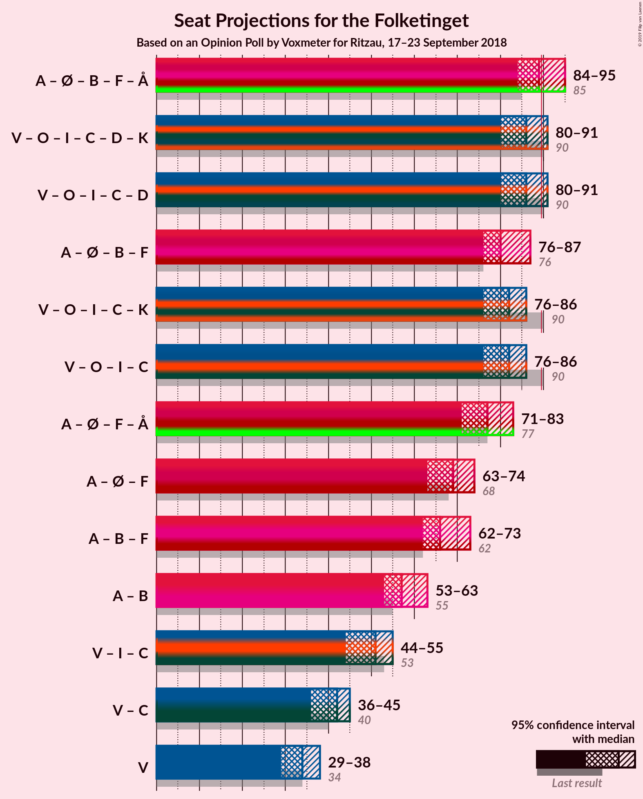

# Opinion Poll by Voxmeter for Ritzau, 17–23 September 2018

<a href="#voting-intentions">Voting Intentions</a> | <a href="#seats">Seats</a> | <a href="#coalitions">Coalitions</a> | <a href="#technical-information">Technical Information</a>

## Voting Intentions

### Confidence Intervals

| Party | Last Result | Poll Result | 80% Confidence Interval | 90% Confidence Interval | 95% Confidence Interval | 99% Confidence Interval |
|:-----:|:-----------:|:-----------:|:-----------------------:|:-----------------------:|:-----------------------:|:-----------------------:|
| Socialdemokraterne | 26.3% | 26.1% | 24.4–27.9% |23.9–28.4% |23.5–28.9% |22.7–29.7% |
| Venstre | 19.5% | 19.1% | 17.6–20.8% |17.2–21.2% |16.8–21.6% |16.2–22.4% |
| Dansk Folkeparti | 21.1% | 17.7% | 16.2–19.3% |15.8–19.7% |15.5–20.1% |14.8–20.9% |
| Enhedslisten–De Rød-Grønne | 7.8% | 7.9% | 7.0–9.1% |6.7–9.4% |6.4–9.7% |6.0–10.3% |
| Radikale Venstre | 4.6% | 6.7% | 5.8–7.8% |5.5–8.1% |5.3–8.4% |4.9–8.9% |
| Socialistisk Folkeparti | 4.2% | 5.3% | 4.5–6.3% |4.2–6.5% |4.1–6.8% |3.7–7.3% |
| Liberal Alliance | 7.5% | 5.1% | 4.3–6.1% |4.1–6.3% |3.9–6.6% |3.6–7.1% |
| Alternativet | 4.8% | 4.5% | 3.8–5.4% |3.6–5.7% |3.4–5.9% |3.1–6.4% |
| Det Konservative Folkeparti | 3.4% | 3.8% | 3.2–4.7% |3.0–5.0% |2.8–5.2% |2.5–5.6% |
| Nye Borgerlige | 0.0% | 2.6% | 2.0–3.3% |1.9–3.6% |1.8–3.7% |1.6–4.1% |
| Kristendemokraterne | 0.8% | 0.8% | 0.5–1.2% |0.4–1.4% |0.4–1.5% |0.3–1.8% |

*Note:* The poll result column reflects the actual value used in the calculations. Published results may vary slightly, and in addition be rounded to fewer digits.

## Seats

### Confidence Intervals

| Party | Last Result | Median | 80% Confidence Interval | 90% Confidence Interval | 95% Confidence Interval | 99% Confidence Interval |
|:-----:|:-----------:|:------:|:-----------------------:|:-----------------------:|:-----------------------:|:-----------------------:|
| <a href="#socialdemokraterne">Socialdemokraterne</a> | 47 | 48 | 38–50 |38–50 |38–50 |38–57 |
| <a href="#venstre">Venstre</a> | 34 | 35 | 34–35 |34–38 |32–38 |28–38 |
| <a href="#dansk-folkeparti">Dansk Folkeparti</a> | 37 | 31 | 27–38 |27–38 |26–38 |26–38 |
| <a href="#enhedslisten–de-rød-grønne">Enhedslisten–De Rød-Grønne</a> | 14 | 16 | 14–16 |12–16 |11–16 |10–16 |
| <a href="#radikale-venstre">Radikale Venstre</a> | 8 | 13 | 13–15 |12–15 |9–15 |9–15 |
| <a href="#socialistisk-folkeparti">Socialistisk Folkeparti</a> | 7 | 10 | 10 |9–10 |8–10 |8–12 |
| <a href="#liberal-alliance">Liberal Alliance</a> | 13 | 9 | 8–10 |8–11 |8–13 |7–13 |
| <a href="#alternativet">Alternativet</a> | 9 | 7 | 7–10 |7–10 |7–10 |7–13 |
| <a href="#det-konservative-folkeparti">Det Konservative Folkeparti</a> | 6 | 6 | 6 |6–7 |6–9 |4–9 |
| <a href="#nye-borgerlige">Nye Borgerlige</a> | 0 | 0 | 0 |0–6 |0–7 |0–7 |
| <a href="#kristendemokraterne">Kristendemokraterne</a> | 0 | 0 | 0 |0 |0 |0 |

### Socialdemokraterne

*For a full overview of the results for this party, see the [Socialdemokraterne](party-socialdemokraterne.html) page.*

| Number of Seats | Probability | Accumulated | Special Marks |
|:---------------:|:-----------:|:-----------:|:-------------:|
| 38 | 22% | 100% |  |
| 39 | 0% | 78% |  |
| 40 | 0% | 78% |  |
| 41 | 0% | 78% |  |
| 42 | 3% | 78% |  |
| 43 | 1.1% | 76% |  |
| 44 | 0.7% | 75% |  |
| 45 | 0.3% | 74% |  |
| 46 | 0.2% | 74% |  |
| 47 | 4% | 73% | Last Result |
| 48 | 50% | 69% | Median |
| 49 | 0% | 19% |  |
| 50 | 18% | 19% |  |
| 51 | 0.6% | 1.4% |  |
| 52 | 0% | 0.8% |  |
| 53 | 0% | 0.8% |  |
| 54 | 0% | 0.8% |  |
| 55 | 0% | 0.8% |  |
| 56 | 0% | 0.8% |  |
| 57 | 0.8% | 0.8% |  |
| 58 | 0% | 0% |  |

### Venstre

*For a full overview of the results for this party, see the [Venstre](party-venstre.html) page.*

| Number of Seats | Probability | Accumulated | Special Marks |
|:---------------:|:-----------:|:-----------:|:-------------:|
| 27 | 0.1% | 100% |  |
| 28 | 0.7% | 99.9% |  |
| 29 | 0% | 99.3% |  |
| 30 | 0.9% | 99.3% |  |
| 31 | 0.1% | 98% |  |
| 32 | 0.8% | 98% |  |
| 33 | 0% | 97% |  |
| 34 | 22% | 97% | Last Result |
| 35 | 71% | 76% | Median |
| 36 | 0% | 5% |  |
| 37 | 0.1% | 5% |  |
| 38 | 5% | 5% |  |
| 39 | 0% | 0% |  |

### Dansk Folkeparti

*For a full overview of the results for this party, see the [Dansk Folkeparti](party-danskfolkeparti.html) page.*

| Number of Seats | Probability | Accumulated | Special Marks |
|:---------------:|:-----------:|:-----------:|:-------------:|
| 26 | 4% | 100% |  |
| 27 | 19% | 96% |  |
| 28 | 0% | 77% |  |
| 29 | 0.2% | 77% |  |
| 30 | 0% | 77% |  |
| 31 | 51% | 77% | Median |
| 32 | 3% | 26% |  |
| 33 | 0% | 23% |  |
| 34 | 0% | 23% |  |
| 35 | 1.3% | 23% |  |
| 36 | 0% | 22% |  |
| 37 | 0.3% | 22% | Last Result |
| 38 | 22% | 22% |  |
| 39 | 0% | 0% |  |

### Enhedslisten–De Rød-Grønne

*For a full overview of the results for this party, see the [Enhedslisten–De Rød-Grønne](party-enhedslisten–derød-grønne.html) page.*

| Number of Seats | Probability | Accumulated | Special Marks |
|:---------------:|:-----------:|:-----------:|:-------------:|
| 10 | 0.8% | 100% |  |
| 11 | 3% | 99.2% |  |
| 12 | 5% | 96% |  |
| 13 | 0% | 92% |  |
| 14 | 22% | 92% | Last Result |
| 15 | 0% | 70% |  |
| 16 | 70% | 70% | Median |
| 17 | 0% | 0.2% |  |
| 18 | 0.1% | 0.2% |  |
| 19 | 0% | 0.2% |  |
| 20 | 0% | 0.2% |  |
| 21 | 0.2% | 0.2% |  |
| 22 | 0% | 0% |  |

### Radikale Venstre

*For a full overview of the results for this party, see the [Radikale Venstre](party-radikalevenstre.html) page.*

| Number of Seats | Probability | Accumulated | Special Marks |
|:---------------:|:-----------:|:-----------:|:-------------:|
| 8 | 0.3% | 100% | Last Result |
| 9 | 4% | 99.7% |  |
| 10 | 0.6% | 96% |  |
| 11 | 0% | 95% |  |
| 12 | 4% | 95% |  |
| 13 | 52% | 91% | Median |
| 14 | 0% | 40% |  |
| 15 | 40% | 40% |  |
| 16 | 0% | 0% |  |

### Socialistisk Folkeparti

*For a full overview of the results for this party, see the [Socialistisk Folkeparti](party-socialistiskfolkeparti.html) page.*

| Number of Seats | Probability | Accumulated | Special Marks |
|:---------------:|:-----------:|:-----------:|:-------------:|
| 7 | 0.2% | 100% | Last Result |
| 8 | 5% | 99.8% |  |
| 9 | 1.4% | 95% |  |
| 10 | 93% | 94% | Median |
| 11 | 0% | 0.8% |  |
| 12 | 0.7% | 0.7% |  |
| 13 | 0% | 0.1% |  |
| 14 | 0.1% | 0.1% |  |
| 15 | 0% | 0% |  |

### Liberal Alliance

*For a full overview of the results for this party, see the [Liberal Alliance](party-liberalalliance.html) page.*

| Number of Seats | Probability | Accumulated | Special Marks |
|:---------------:|:-----------:|:-----------:|:-------------:|
| 5 | 0.1% | 100% |  |
| 6 | 0.1% | 99.9% |  |
| 7 | 0.7% | 99.9% |  |
| 8 | 20% | 99.2% |  |
| 9 | 50% | 79% | Median |
| 10 | 22% | 29% |  |
| 11 | 4% | 7% |  |
| 12 | 0% | 3% |  |
| 13 | 3% | 3% | Last Result |
| 14 | 0% | 0% |  |

### Alternativet

*For a full overview of the results for this party, see the [Alternativet](party-alternativet.html) page.*

| Number of Seats | Probability | Accumulated | Special Marks |
|:---------------:|:-----------:|:-----------:|:-------------:|
| 5 | 0.1% | 100% |  |
| 6 | 0.1% | 99.9% |  |
| 7 | 55% | 99.9% | Median |
| 8 | 21% | 45% |  |
| 9 | 0.8% | 24% | Last Result |
| 10 | 22% | 24% |  |
| 11 | 0% | 1.1% |  |
| 12 | 0% | 1.1% |  |
| 13 | 1.1% | 1.1% |  |
| 14 | 0% | 0% |  |

### Det Konservative Folkeparti

*For a full overview of the results for this party, see the [Det Konservative Folkeparti](party-detkonservativefolkeparti.html) page.*

| Number of Seats | Probability | Accumulated | Special Marks |
|:---------------:|:-----------:|:-----------:|:-------------:|
| 4 | 0.6% | 100% |  |
| 5 | 0.9% | 99.4% |  |
| 6 | 91% | 98.5% | Last Result, Median |
| 7 | 4% | 8% |  |
| 8 | 0.3% | 4% |  |
| 9 | 3% | 3% |  |
| 10 | 0.2% | 0.2% |  |
| 11 | 0% | 0% |  |

### Nye Borgerlige

*For a full overview of the results for this party, see the [Nye Borgerlige](party-nyeborgerlige.html) page.*

| Number of Seats | Probability | Accumulated | Special Marks |
|:---------------:|:-----------:|:-----------:|:-------------:|
| 0 | 91% | 100% | Last Result, Median |
| 1 | 0% | 9% |  |
| 2 | 0% | 9% |  |
| 3 | 0% | 9% |  |
| 4 | 0.6% | 9% |  |
| 5 | 0.8% | 9% |  |
| 6 | 4% | 8% |  |
| 7 | 4% | 4% |  |
| 8 | 0% | 0.1% |  |
| 9 | 0.1% | 0.1% |  |
| 10 | 0% | 0% |  |

### Kristendemokraterne

*For a full overview of the results for this party, see the [Kristendemokraterne](party-kristendemokraterne.html) page.*

| Number of Seats | Probability | Accumulated | Special Marks |
|:---------------:|:-----------:|:-----------:|:-------------:|
| 0 | 99.9% | 100% | Last Result, Median |
| 1 | 0% | 0.1% |  |
| 2 | 0% | 0.1% |  |
| 3 | 0% | 0.1% |  |
| 4 | 0% | 0.1% |  |
| 5 | 0% | 0% |  |

## Coalitions

### Confidence Intervals

| Coalition | Last Result | Median | Majority? | 80% Confidence Interval | 90% Confidence Interval | 95% Confidence Interval | 99% Confidence Interval |
|:---------:|:-----------:|:------:|:---------:|:-----------------------:|:-----------------------:|:-----------------------:|:-----------------------:|
| Socialdemokraterne – Enhedslisten–De Rød-Grønne – Radikale Venstre – Socialistisk Folkeparti – Alternativet | 85 | 94 | 71% | 87–99 | 86–99 | 80–99 | 80–99 |
| Venstre – Dansk Folkeparti – Liberal Alliance – Det Konservative Folkeparti – Nye Borgerlige – Kristendemokraterne | 90 | 81 | 3% | 76–88 | 76–89 | 76–95 | 76–95 |
| Venstre – Dansk Folkeparti – Liberal Alliance – Det Konservative Folkeparti – Nye Borgerlige | 90 | 81 | 3% | 76–88 | 76–89 | 76–95 | 76–95 |
| Socialdemokraterne – Enhedslisten–De Rød-Grønne – Radikale Venstre – Socialistisk Folkeparti | 76 | 87 | 18% | 77–91 | 77–91 | 72–91 | 72–91 |
| Venstre – Dansk Folkeparti – Liberal Alliance – Det Konservative Folkeparti – Kristendemokraterne | 90 | 81 | 0% | 76–88 | 76–88 | 76–89 | 75–89 |
| Venstre – Dansk Folkeparti – Liberal Alliance – Det Konservative Folkeparti | 90 | 81 | 0% | 76–88 | 76–88 | 76–89 | 75–89 |

### Socialdemokraterne – Enhedslisten–De Rød-Grønne – Radikale Venstre – Socialistisk Folkeparti – Alternativet

| Number of Seats | Probability | Accumulated | Special Marks |
|:---------------:|:-----------:|:-----------:|:-------------:|
| 80 | 3% | 100% |  |
| 81 | 0% | 97% |  |
| 82 | 0.1% | 97% |  |
| 83 | 0% | 97% |  |
| 84 | 0% | 97% |  |
| 85 | 0% | 97% | Last Result |
| 86 | 4% | 97% |  |
| 87 | 22% | 93% |  |
| 88 | 0% | 71% |  |
| 89 | 0% | 71% |  |
| 90 | 2% | 71% | Majority |
| 91 | 0.2% | 70% |  |
| 92 | 0% | 70% |  |
| 93 | 0% | 70% |  |
| 94 | 50% | 70% | Median |
| 95 | 0.7% | 19% |  |
| 96 | 0.1% | 19% |  |
| 97 | 0.8% | 19% |  |
| 98 | 0% | 18% |  |
| 99 | 18% | 18% |  |
| 100 | 0% | 0% |  |

### Venstre – Dansk Folkeparti – Liberal Alliance – Det Konservative Folkeparti – Nye Borgerlige – Kristendemokraterne

| Number of Seats | Probability | Accumulated | Special Marks |
|:---------------:|:-----------:|:-----------:|:-------------:|
| 76 | 18% | 100% |  |
| 77 | 0% | 82% |  |
| 78 | 0.8% | 82% |  |
| 79 | 0.1% | 81% |  |
| 80 | 0.7% | 81% |  |
| 81 | 50% | 81% | Median |
| 82 | 0% | 30% |  |
| 83 | 0% | 30% |  |
| 84 | 0.2% | 30% |  |
| 85 | 2% | 30% |  |
| 86 | 0% | 29% |  |
| 87 | 0% | 29% |  |
| 88 | 22% | 29% |  |
| 89 | 4% | 7% |  |
| 90 | 0% | 3% | Last Result, Majority |
| 91 | 0% | 3% |  |
| 92 | 0% | 3% |  |
| 93 | 0.1% | 3% |  |
| 94 | 0% | 3% |  |
| 95 | 3% | 3% |  |
| 96 | 0% | 0% |  |

### Venstre – Dansk Folkeparti – Liberal Alliance – Det Konservative Folkeparti – Nye Borgerlige

| Number of Seats | Probability | Accumulated | Special Marks |
|:---------------:|:-----------:|:-----------:|:-------------:|
| 75 | 0% | 100% |  |
| 76 | 18% | 99.9% |  |
| 77 | 0% | 82% |  |
| 78 | 0.8% | 82% |  |
| 79 | 0.1% | 81% |  |
| 80 | 0.7% | 81% |  |
| 81 | 50% | 81% | Median |
| 82 | 0% | 30% |  |
| 83 | 0% | 30% |  |
| 84 | 0.2% | 30% |  |
| 85 | 2% | 30% |  |
| 86 | 0% | 29% |  |
| 87 | 0% | 29% |  |
| 88 | 22% | 29% |  |
| 89 | 4% | 7% |  |
| 90 | 0% | 3% | Last Result, Majority |
| 91 | 0% | 3% |  |
| 92 | 0% | 3% |  |
| 93 | 0.1% | 3% |  |
| 94 | 0% | 3% |  |
| 95 | 3% | 3% |  |
| 96 | 0% | 0% |  |

### Socialdemokraterne – Enhedslisten–De Rød-Grønne – Radikale Venstre – Socialistisk Folkeparti

| Number of Seats | Probability | Accumulated | Special Marks |
|:---------------:|:-----------:|:-----------:|:-------------:|
| 72 | 3% | 100% |  |
| 73 | 0.3% | 97% |  |
| 74 | 0% | 97% |  |
| 75 | 0% | 97% |  |
| 76 | 0% | 97% | Last Result |
| 77 | 23% | 97% |  |
| 78 | 0% | 74% |  |
| 79 | 4% | 74% |  |
| 80 | 0% | 70% |  |
| 81 | 0% | 70% |  |
| 82 | 0% | 70% |  |
| 83 | 0.7% | 70% |  |
| 84 | 0% | 70% |  |
| 85 | 0.7% | 70% |  |
| 86 | 0% | 69% |  |
| 87 | 50% | 69% | Median |
| 88 | 0.8% | 19% |  |
| 89 | 0% | 18% |  |
| 90 | 0% | 18% | Majority |
| 91 | 18% | 18% |  |
| 92 | 0% | 0% |  |

### Venstre – Dansk Folkeparti – Liberal Alliance – Det Konservative Folkeparti – Kristendemokraterne

| Number of Seats | Probability | Accumulated | Special Marks |
|:---------------:|:-----------:|:-----------:|:-------------:|
| 72 | 0.1% | 100% |  |
| 73 | 0% | 99.9% |  |
| 74 | 0% | 99.9% |  |
| 75 | 0.7% | 99.9% |  |
| 76 | 18% | 99.2% |  |
| 77 | 0% | 81% |  |
| 78 | 0.8% | 81% |  |
| 79 | 1.2% | 81% |  |
| 80 | 0% | 79% |  |
| 81 | 51% | 79% | Median |
| 82 | 4% | 29% |  |
| 83 | 0% | 25% |  |
| 84 | 0.1% | 25% |  |
| 85 | 0% | 25% |  |
| 86 | 0% | 25% |  |
| 87 | 0% | 25% |  |
| 88 | 22% | 25% |  |
| 89 | 3% | 3% |  |
| 90 | 0% | 0% | Last Result, Majority |

### Venstre – Dansk Folkeparti – Liberal Alliance – Det Konservative Folkeparti

| Number of Seats | Probability | Accumulated | Special Marks |
|:---------------:|:-----------:|:-----------:|:-------------:|
| 71 | 0% | 100% |  |
| 72 | 0.1% | 99.9% |  |
| 73 | 0% | 99.9% |  |
| 74 | 0% | 99.9% |  |
| 75 | 0.7% | 99.9% |  |
| 76 | 18% | 99.2% |  |
| 77 | 0% | 81% |  |
| 78 | 0.8% | 81% |  |
| 79 | 1.2% | 81% |  |
| 80 | 0% | 79% |  |
| 81 | 51% | 79% | Median |
| 82 | 4% | 29% |  |
| 83 | 0% | 25% |  |
| 84 | 0.1% | 25% |  |
| 85 | 0% | 25% |  |
| 86 | 0% | 25% |  |
| 87 | 0% | 25% |  |
| 88 | 22% | 25% |  |
| 89 | 3% | 3% |  |
| 90 | 0% | 0% | Last Result, Majority |

## Technical Information

### Opinion Poll

+ **Polling firm:** Voxmeter
+ **Commissioner(s):** Ritzau
+ **Fieldwork period:** 17–23 September 2018

### Calculations

+ **Sample size:** 1046
+ **Simulations done:** 1,024
+ **Error estimate:** 3.02%

