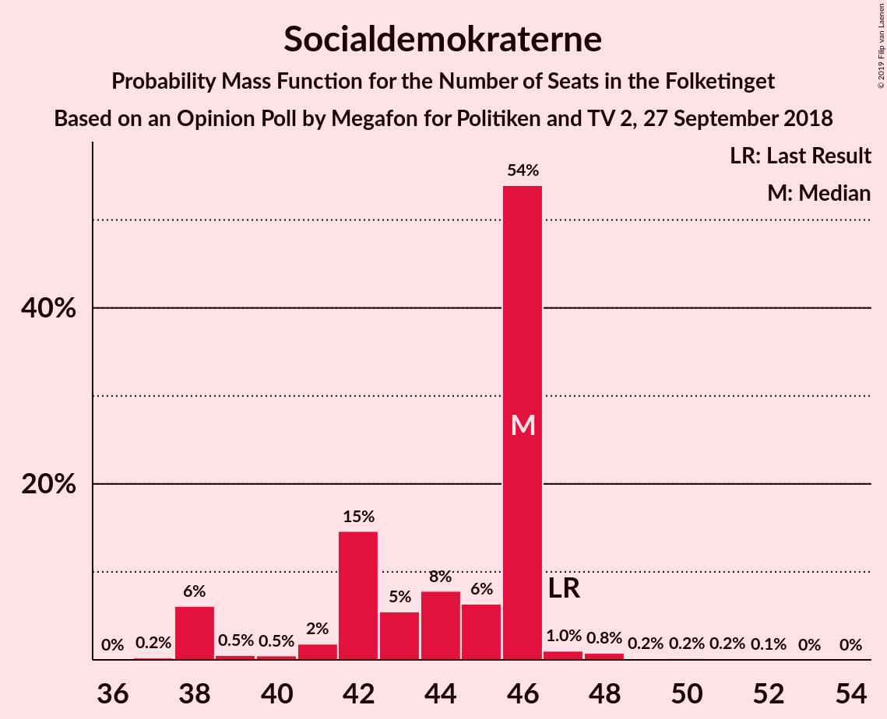
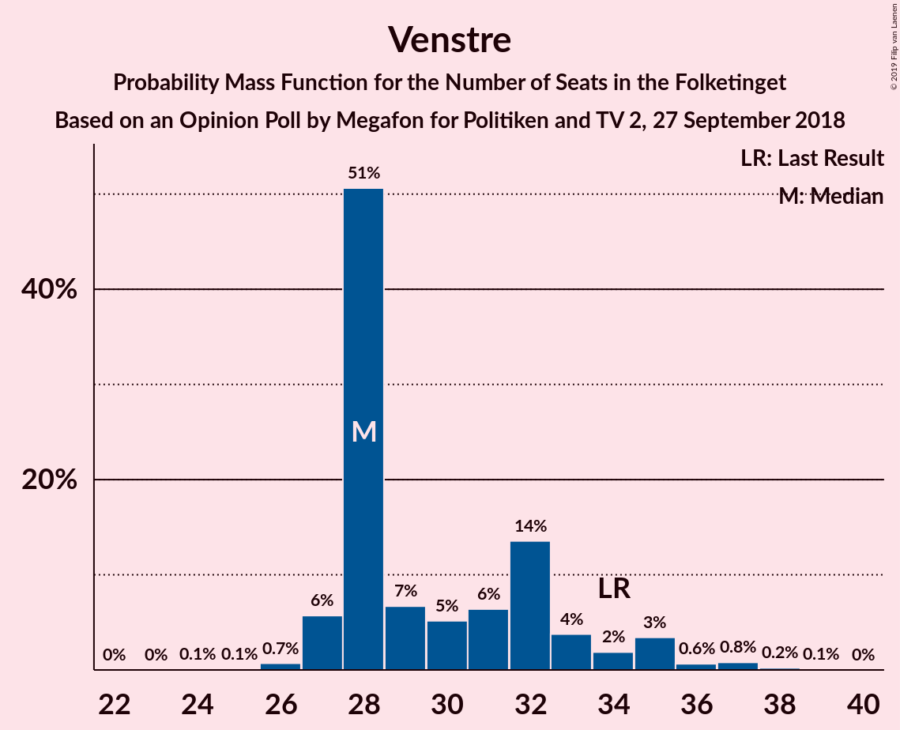
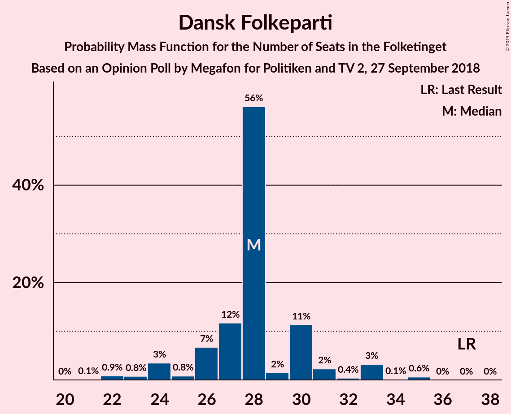
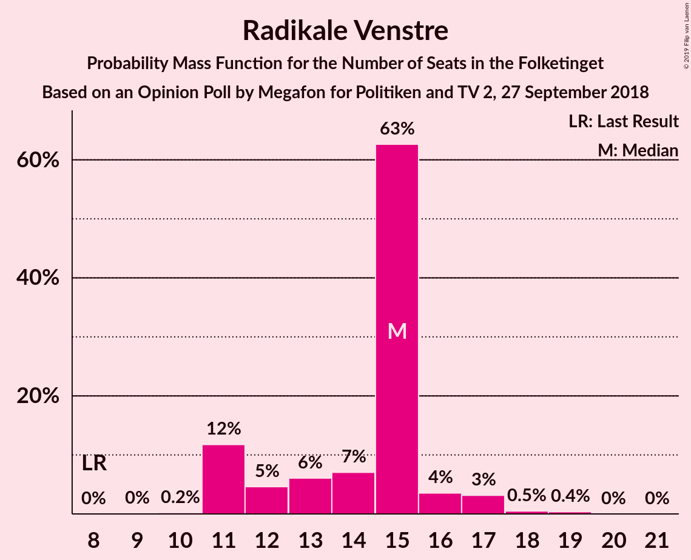
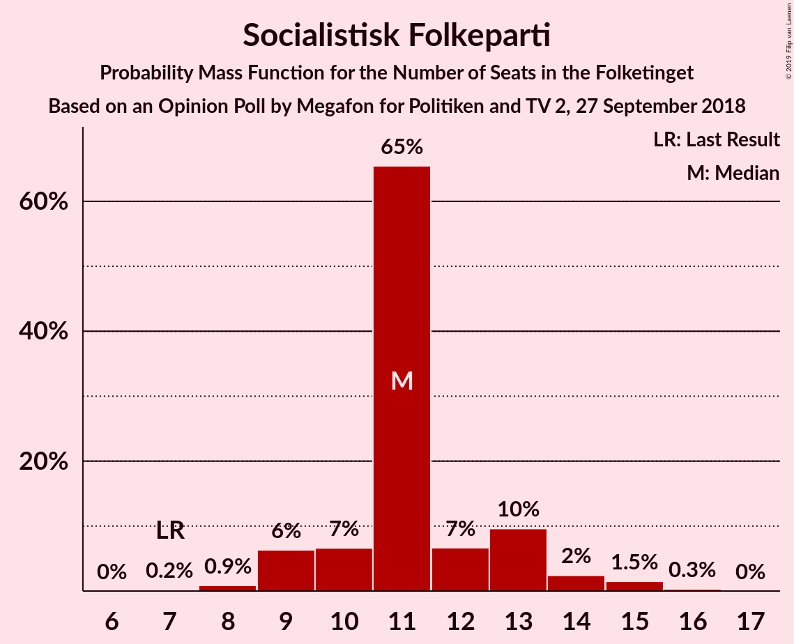
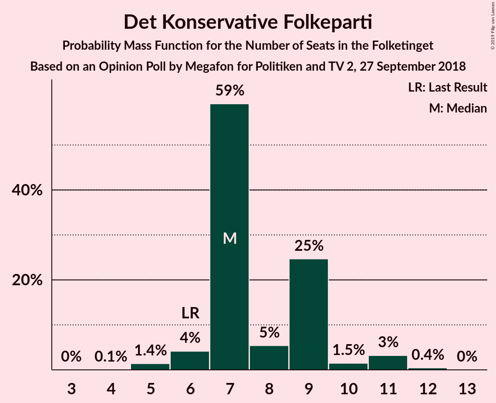

# Opinion Poll by Megafon for Politiken and TV 2, 27 September 2018

<a href="#voting-intentions">Voting Intentions</a> | <a href="#seats">Seats</a> | <a href="#coalitions">Coalitions</a> | <a href="#technical-information">Technical Information</a>

## Voting Intentions

### Confidence Intervals

| Party | Last Result | Poll Result | 80% Confidence Interval | 90% Confidence Interval | 95% Confidence Interval | 99% Confidence Interval |
|:-----:|:-----------:|:-----------:|:-----------------------:|:-----------------------:|:-----------------------:|:-----------------------:|
| Socialdemokraterne | 26.3% | 25.1% | 23.2–27.0% |22.7–27.6% |22.3–28.0% |21.4–29.0% |
| Venstre | 19.5% | 17.6% | 16.0–19.3% |15.6–19.8% |15.2–20.3% |14.5–21.1% |
| Dansk Folkeparti | 21.1% | 15.9% | 14.4–17.6% |13.9–18.0% |13.6–18.4% |12.9–19.3% |
| Enhedslisten–De Rød-Grønne | 7.8% | 8.5% | 7.4–9.8% |7.1–10.2% |6.8–10.6% |6.3–11.2% |
| Radikale Venstre | 4.6% | 8.0% | 7.0–9.4% |6.7–9.7% |6.4–10.1% |5.9–10.7% |
| Socialistisk Folkeparti | 4.2% | 6.2% | 5.3–7.4% |5.0–7.7% |4.8–8.0% |4.4–8.6% |
| Alternativet | 4.8% | 5.7% | 4.8–6.9% |4.6–7.2% |4.4–7.5% |4.0–8.1% |
| Liberal Alliance | 7.5% | 4.7% | 3.9–5.8% |3.7–6.1% |3.5–6.3% |3.1–6.9% |
| Det Konservative Folkeparti | 3.4% | 4.5% | 3.7–5.5% |3.5–5.8% |3.3–6.1% |3.0–6.6% |
| Nye Borgerlige | 0.0% | 2.8% | 2.2–3.6% |2.0–3.9% |1.9–4.1% |1.6–4.5% |
| Kristendemokraterne | 0.8% | 0.9% | 0.6–1.5% |0.5–1.7% |0.5–1.8% |0.4–2.1% |

*Note:* The poll result column reflects the actual value used in the calculations. Published results may vary slightly, and in addition be rounded to fewer digits.

## Seats

### Confidence Intervals

| Party | Last Result | Median | 80% Confidence Interval | 90% Confidence Interval | 95% Confidence Interval | 99% Confidence Interval |
|:-----:|:-----------:|:------:|:-----------------------:|:-----------------------:|:-----------------------:|:-----------------------:|
| <a href="#socialdemokraterne">Socialdemokraterne</a> | 47 | 40 | 40–49 |40–49 |40–49 |40–49 |
| <a href="#venstre">Venstre</a> | 34 | 31 | 25–33 |25–33 |25–33 |25–33 |
| <a href="#dansk-folkeparti">Dansk Folkeparti</a> | 37 | 30 | 25–30 |25–30 |25–30 |25–34 |
| <a href="#enhedslisten–de-rød-grønne">Enhedslisten–De Rød-Grønne</a> | 14 | 21 | 11–22 |11–22 |11–22 |11–22 |
| <a href="#radikale-venstre">Radikale Venstre</a> | 8 | 17 | 15–19 |15–19 |15–19 |13–19 |
| <a href="#socialistisk-folkeparti">Socialistisk Folkeparti</a> | 7 | 12 | 10–13 |10–13 |10–13 |10–13 |
| <a href="#alternativet">Alternativet</a> | 9 | 11 | 8–12 |8–12 |8–12 |8–14 |
| <a href="#liberal-alliance">Liberal Alliance</a> | 13 | 7 | 5–9 |5–9 |5–9 |5–12 |
| <a href="#det-konservative-folkeparti">Det Konservative Folkeparti</a> | 6 | 8 | 6–11 |6–11 |6–11 |6–11 |
| <a href="#nye-borgerlige">Nye Borgerlige</a> | 0 | 4 | 0–4 |0–4 |0–4 |0–6 |
| <a href="#kristendemokraterne">Kristendemokraterne</a> | 0 | 0 | 0 |0 |0 |0 |

### Socialdemokraterne

*For a full overview of the results for this party, see the [Socialdemokraterne](party-socialdemokraterne.html) page.*

| Number of Seats | Probability | Accumulated | Special Marks |
|:---------------:|:-----------:|:-----------:|:-------------:|
| 34 | 0.3% | 100% |  |
| 35 | 0% | 99.7% |  |
| 36 | 0% | 99.7% |  |
| 37 | 0% | 99.7% |  |
| 38 | 0% | 99.7% |  |
| 39 | 0% | 99.7% |  |
| 40 | 57% | 99.6% | Median |
| 41 | 0% | 42% |  |
| 42 | 0% | 42% |  |
| 43 | 0% | 42% |  |
| 44 | 27% | 42% |  |
| 45 | 0% | 16% |  |
| 46 | 0% | 16% |  |
| 47 | 0% | 16% | Last Result |
| 48 | 0.2% | 16% |  |
| 49 | 15% | 15% |  |
| 50 | 0% | 0% |  |

### Venstre

*For a full overview of the results for this party, see the [Venstre](party-venstre.html) page.*

| Number of Seats | Probability | Accumulated | Special Marks |
|:---------------:|:-----------:|:-----------:|:-------------:|
| 23 | 0.4% | 100% |  |
| 24 | 0% | 99.6% |  |
| 25 | 15% | 99.6% |  |
| 26 | 12% | 85% |  |
| 27 | 0% | 72% |  |
| 28 | 0% | 72% |  |
| 29 | 0.6% | 72% |  |
| 30 | 0% | 72% |  |
| 31 | 27% | 72% | Median |
| 32 | 0% | 45% |  |
| 33 | 45% | 45% |  |
| 34 | 0% | 0.3% | Last Result |
| 35 | 0% | 0.3% |  |
| 36 | 0% | 0.3% |  |
| 37 | 0% | 0.3% |  |
| 38 | 0% | 0.2% |  |
| 39 | 0% | 0.2% |  |
| 40 | 0.2% | 0.2% |  |
| 41 | 0% | 0% |  |

### Dansk Folkeparti

*For a full overview of the results for this party, see the [Dansk Folkeparti](party-danskfolkeparti.html) page.*

| Number of Seats | Probability | Accumulated | Special Marks |
|:---------------:|:-----------:|:-----------:|:-------------:|
| 22 | 0.3% | 100% |  |
| 23 | 0% | 99.7% |  |
| 24 | 0% | 99.7% |  |
| 25 | 12% | 99.7% |  |
| 26 | 0% | 87% |  |
| 27 | 27% | 87% |  |
| 28 | 0% | 61% |  |
| 29 | 0% | 61% |  |
| 30 | 60% | 61% | Median |
| 31 | 0% | 1.0% |  |
| 32 | 0% | 1.0% |  |
| 33 | 0.4% | 1.0% |  |
| 34 | 0.3% | 0.6% |  |
| 35 | 0% | 0.3% |  |
| 36 | 0.3% | 0.3% |  |
| 37 | 0% | 0% | Last Result |

### Enhedslisten–De Rød-Grønne

*For a full overview of the results for this party, see the [Enhedslisten–De Rød-Grønne](party-enhedslisten–derød-grønne.html) page.*

| Number of Seats | Probability | Accumulated | Special Marks |
|:---------------:|:-----------:|:-----------:|:-------------:|
| 10 | 0.3% | 100% |  |
| 11 | 15% | 99.7% |  |
| 12 | 0.2% | 85% |  |
| 13 | 0.3% | 84% |  |
| 14 | 0% | 84% | Last Result |
| 15 | 0% | 84% |  |
| 16 | 27% | 84% |  |
| 17 | 0.3% | 57% |  |
| 18 | 0% | 57% |  |
| 19 | 0% | 57% |  |
| 20 | 0% | 57% |  |
| 21 | 45% | 57% | Median |
| 22 | 12% | 12% |  |
| 23 | 0% | 0% |  |

### Radikale Venstre

*For a full overview of the results for this party, see the [Radikale Venstre](party-radikalevenstre.html) page.*

| Number of Seats | Probability | Accumulated | Special Marks |
|:---------------:|:-----------:|:-----------:|:-------------:|
| 8 | 0% | 100% | Last Result |
| 9 | 0% | 100% |  |
| 10 | 0.2% | 100% |  |
| 11 | 0% | 99.8% |  |
| 12 | 0% | 99.7% |  |
| 13 | 0.6% | 99.7% |  |
| 14 | 0.4% | 99.1% |  |
| 15 | 27% | 98.7% |  |
| 16 | 15% | 72% |  |
| 17 | 45% | 57% | Median |
| 18 | 0% | 12% |  |
| 19 | 12% | 12% |  |
| 20 | 0% | 0% |  |

### Socialistisk Folkeparti

*For a full overview of the results for this party, see the [Socialistisk Folkeparti](party-socialistiskfolkeparti.html) page.*

| Number of Seats | Probability | Accumulated | Special Marks |
|:---------------:|:-----------:|:-----------:|:-------------:|
| 7 | 0.2% | 100% | Last Result |
| 8 | 0% | 99.8% |  |
| 9 | 0% | 99.7% |  |
| 10 | 15% | 99.7% |  |
| 11 | 13% | 84% |  |
| 12 | 27% | 72% | Median |
| 13 | 45% | 45% |  |
| 14 | 0% | 0% |  |

### Alternativet

*For a full overview of the results for this party, see the [Alternativet](party-alternativet.html) page.*

| Number of Seats | Probability | Accumulated | Special Marks |
|:---------------:|:-----------:|:-----------:|:-------------:|
| 7 | 0.1% | 100% |  |
| 8 | 45% | 99.9% |  |
| 9 | 0% | 55% | Last Result |
| 10 | 0.3% | 55% |  |
| 11 | 41% | 55% | Median |
| 12 | 12% | 13% |  |
| 13 | 0.3% | 0.9% |  |
| 14 | 0.4% | 0.6% |  |
| 15 | 0.2% | 0.3% |  |
| 16 | 0% | 0% |  |

### Liberal Alliance

*For a full overview of the results for this party, see the [Liberal Alliance](party-liberalalliance.html) page.*

| Number of Seats | Probability | Accumulated | Special Marks |
|:---------------:|:-----------:|:-----------:|:-------------:|
| 5 | 45% | 100% |  |
| 6 | 0.3% | 55% |  |
| 7 | 12% | 55% | Median |
| 8 | 15% | 42% |  |
| 9 | 27% | 27% |  |
| 10 | 0% | 0.5% |  |
| 11 | 0% | 0.5% |  |
| 12 | 0.2% | 0.5% |  |
| 13 | 0.2% | 0.3% | Last Result |
| 14 | 0% | 0% |  |

### Det Konservative Folkeparti

*For a full overview of the results for this party, see the [Det Konservative Folkeparti](party-detkonservativefolkeparti.html) page.*

| Number of Seats | Probability | Accumulated | Special Marks |
|:---------------:|:-----------:|:-----------:|:-------------:|
| 6 | 27% | 100% | Last Result |
| 7 | 0% | 73% |  |
| 8 | 45% | 73% | Median |
| 9 | 12% | 28% |  |
| 10 | 0.3% | 15% |  |
| 11 | 15% | 15% |  |
| 12 | 0% | 0% |  |

### Nye Borgerlige

*For a full overview of the results for this party, see the [Nye Borgerlige](party-nyeborgerlige.html) page.*

| Number of Seats | Probability | Accumulated | Special Marks |
|:---------------:|:-----------:|:-----------:|:-------------:|
| 0 | 45% | 100% | Last Result |
| 1 | 0% | 55% |  |
| 2 | 0% | 55% |  |
| 3 | 0% | 55% |  |
| 4 | 54% | 55% | Median |
| 5 | 0.3% | 1.3% |  |
| 6 | 0.7% | 1.0% |  |
| 7 | 0.3% | 0.3% |  |
| 8 | 0% | 0% |  |

### Kristendemokraterne

*For a full overview of the results for this party, see the [Kristendemokraterne](party-kristendemokraterne.html) page.*

| Number of Seats | Probability | Accumulated | Special Marks |
|:---------------:|:-----------:|:-----------:|:-------------:|
| 0 | 99.7% | 100% | Last Result, Median |
| 1 | 0% | 0.3% |  |
| 2 | 0% | 0.3% |  |
| 3 | 0% | 0.3% |  |
| 4 | 0.3% | 0.3% |  |
| 5 | 0% | 0% |  |

## Coalitions

### Confidence Intervals

| Coalition | Last Result | Median | Majority? | 80% Confidence Interval | 90% Confidence Interval | 95% Confidence Interval | 99% Confidence Interval |
|:---------:|:-----------:|:------:|:---------:|:-----------------------:|:-----------------------:|:-----------------------:|:-----------------------:|
| Socialdemokraterne – Enhedslisten–De Rød-Grønne – Radikale Venstre – Socialistisk Folkeparti – Alternativet | 85 | 99 | 99.4% | 97–104 | 97–104 | 97–104 | 88–104 |
| Socialdemokraterne – Enhedslisten–De Rød-Grønne – Radikale Venstre – Socialistisk Folkeparti | 76 | 91 | 57% | 86–92 | 86–92 | 86–92 | 75–92 |
| Venstre – Dansk Folkeparti – Liberal Alliance – Det Konservative Folkeparti – Nye Borgerlige – Kristendemokraterne | 90 | 76 | 0.3% | 71–78 | 71–78 | 71–78 | 71–87 |
| Venstre – Dansk Folkeparti – Liberal Alliance – Det Konservative Folkeparti – Nye Borgerlige | 90 | 76 | 0.3% | 71–78 | 71–78 | 71–78 | 71–83 |
| Venstre – Dansk Folkeparti – Liberal Alliance – Det Konservative Folkeparti – Kristendemokraterne | 90 | 74 | 0% | 67–76 | 67–76 | 67–76 | 67–83 |
| Venstre – Dansk Folkeparti – Liberal Alliance – Det Konservative Folkeparti | 90 | 74 | 0% | 67–76 | 67–76 | 67–76 | 67–83 |

### Socialdemokraterne – Enhedslisten–De Rød-Grønne – Radikale Venstre – Socialistisk Folkeparti – Alternativet

| Number of Seats | Probability | Accumulated | Special Marks |
|:---------------:|:-----------:|:-----------:|:-------------:|
| 83 | 0.2% | 100% |  |
| 84 | 0% | 99.8% |  |
| 85 | 0% | 99.7% | Last Result |
| 86 | 0% | 99.7% |  |
| 87 | 0% | 99.7% |  |
| 88 | 0.3% | 99.7% |  |
| 89 | 0% | 99.4% |  |
| 90 | 0% | 99.4% | Majority |
| 91 | 0% | 99.4% |  |
| 92 | 0.3% | 99.4% |  |
| 93 | 0% | 99.1% |  |
| 94 | 0% | 99.1% |  |
| 95 | 0% | 99.0% |  |
| 96 | 0% | 99.0% |  |
| 97 | 15% | 99.0% |  |
| 98 | 27% | 84% |  |
| 99 | 45% | 57% |  |
| 100 | 0.4% | 13% |  |
| 101 | 0% | 12% | Median |
| 102 | 0% | 12% |  |
| 103 | 0% | 12% |  |
| 104 | 12% | 12% |  |
| 105 | 0% | 0% |  |

### Socialdemokraterne – Enhedslisten–De Rød-Grønne – Radikale Venstre – Socialistisk Folkeparti

| Number of Seats | Probability | Accumulated | Special Marks |
|:---------------:|:-----------:|:-----------:|:-------------:|
| 73 | 0.2% | 100% |  |
| 74 | 0% | 99.7% |  |
| 75 | 0.3% | 99.7% |  |
| 76 | 0% | 99.4% | Last Result |
| 77 | 0% | 99.4% |  |
| 78 | 0% | 99.4% |  |
| 79 | 0% | 99.4% |  |
| 80 | 0% | 99.4% |  |
| 81 | 0% | 99.4% |  |
| 82 | 0.2% | 99.4% |  |
| 83 | 0% | 99.2% |  |
| 84 | 0.3% | 99.2% |  |
| 85 | 0% | 98.9% |  |
| 86 | 15% | 98.8% |  |
| 87 | 27% | 83% |  |
| 88 | 0% | 57% |  |
| 89 | 0% | 57% |  |
| 90 | 0% | 57% | Median, Majority |
| 91 | 45% | 57% |  |
| 92 | 12% | 12% |  |
| 93 | 0% | 0% |  |

### Venstre – Dansk Folkeparti – Liberal Alliance – Det Konservative Folkeparti – Nye Borgerlige – Kristendemokraterne

| Number of Seats | Probability | Accumulated | Special Marks |
|:---------------:|:-----------:|:-----------:|:-------------:|
| 71 | 12% | 100% |  |
| 72 | 0% | 88% |  |
| 73 | 0% | 88% |  |
| 74 | 0% | 88% |  |
| 75 | 0.4% | 88% |  |
| 76 | 45% | 87% |  |
| 77 | 27% | 43% |  |
| 78 | 15% | 16% |  |
| 79 | 0% | 1.0% |  |
| 80 | 0% | 1.0% | Median |
| 81 | 0% | 1.0% |  |
| 82 | 0% | 0.9% |  |
| 83 | 0.3% | 0.9% |  |
| 84 | 0% | 0.6% |  |
| 85 | 0% | 0.6% |  |
| 86 | 0% | 0.6% |  |
| 87 | 0.3% | 0.6% |  |
| 88 | 0% | 0.3% |  |
| 89 | 0% | 0.3% |  |
| 90 | 0% | 0.3% | Last Result, Majority |
| 91 | 0% | 0.3% |  |
| 92 | 0.2% | 0.2% |  |
| 93 | 0% | 0% |  |

### Venstre – Dansk Folkeparti – Liberal Alliance – Det Konservative Folkeparti – Nye Borgerlige

| Number of Seats | Probability | Accumulated | Special Marks |
|:---------------:|:-----------:|:-----------:|:-------------:|
| 71 | 12% | 100% |  |
| 72 | 0% | 88% |  |
| 73 | 0% | 88% |  |
| 74 | 0% | 88% |  |
| 75 | 0.4% | 88% |  |
| 76 | 45% | 87% |  |
| 77 | 27% | 43% |  |
| 78 | 15% | 16% |  |
| 79 | 0% | 0.9% |  |
| 80 | 0% | 0.9% | Median |
| 81 | 0% | 0.9% |  |
| 82 | 0% | 0.9% |  |
| 83 | 0.6% | 0.9% |  |
| 84 | 0% | 0.3% |  |
| 85 | 0% | 0.3% |  |
| 86 | 0% | 0.3% |  |
| 87 | 0% | 0.3% |  |
| 88 | 0% | 0.3% |  |
| 89 | 0% | 0.3% |  |
| 90 | 0% | 0.3% | Last Result, Majority |
| 91 | 0% | 0.2% |  |
| 92 | 0.2% | 0.2% |  |
| 93 | 0% | 0% |  |

### Venstre – Dansk Folkeparti – Liberal Alliance – Det Konservative Folkeparti – Kristendemokraterne

| Number of Seats | Probability | Accumulated | Special Marks |
|:---------------:|:-----------:|:-----------:|:-------------:|
| 67 | 12% | 100% |  |
| 68 | 0% | 88% |  |
| 69 | 0.4% | 88% |  |
| 70 | 0% | 87% |  |
| 71 | 0% | 87% |  |
| 72 | 0% | 87% |  |
| 73 | 27% | 87% |  |
| 74 | 15% | 61% |  |
| 75 | 0% | 46% |  |
| 76 | 45% | 46% | Median |
| 77 | 0% | 0.9% |  |
| 78 | 0% | 0.9% |  |
| 79 | 0% | 0.9% |  |
| 80 | 0% | 0.9% |  |
| 81 | 0.3% | 0.9% |  |
| 82 | 0% | 0.6% |  |
| 83 | 0.3% | 0.6% |  |
| 84 | 0% | 0.3% |  |
| 85 | 0.2% | 0.3% |  |
| 86 | 0% | 0% |  |
| 87 | 0% | 0% |  |
| 88 | 0% | 0% |  |
| 89 | 0% | 0% |  |
| 90 | 0% | 0% | Last Result, Majority |

### Venstre – Dansk Folkeparti – Liberal Alliance – Det Konservative Folkeparti

| Number of Seats | Probability | Accumulated | Special Marks |
|:---------------:|:-----------:|:-----------:|:-------------:|
| 67 | 12% | 100% |  |
| 68 | 0% | 88% |  |
| 69 | 0.4% | 88% |  |
| 70 | 0% | 87% |  |
| 71 | 0% | 87% |  |
| 72 | 0% | 87% |  |
| 73 | 27% | 87% |  |
| 74 | 15% | 61% |  |
| 75 | 0% | 46% |  |
| 76 | 45% | 46% | Median |
| 77 | 0.3% | 0.9% |  |
| 78 | 0% | 0.6% |  |
| 79 | 0% | 0.6% |  |
| 80 | 0% | 0.6% |  |
| 81 | 0% | 0.6% |  |
| 82 | 0% | 0.6% |  |
| 83 | 0.3% | 0.6% |  |
| 84 | 0% | 0.3% |  |
| 85 | 0.2% | 0.3% |  |
| 86 | 0% | 0% |  |
| 87 | 0% | 0% |  |
| 88 | 0% | 0% |  |
| 89 | 0% | 0% |  |
| 90 | 0% | 0% | Last Result, Majority |

## Technical Information

### Opinion Poll

+ **Polling firm:** Megafon
+ **Commissioner(s):** Politiken and TV 2
+ **Fieldwork period:** 27 September 2018

### Calculations

+ **Sample size:** 870
+ **Simulations done:** 1,024
+ **Error estimate:** 4.92%

