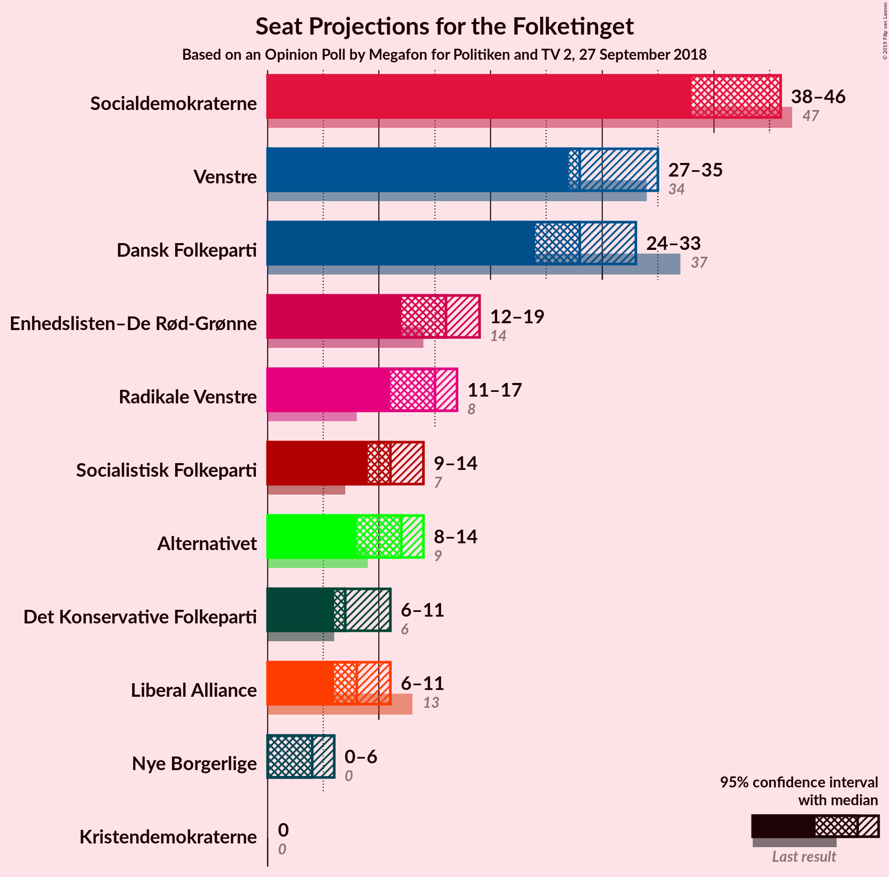
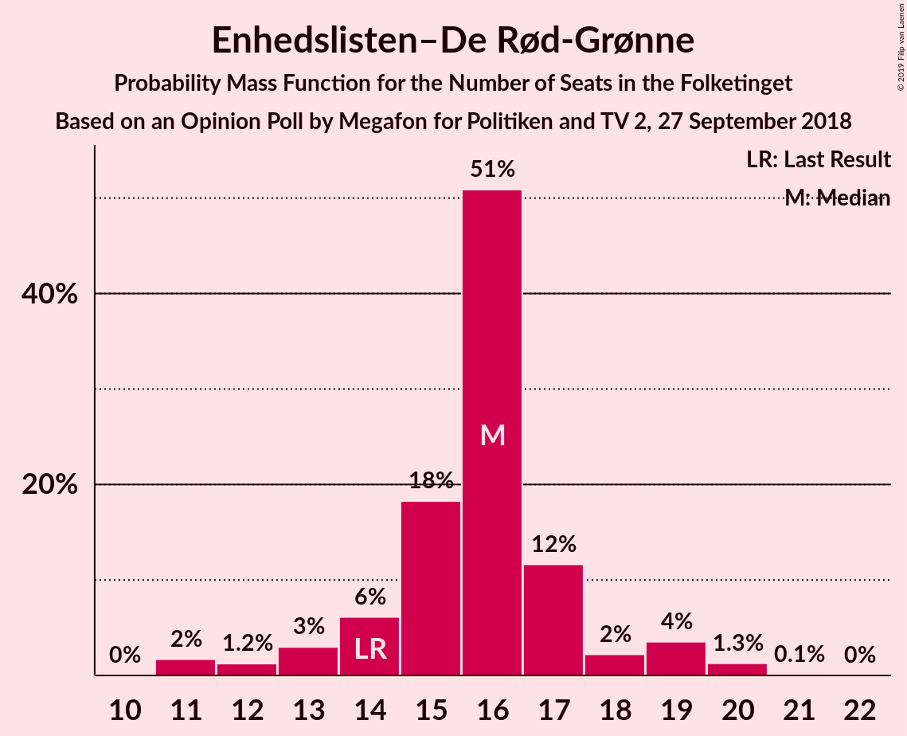
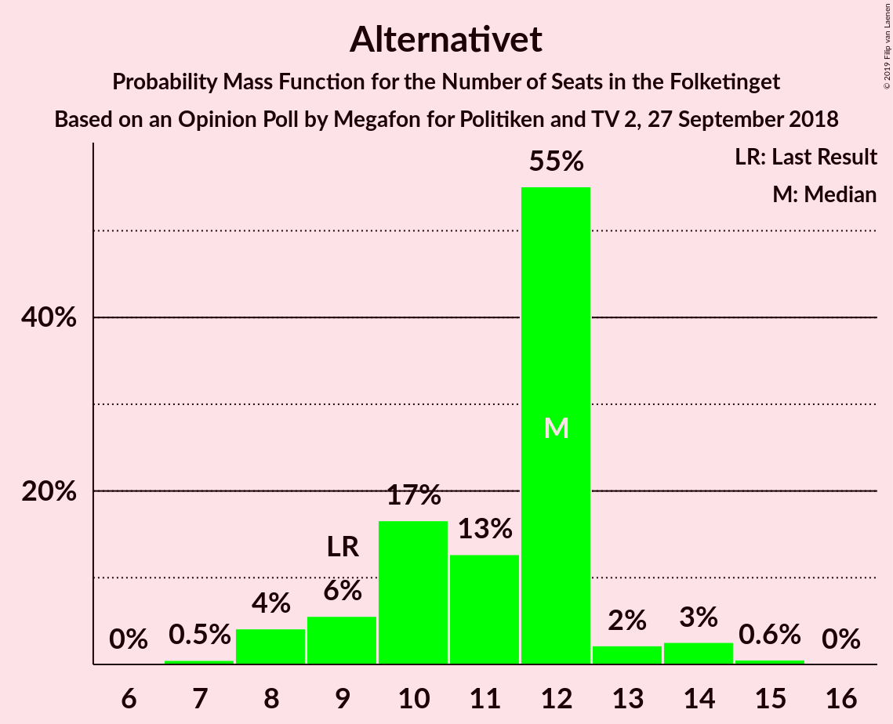

# Opinion Poll by Megafon for Politiken and TV 2, 27 September 2018

<a href="#voting-intentions">Voting Intentions</a> | <a href="#seats">Seats</a> | <a href="#coalitions">Coalitions</a> | <a href="#technical-information">Technical Information</a>

## Voting Intentions

### Confidence Intervals

| Party | Last Result | Poll Result | 80% Confidence Interval | 90% Confidence Interval | 95% Confidence Interval | 99% Confidence Interval |
|:-----:|:-----------:|:-----------:|:-----------------------:|:-----------------------:|:-----------------------:|:-----------------------:|
| Socialdemokraterne | 26.3% | 25.1% | 23.2–27.0% |22.7–27.6% |22.3–28.0% |21.4–29.0% |
| Venstre | 19.5% | 17.6% | 16.0–19.3% |15.6–19.8% |15.2–20.3% |14.5–21.1% |
| Dansk Folkeparti | 21.1% | 15.9% | 14.4–17.6% |13.9–18.0% |13.6–18.4% |12.9–19.3% |
| Enhedslisten–De Rød-Grønne | 7.8% | 8.5% | 7.4–9.8% |7.1–10.2% |6.8–10.6% |6.3–11.2% |
| Radikale Venstre | 4.6% | 8.0% | 7.0–9.4% |6.7–9.7% |6.4–10.1% |5.9–10.7% |
| Socialistisk Folkeparti | 4.2% | 6.2% | 5.3–7.4% |5.0–7.7% |4.8–8.0% |4.4–8.6% |
| Alternativet | 4.8% | 5.7% | 4.8–6.9% |4.6–7.2% |4.4–7.5% |4.0–8.1% |
| Liberal Alliance | 7.5% | 4.7% | 3.9–5.8% |3.7–6.1% |3.5–6.3% |3.1–6.9% |
| Det Konservative Folkeparti | 3.4% | 4.5% | 3.7–5.5% |3.5–5.8% |3.3–6.1% |3.0–6.6% |
| Nye Borgerlige | 0.0% | 2.8% | 2.2–3.6% |2.0–3.9% |1.9–4.1% |1.6–4.5% |
| Kristendemokraterne | 0.8% | 0.9% | 0.6–1.5% |0.5–1.7% |0.5–1.8% |0.4–2.1% |

*Note:* The poll result column reflects the actual value used in the calculations. Published results may vary slightly, and in addition be rounded to fewer digits.

## Seats

### Confidence Intervals

| Party | Last Result | Median | 80% Confidence Interval | 90% Confidence Interval | 95% Confidence Interval | 99% Confidence Interval |
|:-----:|:-----------:|:------:|:-----------------------:|:-----------------------:|:-----------------------:|:-----------------------:|
| <a href="#socialdemokraterne">Socialdemokraterne</a> | 47 | 44 | 42–48 |40–48 |38–50 |36–51 |
| <a href="#venstre">Venstre</a> | 34 | 30 | 28–34 |25–34 |24–36 |24–38 |
| <a href="#dansk-folkeparti">Dansk Folkeparti</a> | 37 | 30 | 25–30 |24–31 |24–32 |23–34 |
| <a href="#enhedslisten–de-rød-grønne">Enhedslisten–De Rød-Grønne</a> | 14 | 15 | 12–17 |11–17 |11–18 |11–21 |
| <a href="#radikale-venstre">Radikale Venstre</a> | 8 | 14 | 12–17 |11–19 |11–19 |9–19 |
| <a href="#socialistisk-folkeparti">Socialistisk Folkeparti</a> | 7 | 11 | 9–13 |8–14 |8–14 |7–15 |
| <a href="#alternativet">Alternativet</a> | 9 | 11 | 8–12 |8–14 |8–14 |7–14 |
| <a href="#liberal-alliance">Liberal Alliance</a> | 13 | 9 | 6–11 |5–11 |5–11 |5–13 |
| <a href="#det-konservative-folkeparti">Det Konservative Folkeparti</a> | 6 | 7 | 6–9 |6–10 |5–10 |5–11 |
| <a href="#nye-borgerlige">Nye Borgerlige</a> | 0 | 5 | 4–8 |0–8 |0–8 |0–8 |
| <a href="#kristendemokraterne">Kristendemokraterne</a> | 0 | 0 | 0 |0 |0 |0–4 |

### Socialdemokraterne

*For a full overview of the results for this party, see the [Socialdemokraterne](party-socialdemokraterne.html) page.*

| Number of Seats | Probability | Accumulated | Special Marks |
|:---------------:|:-----------:|:-----------:|:-------------:|
| 35 | 0.1% | 100% |  |
| 36 | 2% | 99.9% |  |
| 37 | 0.4% | 98% |  |
| 38 | 0.4% | 98% |  |
| 39 | 1.3% | 97% |  |
| 40 | 3% | 96% |  |
| 41 | 2% | 93% |  |
| 42 | 5% | 92% |  |
| 43 | 26% | 87% |  |
| 44 | 25% | 61% | Median |
| 45 | 10% | 36% |  |
| 46 | 5% | 26% |  |
| 47 | 10% | 21% | Last Result |
| 48 | 6% | 11% |  |
| 49 | 0.9% | 5% |  |
| 50 | 2% | 4% |  |
| 51 | 2% | 2% |  |
| 52 | 0% | 0.5% |  |
| 53 | 0.4% | 0.4% |  |
| 54 | 0% | 0% |  |

### Venstre

*For a full overview of the results for this party, see the [Venstre](party-venstre.html) page.*

| Number of Seats | Probability | Accumulated | Special Marks |
|:---------------:|:-----------:|:-----------:|:-------------:|
| 24 | 3% | 100% |  |
| 25 | 2% | 97% |  |
| 26 | 1.5% | 95% |  |
| 27 | 2% | 93% |  |
| 28 | 24% | 91% |  |
| 29 | 12% | 68% |  |
| 30 | 6% | 55% | Median |
| 31 | 26% | 49% |  |
| 32 | 1.4% | 23% |  |
| 33 | 4% | 21% |  |
| 34 | 13% | 17% | Last Result |
| 35 | 2% | 4% |  |
| 36 | 0.9% | 3% |  |
| 37 | 0.1% | 2% |  |
| 38 | 2% | 2% |  |
| 39 | 0.1% | 0.1% |  |
| 40 | 0% | 0% |  |

### Dansk Folkeparti

*For a full overview of the results for this party, see the [Dansk Folkeparti](party-danskfolkeparti.html) page.*

| Number of Seats | Probability | Accumulated | Special Marks |
|:---------------:|:-----------:|:-----------:|:-------------:|
| 20 | 0.1% | 100% |  |
| 21 | 0% | 99.9% |  |
| 22 | 0.3% | 99.9% |  |
| 23 | 2% | 99.6% |  |
| 24 | 6% | 98% |  |
| 25 | 2% | 91% |  |
| 26 | 4% | 89% |  |
| 27 | 2% | 85% |  |
| 28 | 2% | 83% |  |
| 29 | 14% | 81% |  |
| 30 | 60% | 67% | Median |
| 31 | 3% | 8% |  |
| 32 | 2% | 4% |  |
| 33 | 1.4% | 2% |  |
| 34 | 0.3% | 0.6% |  |
| 35 | 0.2% | 0.2% |  |
| 36 | 0% | 0% |  |
| 37 | 0% | 0% | Last Result |

### Enhedslisten–De Rød-Grønne

*For a full overview of the results for this party, see the [Enhedslisten–De Rød-Grønne](party-enhedslisten–derød-grønne.html) page.*

| Number of Seats | Probability | Accumulated | Special Marks |
|:---------------:|:-----------:|:-----------:|:-------------:|
| 10 | 0.3% | 100% |  |
| 11 | 6% | 99.7% |  |
| 12 | 9% | 94% |  |
| 13 | 15% | 85% |  |
| 14 | 20% | 70% | Last Result |
| 15 | 15% | 51% | Median |
| 16 | 8% | 36% |  |
| 17 | 23% | 28% |  |
| 18 | 2% | 5% |  |
| 19 | 1.5% | 2% |  |
| 20 | 0.1% | 0.8% |  |
| 21 | 0.4% | 0.6% |  |
| 22 | 0.2% | 0.2% |  |
| 23 | 0% | 0% |  |

### Radikale Venstre

*For a full overview of the results for this party, see the [Radikale Venstre](party-radikalevenstre.html) page.*

| Number of Seats | Probability | Accumulated | Special Marks |
|:---------------:|:-----------:|:-----------:|:-------------:|
| 8 | 0% | 100% | Last Result |
| 9 | 0.7% | 100% |  |
| 10 | 0.4% | 99.3% |  |
| 11 | 6% | 98.9% |  |
| 12 | 25% | 93% |  |
| 13 | 8% | 67% |  |
| 14 | 11% | 59% | Median |
| 15 | 25% | 47% |  |
| 16 | 12% | 22% |  |
| 17 | 3% | 11% |  |
| 18 | 0.2% | 7% |  |
| 19 | 7% | 7% |  |
| 20 | 0% | 0.1% |  |
| 21 | 0% | 0% |  |

### Socialistisk Folkeparti

*For a full overview of the results for this party, see the [Socialistisk Folkeparti](party-socialistiskfolkeparti.html) page.*

| Number of Seats | Probability | Accumulated | Special Marks |
|:---------------:|:-----------:|:-----------:|:-------------:|
| 7 | 1.4% | 100% | Last Result |
| 8 | 6% | 98.6% |  |
| 9 | 3% | 93% |  |
| 10 | 31% | 90% |  |
| 11 | 11% | 59% | Median |
| 12 | 12% | 48% |  |
| 13 | 30% | 36% |  |
| 14 | 4% | 7% |  |
| 15 | 2% | 2% |  |
| 16 | 0.1% | 0.3% |  |
| 17 | 0.2% | 0.3% |  |
| 18 | 0.1% | 0.1% |  |
| 19 | 0% | 0% |  |

### Alternativet

*For a full overview of the results for this party, see the [Alternativet](party-alternativet.html) page.*

| Number of Seats | Probability | Accumulated | Special Marks |
|:---------------:|:-----------:|:-----------:|:-------------:|
| 7 | 2% | 100% |  |
| 8 | 13% | 98% |  |
| 9 | 10% | 85% | Last Result |
| 10 | 10% | 75% |  |
| 11 | 48% | 64% | Median |
| 12 | 7% | 16% |  |
| 13 | 3% | 9% |  |
| 14 | 6% | 6% |  |
| 15 | 0.1% | 0.1% |  |
| 16 | 0.1% | 0.1% |  |
| 17 | 0% | 0% |  |

### Liberal Alliance

*For a full overview of the results for this party, see the [Liberal Alliance](party-liberalalliance.html) page.*

| Number of Seats | Probability | Accumulated | Special Marks |
|:---------------:|:-----------:|:-----------:|:-------------:|
| 5 | 7% | 100% |  |
| 6 | 20% | 93% |  |
| 7 | 16% | 73% |  |
| 8 | 6% | 57% |  |
| 9 | 7% | 51% | Median |
| 10 | 32% | 44% |  |
| 11 | 11% | 12% |  |
| 12 | 0.3% | 1.1% |  |
| 13 | 0.7% | 0.7% | Last Result |
| 14 | 0% | 0% |  |

### Det Konservative Folkeparti

*For a full overview of the results for this party, see the [Det Konservative Folkeparti](party-detkonservativefolkeparti.html) page.*

| Number of Seats | Probability | Accumulated | Special Marks |
|:---------------:|:-----------:|:-----------:|:-------------:|
| 4 | 0.1% | 100% |  |
| 5 | 5% | 99.9% |  |
| 6 | 34% | 95% | Last Result |
| 7 | 26% | 61% | Median |
| 8 | 12% | 35% |  |
| 9 | 16% | 23% |  |
| 10 | 5% | 6% |  |
| 11 | 1.0% | 1.5% |  |
| 12 | 0.4% | 0.5% |  |
| 13 | 0% | 0.1% |  |
| 14 | 0.1% | 0.1% |  |
| 15 | 0% | 0% |  |

### Nye Borgerlige

*For a full overview of the results for this party, see the [Nye Borgerlige](party-nyeborgerlige.html) page.*

| Number of Seats | Probability | Accumulated | Special Marks |
|:---------------:|:-----------:|:-----------:|:-------------:|
| 0 | 7% | 100% | Last Result |
| 1 | 0% | 93% |  |
| 2 | 0% | 93% |  |
| 3 | 0% | 93% |  |
| 4 | 40% | 93% |  |
| 5 | 11% | 53% | Median |
| 6 | 15% | 41% |  |
| 7 | 8% | 26% |  |
| 8 | 18% | 18% |  |
| 9 | 0.1% | 0.1% |  |
| 10 | 0% | 0% |  |

### Kristendemokraterne

*For a full overview of the results for this party, see the [Kristendemokraterne](party-kristendemokraterne.html) page.*

| Number of Seats | Probability | Accumulated | Special Marks |
|:---------------:|:-----------:|:-----------:|:-------------:|
| 0 | 98% | 100% | Last Result, Median |
| 1 | 0% | 2% |  |
| 2 | 0% | 2% |  |
| 3 | 0% | 2% |  |
| 4 | 2% | 2% |  |
| 5 | 0% | 0% |  |

## Coalitions

### Confidence Intervals

| Coalition | Last Result | Median | Majority? | 80% Confidence Interval | 90% Confidence Interval | 95% Confidence Interval | 99% Confidence Interval |
|:---------:|:-----------:|:------:|:---------:|:-----------------------:|:-----------------------:|:-----------------------:|:-----------------------:|
| Socialdemokraterne – Enhedslisten–De Rød-Grønne – Radikale Venstre – Socialistisk Folkeparti – Alternativet | 85 | 94 | 97% | 91–98 | 91–101 | 88–101 | 87–107 |
| Socialdemokraterne – Enhedslisten–De Rød-Grønne – Radikale Venstre – Socialistisk Folkeparti | 76 | 84 | 9% | 80–89 | 79–93 | 79–93 | 77–96 |
| Socialdemokraterne – Enhedslisten–De Rød-Grønne – Socialistisk Folkeparti – Alternativet | 77 | 81 | 2% | 76–85 | 76–85 | 74–88 | 70–90 |
| Venstre – Dansk Folkeparti – Liberal Alliance – Det Konservative Folkeparti – Nye Borgerlige – Kristendemokraterne | 90 | 81 | 0.1% | 77–84 | 74–84 | 74–87 | 68–88 |
| Venstre – Dansk Folkeparti – Liberal Alliance – Det Konservative Folkeparti – Nye Borgerlige | 90 | 80 | 0.1% | 77–84 | 74–84 | 74–87 | 68–88 |
| Venstre – Dansk Folkeparti – Liberal Alliance – Det Konservative Folkeparti – Kristendemokraterne | 90 | 74 | 0% | 71–80 | 68–81 | 68–83 | 68–84 |
| Venstre – Dansk Folkeparti – Liberal Alliance – Det Konservative Folkeparti | 90 | 74 | 0% | 71–80 | 68–81 | 68–83 | 68–84 |
| Socialdemokraterne – Enhedslisten–De Rød-Grønne – Socialistisk Folkeparti | 68 | 70 | 0% | 66–74 | 64–75 | 64–78 | 61–79 |
| Socialdemokraterne – Radikale Venstre – Socialistisk Folkeparti | 62 | 69 | 0% | 67–76 | 66–77 | 65–77 | 62–81 |
| Socialdemokraterne – Radikale Venstre | 55 | 58 | 0% | 56–64 | 54–64 | 54–65 | 51–67 |
| Venstre – Liberal Alliance – Det Konservative Folkeparti | 53 | 44 | 0% | 43–51 | 42–52 | 41–54 | 41–55 |
| Venstre – Det Konservative Folkeparti | 40 | 38 | 0% | 34–42 | 34–43 | 34–45 | 31–46 |
| Venstre | 34 | 30 | 0% | 28–34 | 25–34 | 24–36 | 24–38 |

### Socialdemokraterne – Enhedslisten–De Rød-Grønne – Radikale Venstre – Socialistisk Folkeparti – Alternativet

| Number of Seats | Probability | Accumulated | Special Marks |
|:---------------:|:-----------:|:-----------:|:-------------:|
| 85 | 0.1% | 100% | Last Result |
| 86 | 0.3% | 99.9% |  |
| 87 | 2% | 99.6% |  |
| 88 | 0.3% | 98% |  |
| 89 | 0.1% | 97% |  |
| 90 | 0.7% | 97% | Majority |
| 91 | 9% | 97% |  |
| 92 | 12% | 88% |  |
| 93 | 22% | 76% |  |
| 94 | 4% | 53% |  |
| 95 | 2% | 49% | Median |
| 96 | 0.7% | 47% |  |
| 97 | 30% | 46% |  |
| 98 | 7% | 16% |  |
| 99 | 1.4% | 10% |  |
| 100 | 0.3% | 8% |  |
| 101 | 6% | 8% |  |
| 102 | 0.7% | 2% |  |
| 103 | 0.1% | 2% |  |
| 104 | 0% | 2% |  |
| 105 | 0.2% | 2% |  |
| 106 | 0% | 1.4% |  |
| 107 | 1.4% | 1.4% |  |
| 108 | 0% | 0% |  |

### Socialdemokraterne – Enhedslisten–De Rød-Grønne – Radikale Venstre – Socialistisk Folkeparti

| Number of Seats | Probability | Accumulated | Special Marks |
|:---------------:|:-----------:|:-----------:|:-------------:|
| 73 | 0.1% | 100% |  |
| 74 | 0% | 99.9% |  |
| 75 | 0% | 99.9% |  |
| 76 | 0% | 99.9% | Last Result |
| 77 | 0.4% | 99.9% |  |
| 78 | 1.4% | 99.5% |  |
| 79 | 7% | 98% |  |
| 80 | 2% | 91% |  |
| 81 | 4% | 89% |  |
| 82 | 22% | 85% |  |
| 83 | 11% | 63% |  |
| 84 | 7% | 53% | Median |
| 85 | 4% | 46% |  |
| 86 | 24% | 41% |  |
| 87 | 2% | 17% |  |
| 88 | 3% | 15% |  |
| 89 | 3% | 11% |  |
| 90 | 0.3% | 9% | Majority |
| 91 | 0.8% | 8% |  |
| 92 | 0.3% | 8% |  |
| 93 | 6% | 7% |  |
| 94 | 0% | 1.4% |  |
| 95 | 0% | 1.4% |  |
| 96 | 1.4% | 1.4% |  |
| 97 | 0% | 0% |  |

### Socialdemokraterne – Enhedslisten–De Rød-Grønne – Socialistisk Folkeparti – Alternativet

| Number of Seats | Probability | Accumulated | Special Marks |
|:---------------:|:-----------:|:-----------:|:-------------:|
| 70 | 1.4% | 100% |  |
| 71 | 0% | 98.6% |  |
| 72 | 0.1% | 98.6% |  |
| 73 | 0.4% | 98% |  |
| 74 | 0.7% | 98% |  |
| 75 | 0.1% | 97% |  |
| 76 | 11% | 97% |  |
| 77 | 3% | 86% | Last Result |
| 78 | 25% | 83% |  |
| 79 | 1.0% | 58% |  |
| 80 | 3% | 57% |  |
| 81 | 7% | 54% | Median |
| 82 | 10% | 47% |  |
| 83 | 3% | 37% |  |
| 84 | 6% | 35% |  |
| 85 | 25% | 29% |  |
| 86 | 0.4% | 3% |  |
| 87 | 0.3% | 3% |  |
| 88 | 0.4% | 3% |  |
| 89 | 0.4% | 2% |  |
| 90 | 2% | 2% | Majority |
| 91 | 0% | 0% |  |

### Venstre – Dansk Folkeparti – Liberal Alliance – Det Konservative Folkeparti – Nye Borgerlige – Kristendemokraterne

| Number of Seats | Probability | Accumulated | Special Marks |
|:---------------:|:-----------:|:-----------:|:-------------:|
| 68 | 1.4% | 100% |  |
| 69 | 0% | 98.6% |  |
| 70 | 0.2% | 98.6% |  |
| 71 | 0% | 98% |  |
| 72 | 0.1% | 98% |  |
| 73 | 0.7% | 98% |  |
| 74 | 6% | 98% |  |
| 75 | 0.3% | 92% |  |
| 76 | 1.4% | 92% |  |
| 77 | 7% | 90% |  |
| 78 | 30% | 84% |  |
| 79 | 0.7% | 54% |  |
| 80 | 2% | 53% |  |
| 81 | 4% | 51% | Median |
| 82 | 22% | 47% |  |
| 83 | 12% | 24% |  |
| 84 | 9% | 12% |  |
| 85 | 0.7% | 3% |  |
| 86 | 0.1% | 3% |  |
| 87 | 0.3% | 3% |  |
| 88 | 2% | 2% |  |
| 89 | 0.3% | 0.4% |  |
| 90 | 0.1% | 0.1% | Last Result, Majority |
| 91 | 0% | 0% |  |

### Venstre – Dansk Folkeparti – Liberal Alliance – Det Konservative Folkeparti – Nye Borgerlige

| Number of Seats | Probability | Accumulated | Special Marks |
|:---------------:|:-----------:|:-----------:|:-------------:|
| 68 | 1.4% | 100% |  |
| 69 | 0% | 98.6% |  |
| 70 | 0.2% | 98.6% |  |
| 71 | 0% | 98% |  |
| 72 | 0.1% | 98% |  |
| 73 | 0.7% | 98% |  |
| 74 | 6% | 98% |  |
| 75 | 0.3% | 92% |  |
| 76 | 1.4% | 91% |  |
| 77 | 7% | 90% |  |
| 78 | 29% | 83% |  |
| 79 | 0.7% | 54% |  |
| 80 | 4% | 53% |  |
| 81 | 4% | 50% | Median |
| 82 | 22% | 45% |  |
| 83 | 12% | 23% |  |
| 84 | 7% | 11% |  |
| 85 | 0.7% | 3% |  |
| 86 | 0.1% | 3% |  |
| 87 | 0.3% | 3% |  |
| 88 | 2% | 2% |  |
| 89 | 0.3% | 0.4% |  |
| 90 | 0.1% | 0.1% | Last Result, Majority |
| 91 | 0% | 0% |  |

### Venstre – Dansk Folkeparti – Liberal Alliance – Det Konservative Folkeparti – Kristendemokraterne

| Number of Seats | Probability | Accumulated | Special Marks |
|:---------------:|:-----------:|:-----------:|:-------------:|
| 66 | 0.2% | 100% |  |
| 67 | 0.2% | 99.8% |  |
| 68 | 7% | 99.7% |  |
| 69 | 0.8% | 92% |  |
| 70 | 0.1% | 92% |  |
| 71 | 3% | 92% |  |
| 72 | 4% | 88% |  |
| 73 | 8% | 85% |  |
| 74 | 42% | 77% |  |
| 75 | 0.4% | 35% |  |
| 76 | 6% | 34% | Median |
| 77 | 8% | 29% |  |
| 78 | 2% | 21% |  |
| 79 | 6% | 18% |  |
| 80 | 5% | 12% |  |
| 81 | 2% | 7% |  |
| 82 | 2% | 5% |  |
| 83 | 0.9% | 3% |  |
| 84 | 2% | 2% |  |
| 85 | 0% | 0% |  |
| 86 | 0% | 0% |  |
| 87 | 0% | 0% |  |
| 88 | 0% | 0% |  |
| 89 | 0% | 0% |  |
| 90 | 0% | 0% | Last Result, Majority |

### Venstre – Dansk Folkeparti – Liberal Alliance – Det Konservative Folkeparti

| Number of Seats | Probability | Accumulated | Special Marks |
|:---------------:|:-----------:|:-----------:|:-------------:|
| 66 | 0.2% | 100% |  |
| 67 | 0.2% | 99.8% |  |
| 68 | 7% | 99.6% |  |
| 69 | 0.8% | 92% |  |
| 70 | 0.2% | 92% |  |
| 71 | 3% | 91% |  |
| 72 | 4% | 88% |  |
| 73 | 9% | 84% |  |
| 74 | 42% | 75% |  |
| 75 | 0.4% | 33% |  |
| 76 | 6% | 33% | Median |
| 77 | 7% | 27% |  |
| 78 | 2% | 21% |  |
| 79 | 6% | 18% |  |
| 80 | 5% | 12% |  |
| 81 | 2% | 7% |  |
| 82 | 2% | 5% |  |
| 83 | 0.9% | 3% |  |
| 84 | 2% | 2% |  |
| 85 | 0% | 0% |  |
| 86 | 0% | 0% |  |
| 87 | 0% | 0% |  |
| 88 | 0% | 0% |  |
| 89 | 0% | 0% |  |
| 90 | 0% | 0% | Last Result, Majority |

### Socialdemokraterne – Enhedslisten–De Rød-Grønne – Socialistisk Folkeparti

| Number of Seats | Probability | Accumulated | Special Marks |
|:---------------:|:-----------:|:-----------:|:-------------:|
| 60 | 0.1% | 100% |  |
| 61 | 1.1% | 99.9% |  |
| 62 | 0% | 98.8% |  |
| 63 | 0.5% | 98.7% |  |
| 64 | 6% | 98% |  |
| 65 | 1.0% | 93% |  |
| 66 | 2% | 92% |  |
| 67 | 22% | 89% |  |
| 68 | 8% | 67% | Last Result |
| 69 | 5% | 59% |  |
| 70 | 6% | 54% | Median |
| 71 | 2% | 49% |  |
| 72 | 10% | 47% |  |
| 73 | 2% | 37% |  |
| 74 | 28% | 35% |  |
| 75 | 3% | 6% |  |
| 76 | 0.3% | 3% |  |
| 77 | 0.2% | 3% |  |
| 78 | 0.4% | 3% |  |
| 79 | 2% | 2% |  |
| 80 | 0% | 0% |  |

### Socialdemokraterne – Radikale Venstre – Socialistisk Folkeparti

| Number of Seats | Probability | Accumulated | Special Marks |
|:---------------:|:-----------:|:-----------:|:-------------:|
| 59 | 0.1% | 100% |  |
| 60 | 0% | 99.9% |  |
| 61 | 0.1% | 99.9% |  |
| 62 | 0.3% | 99.8% | Last Result |
| 63 | 2% | 99.5% |  |
| 64 | 0.2% | 98% |  |
| 65 | 0.4% | 98% |  |
| 66 | 3% | 97% |  |
| 67 | 7% | 94% |  |
| 68 | 27% | 87% |  |
| 69 | 29% | 60% | Median |
| 70 | 9% | 32% |  |
| 71 | 6% | 23% |  |
| 72 | 2% | 17% |  |
| 73 | 0.7% | 14% |  |
| 74 | 0.5% | 14% |  |
| 75 | 0.4% | 13% |  |
| 76 | 3% | 13% |  |
| 77 | 8% | 9% |  |
| 78 | 0% | 2% |  |
| 79 | 0.2% | 2% |  |
| 80 | 0% | 1.4% |  |
| 81 | 1.4% | 1.4% |  |
| 82 | 0% | 0% |  |

### Socialdemokraterne – Radikale Venstre

| Number of Seats | Probability | Accumulated | Special Marks |
|:---------------:|:-----------:|:-----------:|:-------------:|
| 49 | 0.1% | 100% |  |
| 50 | 0.3% | 99.9% |  |
| 51 | 2% | 99.7% |  |
| 52 | 0.2% | 98% |  |
| 53 | 0.1% | 98% |  |
| 54 | 3% | 98% |  |
| 55 | 2% | 95% | Last Result |
| 56 | 30% | 93% |  |
| 57 | 7% | 63% |  |
| 58 | 27% | 57% | Median |
| 59 | 2% | 30% |  |
| 60 | 6% | 28% |  |
| 61 | 1.0% | 22% |  |
| 62 | 2% | 21% |  |
| 63 | 6% | 18% |  |
| 64 | 9% | 12% |  |
| 65 | 2% | 4% |  |
| 66 | 0% | 2% |  |
| 67 | 2% | 2% |  |
| 68 | 0% | 0.1% |  |
| 69 | 0.1% | 0.1% |  |
| 70 | 0% | 0% |  |

### Venstre – Liberal Alliance – Det Konservative Folkeparti

| Number of Seats | Probability | Accumulated | Special Marks |
|:---------------:|:-----------:|:-----------:|:-------------:|
| 39 | 0.2% | 100% |  |
| 40 | 0.1% | 99.8% |  |
| 41 | 4% | 99.8% |  |
| 42 | 2% | 96% |  |
| 43 | 6% | 94% |  |
| 44 | 46% | 87% |  |
| 45 | 4% | 41% |  |
| 46 | 6% | 37% | Median |
| 47 | 3% | 31% |  |
| 48 | 7% | 28% |  |
| 49 | 6% | 21% |  |
| 50 | 1.4% | 15% |  |
| 51 | 7% | 13% |  |
| 52 | 3% | 6% |  |
| 53 | 0.4% | 3% | Last Result |
| 54 | 0.5% | 3% |  |
| 55 | 2% | 2% |  |
| 56 | 0.1% | 0.1% |  |
| 57 | 0% | 0% |  |

### Venstre – Det Konservative Folkeparti

| Number of Seats | Probability | Accumulated | Special Marks |
|:---------------:|:-----------:|:-----------:|:-------------:|
| 31 | 2% | 100% |  |
| 32 | 0.1% | 98% |  |
| 33 | 0.3% | 98% |  |
| 34 | 26% | 98% |  |
| 35 | 2% | 71% |  |
| 36 | 8% | 69% |  |
| 37 | 10% | 62% | Median |
| 38 | 22% | 52% |  |
| 39 | 8% | 30% |  |
| 40 | 7% | 22% | Last Result |
| 41 | 5% | 15% |  |
| 42 | 2% | 11% |  |
| 43 | 5% | 8% |  |
| 44 | 0.8% | 4% |  |
| 45 | 2% | 3% |  |
| 46 | 0.6% | 0.8% |  |
| 47 | 0.1% | 0.2% |  |
| 48 | 0.1% | 0.1% |  |
| 49 | 0% | 0% |  |

### Venstre

| Number of Seats | Probability | Accumulated | Special Marks |
|:---------------:|:-----------:|:-----------:|:-------------:|
| 24 | 3% | 100% |  |
| 25 | 2% | 97% |  |
| 26 | 1.5% | 95% |  |
| 27 | 2% | 93% |  |
| 28 | 24% | 91% |  |
| 29 | 12% | 68% |  |
| 30 | 6% | 55% | Median |
| 31 | 26% | 49% |  |
| 32 | 1.4% | 23% |  |
| 33 | 4% | 21% |  |
| 34 | 13% | 17% | Last Result |
| 35 | 2% | 4% |  |
| 36 | 0.9% | 3% |  |
| 37 | 0.1% | 2% |  |
| 38 | 2% | 2% |  |
| 39 | 0.1% | 0.1% |  |
| 40 | 0% | 0% |  |

## Technical Information

### Opinion Poll

+ **Polling firm:** Megafon
+ **Commissioner(s):** Politiken and TV 2
+ **Fieldwork period:** 27 September 2018

### Calculations

+ **Sample size:** 870
+ **Simulations done:** 131,072
+ **Error estimate:** 3.98%

