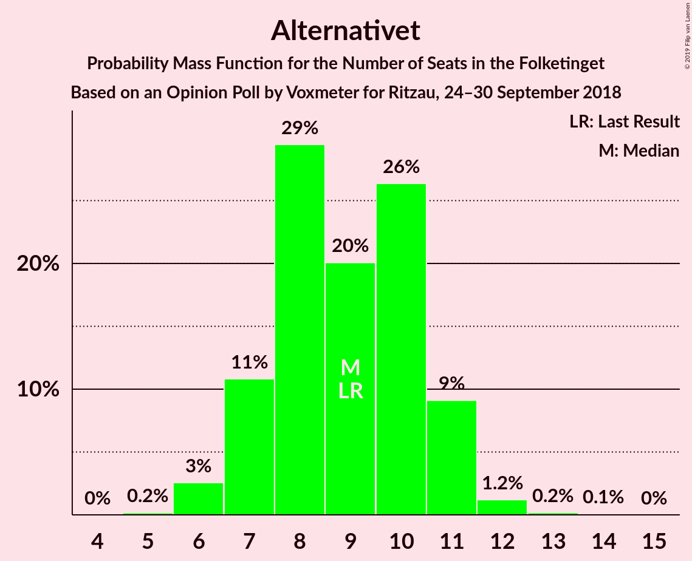
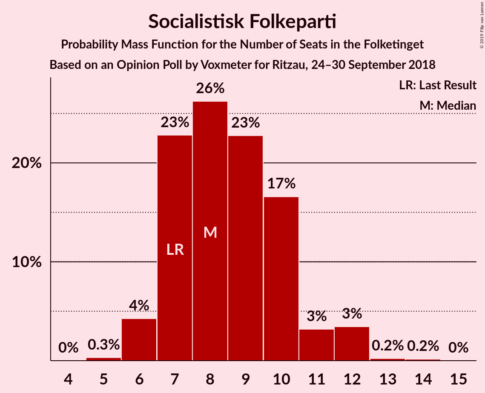
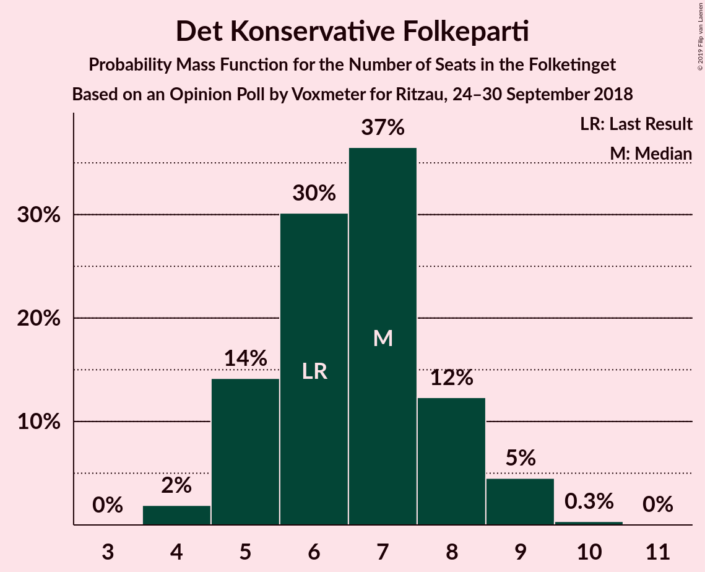
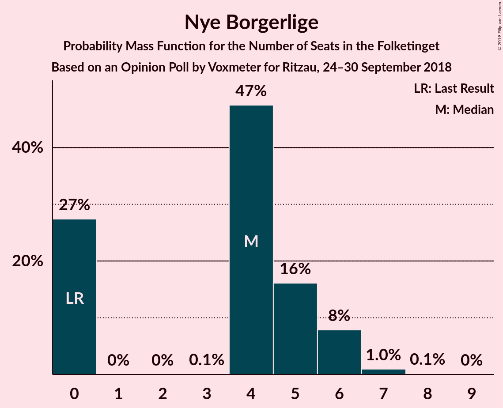
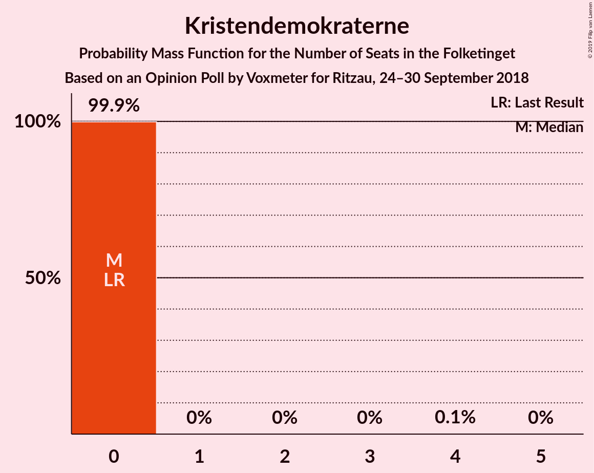
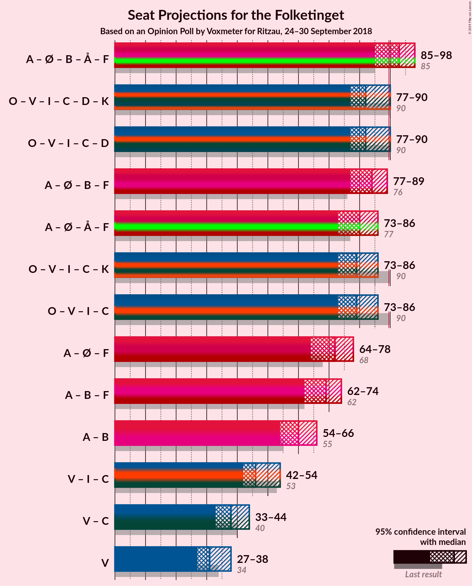

# Opinion Poll by Voxmeter for Ritzau, 24–30 September 2018

<a href="#voting-intentions">Voting Intentions</a> | <a href="#seats">Seats</a> | <a href="#coalitions">Coalitions</a> | <a href="#technical-information">Technical Information</a>

## Voting Intentions

### Confidence Intervals

| Party | Last Result | Poll Result | 80% Confidence Interval | 90% Confidence Interval | 95% Confidence Interval | 99% Confidence Interval |
|:-----:|:-----------:|:-----------:|:-----------------------:|:-----------------------:|:-----------------------:|:-----------------------:|
| Socialdemokraterne | 26.3% | 26.9% | 25.2–28.7% |24.7–29.3% |24.3–29.7% |23.5–30.6% |
| Dansk Folkeparti | 21.1% | 18.4% | 16.9–20.0% |16.5–20.5% |16.1–20.9% |15.4–21.7% |
| Venstre | 19.5% | 18.1% | 16.6–19.7% |16.2–20.1% |15.8–20.6% |15.2–21.4% |
| Enhedslisten–De Rød-Grønne | 7.8% | 8.5% | 7.4–9.7% |7.1–10.0% |6.9–10.3% |6.4–10.9% |
| Radikale Venstre | 4.6% | 6.5% | 5.6–7.6% |5.4–7.9% |5.2–8.2% |4.8–8.7% |
| Alternativet | 4.8% | 4.9% | 4.1–5.8% |3.9–6.1% |3.7–6.4% |3.4–6.9% |
| Liberal Alliance | 7.5% | 4.8% | 4.0–5.7% |3.8–6.0% |3.6–6.2% |3.3–6.7% |
| Socialistisk Folkeparti | 4.2% | 4.8% | 4.0–5.7% |3.8–6.0% |3.6–6.2% |3.3–6.7% |
| Det Konservative Folkeparti | 3.4% | 3.6% | 2.9–4.5% |2.8–4.7% |2.6–4.9% |2.3–5.4% |
| Nye Borgerlige | 0.0% | 2.3% | 1.8–3.1% |1.7–3.3% |1.6–3.5% |1.4–3.8% |
| Kristendemokraterne | 0.8% | 0.8% | 0.5–1.3% |0.4–1.4% |0.4–1.5% |0.3–1.8% |

*Note:* The poll result column reflects the actual value used in the calculations. Published results may vary slightly, and in addition be rounded to fewer digits.

## Seats

### Confidence Intervals

| Party | Last Result | Median | 80% Confidence Interval | 90% Confidence Interval | 95% Confidence Interval | 99% Confidence Interval |
|:-----:|:-----------:|:------:|:-----------------------:|:-----------------------:|:-----------------------:|:-----------------------:|
| <a href="#socialdemokraterne">Socialdemokraterne</a> | 47 | 45 | 42–51 |42–51 |42–51 |42–52 |
| <a href="#dansk-folkeparti">Dansk Folkeparti</a> | 37 | 34 | 33–34 |33–34 |33–34 |27–37 |
| <a href="#venstre">Venstre</a> | 34 | 26 | 26–31 |26–31 |26–31 |26–35 |
| <a href="#enhedslisten–de-rød-grønne">Enhedslisten–De Rød-Grønne</a> | 14 | 16 | 14–18 |14–18 |14–18 |13–18 |
| <a href="#radikale-venstre">Radikale Venstre</a> | 8 | 11 | 9–11 |9–11 |9–11 |9–11 |
| <a href="#alternativet">Alternativet</a> | 9 | 9 | 6–9 |6–9 |6–9 |6–11 |
| <a href="#liberal-alliance">Liberal Alliance</a> | 13 | 11 | 9–11 |9–11 |9–11 |6–11 |
| <a href="#socialistisk-folkeparti">Socialistisk Folkeparti</a> | 7 | 11 | 8–11 |8–11 |8–11 |8–11 |
| <a href="#det-konservative-folkeparti">Det Konservative Folkeparti</a> | 6 | 8 | 8–10 |8–10 |8–10 |5–10 |
| <a href="#nye-borgerlige">Nye Borgerlige</a> | 0 | 4 | 0–6 |0–6 |0–6 |0–6 |
| <a href="#kristendemokraterne">Kristendemokraterne</a> | 0 | 0 | 0 |0 |0 |0 |

### Socialdemokraterne

*For a full overview of the results for this party, see the [Socialdemokraterne](party-socialdemokraterne.html) page.*

| Number of Seats | Probability | Accumulated | Special Marks |
|:---------------:|:-----------:|:-----------:|:-------------:|
| 42 | 12% | 100% |  |
| 43 | 0% | 88% |  |
| 44 | 0.2% | 88% |  |
| 45 | 68% | 88% | Median |
| 46 | 0% | 20% |  |
| 47 | 0.1% | 20% | Last Result |
| 48 | 0% | 20% |  |
| 49 | 0% | 20% |  |
| 50 | 0% | 20% |  |
| 51 | 19% | 20% |  |
| 52 | 0.6% | 0.7% |  |
| 53 | 0% | 0.1% |  |
| 54 | 0.1% | 0.1% |  |
| 55 | 0% | 0% |  |

### Dansk Folkeparti

*For a full overview of the results for this party, see the [Dansk Folkeparti](party-danskfolkeparti.html) page.*

| Number of Seats | Probability | Accumulated | Special Marks |
|:---------------:|:-----------:|:-----------:|:-------------:|
| 27 | 0.5% | 100% |  |
| 28 | 0.1% | 99.4% |  |
| 29 | 0% | 99.3% |  |
| 30 | 0% | 99.3% |  |
| 31 | 0% | 99.3% |  |
| 32 | 0.3% | 99.2% |  |
| 33 | 12% | 98.9% |  |
| 34 | 86% | 87% | Median |
| 35 | 0% | 1.5% |  |
| 36 | 0% | 1.5% |  |
| 37 | 1.5% | 1.5% | Last Result |
| 38 | 0% | 0% |  |

### Venstre

*For a full overview of the results for this party, see the [Venstre](party-venstre.html) page.*

| Number of Seats | Probability | Accumulated | Special Marks |
|:---------------:|:-----------:|:-----------:|:-------------:|
| 26 | 67% | 100% | Median |
| 27 | 0.1% | 33% |  |
| 28 | 0% | 33% |  |
| 29 | 19% | 33% |  |
| 30 | 2% | 14% |  |
| 31 | 12% | 13% |  |
| 32 | 0.1% | 1.0% |  |
| 33 | 0% | 0.9% |  |
| 34 | 0% | 0.9% | Last Result |
| 35 | 0.5% | 0.9% |  |
| 36 | 0% | 0.4% |  |
| 37 | 0.3% | 0.4% |  |
| 38 | 0% | 0% |  |

### Enhedslisten–De Rød-Grønne

*For a full overview of the results for this party, see the [Enhedslisten–De Rød-Grønne](party-enhedslisten–derød-grønne.html) page.*

| Number of Seats | Probability | Accumulated | Special Marks |
|:---------------:|:-----------:|:-----------:|:-------------:|
| 10 | 0.1% | 100% |  |
| 11 | 0% | 99.9% |  |
| 12 | 0% | 99.8% |  |
| 13 | 1.4% | 99.8% |  |
| 14 | 12% | 98% | Last Result |
| 15 | 0.6% | 87% |  |
| 16 | 67% | 86% | Median |
| 17 | 0.1% | 19% |  |
| 18 | 19% | 19% |  |
| 19 | 0% | 0.1% |  |
| 20 | 0% | 0% |  |

### Radikale Venstre

*For a full overview of the results for this party, see the [Radikale Venstre](party-radikalevenstre.html) page.*

| Number of Seats | Probability | Accumulated | Special Marks |
|:---------------:|:-----------:|:-----------:|:-------------:|
| 8 | 0% | 100% | Last Result |
| 9 | 20% | 100% |  |
| 10 | 0.1% | 80% |  |
| 11 | 79% | 79% | Median |
| 12 | 0% | 0.3% |  |
| 13 | 0.3% | 0.3% |  |
| 14 | 0% | 0% |  |

### Alternativet

*For a full overview of the results for this party, see the [Alternativet](party-alternativet.html) page.*

| Number of Seats | Probability | Accumulated | Special Marks |
|:---------------:|:-----------:|:-----------:|:-------------:|
| 6 | 19% | 100% |  |
| 7 | 12% | 81% |  |
| 8 | 0.3% | 69% |  |
| 9 | 67% | 69% | Last Result, Median |
| 10 | 0.1% | 2% |  |
| 11 | 2% | 2% |  |
| 12 | 0.1% | 0.2% |  |
| 13 | 0.1% | 0.1% |  |
| 14 | 0% | 0% |  |

### Liberal Alliance

*For a full overview of the results for this party, see the [Liberal Alliance](party-liberalalliance.html) page.*

| Number of Seats | Probability | Accumulated | Special Marks |
|:---------------:|:-----------:|:-----------:|:-------------:|
| 5 | 0.3% | 100% |  |
| 6 | 2% | 99.7% |  |
| 7 | 0.2% | 98% |  |
| 8 | 0% | 98% |  |
| 9 | 12% | 98% |  |
| 10 | 19% | 86% |  |
| 11 | 67% | 68% | Median |
| 12 | 0% | 0% |  |
| 13 | 0% | 0% | Last Result |

### Socialistisk Folkeparti

*For a full overview of the results for this party, see the [Socialistisk Folkeparti](party-socialistiskfolkeparti.html) page.*

| Number of Seats | Probability | Accumulated | Special Marks |
|:---------------:|:-----------:|:-----------:|:-------------:|
| 6 | 0.1% | 100% |  |
| 7 | 0.3% | 99.9% | Last Result |
| 8 | 20% | 99.6% |  |
| 9 | 12% | 80% |  |
| 10 | 1.4% | 68% |  |
| 11 | 67% | 67% | Median |
| 12 | 0% | 0.1% |  |
| 13 | 0% | 0.1% |  |
| 14 | 0% | 0% |  |

### Det Konservative Folkeparti

*For a full overview of the results for this party, see the [Det Konservative Folkeparti](party-detkonservativefolkeparti.html) page.*

| Number of Seats | Probability | Accumulated | Special Marks |
|:---------------:|:-----------:|:-----------:|:-------------:|
| 4 | 0.1% | 100% |  |
| 5 | 0.6% | 99.9% |  |
| 6 | 0.3% | 99.3% | Last Result |
| 7 | 0.2% | 99.1% |  |
| 8 | 67% | 98.8% | Median |
| 9 | 13% | 32% |  |
| 10 | 19% | 19% |  |
| 11 | 0% | 0% |  |

### Nye Borgerlige

*For a full overview of the results for this party, see the [Nye Borgerlige](party-nyeborgerlige.html) page.*

| Number of Seats | Probability | Accumulated | Special Marks |
|:---------------:|:-----------:|:-----------:|:-------------:|
| 0 | 20% | 100% | Last Result |
| 1 | 0% | 80% |  |
| 2 | 0% | 80% |  |
| 3 | 0% | 80% |  |
| 4 | 67% | 80% | Median |
| 5 | 2% | 13% |  |
| 6 | 12% | 12% |  |
| 7 | 0% | 0.1% |  |
| 8 | 0% | 0% |  |

### Kristendemokraterne

*For a full overview of the results for this party, see the [Kristendemokraterne](party-kristendemokraterne.html) page.*

| Number of Seats | Probability | Accumulated | Special Marks |
|:---------------:|:-----------:|:-----------:|:-------------:|
| 0 | 99.7% | 100% | Last Result, Median |
| 1 | 0% | 0.3% |  |
| 2 | 0% | 0.3% |  |
| 3 | 0% | 0.3% |  |
| 4 | 0.3% | 0.3% |  |
| 5 | 0% | 0% |  |

## Coalitions

### Confidence Intervals

| Coalition | Last Result | Median | Majority? | 80% Confidence Interval | 90% Confidence Interval | 95% Confidence Interval | 99% Confidence Interval |
|:---------:|:-----------:|:------:|:---------:|:-----------------------:|:-----------------------:|:-----------------------:|:-----------------------:|
| Socialdemokraterne – Enhedslisten–De Rød-Grønne – Radikale Venstre – Alternativet – Socialistisk Folkeparti | 85 | 92 | 87% | 83–92 | 83–92 | 83–92 | 83–97 |
| Dansk Folkeparti – Venstre – Liberal Alliance – Det Konservative Folkeparti – Nye Borgerlige – Kristendemokraterne | 90 | 83 | 0% | 83–88 | 83–88 | 83–88 | 78–88 |
| Dansk Folkeparti – Venstre – Liberal Alliance – Det Konservative Folkeparti – Nye Borgerlige | 90 | 83 | 0% | 83–88 | 83–88 | 83–88 | 78–88 |
| Socialdemokraterne – Enhedslisten–De Rød-Grønne – Radikale Venstre – Socialistisk Folkeparti | 76 | 83 | 0.1% | 76–86 | 76–86 | 76–86 | 76–86 |
| Dansk Folkeparti – Venstre – Liberal Alliance – Det Konservative Folkeparti – Kristendemokraterne | 90 | 79 | 0% | 79–83 | 79–83 | 79–83 | 78–83 |
| Dansk Folkeparti – Venstre – Liberal Alliance – Det Konservative Folkeparti | 90 | 79 | 0% | 79–83 | 79–83 | 79–83 | 78–83 |

### Socialdemokraterne – Enhedslisten–De Rød-Grønne – Radikale Venstre – Alternativet – Socialistisk Folkeparti

| Number of Seats | Probability | Accumulated | Special Marks |
|:---------------:|:-----------:|:-----------:|:-------------:|
| 83 | 12% | 100% |  |
| 84 | 0% | 88% |  |
| 85 | 0% | 88% | Last Result |
| 86 | 0.2% | 88% |  |
| 87 | 0% | 88% |  |
| 88 | 1.4% | 88% |  |
| 89 | 0% | 87% |  |
| 90 | 0% | 87% | Majority |
| 91 | 0.1% | 87% |  |
| 92 | 86% | 87% | Median |
| 93 | 0% | 0.8% |  |
| 94 | 0% | 0.8% |  |
| 95 | 0% | 0.7% |  |
| 96 | 0% | 0.7% |  |
| 97 | 0.6% | 0.7% |  |
| 98 | 0.1% | 0.1% |  |
| 99 | 0% | 0% |  |

### Dansk Folkeparti – Venstre – Liberal Alliance – Det Konservative Folkeparti – Nye Borgerlige – Kristendemokraterne

| Number of Seats | Probability | Accumulated | Special Marks |
|:---------------:|:-----------:|:-----------:|:-------------:|
| 77 | 0.1% | 100% |  |
| 78 | 0.6% | 99.9% |  |
| 79 | 0% | 99.3% |  |
| 80 | 0% | 99.3% |  |
| 81 | 0.1% | 99.3% |  |
| 82 | 0% | 99.2% |  |
| 83 | 86% | 99.2% | Median |
| 84 | 0.1% | 13% |  |
| 85 | 0% | 13% |  |
| 86 | 0% | 13% |  |
| 87 | 1.4% | 13% |  |
| 88 | 12% | 12% |  |
| 89 | 0.2% | 0.3% |  |
| 90 | 0% | 0% | Last Result, Majority |

### Dansk Folkeparti – Venstre – Liberal Alliance – Det Konservative Folkeparti – Nye Borgerlige

| Number of Seats | Probability | Accumulated | Special Marks |
|:---------------:|:-----------:|:-----------:|:-------------:|
| 77 | 0.1% | 100% |  |
| 78 | 0.6% | 99.9% |  |
| 79 | 0% | 99.2% |  |
| 80 | 0% | 99.2% |  |
| 81 | 0% | 99.2% |  |
| 82 | 0% | 99.2% |  |
| 83 | 86% | 99.2% | Median |
| 84 | 0.1% | 13% |  |
| 85 | 0.2% | 13% |  |
| 86 | 0% | 13% |  |
| 87 | 1.4% | 13% |  |
| 88 | 12% | 12% |  |
| 89 | 0% | 0% |  |
| 90 | 0% | 0% | Last Result, Majority |

### Socialdemokraterne – Enhedslisten–De Rød-Grønne – Radikale Venstre – Socialistisk Folkeparti

| Number of Seats | Probability | Accumulated | Special Marks |
|:---------------:|:-----------:|:-----------:|:-------------:|
| 74 | 0% | 100% |  |
| 75 | 0% | 99.9% |  |
| 76 | 12% | 99.9% | Last Result |
| 77 | 1.4% | 88% |  |
| 78 | 0.2% | 87% |  |
| 79 | 0.1% | 87% |  |
| 80 | 0% | 87% |  |
| 81 | 0% | 87% |  |
| 82 | 0% | 87% |  |
| 83 | 67% | 87% | Median |
| 84 | 0% | 20% |  |
| 85 | 0.1% | 20% |  |
| 86 | 19% | 20% |  |
| 87 | 0% | 0.1% |  |
| 88 | 0% | 0.1% |  |
| 89 | 0% | 0.1% |  |
| 90 | 0.1% | 0.1% | Majority |
| 91 | 0% | 0% |  |

### Dansk Folkeparti – Venstre – Liberal Alliance – Det Konservative Folkeparti – Kristendemokraterne

| Number of Seats | Probability | Accumulated | Special Marks |
|:---------------:|:-----------:|:-----------:|:-------------:|
| 72 | 0.1% | 100% |  |
| 73 | 0% | 99.9% |  |
| 74 | 0% | 99.9% |  |
| 75 | 0.1% | 99.9% |  |
| 76 | 0% | 99.8% |  |
| 77 | 0% | 99.8% |  |
| 78 | 0.6% | 99.8% |  |
| 79 | 67% | 99.2% | Median |
| 80 | 0% | 32% |  |
| 81 | 0% | 32% |  |
| 82 | 13% | 32% |  |
| 83 | 19% | 19% |  |
| 84 | 0.3% | 0.3% |  |
| 85 | 0% | 0% |  |
| 86 | 0% | 0% |  |
| 87 | 0% | 0% |  |
| 88 | 0% | 0% |  |
| 89 | 0% | 0% |  |
| 90 | 0% | 0% | Last Result, Majority |

### Dansk Folkeparti – Venstre – Liberal Alliance – Det Konservative Folkeparti

| Number of Seats | Probability | Accumulated | Special Marks |
|:---------------:|:-----------:|:-----------:|:-------------:|
| 71 | 0.1% | 100% |  |
| 72 | 0.1% | 99.9% |  |
| 73 | 0% | 99.9% |  |
| 74 | 0% | 99.8% |  |
| 75 | 0% | 99.8% |  |
| 76 | 0% | 99.8% |  |
| 77 | 0% | 99.8% |  |
| 78 | 0.6% | 99.8% |  |
| 79 | 67% | 99.2% | Median |
| 80 | 0.2% | 32% |  |
| 81 | 0% | 32% |  |
| 82 | 13% | 32% |  |
| 83 | 19% | 19% |  |
| 84 | 0% | 0.1% |  |
| 85 | 0% | 0% |  |
| 86 | 0% | 0% |  |
| 87 | 0% | 0% |  |
| 88 | 0% | 0% |  |
| 89 | 0% | 0% |  |
| 90 | 0% | 0% | Last Result, Majority |

## Technical Information

### Opinion Poll

+ **Polling firm:** Voxmeter
+ **Commissioner(s):** Ritzau
+ **Fieldwork period:** 24–30 September 2018

### Calculations

+ **Sample size:** 1029
+ **Simulations done:** 1,024
+ **Error estimate:** 5.30%

