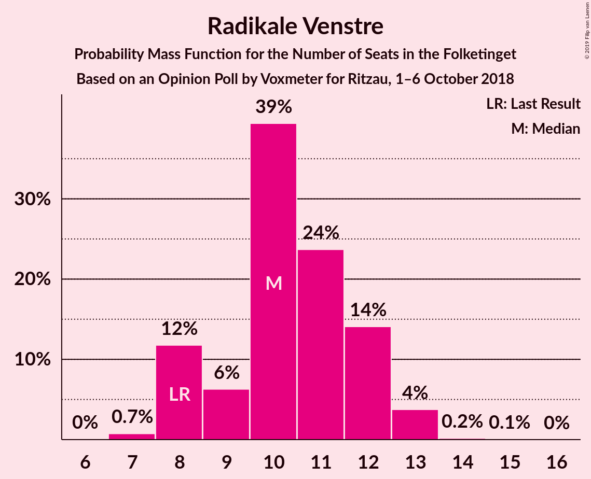
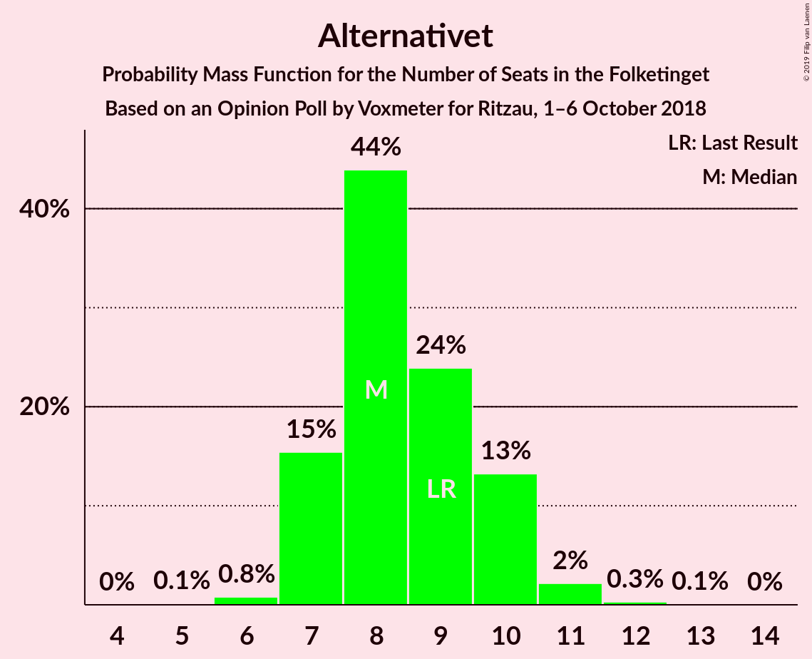
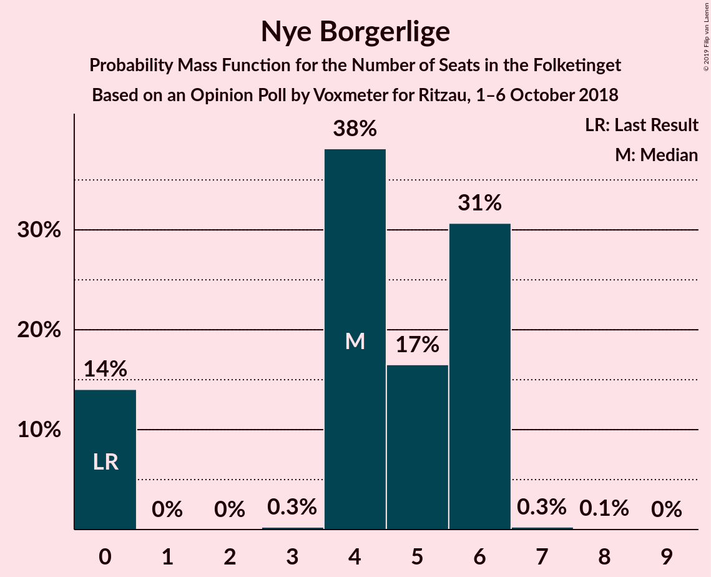

# Opinion Poll by Voxmeter for Ritzau, 1–6 October 2018

<a href="#voting-intentions">Voting Intentions</a> | <a href="#seats">Seats</a> | <a href="#coalitions">Coalitions</a> | <a href="#technical-information">Technical Information</a>

## Voting Intentions

### Confidence Intervals

| Party | Last Result | Poll Result | 80% Confidence Interval | 90% Confidence Interval | 95% Confidence Interval | 99% Confidence Interval |
|:-----:|:-----------:|:-----------:|:-----------------------:|:-----------------------:|:-----------------------:|:-----------------------:|
| Socialdemokraterne | 26.3% | 27.5% | 25.8–29.4% |25.3–29.9% |24.9–30.3% |24.1–31.2% |
| Venstre | 19.5% | 18.3% | 16.9–20.0% |16.4–20.4% |16.1–20.8% |15.4–21.6% |
| Dansk Folkeparti | 21.1% | 17.6% | 16.1–19.2% |15.7–19.6% |15.3–20.0% |14.7–20.8% |
| Enhedslisten–De Rød-Grønne | 7.8% | 8.3% | 7.3–9.5% |7.0–9.8% |6.8–10.2% |6.3–10.8% |
| Radikale Venstre | 4.6% | 5.7% | 4.8–6.7% |4.6–7.0% |4.4–7.3% |4.0–7.8% |
| Liberal Alliance | 7.5% | 5.2% | 4.4–6.2% |4.2–6.5% |4.0–6.7% |3.6–7.2% |
| Socialistisk Folkeparti | 4.2% | 5.1% | 4.3–6.1% |4.1–6.4% |3.9–6.6% |3.5–7.1% |
| Alternativet | 4.8% | 4.7% | 3.9–5.7% |3.7–5.9% |3.6–6.2% |3.2–6.7% |
| Det Konservative Folkeparti | 3.4% | 4.0% | 3.3–4.9% |3.1–5.2% |3.0–5.4% |2.7–5.9% |
| Nye Borgerlige | 0.0% | 2.3% | 1.8–3.1% |1.7–3.3% |1.6–3.5% |1.4–3.9% |
| Kristendemokraterne | 0.8% | 0.9% | 0.6–1.4% |0.5–1.5% |0.5–1.7% |0.4–2.0% |

*Note:* The poll result column reflects the actual value used in the calculations. Published results may vary slightly, and in addition be rounded to fewer digits.

## Seats

### Confidence Intervals

| Party | Last Result | Median | 80% Confidence Interval | 90% Confidence Interval | 95% Confidence Interval | 99% Confidence Interval |
|:-----:|:-----------:|:------:|:-----------------------:|:-----------------------:|:-----------------------:|:-----------------------:|
| <a href="#socialdemokraterne">Socialdemokraterne</a> | 47 | 48 | 45–52 |45–53 |43–54 |42–58 |
| <a href="#venstre">Venstre</a> | 34 | 32 | 27–35 |27–36 |27–37 |27–38 |
| <a href="#dansk-folkeparti">Dansk Folkeparti</a> | 37 | 32 | 28–35 |27–35 |27–35 |27–37 |
| <a href="#enhedslisten–de-rød-grønne">Enhedslisten–De Rød-Grønne</a> | 14 | 15 | 13–17 |12–17 |11–18 |11–19 |
| <a href="#radikale-venstre">Radikale Venstre</a> | 8 | 10 | 9–13 |8–13 |7–13 |7–14 |
| <a href="#liberal-alliance">Liberal Alliance</a> | 13 | 11 | 8–12 |8–13 |6–13 |6–13 |
| <a href="#socialistisk-folkeparti">Socialistisk Folkeparti</a> | 7 | 9 | 7–11 |7–11 |7–12 |6–13 |
| <a href="#alternativet">Alternativet</a> | 9 | 9 | 7–10 |6–10 |6–11 |5–11 |
| <a href="#det-konservative-folkeparti">Det Konservative Folkeparti</a> | 6 | 7 | 5–8 |5–9 |5–10 |4–11 |
| <a href="#nye-borgerlige">Nye Borgerlige</a> | 0 | 4 | 0–5 |0–6 |0–6 |0–6 |
| <a href="#kristendemokraterne">Kristendemokraterne</a> | 0 | 0 | 0 |0 |0 |0 |

### Socialdemokraterne

*For a full overview of the results for this party, see the [Socialdemokraterne](party-socialdemokraterne.html) page.*

| Number of Seats | Probability | Accumulated | Special Marks |
|:---------------:|:-----------:|:-----------:|:-------------:|
| 41 | 0.4% | 100% |  |
| 42 | 1.1% | 99.5% |  |
| 43 | 1.0% | 98% |  |
| 44 | 2% | 97% |  |
| 45 | 23% | 95% |  |
| 46 | 14% | 73% |  |
| 47 | 4% | 58% | Last Result |
| 48 | 10% | 54% | Median |
| 49 | 27% | 45% |  |
| 50 | 3% | 18% |  |
| 51 | 3% | 15% |  |
| 52 | 5% | 11% |  |
| 53 | 1.1% | 6% |  |
| 54 | 3% | 5% |  |
| 55 | 0.3% | 2% |  |
| 56 | 1.2% | 2% |  |
| 57 | 0.1% | 0.6% |  |
| 58 | 0.5% | 0.5% |  |
| 59 | 0% | 0% |  |

### Venstre

*For a full overview of the results for this party, see the [Venstre](party-venstre.html) page.*

| Number of Seats | Probability | Accumulated | Special Marks |
|:---------------:|:-----------:|:-----------:|:-------------:|
| 26 | 0.1% | 100% |  |
| 27 | 13% | 99.9% |  |
| 28 | 3% | 87% |  |
| 29 | 5% | 84% |  |
| 30 | 7% | 79% |  |
| 31 | 18% | 72% |  |
| 32 | 31% | 54% | Median |
| 33 | 4% | 23% |  |
| 34 | 2% | 19% | Last Result |
| 35 | 7% | 17% |  |
| 36 | 7% | 10% |  |
| 37 | 0.5% | 3% |  |
| 38 | 2% | 2% |  |
| 39 | 0.2% | 0.3% |  |
| 40 | 0% | 0.1% |  |
| 41 | 0% | 0% |  |

### Dansk Folkeparti

*For a full overview of the results for this party, see the [Dansk Folkeparti](party-danskfolkeparti.html) page.*

| Number of Seats | Probability | Accumulated | Special Marks |
|:---------------:|:-----------:|:-----------:|:-------------:|
| 24 | 0.1% | 100% |  |
| 25 | 0.1% | 99.9% |  |
| 26 | 0.2% | 99.8% |  |
| 27 | 5% | 99.6% |  |
| 28 | 11% | 95% |  |
| 29 | 8% | 83% |  |
| 30 | 3% | 76% |  |
| 31 | 7% | 72% |  |
| 32 | 36% | 65% | Median |
| 33 | 5% | 29% |  |
| 34 | 6% | 24% |  |
| 35 | 16% | 18% |  |
| 36 | 0.5% | 2% |  |
| 37 | 2% | 2% | Last Result |
| 38 | 0.1% | 0.2% |  |
| 39 | 0% | 0.1% |  |
| 40 | 0.1% | 0.1% |  |
| 41 | 0% | 0% |  |

### Enhedslisten–De Rød-Grønne

*For a full overview of the results for this party, see the [Enhedslisten–De Rød-Grønne](party-enhedslisten–derød-grønne.html) page.*

| Number of Seats | Probability | Accumulated | Special Marks |
|:---------------:|:-----------:|:-----------:|:-------------:|
| 10 | 0.4% | 100% |  |
| 11 | 4% | 99.6% |  |
| 12 | 1.1% | 96% |  |
| 13 | 8% | 95% |  |
| 14 | 27% | 87% | Last Result |
| 15 | 26% | 60% | Median |
| 16 | 24% | 34% |  |
| 17 | 8% | 10% |  |
| 18 | 2% | 3% |  |
| 19 | 1.0% | 1.1% |  |
| 20 | 0.1% | 0.1% |  |
| 21 | 0% | 0% |  |

### Radikale Venstre

*For a full overview of the results for this party, see the [Radikale Venstre](party-radikalevenstre.html) page.*

| Number of Seats | Probability | Accumulated | Special Marks |
|:---------------:|:-----------:|:-----------:|:-------------:|
| 6 | 0.4% | 100% |  |
| 7 | 3% | 99.6% |  |
| 8 | 3% | 97% | Last Result |
| 9 | 26% | 94% |  |
| 10 | 27% | 68% | Median |
| 11 | 9% | 42% |  |
| 12 | 10% | 32% |  |
| 13 | 21% | 22% |  |
| 14 | 0.7% | 0.8% |  |
| 15 | 0.1% | 0.1% |  |
| 16 | 0% | 0% |  |

### Liberal Alliance

*For a full overview of the results for this party, see the [Liberal Alliance](party-liberalalliance.html) page.*

| Number of Seats | Probability | Accumulated | Special Marks |
|:---------------:|:-----------:|:-----------:|:-------------:|
| 6 | 3% | 100% |  |
| 7 | 1.1% | 97% |  |
| 8 | 7% | 96% |  |
| 9 | 14% | 89% |  |
| 10 | 11% | 74% |  |
| 11 | 41% | 63% | Median |
| 12 | 16% | 22% |  |
| 13 | 7% | 7% | Last Result |
| 14 | 0.1% | 0.1% |  |
| 15 | 0% | 0% |  |

### Socialistisk Folkeparti

*For a full overview of the results for this party, see the [Socialistisk Folkeparti](party-socialistiskfolkeparti.html) page.*

| Number of Seats | Probability | Accumulated | Special Marks |
|:---------------:|:-----------:|:-----------:|:-------------:|
| 5 | 0.4% | 100% |  |
| 6 | 1.0% | 99.6% |  |
| 7 | 25% | 98.6% | Last Result |
| 8 | 11% | 73% |  |
| 9 | 21% | 62% | Median |
| 10 | 5% | 42% |  |
| 11 | 32% | 36% |  |
| 12 | 3% | 4% |  |
| 13 | 1.4% | 1.5% |  |
| 14 | 0.1% | 0.1% |  |
| 15 | 0% | 0% |  |

### Alternativet

*For a full overview of the results for this party, see the [Alternativet](party-alternativet.html) page.*

| Number of Seats | Probability | Accumulated | Special Marks |
|:---------------:|:-----------:|:-----------:|:-------------:|
| 5 | 0.7% | 100% |  |
| 6 | 9% | 99.3% |  |
| 7 | 4% | 91% |  |
| 8 | 25% | 87% |  |
| 9 | 35% | 62% | Last Result, Median |
| 10 | 24% | 27% |  |
| 11 | 3% | 3% |  |
| 12 | 0.2% | 0.2% |  |
| 13 | 0.1% | 0.1% |  |
| 14 | 0% | 0% |  |

### Det Konservative Folkeparti

*For a full overview of the results for this party, see the [Det Konservative Folkeparti](party-detkonservativefolkeparti.html) page.*

| Number of Seats | Probability | Accumulated | Special Marks |
|:---------------:|:-----------:|:-----------:|:-------------:|
| 4 | 2% | 100% |  |
| 5 | 17% | 98% |  |
| 6 | 29% | 81% | Last Result |
| 7 | 27% | 52% | Median |
| 8 | 18% | 26% |  |
| 9 | 3% | 8% |  |
| 10 | 3% | 5% |  |
| 11 | 2% | 2% |  |
| 12 | 0.2% | 0.2% |  |
| 13 | 0% | 0% |  |

### Nye Borgerlige

*For a full overview of the results for this party, see the [Nye Borgerlige](party-nyeborgerlige.html) page.*

| Number of Seats | Probability | Accumulated | Special Marks |
|:---------------:|:-----------:|:-----------:|:-------------:|
| 0 | 21% | 100% | Last Result |
| 1 | 0% | 79% |  |
| 2 | 0% | 79% |  |
| 3 | 0% | 79% |  |
| 4 | 44% | 79% | Median |
| 5 | 28% | 34% |  |
| 6 | 6% | 6% |  |
| 7 | 0.2% | 0.4% |  |
| 8 | 0.2% | 0.2% |  |
| 9 | 0% | 0% |  |

### Kristendemokraterne

*For a full overview of the results for this party, see the [Kristendemokraterne](party-kristendemokraterne.html) page.*

| Number of Seats | Probability | Accumulated | Special Marks |
|:---------------:|:-----------:|:-----------:|:-------------:|
| 0 | 99.6% | 100% | Last Result, Median |
| 1 | 0% | 0.4% |  |
| 2 | 0% | 0.4% |  |
| 3 | 0% | 0.4% |  |
| 4 | 0.4% | 0.4% |  |
| 5 | 0% | 0% |  |

## Coalitions

### Confidence Intervals

| Coalition | Last Result | Median | Majority? | 80% Confidence Interval | 90% Confidence Interval | 95% Confidence Interval | 99% Confidence Interval |
|:---------:|:-----------:|:------:|:---------:|:-----------------------:|:-----------------------:|:-----------------------:|:-----------------------:|
| Socialdemokraterne – Enhedslisten–De Rød-Grønne – Radikale Venstre – Socialistisk Folkeparti – Alternativet | 85 | 91 | 68% | 89–95 | 88–97 | 87–97 | 84–99 |
| Venstre – Dansk Folkeparti – Liberal Alliance – Det Konservative Folkeparti – Nye Borgerlige – Kristendemokraterne | 90 | 84 | 2% | 80–86 | 78–87 | 78–88 | 76–91 |
| Venstre – Dansk Folkeparti – Liberal Alliance – Det Konservative Folkeparti – Nye Borgerlige | 90 | 84 | 2% | 80–86 | 78–87 | 78–88 | 76–91 |
| Socialdemokraterne – Enhedslisten–De Rød-Grønne – Radikale Venstre – Socialistisk Folkeparti | 76 | 81 | 2% | 81–86 | 80–87 | 79–87 | 74–92 |
| Socialdemokraterne – Enhedslisten–De Rød-Grønne – Socialistisk Folkeparti – Alternativet | 77 | 81 | 0.1% | 76–85 | 76–86 | 76–87 | 74–89 |
| Venstre – Dansk Folkeparti – Liberal Alliance – Det Konservative Folkeparti – Kristendemokraterne | 90 | 81 | 0% | 77–83 | 75–84 | 73–87 | 73–88 |
| Venstre – Dansk Folkeparti – Liberal Alliance – Det Konservative Folkeparti | 90 | 80 | 0% | 77–83 | 75–84 | 73–87 | 73–88 |
| Socialdemokraterne – Enhedslisten–De Rød-Grønne – Socialistisk Folkeparti | 68 | 72 | 0% | 68–76 | 68–77 | 68–77 | 64–82 |
| Socialdemokraterne – Radikale Venstre – Socialistisk Folkeparti | 62 | 67 | 0% | 65–71 | 65–73 | 63–74 | 61–75 |
| Socialdemokraterne – Radikale Venstre | 55 | 58 | 0% | 56–62 | 56–63 | 53–65 | 51–67 |
| Venstre – Liberal Alliance – Det Konservative Folkeparti | 53 | 49 | 0% | 45–53 | 45–54 | 44–55 | 42–55 |
| Venstre – Det Konservative Folkeparti | 40 | 39 | 0% | 33–43 | 33–44 | 33–44 | 32–46 |
| Venstre | 34 | 32 | 0% | 27–35 | 27–36 | 27–37 | 27–38 |

### Socialdemokraterne – Enhedslisten–De Rød-Grønne – Radikale Venstre – Socialistisk Folkeparti – Alternativet

| Number of Seats | Probability | Accumulated | Special Marks |
|:---------------:|:-----------:|:-----------:|:-------------:|
| 82 | 0.3% | 100% |  |
| 83 | 0.1% | 99.7% |  |
| 84 | 1.0% | 99.6% |  |
| 85 | 0.3% | 98.6% | Last Result |
| 86 | 0.3% | 98% |  |
| 87 | 3% | 98% |  |
| 88 | 2% | 95% |  |
| 89 | 25% | 93% |  |
| 90 | 5% | 68% | Majority |
| 91 | 31% | 63% | Median |
| 92 | 15% | 32% |  |
| 93 | 0.5% | 17% |  |
| 94 | 5% | 16% |  |
| 95 | 3% | 11% |  |
| 96 | 3% | 8% |  |
| 97 | 4% | 6% |  |
| 98 | 0.6% | 1.4% |  |
| 99 | 0.7% | 0.8% |  |
| 100 | 0% | 0.1% |  |
| 101 | 0% | 0% |  |

### Venstre – Dansk Folkeparti – Liberal Alliance – Det Konservative Folkeparti – Nye Borgerlige – Kristendemokraterne

| Number of Seats | Probability | Accumulated | Special Marks |
|:---------------:|:-----------:|:-----------:|:-------------:|
| 75 | 0% | 100% |  |
| 76 | 0.7% | 99.9% |  |
| 77 | 0.6% | 99.2% |  |
| 78 | 4% | 98.6% |  |
| 79 | 3% | 94% |  |
| 80 | 3% | 92% |  |
| 81 | 5% | 89% |  |
| 82 | 0.5% | 84% |  |
| 83 | 15% | 83% |  |
| 84 | 31% | 68% |  |
| 85 | 5% | 37% |  |
| 86 | 25% | 32% | Median |
| 87 | 2% | 7% |  |
| 88 | 3% | 5% |  |
| 89 | 0.3% | 2% |  |
| 90 | 0.3% | 2% | Last Result, Majority |
| 91 | 1.0% | 1.4% |  |
| 92 | 0.1% | 0.4% |  |
| 93 | 0.3% | 0.3% |  |
| 94 | 0% | 0% |  |

### Venstre – Dansk Folkeparti – Liberal Alliance – Det Konservative Folkeparti – Nye Borgerlige

| Number of Seats | Probability | Accumulated | Special Marks |
|:---------------:|:-----------:|:-----------:|:-------------:|
| 75 | 0% | 100% |  |
| 76 | 0.7% | 99.9% |  |
| 77 | 0.6% | 99.2% |  |
| 78 | 4% | 98.6% |  |
| 79 | 3% | 94% |  |
| 80 | 3% | 91% |  |
| 81 | 5% | 88% |  |
| 82 | 0.6% | 83% |  |
| 83 | 15% | 83% |  |
| 84 | 31% | 68% |  |
| 85 | 5% | 37% |  |
| 86 | 25% | 32% | Median |
| 87 | 2% | 7% |  |
| 88 | 3% | 5% |  |
| 89 | 0.3% | 2% |  |
| 90 | 0.3% | 2% | Last Result, Majority |
| 91 | 1.0% | 1.4% |  |
| 92 | 0.1% | 0.4% |  |
| 93 | 0.3% | 0.3% |  |
| 94 | 0% | 0% |  |

### Socialdemokraterne – Enhedslisten–De Rød-Grønne – Radikale Venstre – Socialistisk Folkeparti

| Number of Seats | Probability | Accumulated | Special Marks |
|:---------------:|:-----------:|:-----------:|:-------------:|
| 73 | 0.2% | 100% |  |
| 74 | 0.9% | 99.8% |  |
| 75 | 0.1% | 98.9% |  |
| 76 | 0.1% | 98.8% | Last Result |
| 77 | 0.2% | 98.7% |  |
| 78 | 0.7% | 98% |  |
| 79 | 1.2% | 98% |  |
| 80 | 2% | 97% |  |
| 81 | 45% | 94% |  |
| 82 | 18% | 49% | Median |
| 83 | 8% | 32% |  |
| 84 | 5% | 23% |  |
| 85 | 2% | 18% |  |
| 86 | 10% | 17% |  |
| 87 | 5% | 7% |  |
| 88 | 0.1% | 2% |  |
| 89 | 0.1% | 2% |  |
| 90 | 0.3% | 2% | Majority |
| 91 | 0.6% | 1.4% |  |
| 92 | 0.8% | 0.8% |  |
| 93 | 0% | 0% |  |

### Socialdemokraterne – Enhedslisten–De Rød-Grønne – Socialistisk Folkeparti – Alternativet

| Number of Seats | Probability | Accumulated | Special Marks |
|:---------------:|:-----------:|:-----------:|:-------------:|
| 71 | 0% | 100% |  |
| 72 | 0% | 99.9% |  |
| 73 | 0.3% | 99.9% |  |
| 74 | 0.6% | 99.7% |  |
| 75 | 0.2% | 99.1% |  |
| 76 | 22% | 98.9% |  |
| 77 | 3% | 77% | Last Result |
| 78 | 2% | 74% |  |
| 79 | 6% | 72% |  |
| 80 | 7% | 66% |  |
| 81 | 21% | 59% | Median |
| 82 | 14% | 38% |  |
| 83 | 7% | 23% |  |
| 84 | 4% | 17% |  |
| 85 | 3% | 12% |  |
| 86 | 6% | 10% |  |
| 87 | 3% | 3% |  |
| 88 | 0.1% | 0.8% |  |
| 89 | 0.7% | 0.7% |  |
| 90 | 0% | 0.1% | Majority |
| 91 | 0% | 0% |  |

### Venstre – Dansk Folkeparti – Liberal Alliance – Det Konservative Folkeparti – Kristendemokraterne

| Number of Seats | Probability | Accumulated | Special Marks |
|:---------------:|:-----------:|:-----------:|:-------------:|
| 71 | 0% | 100% |  |
| 72 | 0% | 99.9% |  |
| 73 | 4% | 99.9% |  |
| 74 | 0.9% | 96% |  |
| 75 | 3% | 95% |  |
| 76 | 2% | 92% |  |
| 77 | 4% | 90% |  |
| 78 | 5% | 87% |  |
| 79 | 17% | 82% |  |
| 80 | 15% | 65% |  |
| 81 | 8% | 50% |  |
| 82 | 23% | 42% | Median |
| 83 | 14% | 19% |  |
| 84 | 0.8% | 5% |  |
| 85 | 0.8% | 5% |  |
| 86 | 0.8% | 4% |  |
| 87 | 0.5% | 3% |  |
| 88 | 2% | 2% |  |
| 89 | 0.4% | 0.5% |  |
| 90 | 0% | 0% | Last Result, Majority |

### Venstre – Dansk Folkeparti – Liberal Alliance – Det Konservative Folkeparti

| Number of Seats | Probability | Accumulated | Special Marks |
|:---------------:|:-----------:|:-----------:|:-------------:|
| 71 | 0% | 100% |  |
| 72 | 0% | 99.9% |  |
| 73 | 4% | 99.9% |  |
| 74 | 0.9% | 96% |  |
| 75 | 3% | 95% |  |
| 76 | 2% | 92% |  |
| 77 | 4% | 90% |  |
| 78 | 5% | 87% |  |
| 79 | 17% | 82% |  |
| 80 | 15% | 64% |  |
| 81 | 8% | 50% |  |
| 82 | 23% | 42% | Median |
| 83 | 14% | 19% |  |
| 84 | 0.8% | 5% |  |
| 85 | 0.8% | 5% |  |
| 86 | 0.8% | 4% |  |
| 87 | 0.5% | 3% |  |
| 88 | 2% | 2% |  |
| 89 | 0.4% | 0.5% |  |
| 90 | 0% | 0% | Last Result, Majority |

### Socialdemokraterne – Enhedslisten–De Rød-Grønne – Socialistisk Folkeparti

| Number of Seats | Probability | Accumulated | Special Marks |
|:---------------:|:-----------:|:-----------:|:-------------:|
| 63 | 0.1% | 100% |  |
| 64 | 0.6% | 99.9% |  |
| 65 | 0.2% | 99.3% |  |
| 66 | 0.8% | 99.1% |  |
| 67 | 0.4% | 98% |  |
| 68 | 21% | 98% | Last Result |
| 69 | 3% | 77% |  |
| 70 | 4% | 74% |  |
| 71 | 17% | 70% |  |
| 72 | 10% | 54% | Median |
| 73 | 14% | 44% |  |
| 74 | 14% | 30% |  |
| 75 | 5% | 16% |  |
| 76 | 5% | 11% |  |
| 77 | 4% | 6% |  |
| 78 | 0.4% | 2% |  |
| 79 | 0.1% | 2% |  |
| 80 | 0.7% | 1.4% |  |
| 81 | 0% | 0.7% |  |
| 82 | 0.6% | 0.7% |  |
| 83 | 0% | 0% |  |

### Socialdemokraterne – Radikale Venstre – Socialistisk Folkeparti

| Number of Seats | Probability | Accumulated | Special Marks |
|:---------------:|:-----------:|:-----------:|:-------------:|
| 59 | 0% | 100% |  |
| 60 | 0.1% | 99.9% |  |
| 61 | 0.7% | 99.9% |  |
| 62 | 1.4% | 99.2% | Last Result |
| 63 | 2% | 98% |  |
| 64 | 0.9% | 96% |  |
| 65 | 22% | 95% |  |
| 66 | 4% | 73% |  |
| 67 | 30% | 69% | Median |
| 68 | 7% | 39% |  |
| 69 | 14% | 32% |  |
| 70 | 4% | 19% |  |
| 71 | 7% | 14% |  |
| 72 | 0.1% | 7% |  |
| 73 | 4% | 7% |  |
| 74 | 2% | 3% |  |
| 75 | 0.8% | 0.9% |  |
| 76 | 0.1% | 0.2% |  |
| 77 | 0.1% | 0.1% |  |
| 78 | 0% | 0% |  |

### Socialdemokraterne – Radikale Venstre

| Number of Seats | Probability | Accumulated | Special Marks |
|:---------------:|:-----------:|:-----------:|:-------------:|
| 51 | 1.2% | 100% |  |
| 52 | 0.8% | 98.7% |  |
| 53 | 0.7% | 98% |  |
| 54 | 1.3% | 97% |  |
| 55 | 0.9% | 96% | Last Result |
| 56 | 17% | 95% |  |
| 57 | 3% | 78% |  |
| 58 | 42% | 74% | Median |
| 59 | 10% | 32% |  |
| 60 | 10% | 22% |  |
| 61 | 0.9% | 12% |  |
| 62 | 2% | 11% |  |
| 63 | 4% | 9% |  |
| 64 | 0.3% | 5% |  |
| 65 | 3% | 5% |  |
| 66 | 1.1% | 2% |  |
| 67 | 0.6% | 0.6% |  |
| 68 | 0% | 0% |  |

### Venstre – Liberal Alliance – Det Konservative Folkeparti

| Number of Seats | Probability | Accumulated | Special Marks |
|:---------------:|:-----------:|:-----------:|:-------------:|
| 41 | 0.3% | 100% |  |
| 42 | 2% | 99.7% |  |
| 43 | 0.3% | 98% |  |
| 44 | 0.2% | 98% |  |
| 45 | 19% | 97% |  |
| 46 | 3% | 79% |  |
| 47 | 18% | 76% |  |
| 48 | 4% | 58% |  |
| 49 | 8% | 54% |  |
| 50 | 26% | 45% | Median |
| 51 | 2% | 20% |  |
| 52 | 1.3% | 17% |  |
| 53 | 6% | 16% | Last Result |
| 54 | 7% | 10% |  |
| 55 | 3% | 3% |  |
| 56 | 0.1% | 0.2% |  |
| 57 | 0.1% | 0.1% |  |
| 58 | 0% | 0% |  |

### Venstre – Det Konservative Folkeparti

| Number of Seats | Probability | Accumulated | Special Marks |
|:---------------:|:-----------:|:-----------:|:-------------:|
| 32 | 2% | 100% |  |
| 33 | 13% | 98% |  |
| 34 | 0.1% | 85% |  |
| 35 | 2% | 85% |  |
| 36 | 18% | 83% |  |
| 37 | 5% | 66% |  |
| 38 | 3% | 61% |  |
| 39 | 23% | 58% | Median |
| 40 | 15% | 34% | Last Result |
| 41 | 7% | 19% |  |
| 42 | 1.5% | 12% |  |
| 43 | 4% | 11% |  |
| 44 | 6% | 7% |  |
| 45 | 0.1% | 1.1% |  |
| 46 | 0.7% | 0.9% |  |
| 47 | 0.1% | 0.2% |  |
| 48 | 0.1% | 0.1% |  |
| 49 | 0% | 0% |  |

### Venstre

| Number of Seats | Probability | Accumulated | Special Marks |
|:---------------:|:-----------:|:-----------:|:-------------:|
| 26 | 0.1% | 100% |  |
| 27 | 13% | 99.9% |  |
| 28 | 3% | 87% |  |
| 29 | 5% | 84% |  |
| 30 | 7% | 79% |  |
| 31 | 18% | 72% |  |
| 32 | 31% | 54% | Median |
| 33 | 4% | 23% |  |
| 34 | 2% | 19% | Last Result |
| 35 | 7% | 17% |  |
| 36 | 7% | 10% |  |
| 37 | 0.5% | 3% |  |
| 38 | 2% | 2% |  |
| 39 | 0.2% | 0.3% |  |
| 40 | 0% | 0.1% |  |
| 41 | 0% | 0% |  |

## Technical Information

### Opinion Poll

+ **Polling firm:** Voxmeter
+ **Commissioner(s):** Ritzau
+ **Fieldwork period:** 1–6 October 2018

### Calculations

+ **Sample size:** 1025
+ **Simulations done:** 131,072
+ **Error estimate:** 2.06%

