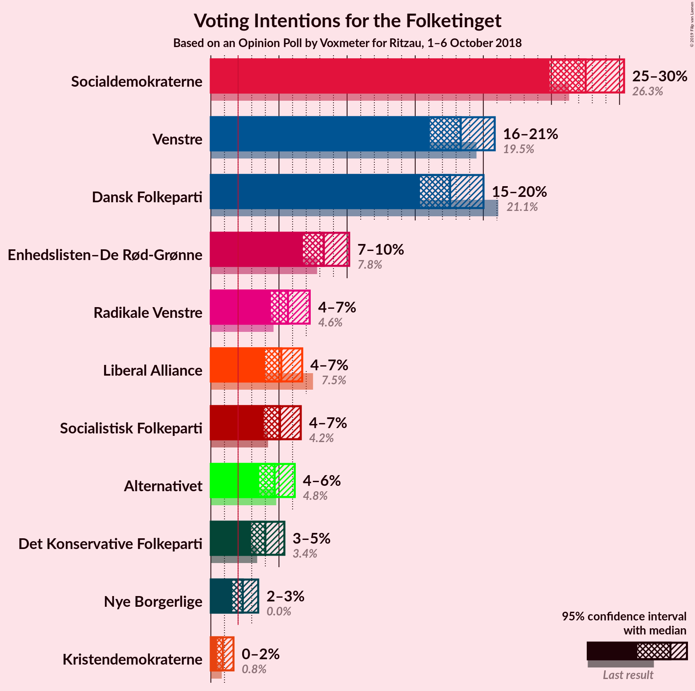
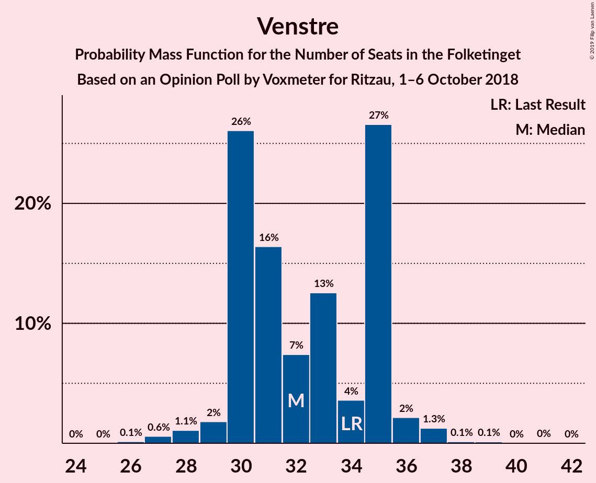
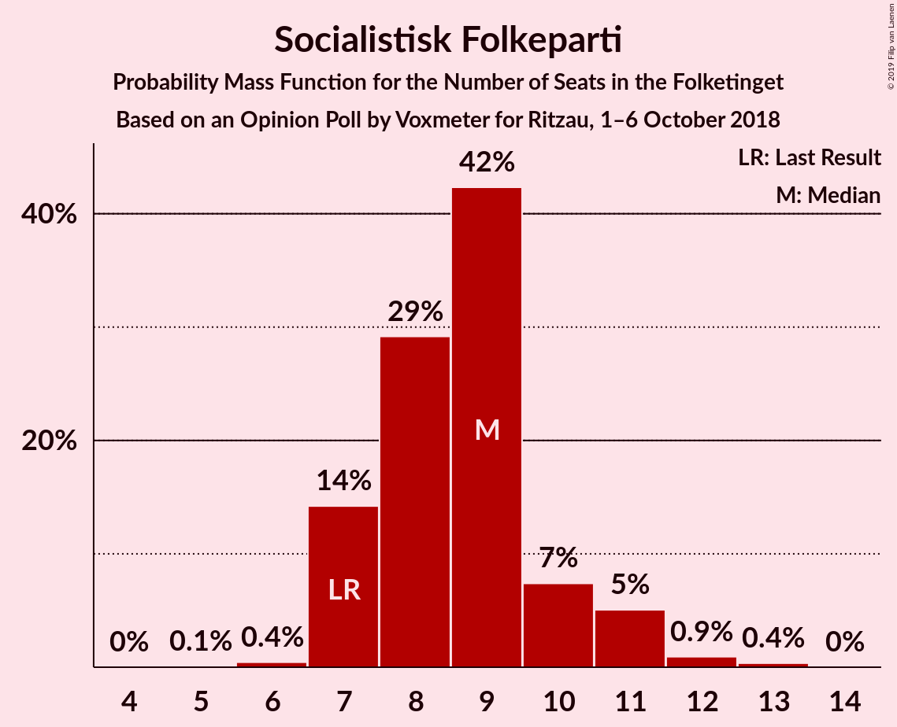

# Opinion Poll by Voxmeter for Ritzau, 1–6 October 2018

<a href="#voting-intentions">Voting Intentions</a> | <a href="#seats">Seats</a> | <a href="#coalitions">Coalitions</a> | <a href="#technical-information">Technical Information</a>

## Voting Intentions

### Confidence Intervals

| Party | Last Result | Poll Result | 80% Confidence Interval | 90% Confidence Interval | 95% Confidence Interval | 99% Confidence Interval |
|:-----:|:-----------:|:-----------:|:-----------------------:|:-----------------------:|:-----------------------:|:-----------------------:|
| Socialdemokraterne | 26.3% | 27.5% | 25.8–29.4% |25.3–29.9% |24.9–30.3% |24.1–31.2% |
| Venstre | 19.5% | 18.3% | 16.9–20.0% |16.4–20.4% |16.1–20.8% |15.4–21.6% |
| Dansk Folkeparti | 21.1% | 17.6% | 16.1–19.2% |15.7–19.6% |15.3–20.0% |14.7–20.8% |
| Enhedslisten–De Rød-Grønne | 7.8% | 8.3% | 7.3–9.5% |7.0–9.8% |6.8–10.2% |6.3–10.8% |
| Radikale Venstre | 4.6% | 5.7% | 4.8–6.7% |4.6–7.0% |4.4–7.3% |4.0–7.8% |
| Liberal Alliance | 7.5% | 5.2% | 4.4–6.2% |4.2–6.5% |4.0–6.7% |3.6–7.2% |
| Socialistisk Folkeparti | 4.2% | 5.1% | 4.3–6.1% |4.1–6.4% |3.9–6.6% |3.5–7.1% |
| Alternativet | 4.8% | 4.7% | 3.9–5.7% |3.7–5.9% |3.6–6.2% |3.2–6.7% |
| Det Konservative Folkeparti | 3.4% | 4.0% | 3.3–4.9% |3.1–5.2% |3.0–5.4% |2.7–5.9% |
| Nye Borgerlige | 0.0% | 2.3% | 1.8–3.1% |1.7–3.3% |1.6–3.5% |1.4–3.9% |
| Kristendemokraterne | 0.8% | 0.9% | 0.6–1.4% |0.5–1.5% |0.5–1.7% |0.4–2.0% |

*Note:* The poll result column reflects the actual value used in the calculations. Published results may vary slightly, and in addition be rounded to fewer digits.

## Seats

### Confidence Intervals

| Party | Last Result | Median | 80% Confidence Interval | 90% Confidence Interval | 95% Confidence Interval | 99% Confidence Interval |
|:-----:|:-----------:|:------:|:-----------------------:|:-----------------------:|:-----------------------:|:-----------------------:|
| <a href="#socialdemokraterne">Socialdemokraterne</a> | 47 | 41 | 41 |41–49 |41–49 |41–50 |
| <a href="#venstre">Venstre</a> | 34 | 35 | 35 |34–35 |34–35 |26–35 |
| <a href="#dansk-folkeparti">Dansk Folkeparti</a> | 37 | 34 | 34 |28–34 |28–34 |28–35 |
| <a href="#enhedslisten–de-rød-grønne">Enhedslisten–De Rød-Grønne</a> | 14 | 15 | 15 |13–15 |13–15 |13–19 |
| <a href="#radikale-venstre">Radikale Venstre</a> | 8 | 10 | 10 |8–10 |8–10 |7–15 |
| <a href="#liberal-alliance">Liberal Alliance</a> | 13 | 13 | 13 |13–15 |10–15 |8–15 |
| <a href="#socialistisk-folkeparti">Socialistisk Folkeparti</a> | 7 | 7 | 7 |7–11 |7–11 |7–14 |
| <a href="#alternativet">Alternativet</a> | 9 | 9 | 9 |9 |9 |9–10 |
| <a href="#det-konservative-folkeparti">Det Konservative Folkeparti</a> | 6 | 6 | 6 |6–8 |6–8 |6–9 |
| <a href="#nye-borgerlige">Nye Borgerlige</a> | 0 | 5 | 5 |0–5 |0–5 |0–5 |
| <a href="#kristendemokraterne">Kristendemokraterne</a> | 0 | 0 | 0 |0 |0 |0 |

### Socialdemokraterne

*For a full overview of the results for this party, see the [Socialdemokraterne](party-socialdemokraterne.html) page.*

| Number of Seats | Probability | Accumulated | Special Marks |
|:---------------:|:-----------:|:-----------:|:-------------:|
| 41 | 92% | 100% | Median |
| 42 | 0% | 8% |  |
| 43 | 0.2% | 8% |  |
| 44 | 1.0% | 8% |  |
| 45 | 0% | 7% |  |
| 46 | 0% | 7% |  |
| 47 | 0.2% | 7% | Last Result |
| 48 | 0% | 7% |  |
| 49 | 5% | 7% |  |
| 50 | 1.1% | 1.1% |  |
| 51 | 0% | 0% |  |

### Venstre

*For a full overview of the results for this party, see the [Venstre](party-venstre.html) page.*

| Number of Seats | Probability | Accumulated | Special Marks |
|:---------------:|:-----------:|:-----------:|:-------------:|
| 26 | 2% | 100% |  |
| 27 | 0.2% | 98% |  |
| 28 | 0% | 98% |  |
| 29 | 0% | 98% |  |
| 30 | 0% | 98% |  |
| 31 | 0.2% | 98% |  |
| 32 | 0% | 98% |  |
| 33 | 0% | 98% |  |
| 34 | 5% | 98% | Last Result |
| 35 | 92% | 92% | Median |
| 36 | 0% | 0.2% |  |
| 37 | 0% | 0.2% |  |
| 38 | 0.2% | 0.2% |  |
| 39 | 0% | 0% |  |

### Dansk Folkeparti

*For a full overview of the results for this party, see the [Dansk Folkeparti](party-danskfolkeparti.html) page.*

| Number of Seats | Probability | Accumulated | Special Marks |
|:---------------:|:-----------:|:-----------:|:-------------:|
| 28 | 5% | 100% |  |
| 29 | 0.2% | 95% |  |
| 30 | 0% | 95% |  |
| 31 | 1.3% | 94% |  |
| 32 | 0% | 93% |  |
| 33 | 0% | 93% |  |
| 34 | 92% | 93% | Median |
| 35 | 1.0% | 1.1% |  |
| 36 | 0% | 0.2% |  |
| 37 | 0.2% | 0.2% | Last Result |
| 38 | 0% | 0% |  |

### Enhedslisten–De Rød-Grønne

*For a full overview of the results for this party, see the [Enhedslisten–De Rød-Grønne](party-enhedslisten–derød-grønne.html) page.*

| Number of Seats | Probability | Accumulated | Special Marks |
|:---------------:|:-----------:|:-----------:|:-------------:|
| 12 | 0% | 100% |  |
| 13 | 6% | 99.9% |  |
| 14 | 0.2% | 94% | Last Result |
| 15 | 92% | 93% | Median |
| 16 | 0% | 1.2% |  |
| 17 | 0.2% | 1.2% |  |
| 18 | 0% | 1.0% |  |
| 19 | 1.0% | 1.0% |  |
| 20 | 0% | 0% |  |

### Radikale Venstre

*For a full overview of the results for this party, see the [Radikale Venstre](party-radikalevenstre.html) page.*

| Number of Seats | Probability | Accumulated | Special Marks |
|:---------------:|:-----------:|:-----------:|:-------------:|
| 7 | 1.4% | 100% |  |
| 8 | 5% | 98.6% | Last Result |
| 9 | 0.2% | 93% |  |
| 10 | 92% | 93% | Median |
| 11 | 0% | 1.0% |  |
| 12 | 0% | 1.0% |  |
| 13 | 0% | 1.0% |  |
| 14 | 0% | 1.0% |  |
| 15 | 1.0% | 1.0% |  |
| 16 | 0% | 0% |  |

### Liberal Alliance

*For a full overview of the results for this party, see the [Liberal Alliance](party-liberalalliance.html) page.*

| Number of Seats | Probability | Accumulated | Special Marks |
|:---------------:|:-----------:|:-----------:|:-------------:|
| 8 | 1.3% | 100% |  |
| 9 | 0.2% | 98.7% |  |
| 10 | 1.1% | 98.5% |  |
| 11 | 0.1% | 97% |  |
| 12 | 0% | 97% |  |
| 13 | 92% | 97% | Last Result, Median |
| 14 | 0% | 5% |  |
| 15 | 5% | 5% |  |
| 16 | 0% | 0% |  |

### Socialistisk Folkeparti

*For a full overview of the results for this party, see the [Socialistisk Folkeparti](party-socialistiskfolkeparti.html) page.*

| Number of Seats | Probability | Accumulated | Special Marks |
|:---------------:|:-----------:|:-----------:|:-------------:|
| 7 | 93% | 100% | Last Result, Median |
| 8 | 0.2% | 7% |  |
| 9 | 0% | 7% |  |
| 10 | 0% | 7% |  |
| 11 | 6% | 7% |  |
| 12 | 0% | 1.1% |  |
| 13 | 0% | 1.1% |  |
| 14 | 1.1% | 1.1% |  |
| 15 | 0% | 0% |  |

### Alternativet

*For a full overview of the results for this party, see the [Alternativet](party-alternativet.html) page.*

| Number of Seats | Probability | Accumulated | Special Marks |
|:---------------:|:-----------:|:-----------:|:-------------:|
| 8 | 0.2% | 100% |  |
| 9 | 98% | 99.7% | Last Result, Median |
| 10 | 2% | 2% |  |
| 11 | 0% | 0% |  |

### Det Konservative Folkeparti

*For a full overview of the results for this party, see the [Det Konservative Folkeparti](party-detkonservativefolkeparti.html) page.*

| Number of Seats | Probability | Accumulated | Special Marks |
|:---------------:|:-----------:|:-----------:|:-------------:|
| 5 | 0.2% | 100% |  |
| 6 | 92% | 99.8% | Last Result, Median |
| 7 | 1.0% | 7% |  |
| 8 | 5% | 6% |  |
| 9 | 1.2% | 1.2% |  |
| 10 | 0% | 0% |  |

### Nye Borgerlige

*For a full overview of the results for this party, see the [Nye Borgerlige](party-nyeborgerlige.html) page.*

| Number of Seats | Probability | Accumulated | Special Marks |
|:---------------:|:-----------:|:-----------:|:-------------:|
| 0 | 5% | 100% | Last Result |
| 1 | 0% | 95% |  |
| 2 | 0% | 95% |  |
| 3 | 0% | 95% |  |
| 4 | 1.0% | 95% |  |
| 5 | 93% | 94% | Median |
| 6 | 0% | 0.2% |  |
| 7 | 0% | 0.2% |  |
| 8 | 0% | 0.2% |  |
| 9 | 0.2% | 0.2% |  |
| 10 | 0% | 0% |  |

### Kristendemokraterne

*For a full overview of the results for this party, see the [Kristendemokraterne](party-kristendemokraterne.html) page.*

| Number of Seats | Probability | Accumulated | Special Marks |
|:---------------:|:-----------:|:-----------:|:-------------:|
| 0 | 99.8% | 100% | Last Result, Median |
| 1 | 0% | 0.2% |  |
| 2 | 0% | 0.2% |  |
| 3 | 0% | 0.2% |  |
| 4 | 0.2% | 0.2% |  |
| 5 | 0% | 0% |  |

## Coalitions

### Confidence Intervals

| Coalition | Last Result | Median | Majority? | 80% Confidence Interval | 90% Confidence Interval | 95% Confidence Interval | 99% Confidence Interval |
|:---------:|:-----------:|:------:|:---------:|:-----------------------:|:-----------------------:|:-----------------------:|:-----------------------:|
| Venstre – Dansk Folkeparti – Liberal Alliance – Det Konservative Folkeparti – Nye Borgerlige – Kristendemokraterne | 90 | 93 | 92% | 93 | 85–93 | 85–93 | 80–93 |
| Venstre – Dansk Folkeparti – Liberal Alliance – Det Konservative Folkeparti – Nye Borgerlige | 90 | 93 | 92% | 93 | 85–93 | 85–93 | 80–93 |
| Socialdemokraterne – Enhedslisten–De Rød-Grønne – Radikale Venstre – Socialistisk Folkeparti – Alternativet | 85 | 82 | 8% | 82 | 82–90 | 82–90 | 82–95 |
| Venstre – Dansk Folkeparti – Liberal Alliance – Det Konservative Folkeparti – Kristendemokraterne | 90 | 88 | 0% | 88 | 85–88 | 84–88 | 76–88 |
| Venstre – Dansk Folkeparti – Liberal Alliance – Det Konservative Folkeparti | 90 | 88 | 0% | 88 | 85–88 | 84–88 | 76–88 |
| Socialdemokraterne – Enhedslisten–De Rød-Grønne – Radikale Venstre – Socialistisk Folkeparti | 76 | 73 | 0% | 73 | 73–81 | 73–81 | 73–85 |

### Venstre – Dansk Folkeparti – Liberal Alliance – Det Konservative Folkeparti – Nye Borgerlige – Kristendemokraterne

| Number of Seats | Probability | Accumulated | Special Marks |
|:---------------:|:-----------:|:-----------:|:-------------:|
| 78 | 0% | 100% |  |
| 79 | 0% | 99.9% |  |
| 80 | 1.0% | 99.9% |  |
| 81 | 1.1% | 99.0% |  |
| 82 | 0% | 98% |  |
| 83 | 0% | 98% |  |
| 84 | 0.2% | 98% |  |
| 85 | 5% | 98% |  |
| 86 | 0% | 92% |  |
| 87 | 0.2% | 92% |  |
| 88 | 0% | 92% |  |
| 89 | 0% | 92% |  |
| 90 | 0% | 92% | Last Result, Majority |
| 91 | 0% | 92% |  |
| 92 | 0% | 92% |  |
| 93 | 92% | 92% | Median |
| 94 | 0% | 0% |  |

### Venstre – Dansk Folkeparti – Liberal Alliance – Det Konservative Folkeparti – Nye Borgerlige

| Number of Seats | Probability | Accumulated | Special Marks |
|:---------------:|:-----------:|:-----------:|:-------------:|
| 78 | 0% | 100% |  |
| 79 | 0% | 99.9% |  |
| 80 | 1.0% | 99.9% |  |
| 81 | 1.3% | 99.0% |  |
| 82 | 0% | 98% |  |
| 83 | 0% | 98% |  |
| 84 | 0.2% | 98% |  |
| 85 | 5% | 98% |  |
| 86 | 0% | 92% |  |
| 87 | 0.2% | 92% |  |
| 88 | 0% | 92% |  |
| 89 | 0% | 92% |  |
| 90 | 0% | 92% | Last Result, Majority |
| 91 | 0% | 92% |  |
| 92 | 0% | 92% |  |
| 93 | 92% | 92% | Median |
| 94 | 0% | 0% |  |

### Socialdemokraterne – Enhedslisten–De Rød-Grønne – Radikale Venstre – Socialistisk Folkeparti – Alternativet

| Number of Seats | Probability | Accumulated | Special Marks |
|:---------------:|:-----------:|:-----------:|:-------------:|
| 82 | 92% | 100% | Median |
| 83 | 0% | 8% |  |
| 84 | 0% | 8% |  |
| 85 | 0% | 8% | Last Result |
| 86 | 0.2% | 8% |  |
| 87 | 0% | 8% |  |
| 88 | 0.2% | 8% |  |
| 89 | 0% | 8% |  |
| 90 | 5% | 8% | Majority |
| 91 | 0.2% | 2% |  |
| 92 | 0% | 2% |  |
| 93 | 0% | 2% |  |
| 94 | 1.1% | 2% |  |
| 95 | 1.0% | 1.0% |  |
| 96 | 0% | 0.1% |  |
| 97 | 0% | 0.1% |  |
| 98 | 0% | 0% |  |

### Venstre – Dansk Folkeparti – Liberal Alliance – Det Konservative Folkeparti – Kristendemokraterne

| Number of Seats | Probability | Accumulated | Special Marks |
|:---------------:|:-----------:|:-----------:|:-------------:|
| 73 | 0% | 100% |  |
| 74 | 0% | 99.9% |  |
| 75 | 0% | 99.9% |  |
| 76 | 2% | 99.9% |  |
| 77 | 0% | 98% |  |
| 78 | 0.2% | 98% |  |
| 79 | 0% | 98% |  |
| 80 | 0.2% | 98% |  |
| 81 | 0% | 98% |  |
| 82 | 0% | 98% |  |
| 83 | 0% | 98% |  |
| 84 | 0.2% | 98% |  |
| 85 | 5% | 97% |  |
| 86 | 0% | 92% |  |
| 87 | 0% | 92% |  |
| 88 | 92% | 92% | Median |
| 89 | 0% | 0% |  |
| 90 | 0% | 0% | Last Result, Majority |

### Venstre – Dansk Folkeparti – Liberal Alliance – Det Konservative Folkeparti

| Number of Seats | Probability | Accumulated | Special Marks |
|:---------------:|:-----------:|:-----------:|:-------------:|
| 73 | 0% | 100% |  |
| 74 | 0% | 99.9% |  |
| 75 | 0% | 99.9% |  |
| 76 | 2% | 99.9% |  |
| 77 | 0% | 98% |  |
| 78 | 0.2% | 98% |  |
| 79 | 0% | 98% |  |
| 80 | 0% | 98% |  |
| 81 | 0% | 98% |  |
| 82 | 0% | 98% |  |
| 83 | 0% | 98% |  |
| 84 | 0.2% | 98% |  |
| 85 | 5% | 97% |  |
| 86 | 0% | 92% |  |
| 87 | 0% | 92% |  |
| 88 | 92% | 92% | Median |
| 89 | 0% | 0% |  |
| 90 | 0% | 0% | Last Result, Majority |

### Socialdemokraterne – Enhedslisten–De Rød-Grønne – Radikale Venstre – Socialistisk Folkeparti

| Number of Seats | Probability | Accumulated | Special Marks |
|:---------------:|:-----------:|:-----------:|:-------------:|
| 73 | 92% | 100% | Median |
| 74 | 0% | 8% |  |
| 75 | 0% | 8% |  |
| 76 | 0% | 8% | Last Result |
| 77 | 0% | 8% |  |
| 78 | 0.4% | 8% |  |
| 79 | 0% | 8% |  |
| 80 | 0% | 8% |  |
| 81 | 5% | 8% |  |
| 82 | 0.2% | 2% |  |
| 83 | 0% | 2% |  |
| 84 | 1.1% | 2% |  |
| 85 | 1.0% | 1.0% |  |
| 86 | 0% | 0.1% |  |
| 87 | 0% | 0.1% |  |
| 88 | 0% | 0.1% |  |
| 89 | 0% | 0% |  |

## Technical Information

### Opinion Poll

+ **Polling firm:** Voxmeter
+ **Commissioner(s):** Ritzau
+ **Fieldwork period:** 1–6 October 2018

### Calculations

+ **Sample size:** 1025
+ **Simulations done:** 1,024
+ **Error estimate:** 5.38%

