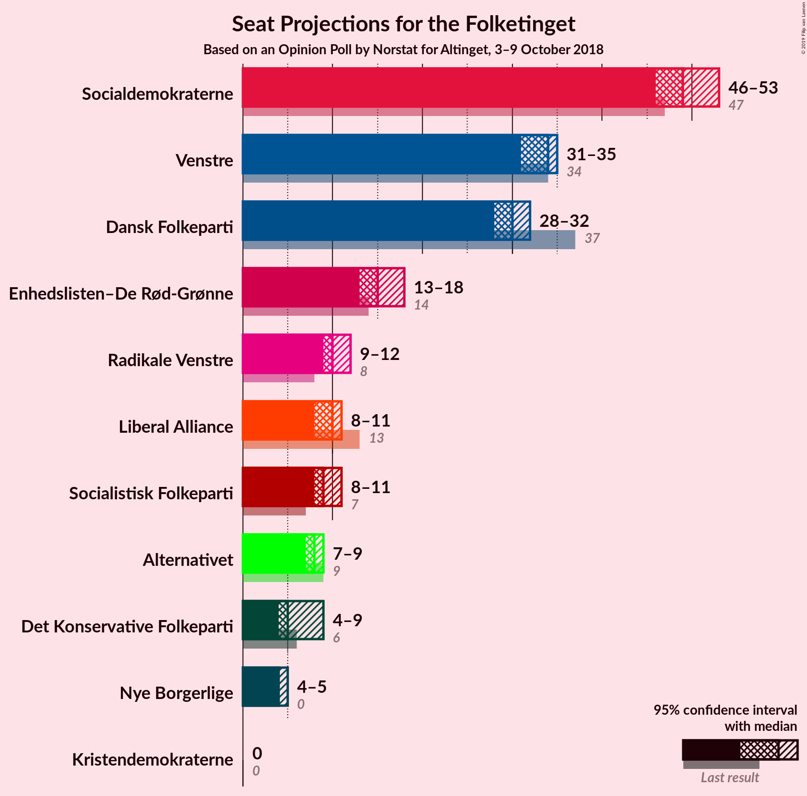
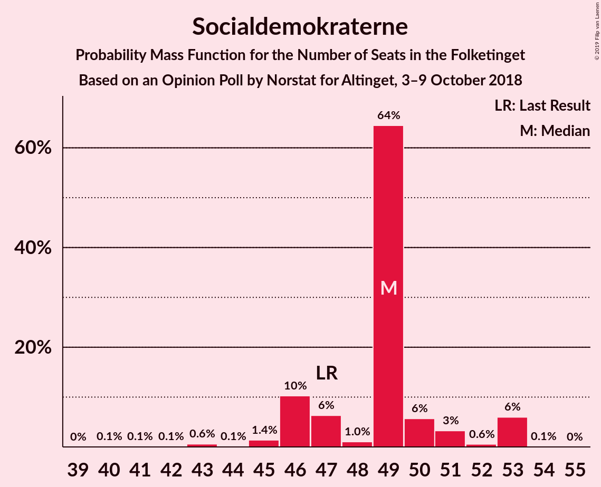
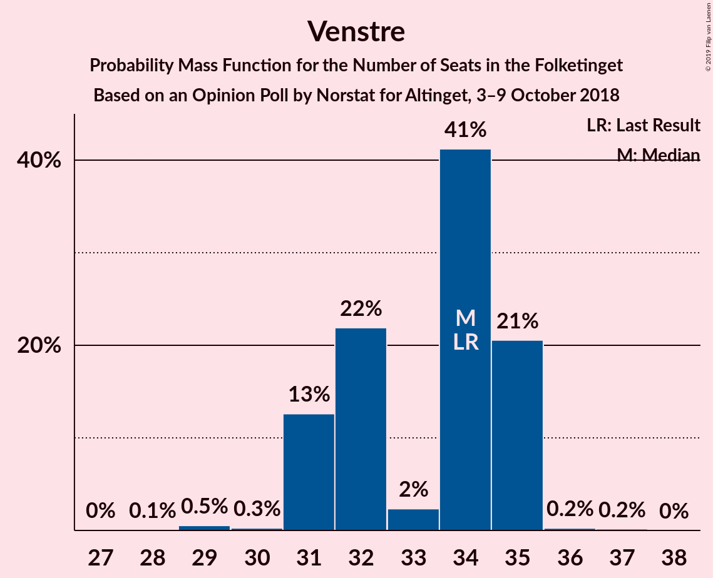
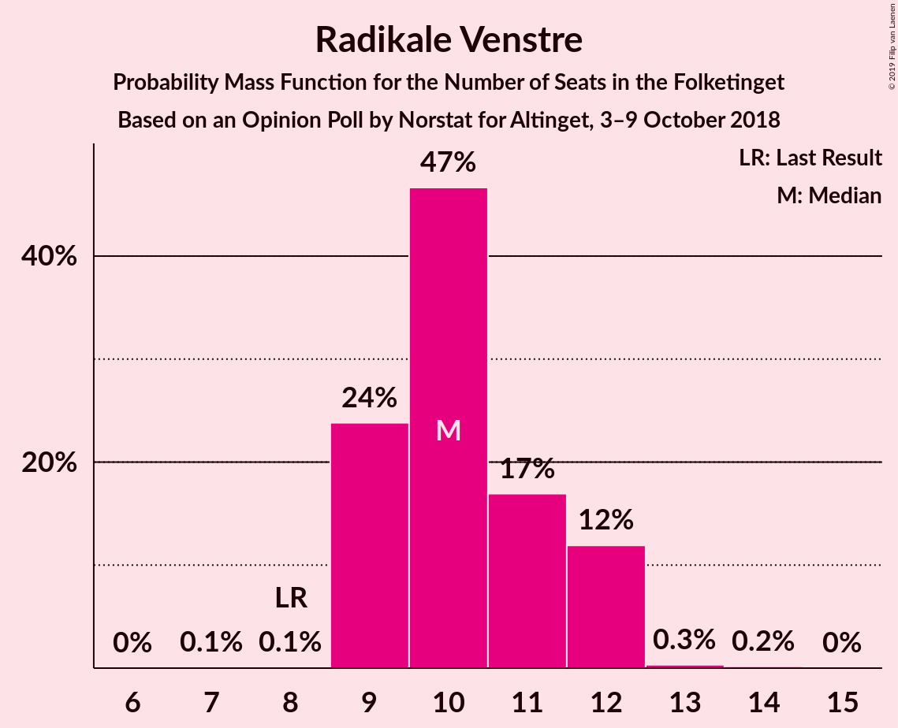
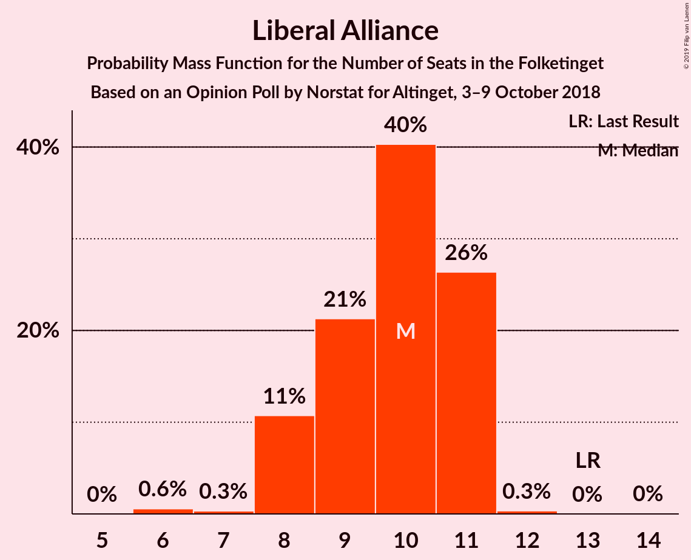
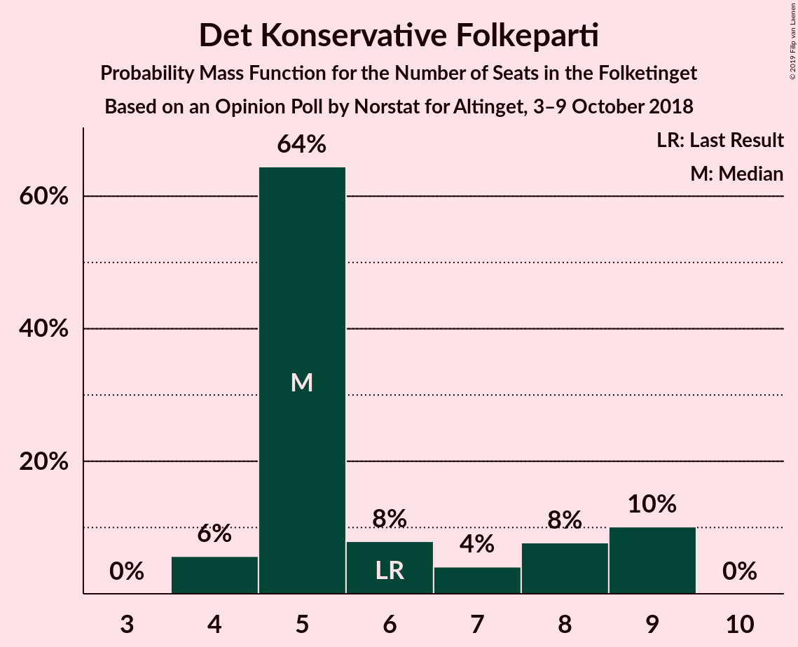
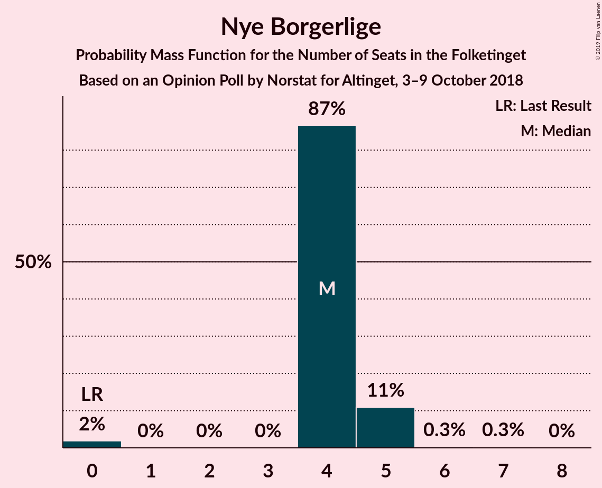
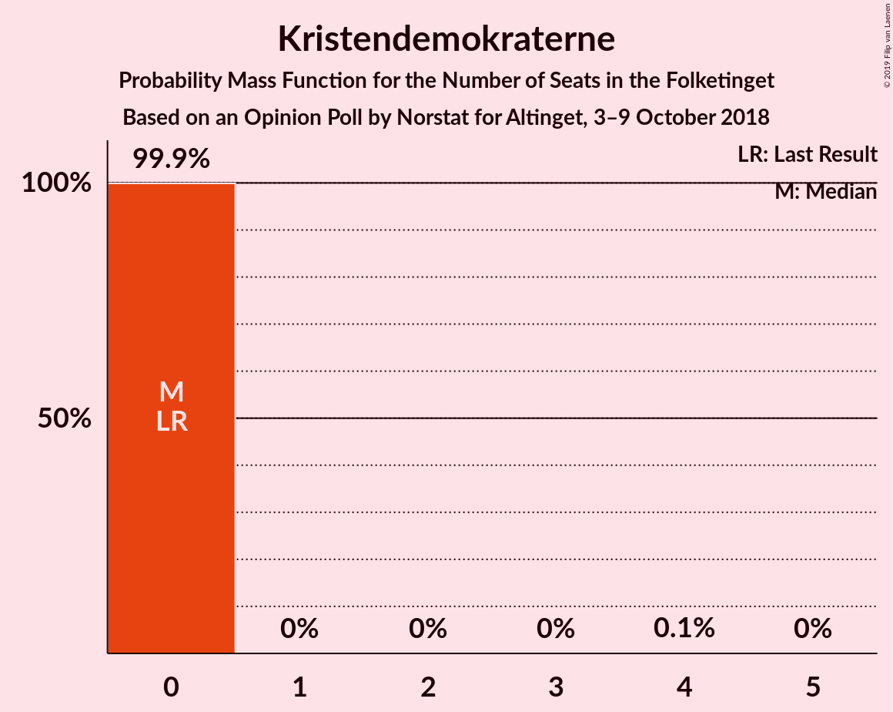

# Opinion Poll by Norstat for Altinget, 3–9 October 2018

<a href="#voting-intentions">Voting Intentions</a> | <a href="#seats">Seats</a> | <a href="#coalitions">Coalitions</a> | <a href="#technical-information">Technical Information</a>

## Voting Intentions

### Confidence Intervals

| Party | Last Result | Poll Result | 80% Confidence Interval | 90% Confidence Interval | 95% Confidence Interval | 99% Confidence Interval |
|:-----:|:-----------:|:-----------:|:-----------------------:|:-----------------------:|:-----------------------:|:-----------------------:|
| Socialdemokraterne | 26.3% | 26.8% | 25.2–28.5% |24.8–29.0% |24.4–29.4% |23.6–30.2% |
| Venstre | 19.5% | 18.7% | 17.3–20.2% |16.9–20.6% |16.6–21.0% |15.9–21.7% |
| Dansk Folkeparti | 21.1% | 17.7% | 16.4–19.2% |16.0–19.6% |15.7–20.0% |15.0–20.7% |
| Enhedslisten–De Rød-Grønne | 7.8% | 8.7% | 7.7–9.8% |7.5–10.1% |7.2–10.4% |6.8–11.0% |
| Radikale Venstre | 4.6% | 5.9% | 5.1–6.8% |4.9–7.1% |4.7–7.3% |4.3–7.8% |
| Liberal Alliance | 7.5% | 5.1% | 4.4–6.0% |4.2–6.3% |4.0–6.5% |3.7–7.0% |
| Socialistisk Folkeparti | 4.2% | 5.1% | 4.4–6.0% |4.2–6.3% |4.0–6.5% |3.7–7.0% |
| Alternativet | 4.8% | 4.7% | 4.0–5.6% |3.8–5.9% |3.7–6.1% |3.3–6.5% |
| Det Konservative Folkeparti | 3.4% | 3.7% | 3.1–4.5% |2.9–4.8% |2.8–5.0% |2.5–5.4% |
| Nye Borgerlige | 0.0% | 2.5% | 2.0–3.2% |1.9–3.4% |1.7–3.5% |1.5–3.9% |
| Kristendemokraterne | 0.8% | 0.8% | 0.6–1.3% |0.5–1.4% |0.4–1.5% |0.4–1.8% |

*Note:* The poll result column reflects the actual value used in the calculations. Published results may vary slightly, and in addition be rounded to fewer digits.

## Seats

### Confidence Intervals

| Party | Last Result | Median | 80% Confidence Interval | 90% Confidence Interval | 95% Confidence Interval | 99% Confidence Interval |
|:-----:|:-----------:|:------:|:-----------------------:|:-----------------------:|:-----------------------:|:-----------------------:|
| <a href="#socialdemokraterne">Socialdemokraterne</a> | 47 | 49 | 46–50 |46–53 |46–53 |43–53 |
| <a href="#venstre">Venstre</a> | 34 | 34 | 31–35 |31–35 |31–35 |29–35 |
| <a href="#dansk-folkeparti">Dansk Folkeparti</a> | 37 | 30 | 29–31 |28–32 |28–32 |28–34 |
| <a href="#enhedslisten–de-rød-grønne">Enhedslisten–De Rød-Grønne</a> | 14 | 15 | 15–17 |15–18 |13–18 |12–20 |
| <a href="#radikale-venstre">Radikale Venstre</a> | 8 | 10 | 9–12 |9–12 |9–12 |9–12 |
| <a href="#liberal-alliance">Liberal Alliance</a> | 13 | 10 | 8–11 |8–11 |8–11 |6–11 |
| <a href="#socialistisk-folkeparti">Socialistisk Folkeparti</a> | 7 | 9 | 8–11 |8–11 |8–11 |7–11 |
| <a href="#alternativet">Alternativet</a> | 9 | 8 | 7–9 |7–9 |7–9 |7–11 |
| <a href="#det-konservative-folkeparti">Det Konservative Folkeparti</a> | 6 | 5 | 5–9 |4–9 |4–9 |4–9 |
| <a href="#nye-borgerlige">Nye Borgerlige</a> | 0 | 4 | 4–5 |4–5 |4–5 |0–6 |
| <a href="#kristendemokraterne">Kristendemokraterne</a> | 0 | 0 | 0 |0 |0 |0 |

### Socialdemokraterne

*For a full overview of the results for this party, see the [Socialdemokraterne](party-socialdemokraterne.html) page.*

| Number of Seats | Probability | Accumulated | Special Marks |
|:---------------:|:-----------:|:-----------:|:-------------:|
| 40 | 0.1% | 100% |  |
| 41 | 0.1% | 99.9% |  |
| 42 | 0.1% | 99.8% |  |
| 43 | 0.6% | 99.8% |  |
| 44 | 0.1% | 99.2% |  |
| 45 | 1.4% | 99.1% |  |
| 46 | 10% | 98% |  |
| 47 | 6% | 87% | Last Result |
| 48 | 1.0% | 81% |  |
| 49 | 64% | 80% | Median |
| 50 | 6% | 16% |  |
| 51 | 3% | 10% |  |
| 52 | 0.6% | 7% |  |
| 53 | 6% | 6% |  |
| 54 | 0.1% | 0.1% |  |
| 55 | 0% | 0% |  |

### Venstre

*For a full overview of the results for this party, see the [Venstre](party-venstre.html) page.*

| Number of Seats | Probability | Accumulated | Special Marks |
|:---------------:|:-----------:|:-----------:|:-------------:|
| 28 | 0.1% | 100% |  |
| 29 | 0.5% | 99.9% |  |
| 30 | 0.3% | 99.3% |  |
| 31 | 13% | 99.1% |  |
| 32 | 22% | 86% |  |
| 33 | 2% | 65% |  |
| 34 | 41% | 62% | Last Result, Median |
| 35 | 21% | 21% |  |
| 36 | 0.2% | 0.5% |  |
| 37 | 0.2% | 0.2% |  |
| 38 | 0% | 0% |  |

### Dansk Folkeparti

*For a full overview of the results for this party, see the [Dansk Folkeparti](party-danskfolkeparti.html) page.*

| Number of Seats | Probability | Accumulated | Special Marks |
|:---------------:|:-----------:|:-----------:|:-------------:|
| 26 | 0.1% | 100% |  |
| 27 | 0.1% | 99.9% |  |
| 28 | 9% | 99.8% |  |
| 29 | 21% | 91% |  |
| 30 | 23% | 70% | Median |
| 31 | 40% | 47% |  |
| 32 | 6% | 7% |  |
| 33 | 0.2% | 1.1% |  |
| 34 | 0.4% | 0.9% |  |
| 35 | 0.4% | 0.4% |  |
| 36 | 0% | 0.1% |  |
| 37 | 0% | 0% | Last Result |

### Enhedslisten–De Rød-Grønne

*For a full overview of the results for this party, see the [Enhedslisten–De Rød-Grønne](party-enhedslisten–derød-grønne.html) page.*

| Number of Seats | Probability | Accumulated | Special Marks |
|:---------------:|:-----------:|:-----------:|:-------------:|
| 10 | 0.1% | 100% |  |
| 11 | 0.1% | 99.9% |  |
| 12 | 0.6% | 99.9% |  |
| 13 | 3% | 99.3% |  |
| 14 | 0.9% | 96% | Last Result |
| 15 | 50% | 96% | Median |
| 16 | 31% | 46% |  |
| 17 | 6% | 15% |  |
| 18 | 6% | 8% |  |
| 19 | 0.4% | 2% |  |
| 20 | 2% | 2% |  |
| 21 | 0.1% | 0.1% |  |
| 22 | 0% | 0% |  |

### Radikale Venstre

*For a full overview of the results for this party, see the [Radikale Venstre](party-radikalevenstre.html) page.*

| Number of Seats | Probability | Accumulated | Special Marks |
|:---------------:|:-----------:|:-----------:|:-------------:|
| 7 | 0.1% | 100% |  |
| 8 | 0.1% | 99.9% | Last Result |
| 9 | 24% | 99.8% |  |
| 10 | 47% | 76% | Median |
| 11 | 17% | 29% |  |
| 12 | 12% | 12% |  |
| 13 | 0.3% | 0.5% |  |
| 14 | 0.2% | 0.2% |  |
| 15 | 0% | 0% |  |

### Liberal Alliance

*For a full overview of the results for this party, see the [Liberal Alliance](party-liberalalliance.html) page.*

| Number of Seats | Probability | Accumulated | Special Marks |
|:---------------:|:-----------:|:-----------:|:-------------:|
| 6 | 0.6% | 100% |  |
| 7 | 0.3% | 99.4% |  |
| 8 | 11% | 99.1% |  |
| 9 | 21% | 88% |  |
| 10 | 40% | 67% | Median |
| 11 | 26% | 27% |  |
| 12 | 0.3% | 0.4% |  |
| 13 | 0% | 0.1% | Last Result |
| 14 | 0% | 0% |  |

### Socialistisk Folkeparti

*For a full overview of the results for this party, see the [Socialistisk Folkeparti](party-socialistiskfolkeparti.html) page.*

| Number of Seats | Probability | Accumulated | Special Marks |
|:---------------:|:-----------:|:-----------:|:-------------:|
| 6 | 0.1% | 100% |  |
| 7 | 1.1% | 99.9% | Last Result |
| 8 | 45% | 98.8% |  |
| 9 | 17% | 54% | Median |
| 10 | 23% | 36% |  |
| 11 | 13% | 13% |  |
| 12 | 0.1% | 0.2% |  |
| 13 | 0.1% | 0.1% |  |
| 14 | 0% | 0% |  |

### Alternativet

*For a full overview of the results for this party, see the [Alternativet](party-alternativet.html) page.*

| Number of Seats | Probability | Accumulated | Special Marks |
|:---------------:|:-----------:|:-----------:|:-------------:|
| 6 | 0.5% | 100% |  |
| 7 | 21% | 99.5% |  |
| 8 | 37% | 79% | Median |
| 9 | 40% | 42% | Last Result |
| 10 | 1.2% | 2% |  |
| 11 | 0.2% | 0.6% |  |
| 12 | 0.3% | 0.3% |  |
| 13 | 0% | 0% |  |

### Det Konservative Folkeparti

*For a full overview of the results for this party, see the [Det Konservative Folkeparti](party-detkonservativefolkeparti.html) page.*

| Number of Seats | Probability | Accumulated | Special Marks |
|:---------------:|:-----------:|:-----------:|:-------------:|
| 4 | 6% | 100% |  |
| 5 | 64% | 94% | Median |
| 6 | 8% | 30% | Last Result |
| 7 | 4% | 22% |  |
| 8 | 8% | 18% |  |
| 9 | 10% | 10% |  |
| 10 | 0% | 0% |  |

### Nye Borgerlige

*For a full overview of the results for this party, see the [Nye Borgerlige](party-nyeborgerlige.html) page.*

| Number of Seats | Probability | Accumulated | Special Marks |
|:---------------:|:-----------:|:-----------:|:-------------:|
| 0 | 2% | 100% | Last Result |
| 1 | 0% | 98% |  |
| 2 | 0% | 98% |  |
| 3 | 0% | 98% |  |
| 4 | 87% | 98% | Median |
| 5 | 11% | 12% |  |
| 6 | 0.3% | 0.6% |  |
| 7 | 0.3% | 0.3% |  |
| 8 | 0% | 0% |  |

### Kristendemokraterne

*For a full overview of the results for this party, see the [Kristendemokraterne](party-kristendemokraterne.html) page.*

| Number of Seats | Probability | Accumulated | Special Marks |
|:---------------:|:-----------:|:-----------:|:-------------:|
| 0 | 99.9% | 100% | Last Result, Median |
| 1 | 0% | 0.1% |  |
| 2 | 0% | 0.1% |  |
| 3 | 0% | 0.1% |  |
| 4 | 0.1% | 0.1% |  |
| 5 | 0% | 0% |  |

## Coalitions

### Confidence Intervals

| Coalition | Last Result | Median | Majority? | 80% Confidence Interval | 90% Confidence Interval | 95% Confidence Interval | 99% Confidence Interval |
|:---------:|:-----------:|:------:|:---------:|:-----------------------:|:-----------------------:|:-----------------------:|:-----------------------:|
| Socialdemokraterne – Enhedslisten–De Rød-Grønne – Radikale Venstre – Socialistisk Folkeparti – Alternativet | 85 | 91 | 98.8% | 91–95 | 91–96 | 91–96 | 88–96 |
| Socialdemokraterne – Enhedslisten–De Rød-Grønne – Radikale Venstre – Socialistisk Folkeparti | 76 | 84 | 0.1% | 82–87 | 82–88 | 82–88 | 79–88 |
| Socialdemokraterne – Enhedslisten–De Rød-Grønne – Socialistisk Folkeparti – Alternativet | 77 | 81 | 0% | 81–84 | 79–86 | 79–86 | 77–86 |
| Venstre – Dansk Folkeparti – Liberal Alliance – Det Konservative Folkeparti – Nye Borgerlige – Kristendemokraterne | 90 | 84 | 0.2% | 80–84 | 79–84 | 79–84 | 79–87 |
| Venstre – Dansk Folkeparti – Liberal Alliance – Det Konservative Folkeparti – Nye Borgerlige | 90 | 84 | 0.2% | 80–84 | 79–84 | 79–84 | 79–87 |
| Venstre – Dansk Folkeparti – Liberal Alliance – Det Konservative Folkeparti – Kristendemokraterne | 90 | 80 | 0% | 76–80 | 74–80 | 74–82 | 74–83 |
| Venstre – Dansk Folkeparti – Liberal Alliance – Det Konservative Folkeparti | 90 | 80 | 0% | 76–80 | 74–80 | 74–82 | 74–83 |
| Socialdemokraterne – Enhedslisten–De Rød-Grønne – Socialistisk Folkeparti | 68 | 73 | 0% | 72–76 | 71–78 | 71–78 | 68–78 |
| Socialdemokraterne – Radikale Venstre – Socialistisk Folkeparti | 62 | 68 | 0% | 67–71 | 67–71 | 65–71 | 63–73 |
| Socialdemokraterne – Radikale Venstre | 55 | 59 | 0% | 57–62 | 57–63 | 57–63 | 53–63 |
| Venstre – Liberal Alliance – Det Konservative Folkeparti | 53 | 49 | 0% | 46–51 | 45–51 | 45–51 | 44–52 |
| Venstre – Det Konservative Folkeparti | 40 | 39 | 0% | 37–41 | 36–41 | 36–41 | 36–42 |
| Venstre | 34 | 34 | 0% | 31–35 | 31–35 | 31–35 | 29–35 |

### Socialdemokraterne – Enhedslisten–De Rød-Grønne – Radikale Venstre – Socialistisk Folkeparti – Alternativet

| Number of Seats | Probability | Accumulated | Special Marks |
|:---------------:|:-----------:|:-----------:|:-------------:|
| 83 | 0% | 100% |  |
| 84 | 0% | 99.9% |  |
| 85 | 0.1% | 99.9% | Last Result |
| 86 | 0.1% | 99.8% |  |
| 87 | 0.1% | 99.7% |  |
| 88 | 0.7% | 99.7% |  |
| 89 | 0.2% | 99.0% |  |
| 90 | 0.3% | 98.8% | Majority |
| 91 | 65% | 98% | Median |
| 92 | 13% | 34% |  |
| 93 | 2% | 21% |  |
| 94 | 6% | 19% |  |
| 95 | 6% | 13% |  |
| 96 | 7% | 7% |  |
| 97 | 0% | 0.2% |  |
| 98 | 0% | 0.2% |  |
| 99 | 0.1% | 0.1% |  |
| 100 | 0% | 0% |  |

### Socialdemokraterne – Enhedslisten–De Rød-Grønne – Radikale Venstre – Socialistisk Folkeparti

| Number of Seats | Probability | Accumulated | Special Marks |
|:---------------:|:-----------:|:-----------:|:-------------:|
| 74 | 0% | 100% |  |
| 75 | 0.1% | 99.9% |  |
| 76 | 0% | 99.9% | Last Result |
| 77 | 0.1% | 99.9% |  |
| 78 | 0.1% | 99.8% |  |
| 79 | 0.2% | 99.7% |  |
| 80 | 0.5% | 99.5% |  |
| 81 | 0.2% | 99.0% |  |
| 82 | 40% | 98.9% |  |
| 83 | 6% | 59% | Median |
| 84 | 33% | 53% |  |
| 85 | 2% | 20% |  |
| 86 | 6% | 18% |  |
| 87 | 6% | 12% |  |
| 88 | 6% | 6% |  |
| 89 | 0.1% | 0.2% |  |
| 90 | 0.1% | 0.1% | Majority |
| 91 | 0% | 0.1% |  |
| 92 | 0.1% | 0.1% |  |
| 93 | 0% | 0% |  |

### Socialdemokraterne – Enhedslisten–De Rød-Grønne – Socialistisk Folkeparti – Alternativet

| Number of Seats | Probability | Accumulated | Special Marks |
|:---------------:|:-----------:|:-----------:|:-------------:|
| 73 | 0% | 100% |  |
| 74 | 0.1% | 99.9% |  |
| 75 | 0.1% | 99.8% |  |
| 76 | 0.1% | 99.7% |  |
| 77 | 0.2% | 99.6% | Last Result |
| 78 | 0.5% | 99.4% |  |
| 79 | 6% | 98.9% |  |
| 80 | 0.3% | 93% |  |
| 81 | 49% | 92% | Median |
| 82 | 26% | 44% |  |
| 83 | 5% | 18% |  |
| 84 | 6% | 13% |  |
| 85 | 0.7% | 7% |  |
| 86 | 6% | 6% |  |
| 87 | 0.4% | 0.5% |  |
| 88 | 0% | 0.1% |  |
| 89 | 0% | 0% |  |

### Venstre – Dansk Folkeparti – Liberal Alliance – Det Konservative Folkeparti – Nye Borgerlige – Kristendemokraterne

| Number of Seats | Probability | Accumulated | Special Marks |
|:---------------:|:-----------:|:-----------:|:-------------:|
| 76 | 0.1% | 100% |  |
| 77 | 0% | 99.9% |  |
| 78 | 0% | 99.8% |  |
| 79 | 7% | 99.8% |  |
| 80 | 6% | 93% |  |
| 81 | 6% | 87% |  |
| 82 | 2% | 81% |  |
| 83 | 13% | 79% | Median |
| 84 | 65% | 66% |  |
| 85 | 0.3% | 2% |  |
| 86 | 0.2% | 1.2% |  |
| 87 | 0.7% | 1.0% |  |
| 88 | 0.1% | 0.3% |  |
| 89 | 0.1% | 0.3% |  |
| 90 | 0.1% | 0.2% | Last Result, Majority |
| 91 | 0% | 0.1% |  |
| 92 | 0% | 0.1% |  |
| 93 | 0% | 0% |  |

### Venstre – Dansk Folkeparti – Liberal Alliance – Det Konservative Folkeparti – Nye Borgerlige

| Number of Seats | Probability | Accumulated | Special Marks |
|:---------------:|:-----------:|:-----------:|:-------------:|
| 76 | 0.1% | 100% |  |
| 77 | 0% | 99.9% |  |
| 78 | 0% | 99.8% |  |
| 79 | 7% | 99.8% |  |
| 80 | 6% | 93% |  |
| 81 | 6% | 87% |  |
| 82 | 2% | 81% |  |
| 83 | 13% | 79% | Median |
| 84 | 65% | 66% |  |
| 85 | 0.3% | 2% |  |
| 86 | 0.2% | 1.2% |  |
| 87 | 0.7% | 1.0% |  |
| 88 | 0.1% | 0.3% |  |
| 89 | 0.1% | 0.3% |  |
| 90 | 0.1% | 0.2% | Last Result, Majority |
| 91 | 0% | 0.1% |  |
| 92 | 0% | 0.1% |  |
| 93 | 0% | 0% |  |

### Venstre – Dansk Folkeparti – Liberal Alliance – Det Konservative Folkeparti – Kristendemokraterne

| Number of Seats | Probability | Accumulated | Special Marks |
|:---------------:|:-----------:|:-----------:|:-------------:|
| 71 | 0.1% | 100% |  |
| 72 | 0% | 99.9% |  |
| 73 | 0.1% | 99.9% |  |
| 74 | 7% | 99.8% |  |
| 75 | 0.8% | 93% |  |
| 76 | 6% | 92% |  |
| 77 | 6% | 87% |  |
| 78 | 4% | 81% |  |
| 79 | 10% | 78% | Median |
| 80 | 65% | 67% |  |
| 81 | 0.3% | 3% |  |
| 82 | 2% | 3% |  |
| 83 | 0.4% | 0.7% |  |
| 84 | 0.1% | 0.3% |  |
| 85 | 0% | 0.3% |  |
| 86 | 0.2% | 0.2% |  |
| 87 | 0% | 0.1% |  |
| 88 | 0% | 0% |  |
| 89 | 0% | 0% |  |
| 90 | 0% | 0% | Last Result, Majority |

### Venstre – Dansk Folkeparti – Liberal Alliance – Det Konservative Folkeparti

| Number of Seats | Probability | Accumulated | Special Marks |
|:---------------:|:-----------:|:-----------:|:-------------:|
| 71 | 0.1% | 100% |  |
| 72 | 0% | 99.9% |  |
| 73 | 0.1% | 99.9% |  |
| 74 | 7% | 99.8% |  |
| 75 | 0.9% | 93% |  |
| 76 | 6% | 92% |  |
| 77 | 6% | 87% |  |
| 78 | 4% | 81% |  |
| 79 | 10% | 78% | Median |
| 80 | 65% | 67% |  |
| 81 | 0.3% | 3% |  |
| 82 | 2% | 3% |  |
| 83 | 0.4% | 0.7% |  |
| 84 | 0.1% | 0.3% |  |
| 85 | 0% | 0.3% |  |
| 86 | 0.2% | 0.2% |  |
| 87 | 0% | 0.1% |  |
| 88 | 0% | 0% |  |
| 89 | 0% | 0% |  |
| 90 | 0% | 0% | Last Result, Majority |

### Socialdemokraterne – Enhedslisten–De Rød-Grønne – Socialistisk Folkeparti

| Number of Seats | Probability | Accumulated | Special Marks |
|:---------------:|:-----------:|:-----------:|:-------------:|
| 64 | 0.1% | 100% |  |
| 65 | 0.1% | 99.9% |  |
| 66 | 0.1% | 99.9% |  |
| 67 | 0.2% | 99.8% |  |
| 68 | 0.1% | 99.6% | Last Result |
| 69 | 0.2% | 99.5% |  |
| 70 | 0.4% | 99.3% |  |
| 71 | 6% | 98.9% |  |
| 72 | 39% | 93% |  |
| 73 | 11% | 54% | Median |
| 74 | 6% | 43% |  |
| 75 | 25% | 37% |  |
| 76 | 6% | 12% |  |
| 77 | 0.1% | 6% |  |
| 78 | 6% | 6% |  |
| 79 | 0% | 0.1% |  |
| 80 | 0% | 0.1% |  |
| 81 | 0.1% | 0.1% |  |
| 82 | 0% | 0% |  |

### Socialdemokraterne – Radikale Venstre – Socialistisk Folkeparti

| Number of Seats | Probability | Accumulated | Special Marks |
|:---------------:|:-----------:|:-----------:|:-------------:|
| 60 | 0.1% | 100% |  |
| 61 | 0% | 99.9% |  |
| 62 | 0% | 99.8% | Last Result |
| 63 | 0.7% | 99.8% |  |
| 64 | 0.7% | 99.1% |  |
| 65 | 1.4% | 98% |  |
| 66 | 0.8% | 97% |  |
| 67 | 39% | 96% |  |
| 68 | 36% | 58% | Median |
| 69 | 6% | 21% |  |
| 70 | 0.2% | 15% |  |
| 71 | 14% | 15% |  |
| 72 | 0% | 1.1% |  |
| 73 | 1.0% | 1.1% |  |
| 74 | 0.1% | 0.1% |  |
| 75 | 0% | 0.1% |  |
| 76 | 0% | 0% |  |

### Socialdemokraterne – Radikale Venstre

| Number of Seats | Probability | Accumulated | Special Marks |
|:---------------:|:-----------:|:-----------:|:-------------:|
| 51 | 0.1% | 100% |  |
| 52 | 0.1% | 99.9% |  |
| 53 | 0.6% | 99.8% |  |
| 54 | 0.1% | 99.2% |  |
| 55 | 1.4% | 99.1% | Last Result |
| 56 | 0.2% | 98% |  |
| 57 | 11% | 98% |  |
| 58 | 21% | 87% |  |
| 59 | 45% | 66% | Median |
| 60 | 9% | 21% |  |
| 61 | 0.2% | 13% |  |
| 62 | 6% | 13% |  |
| 63 | 7% | 7% |  |
| 64 | 0% | 0.1% |  |
| 65 | 0% | 0.1% |  |
| 66 | 0% | 0% |  |

### Venstre – Liberal Alliance – Det Konservative Folkeparti

| Number of Seats | Probability | Accumulated | Special Marks |
|:---------------:|:-----------:|:-----------:|:-------------:|
| 42 | 0% | 100% |  |
| 43 | 0.1% | 99.9% |  |
| 44 | 0.6% | 99.8% |  |
| 45 | 6% | 99.2% |  |
| 46 | 12% | 94% |  |
| 47 | 0.4% | 81% |  |
| 48 | 1.5% | 81% |  |
| 49 | 49% | 79% | Median |
| 50 | 9% | 31% |  |
| 51 | 22% | 22% |  |
| 52 | 0.2% | 0.6% |  |
| 53 | 0.1% | 0.4% | Last Result |
| 54 | 0.1% | 0.2% |  |
| 55 | 0.1% | 0.1% |  |
| 56 | 0.1% | 0.1% |  |
| 57 | 0% | 0% |  |

### Venstre – Det Konservative Folkeparti

| Number of Seats | Probability | Accumulated | Special Marks |
|:---------------:|:-----------:|:-----------:|:-------------:|
| 34 | 0.1% | 100% |  |
| 35 | 0.1% | 99.9% |  |
| 36 | 6% | 99.8% |  |
| 37 | 12% | 94% |  |
| 38 | 1.4% | 82% |  |
| 39 | 46% | 81% | Median |
| 40 | 20% | 35% | Last Result |
| 41 | 14% | 15% |  |
| 42 | 0.4% | 0.6% |  |
| 43 | 0.1% | 0.2% |  |
| 44 | 0% | 0.2% |  |
| 45 | 0.1% | 0.1% |  |
| 46 | 0.1% | 0.1% |  |
| 47 | 0% | 0% |  |

### Venstre

| Number of Seats | Probability | Accumulated | Special Marks |
|:---------------:|:-----------:|:-----------:|:-------------:|
| 28 | 0.1% | 100% |  |
| 29 | 0.5% | 99.9% |  |
| 30 | 0.3% | 99.3% |  |
| 31 | 13% | 99.1% |  |
| 32 | 22% | 86% |  |
| 33 | 2% | 65% |  |
| 34 | 41% | 62% | Last Result, Median |
| 35 | 21% | 21% |  |
| 36 | 0.2% | 0.5% |  |
| 37 | 0.2% | 0.2% |  |
| 38 | 0% | 0% |  |

## Technical Information

### Opinion Poll

+ **Polling firm:** Norstat
+ **Commissioner(s):** Altinget
+ **Fieldwork period:** 3–9 October 2018

### Calculations

+ **Sample size:** 1209
+ **Simulations done:** 131,072
+ **Error estimate:** 1.33%

