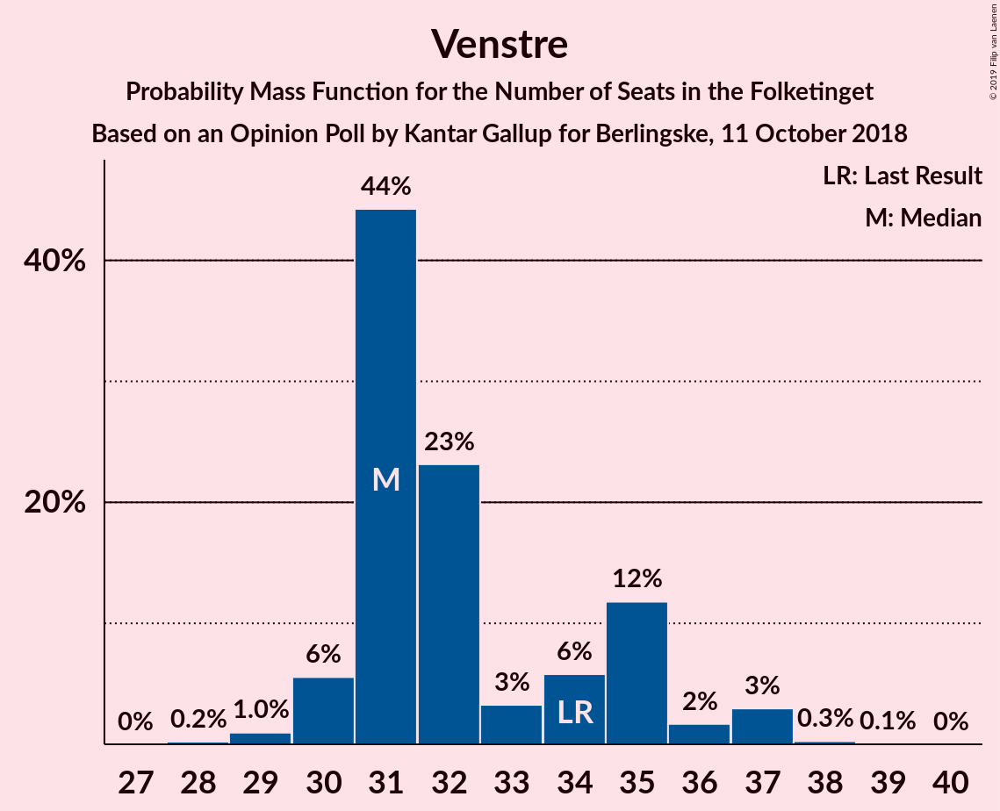
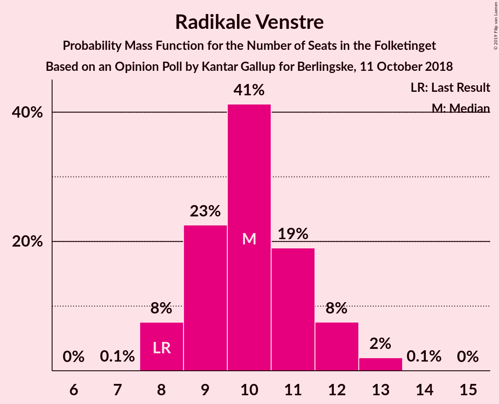
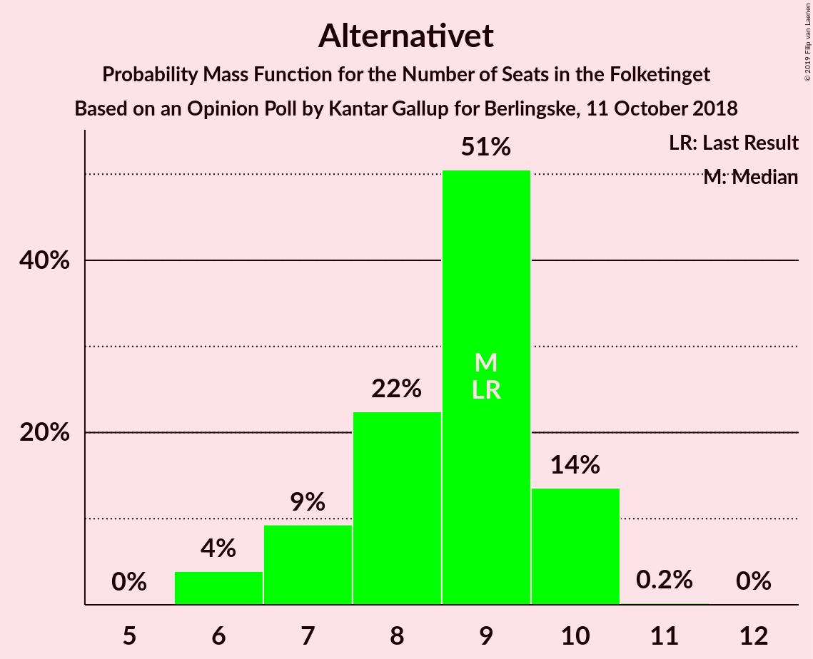
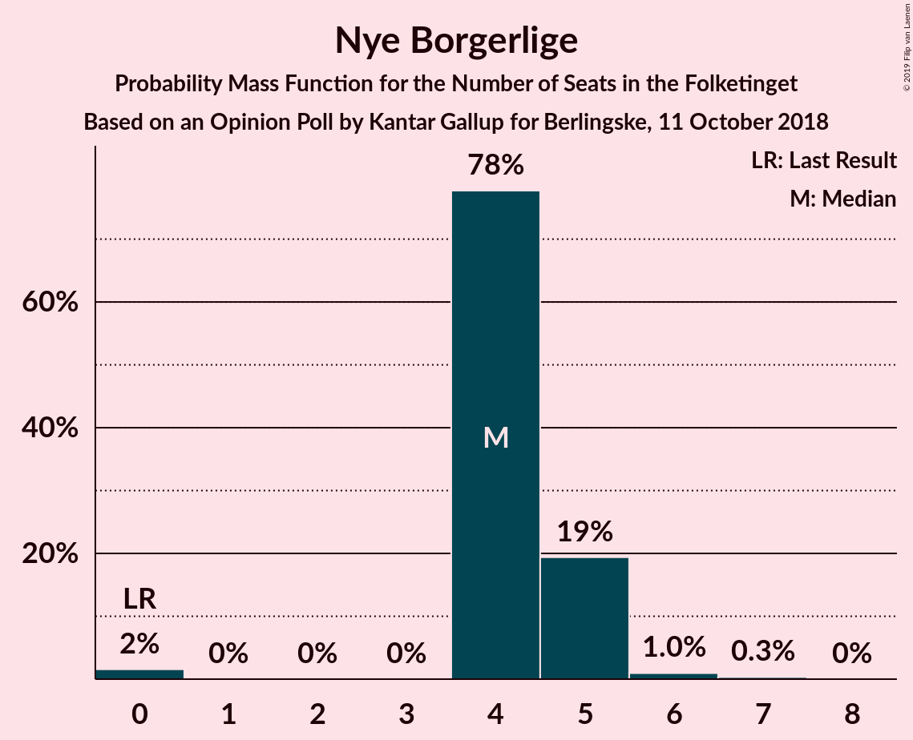

# Opinion Poll by Kantar Gallup for Berlingske, 11 October 2018

<a href="#voting-intentions">Voting Intentions</a> | <a href="#seats">Seats</a> | <a href="#coalitions">Coalitions</a> | <a href="#technical-information">Technical Information</a>

## Voting Intentions

### Confidence Intervals

| Party | Last Result | Poll Result | 80% Confidence Interval | 90% Confidence Interval | 95% Confidence Interval | 99% Confidence Interval |
|:-----:|:-----------:|:-----------:|:-----------------------:|:-----------------------:|:-----------------------:|:-----------------------:|
| Socialdemokraterne | 26.3% | 27.1% | 25.8–28.5% |25.4–29.0% |25.0–29.3% |24.4–30.0% |
| Venstre | 19.5% | 18.8% | 17.6–20.1% |17.3–20.5% |17.0–20.8% |16.5–21.4% |
| Dansk Folkeparti | 21.1% | 17.2% | 16.1–18.4% |15.7–18.8% |15.5–19.1% |14.9–19.7% |
| Enhedslisten–De Rød-Grønne | 7.8% | 8.8% | 7.9–9.7% |7.7–10.0% |7.5–10.2% |7.1–10.7% |
| Radikale Venstre | 4.6% | 5.8% | 5.1–6.6% |4.9–6.8% |4.8–7.0% |4.5–7.4% |
| Socialistisk Folkeparti | 4.2% | 5.3% | 4.7–6.1% |4.5–6.3% |4.3–6.5% |4.0–6.9% |
| Liberal Alliance | 7.5% | 5.2% | 4.6–6.0% |4.4–6.2% |4.2–6.4% |3.9–6.8% |
| Alternativet | 4.8% | 4.7% | 4.1–5.5% |3.9–5.7% |3.8–5.9% |3.5–6.2% |
| Det Konservative Folkeparti | 3.4% | 3.8% | 3.3–4.5% |3.1–4.7% |3.0–4.9% |2.8–5.2% |
| Nye Borgerlige | 0.0% | 2.5% | 2.1–3.1% |2.0–3.2% |1.9–3.4% |1.7–3.7% |
| Kristendemokraterne | 0.8% | 0.8% | 0.6–1.1% |0.5–1.2% |0.5–1.3% |0.4–1.5% |

*Note:* The poll result column reflects the actual value used in the calculations. Published results may vary slightly, and in addition be rounded to fewer digits.

## Seats

### Confidence Intervals

| Party | Last Result | Median | 80% Confidence Interval | 90% Confidence Interval | 95% Confidence Interval | 99% Confidence Interval |
|:-----:|:-----------:|:------:|:-----------------------:|:-----------------------:|:-----------------------:|:-----------------------:|
| <a href="#socialdemokraterne">Socialdemokraterne</a> | 47 | 50 | 48–53 |45–53 |43–53 |43–53 |
| <a href="#venstre">Venstre</a> | 34 | 30 | 26–35 |26–39 |26–39 |26–40 |
| <a href="#dansk-folkeparti">Dansk Folkeparti</a> | 37 | 29 | 28–32 |28–32 |28–35 |28–35 |
| <a href="#enhedslisten–de-rød-grønne">Enhedslisten–De Rød-Grønne</a> | 14 | 13 | 13–17 |12–17 |12–17 |12–17 |
| <a href="#radikale-venstre">Radikale Venstre</a> | 8 | 12 | 11–12 |10–12 |10–12 |8–12 |
| <a href="#socialistisk-folkeparti">Socialistisk Folkeparti</a> | 7 | 9 | 9–10 |9–12 |9–12 |8–14 |
| <a href="#liberal-alliance">Liberal Alliance</a> | 13 | 10 | 7–10 |7–10 |7–10 |7–14 |
| <a href="#alternativet">Alternativet</a> | 9 | 7 | 7–9 |7–10 |7–10 |7–10 |
| <a href="#det-konservative-folkeparti">Det Konservative Folkeparti</a> | 6 | 8 | 4–10 |4–10 |4–10 |4–10 |
| <a href="#nye-borgerlige">Nye Borgerlige</a> | 0 | 6 | 4–6 |0–6 |0–6 |0–6 |
| <a href="#kristendemokraterne">Kristendemokraterne</a> | 0 | 0 | 0 |0 |0 |0 |

### Socialdemokraterne

*For a full overview of the results for this party, see the [Socialdemokraterne](party-socialdemokraterne.html) page.*

| Number of Seats | Probability | Accumulated | Special Marks |
|:---------------:|:-----------:|:-----------:|:-------------:|
| 41 | 0.3% | 100% |  |
| 42 | 0% | 99.7% |  |
| 43 | 3% | 99.7% |  |
| 44 | 0% | 97% |  |
| 45 | 7% | 97% |  |
| 46 | 0.1% | 90% |  |
| 47 | 0% | 90% | Last Result |
| 48 | 18% | 90% |  |
| 49 | 0.7% | 72% |  |
| 50 | 49% | 71% | Median |
| 51 | 0% | 22% |  |
| 52 | 0% | 22% |  |
| 53 | 22% | 22% |  |
| 54 | 0% | 0% |  |

### Venstre

*For a full overview of the results for this party, see the [Venstre](party-venstre.html) page.*

| Number of Seats | Probability | Accumulated | Special Marks |
|:---------------:|:-----------:|:-----------:|:-------------:|
| 26 | 22% | 100% |  |
| 27 | 1.2% | 78% |  |
| 28 | 0% | 77% |  |
| 29 | 0.4% | 77% |  |
| 30 | 49% | 76% | Median |
| 31 | 0.2% | 27% |  |
| 32 | 3% | 27% |  |
| 33 | 0.4% | 23% |  |
| 34 | 0% | 23% | Last Result |
| 35 | 16% | 23% |  |
| 36 | 0% | 7% |  |
| 37 | 0% | 7% |  |
| 38 | 0% | 7% |  |
| 39 | 6% | 7% |  |
| 40 | 0.7% | 0.7% |  |
| 41 | 0% | 0% |  |

### Dansk Folkeparti

*For a full overview of the results for this party, see the [Dansk Folkeparti](party-danskfolkeparti.html) page.*

| Number of Seats | Probability | Accumulated | Special Marks |
|:---------------:|:-----------:|:-----------:|:-------------:|
| 24 | 0.1% | 100% |  |
| 25 | 0% | 99.9% |  |
| 26 | 0% | 99.9% |  |
| 27 | 0% | 99.9% |  |
| 28 | 49% | 99.9% |  |
| 29 | 0.7% | 51% | Median |
| 30 | 28% | 50% |  |
| 31 | 0.7% | 21% |  |
| 32 | 17% | 21% |  |
| 33 | 0% | 3% |  |
| 34 | 0% | 3% |  |
| 35 | 3% | 3% |  |
| 36 | 0.4% | 0.4% |  |
| 37 | 0% | 0% | Last Result |

### Enhedslisten–De Rød-Grønne

*For a full overview of the results for this party, see the [Enhedslisten–De Rød-Grønne](party-enhedslisten–derød-grønne.html) page.*

| Number of Seats | Probability | Accumulated | Special Marks |
|:---------------:|:-----------:|:-----------:|:-------------:|
| 11 | 0.3% | 100% |  |
| 12 | 6% | 99.7% |  |
| 13 | 65% | 93% | Median |
| 14 | 0.7% | 28% | Last Result |
| 15 | 4% | 28% |  |
| 16 | 0.7% | 23% |  |
| 17 | 23% | 23% |  |
| 18 | 0% | 0% |  |

### Radikale Venstre

*For a full overview of the results for this party, see the [Radikale Venstre](party-radikalevenstre.html) page.*

| Number of Seats | Probability | Accumulated | Special Marks |
|:---------------:|:-----------:|:-----------:|:-------------:|
| 8 | 0.7% | 100% | Last Result |
| 9 | 0.4% | 99.3% |  |
| 10 | 4% | 99.0% |  |
| 11 | 24% | 95% |  |
| 12 | 71% | 71% | Median |
| 13 | 0% | 0% |  |

### Socialistisk Folkeparti

*For a full overview of the results for this party, see the [Socialistisk Folkeparti](party-socialistiskfolkeparti.html) page.*

| Number of Seats | Probability | Accumulated | Special Marks |
|:---------------:|:-----------:|:-----------:|:-------------:|
| 6 | 0.4% | 100% |  |
| 7 | 0.1% | 99.6% | Last Result |
| 8 | 0.4% | 99.6% |  |
| 9 | 66% | 99.2% | Median |
| 10 | 25% | 33% |  |
| 11 | 0% | 8% |  |
| 12 | 7% | 8% |  |
| 13 | 0.1% | 1.3% |  |
| 14 | 1.2% | 1.2% |  |
| 15 | 0% | 0% |  |

### Liberal Alliance

*For a full overview of the results for this party, see the [Liberal Alliance](party-liberalalliance.html) page.*

| Number of Seats | Probability | Accumulated | Special Marks |
|:---------------:|:-----------:|:-----------:|:-------------:|
| 7 | 22% | 100% |  |
| 8 | 0.4% | 78% |  |
| 9 | 24% | 77% |  |
| 10 | 52% | 54% | Median |
| 11 | 0% | 2% |  |
| 12 | 0.7% | 2% |  |
| 13 | 0.7% | 1.3% | Last Result |
| 14 | 0.7% | 0.7% |  |
| 15 | 0% | 0% |  |

### Alternativet

*For a full overview of the results for this party, see the [Alternativet](party-alternativet.html) page.*

| Number of Seats | Probability | Accumulated | Special Marks |
|:---------------:|:-----------:|:-----------:|:-------------:|
| 7 | 51% | 100% | Median |
| 8 | 4% | 49% |  |
| 9 | 39% | 45% | Last Result |
| 10 | 6% | 6% |  |
| 11 | 0% | 0% |  |

### Det Konservative Folkeparti

*For a full overview of the results for this party, see the [Det Konservative Folkeparti](party-detkonservativefolkeparti.html) page.*

| Number of Seats | Probability | Accumulated | Special Marks |
|:---------------:|:-----------:|:-----------:|:-------------:|
| 4 | 16% | 100% |  |
| 5 | 0% | 84% |  |
| 6 | 23% | 84% | Last Result |
| 7 | 4% | 60% |  |
| 8 | 7% | 56% | Median |
| 9 | 0% | 49% |  |
| 10 | 49% | 49% |  |
| 11 | 0% | 0% |  |

### Nye Borgerlige

*For a full overview of the results for this party, see the [Nye Borgerlige](party-nyeborgerlige.html) page.*

| Number of Seats | Probability | Accumulated | Special Marks |
|:---------------:|:-----------:|:-----------:|:-------------:|
| 0 | 8% | 100% | Last Result |
| 1 | 0% | 92% |  |
| 2 | 0% | 92% |  |
| 3 | 0% | 92% |  |
| 4 | 22% | 92% |  |
| 5 | 3% | 70% |  |
| 6 | 67% | 67% | Median |
| 7 | 0% | 0% |  |

### Kristendemokraterne

*For a full overview of the results for this party, see the [Kristendemokraterne](party-kristendemokraterne.html) page.*

| Number of Seats | Probability | Accumulated | Special Marks |
|:---------------:|:-----------:|:-----------:|:-------------:|
| 0 | 100% | 100% | Last Result, Median |

## Coalitions

### Confidence Intervals

| Coalition | Last Result | Median | Majority? | 80% Confidence Interval | 90% Confidence Interval | 95% Confidence Interval | 99% Confidence Interval |
|:---------:|:-----------:|:------:|:---------:|:-----------------------:|:-----------------------:|:-----------------------:|:-----------------------:|
| Socialdemokraterne – Enhedslisten–De Rød-Grønne – Radikale Venstre – Socialistisk Folkeparti – Alternativet | 85 | 91 | 96% | 91–100 | 91–100 | 86–100 | 85–100 |
| Socialdemokraterne – Enhedslisten–De Rød-Grønne – Radikale Venstre – Socialistisk Folkeparti | 76 | 84 | 22% | 81–91 | 81–91 | 78–91 | 76–91 |
| Venstre – Dansk Folkeparti – Liberal Alliance – Det Konservative Folkeparti – Nye Borgerlige – Kristendemokraterne | 90 | 84 | 0.6% | 75–84 | 75–84 | 75–89 | 75–90 |
| Venstre – Dansk Folkeparti – Liberal Alliance – Det Konservative Folkeparti – Nye Borgerlige | 90 | 84 | 0.6% | 75–84 | 75–84 | 75–89 | 75–90 |
| Venstre – Dansk Folkeparti – Liberal Alliance – Det Konservative Folkeparti – Kristendemokraterne | 90 | 78 | 0% | 71–84 | 71–84 | 71–84 | 71–88 |
| Venstre – Dansk Folkeparti – Liberal Alliance – Det Konservative Folkeparti | 90 | 78 | 0% | 71–84 | 71–84 | 71–84 | 71–88 |

### Socialdemokraterne – Enhedslisten–De Rød-Grønne – Radikale Venstre – Socialistisk Folkeparti – Alternativet

| Number of Seats | Probability | Accumulated | Special Marks |
|:---------------:|:-----------:|:-----------:|:-------------:|
| 83 | 0.2% | 100% |  |
| 84 | 0% | 99.8% |  |
| 85 | 0.3% | 99.8% | Last Result |
| 86 | 3% | 99.4% |  |
| 87 | 0.6% | 97% |  |
| 88 | 0% | 96% |  |
| 89 | 0.5% | 96% |  |
| 90 | 0.1% | 96% | Majority |
| 91 | 72% | 95% | Median |
| 92 | 0% | 24% |  |
| 93 | 0% | 23% |  |
| 94 | 0% | 23% |  |
| 95 | 1.2% | 23% |  |
| 96 | 0% | 22% |  |
| 97 | 0% | 22% |  |
| 98 | 0% | 22% |  |
| 99 | 0% | 22% |  |
| 100 | 22% | 22% |  |
| 101 | 0% | 0% |  |

### Socialdemokraterne – Enhedslisten–De Rød-Grønne – Radikale Venstre – Socialistisk Folkeparti

| Number of Seats | Probability | Accumulated | Special Marks |
|:---------------:|:-----------:|:-----------:|:-------------:|
| 76 | 0.6% | 100% | Last Result |
| 77 | 0% | 99.4% |  |
| 78 | 3% | 99.4% |  |
| 79 | 0% | 97% |  |
| 80 | 0.7% | 97% |  |
| 81 | 6% | 96% |  |
| 82 | 17% | 90% |  |
| 83 | 0% | 73% |  |
| 84 | 50% | 73% | Median |
| 85 | 0% | 23% |  |
| 86 | 0% | 23% |  |
| 87 | 1.2% | 23% |  |
| 88 | 0% | 22% |  |
| 89 | 0% | 22% |  |
| 90 | 0% | 22% | Majority |
| 91 | 22% | 22% |  |
| 92 | 0% | 0% |  |

### Venstre – Dansk Folkeparti – Liberal Alliance – Det Konservative Folkeparti – Nye Borgerlige – Kristendemokraterne

| Number of Seats | Probability | Accumulated | Special Marks |
|:---------------:|:-----------:|:-----------:|:-------------:|
| 75 | 22% | 100% |  |
| 76 | 0% | 78% |  |
| 77 | 0% | 78% |  |
| 78 | 0% | 78% |  |
| 79 | 0% | 78% |  |
| 80 | 1.2% | 78% |  |
| 81 | 0% | 77% |  |
| 82 | 0% | 77% |  |
| 83 | 0% | 77% | Median |
| 84 | 72% | 76% |  |
| 85 | 0.1% | 5% |  |
| 86 | 0.5% | 4% |  |
| 87 | 0% | 4% |  |
| 88 | 0.6% | 4% |  |
| 89 | 3% | 3% |  |
| 90 | 0.3% | 0.6% | Last Result, Majority |
| 91 | 0% | 0.2% |  |
| 92 | 0.2% | 0.2% |  |
| 93 | 0% | 0% |  |

### Venstre – Dansk Folkeparti – Liberal Alliance – Det Konservative Folkeparti – Nye Borgerlige

| Number of Seats | Probability | Accumulated | Special Marks |
|:---------------:|:-----------:|:-----------:|:-------------:|
| 75 | 22% | 100% |  |
| 76 | 0% | 78% |  |
| 77 | 0% | 78% |  |
| 78 | 0% | 78% |  |
| 79 | 0% | 78% |  |
| 80 | 1.2% | 78% |  |
| 81 | 0% | 77% |  |
| 82 | 0% | 77% |  |
| 83 | 0% | 77% | Median |
| 84 | 72% | 76% |  |
| 85 | 0.1% | 5% |  |
| 86 | 0.5% | 4% |  |
| 87 | 0% | 4% |  |
| 88 | 0.6% | 4% |  |
| 89 | 3% | 3% |  |
| 90 | 0.3% | 0.6% | Last Result, Majority |
| 91 | 0% | 0.2% |  |
| 92 | 0.2% | 0.2% |  |
| 93 | 0% | 0% |  |

### Venstre – Dansk Folkeparti – Liberal Alliance – Det Konservative Folkeparti – Kristendemokraterne

| Number of Seats | Probability | Accumulated | Special Marks |
|:---------------:|:-----------:|:-----------:|:-------------:|
| 71 | 22% | 100% |  |
| 72 | 0% | 78% |  |
| 73 | 0% | 78% |  |
| 74 | 1.2% | 78% |  |
| 75 | 0% | 77% |  |
| 76 | 0.1% | 77% |  |
| 77 | 0% | 77% | Median |
| 78 | 65% | 77% |  |
| 79 | 0.1% | 11% |  |
| 80 | 0.4% | 11% |  |
| 81 | 0% | 11% |  |
| 82 | 0% | 11% |  |
| 83 | 0% | 11% |  |
| 84 | 10% | 11% |  |
| 85 | 0.3% | 1.3% |  |
| 86 | 0.3% | 1.0% |  |
| 87 | 0% | 0.6% |  |
| 88 | 0.6% | 0.6% |  |
| 89 | 0% | 0% |  |
| 90 | 0% | 0% | Last Result, Majority |

### Venstre – Dansk Folkeparti – Liberal Alliance – Det Konservative Folkeparti

| Number of Seats | Probability | Accumulated | Special Marks |
|:---------------:|:-----------:|:-----------:|:-------------:|
| 71 | 22% | 100% |  |
| 72 | 0% | 78% |  |
| 73 | 0% | 78% |  |
| 74 | 1.2% | 78% |  |
| 75 | 0% | 77% |  |
| 76 | 0.1% | 77% |  |
| 77 | 0% | 77% | Median |
| 78 | 65% | 77% |  |
| 79 | 0.1% | 11% |  |
| 80 | 0.4% | 11% |  |
| 81 | 0% | 11% |  |
| 82 | 0% | 11% |  |
| 83 | 0% | 11% |  |
| 84 | 10% | 11% |  |
| 85 | 0.3% | 1.3% |  |
| 86 | 0.3% | 1.0% |  |
| 87 | 0% | 0.6% |  |
| 88 | 0.6% | 0.6% |  |
| 89 | 0% | 0% |  |
| 90 | 0% | 0% | Last Result, Majority |

## Technical Information

### Opinion Poll

+ **Polling firm:** Kantar Gallup
+ **Commissioner(s):** Berlingske
+ **Fieldwork period:** 11 October 2018

### Calculations

+ **Sample size:** 1674
+ **Simulations done:** 1,024
+ **Error estimate:** 2.53%

