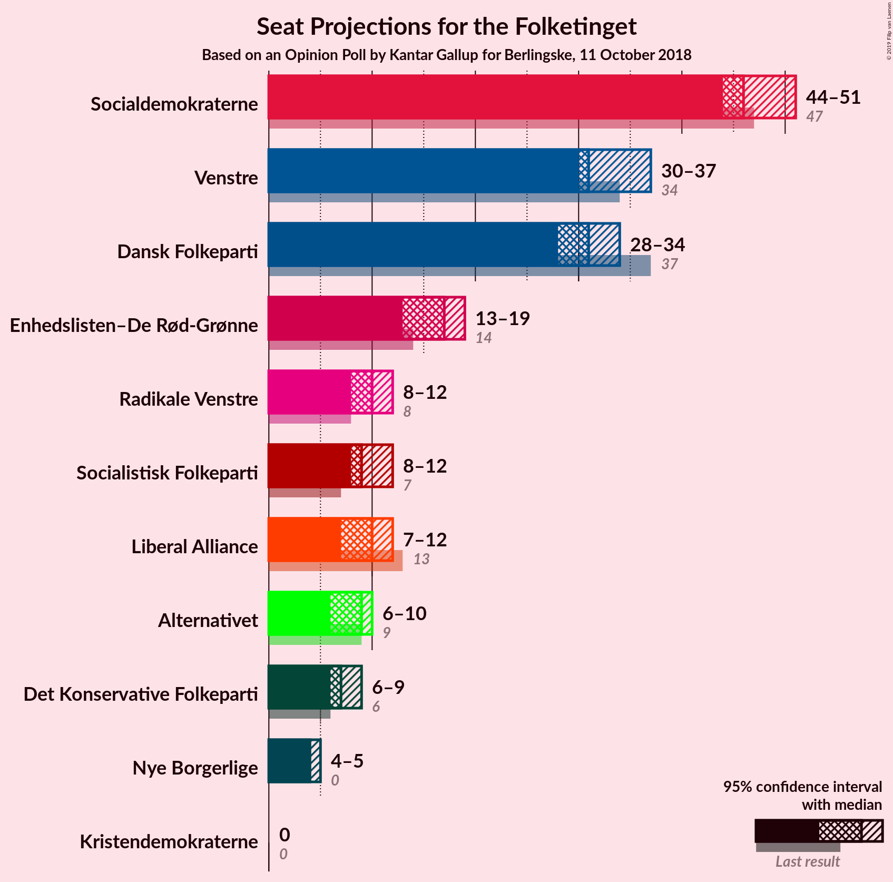
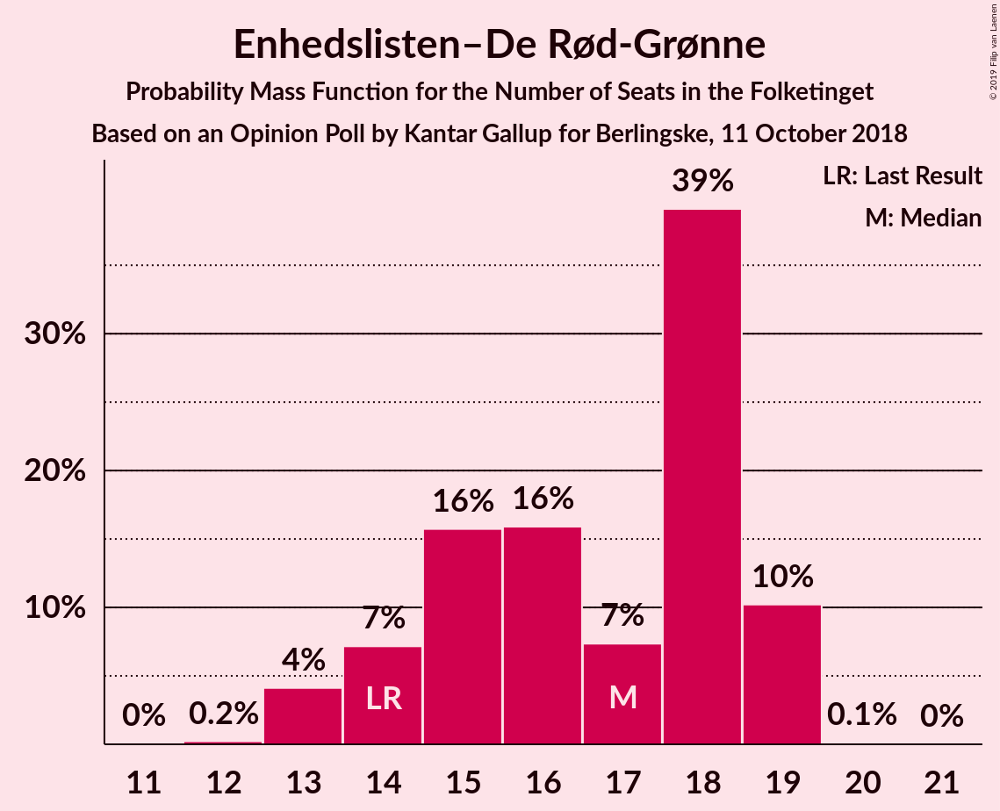

# Opinion Poll by Kantar Gallup for Berlingske, 11 October 2018

<a href="#voting-intentions">Voting Intentions</a> | <a href="#seats">Seats</a> | <a href="#coalitions">Coalitions</a> | <a href="#technical-information">Technical Information</a>

## Voting Intentions

### Confidence Intervals

| Party | Last Result | Poll Result | 80% Confidence Interval | 90% Confidence Interval | 95% Confidence Interval | 99% Confidence Interval |
|:-----:|:-----------:|:-----------:|:-----------------------:|:-----------------------:|:-----------------------:|:-----------------------:|
| Socialdemokraterne | 26.3% | 27.1% | 25.8–28.5% |25.4–29.0% |25.0–29.3% |24.4–30.0% |
| Venstre | 19.5% | 18.8% | 17.6–20.1% |17.3–20.5% |17.0–20.8% |16.5–21.4% |
| Dansk Folkeparti | 21.1% | 17.2% | 16.1–18.4% |15.7–18.8% |15.5–19.1% |14.9–19.7% |
| Enhedslisten–De Rød-Grønne | 7.8% | 8.8% | 7.9–9.7% |7.7–10.0% |7.5–10.2% |7.1–10.7% |
| Radikale Venstre | 4.6% | 5.8% | 5.1–6.6% |4.9–6.8% |4.8–7.0% |4.5–7.4% |
| Socialistisk Folkeparti | 4.2% | 5.3% | 4.7–6.1% |4.5–6.3% |4.3–6.5% |4.0–6.9% |
| Liberal Alliance | 7.5% | 5.2% | 4.6–6.0% |4.4–6.2% |4.2–6.4% |3.9–6.8% |
| Alternativet | 4.8% | 4.7% | 4.1–5.5% |3.9–5.7% |3.8–5.9% |3.5–6.2% |
| Det Konservative Folkeparti | 3.4% | 3.8% | 3.3–4.5% |3.1–4.7% |3.0–4.9% |2.8–5.2% |
| Nye Borgerlige | 0.0% | 2.5% | 2.1–3.1% |2.0–3.2% |1.9–3.4% |1.7–3.7% |
| Kristendemokraterne | 0.8% | 0.8% | 0.6–1.1% |0.5–1.2% |0.5–1.3% |0.4–1.5% |

*Note:* The poll result column reflects the actual value used in the calculations. Published results may vary slightly, and in addition be rounded to fewer digits.

## Seats

### Confidence Intervals

| Party | Last Result | Median | 80% Confidence Interval | 90% Confidence Interval | 95% Confidence Interval | 99% Confidence Interval |
|:-----:|:-----------:|:------:|:-----------------------:|:-----------------------:|:-----------------------:|:-----------------------:|
| <a href="#socialdemokraterne">Socialdemokraterne</a> | 47 | 46 | 45–50 |45–51 |44–51 |43–54 |
| <a href="#venstre">Venstre</a> | 34 | 31 | 31–35 |30–35 |30–37 |29–37 |
| <a href="#dansk-folkeparti">Dansk Folkeparti</a> | 37 | 31 | 28–33 |28–34 |28–34 |26–34 |
| <a href="#enhedslisten–de-rød-grønne">Enhedslisten–De Rød-Grønne</a> | 14 | 17 | 14–19 |14–19 |13–19 |13–19 |
| <a href="#radikale-venstre">Radikale Venstre</a> | 8 | 10 | 9–11 |8–12 |8–12 |8–13 |
| <a href="#socialistisk-folkeparti">Socialistisk Folkeparti</a> | 7 | 9 | 8–10 |8–12 |8–12 |8–12 |
| <a href="#liberal-alliance">Liberal Alliance</a> | 13 | 10 | 8–11 |8–12 |7–12 |7–12 |
| <a href="#alternativet">Alternativet</a> | 9 | 9 | 7–10 |7–10 |6–10 |6–10 |
| <a href="#det-konservative-folkeparti">Det Konservative Folkeparti</a> | 6 | 7 | 6–7 |6–8 |6–9 |5–9 |
| <a href="#nye-borgerlige">Nye Borgerlige</a> | 0 | 4 | 4–5 |4–5 |4–5 |0–6 |
| <a href="#kristendemokraterne">Kristendemokraterne</a> | 0 | 0 | 0 |0 |0 |0 |

### Socialdemokraterne

*For a full overview of the results for this party, see the [Socialdemokraterne](party-socialdemokraterne.html) page.*

| Number of Seats | Probability | Accumulated | Special Marks |
|:---------------:|:-----------:|:-----------:|:-------------:|
| 42 | 0.1% | 100% |  |
| 43 | 0.7% | 99.9% |  |
| 44 | 3% | 99.1% |  |
| 45 | 9% | 96% |  |
| 46 | 47% | 87% | Median |
| 47 | 4% | 39% | Last Result |
| 48 | 13% | 36% |  |
| 49 | 7% | 22% |  |
| 50 | 9% | 16% |  |
| 51 | 5% | 7% |  |
| 52 | 0.4% | 1.5% |  |
| 53 | 0.2% | 1.1% |  |
| 54 | 0.9% | 0.9% |  |
| 55 | 0% | 0% |  |

### Venstre

*For a full overview of the results for this party, see the [Venstre](party-venstre.html) page.*

| Number of Seats | Probability | Accumulated | Special Marks |
|:---------------:|:-----------:|:-----------:|:-------------:|
| 28 | 0.2% | 100% |  |
| 29 | 1.0% | 99.8% |  |
| 30 | 6% | 98.8% |  |
| 31 | 44% | 93% | Median |
| 32 | 23% | 49% |  |
| 33 | 3% | 26% |  |
| 34 | 6% | 23% | Last Result |
| 35 | 12% | 17% |  |
| 36 | 2% | 5% |  |
| 37 | 3% | 3% |  |
| 38 | 0.3% | 0.3% |  |
| 39 | 0.1% | 0.1% |  |
| 40 | 0% | 0% |  |

### Dansk Folkeparti

*For a full overview of the results for this party, see the [Dansk Folkeparti](party-danskfolkeparti.html) page.*

| Number of Seats | Probability | Accumulated | Special Marks |
|:---------------:|:-----------:|:-----------:|:-------------:|
| 25 | 0.1% | 100% |  |
| 26 | 0.6% | 99.9% |  |
| 27 | 2% | 99.4% |  |
| 28 | 21% | 98% |  |
| 29 | 10% | 76% |  |
| 30 | 5% | 67% |  |
| 31 | 46% | 62% | Median |
| 32 | 3% | 16% |  |
| 33 | 6% | 13% |  |
| 34 | 7% | 7% |  |
| 35 | 0.1% | 0.1% |  |
| 36 | 0% | 0.1% |  |
| 37 | 0% | 0% | Last Result |

### Enhedslisten–De Rød-Grønne

*For a full overview of the results for this party, see the [Enhedslisten–De Rød-Grønne](party-enhedslisten–derød-grønne.html) page.*

| Number of Seats | Probability | Accumulated | Special Marks |
|:---------------:|:-----------:|:-----------:|:-------------:|
| 12 | 0.2% | 100% |  |
| 13 | 4% | 99.7% |  |
| 14 | 7% | 96% | Last Result |
| 15 | 16% | 88% |  |
| 16 | 16% | 73% |  |
| 17 | 7% | 57% | Median |
| 18 | 39% | 49% |  |
| 19 | 10% | 10% |  |
| 20 | 0.1% | 0.1% |  |
| 21 | 0% | 0% |  |

### Radikale Venstre

*For a full overview of the results for this party, see the [Radikale Venstre](party-radikalevenstre.html) page.*

| Number of Seats | Probability | Accumulated | Special Marks |
|:---------------:|:-----------:|:-----------:|:-------------:|
| 7 | 0.1% | 100% |  |
| 8 | 8% | 99.9% | Last Result |
| 9 | 23% | 92% |  |
| 10 | 41% | 70% | Median |
| 11 | 19% | 29% |  |
| 12 | 8% | 10% |  |
| 13 | 2% | 2% |  |
| 14 | 0.1% | 0.1% |  |
| 15 | 0% | 0% |  |

### Socialistisk Folkeparti

*For a full overview of the results for this party, see the [Socialistisk Folkeparti](party-socialistiskfolkeparti.html) page.*

| Number of Seats | Probability | Accumulated | Special Marks |
|:---------------:|:-----------:|:-----------:|:-------------:|
| 7 | 0.4% | 100% | Last Result |
| 8 | 45% | 99.6% |  |
| 9 | 19% | 54% | Median |
| 10 | 27% | 35% |  |
| 11 | 3% | 8% |  |
| 12 | 5% | 5% |  |
| 13 | 0% | 0% |  |

### Liberal Alliance

*For a full overview of the results for this party, see the [Liberal Alliance](party-liberalalliance.html) page.*

| Number of Seats | Probability | Accumulated | Special Marks |
|:---------------:|:-----------:|:-----------:|:-------------:|
| 6 | 0.1% | 100% |  |
| 7 | 5% | 99.9% |  |
| 8 | 13% | 95% |  |
| 9 | 12% | 82% |  |
| 10 | 25% | 70% | Median |
| 11 | 37% | 45% |  |
| 12 | 8% | 8% |  |
| 13 | 0.1% | 0.1% | Last Result |
| 14 | 0% | 0% |  |

### Alternativet

*For a full overview of the results for this party, see the [Alternativet](party-alternativet.html) page.*

| Number of Seats | Probability | Accumulated | Special Marks |
|:---------------:|:-----------:|:-----------:|:-------------:|
| 6 | 4% | 100% |  |
| 7 | 9% | 96% |  |
| 8 | 22% | 87% |  |
| 9 | 51% | 64% | Last Result, Median |
| 10 | 14% | 14% |  |
| 11 | 0.2% | 0.3% |  |
| 12 | 0% | 0% |  |

### Det Konservative Folkeparti

*For a full overview of the results for this party, see the [Det Konservative Folkeparti](party-detkonservativefolkeparti.html) page.*

| Number of Seats | Probability | Accumulated | Special Marks |
|:---------------:|:-----------:|:-----------:|:-------------:|
| 4 | 0.2% | 100% |  |
| 5 | 0.4% | 99.8% |  |
| 6 | 24% | 99.4% | Last Result |
| 7 | 68% | 76% | Median |
| 8 | 5% | 8% |  |
| 9 | 3% | 3% |  |
| 10 | 0% | 0% |  |

### Nye Borgerlige

*For a full overview of the results for this party, see the [Nye Borgerlige](party-nyeborgerlige.html) page.*

| Number of Seats | Probability | Accumulated | Special Marks |
|:---------------:|:-----------:|:-----------:|:-------------:|
| 0 | 2% | 100% | Last Result |
| 1 | 0% | 98% |  |
| 2 | 0% | 98% |  |
| 3 | 0% | 98% |  |
| 4 | 78% | 98% | Median |
| 5 | 19% | 21% |  |
| 6 | 1.0% | 1.3% |  |
| 7 | 0.3% | 0.3% |  |
| 8 | 0% | 0% |  |

### Kristendemokraterne

*For a full overview of the results for this party, see the [Kristendemokraterne](party-kristendemokraterne.html) page.*

| Number of Seats | Probability | Accumulated | Special Marks |
|:---------------:|:-----------:|:-----------:|:-------------:|
| 0 | 100% | 100% | Last Result, Median |

## Coalitions

### Confidence Intervals

| Coalition | Last Result | Median | Majority? | 80% Confidence Interval | 90% Confidence Interval | 95% Confidence Interval | 99% Confidence Interval |
|:---------:|:-----------:|:------:|:---------:|:-----------------------:|:-----------------------:|:-----------------------:|:-----------------------:|
| Socialdemokraterne – Enhedslisten–De Rød-Grønne – Radikale Venstre – Socialistisk Folkeparti – Alternativet | 85 | 91 | 84% | 89–95 | 87–95 | 85–96 | 85–98 |
| Venstre – Dansk Folkeparti – Liberal Alliance – Det Konservative Folkeparti – Nye Borgerlige – Kristendemokraterne | 90 | 84 | 3% | 80–86 | 80–88 | 79–90 | 77–90 |
| Venstre – Dansk Folkeparti – Liberal Alliance – Det Konservative Folkeparti – Nye Borgerlige | 90 | 84 | 3% | 80–86 | 80–88 | 79–90 | 77–90 |
| Socialdemokraterne – Enhedslisten–De Rød-Grønne – Radikale Venstre – Socialistisk Folkeparti | 76 | 82 | 0.5% | 81–86 | 79–88 | 77–89 | 77–90 |
| Socialdemokraterne – Enhedslisten–De Rød-Grønne – Socialistisk Folkeparti – Alternativet | 77 | 81 | 0% | 78–85 | 77–86 | 74–87 | 74–87 |
| Venstre – Dansk Folkeparti – Liberal Alliance – Det Konservative Folkeparti – Kristendemokraterne | 90 | 80 | 0% | 76–82 | 75–84 | 75–85 | 74–85 |
| Venstre – Dansk Folkeparti – Liberal Alliance – Det Konservative Folkeparti | 90 | 80 | 0% | 76–82 | 75–84 | 75–85 | 74–85 |
| Socialdemokraterne – Enhedslisten–De Rød-Grønne – Socialistisk Folkeparti | 68 | 72 | 0% | 70–77 | 69–78 | 66–79 | 66–79 |
| Socialdemokraterne – Radikale Venstre – Socialistisk Folkeparti | 62 | 66 | 0% | 64–70 | 64–70 | 63–71 | 62–73 |
| Socialdemokraterne – Radikale Venstre | 55 | 56 | 0% | 55–60 | 55–61 | 55–62 | 53–64 |
| Venstre – Liberal Alliance – Det Konservative Folkeparti | 53 | 49 | 0% | 46–53 | 46–54 | 46–54 | 45–54 |
| Venstre – Det Konservative Folkeparti | 40 | 38 | 0% | 37–42 | 36–42 | 36–44 | 36–44 |
| Venstre | 34 | 31 | 0% | 31–35 | 30–35 | 30–37 | 29–37 |

### Socialdemokraterne – Enhedslisten–De Rød-Grønne – Radikale Venstre – Socialistisk Folkeparti – Alternativet

| Number of Seats | Probability | Accumulated | Special Marks |
|:---------------:|:-----------:|:-----------:|:-------------:|
| 84 | 0.1% | 100% |  |
| 85 | 3% | 99.9% | Last Result |
| 86 | 0.5% | 97% |  |
| 87 | 2% | 97% |  |
| 88 | 3% | 95% |  |
| 89 | 9% | 92% |  |
| 90 | 5% | 84% | Majority |
| 91 | 43% | 79% | Median |
| 92 | 7% | 36% |  |
| 93 | 13% | 29% |  |
| 94 | 5% | 17% |  |
| 95 | 7% | 12% |  |
| 96 | 3% | 5% |  |
| 97 | 1.4% | 2% |  |
| 98 | 0.3% | 0.5% |  |
| 99 | 0.1% | 0.2% |  |
| 100 | 0.1% | 0.1% |  |
| 101 | 0% | 0% |  |

### Venstre – Dansk Folkeparti – Liberal Alliance – Det Konservative Folkeparti – Nye Borgerlige – Kristendemokraterne

| Number of Seats | Probability | Accumulated | Special Marks |
|:---------------:|:-----------:|:-----------:|:-------------:|
| 75 | 0.1% | 100% |  |
| 76 | 0.1% | 99.9% |  |
| 77 | 0.3% | 99.8% |  |
| 78 | 1.4% | 99.5% |  |
| 79 | 3% | 98% |  |
| 80 | 7% | 95% |  |
| 81 | 5% | 88% |  |
| 82 | 13% | 83% |  |
| 83 | 7% | 71% | Median |
| 84 | 43% | 64% |  |
| 85 | 5% | 21% |  |
| 86 | 9% | 16% |  |
| 87 | 3% | 8% |  |
| 88 | 2% | 5% |  |
| 89 | 0.5% | 3% |  |
| 90 | 3% | 3% | Last Result, Majority |
| 91 | 0.1% | 0.1% |  |
| 92 | 0% | 0% |  |

### Venstre – Dansk Folkeparti – Liberal Alliance – Det Konservative Folkeparti – Nye Borgerlige

| Number of Seats | Probability | Accumulated | Special Marks |
|:---------------:|:-----------:|:-----------:|:-------------:|
| 75 | 0.1% | 100% |  |
| 76 | 0.1% | 99.9% |  |
| 77 | 0.3% | 99.8% |  |
| 78 | 1.4% | 99.5% |  |
| 79 | 3% | 98% |  |
| 80 | 7% | 95% |  |
| 81 | 5% | 88% |  |
| 82 | 13% | 83% |  |
| 83 | 7% | 71% | Median |
| 84 | 43% | 64% |  |
| 85 | 5% | 21% |  |
| 86 | 9% | 16% |  |
| 87 | 3% | 8% |  |
| 88 | 2% | 5% |  |
| 89 | 0.5% | 3% |  |
| 90 | 3% | 3% | Last Result, Majority |
| 91 | 0.1% | 0.1% |  |
| 92 | 0% | 0% |  |

### Socialdemokraterne – Enhedslisten–De Rød-Grønne – Radikale Venstre – Socialistisk Folkeparti

| Number of Seats | Probability | Accumulated | Special Marks |
|:---------------:|:-----------:|:-----------:|:-------------:|
| 76 | 0% | 100% | Last Result |
| 77 | 3% | 99.9% |  |
| 78 | 0.5% | 97% |  |
| 79 | 3% | 97% |  |
| 80 | 1.3% | 94% |  |
| 81 | 10% | 93% |  |
| 82 | 41% | 82% | Median |
| 83 | 8% | 41% |  |
| 84 | 19% | 34% |  |
| 85 | 4% | 15% |  |
| 86 | 2% | 11% |  |
| 87 | 1.0% | 9% |  |
| 88 | 5% | 8% |  |
| 89 | 3% | 3% |  |
| 90 | 0.1% | 0.5% | Majority |
| 91 | 0.3% | 0.4% |  |
| 92 | 0.1% | 0.1% |  |
| 93 | 0% | 0% |  |

### Socialdemokraterne – Enhedslisten–De Rød-Grønne – Socialistisk Folkeparti – Alternativet

| Number of Seats | Probability | Accumulated | Special Marks |
|:---------------:|:-----------:|:-----------:|:-------------:|
| 74 | 2% | 100% |  |
| 75 | 0.4% | 97% |  |
| 76 | 0.3% | 97% |  |
| 77 | 3% | 97% | Last Result |
| 78 | 9% | 94% |  |
| 79 | 5% | 84% |  |
| 80 | 2% | 79% |  |
| 81 | 37% | 77% | Median |
| 82 | 12% | 40% |  |
| 83 | 3% | 28% |  |
| 84 | 14% | 25% |  |
| 85 | 4% | 12% |  |
| 86 | 4% | 8% |  |
| 87 | 4% | 4% |  |
| 88 | 0.1% | 0.3% |  |
| 89 | 0.1% | 0.1% |  |
| 90 | 0% | 0% | Majority |

### Venstre – Dansk Folkeparti – Liberal Alliance – Det Konservative Folkeparti – Kristendemokraterne

| Number of Seats | Probability | Accumulated | Special Marks |
|:---------------:|:-----------:|:-----------:|:-------------:|
| 72 | 0.1% | 100% |  |
| 73 | 0.3% | 99.9% |  |
| 74 | 2% | 99.5% |  |
| 75 | 6% | 98% |  |
| 76 | 3% | 92% |  |
| 77 | 7% | 88% |  |
| 78 | 14% | 81% |  |
| 79 | 3% | 67% | Median |
| 80 | 45% | 64% |  |
| 81 | 2% | 18% |  |
| 82 | 10% | 16% |  |
| 83 | 1.1% | 7% |  |
| 84 | 2% | 5% |  |
| 85 | 3% | 3% |  |
| 86 | 0.1% | 0.2% |  |
| 87 | 0% | 0.1% |  |
| 88 | 0% | 0% |  |
| 89 | 0% | 0% |  |
| 90 | 0% | 0% | Last Result, Majority |

### Venstre – Dansk Folkeparti – Liberal Alliance – Det Konservative Folkeparti

| Number of Seats | Probability | Accumulated | Special Marks |
|:---------------:|:-----------:|:-----------:|:-------------:|
| 72 | 0.1% | 100% |  |
| 73 | 0.3% | 99.9% |  |
| 74 | 2% | 99.5% |  |
| 75 | 6% | 98% |  |
| 76 | 3% | 92% |  |
| 77 | 7% | 88% |  |
| 78 | 14% | 81% |  |
| 79 | 3% | 67% | Median |
| 80 | 46% | 64% |  |
| 81 | 2% | 18% |  |
| 82 | 10% | 16% |  |
| 83 | 1.1% | 7% |  |
| 84 | 2% | 5% |  |
| 85 | 3% | 3% |  |
| 86 | 0.1% | 0.2% |  |
| 87 | 0% | 0.1% |  |
| 88 | 0% | 0% |  |
| 89 | 0% | 0% |  |
| 90 | 0% | 0% | Last Result, Majority |

### Socialdemokraterne – Enhedslisten–De Rød-Grønne – Socialistisk Folkeparti

| Number of Seats | Probability | Accumulated | Special Marks |
|:---------------:|:-----------:|:-----------:|:-------------:|
| 65 | 0.1% | 100% |  |
| 66 | 2% | 99.9% |  |
| 67 | 0.4% | 97% |  |
| 68 | 0.4% | 97% | Last Result |
| 69 | 3% | 97% |  |
| 70 | 9% | 94% |  |
| 71 | 4% | 84% |  |
| 72 | 41% | 80% | Median |
| 73 | 6% | 39% |  |
| 74 | 10% | 33% |  |
| 75 | 10% | 23% |  |
| 76 | 1.3% | 13% |  |
| 77 | 5% | 12% |  |
| 78 | 3% | 7% |  |
| 79 | 4% | 4% |  |
| 80 | 0% | 0.2% |  |
| 81 | 0.1% | 0.1% |  |
| 82 | 0% | 0% |  |

### Socialdemokraterne – Radikale Venstre – Socialistisk Folkeparti

| Number of Seats | Probability | Accumulated | Special Marks |
|:---------------:|:-----------:|:-----------:|:-------------:|
| 61 | 0.2% | 100% |  |
| 62 | 0.3% | 99.8% | Last Result |
| 63 | 3% | 99.5% |  |
| 64 | 37% | 97% |  |
| 65 | 9% | 59% | Median |
| 66 | 15% | 51% |  |
| 67 | 9% | 36% |  |
| 68 | 7% | 27% |  |
| 69 | 7% | 20% |  |
| 70 | 9% | 13% |  |
| 71 | 2% | 4% |  |
| 72 | 1.0% | 2% |  |
| 73 | 0.7% | 0.9% |  |
| 74 | 0.1% | 0.2% |  |
| 75 | 0.1% | 0.2% |  |
| 76 | 0% | 0% |  |

### Socialdemokraterne – Radikale Venstre

| Number of Seats | Probability | Accumulated | Special Marks |
|:---------------:|:-----------:|:-----------:|:-------------:|
| 52 | 0.1% | 100% |  |
| 53 | 0.8% | 99.8% |  |
| 54 | 0.8% | 99.0% |  |
| 55 | 11% | 98% | Last Result |
| 56 | 47% | 87% | Median |
| 57 | 9% | 40% |  |
| 58 | 8% | 31% |  |
| 59 | 6% | 23% |  |
| 60 | 8% | 16% |  |
| 61 | 6% | 8% |  |
| 62 | 2% | 3% |  |
| 63 | 0% | 1.1% |  |
| 64 | 1.0% | 1.1% |  |
| 65 | 0% | 0.1% |  |
| 66 | 0% | 0% |  |

### Venstre – Liberal Alliance – Det Konservative Folkeparti

| Number of Seats | Probability | Accumulated | Special Marks |
|:---------------:|:-----------:|:-----------:|:-------------:|
| 43 | 0.1% | 100% |  |
| 44 | 0.1% | 99.9% |  |
| 45 | 0.9% | 99.8% |  |
| 46 | 13% | 98.9% |  |
| 47 | 10% | 86% |  |
| 48 | 9% | 76% | Median |
| 49 | 47% | 67% |  |
| 50 | 2% | 20% |  |
| 51 | 3% | 19% |  |
| 52 | 5% | 16% |  |
| 53 | 2% | 10% | Last Result |
| 54 | 8% | 8% |  |
| 55 | 0.2% | 0.2% |  |
| 56 | 0.1% | 0.1% |  |
| 57 | 0% | 0% |  |

### Venstre – Det Konservative Folkeparti

| Number of Seats | Probability | Accumulated | Special Marks |
|:---------------:|:-----------:|:-----------:|:-------------:|
| 34 | 0.1% | 100% |  |
| 35 | 0.2% | 99.9% |  |
| 36 | 5% | 99.7% |  |
| 37 | 4% | 94% |  |
| 38 | 49% | 90% | Median |
| 39 | 14% | 41% |  |
| 40 | 6% | 28% | Last Result |
| 41 | 5% | 22% |  |
| 42 | 12% | 17% |  |
| 43 | 1.4% | 5% |  |
| 44 | 3% | 3% |  |
| 45 | 0.3% | 0.4% |  |
| 46 | 0.1% | 0.2% |  |
| 47 | 0.1% | 0.1% |  |
| 48 | 0% | 0% |  |

### Venstre

| Number of Seats | Probability | Accumulated | Special Marks |
|:---------------:|:-----------:|:-----------:|:-------------:|
| 28 | 0.2% | 100% |  |
| 29 | 1.0% | 99.8% |  |
| 30 | 6% | 98.8% |  |
| 31 | 44% | 93% | Median |
| 32 | 23% | 49% |  |
| 33 | 3% | 26% |  |
| 34 | 6% | 23% | Last Result |
| 35 | 12% | 17% |  |
| 36 | 2% | 5% |  |
| 37 | 3% | 3% |  |
| 38 | 0.3% | 0.3% |  |
| 39 | 0.1% | 0.1% |  |
| 40 | 0% | 0% |  |

## Technical Information

### Opinion Poll

+ **Polling firm:** Kantar Gallup
+ **Commissioner(s):** Berlingske
+ **Fieldwork period:** 11 October 2018

### Calculations

+ **Sample size:** 1674
+ **Simulations done:** 1,048,576
+ **Error estimate:** 1.71%

