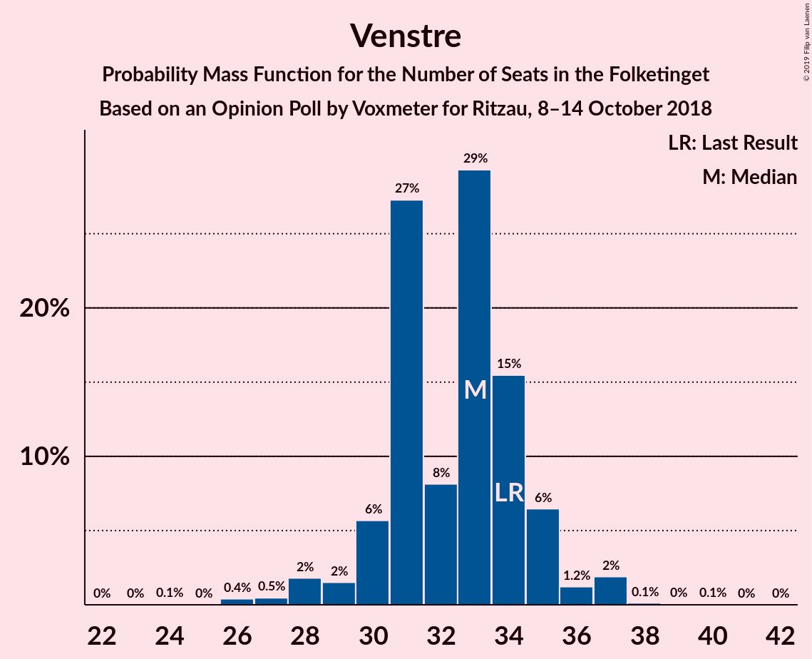
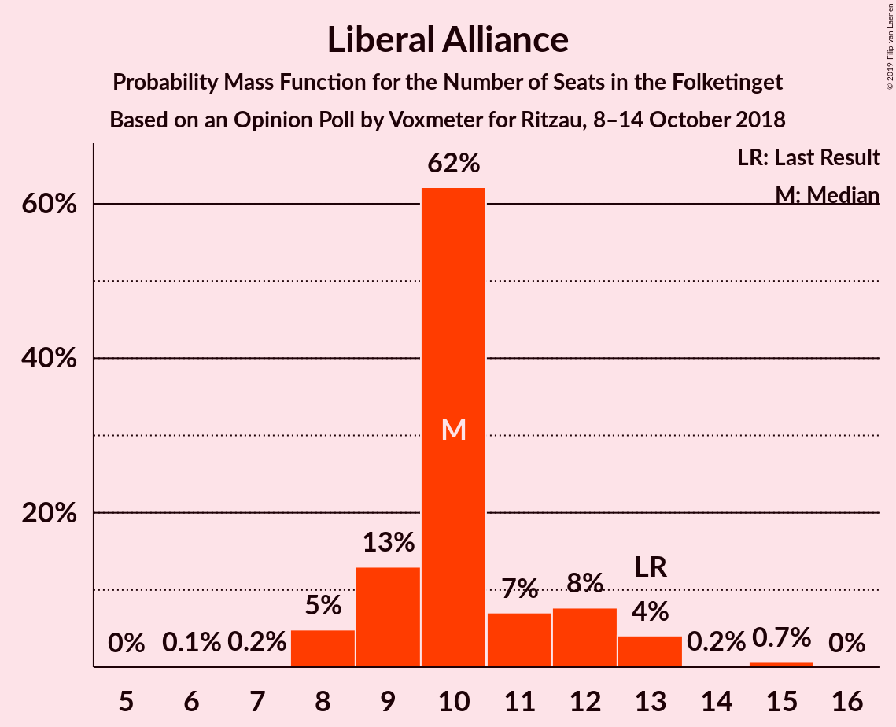

# Opinion Poll by Voxmeter for Ritzau, 8–14 October 2018

<a href="#voting-intentions">Voting Intentions</a> | <a href="#seats">Seats</a> | <a href="#coalitions">Coalitions</a> | <a href="#technical-information">Technical Information</a>

## Voting Intentions

### Confidence Intervals

| Party | Last Result | Poll Result | 80% Confidence Interval | 90% Confidence Interval | 95% Confidence Interval | 99% Confidence Interval |
|:-----:|:-----------:|:-----------:|:-----------------------:|:-----------------------:|:-----------------------:|:-----------------------:|
| Socialdemokraterne | 26.3% | 28.3% | 26.6–30.2% |26.1–30.7% |25.7–31.2% |24.8–32.1% |
| Venstre | 19.5% | 18.0% | 16.5–19.6% |16.1–20.1% |15.8–20.5% |15.1–21.3% |
| Dansk Folkeparti | 21.1% | 17.7% | 16.2–19.3% |15.8–19.8% |15.5–20.2% |14.8–21.0% |
| Enhedslisten–De Rød-Grønne | 7.8% | 8.5% | 7.4–9.7% |7.1–10.0% |6.9–10.3% |6.4–11.0% |
| Liberal Alliance | 7.5% | 5.7% | 4.9–6.8% |4.6–7.1% |4.4–7.3% |4.1–7.8% |
| Socialistisk Folkeparti | 4.2% | 5.3% | 4.5–6.3% |4.3–6.6% |4.1–6.9% |3.7–7.4% |
| Radikale Venstre | 4.6% | 5.0% | 4.2–6.0% |4.0–6.3% |3.8–6.6% |3.5–7.1% |
| Alternativet | 4.8% | 4.8% | 4.1–5.8% |3.8–6.1% |3.7–6.3% |3.3–6.8% |
| Det Konservative Folkeparti | 3.4% | 3.5% | 2.9–4.4% |2.7–4.6% |2.6–4.9% |2.3–5.3% |
| Nye Borgerlige | 0.0% | 2.0% | 1.5–2.7% |1.4–2.9% |1.3–3.0% |1.1–3.4% |
| Kristendemokraterne | 0.8% | 0.9% | 0.6–1.4% |0.5–1.5% |0.5–1.7% |0.4–2.0% |

*Note:* The poll result column reflects the actual value used in the calculations. Published results may vary slightly, and in addition be rounded to fewer digits.

## Seats

### Confidence Intervals

| Party | Last Result | Median | 80% Confidence Interval | 90% Confidence Interval | 95% Confidence Interval | 99% Confidence Interval |
|:-----:|:-----------:|:------:|:-----------------------:|:-----------------------:|:-----------------------:|:-----------------------:|
| <a href="#socialdemokraterne">Socialdemokraterne</a> | 47 | 49 | 46–55 |46–56 |45–57 |44–57 |
| <a href="#venstre">Venstre</a> | 34 | 32 | 28–35 |28–35 |28–36 |28–38 |
| <a href="#dansk-folkeparti">Dansk Folkeparti</a> | 37 | 32 | 30–35 |29–36 |28–36 |26–36 |
| <a href="#enhedslisten–de-rød-grønne">Enhedslisten–De Rød-Grønne</a> | 14 | 15 | 12–16 |12–18 |12–19 |11–20 |
| <a href="#liberal-alliance">Liberal Alliance</a> | 13 | 11 | 9–15 |8–15 |8–15 |6–15 |
| <a href="#socialistisk-folkeparti">Socialistisk Folkeparti</a> | 7 | 10 | 8–12 |8–13 |8–13 |6–13 |
| <a href="#radikale-venstre">Radikale Venstre</a> | 8 | 8 | 8–11 |7–11 |7–11 |6–12 |
| <a href="#alternativet">Alternativet</a> | 9 | 9 | 7–10 |6–11 |6–11 |6–12 |
| <a href="#det-konservative-folkeparti">Det Konservative Folkeparti</a> | 6 | 6 | 4–9 |4–9 |4–9 |4–10 |
| <a href="#nye-borgerlige">Nye Borgerlige</a> | 0 | 4 | 0–5 |0–6 |0–6 |0–6 |
| <a href="#kristendemokraterne">Kristendemokraterne</a> | 0 | 0 | 0 |0 |0 |0 |

### Socialdemokraterne

*For a full overview of the results for this party, see the [Socialdemokraterne](party-socialdemokraterne.html) page.*

| Number of Seats | Probability | Accumulated | Special Marks |
|:---------------:|:-----------:|:-----------:|:-------------:|
| 41 | 0.1% | 100% |  |
| 42 | 0% | 99.9% |  |
| 43 | 0.1% | 99.9% |  |
| 44 | 0.8% | 99.8% |  |
| 45 | 3% | 99.0% |  |
| 46 | 27% | 96% |  |
| 47 | 0.2% | 70% | Last Result |
| 48 | 10% | 69% |  |
| 49 | 23% | 59% | Median |
| 50 | 2% | 35% |  |
| 51 | 20% | 33% |  |
| 52 | 0.6% | 13% |  |
| 53 | 0.6% | 12% |  |
| 54 | 0.2% | 12% |  |
| 55 | 2% | 11% |  |
| 56 | 7% | 9% |  |
| 57 | 3% | 3% |  |
| 58 | 0% | 0% |  |

### Venstre

*For a full overview of the results for this party, see the [Venstre](party-venstre.html) page.*

| Number of Seats | Probability | Accumulated | Special Marks |
|:---------------:|:-----------:|:-----------:|:-------------:|
| 26 | 0.3% | 100% |  |
| 27 | 0.2% | 99.7% |  |
| 28 | 14% | 99.5% |  |
| 29 | 1.3% | 86% |  |
| 30 | 31% | 84% |  |
| 31 | 3% | 54% |  |
| 32 | 13% | 50% | Median |
| 33 | 4% | 37% |  |
| 34 | 2% | 33% | Last Result |
| 35 | 28% | 31% |  |
| 36 | 0.5% | 3% |  |
| 37 | 0.5% | 2% |  |
| 38 | 2% | 2% |  |
| 39 | 0% | 0.1% |  |
| 40 | 0.1% | 0.1% |  |
| 41 | 0% | 0% |  |

### Dansk Folkeparti

*For a full overview of the results for this party, see the [Dansk Folkeparti](party-danskfolkeparti.html) page.*

| Number of Seats | Probability | Accumulated | Special Marks |
|:---------------:|:-----------:|:-----------:|:-------------:|
| 25 | 0% | 100% |  |
| 26 | 1.3% | 99.9% |  |
| 27 | 0.3% | 98.6% |  |
| 28 | 3% | 98% |  |
| 29 | 4% | 96% |  |
| 30 | 18% | 92% |  |
| 31 | 4% | 74% |  |
| 32 | 46% | 70% | Median |
| 33 | 2% | 24% |  |
| 34 | 8% | 22% |  |
| 35 | 5% | 14% |  |
| 36 | 9% | 9% |  |
| 37 | 0% | 0.1% | Last Result |
| 38 | 0% | 0.1% |  |
| 39 | 0% | 0.1% |  |
| 40 | 0% | 0% |  |

### Enhedslisten–De Rød-Grønne

*For a full overview of the results for this party, see the [Enhedslisten–De Rød-Grønne](party-enhedslisten–derød-grønne.html) page.*

| Number of Seats | Probability | Accumulated | Special Marks |
|:---------------:|:-----------:|:-----------:|:-------------:|
| 10 | 0.1% | 100% |  |
| 11 | 0.5% | 99.9% |  |
| 12 | 11% | 99.4% |  |
| 13 | 7% | 88% |  |
| 14 | 14% | 81% | Last Result |
| 15 | 20% | 68% | Median |
| 16 | 38% | 47% |  |
| 17 | 1.5% | 9% |  |
| 18 | 5% | 8% |  |
| 19 | 0.2% | 3% |  |
| 20 | 2% | 2% |  |
| 21 | 0.1% | 0.1% |  |
| 22 | 0% | 0% |  |

### Liberal Alliance

*For a full overview of the results for this party, see the [Liberal Alliance](party-liberalalliance.html) page.*

| Number of Seats | Probability | Accumulated | Special Marks |
|:---------------:|:-----------:|:-----------:|:-------------:|
| 6 | 0.8% | 100% |  |
| 7 | 0.4% | 99.2% |  |
| 8 | 4% | 98.8% |  |
| 9 | 18% | 95% |  |
| 10 | 15% | 77% |  |
| 11 | 30% | 62% | Median |
| 12 | 17% | 32% |  |
| 13 | 1.0% | 15% | Last Result |
| 14 | 0.9% | 14% |  |
| 15 | 13% | 13% |  |
| 16 | 0% | 0% |  |

### Socialistisk Folkeparti

*For a full overview of the results for this party, see the [Socialistisk Folkeparti](party-socialistiskfolkeparti.html) page.*

| Number of Seats | Probability | Accumulated | Special Marks |
|:---------------:|:-----------:|:-----------:|:-------------:|
| 6 | 0.5% | 100% |  |
| 7 | 1.4% | 99.5% | Last Result |
| 8 | 32% | 98% |  |
| 9 | 10% | 66% |  |
| 10 | 40% | 56% | Median |
| 11 | 3% | 16% |  |
| 12 | 6% | 14% |  |
| 13 | 8% | 8% |  |
| 14 | 0.1% | 0.1% |  |
| 15 | 0% | 0% |  |

### Radikale Venstre

*For a full overview of the results for this party, see the [Radikale Venstre](party-radikalevenstre.html) page.*

| Number of Seats | Probability | Accumulated | Special Marks |
|:---------------:|:-----------:|:-----------:|:-------------:|
| 6 | 2% | 100% |  |
| 7 | 7% | 98% |  |
| 8 | 47% | 91% | Last Result, Median |
| 9 | 21% | 44% |  |
| 10 | 11% | 23% |  |
| 11 | 11% | 12% |  |
| 12 | 0.7% | 0.9% |  |
| 13 | 0.2% | 0.3% |  |
| 14 | 0% | 0.1% |  |
| 15 | 0% | 0% |  |

### Alternativet

*For a full overview of the results for this party, see the [Alternativet](party-alternativet.html) page.*

| Number of Seats | Probability | Accumulated | Special Marks |
|:---------------:|:-----------:|:-----------:|:-------------:|
| 6 | 7% | 100% |  |
| 7 | 7% | 93% |  |
| 8 | 26% | 86% |  |
| 9 | 47% | 60% | Last Result, Median |
| 10 | 7% | 13% |  |
| 11 | 4% | 5% |  |
| 12 | 0.9% | 1.1% |  |
| 13 | 0.1% | 0.1% |  |
| 14 | 0% | 0% |  |

### Det Konservative Folkeparti

*For a full overview of the results for this party, see the [Det Konservative Folkeparti](party-detkonservativefolkeparti.html) page.*

| Number of Seats | Probability | Accumulated | Special Marks |
|:---------------:|:-----------:|:-----------:|:-------------:|
| 4 | 27% | 100% |  |
| 5 | 17% | 73% |  |
| 6 | 29% | 56% | Last Result, Median |
| 7 | 13% | 26% |  |
| 8 | 2% | 13% |  |
| 9 | 11% | 11% |  |
| 10 | 0.6% | 0.8% |  |
| 11 | 0.1% | 0.1% |  |
| 12 | 0% | 0% |  |

### Nye Borgerlige

*For a full overview of the results for this party, see the [Nye Borgerlige](party-nyeborgerlige.html) page.*

| Number of Seats | Probability | Accumulated | Special Marks |
|:---------------:|:-----------:|:-----------:|:-------------:|
| 0 | 24% | 100% | Last Result |
| 1 | 0% | 76% |  |
| 2 | 0% | 76% |  |
| 3 | 0.1% | 76% |  |
| 4 | 65% | 76% | Median |
| 5 | 5% | 11% |  |
| 6 | 6% | 6% |  |
| 7 | 0% | 0% |  |

### Kristendemokraterne

*For a full overview of the results for this party, see the [Kristendemokraterne](party-kristendemokraterne.html) page.*

| Number of Seats | Probability | Accumulated | Special Marks |
|:---------------:|:-----------:|:-----------:|:-------------:|
| 0 | 99.7% | 100% | Last Result, Median |
| 1 | 0% | 0.3% |  |
| 2 | 0% | 0.3% |  |
| 3 | 0.1% | 0.3% |  |
| 4 | 0.2% | 0.3% |  |
| 5 | 0% | 0% |  |

## Coalitions

### Confidence Intervals

| Coalition | Last Result | Median | Majority? | 80% Confidence Interval | 90% Confidence Interval | 95% Confidence Interval | 99% Confidence Interval |
|:---------:|:-----------:|:------:|:---------:|:-----------------------:|:-----------------------:|:-----------------------:|:-----------------------:|
| Socialdemokraterne – Enhedslisten–De Rød-Grønne – Socialistisk Folkeparti – Radikale Venstre – Alternativet | 85 | 90 | 54% | 88–97 | 88–97 | 88–98 | 85–99 |
| Socialdemokraterne – Enhedslisten–De Rød-Grønne – Socialistisk Folkeparti – Radikale Venstre | 76 | 82 | 4% | 80–87 | 80–88 | 78–90 | 77–90 |
| Socialdemokraterne – Enhedslisten–De Rød-Grønne – Socialistisk Folkeparti – Alternativet | 77 | 81 | 1.2% | 79–88 | 79–89 | 79–89 | 74–91 |
| Venstre – Dansk Folkeparti – Liberal Alliance – Det Konservative Folkeparti – Nye Borgerlige – Kristendemokraterne | 90 | 85 | 0.6% | 78–87 | 78–87 | 77–87 | 76–90 |
| Venstre – Dansk Folkeparti – Liberal Alliance – Det Konservative Folkeparti – Nye Borgerlige | 90 | 85 | 0.6% | 78–87 | 78–87 | 77–87 | 76–90 |
| Venstre – Dansk Folkeparti – Liberal Alliance – Det Konservative Folkeparti – Kristendemokraterne | 90 | 82 | 0% | 76–84 | 76–84 | 76–85 | 73–86 |
| Venstre – Dansk Folkeparti – Liberal Alliance – Det Konservative Folkeparti | 90 | 82 | 0% | 76–84 | 76–84 | 76–85 | 73–86 |
| Socialdemokraterne – Enhedslisten–De Rød-Grønne – Socialistisk Folkeparti | 68 | 72 | 0% | 72–79 | 72–79 | 72–79 | 66–83 |
| Socialdemokraterne – Socialistisk Folkeparti – Radikale Venstre | 62 | 66 | 0% | 64–74 | 64–74 | 64–74 | 63–76 |
| Socialdemokraterne – Radikale Venstre | 55 | 57 | 0% | 54–64 | 54–64 | 54–66 | 54–66 |
| Venstre – Liberal Alliance – Det Konservative Folkeparti | 53 | 48 | 0% | 46–51 | 46–52 | 45–53 | 43–54 |
| Venstre – Det Konservative Folkeparti | 40 | 38 | 0% | 35–39 | 34–42 | 34–42 | 34–44 |
| Venstre | 34 | 32 | 0% | 28–35 | 28–35 | 28–36 | 28–38 |

### Socialdemokraterne – Enhedslisten–De Rød-Grønne – Socialistisk Folkeparti – Radikale Venstre – Alternativet

| Number of Seats | Probability | Accumulated | Special Marks |
|:---------------:|:-----------:|:-----------:|:-------------:|
| 84 | 0.1% | 100% |  |
| 85 | 0.5% | 99.9% | Last Result |
| 86 | 0.4% | 99.4% |  |
| 87 | 0.9% | 99.0% |  |
| 88 | 15% | 98% |  |
| 89 | 28% | 83% |  |
| 90 | 11% | 54% | Majority |
| 91 | 10% | 44% | Median |
| 92 | 1.3% | 34% |  |
| 93 | 5% | 32% |  |
| 94 | 14% | 28% |  |
| 95 | 2% | 14% |  |
| 96 | 1.3% | 12% |  |
| 97 | 7% | 11% |  |
| 98 | 1.1% | 3% |  |
| 99 | 2% | 2% |  |
| 100 | 0% | 0.2% |  |
| 101 | 0% | 0.1% |  |
| 102 | 0.1% | 0.1% |  |
| 103 | 0% | 0% |  |

### Socialdemokraterne – Enhedslisten–De Rød-Grønne – Socialistisk Folkeparti – Radikale Venstre

| Number of Seats | Probability | Accumulated | Special Marks |
|:---------------:|:-----------:|:-----------:|:-------------:|
| 76 | 0.1% | 100% | Last Result |
| 77 | 0.9% | 99.9% |  |
| 78 | 2% | 99.0% |  |
| 79 | 0.3% | 97% |  |
| 80 | 40% | 97% |  |
| 81 | 6% | 57% |  |
| 82 | 9% | 50% | Median |
| 83 | 3% | 42% |  |
| 84 | 13% | 38% |  |
| 85 | 1.5% | 26% |  |
| 86 | 12% | 24% |  |
| 87 | 6% | 12% |  |
| 88 | 2% | 6% |  |
| 89 | 0.1% | 4% |  |
| 90 | 3% | 4% | Majority |
| 91 | 0.2% | 0.3% |  |
| 92 | 0% | 0.1% |  |
| 93 | 0% | 0.1% |  |
| 94 | 0% | 0% |  |

### Socialdemokraterne – Enhedslisten–De Rød-Grønne – Socialistisk Folkeparti – Alternativet

| Number of Seats | Probability | Accumulated | Special Marks |
|:---------------:|:-----------:|:-----------:|:-------------:|
| 73 | 0.5% | 100% |  |
| 74 | 0% | 99.5% |  |
| 75 | 0.1% | 99.5% |  |
| 76 | 0% | 99.4% |  |
| 77 | 1.0% | 99.3% | Last Result |
| 78 | 0.5% | 98% |  |
| 79 | 9% | 98% |  |
| 80 | 13% | 89% |  |
| 81 | 31% | 77% |  |
| 82 | 10% | 46% |  |
| 83 | 4% | 35% | Median |
| 84 | 9% | 31% |  |
| 85 | 4% | 22% |  |
| 86 | 7% | 18% |  |
| 87 | 1.2% | 11% |  |
| 88 | 2% | 10% |  |
| 89 | 7% | 8% |  |
| 90 | 0.1% | 1.2% | Majority |
| 91 | 0.8% | 1.1% |  |
| 92 | 0.1% | 0.3% |  |
| 93 | 0.1% | 0.2% |  |
| 94 | 0% | 0.1% |  |
| 95 | 0.1% | 0.1% |  |
| 96 | 0% | 0% |  |

### Venstre – Dansk Folkeparti – Liberal Alliance – Det Konservative Folkeparti – Nye Borgerlige – Kristendemokraterne

| Number of Seats | Probability | Accumulated | Special Marks |
|:---------------:|:-----------:|:-----------:|:-------------:|
| 73 | 0.1% | 100% |  |
| 74 | 0% | 99.9% |  |
| 75 | 0% | 99.9% |  |
| 76 | 2% | 99.8% |  |
| 77 | 1.1% | 98% |  |
| 78 | 7% | 97% |  |
| 79 | 1.3% | 89% |  |
| 80 | 2% | 88% |  |
| 81 | 14% | 86% |  |
| 82 | 5% | 72% |  |
| 83 | 1.3% | 68% |  |
| 84 | 10% | 66% |  |
| 85 | 11% | 56% | Median |
| 86 | 28% | 46% |  |
| 87 | 15% | 17% |  |
| 88 | 0.9% | 2% |  |
| 89 | 0.4% | 1.0% |  |
| 90 | 0.5% | 0.6% | Last Result, Majority |
| 91 | 0.1% | 0.1% |  |
| 92 | 0% | 0% |  |

### Venstre – Dansk Folkeparti – Liberal Alliance – Det Konservative Folkeparti – Nye Borgerlige

| Number of Seats | Probability | Accumulated | Special Marks |
|:---------------:|:-----------:|:-----------:|:-------------:|
| 73 | 0.1% | 100% |  |
| 74 | 0% | 99.9% |  |
| 75 | 0.1% | 99.9% |  |
| 76 | 2% | 99.8% |  |
| 77 | 1.1% | 98% |  |
| 78 | 7% | 96% |  |
| 79 | 1.4% | 89% |  |
| 80 | 2% | 88% |  |
| 81 | 14% | 86% |  |
| 82 | 5% | 72% |  |
| 83 | 1.2% | 67% |  |
| 84 | 10% | 66% |  |
| 85 | 11% | 56% | Median |
| 86 | 28% | 45% |  |
| 87 | 15% | 17% |  |
| 88 | 0.8% | 2% |  |
| 89 | 0.4% | 1.0% |  |
| 90 | 0.5% | 0.6% | Last Result, Majority |
| 91 | 0.1% | 0.1% |  |
| 92 | 0% | 0% |  |

### Venstre – Dansk Folkeparti – Liberal Alliance – Det Konservative Folkeparti – Kristendemokraterne

| Number of Seats | Probability | Accumulated | Special Marks |
|:---------------:|:-----------:|:-----------:|:-------------:|
| 71 | 0.1% | 100% |  |
| 72 | 0.2% | 99.9% |  |
| 73 | 1.0% | 99.7% |  |
| 74 | 0.9% | 98.7% |  |
| 75 | 0.1% | 98% |  |
| 76 | 8% | 98% |  |
| 77 | 13% | 90% |  |
| 78 | 7% | 77% |  |
| 79 | 3% | 70% |  |
| 80 | 1.2% | 68% |  |
| 81 | 11% | 67% | Median |
| 82 | 29% | 55% |  |
| 83 | 14% | 26% |  |
| 84 | 9% | 12% |  |
| 85 | 0.9% | 3% |  |
| 86 | 2% | 2% |  |
| 87 | 0.2% | 0.3% |  |
| 88 | 0% | 0.1% |  |
| 89 | 0% | 0.1% |  |
| 90 | 0% | 0% | Last Result, Majority |

### Venstre – Dansk Folkeparti – Liberal Alliance – Det Konservative Folkeparti

| Number of Seats | Probability | Accumulated | Special Marks |
|:---------------:|:-----------:|:-----------:|:-------------:|
| 71 | 0.1% | 100% |  |
| 72 | 0.2% | 99.8% |  |
| 73 | 1.0% | 99.6% |  |
| 74 | 0.9% | 98.7% |  |
| 75 | 0.2% | 98% |  |
| 76 | 8% | 98% |  |
| 77 | 13% | 90% |  |
| 78 | 7% | 77% |  |
| 79 | 2% | 70% |  |
| 80 | 1.3% | 68% |  |
| 81 | 11% | 66% | Median |
| 82 | 29% | 55% |  |
| 83 | 14% | 26% |  |
| 84 | 9% | 12% |  |
| 85 | 0.9% | 3% |  |
| 86 | 2% | 2% |  |
| 87 | 0.2% | 0.3% |  |
| 88 | 0% | 0.1% |  |
| 89 | 0% | 0.1% |  |
| 90 | 0% | 0% | Last Result, Majority |

### Socialdemokraterne – Enhedslisten–De Rød-Grønne – Socialistisk Folkeparti

| Number of Seats | Probability | Accumulated | Special Marks |
|:---------------:|:-----------:|:-----------:|:-------------:|
| 65 | 0.5% | 100% |  |
| 66 | 0% | 99.5% |  |
| 67 | 0.2% | 99.5% |  |
| 68 | 0.2% | 99.3% | Last Result |
| 69 | 0.4% | 99.1% |  |
| 70 | 0.9% | 98.7% |  |
| 71 | 0.3% | 98% |  |
| 72 | 48% | 98% |  |
| 73 | 16% | 49% |  |
| 74 | 2% | 34% | Median |
| 75 | 1.0% | 31% |  |
| 76 | 9% | 30% |  |
| 77 | 9% | 21% |  |
| 78 | 1.2% | 12% |  |
| 79 | 9% | 11% |  |
| 80 | 0.5% | 2% |  |
| 81 | 0.3% | 1.3% |  |
| 82 | 0.1% | 1.0% |  |
| 83 | 0.8% | 0.9% |  |
| 84 | 0.1% | 0.1% |  |
| 85 | 0% | 0% |  |

### Socialdemokraterne – Socialistisk Folkeparti – Radikale Venstre

| Number of Seats | Probability | Accumulated | Special Marks |
|:---------------:|:-----------:|:-----------:|:-------------:|
| 58 | 0.1% | 100% |  |
| 59 | 0% | 99.9% |  |
| 60 | 0% | 99.9% |  |
| 61 | 0% | 99.9% |  |
| 62 | 0.1% | 99.8% | Last Result |
| 63 | 0.4% | 99.8% |  |
| 64 | 28% | 99.4% |  |
| 65 | 15% | 71% |  |
| 66 | 11% | 56% |  |
| 67 | 1.2% | 45% | Median |
| 68 | 18% | 44% |  |
| 69 | 1.1% | 27% |  |
| 70 | 3% | 25% |  |
| 71 | 0.9% | 23% |  |
| 72 | 2% | 22% |  |
| 73 | 1.0% | 19% |  |
| 74 | 18% | 18% |  |
| 75 | 0% | 0.6% |  |
| 76 | 0.5% | 0.5% |  |
| 77 | 0% | 0.1% |  |
| 78 | 0% | 0.1% |  |
| 79 | 0% | 0% |  |

### Socialdemokraterne – Radikale Venstre

| Number of Seats | Probability | Accumulated | Special Marks |
|:---------------:|:-----------:|:-----------:|:-------------:|
| 50 | 0.1% | 100% |  |
| 51 | 0% | 99.9% |  |
| 52 | 0% | 99.8% |  |
| 53 | 0.1% | 99.8% |  |
| 54 | 27% | 99.8% |  |
| 55 | 3% | 73% | Last Result |
| 56 | 8% | 70% |  |
| 57 | 15% | 62% | Median |
| 58 | 4% | 46% |  |
| 59 | 7% | 42% |  |
| 60 | 12% | 35% |  |
| 61 | 9% | 23% |  |
| 62 | 3% | 14% |  |
| 63 | 0.1% | 11% |  |
| 64 | 7% | 11% |  |
| 65 | 0.1% | 3% |  |
| 66 | 3% | 3% |  |
| 67 | 0.2% | 0.2% |  |
| 68 | 0% | 0% |  |

### Venstre – Liberal Alliance – Det Konservative Folkeparti

| Number of Seats | Probability | Accumulated | Special Marks |
|:---------------:|:-----------:|:-----------:|:-------------:|
| 40 | 0% | 100% |  |
| 41 | 0.1% | 99.9% |  |
| 42 | 0.3% | 99.8% |  |
| 43 | 0.8% | 99.6% |  |
| 44 | 0.6% | 98.8% |  |
| 45 | 2% | 98% |  |
| 46 | 14% | 96% |  |
| 47 | 20% | 82% |  |
| 48 | 13% | 62% |  |
| 49 | 2% | 50% | Median |
| 50 | 27% | 48% |  |
| 51 | 14% | 21% |  |
| 52 | 4% | 7% |  |
| 53 | 2% | 3% | Last Result |
| 54 | 0.3% | 0.7% |  |
| 55 | 0.2% | 0.3% |  |
| 56 | 0.1% | 0.1% |  |
| 57 | 0% | 0.1% |  |
| 58 | 0% | 0% |  |

### Venstre – Det Konservative Folkeparti

| Number of Seats | Probability | Accumulated | Special Marks |
|:---------------:|:-----------:|:-----------:|:-------------:|
| 31 | 0% | 100% |  |
| 32 | 0% | 99.9% |  |
| 33 | 0.2% | 99.9% |  |
| 34 | 6% | 99.7% |  |
| 35 | 11% | 94% |  |
| 36 | 20% | 83% |  |
| 37 | 12% | 63% |  |
| 38 | 6% | 51% | Median |
| 39 | 37% | 46% |  |
| 40 | 2% | 9% | Last Result |
| 41 | 1.4% | 7% |  |
| 42 | 3% | 5% |  |
| 43 | 0.4% | 2% |  |
| 44 | 2% | 2% |  |
| 45 | 0% | 0.2% |  |
| 46 | 0.1% | 0.1% |  |
| 47 | 0% | 0% |  |

### Venstre

| Number of Seats | Probability | Accumulated | Special Marks |
|:---------------:|:-----------:|:-----------:|:-------------:|
| 26 | 0.3% | 100% |  |
| 27 | 0.2% | 99.7% |  |
| 28 | 14% | 99.5% |  |
| 29 | 1.3% | 86% |  |
| 30 | 31% | 84% |  |
| 31 | 3% | 54% |  |
| 32 | 13% | 50% | Median |
| 33 | 4% | 37% |  |
| 34 | 2% | 33% | Last Result |
| 35 | 28% | 31% |  |
| 36 | 0.5% | 3% |  |
| 37 | 0.5% | 2% |  |
| 38 | 2% | 2% |  |
| 39 | 0% | 0.1% |  |
| 40 | 0.1% | 0.1% |  |
| 41 | 0% | 0% |  |

## Technical Information

### Opinion Poll

+ **Polling firm:** Voxmeter
+ **Commissioner(s):** Ritzau
+ **Fieldwork period:** 8–14 October 2018

### Calculations

+ **Sample size:** 1016
+ **Simulations done:** 131,072
+ **Error estimate:** 3.43%

