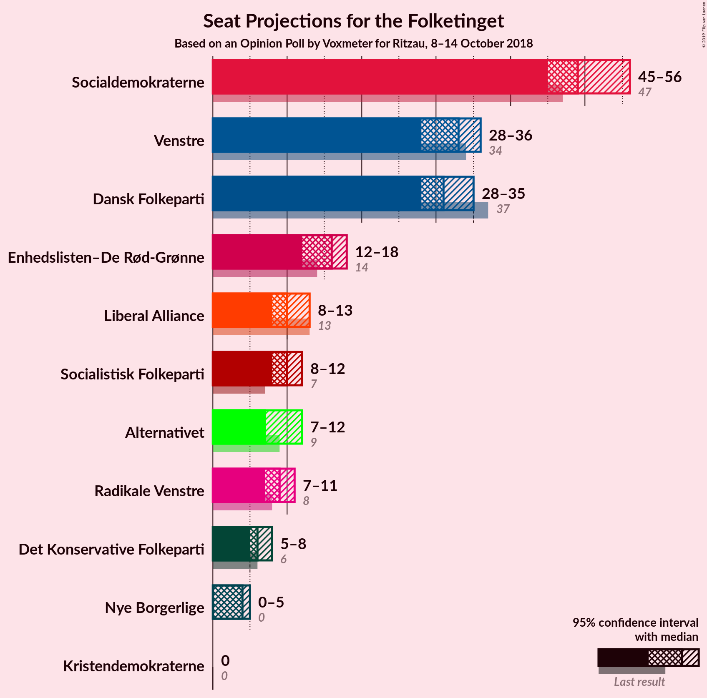
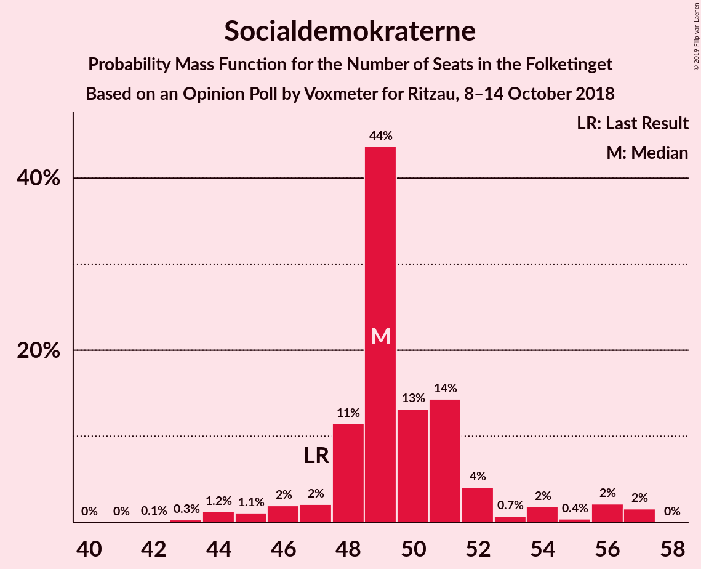

# Opinion Poll by Voxmeter for Ritzau, 8–14 October 2018

<a href="#voting-intentions">Voting Intentions</a> | <a href="#seats">Seats</a> | <a href="#coalitions">Coalitions</a> | <a href="#technical-information">Technical Information</a>

## Voting Intentions

### Confidence Intervals

| Party | Last Result | Poll Result | 80% Confidence Interval | 90% Confidence Interval | 95% Confidence Interval | 99% Confidence Interval |
|:-----:|:-----------:|:-----------:|:-----------------------:|:-----------------------:|:-----------------------:|:-----------------------:|
| Socialdemokraterne | 26.3% | 28.3% | 26.6–30.2% |26.1–30.7% |25.7–31.2% |24.8–32.1% |
| Venstre | 19.5% | 18.0% | 16.5–19.6% |16.1–20.1% |15.8–20.5% |15.1–21.3% |
| Dansk Folkeparti | 21.1% | 17.7% | 16.2–19.3% |15.8–19.8% |15.5–20.2% |14.8–21.0% |
| Enhedslisten–De Rød-Grønne | 7.8% | 8.5% | 7.4–9.7% |7.1–10.0% |6.9–10.3% |6.4–11.0% |
| Liberal Alliance | 7.5% | 5.7% | 4.9–6.8% |4.6–7.1% |4.4–7.3% |4.1–7.8% |
| Socialistisk Folkeparti | 4.2% | 5.3% | 4.5–6.3% |4.3–6.6% |4.1–6.9% |3.7–7.4% |
| Radikale Venstre | 4.6% | 5.0% | 4.2–6.0% |4.0–6.3% |3.8–6.6% |3.5–7.1% |
| Alternativet | 4.8% | 4.8% | 4.1–5.8% |3.8–6.1% |3.7–6.3% |3.3–6.8% |
| Det Konservative Folkeparti | 3.4% | 3.5% | 2.9–4.4% |2.7–4.6% |2.6–4.9% |2.3–5.3% |
| Nye Borgerlige | 0.0% | 2.0% | 1.5–2.7% |1.4–2.9% |1.3–3.0% |1.1–3.4% |
| Kristendemokraterne | 0.8% | 0.9% | 0.6–1.4% |0.5–1.5% |0.5–1.7% |0.4–2.0% |

*Note:* The poll result column reflects the actual value used in the calculations. Published results may vary slightly, and in addition be rounded to fewer digits.

## Seats

### Confidence Intervals

| Party | Last Result | Median | 80% Confidence Interval | 90% Confidence Interval | 95% Confidence Interval | 99% Confidence Interval |
|:-----:|:-----------:|:------:|:-----------------------:|:-----------------------:|:-----------------------:|:-----------------------:|
| <a href="#socialdemokraterne">Socialdemokraterne</a> | 47 | 49 | 48–51 |47–52 |46–56 |44–57 |
| <a href="#venstre">Venstre</a> | 34 | 31 | 31–35 |30–35 |28–35 |26–37 |
| <a href="#dansk-folkeparti">Dansk Folkeparti</a> | 37 | 30 | 29–34 |28–34 |28–34 |27–36 |
| <a href="#enhedslisten–de-rød-grønne">Enhedslisten–De Rød-Grønne</a> | 14 | 16 | 12–18 |12–18 |12–18 |12–19 |
| <a href="#liberal-alliance">Liberal Alliance</a> | 13 | 10 | 9–12 |9–12 |9–13 |8–15 |
| <a href="#socialistisk-folkeparti">Socialistisk Folkeparti</a> | 7 | 10 | 9–11 |8–11 |8–12 |7–13 |
| <a href="#radikale-venstre">Radikale Venstre</a> | 8 | 10 | 8–11 |7–11 |7–11 |7–12 |
| <a href="#alternativet">Alternativet</a> | 9 | 7 | 7–10 |7–11 |7–11 |6–12 |
| <a href="#det-konservative-folkeparti">Det Konservative Folkeparti</a> | 6 | 6 | 5–7 |5–8 |4–9 |4–10 |
| <a href="#nye-borgerlige">Nye Borgerlige</a> | 0 | 4 | 0–5 |0–5 |0–5 |0–6 |
| <a href="#kristendemokraterne">Kristendemokraterne</a> | 0 | 0 | 0 |0 |0 |0 |

### Socialdemokraterne

*For a full overview of the results for this party, see the [Socialdemokraterne](party-socialdemokraterne.html) page.*

| Number of Seats | Probability | Accumulated | Special Marks |
|:---------------:|:-----------:|:-----------:|:-------------:|
| 43 | 0.1% | 100% |  |
| 44 | 1.0% | 99.9% |  |
| 45 | 1.2% | 98.9% |  |
| 46 | 2% | 98% |  |
| 47 | 3% | 95% | Last Result |
| 48 | 17% | 92% |  |
| 49 | 48% | 75% | Median |
| 50 | 16% | 27% |  |
| 51 | 3% | 10% |  |
| 52 | 2% | 7% |  |
| 53 | 0.2% | 5% |  |
| 54 | 1.5% | 4% |  |
| 55 | 0.3% | 3% |  |
| 56 | 1.2% | 3% |  |
| 57 | 1.4% | 2% |  |
| 58 | 0% | 0.1% |  |
| 59 | 0% | 0% |  |

### Venstre

*For a full overview of the results for this party, see the [Venstre](party-venstre.html) page.*

| Number of Seats | Probability | Accumulated | Special Marks |
|:---------------:|:-----------:|:-----------:|:-------------:|
| 26 | 0.5% | 100% |  |
| 27 | 0.2% | 99.4% |  |
| 28 | 2% | 99.2% |  |
| 29 | 2% | 97% |  |
| 30 | 3% | 95% |  |
| 31 | 42% | 92% | Median |
| 32 | 11% | 50% |  |
| 33 | 3% | 39% |  |
| 34 | 24% | 36% | Last Result |
| 35 | 11% | 12% |  |
| 36 | 0.1% | 0.9% |  |
| 37 | 0.4% | 0.7% |  |
| 38 | 0.2% | 0.3% |  |
| 39 | 0% | 0.1% |  |
| 40 | 0.1% | 0.1% |  |
| 41 | 0% | 0% |  |

### Dansk Folkeparti

*For a full overview of the results for this party, see the [Dansk Folkeparti](party-danskfolkeparti.html) page.*

| Number of Seats | Probability | Accumulated | Special Marks |
|:---------------:|:-----------:|:-----------:|:-------------:|
| 25 | 0.1% | 100% |  |
| 26 | 0.3% | 99.9% |  |
| 27 | 0.4% | 99.7% |  |
| 28 | 7% | 99.3% |  |
| 29 | 3% | 92% |  |
| 30 | 42% | 89% | Median |
| 31 | 4% | 47% |  |
| 32 | 12% | 43% |  |
| 33 | 11% | 31% |  |
| 34 | 19% | 20% |  |
| 35 | 0.5% | 2% |  |
| 36 | 1.0% | 1.2% |  |
| 37 | 0.1% | 0.2% | Last Result |
| 38 | 0.1% | 0.1% |  |
| 39 | 0% | 0% |  |

### Enhedslisten–De Rød-Grønne

*For a full overview of the results for this party, see the [Enhedslisten–De Rød-Grønne](party-enhedslisten–derød-grønne.html) page.*

| Number of Seats | Probability | Accumulated | Special Marks |
|:---------------:|:-----------:|:-----------:|:-------------:|
| 11 | 0.2% | 100% |  |
| 12 | 10% | 99.8% |  |
| 13 | 19% | 90% |  |
| 14 | 8% | 70% | Last Result |
| 15 | 5% | 62% |  |
| 16 | 11% | 57% | Median |
| 17 | 4% | 46% |  |
| 18 | 41% | 42% |  |
| 19 | 0.6% | 1.0% |  |
| 20 | 0.2% | 0.4% |  |
| 21 | 0.2% | 0.2% |  |
| 22 | 0% | 0% |  |

### Liberal Alliance

*For a full overview of the results for this party, see the [Liberal Alliance](party-liberalalliance.html) page.*

| Number of Seats | Probability | Accumulated | Special Marks |
|:---------------:|:-----------:|:-----------:|:-------------:|
| 6 | 0.1% | 100% |  |
| 7 | 0.1% | 99.9% |  |
| 8 | 2% | 99.8% |  |
| 9 | 13% | 98% |  |
| 10 | 66% | 85% | Median |
| 11 | 6% | 19% |  |
| 12 | 9% | 13% |  |
| 13 | 2% | 4% | Last Result |
| 14 | 0.3% | 1.4% |  |
| 15 | 1.1% | 1.1% |  |
| 16 | 0% | 0% |  |

### Socialistisk Folkeparti

*For a full overview of the results for this party, see the [Socialistisk Folkeparti](party-socialistiskfolkeparti.html) page.*

| Number of Seats | Probability | Accumulated | Special Marks |
|:---------------:|:-----------:|:-----------:|:-------------:|
| 6 | 0.3% | 100% |  |
| 7 | 1.3% | 99.7% | Last Result |
| 8 | 5% | 98% |  |
| 9 | 14% | 93% |  |
| 10 | 58% | 79% | Median |
| 11 | 18% | 22% |  |
| 12 | 2% | 4% |  |
| 13 | 1.2% | 1.4% |  |
| 14 | 0.2% | 0.2% |  |
| 15 | 0% | 0% |  |

### Radikale Venstre

*For a full overview of the results for this party, see the [Radikale Venstre](party-radikalevenstre.html) page.*

| Number of Seats | Probability | Accumulated | Special Marks |
|:---------------:|:-----------:|:-----------:|:-------------:|
| 6 | 0.4% | 100% |  |
| 7 | 6% | 99.6% |  |
| 8 | 27% | 93% | Last Result |
| 9 | 9% | 66% |  |
| 10 | 46% | 57% | Median |
| 11 | 10% | 11% |  |
| 12 | 0.7% | 0.9% |  |
| 13 | 0.1% | 0.2% |  |
| 14 | 0% | 0% |  |

### Alternativet

*For a full overview of the results for this party, see the [Alternativet](party-alternativet.html) page.*

| Number of Seats | Probability | Accumulated | Special Marks |
|:---------------:|:-----------:|:-----------:|:-------------:|
| 5 | 0.1% | 100% |  |
| 6 | 1.0% | 99.9% |  |
| 7 | 58% | 99.0% | Median |
| 8 | 8% | 41% |  |
| 9 | 17% | 33% | Last Result |
| 10 | 7% | 16% |  |
| 11 | 9% | 9% |  |
| 12 | 0.6% | 0.7% |  |
| 13 | 0% | 0.1% |  |
| 14 | 0% | 0% |  |

### Det Konservative Folkeparti

*For a full overview of the results for this party, see the [Det Konservative Folkeparti](party-detkonservativefolkeparti.html) page.*

| Number of Seats | Probability | Accumulated | Special Marks |
|:---------------:|:-----------:|:-----------:|:-------------:|
| 4 | 3% | 100% |  |
| 5 | 12% | 97% |  |
| 6 | 69% | 86% | Last Result, Median |
| 7 | 10% | 16% |  |
| 8 | 3% | 6% |  |
| 9 | 2% | 3% |  |
| 10 | 0.6% | 0.6% |  |
| 11 | 0% | 0% |  |

### Nye Borgerlige

*For a full overview of the results for this party, see the [Nye Borgerlige](party-nyeborgerlige.html) page.*

| Number of Seats | Probability | Accumulated | Special Marks |
|:---------------:|:-----------:|:-----------:|:-------------:|
| 0 | 25% | 100% | Last Result |
| 1 | 0% | 75% |  |
| 2 | 0% | 75% |  |
| 3 | 0% | 75% |  |
| 4 | 63% | 75% | Median |
| 5 | 11% | 12% |  |
| 6 | 0.8% | 1.0% |  |
| 7 | 0.2% | 0.2% |  |
| 8 | 0% | 0% |  |

### Kristendemokraterne

*For a full overview of the results for this party, see the [Kristendemokraterne](party-kristendemokraterne.html) page.*

| Number of Seats | Probability | Accumulated | Special Marks |
|:---------------:|:-----------:|:-----------:|:-------------:|
| 0 | 99.8% | 100% | Last Result, Median |
| 1 | 0% | 0.2% |  |
| 2 | 0% | 0.2% |  |
| 3 | 0% | 0.2% |  |
| 4 | 0.2% | 0.2% |  |
| 5 | 0% | 0% |  |

## Coalitions

### Confidence Intervals

| Coalition | Last Result | Median | Majority? | 80% Confidence Interval | 90% Confidence Interval | 95% Confidence Interval | 99% Confidence Interval |
|:---------:|:-----------:|:------:|:---------:|:-----------------------:|:-----------------------:|:-----------------------:|:-----------------------:|
| Socialdemokraterne – Enhedslisten–De Rød-Grønne – Socialistisk Folkeparti – Radikale Venstre – Alternativet | 85 | 94 | 77% | 87–94 | 87–95 | 87–97 | 87–101 |
| Socialdemokraterne – Enhedslisten–De Rød-Grønne – Socialistisk Folkeparti – Alternativet | 77 | 84 | 1.0% | 79–84 | 79–87 | 79–88 | 77–92 |
| Venstre – Dansk Folkeparti – Liberal Alliance – Det Konservative Folkeparti – Nye Borgerlige – Kristendemokraterne | 90 | 81 | 0.2% | 81–88 | 80–88 | 78–88 | 74–88 |
| Venstre – Dansk Folkeparti – Liberal Alliance – Det Konservative Folkeparti – Nye Borgerlige | 90 | 81 | 0.2% | 81–88 | 80–88 | 78–88 | 74–88 |
| Socialdemokraterne – Enhedslisten–De Rød-Grønne – Socialistisk Folkeparti – Radikale Venstre | 76 | 84 | 1.4% | 80–87 | 80–87 | 80–87 | 78–93 |
| Venstre – Dansk Folkeparti – Liberal Alliance – Det Konservative Folkeparti – Kristendemokraterne | 90 | 79 | 0% | 77–84 | 77–84 | 76–85 | 74–86 |
| Venstre – Dansk Folkeparti – Liberal Alliance – Det Konservative Folkeparti | 90 | 79 | 0% | 77–84 | 77–84 | 76–85 | 74–86 |
| Socialdemokraterne – Enhedslisten–De Rød-Grønne – Socialistisk Folkeparti | 68 | 75 | 0% | 72–77 | 72–78 | 71–79 | 67–84 |
| Socialdemokraterne – Socialistisk Folkeparti – Radikale Venstre | 62 | 69 | 0% | 66–71 | 64–72 | 63–74 | 63–77 |
| Socialdemokraterne – Radikale Venstre | 55 | 59 | 0% | 56–61 | 54–62 | 54–64 | 54–65 |
| Venstre – Liberal Alliance – Det Konservative Folkeparti | 53 | 48 | 0% | 47–51 | 47–52 | 45–53 | 42–54 |
| Venstre – Det Konservative Folkeparti | 40 | 38 | 0% | 37–41 | 36–42 | 35–42 | 32–43 |
| Venstre | 34 | 31 | 0% | 31–35 | 30–35 | 28–35 | 26–37 |

### Socialdemokraterne – Enhedslisten–De Rød-Grønne – Socialistisk Folkeparti – Radikale Venstre – Alternativet

| Number of Seats | Probability | Accumulated | Special Marks |
|:---------------:|:-----------:|:-----------:|:-------------:|
| 84 | 0.1% | 100% |  |
| 85 | 0.2% | 99.9% | Last Result |
| 86 | 0.1% | 99.8% |  |
| 87 | 16% | 99.7% |  |
| 88 | 2% | 83% |  |
| 89 | 4% | 81% |  |
| 90 | 5% | 77% | Majority |
| 91 | 7% | 72% |  |
| 92 | 6% | 65% | Median |
| 93 | 2% | 59% |  |
| 94 | 52% | 57% |  |
| 95 | 0.4% | 5% |  |
| 96 | 1.0% | 5% |  |
| 97 | 2% | 4% |  |
| 98 | 0.6% | 2% |  |
| 99 | 0.7% | 1.3% |  |
| 100 | 0% | 0.6% |  |
| 101 | 0.6% | 0.6% |  |
| 102 | 0% | 0.1% |  |
| 103 | 0% | 0% |  |

### Socialdemokraterne – Enhedslisten–De Rød-Grønne – Socialistisk Folkeparti – Alternativet

| Number of Seats | Probability | Accumulated | Special Marks |
|:---------------:|:-----------:|:-----------:|:-------------:|
| 74 | 0% | 100% |  |
| 75 | 0% | 99.9% |  |
| 76 | 0.1% | 99.9% |  |
| 77 | 0.9% | 99.8% | Last Result |
| 78 | 0.2% | 98.9% |  |
| 79 | 19% | 98.7% |  |
| 80 | 1.4% | 80% |  |
| 81 | 3% | 78% |  |
| 82 | 7% | 75% | Median |
| 83 | 13% | 68% |  |
| 84 | 47% | 55% |  |
| 85 | 1.2% | 9% |  |
| 86 | 1.4% | 8% |  |
| 87 | 3% | 6% |  |
| 88 | 1.1% | 3% |  |
| 89 | 0.9% | 2% |  |
| 90 | 0.2% | 1.0% | Majority |
| 91 | 0.2% | 0.8% |  |
| 92 | 0.5% | 0.6% |  |
| 93 | 0% | 0.1% |  |
| 94 | 0% | 0% |  |

### Venstre – Dansk Folkeparti – Liberal Alliance – Det Konservative Folkeparti – Nye Borgerlige – Kristendemokraterne

| Number of Seats | Probability | Accumulated | Special Marks |
|:---------------:|:-----------:|:-----------:|:-------------:|
| 73 | 0% | 100% |  |
| 74 | 0.6% | 99.9% |  |
| 75 | 0% | 99.4% |  |
| 76 | 0.7% | 99.4% |  |
| 77 | 0.6% | 98.7% |  |
| 78 | 2% | 98% |  |
| 79 | 1.0% | 96% |  |
| 80 | 0.4% | 95% |  |
| 81 | 52% | 95% | Median |
| 82 | 2% | 43% |  |
| 83 | 6% | 41% |  |
| 84 | 7% | 35% |  |
| 85 | 5% | 28% |  |
| 86 | 4% | 23% |  |
| 87 | 2% | 19% |  |
| 88 | 16% | 17% |  |
| 89 | 0.1% | 0.3% |  |
| 90 | 0.2% | 0.2% | Last Result, Majority |
| 91 | 0.1% | 0.1% |  |
| 92 | 0% | 0% |  |

### Venstre – Dansk Folkeparti – Liberal Alliance – Det Konservative Folkeparti – Nye Borgerlige

| Number of Seats | Probability | Accumulated | Special Marks |
|:---------------:|:-----------:|:-----------:|:-------------:|
| 73 | 0% | 100% |  |
| 74 | 0.6% | 99.9% |  |
| 75 | 0% | 99.4% |  |
| 76 | 0.7% | 99.3% |  |
| 77 | 0.6% | 98.6% |  |
| 78 | 2% | 98% |  |
| 79 | 1.0% | 96% |  |
| 80 | 0.5% | 95% |  |
| 81 | 52% | 95% | Median |
| 82 | 2% | 43% |  |
| 83 | 6% | 41% |  |
| 84 | 7% | 35% |  |
| 85 | 5% | 28% |  |
| 86 | 4% | 23% |  |
| 87 | 2% | 19% |  |
| 88 | 16% | 17% |  |
| 89 | 0.1% | 0.3% |  |
| 90 | 0.2% | 0.2% | Last Result, Majority |
| 91 | 0.1% | 0.1% |  |
| 92 | 0% | 0% |  |

### Socialdemokraterne – Enhedslisten–De Rød-Grønne – Socialistisk Folkeparti – Radikale Venstre

| Number of Seats | Probability | Accumulated | Special Marks |
|:---------------:|:-----------:|:-----------:|:-------------:|
| 76 | 0.1% | 100% | Last Result |
| 77 | 0.1% | 99.9% |  |
| 78 | 1.0% | 99.8% |  |
| 79 | 0.3% | 98.7% |  |
| 80 | 24% | 98% |  |
| 81 | 1.2% | 75% |  |
| 82 | 8% | 74% |  |
| 83 | 14% | 66% |  |
| 84 | 3% | 52% |  |
| 85 | 2% | 50% | Median |
| 86 | 4% | 48% |  |
| 87 | 41% | 44% |  |
| 88 | 0.6% | 2% |  |
| 89 | 0.5% | 2% |  |
| 90 | 0.6% | 1.4% | Majority |
| 91 | 0.2% | 0.8% |  |
| 92 | 0% | 0.6% |  |
| 93 | 0.5% | 0.6% |  |
| 94 | 0% | 0% |  |

### Venstre – Dansk Folkeparti – Liberal Alliance – Det Konservative Folkeparti – Kristendemokraterne

| Number of Seats | Probability | Accumulated | Special Marks |
|:---------------:|:-----------:|:-----------:|:-------------:|
| 72 | 0% | 100% |  |
| 73 | 0.3% | 99.9% |  |
| 74 | 1.0% | 99.6% |  |
| 75 | 0.2% | 98.6% |  |
| 76 | 2% | 98% |  |
| 77 | 41% | 97% | Median |
| 78 | 2% | 56% |  |
| 79 | 6% | 54% |  |
| 80 | 4% | 47% |  |
| 81 | 12% | 43% |  |
| 82 | 3% | 31% |  |
| 83 | 8% | 28% |  |
| 84 | 17% | 20% |  |
| 85 | 0.7% | 3% |  |
| 86 | 2% | 2% |  |
| 87 | 0% | 0.2% |  |
| 88 | 0.1% | 0.1% |  |
| 89 | 0% | 0% |  |
| 90 | 0% | 0% | Last Result, Majority |

### Venstre – Dansk Folkeparti – Liberal Alliance – Det Konservative Folkeparti

| Number of Seats | Probability | Accumulated | Special Marks |
|:---------------:|:-----------:|:-----------:|:-------------:|
| 72 | 0% | 100% |  |
| 73 | 0.3% | 99.9% |  |
| 74 | 1.0% | 99.6% |  |
| 75 | 0.2% | 98.6% |  |
| 76 | 2% | 98% |  |
| 77 | 41% | 97% | Median |
| 78 | 2% | 56% |  |
| 79 | 6% | 54% |  |
| 80 | 4% | 47% |  |
| 81 | 12% | 43% |  |
| 82 | 3% | 31% |  |
| 83 | 8% | 28% |  |
| 84 | 17% | 20% |  |
| 85 | 0.7% | 3% |  |
| 86 | 2% | 2% |  |
| 87 | 0% | 0.2% |  |
| 88 | 0.1% | 0.1% |  |
| 89 | 0% | 0% |  |
| 90 | 0% | 0% | Last Result, Majority |

### Socialdemokraterne – Enhedslisten–De Rød-Grønne – Socialistisk Folkeparti

| Number of Seats | Probability | Accumulated | Special Marks |
|:---------------:|:-----------:|:-----------:|:-------------:|
| 65 | 0.1% | 100% |  |
| 66 | 0% | 99.9% |  |
| 67 | 0.8% | 99.9% |  |
| 68 | 0.1% | 99.1% | Last Result |
| 69 | 0.2% | 99.0% |  |
| 70 | 1.3% | 98.8% |  |
| 71 | 0.5% | 98% |  |
| 72 | 29% | 97% |  |
| 73 | 10% | 68% |  |
| 74 | 2% | 58% |  |
| 75 | 7% | 56% | Median |
| 76 | 2% | 49% |  |
| 77 | 42% | 47% |  |
| 78 | 0.7% | 5% |  |
| 79 | 3% | 5% |  |
| 80 | 0.7% | 2% |  |
| 81 | 0.2% | 0.9% |  |
| 82 | 0.1% | 0.7% |  |
| 83 | 0.1% | 0.6% |  |
| 84 | 0.5% | 0.5% |  |
| 85 | 0% | 0.1% |  |
| 86 | 0% | 0% |  |

### Socialdemokraterne – Socialistisk Folkeparti – Radikale Venstre

| Number of Seats | Probability | Accumulated | Special Marks |
|:---------------:|:-----------:|:-----------:|:-------------:|
| 61 | 0% | 100% |  |
| 62 | 0.1% | 99.9% | Last Result |
| 63 | 4% | 99.9% |  |
| 64 | 3% | 96% |  |
| 65 | 2% | 92% |  |
| 66 | 2% | 91% |  |
| 67 | 22% | 89% |  |
| 68 | 9% | 67% |  |
| 69 | 41% | 58% | Median |
| 70 | 2% | 18% |  |
| 71 | 8% | 16% |  |
| 72 | 3% | 8% |  |
| 73 | 2% | 5% |  |
| 74 | 2% | 3% |  |
| 75 | 0.2% | 0.9% |  |
| 76 | 0.1% | 0.7% |  |
| 77 | 0.5% | 0.6% |  |
| 78 | 0% | 0% |  |

### Socialdemokraterne – Radikale Venstre

| Number of Seats | Probability | Accumulated | Special Marks |
|:---------------:|:-----------:|:-----------:|:-------------:|
| 51 | 0% | 100% |  |
| 52 | 0.1% | 99.9% |  |
| 53 | 0.1% | 99.9% |  |
| 54 | 5% | 99.8% |  |
| 55 | 2% | 95% | Last Result |
| 56 | 18% | 92% |  |
| 57 | 7% | 74% |  |
| 58 | 2% | 67% |  |
| 59 | 46% | 65% | Median |
| 60 | 2% | 19% |  |
| 61 | 10% | 17% |  |
| 62 | 3% | 7% |  |
| 63 | 0.5% | 4% |  |
| 64 | 3% | 4% |  |
| 65 | 0.6% | 1.0% |  |
| 66 | 0.3% | 0.4% |  |
| 67 | 0.1% | 0.1% |  |
| 68 | 0% | 0.1% |  |
| 69 | 0% | 0% |  |

### Venstre – Liberal Alliance – Det Konservative Folkeparti

| Number of Seats | Probability | Accumulated | Special Marks |
|:---------------:|:-----------:|:-----------:|:-------------:|
| 41 | 0.3% | 100% |  |
| 42 | 0.3% | 99.6% |  |
| 43 | 0.3% | 99.4% |  |
| 44 | 1.3% | 99.1% |  |
| 45 | 1.1% | 98% |  |
| 46 | 2% | 97% |  |
| 47 | 41% | 95% | Median |
| 48 | 10% | 54% |  |
| 49 | 6% | 43% |  |
| 50 | 18% | 37% |  |
| 51 | 13% | 19% |  |
| 52 | 3% | 6% |  |
| 53 | 2% | 3% | Last Result |
| 54 | 0.2% | 0.5% |  |
| 55 | 0.1% | 0.3% |  |
| 56 | 0.1% | 0.2% |  |
| 57 | 0% | 0% |  |

### Venstre – Det Konservative Folkeparti

| Number of Seats | Probability | Accumulated | Special Marks |
|:---------------:|:-----------:|:-----------:|:-------------:|
| 31 | 0% | 100% |  |
| 32 | 0.5% | 99.9% |  |
| 33 | 0.4% | 99.5% |  |
| 34 | 0.9% | 99.1% |  |
| 35 | 1.2% | 98% |  |
| 36 | 5% | 97% |  |
| 37 | 41% | 92% | Median |
| 38 | 9% | 51% |  |
| 39 | 11% | 42% |  |
| 40 | 20% | 31% | Last Result |
| 41 | 2% | 10% |  |
| 42 | 8% | 8% |  |
| 43 | 0.4% | 0.7% |  |
| 44 | 0.2% | 0.3% |  |
| 45 | 0% | 0.1% |  |
| 46 | 0.1% | 0.1% |  |
| 47 | 0% | 0% |  |

### Venstre

| Number of Seats | Probability | Accumulated | Special Marks |
|:---------------:|:-----------:|:-----------:|:-------------:|
| 26 | 0.5% | 100% |  |
| 27 | 0.2% | 99.4% |  |
| 28 | 2% | 99.2% |  |
| 29 | 2% | 97% |  |
| 30 | 3% | 95% |  |
| 31 | 42% | 92% | Median |
| 32 | 11% | 50% |  |
| 33 | 3% | 39% |  |
| 34 | 24% | 36% | Last Result |
| 35 | 11% | 12% |  |
| 36 | 0.1% | 0.9% |  |
| 37 | 0.4% | 0.7% |  |
| 38 | 0.2% | 0.3% |  |
| 39 | 0% | 0.1% |  |
| 40 | 0.1% | 0.1% |  |
| 41 | 0% | 0% |  |

## Technical Information

### Opinion Poll

+ **Polling firm:** Voxmeter
+ **Commissioner(s):** Ritzau
+ **Fieldwork period:** 8–14 October 2018

### Calculations

+ **Sample size:** 1016
+ **Simulations done:** 524,288
+ **Error estimate:** 3.35%

