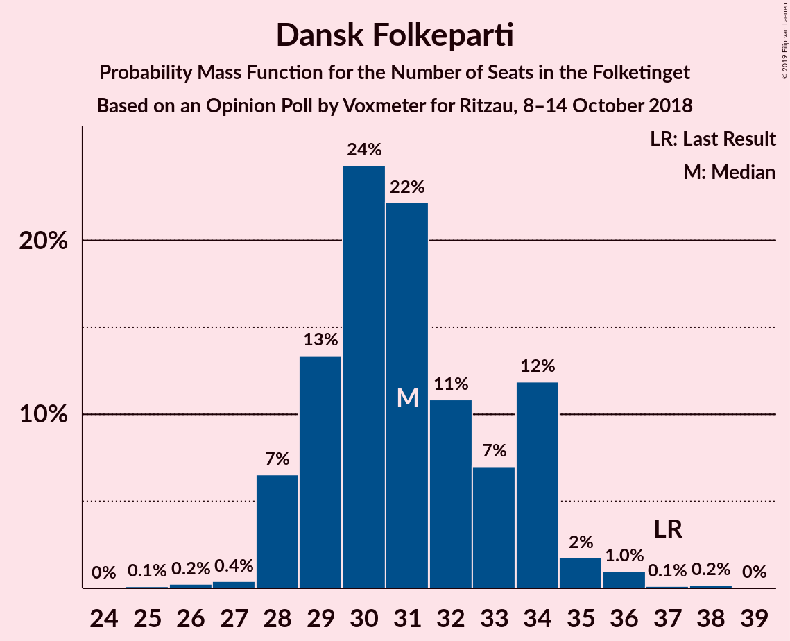
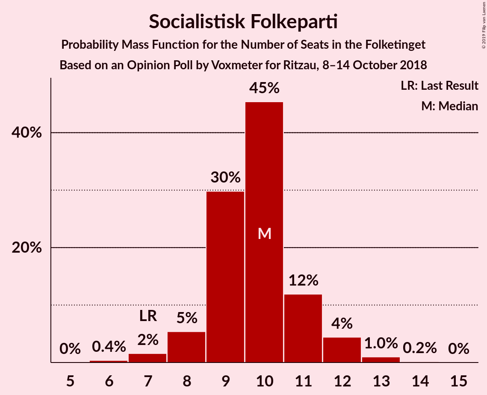
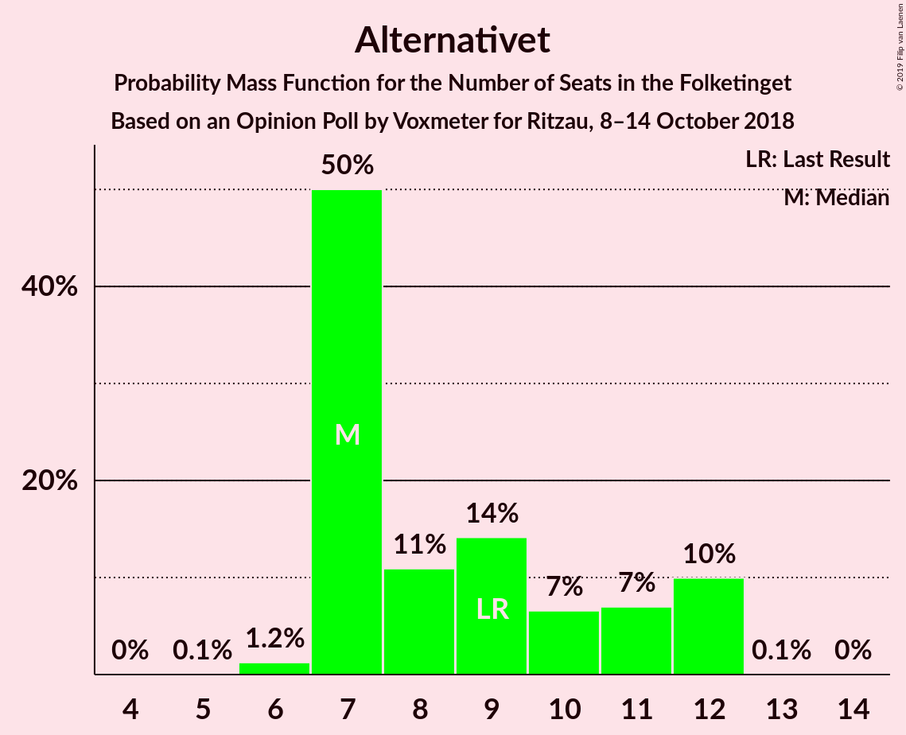
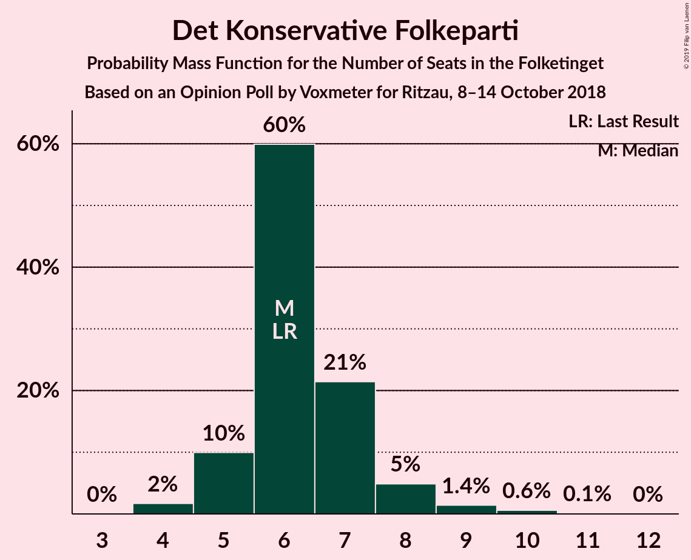

# Opinion Poll by Voxmeter for Ritzau, 8–14 October 2018

<a href="#voting-intentions">Voting Intentions</a> | <a href="#seats">Seats</a> | <a href="#coalitions">Coalitions</a> | <a href="#technical-information">Technical Information</a>

## Voting Intentions

### Confidence Intervals

| Party | Last Result | Poll Result | 80% Confidence Interval | 90% Confidence Interval | 95% Confidence Interval | 99% Confidence Interval |
|:-----:|:-----------:|:-----------:|:-----------------------:|:-----------------------:|:-----------------------:|:-----------------------:|
| Socialdemokraterne | 26.3% | 28.3% | 26.6–30.2% |26.1–30.7% |25.7–31.2% |24.8–32.1% |
| Venstre | 19.5% | 18.0% | 16.5–19.6% |16.1–20.1% |15.8–20.5% |15.1–21.3% |
| Dansk Folkeparti | 21.1% | 17.7% | 16.2–19.3% |15.8–19.8% |15.5–20.2% |14.8–21.0% |
| Enhedslisten–De Rød-Grønne | 7.8% | 8.5% | 7.4–9.7% |7.1–10.0% |6.9–10.3% |6.4–11.0% |
| Liberal Alliance | 7.5% | 5.7% | 4.9–6.8% |4.6–7.1% |4.4–7.3% |4.1–7.8% |
| Socialistisk Folkeparti | 4.2% | 5.3% | 4.5–6.3% |4.3–6.6% |4.1–6.9% |3.7–7.4% |
| Radikale Venstre | 4.6% | 5.0% | 4.2–6.0% |4.0–6.3% |3.8–6.6% |3.5–7.1% |
| Alternativet | 4.8% | 4.8% | 4.1–5.8% |3.8–6.1% |3.7–6.3% |3.3–6.8% |
| Det Konservative Folkeparti | 3.4% | 3.5% | 2.9–4.4% |2.7–4.6% |2.6–4.9% |2.3–5.3% |
| Nye Borgerlige | 0.0% | 2.0% | 1.5–2.7% |1.4–2.9% |1.3–3.0% |1.1–3.4% |
| Kristendemokraterne | 0.8% | 0.9% | 0.6–1.4% |0.5–1.5% |0.5–1.7% |0.4–2.0% |

*Note:* The poll result column reflects the actual value used in the calculations. Published results may vary slightly, and in addition be rounded to fewer digits.

## Seats

### Confidence Intervals

| Party | Last Result | Median | 80% Confidence Interval | 90% Confidence Interval | 95% Confidence Interval | 99% Confidence Interval |
|:-----:|:-----------:|:------:|:-----------------------:|:-----------------------:|:-----------------------:|:-----------------------:|
| <a href="#socialdemokraterne">Socialdemokraterne</a> | 47 | 49 | 49 |49 |49 |46–49 |
| <a href="#venstre">Venstre</a> | 34 | 32 | 32 |32 |32 |26–34 |
| <a href="#dansk-folkeparti">Dansk Folkeparti</a> | 37 | 31 | 31 |31 |31 |28–40 |
| <a href="#enhedslisten–de-rød-grønne">Enhedslisten–De Rød-Grønne</a> | 14 | 17 | 17 |17 |17 |15–18 |
| <a href="#liberal-alliance">Liberal Alliance</a> | 13 | 12 | 12 |12 |12 |9–12 |
| <a href="#socialistisk-folkeparti">Socialistisk Folkeparti</a> | 7 | 11 | 11 |11 |11 |9–11 |
| <a href="#radikale-venstre">Radikale Venstre</a> | 8 | 9 | 9 |9 |9 |7–11 |
| <a href="#alternativet">Alternativet</a> | 9 | 9 | 9 |9 |9 |8–9 |
| <a href="#det-konservative-folkeparti">Det Konservative Folkeparti</a> | 6 | 5 | 5 |5 |5–7 |5–9 |
| <a href="#nye-borgerlige">Nye Borgerlige</a> | 0 | 0 | 0 |0 |0 |0 |
| <a href="#kristendemokraterne">Kristendemokraterne</a> | 0 | 0 | 0 |0 |0 |0 |

### Socialdemokraterne

*For a full overview of the results for this party, see the [Socialdemokraterne](party-socialdemokraterne.html) page.*

| Number of Seats | Probability | Accumulated | Special Marks |
|:---------------:|:-----------:|:-----------:|:-------------:|
| 43 | 0.1% | 100% |  |
| 44 | 0% | 99.9% |  |
| 45 | 0% | 99.9% |  |
| 46 | 1.5% | 99.9% |  |
| 47 | 0% | 98% | Last Result |
| 48 | 0% | 98% |  |
| 49 | 98% | 98% | Median |
| 50 | 0% | 0.4% |  |
| 51 | 0% | 0.4% |  |
| 52 | 0% | 0.4% |  |
| 53 | 0% | 0.4% |  |
| 54 | 0.1% | 0.4% |  |
| 55 | 0% | 0.3% |  |
| 56 | 0% | 0.3% |  |
| 57 | 0% | 0.3% |  |
| 58 | 0.3% | 0.3% |  |
| 59 | 0% | 0% |  |

### Venstre

*For a full overview of the results for this party, see the [Venstre](party-venstre.html) page.*

| Number of Seats | Probability | Accumulated | Special Marks |
|:---------------:|:-----------:|:-----------:|:-------------:|
| 26 | 1.2% | 100% |  |
| 27 | 0% | 98.8% |  |
| 28 | 0.3% | 98.8% |  |
| 29 | 0% | 98% |  |
| 30 | 0% | 98% |  |
| 31 | 0% | 98% |  |
| 32 | 97% | 98% | Median |
| 33 | 0% | 2% |  |
| 34 | 1.5% | 2% | Last Result |
| 35 | 0% | 0.1% |  |
| 36 | 0.1% | 0.1% |  |
| 37 | 0% | 0% |  |

### Dansk Folkeparti

*For a full overview of the results for this party, see the [Dansk Folkeparti](party-danskfolkeparti.html) page.*

| Number of Seats | Probability | Accumulated | Special Marks |
|:---------------:|:-----------:|:-----------:|:-------------:|
| 27 | 0.3% | 100% |  |
| 28 | 1.5% | 99.7% |  |
| 29 | 0% | 98% |  |
| 30 | 0% | 98% |  |
| 31 | 97% | 98% | Median |
| 32 | 0.1% | 1.4% |  |
| 33 | 0% | 1.4% |  |
| 34 | 0% | 1.3% |  |
| 35 | 0% | 1.3% |  |
| 36 | 0% | 1.3% |  |
| 37 | 0.1% | 1.3% | Last Result |
| 38 | 0% | 1.2% |  |
| 39 | 0% | 1.2% |  |
| 40 | 1.2% | 1.2% |  |
| 41 | 0% | 0% |  |

### Enhedslisten–De Rød-Grønne

*For a full overview of the results for this party, see the [Enhedslisten–De Rød-Grønne](party-enhedslisten–derød-grønne.html) page.*

| Number of Seats | Probability | Accumulated | Special Marks |
|:---------------:|:-----------:|:-----------:|:-------------:|
| 12 | 0.3% | 100% |  |
| 13 | 0% | 99.7% |  |
| 14 | 0.1% | 99.6% | Last Result |
| 15 | 0.1% | 99.6% |  |
| 16 | 0% | 99.5% |  |
| 17 | 98% | 99.5% | Median |
| 18 | 1.5% | 1.5% |  |
| 19 | 0% | 0% |  |

### Liberal Alliance

*For a full overview of the results for this party, see the [Liberal Alliance](party-liberalalliance.html) page.*

| Number of Seats | Probability | Accumulated | Special Marks |
|:---------------:|:-----------:|:-----------:|:-------------:|
| 7 | 0.1% | 100% |  |
| 8 | 0.3% | 99.9% |  |
| 9 | 1.5% | 99.6% |  |
| 10 | 0% | 98% |  |
| 11 | 0% | 98% |  |
| 12 | 98% | 98% | Median |
| 13 | 0.1% | 0.1% | Last Result |
| 14 | 0% | 0% |  |

### Socialistisk Folkeparti

*For a full overview of the results for this party, see the [Socialistisk Folkeparti](party-socialistiskfolkeparti.html) page.*

| Number of Seats | Probability | Accumulated | Special Marks |
|:---------------:|:-----------:|:-----------:|:-------------:|
| 7 | 0% | 100% | Last Result |
| 8 | 0% | 100% |  |
| 9 | 1.3% | 100% |  |
| 10 | 0% | 98.7% |  |
| 11 | 98% | 98.7% | Median |
| 12 | 0.3% | 0.4% |  |
| 13 | 0% | 0% |  |

### Radikale Venstre

*For a full overview of the results for this party, see the [Radikale Venstre](party-radikalevenstre.html) page.*

| Number of Seats | Probability | Accumulated | Special Marks |
|:---------------:|:-----------:|:-----------:|:-------------:|
| 6 | 0.1% | 100% |  |
| 7 | 1.2% | 99.9% |  |
| 8 | 0% | 98.7% | Last Result |
| 9 | 97% | 98.7% | Median |
| 10 | 0% | 2% |  |
| 11 | 2% | 2% |  |
| 12 | 0% | 0% |  |

### Alternativet

*For a full overview of the results for this party, see the [Alternativet](party-alternativet.html) page.*

| Number of Seats | Probability | Accumulated | Special Marks |
|:---------------:|:-----------:|:-----------:|:-------------:|
| 8 | 1.3% | 100% |  |
| 9 | 98.7% | 98.7% | Last Result, Median |
| 10 | 0% | 0% |  |

### Det Konservative Folkeparti

*For a full overview of the results for this party, see the [Det Konservative Folkeparti](party-detkonservativefolkeparti.html) page.*

| Number of Seats | Probability | Accumulated | Special Marks |
|:---------------:|:-----------:|:-----------:|:-------------:|
| 0 | 0.1% | 100% |  |
| 1 | 0% | 99.9% |  |
| 2 | 0% | 99.9% |  |
| 3 | 0% | 99.9% |  |
| 4 | 0% | 99.9% |  |
| 5 | 97% | 99.9% | Median |
| 6 | 0.1% | 3% | Last Result |
| 7 | 2% | 3% |  |
| 8 | 0% | 1.5% |  |
| 9 | 1.5% | 1.5% |  |
| 10 | 0% | 0% |  |

### Nye Borgerlige

*For a full overview of the results for this party, see the [Nye Borgerlige](party-nyeborgerlige.html) page.*

| Number of Seats | Probability | Accumulated | Special Marks |
|:---------------:|:-----------:|:-----------:|:-------------:|
| 0 | 99.6% | 100% | Last Result, Median |
| 1 | 0% | 0.4% |  |
| 2 | 0% | 0.4% |  |
| 3 | 0% | 0.4% |  |
| 4 | 0% | 0.4% |  |
| 5 | 0.3% | 0.4% |  |
| 6 | 0% | 0.1% |  |
| 7 | 0.1% | 0.1% |  |
| 8 | 0% | 0% |  |

### Kristendemokraterne

*For a full overview of the results for this party, see the [Kristendemokraterne](party-kristendemokraterne.html) page.*

| Number of Seats | Probability | Accumulated | Special Marks |
|:---------------:|:-----------:|:-----------:|:-------------:|
| 0 | 100% | 100% | Last Result, Median |

## Coalitions

### Confidence Intervals

| Coalition | Last Result | Median | Majority? | 80% Confidence Interval | 90% Confidence Interval | 95% Confidence Interval | 99% Confidence Interval |
|:---------:|:-----------:|:------:|:---------:|:-----------------------:|:-----------------------:|:-----------------------:|:-----------------------:|
| Socialdemokraterne – Enhedslisten–De Rød-Grønne – Socialistisk Folkeparti – Radikale Venstre – Alternativet | 85 | 95 | 99.9% | 95 | 95 | 95 | 90–95 |
| Socialdemokraterne – Enhedslisten–De Rød-Grønne – Socialistisk Folkeparti – Radikale Venstre | 76 | 86 | 0.3% | 86 | 86 | 86 | 82–86 |
| Venstre – Dansk Folkeparti – Liberal Alliance – Det Konservative Folkeparti – Nye Borgerlige – Kristendemokraterne | 90 | 80 | 0% | 80 | 80 | 80 | 80–85 |
| Venstre – Dansk Folkeparti – Liberal Alliance – Det Konservative Folkeparti – Kristendemokraterne | 90 | 80 | 0% | 80 | 80 | 80 | 80–85 |
| Venstre – Dansk Folkeparti – Liberal Alliance – Det Konservative Folkeparti – Nye Borgerlige | 90 | 80 | 0% | 80 | 80 | 80 | 80–85 |
| Venstre – Dansk Folkeparti – Liberal Alliance – Det Konservative Folkeparti | 90 | 80 | 0% | 80 | 80 | 80 | 80–85 |

### Socialdemokraterne – Enhedslisten–De Rød-Grønne – Socialistisk Folkeparti – Radikale Venstre – Alternativet

| Number of Seats | Probability | Accumulated | Special Marks |
|:---------------:|:-----------:|:-----------:|:-------------:|
| 85 | 0% | 100% | Last Result |
| 86 | 0% | 100% |  |
| 87 | 0% | 100% |  |
| 88 | 0% | 100% |  |
| 89 | 0.1% | 100% |  |
| 90 | 1.3% | 99.9% | Majority |
| 91 | 0.1% | 98.6% |  |
| 92 | 0% | 98.6% |  |
| 93 | 0% | 98.6% |  |
| 94 | 0% | 98.6% |  |
| 95 | 98% | 98.6% | Median |
| 96 | 0% | 0.3% |  |
| 97 | 0% | 0.3% |  |
| 98 | 0% | 0.3% |  |
| 99 | 0% | 0.3% |  |
| 100 | 0.3% | 0.3% |  |
| 101 | 0% | 0% |  |

### Socialdemokraterne – Enhedslisten–De Rød-Grønne – Socialistisk Folkeparti – Radikale Venstre

| Number of Seats | Probability | Accumulated | Special Marks |
|:---------------:|:-----------:|:-----------:|:-------------:|
| 76 | 0% | 100% | Last Result |
| 77 | 0% | 100% |  |
| 78 | 0% | 100% |  |
| 79 | 0% | 100% |  |
| 80 | 0.1% | 100% |  |
| 81 | 0% | 99.9% |  |
| 82 | 1.2% | 99.9% |  |
| 83 | 0.1% | 98.6% |  |
| 84 | 0% | 98.6% |  |
| 85 | 0% | 98.6% |  |
| 86 | 98% | 98.6% | Median |
| 87 | 0% | 0.3% |  |
| 88 | 0% | 0.3% |  |
| 89 | 0% | 0.3% |  |
| 90 | 0% | 0.3% | Majority |
| 91 | 0.3% | 0.3% |  |
| 92 | 0% | 0% |  |

### Venstre – Dansk Folkeparti – Liberal Alliance – Det Konservative Folkeparti – Nye Borgerlige – Kristendemokraterne

| Number of Seats | Probability | Accumulated | Special Marks |
|:---------------:|:-----------:|:-----------:|:-------------:|
| 75 | 0.3% | 100% |  |
| 76 | 0% | 99.7% |  |
| 77 | 0% | 99.7% |  |
| 78 | 0% | 99.7% |  |
| 79 | 0% | 99.7% |  |
| 80 | 98% | 99.7% | Median |
| 81 | 0% | 1.4% |  |
| 82 | 0% | 1.4% |  |
| 83 | 0% | 1.4% |  |
| 84 | 0.1% | 1.4% |  |
| 85 | 1.3% | 1.4% |  |
| 86 | 0.1% | 0.1% |  |
| 87 | 0% | 0% |  |
| 88 | 0% | 0% |  |
| 89 | 0% | 0% |  |
| 90 | 0% | 0% | Last Result, Majority |

### Venstre – Dansk Folkeparti – Liberal Alliance – Det Konservative Folkeparti – Kristendemokraterne

| Number of Seats | Probability | Accumulated | Special Marks |
|:---------------:|:-----------:|:-----------:|:-------------:|
| 70 | 0.3% | 100% |  |
| 71 | 0% | 99.7% |  |
| 72 | 0% | 99.7% |  |
| 73 | 0% | 99.7% |  |
| 74 | 0% | 99.7% |  |
| 75 | 0% | 99.7% |  |
| 76 | 0% | 99.7% |  |
| 77 | 0.1% | 99.7% |  |
| 78 | 0% | 99.6% |  |
| 79 | 0% | 99.6% |  |
| 80 | 98% | 99.6% | Median |
| 81 | 0% | 1.4% |  |
| 82 | 0% | 1.4% |  |
| 83 | 0% | 1.4% |  |
| 84 | 0% | 1.3% |  |
| 85 | 1.3% | 1.3% |  |
| 86 | 0.1% | 0.1% |  |
| 87 | 0% | 0% |  |
| 88 | 0% | 0% |  |
| 89 | 0% | 0% |  |
| 90 | 0% | 0% | Last Result, Majority |

### Venstre – Dansk Folkeparti – Liberal Alliance – Det Konservative Folkeparti – Nye Borgerlige

| Number of Seats | Probability | Accumulated | Special Marks |
|:---------------:|:-----------:|:-----------:|:-------------:|
| 75 | 0.3% | 100% |  |
| 76 | 0% | 99.7% |  |
| 77 | 0% | 99.7% |  |
| 78 | 0% | 99.7% |  |
| 79 | 0% | 99.7% |  |
| 80 | 98% | 99.7% | Median |
| 81 | 0% | 1.4% |  |
| 82 | 0% | 1.4% |  |
| 83 | 0% | 1.4% |  |
| 84 | 0.1% | 1.4% |  |
| 85 | 1.3% | 1.4% |  |
| 86 | 0.1% | 0.1% |  |
| 87 | 0% | 0% |  |
| 88 | 0% | 0% |  |
| 89 | 0% | 0% |  |
| 90 | 0% | 0% | Last Result, Majority |

### Venstre – Dansk Folkeparti – Liberal Alliance – Det Konservative Folkeparti

| Number of Seats | Probability | Accumulated | Special Marks |
|:---------------:|:-----------:|:-----------:|:-------------:|
| 70 | 0.3% | 100% |  |
| 71 | 0% | 99.7% |  |
| 72 | 0% | 99.7% |  |
| 73 | 0% | 99.7% |  |
| 74 | 0% | 99.7% |  |
| 75 | 0% | 99.7% |  |
| 76 | 0% | 99.7% |  |
| 77 | 0.1% | 99.7% |  |
| 78 | 0% | 99.6% |  |
| 79 | 0% | 99.6% |  |
| 80 | 98% | 99.6% | Median |
| 81 | 0% | 1.4% |  |
| 82 | 0% | 1.4% |  |
| 83 | 0% | 1.4% |  |
| 84 | 0% | 1.3% |  |
| 85 | 1.3% | 1.3% |  |
| 86 | 0.1% | 0.1% |  |
| 87 | 0% | 0% |  |
| 88 | 0% | 0% |  |
| 89 | 0% | 0% |  |
| 90 | 0% | 0% | Last Result, Majority |

## Technical Information

### Opinion Poll

+ **Polling firm:** Voxmeter
+ **Commissioner(s):** Ritzau
+ **Fieldwork period:** 8–14 October 2018

### Calculations

+ **Sample size:** 1016
+ **Simulations done:** 1,024
+ **Error estimate:** 2.12%

