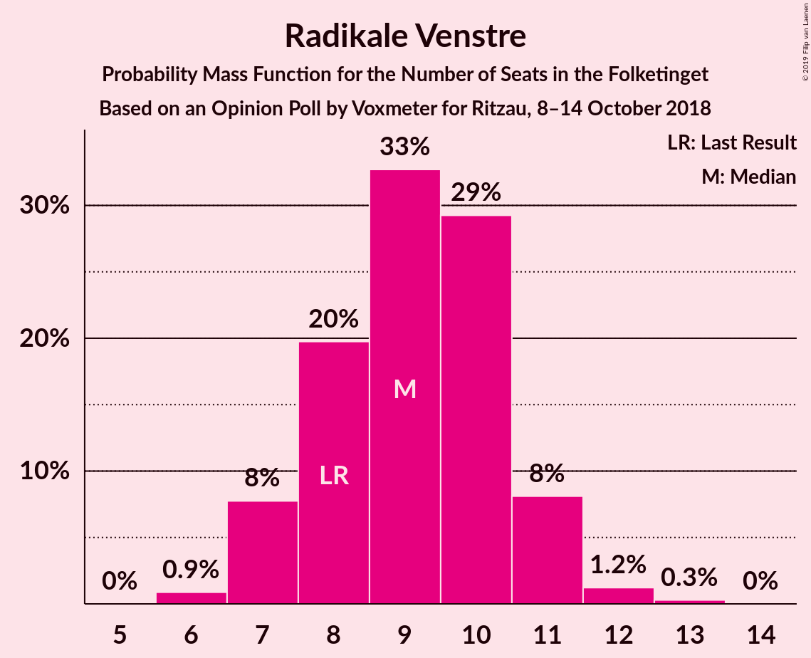
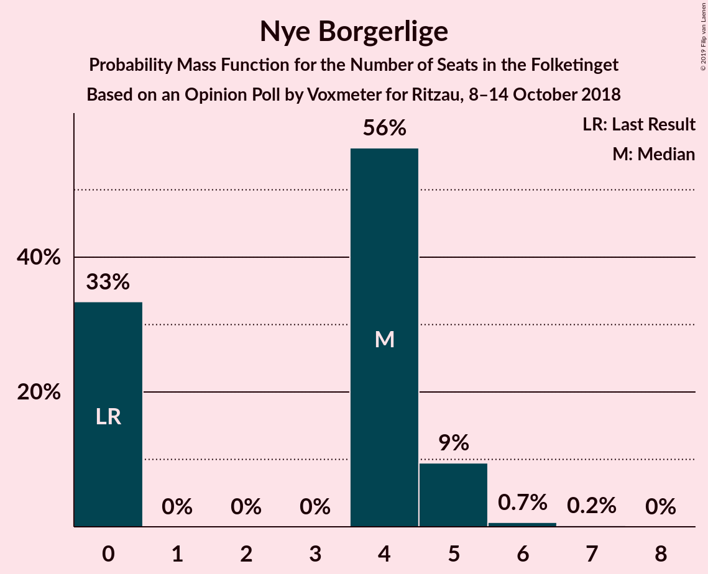

# Opinion Poll by Voxmeter for Ritzau, 8–14 October 2018

<a href="#voting-intentions">Voting Intentions</a> | <a href="#seats">Seats</a> | <a href="#coalitions">Coalitions</a> | <a href="#technical-information">Technical Information</a>

## Voting Intentions

### Confidence Intervals

| Party | Last Result | Poll Result | 80% Confidence Interval | 90% Confidence Interval | 95% Confidence Interval | 99% Confidence Interval |
|:-----:|:-----------:|:-----------:|:-----------------------:|:-----------------------:|:-----------------------:|:-----------------------:|
| Socialdemokraterne | 26.3% | 28.3% | 26.6–30.2% |26.1–30.7% |25.7–31.2% |24.8–32.1% |
| Venstre | 19.5% | 18.0% | 16.5–19.6% |16.1–20.1% |15.8–20.5% |15.1–21.3% |
| Dansk Folkeparti | 21.1% | 17.7% | 16.2–19.3% |15.8–19.8% |15.5–20.2% |14.8–21.0% |
| Enhedslisten–De Rød-Grønne | 7.8% | 8.5% | 7.4–9.7% |7.1–10.0% |6.9–10.3% |6.4–11.0% |
| Liberal Alliance | 7.5% | 5.7% | 4.9–6.8% |4.6–7.1% |4.4–7.3% |4.1–7.8% |
| Socialistisk Folkeparti | 4.2% | 5.3% | 4.5–6.3% |4.3–6.6% |4.1–6.9% |3.7–7.4% |
| Radikale Venstre | 4.6% | 5.0% | 4.2–6.0% |4.0–6.3% |3.8–6.6% |3.5–7.1% |
| Alternativet | 4.8% | 4.8% | 4.1–5.8% |3.8–6.1% |3.7–6.3% |3.3–6.8% |
| Det Konservative Folkeparti | 3.4% | 3.5% | 2.9–4.4% |2.7–4.6% |2.6–4.9% |2.3–5.3% |
| Nye Borgerlige | 0.0% | 2.0% | 1.5–2.7% |1.4–2.9% |1.3–3.0% |1.1–3.4% |
| Kristendemokraterne | 0.8% | 0.9% | 0.6–1.4% |0.5–1.5% |0.5–1.7% |0.4–2.0% |

*Note:* The poll result column reflects the actual value used in the calculations. Published results may vary slightly, and in addition be rounded to fewer digits.

## Seats

### Confidence Intervals

| Party | Last Result | Median | 80% Confidence Interval | 90% Confidence Interval | 95% Confidence Interval | 99% Confidence Interval |
|:-----:|:-----------:|:------:|:-----------------------:|:-----------------------:|:-----------------------:|:-----------------------:|
| <a href="#socialdemokraterne">Socialdemokraterne</a> | 47 | 49 | 48–52 |47–54 |45–56 |44–57 |
| <a href="#venstre">Venstre</a> | 34 | 33 | 31–34 |30–35 |28–36 |27–37 |
| <a href="#dansk-folkeparti">Dansk Folkeparti</a> | 37 | 31 | 29–34 |28–34 |28–35 |27–36 |
| <a href="#enhedslisten–de-rød-grønne">Enhedslisten–De Rød-Grønne</a> | 14 | 16 | 13–18 |12–18 |12–18 |11–19 |
| <a href="#liberal-alliance">Liberal Alliance</a> | 13 | 10 | 9–12 |8–13 |8–13 |8–15 |
| <a href="#socialistisk-folkeparti">Socialistisk Folkeparti</a> | 7 | 10 | 9–11 |8–12 |8–12 |7–13 |
| <a href="#radikale-venstre">Radikale Venstre</a> | 8 | 9 | 8–10 |7–11 |7–11 |6–12 |
| <a href="#alternativet">Alternativet</a> | 9 | 7 | 7–12 |7–12 |7–12 |6–12 |
| <a href="#det-konservative-folkeparti">Det Konservative Folkeparti</a> | 6 | 6 | 5–7 |5–8 |5–8 |4–10 |
| <a href="#nye-borgerlige">Nye Borgerlige</a> | 0 | 4 | 0–5 |0–5 |0–5 |0–6 |
| <a href="#kristendemokraterne">Kristendemokraterne</a> | 0 | 0 | 0 |0 |0 |0 |

### Socialdemokraterne

*For a full overview of the results for this party, see the [Socialdemokraterne](party-socialdemokraterne.html) page.*

| Number of Seats | Probability | Accumulated | Special Marks |
|:---------------:|:-----------:|:-----------:|:-------------:|
| 42 | 0.1% | 100% |  |
| 43 | 0.3% | 99.9% |  |
| 44 | 1.2% | 99.6% |  |
| 45 | 1.1% | 98% |  |
| 46 | 2% | 97% |  |
| 47 | 2% | 95% | Last Result |
| 48 | 11% | 93% |  |
| 49 | 44% | 82% | Median |
| 50 | 13% | 38% |  |
| 51 | 14% | 25% |  |
| 52 | 4% | 11% |  |
| 53 | 0.7% | 7% |  |
| 54 | 2% | 6% |  |
| 55 | 0.4% | 4% |  |
| 56 | 2% | 4% |  |
| 57 | 2% | 2% |  |
| 58 | 0% | 0% |  |

### Venstre

*For a full overview of the results for this party, see the [Venstre](party-venstre.html) page.*

| Number of Seats | Probability | Accumulated | Special Marks |
|:---------------:|:-----------:|:-----------:|:-------------:|
| 24 | 0.1% | 100% |  |
| 25 | 0% | 99.9% |  |
| 26 | 0.4% | 99.9% |  |
| 27 | 0.5% | 99.5% |  |
| 28 | 2% | 99.0% |  |
| 29 | 2% | 97% |  |
| 30 | 6% | 96% |  |
| 31 | 27% | 90% |  |
| 32 | 8% | 63% |  |
| 33 | 29% | 55% | Median |
| 34 | 15% | 25% | Last Result |
| 35 | 6% | 10% |  |
| 36 | 1.2% | 3% |  |
| 37 | 2% | 2% |  |
| 38 | 0.1% | 0.2% |  |
| 39 | 0% | 0.1% |  |
| 40 | 0.1% | 0.1% |  |
| 41 | 0% | 0% |  |

### Dansk Folkeparti

*For a full overview of the results for this party, see the [Dansk Folkeparti](party-danskfolkeparti.html) page.*

| Number of Seats | Probability | Accumulated | Special Marks |
|:---------------:|:-----------:|:-----------:|:-------------:|
| 25 | 0.1% | 100% |  |
| 26 | 0.2% | 99.9% |  |
| 27 | 0.4% | 99.6% |  |
| 28 | 7% | 99.2% |  |
| 29 | 13% | 93% |  |
| 30 | 24% | 79% |  |
| 31 | 22% | 55% | Median |
| 32 | 11% | 33% |  |
| 33 | 7% | 22% |  |
| 34 | 12% | 15% |  |
| 35 | 2% | 3% |  |
| 36 | 1.0% | 1.3% |  |
| 37 | 0.1% | 0.3% | Last Result |
| 38 | 0.2% | 0.2% |  |
| 39 | 0% | 0% |  |

### Enhedslisten–De Rød-Grønne

*For a full overview of the results for this party, see the [Enhedslisten–De Rød-Grønne](party-enhedslisten–derød-grønne.html) page.*

| Number of Seats | Probability | Accumulated | Special Marks |
|:---------------:|:-----------:|:-----------:|:-------------:|
| 10 | 0.1% | 100% |  |
| 11 | 1.0% | 99.9% |  |
| 12 | 7% | 99.0% |  |
| 13 | 15% | 92% |  |
| 14 | 17% | 77% | Last Result |
| 15 | 7% | 60% |  |
| 16 | 9% | 53% | Median |
| 17 | 18% | 44% |  |
| 18 | 25% | 26% |  |
| 19 | 0.5% | 0.8% |  |
| 20 | 0.1% | 0.3% |  |
| 21 | 0.2% | 0.2% |  |
| 22 | 0% | 0% |  |

### Liberal Alliance

*For a full overview of the results for this party, see the [Liberal Alliance](party-liberalalliance.html) page.*

| Number of Seats | Probability | Accumulated | Special Marks |
|:---------------:|:-----------:|:-----------:|:-------------:|
| 6 | 0.1% | 100% |  |
| 7 | 0.2% | 99.9% |  |
| 8 | 5% | 99.8% |  |
| 9 | 13% | 95% |  |
| 10 | 62% | 82% | Median |
| 11 | 7% | 20% |  |
| 12 | 8% | 13% |  |
| 13 | 4% | 5% | Last Result |
| 14 | 0.2% | 0.9% |  |
| 15 | 0.7% | 0.7% |  |
| 16 | 0% | 0% |  |

### Socialistisk Folkeparti

*For a full overview of the results for this party, see the [Socialistisk Folkeparti](party-socialistiskfolkeparti.html) page.*

| Number of Seats | Probability | Accumulated | Special Marks |
|:---------------:|:-----------:|:-----------:|:-------------:|
| 6 | 0.4% | 100% |  |
| 7 | 2% | 99.6% | Last Result |
| 8 | 5% | 98% |  |
| 9 | 30% | 93% |  |
| 10 | 45% | 63% | Median |
| 11 | 12% | 17% |  |
| 12 | 4% | 6% |  |
| 13 | 1.0% | 1.2% |  |
| 14 | 0.2% | 0.2% |  |
| 15 | 0% | 0% |  |

### Radikale Venstre

*For a full overview of the results for this party, see the [Radikale Venstre](party-radikalevenstre.html) page.*

| Number of Seats | Probability | Accumulated | Special Marks |
|:---------------:|:-----------:|:-----------:|:-------------:|
| 6 | 0.9% | 100% |  |
| 7 | 8% | 99.1% |  |
| 8 | 20% | 91% | Last Result |
| 9 | 33% | 72% | Median |
| 10 | 29% | 39% |  |
| 11 | 8% | 10% |  |
| 12 | 1.2% | 2% |  |
| 13 | 0.3% | 0.3% |  |
| 14 | 0% | 0% |  |

### Alternativet

*For a full overview of the results for this party, see the [Alternativet](party-alternativet.html) page.*

| Number of Seats | Probability | Accumulated | Special Marks |
|:---------------:|:-----------:|:-----------:|:-------------:|
| 5 | 0.1% | 100% |  |
| 6 | 1.2% | 99.9% |  |
| 7 | 50% | 98.7% | Median |
| 8 | 11% | 49% |  |
| 9 | 14% | 38% | Last Result |
| 10 | 7% | 24% |  |
| 11 | 7% | 17% |  |
| 12 | 10% | 10% |  |
| 13 | 0.1% | 0.1% |  |
| 14 | 0% | 0% |  |

### Det Konservative Folkeparti

*For a full overview of the results for this party, see the [Det Konservative Folkeparti](party-detkonservativefolkeparti.html) page.*

| Number of Seats | Probability | Accumulated | Special Marks |
|:---------------:|:-----------:|:-----------:|:-------------:|
| 4 | 2% | 100% |  |
| 5 | 10% | 98% |  |
| 6 | 60% | 88% | Last Result, Median |
| 7 | 21% | 28% |  |
| 8 | 5% | 7% |  |
| 9 | 1.4% | 2% |  |
| 10 | 0.6% | 0.7% |  |
| 11 | 0.1% | 0.1% |  |
| 12 | 0% | 0% |  |

### Nye Borgerlige

*For a full overview of the results for this party, see the [Nye Borgerlige](party-nyeborgerlige.html) page.*

| Number of Seats | Probability | Accumulated | Special Marks |
|:---------------:|:-----------:|:-----------:|:-------------:|
| 0 | 33% | 100% | Last Result |
| 1 | 0% | 67% |  |
| 2 | 0% | 67% |  |
| 3 | 0% | 67% |  |
| 4 | 56% | 67% | Median |
| 5 | 9% | 10% |  |
| 6 | 0.7% | 0.9% |  |
| 7 | 0.2% | 0.2% |  |
| 8 | 0% | 0% |  |

### Kristendemokraterne

*For a full overview of the results for this party, see the [Kristendemokraterne](party-kristendemokraterne.html) page.*

| Number of Seats | Probability | Accumulated | Special Marks |
|:---------------:|:-----------:|:-----------:|:-------------:|
| 0 | 99.8% | 100% | Last Result, Median |
| 1 | 0% | 0.2% |  |
| 2 | 0% | 0.2% |  |
| 3 | 0% | 0.2% |  |
| 4 | 0.2% | 0.2% |  |
| 5 | 0% | 0% |  |

## Coalitions

### Confidence Intervals

| Coalition | Last Result | Median | Majority? | 80% Confidence Interval | 90% Confidence Interval | 95% Confidence Interval | 99% Confidence Interval |
|:---------:|:-----------:|:------:|:---------:|:-----------------------:|:-----------------------:|:-----------------------:|:-----------------------:|
| Socialdemokraterne – Enhedslisten–De Rød-Grønne – Socialistisk Folkeparti – Radikale Venstre – Alternativet | 85 | 94 | 85% | 87–96 | 87–96 | 87–98 | 86–100 |
| Socialdemokraterne – Enhedslisten–De Rød-Grønne – Socialistisk Folkeparti – Radikale Venstre | 76 | 84 | 2% | 80–87 | 80–87 | 79–89 | 77–91 |
| Socialdemokraterne – Enhedslisten–De Rød-Grønne – Socialistisk Folkeparti – Alternativet | 77 | 84 | 2% | 79–87 | 79–87 | 79–88 | 77–91 |
| Venstre – Dansk Folkeparti – Liberal Alliance – Det Konservative Folkeparti – Nye Borgerlige – Kristendemokraterne | 90 | 81 | 0.2% | 79–88 | 79–88 | 77–88 | 75–89 |
| Venstre – Dansk Folkeparti – Liberal Alliance – Det Konservative Folkeparti – Nye Borgerlige | 90 | 81 | 0.2% | 79–88 | 79–88 | 77–88 | 75–89 |
| Venstre – Dansk Folkeparti – Liberal Alliance – Det Konservative Folkeparti – Kristendemokraterne | 90 | 80 | 0% | 77–84 | 77–84 | 75–85 | 74–88 |
| Venstre – Dansk Folkeparti – Liberal Alliance – Det Konservative Folkeparti | 90 | 80 | 0% | 77–84 | 76–84 | 75–85 | 74–87 |
| Socialdemokraterne – Enhedslisten–De Rød-Grønne – Socialistisk Folkeparti | 68 | 75 | 0% | 72–77 | 72–79 | 70–80 | 67–83 |
| Socialdemokraterne – Socialistisk Folkeparti – Radikale Venstre | 62 | 69 | 0% | 66–72 | 64–73 | 63–74 | 61–76 |
| Socialdemokraterne – Radikale Venstre | 55 | 59 | 0% | 56–61 | 55–63 | 54–64 | 53–66 |
| Venstre – Liberal Alliance – Det Konservative Folkeparti | 53 | 49 | 0% | 46–51 | 46–53 | 45–54 | 42–55 |
| Venstre – Det Konservative Folkeparti | 40 | 39 | 0% | 37–41 | 36–42 | 35–42 | 32–44 |
| Venstre | 34 | 33 | 0% | 31–34 | 30–35 | 28–36 | 27–37 |

### Socialdemokraterne – Enhedslisten–De Rød-Grønne – Socialistisk Folkeparti – Radikale Venstre – Alternativet

| Number of Seats | Probability | Accumulated | Special Marks |
|:---------------:|:-----------:|:-----------:|:-------------:|
| 84 | 0.1% | 100% |  |
| 85 | 0.1% | 99.9% | Last Result |
| 86 | 0.7% | 99.8% |  |
| 87 | 10% | 99.1% |  |
| 88 | 2% | 90% |  |
| 89 | 3% | 87% |  |
| 90 | 7% | 85% | Majority |
| 91 | 20% | 77% | Median |
| 92 | 5% | 58% |  |
| 93 | 2% | 52% |  |
| 94 | 32% | 50% |  |
| 95 | 3% | 18% |  |
| 96 | 11% | 15% |  |
| 97 | 2% | 5% |  |
| 98 | 1.5% | 3% |  |
| 99 | 0.6% | 1.1% |  |
| 100 | 0.1% | 0.5% |  |
| 101 | 0.3% | 0.4% |  |
| 102 | 0.1% | 0.1% |  |
| 103 | 0% | 0% |  |

### Socialdemokraterne – Enhedslisten–De Rød-Grønne – Socialistisk Folkeparti – Radikale Venstre

| Number of Seats | Probability | Accumulated | Special Marks |
|:---------------:|:-----------:|:-----------:|:-------------:|
| 75 | 0% | 100% |  |
| 76 | 0.1% | 99.9% | Last Result |
| 77 | 0.9% | 99.9% |  |
| 78 | 1.0% | 99.0% |  |
| 79 | 0.9% | 98% |  |
| 80 | 14% | 97% |  |
| 81 | 2% | 83% |  |
| 82 | 9% | 81% |  |
| 83 | 10% | 72% |  |
| 84 | 25% | 62% | Median |
| 85 | 4% | 37% |  |
| 86 | 3% | 33% |  |
| 87 | 25% | 30% |  |
| 88 | 1.2% | 5% |  |
| 89 | 2% | 4% |  |
| 90 | 1.5% | 2% | Majority |
| 91 | 0.2% | 0.7% |  |
| 92 | 0.1% | 0.4% |  |
| 93 | 0.3% | 0.4% |  |
| 94 | 0% | 0% |  |

### Socialdemokraterne – Enhedslisten–De Rød-Grønne – Socialistisk Folkeparti – Alternativet

| Number of Seats | Probability | Accumulated | Special Marks |
|:---------------:|:-----------:|:-----------:|:-------------:|
| 74 | 0% | 100% |  |
| 75 | 0.1% | 99.9% |  |
| 76 | 0.1% | 99.9% |  |
| 77 | 1.3% | 99.7% | Last Result |
| 78 | 0.4% | 98% |  |
| 79 | 12% | 98% |  |
| 80 | 1.0% | 86% |  |
| 81 | 2% | 85% |  |
| 82 | 22% | 83% | Median |
| 83 | 11% | 61% |  |
| 84 | 28% | 51% |  |
| 85 | 5% | 23% |  |
| 86 | 2% | 18% |  |
| 87 | 12% | 16% |  |
| 88 | 2% | 4% |  |
| 89 | 0.7% | 2% |  |
| 90 | 1.1% | 2% | Majority |
| 91 | 0.2% | 0.6% |  |
| 92 | 0.4% | 0.5% |  |
| 93 | 0% | 0.1% |  |
| 94 | 0% | 0% |  |

### Venstre – Dansk Folkeparti – Liberal Alliance – Det Konservative Folkeparti – Nye Borgerlige – Kristendemokraterne

| Number of Seats | Probability | Accumulated | Special Marks |
|:---------------:|:-----------:|:-----------:|:-------------:|
| 73 | 0.1% | 100% |  |
| 74 | 0.3% | 99.9% |  |
| 75 | 0.1% | 99.6% |  |
| 76 | 0.6% | 99.5% |  |
| 77 | 1.5% | 98.9% |  |
| 78 | 2% | 97% |  |
| 79 | 11% | 95% |  |
| 80 | 3% | 85% |  |
| 81 | 32% | 82% |  |
| 82 | 2% | 50% |  |
| 83 | 5% | 48% |  |
| 84 | 20% | 42% | Median |
| 85 | 7% | 23% |  |
| 86 | 3% | 15% |  |
| 87 | 2% | 13% |  |
| 88 | 10% | 10% |  |
| 89 | 0.7% | 0.9% |  |
| 90 | 0.1% | 0.2% | Last Result, Majority |
| 91 | 0.1% | 0.1% |  |
| 92 | 0% | 0% |  |

### Venstre – Dansk Folkeparti – Liberal Alliance – Det Konservative Folkeparti – Nye Borgerlige

| Number of Seats | Probability | Accumulated | Special Marks |
|:---------------:|:-----------:|:-----------:|:-------------:|
| 73 | 0.1% | 100% |  |
| 74 | 0.3% | 99.9% |  |
| 75 | 0.1% | 99.6% |  |
| 76 | 0.6% | 99.5% |  |
| 77 | 1.5% | 98.9% |  |
| 78 | 2% | 97% |  |
| 79 | 11% | 95% |  |
| 80 | 3% | 85% |  |
| 81 | 32% | 82% |  |
| 82 | 2% | 50% |  |
| 83 | 5% | 47% |  |
| 84 | 20% | 42% | Median |
| 85 | 7% | 23% |  |
| 86 | 3% | 15% |  |
| 87 | 2% | 13% |  |
| 88 | 10% | 10% |  |
| 89 | 0.7% | 0.9% |  |
| 90 | 0.1% | 0.2% | Last Result, Majority |
| 91 | 0.1% | 0.1% |  |
| 92 | 0% | 0% |  |

### Venstre – Dansk Folkeparti – Liberal Alliance – Det Konservative Folkeparti – Kristendemokraterne

| Number of Seats | Probability | Accumulated | Special Marks |
|:---------------:|:-----------:|:-----------:|:-------------:|
| 71 | 0% | 100% |  |
| 72 | 0.1% | 99.9% |  |
| 73 | 0.3% | 99.8% |  |
| 74 | 1.0% | 99.5% |  |
| 75 | 2% | 98.5% |  |
| 76 | 1.4% | 96% |  |
| 77 | 25% | 95% |  |
| 78 | 2% | 70% |  |
| 79 | 15% | 68% |  |
| 80 | 19% | 53% | Median |
| 81 | 10% | 34% |  |
| 82 | 3% | 24% |  |
| 83 | 6% | 21% |  |
| 84 | 10% | 15% |  |
| 85 | 3% | 5% |  |
| 86 | 1.1% | 2% |  |
| 87 | 0.4% | 0.9% |  |
| 88 | 0.1% | 0.5% |  |
| 89 | 0.4% | 0.4% |  |
| 90 | 0% | 0% | Last Result, Majority |

### Venstre – Dansk Folkeparti – Liberal Alliance – Det Konservative Folkeparti

| Number of Seats | Probability | Accumulated | Special Marks |
|:---------------:|:-----------:|:-----------:|:-------------:|
| 71 | 0% | 100% |  |
| 72 | 0.1% | 99.9% |  |
| 73 | 0.3% | 99.8% |  |
| 74 | 1.1% | 99.5% |  |
| 75 | 2% | 98% |  |
| 76 | 1.4% | 96% |  |
| 77 | 25% | 95% |  |
| 78 | 2% | 69% |  |
| 79 | 15% | 67% |  |
| 80 | 19% | 52% | Median |
| 81 | 10% | 34% |  |
| 82 | 3% | 24% |  |
| 83 | 6% | 21% |  |
| 84 | 10% | 15% |  |
| 85 | 3% | 5% |  |
| 86 | 1.1% | 2% |  |
| 87 | 0.4% | 0.9% |  |
| 88 | 0.1% | 0.5% |  |
| 89 | 0.4% | 0.4% |  |
| 90 | 0% | 0% | Last Result, Majority |

### Socialdemokraterne – Enhedslisten–De Rød-Grønne – Socialistisk Folkeparti

| Number of Seats | Probability | Accumulated | Special Marks |
|:---------------:|:-----------:|:-----------:|:-------------:|
| 65 | 0.1% | 100% |  |
| 66 | 0% | 99.9% |  |
| 67 | 0.7% | 99.9% |  |
| 68 | 0.7% | 99.2% | Last Result |
| 69 | 0.9% | 98.5% |  |
| 70 | 1.2% | 98% |  |
| 71 | 0.7% | 96% |  |
| 72 | 17% | 96% |  |
| 73 | 7% | 78% |  |
| 74 | 6% | 72% |  |
| 75 | 30% | 66% | Median |
| 76 | 3% | 36% |  |
| 77 | 27% | 33% |  |
| 78 | 0.5% | 6% |  |
| 79 | 2% | 6% |  |
| 80 | 1.3% | 3% |  |
| 81 | 0.2% | 2% |  |
| 82 | 1.3% | 2% |  |
| 83 | 0.2% | 0.5% |  |
| 84 | 0.3% | 0.4% |  |
| 85 | 0% | 0.1% |  |
| 86 | 0% | 0% |  |

### Socialdemokraterne – Socialistisk Folkeparti – Radikale Venstre

| Number of Seats | Probability | Accumulated | Special Marks |
|:---------------:|:-----------:|:-----------:|:-------------:|
| 61 | 0.6% | 100% |  |
| 62 | 0.1% | 99.4% | Last Result |
| 63 | 3% | 99.3% |  |
| 64 | 2% | 96% |  |
| 65 | 1.3% | 94% |  |
| 66 | 3% | 93% |  |
| 67 | 29% | 90% |  |
| 68 | 7% | 61% | Median |
| 69 | 27% | 54% |  |
| 70 | 11% | 27% |  |
| 71 | 6% | 16% |  |
| 72 | 5% | 10% |  |
| 73 | 2% | 6% |  |
| 74 | 2% | 4% |  |
| 75 | 2% | 2% |  |
| 76 | 0.2% | 0.6% |  |
| 77 | 0.4% | 0.4% |  |
| 78 | 0% | 0% |  |

### Socialdemokraterne – Radikale Venstre

| Number of Seats | Probability | Accumulated | Special Marks |
|:---------------:|:-----------:|:-----------:|:-------------:|
| 51 | 0% | 100% |  |
| 52 | 0.3% | 99.9% |  |
| 53 | 0.7% | 99.7% |  |
| 54 | 3% | 99.0% |  |
| 55 | 3% | 96% | Last Result |
| 56 | 11% | 93% |  |
| 57 | 7% | 82% |  |
| 58 | 16% | 75% | Median |
| 59 | 28% | 58% |  |
| 60 | 14% | 30% |  |
| 61 | 7% | 17% |  |
| 62 | 2% | 9% |  |
| 63 | 3% | 7% |  |
| 64 | 3% | 5% |  |
| 65 | 0.5% | 2% |  |
| 66 | 2% | 2% |  |
| 67 | 0.1% | 0.1% |  |
| 68 | 0% | 0% |  |

### Venstre – Liberal Alliance – Det Konservative Folkeparti

| Number of Seats | Probability | Accumulated | Special Marks |
|:---------------:|:-----------:|:-----------:|:-------------:|
| 41 | 0.3% | 100% |  |
| 42 | 0.2% | 99.7% |  |
| 43 | 0.4% | 99.4% |  |
| 44 | 0.8% | 99.1% |  |
| 45 | 3% | 98% |  |
| 46 | 5% | 95% |  |
| 47 | 24% | 90% |  |
| 48 | 8% | 66% |  |
| 49 | 20% | 57% | Median |
| 50 | 21% | 38% |  |
| 51 | 8% | 17% |  |
| 52 | 2% | 9% |  |
| 53 | 3% | 7% | Last Result |
| 54 | 3% | 4% |  |
| 55 | 0.4% | 0.6% |  |
| 56 | 0.1% | 0.2% |  |
| 57 | 0% | 0.1% |  |
| 58 | 0% | 0% |  |

### Venstre – Det Konservative Folkeparti

| Number of Seats | Probability | Accumulated | Special Marks |
|:---------------:|:-----------:|:-----------:|:-------------:|
| 30 | 0.1% | 100% |  |
| 31 | 0% | 99.9% |  |
| 32 | 0.5% | 99.9% |  |
| 33 | 0.3% | 99.4% |  |
| 34 | 0.8% | 99.1% |  |
| 35 | 2% | 98% |  |
| 36 | 4% | 96% |  |
| 37 | 27% | 92% |  |
| 38 | 8% | 65% |  |
| 39 | 24% | 57% | Median |
| 40 | 22% | 34% | Last Result |
| 41 | 4% | 12% |  |
| 42 | 6% | 8% |  |
| 43 | 0.4% | 2% |  |
| 44 | 1.4% | 2% |  |
| 45 | 0.2% | 0.2% |  |
| 46 | 0.1% | 0.1% |  |
| 47 | 0% | 0% |  |

### Venstre

| Number of Seats | Probability | Accumulated | Special Marks |
|:---------------:|:-----------:|:-----------:|:-------------:|
| 24 | 0.1% | 100% |  |
| 25 | 0% | 99.9% |  |
| 26 | 0.4% | 99.9% |  |
| 27 | 0.5% | 99.5% |  |
| 28 | 2% | 99.0% |  |
| 29 | 2% | 97% |  |
| 30 | 6% | 96% |  |
| 31 | 27% | 90% |  |
| 32 | 8% | 63% |  |
| 33 | 29% | 55% | Median |
| 34 | 15% | 25% | Last Result |
| 35 | 6% | 10% |  |
| 36 | 1.2% | 3% |  |
| 37 | 2% | 2% |  |
| 38 | 0.1% | 0.2% |  |
| 39 | 0% | 0.1% |  |
| 40 | 0.1% | 0.1% |  |
| 41 | 0% | 0% |  |

## Technical Information

### Opinion Poll

+ **Polling firm:** Voxmeter
+ **Commissioner(s):** Ritzau
+ **Fieldwork period:** 8–14 October 2018

### Calculations

+ **Sample size:** 1016
+ **Simulations done:** 1,048,576
+ **Error estimate:** 0.85%

