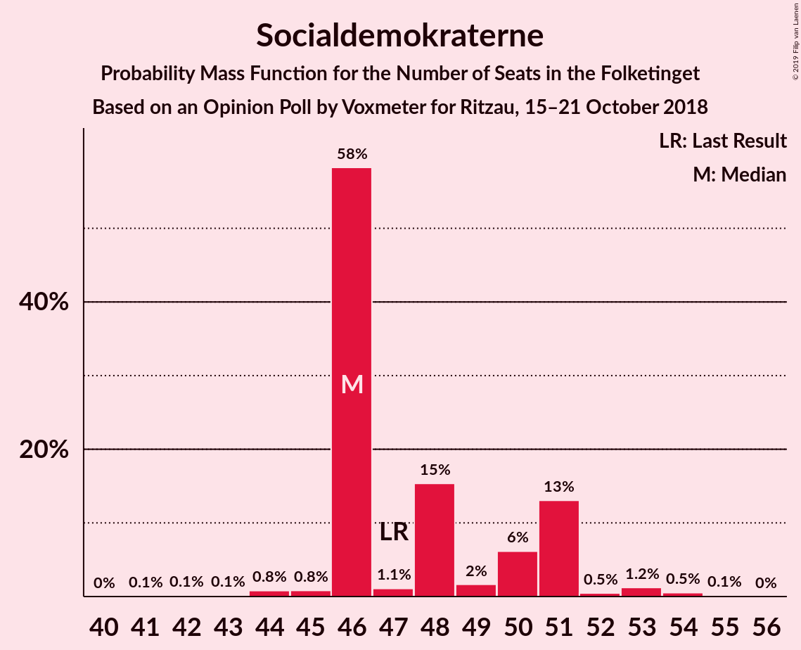
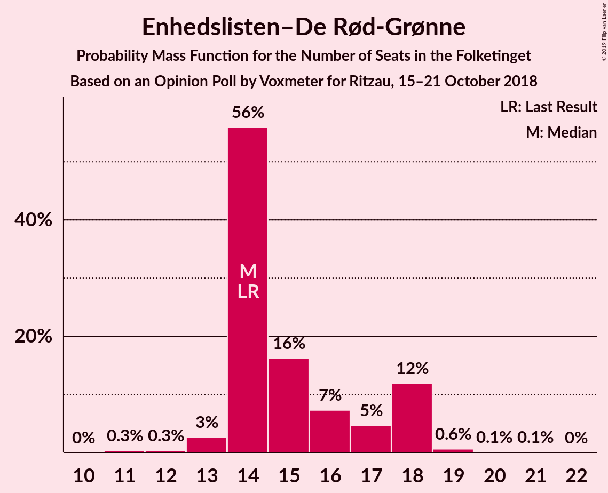
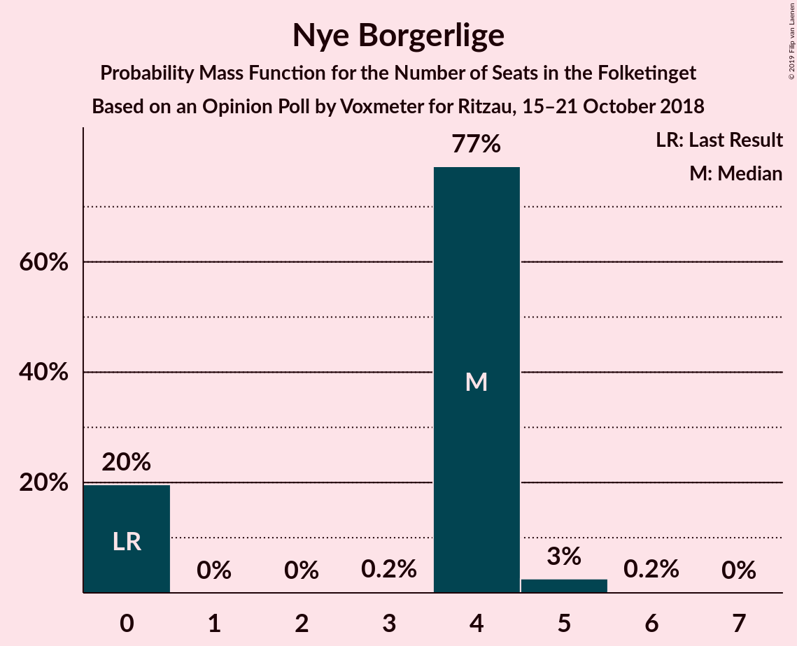

# Opinion Poll by Voxmeter for Ritzau, 15–21 October 2018

<a href="#voting-intentions">Voting Intentions</a> | <a href="#seats">Seats</a> | <a href="#coalitions">Coalitions</a> | <a href="#technical-information">Technical Information</a>

## Voting Intentions

### Confidence Intervals

| Party | Last Result | Poll Result | 80% Confidence Interval | 90% Confidence Interval | 95% Confidence Interval | 99% Confidence Interval |
|:-----:|:-----------:|:-----------:|:-----------------------:|:-----------------------:|:-----------------------:|:-----------------------:|
| Socialdemokraterne | 26.3% | 27.3% | 25.6–29.2% |25.1–29.7% |24.7–30.1% |23.9–31.0% |
| Dansk Folkeparti | 21.1% | 18.2% | 16.8–19.8% |16.3–20.3% |16.0–20.7% |15.3–21.5% |
| Venstre | 19.5% | 17.3% | 15.9–18.9% |15.5–19.4% |15.2–19.8% |14.5–20.6% |
| Enhedslisten–De Rød-Grønne | 7.8% | 8.6% | 7.6–9.8% |7.3–10.2% |7.1–10.5% |6.6–11.1% |
| Liberal Alliance | 7.5% | 6.4% | 5.5–7.5% |5.3–7.8% |5.1–8.1% |4.7–8.6% |
| Radikale Venstre | 4.6% | 5.6% | 4.8–6.7% |4.6–7.0% |4.4–7.2% |4.0–7.7% |
| Alternativet | 4.8% | 5.3% | 4.5–6.3% |4.3–6.6% |4.1–6.9% |3.8–7.4% |
| Socialistisk Folkeparti | 4.2% | 4.9% | 4.2–5.9% |4.0–6.2% |3.8–6.4% |3.4–7.0% |
| Det Konservative Folkeparti | 3.4% | 3.2% | 2.6–4.0% |2.4–4.3% |2.3–4.5% |2.0–4.9% |
| Nye Borgerlige | 0.0% | 1.9% | 1.5–2.6% |1.4–2.8% |1.2–3.0% |1.1–3.3% |
| Kristendemokraterne | 0.8% | 0.9% | 0.6–1.4% |0.5–1.5% |0.5–1.7% |0.4–1.9% |

*Note:* The poll result column reflects the actual value used in the calculations. Published results may vary slightly, and in addition be rounded to fewer digits.

## Seats

### Confidence Intervals

| Party | Last Result | Median | 80% Confidence Interval | 90% Confidence Interval | 95% Confidence Interval | 99% Confidence Interval |
|:-----:|:-----------:|:------:|:-----------------------:|:-----------------------:|:-----------------------:|:-----------------------:|
| <a href="#socialdemokraterne">Socialdemokraterne</a> | 47 | 49 | 45–53 |44–53 |43–53 |41–55 |
| <a href="#dansk-folkeparti">Dansk Folkeparti</a> | 37 | 31 | 29–34 |29–35 |29–37 |27–38 |
| <a href="#venstre">Venstre</a> | 34 | 30 | 28–33 |25–36 |25–37 |25–37 |
| <a href="#enhedslisten–de-rød-grønne">Enhedslisten–De Rød-Grønne</a> | 14 | 15 | 13–19 |13–19 |12–19 |11–20 |
| <a href="#liberal-alliance">Liberal Alliance</a> | 13 | 11 | 9–13 |9–13 |9–13 |8–15 |
| <a href="#radikale-venstre">Radikale Venstre</a> | 8 | 10 | 9–14 |8–14 |8–14 |7–14 |
| <a href="#alternativet">Alternativet</a> | 9 | 9 | 8–13 |7–13 |7–13 |7–13 |
| <a href="#socialistisk-folkeparti">Socialistisk Folkeparti</a> | 7 | 9 | 7–10 |7–11 |7–11 |6–13 |
| <a href="#det-konservative-folkeparti">Det Konservative Folkeparti</a> | 6 | 6 | 5–7 |5–7 |4–8 |4–9 |
| <a href="#nye-borgerlige">Nye Borgerlige</a> | 0 | 4 | 0–5 |0–5 |0–5 |0–6 |
| <a href="#kristendemokraterne">Kristendemokraterne</a> | 0 | 0 | 0 |0 |0 |0 |

### Socialdemokraterne

*For a full overview of the results for this party, see the [Socialdemokraterne](party-socialdemokraterne.html) page.*

| Number of Seats | Probability | Accumulated | Special Marks |
|:---------------:|:-----------:|:-----------:|:-------------:|
| 40 | 0.2% | 100% |  |
| 41 | 1.1% | 99.7% |  |
| 42 | 0.2% | 98.7% |  |
| 43 | 2% | 98.5% |  |
| 44 | 6% | 96% |  |
| 45 | 1.5% | 90% |  |
| 46 | 18% | 89% |  |
| 47 | 0.4% | 71% | Last Result |
| 48 | 8% | 70% |  |
| 49 | 29% | 63% | Median |
| 50 | 3% | 34% |  |
| 51 | 6% | 30% |  |
| 52 | 7% | 24% |  |
| 53 | 14% | 17% |  |
| 54 | 0.4% | 2% |  |
| 55 | 2% | 2% |  |
| 56 | 0.3% | 0.3% |  |
| 57 | 0% | 0% |  |

### Dansk Folkeparti

*For a full overview of the results for this party, see the [Dansk Folkeparti](party-danskfolkeparti.html) page.*

| Number of Seats | Probability | Accumulated | Special Marks |
|:---------------:|:-----------:|:-----------:|:-------------:|
| 25 | 0.1% | 100% |  |
| 26 | 0.1% | 99.9% |  |
| 27 | 2% | 99.8% |  |
| 28 | 0.3% | 98% |  |
| 29 | 17% | 98% |  |
| 30 | 22% | 81% |  |
| 31 | 21% | 58% | Median |
| 32 | 21% | 37% |  |
| 33 | 6% | 16% |  |
| 34 | 5% | 11% |  |
| 35 | 2% | 6% |  |
| 36 | 0.7% | 4% |  |
| 37 | 2% | 3% | Last Result |
| 38 | 0.2% | 0.6% |  |
| 39 | 0.2% | 0.4% |  |
| 40 | 0.2% | 0.2% |  |
| 41 | 0% | 0% |  |

### Venstre

*For a full overview of the results for this party, see the [Venstre](party-venstre.html) page.*

| Number of Seats | Probability | Accumulated | Special Marks |
|:---------------:|:-----------:|:-----------:|:-------------:|
| 24 | 0.1% | 100% |  |
| 25 | 6% | 99.9% |  |
| 26 | 0.4% | 94% |  |
| 27 | 2% | 94% |  |
| 28 | 18% | 92% |  |
| 29 | 4% | 74% |  |
| 30 | 21% | 70% | Median |
| 31 | 9% | 49% |  |
| 32 | 3% | 41% |  |
| 33 | 30% | 37% |  |
| 34 | 2% | 7% | Last Result |
| 35 | 0.2% | 5% |  |
| 36 | 1.2% | 5% |  |
| 37 | 4% | 4% |  |
| 38 | 0% | 0.1% |  |
| 39 | 0% | 0% |  |

### Enhedslisten–De Rød-Grønne

*For a full overview of the results for this party, see the [Enhedslisten–De Rød-Grønne](party-enhedslisten–derød-grønne.html) page.*

| Number of Seats | Probability | Accumulated | Special Marks |
|:---------------:|:-----------:|:-----------:|:-------------:|
| 11 | 0.7% | 100% |  |
| 12 | 3% | 99.3% |  |
| 13 | 43% | 96% |  |
| 14 | 3% | 53% | Last Result |
| 15 | 21% | 50% | Median |
| 16 | 3% | 29% |  |
| 17 | 13% | 26% |  |
| 18 | 1.3% | 13% |  |
| 19 | 10% | 12% |  |
| 20 | 2% | 2% |  |
| 21 | 0% | 0.1% |  |
| 22 | 0.1% | 0.1% |  |
| 23 | 0% | 0% |  |

### Liberal Alliance

*For a full overview of the results for this party, see the [Liberal Alliance](party-liberalalliance.html) page.*

| Number of Seats | Probability | Accumulated | Special Marks |
|:---------------:|:-----------:|:-----------:|:-------------:|
| 8 | 2% | 100% |  |
| 9 | 12% | 98% |  |
| 10 | 20% | 86% |  |
| 11 | 19% | 66% | Median |
| 12 | 22% | 47% |  |
| 13 | 23% | 25% | Last Result |
| 14 | 0.5% | 1.2% |  |
| 15 | 0.6% | 0.7% |  |
| 16 | 0% | 0.1% |  |
| 17 | 0.1% | 0.1% |  |
| 18 | 0% | 0% |  |

### Radikale Venstre

*For a full overview of the results for this party, see the [Radikale Venstre](party-radikalevenstre.html) page.*

| Number of Seats | Probability | Accumulated | Special Marks |
|:---------------:|:-----------:|:-----------:|:-------------:|
| 7 | 0.9% | 100% |  |
| 8 | 7% | 99.1% | Last Result |
| 9 | 7% | 92% |  |
| 10 | 35% | 85% | Median |
| 11 | 17% | 50% |  |
| 12 | 19% | 33% |  |
| 13 | 3% | 14% |  |
| 14 | 10% | 11% |  |
| 15 | 0% | 0.1% |  |
| 16 | 0% | 0% |  |

### Alternativet

*For a full overview of the results for this party, see the [Alternativet](party-alternativet.html) page.*

| Number of Seats | Probability | Accumulated | Special Marks |
|:---------------:|:-----------:|:-----------:|:-------------:|
| 6 | 0% | 100% |  |
| 7 | 9% | 99.9% |  |
| 8 | 2% | 91% |  |
| 9 | 47% | 89% | Last Result, Median |
| 10 | 3% | 42% |  |
| 11 | 16% | 38% |  |
| 12 | 0.2% | 22% |  |
| 13 | 22% | 22% |  |
| 14 | 0.1% | 0.1% |  |
| 15 | 0% | 0% |  |

### Socialistisk Folkeparti

*For a full overview of the results for this party, see the [Socialistisk Folkeparti](party-socialistiskfolkeparti.html) page.*

| Number of Seats | Probability | Accumulated | Special Marks |
|:---------------:|:-----------:|:-----------:|:-------------:|
| 6 | 0.6% | 100% |  |
| 7 | 19% | 99.4% | Last Result |
| 8 | 23% | 81% |  |
| 9 | 17% | 57% | Median |
| 10 | 33% | 40% |  |
| 11 | 5% | 7% |  |
| 12 | 0.9% | 2% |  |
| 13 | 1.1% | 1.3% |  |
| 14 | 0.2% | 0.2% |  |
| 15 | 0% | 0% |  |

### Det Konservative Folkeparti

*For a full overview of the results for this party, see the [Det Konservative Folkeparti](party-detkonservativefolkeparti.html) page.*

| Number of Seats | Probability | Accumulated | Special Marks |
|:---------------:|:-----------:|:-----------:|:-------------:|
| 0 | 0.1% | 100% |  |
| 1 | 0% | 99.9% |  |
| 2 | 0% | 99.9% |  |
| 3 | 0% | 99.9% |  |
| 4 | 3% | 99.9% |  |
| 5 | 45% | 97% |  |
| 6 | 24% | 52% | Last Result, Median |
| 7 | 23% | 28% |  |
| 8 | 3% | 5% |  |
| 9 | 2% | 2% |  |
| 10 | 0.1% | 0.1% |  |
| 11 | 0% | 0% |  |

### Nye Borgerlige

*For a full overview of the results for this party, see the [Nye Borgerlige](party-nyeborgerlige.html) page.*

| Number of Seats | Probability | Accumulated | Special Marks |
|:---------------:|:-----------:|:-----------:|:-------------:|
| 0 | 41% | 100% | Last Result |
| 1 | 0% | 59% |  |
| 2 | 0% | 59% |  |
| 3 | 0% | 59% |  |
| 4 | 36% | 59% | Median |
| 5 | 21% | 23% |  |
| 6 | 2% | 2% |  |
| 7 | 0.1% | 0.1% |  |
| 8 | 0% | 0% |  |

### Kristendemokraterne

*For a full overview of the results for this party, see the [Kristendemokraterne](party-kristendemokraterne.html) page.*

| Number of Seats | Probability | Accumulated | Special Marks |
|:---------------:|:-----------:|:-----------:|:-------------:|
| 0 | 99.6% | 100% | Last Result, Median |
| 1 | 0% | 0.4% |  |
| 2 | 0% | 0.4% |  |
| 3 | 0.1% | 0.4% |  |
| 4 | 0.3% | 0.3% |  |
| 5 | 0% | 0% |  |

## Coalitions

### Confidence Intervals

| Coalition | Last Result | Median | Majority? | 80% Confidence Interval | 90% Confidence Interval | 95% Confidence Interval | 99% Confidence Interval |
|:---------:|:-----------:|:------:|:---------:|:-----------------------:|:-----------------------:|:-----------------------:|:-----------------------:|
| Socialdemokraterne – Enhedslisten–De Rød-Grønne – Radikale Venstre – Alternativet – Socialistisk Folkeparti | 85 | 92 | 95% | 90–99 | 89–99 | 86–99 | 85–101 |
| Socialdemokraterne – Enhedslisten–De Rød-Grønne – Alternativet – Socialistisk Folkeparti | 77 | 82 | 3% | 79–88 | 77–88 | 77–90 | 75–91 |
| Socialdemokraterne – Enhedslisten–De Rød-Grønne – Radikale Venstre – Socialistisk Folkeparti | 76 | 83 | 2% | 79–88 | 79–88 | 77–89 | 76–92 |
| Dansk Folkeparti – Venstre – Liberal Alliance – Det Konservative Folkeparti – Nye Borgerlige – Kristendemokraterne | 90 | 83 | 1.3% | 76–85 | 76–86 | 76–89 | 74–90 |
| Dansk Folkeparti – Venstre – Liberal Alliance – Det Konservative Folkeparti – Nye Borgerlige | 90 | 83 | 1.3% | 76–85 | 76–85 | 76–89 | 74–90 |
| Dansk Folkeparti – Venstre – Liberal Alliance – Det Konservative Folkeparti – Kristendemokraterne | 90 | 79 | 0.1% | 76–82 | 75–83 | 74–85 | 71–88 |
| Dansk Folkeparti – Venstre – Liberal Alliance – Det Konservative Folkeparti | 90 | 79 | 0.1% | 76–82 | 75–83 | 74–85 | 71–88 |
| Socialdemokraterne – Enhedslisten–De Rød-Grønne – Socialistisk Folkeparti | 68 | 73 | 0% | 69–77 | 68–77 | 68–79 | 66–82 |
| Socialdemokraterne – Radikale Venstre – Socialistisk Folkeparti | 62 | 69 | 0% | 64–73 | 63–73 | 61–73 | 60–75 |
| Socialdemokraterne – Radikale Venstre | 55 | 61 | 0% | 56–64 | 54–64 | 53–64 | 51–64 |
| Venstre – Liberal Alliance – Det Konservative Folkeparti | 53 | 48 | 0% | 43–50 | 42–53 | 42–53 | 40–55 |
| Venstre – Det Konservative Folkeparti | 40 | 37 | 0% | 33–39 | 30–42 | 30–42 | 30–43 |
| Venstre | 34 | 30 | 0% | 28–33 | 25–36 | 25–37 | 25–37 |

### Socialdemokraterne – Enhedslisten–De Rød-Grønne – Radikale Venstre – Alternativet – Socialistisk Folkeparti

| Number of Seats | Probability | Accumulated | Special Marks |
|:---------------:|:-----------:|:-----------:|:-------------:|
| 81 | 0.1% | 100% |  |
| 82 | 0% | 99.9% |  |
| 83 | 0.1% | 99.9% |  |
| 84 | 0.1% | 99.8% |  |
| 85 | 1.0% | 99.6% | Last Result |
| 86 | 1.4% | 98.7% |  |
| 87 | 0.4% | 97% |  |
| 88 | 0.8% | 97% |  |
| 89 | 1.2% | 96% |  |
| 90 | 10% | 95% | Majority |
| 91 | 20% | 85% |  |
| 92 | 22% | 64% | Median |
| 93 | 2% | 42% |  |
| 94 | 0.7% | 40% |  |
| 95 | 3% | 39% |  |
| 96 | 19% | 37% |  |
| 97 | 0.2% | 18% |  |
| 98 | 0.8% | 18% |  |
| 99 | 15% | 17% |  |
| 100 | 0% | 2% |  |
| 101 | 1.4% | 2% |  |
| 102 | 0.1% | 0.2% |  |
| 103 | 0% | 0% |  |

### Socialdemokraterne – Enhedslisten–De Rød-Grønne – Alternativet – Socialistisk Folkeparti

| Number of Seats | Probability | Accumulated | Special Marks |
|:---------------:|:-----------:|:-----------:|:-------------:|
| 72 | 0.1% | 100% |  |
| 73 | 0.1% | 99.9% |  |
| 74 | 0.2% | 99.8% |  |
| 75 | 0.5% | 99.6% |  |
| 76 | 1.1% | 99.1% |  |
| 77 | 4% | 98% | Last Result |
| 78 | 0.3% | 94% |  |
| 79 | 18% | 94% |  |
| 80 | 3% | 76% |  |
| 81 | 7% | 73% |  |
| 82 | 31% | 65% | Median |
| 83 | 3% | 35% |  |
| 84 | 2% | 31% |  |
| 85 | 3% | 29% |  |
| 86 | 8% | 26% |  |
| 87 | 0.2% | 18% |  |
| 88 | 15% | 18% |  |
| 89 | 0% | 3% |  |
| 90 | 2% | 3% | Majority |
| 91 | 1.0% | 1.0% |  |
| 92 | 0% | 0.1% |  |
| 93 | 0% | 0% |  |

### Socialdemokraterne – Enhedslisten–De Rød-Grønne – Radikale Venstre – Socialistisk Folkeparti

| Number of Seats | Probability | Accumulated | Special Marks |
|:---------------:|:-----------:|:-----------:|:-------------:|
| 72 | 0.1% | 100% |  |
| 73 | 0.1% | 99.9% |  |
| 74 | 0% | 99.8% |  |
| 75 | 0.2% | 99.8% |  |
| 76 | 1.0% | 99.6% | Last Result |
| 77 | 2% | 98.6% |  |
| 78 | 0.9% | 97% |  |
| 79 | 17% | 96% |  |
| 80 | 4% | 79% |  |
| 81 | 3% | 76% |  |
| 82 | 21% | 73% |  |
| 83 | 13% | 52% | Median |
| 84 | 3% | 39% |  |
| 85 | 0.7% | 36% |  |
| 86 | 2% | 35% |  |
| 87 | 16% | 33% |  |
| 88 | 14% | 18% |  |
| 89 | 0.8% | 3% |  |
| 90 | 0.8% | 2% | Majority |
| 91 | 0% | 1.5% |  |
| 92 | 1.3% | 1.4% |  |
| 93 | 0.1% | 0.1% |  |
| 94 | 0% | 0% |  |

### Dansk Folkeparti – Venstre – Liberal Alliance – Det Konservative Folkeparti – Nye Borgerlige – Kristendemokraterne

| Number of Seats | Probability | Accumulated | Special Marks |
|:---------------:|:-----------:|:-----------:|:-------------:|
| 73 | 0.1% | 100% |  |
| 74 | 1.4% | 99.8% |  |
| 75 | 0% | 98% |  |
| 76 | 15% | 98% |  |
| 77 | 0.8% | 83% |  |
| 78 | 0.2% | 82% |  |
| 79 | 19% | 82% |  |
| 80 | 3% | 63% |  |
| 81 | 0.7% | 61% |  |
| 82 | 2% | 60% | Median |
| 83 | 22% | 58% |  |
| 84 | 20% | 36% |  |
| 85 | 10% | 15% |  |
| 86 | 1.2% | 5% |  |
| 87 | 0.8% | 4% |  |
| 88 | 0.4% | 3% |  |
| 89 | 1.4% | 3% |  |
| 90 | 1.0% | 1.3% | Last Result, Majority |
| 91 | 0.1% | 0.4% |  |
| 92 | 0.1% | 0.2% |  |
| 93 | 0% | 0.1% |  |
| 94 | 0.1% | 0.1% |  |
| 95 | 0% | 0% |  |

### Dansk Folkeparti – Venstre – Liberal Alliance – Det Konservative Folkeparti – Nye Borgerlige

| Number of Seats | Probability | Accumulated | Special Marks |
|:---------------:|:-----------:|:-----------:|:-------------:|
| 73 | 0.1% | 100% |  |
| 74 | 1.4% | 99.8% |  |
| 75 | 0% | 98% |  |
| 76 | 15% | 98% |  |
| 77 | 0.8% | 83% |  |
| 78 | 0.2% | 82% |  |
| 79 | 19% | 82% |  |
| 80 | 3% | 63% |  |
| 81 | 0.7% | 61% |  |
| 82 | 2% | 60% | Median |
| 83 | 23% | 58% |  |
| 84 | 20% | 36% |  |
| 85 | 10% | 15% |  |
| 86 | 1.2% | 5% |  |
| 87 | 0.6% | 4% |  |
| 88 | 0.4% | 3% |  |
| 89 | 1.3% | 3% |  |
| 90 | 1.0% | 1.3% | Last Result, Majority |
| 91 | 0.1% | 0.4% |  |
| 92 | 0.1% | 0.2% |  |
| 93 | 0% | 0.1% |  |
| 94 | 0.1% | 0.1% |  |
| 95 | 0% | 0% |  |

### Dansk Folkeparti – Venstre – Liberal Alliance – Det Konservative Folkeparti – Kristendemokraterne

| Number of Seats | Probability | Accumulated | Special Marks |
|:---------------:|:-----------:|:-----------:|:-------------:|
| 71 | 0.6% | 100% |  |
| 72 | 0.2% | 99.3% |  |
| 73 | 0.3% | 99.1% |  |
| 74 | 2% | 98.9% |  |
| 75 | 5% | 97% |  |
| 76 | 16% | 92% |  |
| 77 | 0.5% | 77% |  |
| 78 | 2% | 76% | Median |
| 79 | 49% | 74% |  |
| 80 | 3% | 25% |  |
| 81 | 11% | 22% |  |
| 82 | 2% | 11% |  |
| 83 | 4% | 9% |  |
| 84 | 1.3% | 5% |  |
| 85 | 1.4% | 4% |  |
| 86 | 1.0% | 2% |  |
| 87 | 0.6% | 1.3% |  |
| 88 | 0.4% | 0.7% |  |
| 89 | 0.1% | 0.3% |  |
| 90 | 0% | 0.1% | Last Result, Majority |
| 91 | 0% | 0.1% |  |
| 92 | 0% | 0.1% |  |
| 93 | 0% | 0.1% |  |
| 94 | 0.1% | 0.1% |  |
| 95 | 0% | 0% |  |

### Dansk Folkeparti – Venstre – Liberal Alliance – Det Konservative Folkeparti

| Number of Seats | Probability | Accumulated | Special Marks |
|:---------------:|:-----------:|:-----------:|:-------------:|
| 71 | 0.6% | 100% |  |
| 72 | 0.2% | 99.3% |  |
| 73 | 0.3% | 99.1% |  |
| 74 | 2% | 98.9% |  |
| 75 | 5% | 97% |  |
| 76 | 16% | 92% |  |
| 77 | 0.5% | 77% |  |
| 78 | 2% | 76% | Median |
| 79 | 49% | 74% |  |
| 80 | 3% | 24% |  |
| 81 | 11% | 22% |  |
| 82 | 2% | 11% |  |
| 83 | 4% | 9% |  |
| 84 | 1.3% | 5% |  |
| 85 | 1.4% | 3% |  |
| 86 | 1.0% | 2% |  |
| 87 | 0.4% | 1.1% |  |
| 88 | 0.4% | 0.7% |  |
| 89 | 0.1% | 0.3% |  |
| 90 | 0% | 0.1% | Last Result, Majority |
| 91 | 0% | 0.1% |  |
| 92 | 0% | 0.1% |  |
| 93 | 0% | 0.1% |  |
| 94 | 0.1% | 0.1% |  |
| 95 | 0% | 0% |  |

### Socialdemokraterne – Enhedslisten–De Rød-Grønne – Socialistisk Folkeparti

| Number of Seats | Probability | Accumulated | Special Marks |
|:---------------:|:-----------:|:-----------:|:-------------:|
| 63 | 0.2% | 100% |  |
| 64 | 0.1% | 99.8% |  |
| 65 | 0.1% | 99.8% |  |
| 66 | 0.3% | 99.7% |  |
| 67 | 1.2% | 99.4% |  |
| 68 | 4% | 98% | Last Result |
| 69 | 17% | 94% |  |
| 70 | 21% | 77% |  |
| 71 | 0.8% | 57% |  |
| 72 | 3% | 56% |  |
| 73 | 18% | 53% | Median |
| 74 | 8% | 35% |  |
| 75 | 0.5% | 27% |  |
| 76 | 3% | 26% |  |
| 77 | 20% | 23% |  |
| 78 | 1.0% | 4% |  |
| 79 | 0.3% | 3% |  |
| 80 | 0.1% | 2% |  |
| 81 | 1.4% | 2% |  |
| 82 | 0.9% | 0.9% |  |
| 83 | 0% | 0% |  |

### Socialdemokraterne – Radikale Venstre – Socialistisk Folkeparti

| Number of Seats | Probability | Accumulated | Special Marks |
|:---------------:|:-----------:|:-----------:|:-------------:|
| 57 | 0.1% | 100% |  |
| 58 | 0.1% | 99.9% |  |
| 59 | 0.2% | 99.7% |  |
| 60 | 0.4% | 99.5% |  |
| 61 | 2% | 99.2% |  |
| 62 | 0.1% | 97% | Last Result |
| 63 | 2% | 97% |  |
| 64 | 11% | 95% |  |
| 65 | 0.7% | 84% |  |
| 66 | 18% | 84% |  |
| 67 | 1.1% | 66% |  |
| 68 | 3% | 65% | Median |
| 69 | 21% | 62% |  |
| 70 | 12% | 41% |  |
| 71 | 5% | 28% |  |
| 72 | 7% | 24% |  |
| 73 | 16% | 17% |  |
| 74 | 0.1% | 0.6% |  |
| 75 | 0.4% | 0.5% |  |
| 76 | 0% | 0.1% |  |
| 77 | 0.1% | 0.1% |  |
| 78 | 0% | 0% |  |

### Socialdemokraterne – Radikale Venstre

| Number of Seats | Probability | Accumulated | Special Marks |
|:---------------:|:-----------:|:-----------:|:-------------:|
| 49 | 0% | 100% |  |
| 50 | 0.2% | 99.9% |  |
| 51 | 1.1% | 99.7% |  |
| 52 | 0.4% | 98.7% |  |
| 53 | 3% | 98% |  |
| 54 | 5% | 96% |  |
| 55 | 0.4% | 91% | Last Result |
| 56 | 17% | 90% |  |
| 57 | 9% | 74% |  |
| 58 | 3% | 64% |  |
| 59 | 0.8% | 61% | Median |
| 60 | 2% | 61% |  |
| 61 | 23% | 58% |  |
| 62 | 7% | 35% |  |
| 63 | 13% | 28% |  |
| 64 | 15% | 15% |  |
| 65 | 0.1% | 0.3% |  |
| 66 | 0.1% | 0.2% |  |
| 67 | 0.1% | 0.1% |  |
| 68 | 0% | 0% |  |

### Venstre – Liberal Alliance – Det Konservative Folkeparti

| Number of Seats | Probability | Accumulated | Special Marks |
|:---------------:|:-----------:|:-----------:|:-------------:|
| 40 | 1.3% | 100% |  |
| 41 | 0.9% | 98.7% |  |
| 42 | 6% | 98% |  |
| 43 | 2% | 92% |  |
| 44 | 1.0% | 90% |  |
| 45 | 0.6% | 89% |  |
| 46 | 0.7% | 88% |  |
| 47 | 27% | 87% | Median |
| 48 | 22% | 60% |  |
| 49 | 26% | 39% |  |
| 50 | 3% | 12% |  |
| 51 | 2% | 9% |  |
| 52 | 1.1% | 7% |  |
| 53 | 4% | 6% | Last Result |
| 54 | 1.2% | 2% |  |
| 55 | 0.2% | 0.7% |  |
| 56 | 0.1% | 0.5% |  |
| 57 | 0.3% | 0.4% |  |
| 58 | 0% | 0.1% |  |
| 59 | 0% | 0% |  |

### Venstre – Det Konservative Folkeparti

| Number of Seats | Probability | Accumulated | Special Marks |
|:---------------:|:-----------:|:-----------:|:-------------:|
| 29 | 0.1% | 100% |  |
| 30 | 6% | 99.9% |  |
| 31 | 0.2% | 94% |  |
| 32 | 4% | 94% |  |
| 33 | 2% | 90% |  |
| 34 | 0.8% | 89% |  |
| 35 | 33% | 88% |  |
| 36 | 3% | 55% | Median |
| 37 | 7% | 53% |  |
| 38 | 20% | 46% |  |
| 39 | 19% | 26% |  |
| 40 | 1.1% | 7% | Last Result |
| 41 | 0.4% | 6% |  |
| 42 | 5% | 6% |  |
| 43 | 0.9% | 1.0% |  |
| 44 | 0% | 0.1% |  |
| 45 | 0% | 0.1% |  |
| 46 | 0% | 0% |  |

### Venstre

| Number of Seats | Probability | Accumulated | Special Marks |
|:---------------:|:-----------:|:-----------:|:-------------:|
| 24 | 0.1% | 100% |  |
| 25 | 6% | 99.9% |  |
| 26 | 0.4% | 94% |  |
| 27 | 2% | 94% |  |
| 28 | 18% | 92% |  |
| 29 | 4% | 74% |  |
| 30 | 21% | 70% | Median |
| 31 | 9% | 49% |  |
| 32 | 3% | 41% |  |
| 33 | 30% | 37% |  |
| 34 | 2% | 7% | Last Result |
| 35 | 0.2% | 5% |  |
| 36 | 1.2% | 5% |  |
| 37 | 4% | 4% |  |
| 38 | 0% | 0.1% |  |
| 39 | 0% | 0% |  |

## Technical Information

### Opinion Poll

+ **Polling firm:** Voxmeter
+ **Commissioner(s):** Ritzau
+ **Fieldwork period:** 15–21 October 2018

### Calculations

+ **Sample size:** 1032
+ **Simulations done:** 131,072
+ **Error estimate:** 3.38%

