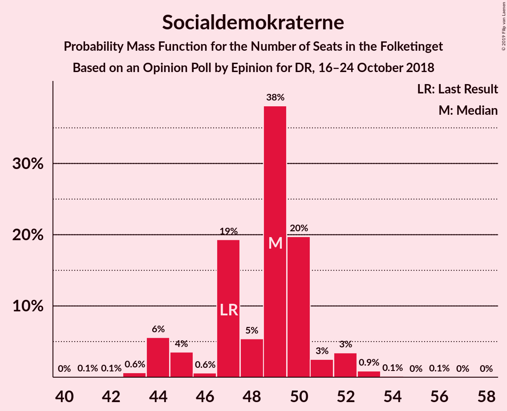
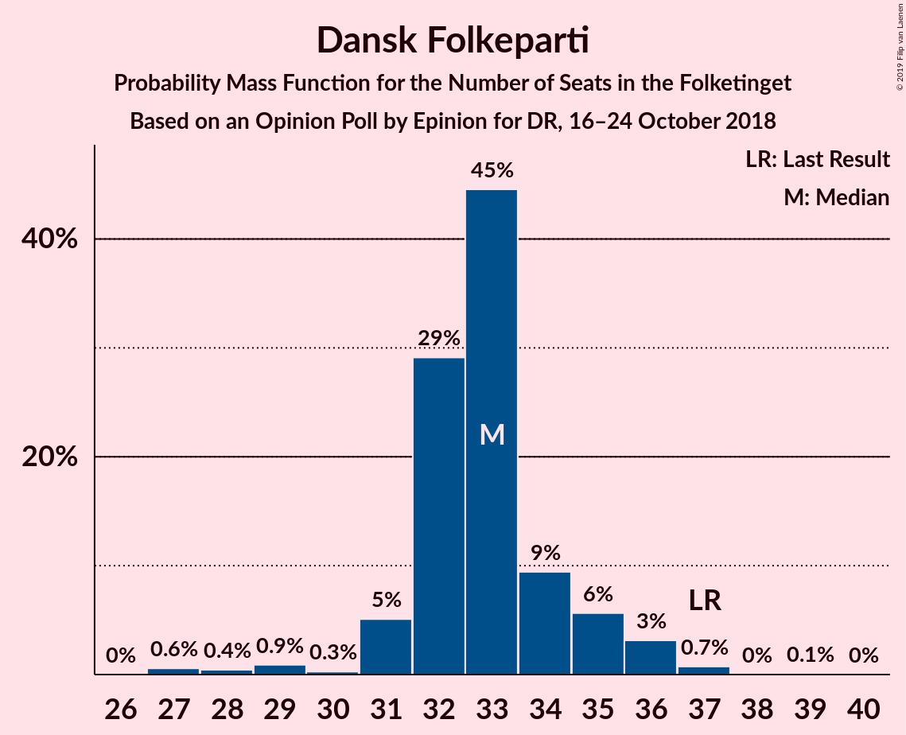
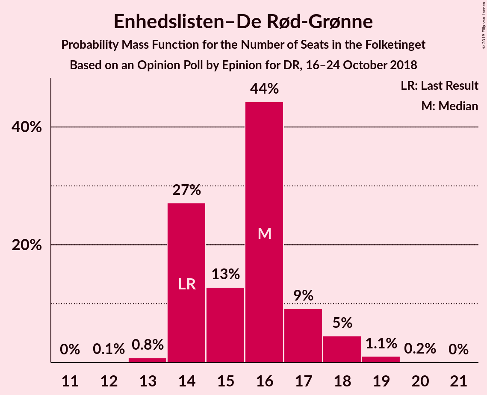
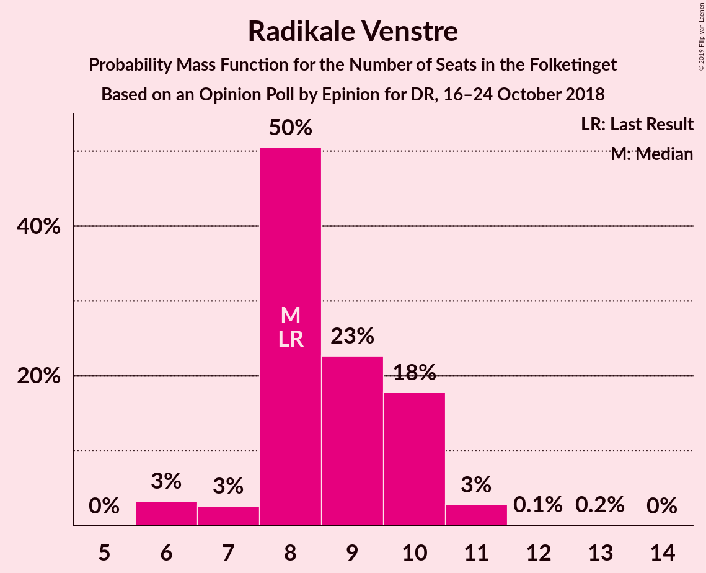
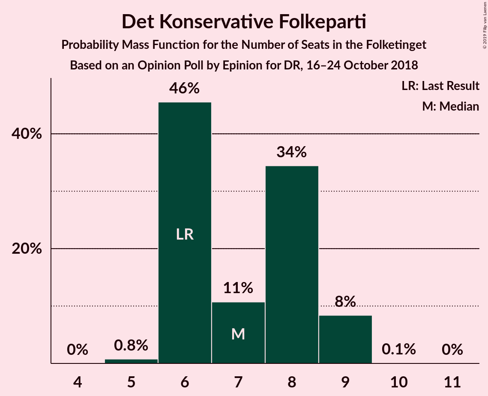
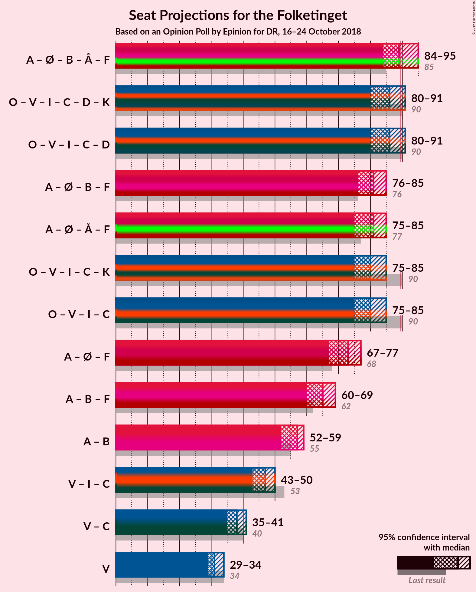

# Opinion Poll by Epinion for DR, 16–24 October 2018

<a href="#voting-intentions">Voting Intentions</a> | <a href="#seats">Seats</a> | <a href="#coalitions">Coalitions</a> | <a href="#technical-information">Technical Information</a>

## Voting Intentions

### Confidence Intervals

| Party | Last Result | Poll Result | 80% Confidence Interval | 90% Confidence Interval | 95% Confidence Interval | 99% Confidence Interval |
|:-----:|:-----------:|:-----------:|:-----------------------:|:-----------------------:|:-----------------------:|:-----------------------:|
| Socialdemokraterne | 26.3% | 27.5% | 26.1–29.0% |25.7–29.4% |25.3–29.8% |24.6–30.5% |
| Dansk Folkeparti | 21.1% | 18.6% | 17.4–19.9% |17.0–20.3% |16.7–20.6% |16.2–21.3% |
| Venstre | 19.5% | 17.8% | 16.6–19.1% |16.3–19.5% |16.0–19.8% |15.4–20.5% |
| Enhedslisten–De Rød-Grønne | 7.8% | 9.1% | 8.2–10.1% |8.0–10.4% |7.8–10.7% |7.4–11.2% |
| Radikale Venstre | 4.6% | 5.0% | 4.4–5.8% |4.2–6.0% |4.0–6.2% |3.7–6.6% |
| Liberal Alliance | 7.5% | 4.8% | 4.2–5.6% |4.0–5.8% |3.8–6.0% |3.6–6.4% |
| Alternativet | 4.8% | 4.7% | 4.1–5.5% |3.9–5.7% |3.7–5.9% |3.4–6.2% |
| Socialistisk Folkeparti | 4.2% | 4.5% | 3.9–5.2% |3.7–5.5% |3.6–5.7% |3.3–6.0% |
| Det Konservative Folkeparti | 3.4% | 4.0% | 3.4–4.8% |3.3–5.0% |3.2–5.1% |2.9–5.5% |
| Nye Borgerlige | 0.0% | 3.4% | 2.9–4.1% |2.7–4.3% |2.6–4.4% |2.3–4.8% |
| Kristendemokraterne | 0.8% | 0.7% | 0.5–1.1% |0.4–1.2% |0.4–1.3% |0.3–1.5% |

*Note:* The poll result column reflects the actual value used in the calculations. Published results may vary slightly, and in addition be rounded to fewer digits.

## Seats

### Confidence Intervals

| Party | Last Result | Median | 80% Confidence Interval | 90% Confidence Interval | 95% Confidence Interval | 99% Confidence Interval |
|:-----:|:-----------:|:------:|:-----------------------:|:-----------------------:|:-----------------------:|:-----------------------:|
| <a href="#socialdemokraterne">Socialdemokraterne</a> | 47 | 49 | 46–50 |44–51 |44–52 |43–53 |
| <a href="#dansk-folkeparti">Dansk Folkeparti</a> | 37 | 33 | 32–34 |31–35 |31–36 |27–37 |
| <a href="#venstre">Venstre</a> | 34 | 31 | 29–33 |29–33 |29–34 |27–35 |
| <a href="#enhedslisten–de-rød-grønne">Enhedslisten–De Rød-Grønne</a> | 14 | 16 | 14–17 |14–18 |14–18 |13–19 |
| <a href="#radikale-venstre">Radikale Venstre</a> | 8 | 8 | 8–10 |7–10 |6–11 |6–11 |
| <a href="#liberal-alliance">Liberal Alliance</a> | 13 | 9 | 7–10 |7–10 |7–10 |6–10 |
| <a href="#alternativet">Alternativet</a> | 9 | 8 | 8–9 |7–10 |6–10 |6–11 |
| <a href="#socialistisk-folkeparti">Socialistisk Folkeparti</a> | 7 | 8 | 7–10 |7–10 |6–10 |6–11 |
| <a href="#det-konservative-folkeparti">Det Konservative Folkeparti</a> | 6 | 7 | 6–8 |6–9 |6–9 |5–9 |
| <a href="#nye-borgerlige">Nye Borgerlige</a> | 0 | 6 | 5–6 |5–7 |5–7 |4–8 |
| <a href="#kristendemokraterne">Kristendemokraterne</a> | 0 | 0 | 0 |0 |0 |0 |

### Socialdemokraterne

*For a full overview of the results for this party, see the [Socialdemokraterne](party-socialdemokraterne.html) page.*

| Number of Seats | Probability | Accumulated | Special Marks |
|:---------------:|:-----------:|:-----------:|:-------------:|
| 41 | 0.1% | 100% |  |
| 42 | 0.1% | 99.9% |  |
| 43 | 0.6% | 99.9% |  |
| 44 | 6% | 99.2% |  |
| 45 | 4% | 94% |  |
| 46 | 0.6% | 90% |  |
| 47 | 19% | 90% | Last Result |
| 48 | 5% | 70% |  |
| 49 | 38% | 65% | Median |
| 50 | 20% | 27% |  |
| 51 | 3% | 7% |  |
| 52 | 3% | 5% |  |
| 53 | 0.9% | 1.1% |  |
| 54 | 0.1% | 0.2% |  |
| 55 | 0% | 0.1% |  |
| 56 | 0.1% | 0.1% |  |
| 57 | 0% | 0% |  |

### Dansk Folkeparti

*For a full overview of the results for this party, see the [Dansk Folkeparti](party-danskfolkeparti.html) page.*

| Number of Seats | Probability | Accumulated | Special Marks |
|:---------------:|:-----------:|:-----------:|:-------------:|
| 27 | 0.6% | 100% |  |
| 28 | 0.4% | 99.4% |  |
| 29 | 0.9% | 99.0% |  |
| 30 | 0.3% | 98% |  |
| 31 | 5% | 98% |  |
| 32 | 29% | 93% |  |
| 33 | 45% | 64% | Median |
| 34 | 9% | 19% |  |
| 35 | 6% | 10% |  |
| 36 | 3% | 4% |  |
| 37 | 0.7% | 0.8% | Last Result |
| 38 | 0% | 0.1% |  |
| 39 | 0.1% | 0.1% |  |
| 40 | 0% | 0% |  |

### Venstre

*For a full overview of the results for this party, see the [Venstre](party-venstre.html) page.*

| Number of Seats | Probability | Accumulated | Special Marks |
|:---------------:|:-----------:|:-----------:|:-------------:|
| 26 | 0.2% | 100% |  |
| 27 | 0.7% | 99.8% |  |
| 28 | 1.1% | 99.2% |  |
| 29 | 10% | 98% |  |
| 30 | 4% | 88% |  |
| 31 | 46% | 84% | Median |
| 32 | 15% | 37% |  |
| 33 | 17% | 22% |  |
| 34 | 3% | 5% | Last Result |
| 35 | 2% | 2% |  |
| 36 | 0% | 0.2% |  |
| 37 | 0.2% | 0.2% |  |
| 38 | 0% | 0% |  |

### Enhedslisten–De Rød-Grønne

*For a full overview of the results for this party, see the [Enhedslisten–De Rød-Grønne](party-enhedslisten–derød-grønne.html) page.*

| Number of Seats | Probability | Accumulated | Special Marks |
|:---------------:|:-----------:|:-----------:|:-------------:|
| 12 | 0.1% | 100% |  |
| 13 | 0.8% | 99.9% |  |
| 14 | 27% | 99.1% | Last Result |
| 15 | 13% | 72% |  |
| 16 | 44% | 59% | Median |
| 17 | 9% | 15% |  |
| 18 | 5% | 6% |  |
| 19 | 1.1% | 1.3% |  |
| 20 | 0.2% | 0.2% |  |
| 21 | 0% | 0% |  |

### Radikale Venstre

*For a full overview of the results for this party, see the [Radikale Venstre](party-radikalevenstre.html) page.*

| Number of Seats | Probability | Accumulated | Special Marks |
|:---------------:|:-----------:|:-----------:|:-------------:|
| 6 | 3% | 100% |  |
| 7 | 3% | 97% |  |
| 8 | 50% | 94% | Last Result, Median |
| 9 | 23% | 44% |  |
| 10 | 18% | 21% |  |
| 11 | 3% | 3% |  |
| 12 | 0.1% | 0.3% |  |
| 13 | 0.2% | 0.2% |  |
| 14 | 0% | 0% |  |

### Liberal Alliance

*For a full overview of the results for this party, see the [Liberal Alliance](party-liberalalliance.html) page.*

| Number of Seats | Probability | Accumulated | Special Marks |
|:---------------:|:-----------:|:-----------:|:-------------:|
| 6 | 2% | 100% |  |
| 7 | 15% | 98% |  |
| 8 | 24% | 83% |  |
| 9 | 8% | 58% | Median |
| 10 | 50% | 50% |  |
| 11 | 0.4% | 0.5% |  |
| 12 | 0.1% | 0.1% |  |
| 13 | 0% | 0% | Last Result |

### Alternativet

*For a full overview of the results for this party, see the [Alternativet](party-alternativet.html) page.*

| Number of Seats | Probability | Accumulated | Special Marks |
|:---------------:|:-----------:|:-----------:|:-------------:|
| 6 | 3% | 100% |  |
| 7 | 5% | 97% |  |
| 8 | 65% | 92% | Median |
| 9 | 20% | 26% | Last Result |
| 10 | 5% | 6% |  |
| 11 | 0.8% | 0.8% |  |
| 12 | 0% | 0% |  |

### Socialistisk Folkeparti

*For a full overview of the results for this party, see the [Socialistisk Folkeparti](party-socialistiskfolkeparti.html) page.*

| Number of Seats | Probability | Accumulated | Special Marks |
|:---------------:|:-----------:|:-----------:|:-------------:|
| 5 | 0.1% | 100% |  |
| 6 | 3% | 99.9% |  |
| 7 | 25% | 97% | Last Result |
| 8 | 50% | 72% | Median |
| 9 | 6% | 22% |  |
| 10 | 16% | 17% |  |
| 11 | 1.1% | 1.1% |  |
| 12 | 0% | 0% |  |

### Det Konservative Folkeparti

*For a full overview of the results for this party, see the [Det Konservative Folkeparti](party-detkonservativefolkeparti.html) page.*

| Number of Seats | Probability | Accumulated | Special Marks |
|:---------------:|:-----------:|:-----------:|:-------------:|
| 5 | 0.8% | 100% |  |
| 6 | 46% | 99.2% | Last Result |
| 7 | 11% | 54% | Median |
| 8 | 34% | 43% |  |
| 9 | 8% | 9% |  |
| 10 | 0.1% | 0.1% |  |
| 11 | 0% | 0% |  |

### Nye Borgerlige

*For a full overview of the results for this party, see the [Nye Borgerlige](party-nyeborgerlige.html) page.*

| Number of Seats | Probability | Accumulated | Special Marks |
|:---------------:|:-----------:|:-----------:|:-------------:|
| 0 | 0% | 100% | Last Result |
| 1 | 0% | 100% |  |
| 2 | 0% | 100% |  |
| 3 | 0% | 100% |  |
| 4 | 1.4% | 100% |  |
| 5 | 10% | 98.6% |  |
| 6 | 82% | 89% | Median |
| 7 | 5% | 7% |  |
| 8 | 2% | 2% |  |
| 9 | 0.1% | 0.1% |  |
| 10 | 0% | 0% |  |

### Kristendemokraterne

*For a full overview of the results for this party, see the [Kristendemokraterne](party-kristendemokraterne.html) page.*

| Number of Seats | Probability | Accumulated | Special Marks |
|:---------------:|:-----------:|:-----------:|:-------------:|
| 0 | 100% | 100% | Last Result, Median |

## Coalitions

### Confidence Intervals

| Coalition | Last Result | Median | Majority? | 80% Confidence Interval | 90% Confidence Interval | 95% Confidence Interval | 99% Confidence Interval |
|:---------:|:-----------:|:------:|:---------:|:-----------------------:|:-----------------------:|:-----------------------:|:-----------------------:|
| Socialdemokraterne – Enhedslisten–De Rød-Grønne – Radikale Venstre – Alternativet – Socialistisk Folkeparti | 85 | 89 | 14% | 86–90 | 86–92 | 84–95 | 84–95 |
| Dansk Folkeparti – Venstre – Liberal Alliance – Det Konservative Folkeparti – Nye Borgerlige – Kristendemokraterne | 90 | 86 | 4% | 85–89 | 83–89 | 80–91 | 80–91 |
| Dansk Folkeparti – Venstre – Liberal Alliance – Det Konservative Folkeparti – Nye Borgerlige | 90 | 86 | 4% | 85–89 | 83–89 | 80–91 | 80–91 |
| Socialdemokraterne – Enhedslisten–De Rød-Grønne – Radikale Venstre – Socialistisk Folkeparti | 76 | 81 | 0% | 79–82 | 77–84 | 76–85 | 75–87 |
| Socialdemokraterne – Enhedslisten–De Rød-Grønne – Alternativet – Socialistisk Folkeparti | 77 | 81 | 0% | 78–83 | 77–84 | 75–85 | 75–87 |
| Dansk Folkeparti – Venstre – Liberal Alliance – Det Konservative Folkeparti – Kristendemokraterne | 90 | 80 | 0% | 78–83 | 76–84 | 75–85 | 75–85 |
| Dansk Folkeparti – Venstre – Liberal Alliance – Det Konservative Folkeparti | 90 | 80 | 0% | 78–83 | 76–84 | 75–85 | 75–85 |
| Socialdemokraterne – Enhedslisten–De Rød-Grønne – Socialistisk Folkeparti | 68 | 73 | 0% | 69–75 | 69–75 | 67–77 | 67–77 |
| Socialdemokraterne – Radikale Venstre – Socialistisk Folkeparti | 62 | 65 | 0% | 62–67 | 60–68 | 60–69 | 59–70 |
| Socialdemokraterne – Radikale Venstre | 55 | 57 | 0% | 55–59 | 53–59 | 52–59 | 50–62 |
| Venstre – Liberal Alliance – Det Konservative Folkeparti | 53 | 47 | 0% | 46–49 | 44–50 | 43–50 | 42–53 |
| Venstre – Det Konservative Folkeparti | 40 | 38 | 0% | 37–41 | 36–41 | 35–41 | 34–43 |
| Venstre | 34 | 31 | 0% | 29–33 | 29–33 | 29–34 | 27–35 |

### Socialdemokraterne – Enhedslisten–De Rød-Grønne – Radikale Venstre – Alternativet – Socialistisk Folkeparti

| Number of Seats | Probability | Accumulated | Special Marks |
|:---------------:|:-----------:|:-----------:|:-------------:|
| 83 | 0.1% | 100% |  |
| 84 | 3% | 99.8% |  |
| 85 | 2% | 97% | Last Result |
| 86 | 7% | 96% |  |
| 87 | 1.0% | 89% |  |
| 88 | 8% | 87% |  |
| 89 | 65% | 80% | Median |
| 90 | 6% | 14% | Majority |
| 91 | 1.0% | 9% |  |
| 92 | 3% | 8% |  |
| 93 | 0.7% | 4% |  |
| 94 | 1.3% | 4% |  |
| 95 | 2% | 3% |  |
| 96 | 0.4% | 0.4% |  |
| 97 | 0% | 0.1% |  |
| 98 | 0% | 0% |  |

### Dansk Folkeparti – Venstre – Liberal Alliance – Det Konservative Folkeparti – Nye Borgerlige – Kristendemokraterne

| Number of Seats | Probability | Accumulated | Special Marks |
|:---------------:|:-----------:|:-----------:|:-------------:|
| 78 | 0% | 100% |  |
| 79 | 0.4% | 99.9% |  |
| 80 | 2% | 99.6% |  |
| 81 | 1.3% | 97% |  |
| 82 | 0.7% | 96% |  |
| 83 | 3% | 96% |  |
| 84 | 1.0% | 92% |  |
| 85 | 6% | 91% |  |
| 86 | 65% | 86% | Median |
| 87 | 8% | 20% |  |
| 88 | 1.0% | 13% |  |
| 89 | 7% | 11% |  |
| 90 | 2% | 4% | Last Result, Majority |
| 91 | 3% | 3% |  |
| 92 | 0.1% | 0.2% |  |
| 93 | 0% | 0% |  |

### Dansk Folkeparti – Venstre – Liberal Alliance – Det Konservative Folkeparti – Nye Borgerlige

| Number of Seats | Probability | Accumulated | Special Marks |
|:---------------:|:-----------:|:-----------:|:-------------:|
| 78 | 0% | 100% |  |
| 79 | 0.4% | 99.9% |  |
| 80 | 2% | 99.6% |  |
| 81 | 1.3% | 97% |  |
| 82 | 0.7% | 96% |  |
| 83 | 3% | 96% |  |
| 84 | 1.0% | 92% |  |
| 85 | 6% | 91% |  |
| 86 | 65% | 86% | Median |
| 87 | 8% | 20% |  |
| 88 | 1.0% | 13% |  |
| 89 | 7% | 11% |  |
| 90 | 2% | 4% | Last Result, Majority |
| 91 | 3% | 3% |  |
| 92 | 0.1% | 0.2% |  |
| 93 | 0% | 0% |  |

### Socialdemokraterne – Enhedslisten–De Rød-Grønne – Radikale Venstre – Socialistisk Folkeparti

| Number of Seats | Probability | Accumulated | Special Marks |
|:---------------:|:-----------:|:-----------:|:-------------:|
| 75 | 0.7% | 100% |  |
| 76 | 3% | 99.2% | Last Result |
| 77 | 3% | 96% |  |
| 78 | 2% | 93% |  |
| 79 | 5% | 91% |  |
| 80 | 20% | 87% |  |
| 81 | 53% | 67% | Median |
| 82 | 5% | 14% |  |
| 83 | 3% | 8% |  |
| 84 | 1.5% | 5% |  |
| 85 | 2% | 4% |  |
| 86 | 0.8% | 2% |  |
| 87 | 1.0% | 1.1% |  |
| 88 | 0% | 0.1% |  |
| 89 | 0% | 0% |  |

### Socialdemokraterne – Enhedslisten–De Rød-Grønne – Alternativet – Socialistisk Folkeparti

| Number of Seats | Probability | Accumulated | Special Marks |
|:---------------:|:-----------:|:-----------:|:-------------:|
| 74 | 0.3% | 100% |  |
| 75 | 3% | 99.7% |  |
| 76 | 1.1% | 96% |  |
| 77 | 2% | 95% | Last Result |
| 78 | 9% | 94% |  |
| 79 | 13% | 85% |  |
| 80 | 20% | 72% |  |
| 81 | 38% | 52% | Median |
| 82 | 2% | 14% |  |
| 83 | 6% | 12% |  |
| 84 | 1.4% | 5% |  |
| 85 | 2% | 4% |  |
| 86 | 0.1% | 2% |  |
| 87 | 2% | 2% |  |
| 88 | 0% | 0% |  |

### Dansk Folkeparti – Venstre – Liberal Alliance – Det Konservative Folkeparti – Kristendemokraterne

| Number of Seats | Probability | Accumulated | Special Marks |
|:---------------:|:-----------:|:-----------:|:-------------:|
| 73 | 0.1% | 100% |  |
| 74 | 0.3% | 99.8% |  |
| 75 | 3% | 99.5% |  |
| 76 | 2% | 97% |  |
| 77 | 1.1% | 95% |  |
| 78 | 5% | 94% |  |
| 79 | 4% | 89% |  |
| 80 | 65% | 85% | Median |
| 81 | 9% | 21% |  |
| 82 | 0.9% | 11% |  |
| 83 | 3% | 11% |  |
| 84 | 3% | 7% |  |
| 85 | 4% | 4% |  |
| 86 | 0.1% | 0.2% |  |
| 87 | 0% | 0.1% |  |
| 88 | 0% | 0% |  |
| 89 | 0% | 0% |  |
| 90 | 0% | 0% | Last Result, Majority |

### Dansk Folkeparti – Venstre – Liberal Alliance – Det Konservative Folkeparti

| Number of Seats | Probability | Accumulated | Special Marks |
|:---------------:|:-----------:|:-----------:|:-------------:|
| 73 | 0.1% | 100% |  |
| 74 | 0.3% | 99.8% |  |
| 75 | 3% | 99.5% |  |
| 76 | 2% | 97% |  |
| 77 | 1.1% | 95% |  |
| 78 | 5% | 94% |  |
| 79 | 4% | 89% |  |
| 80 | 65% | 85% | Median |
| 81 | 9% | 21% |  |
| 82 | 0.9% | 11% |  |
| 83 | 3% | 11% |  |
| 84 | 3% | 7% |  |
| 85 | 4% | 4% |  |
| 86 | 0.1% | 0.2% |  |
| 87 | 0% | 0.1% |  |
| 88 | 0% | 0% |  |
| 89 | 0% | 0% |  |
| 90 | 0% | 0% | Last Result, Majority |

### Socialdemokraterne – Enhedslisten–De Rød-Grønne – Socialistisk Folkeparti

| Number of Seats | Probability | Accumulated | Special Marks |
|:---------------:|:-----------:|:-----------:|:-------------:|
| 66 | 0.4% | 100% |  |
| 67 | 3% | 99.6% |  |
| 68 | 1.1% | 96% | Last Result |
| 69 | 8% | 95% |  |
| 70 | 1.0% | 87% |  |
| 71 | 24% | 87% |  |
| 72 | 11% | 62% |  |
| 73 | 39% | 51% | Median |
| 74 | 0.9% | 12% |  |
| 75 | 7% | 11% |  |
| 76 | 1.3% | 4% |  |
| 77 | 2% | 3% |  |
| 78 | 0.4% | 0.4% |  |
| 79 | 0% | 0.1% |  |
| 80 | 0% | 0% |  |

### Socialdemokraterne – Radikale Venstre – Socialistisk Folkeparti

| Number of Seats | Probability | Accumulated | Special Marks |
|:---------------:|:-----------:|:-----------:|:-------------:|
| 58 | 0% | 100% |  |
| 59 | 0.6% | 99.9% |  |
| 60 | 5% | 99.3% |  |
| 61 | 1.1% | 94% |  |
| 62 | 4% | 93% | Last Result |
| 63 | 1.3% | 89% |  |
| 64 | 6% | 88% |  |
| 65 | 43% | 82% | Median |
| 66 | 17% | 38% |  |
| 67 | 13% | 21% |  |
| 68 | 5% | 8% |  |
| 69 | 2% | 3% |  |
| 70 | 0.8% | 1.1% |  |
| 71 | 0.1% | 0.3% |  |
| 72 | 0% | 0.1% |  |
| 73 | 0.1% | 0.1% |  |
| 74 | 0% | 0% |  |

### Socialdemokraterne – Radikale Venstre

| Number of Seats | Probability | Accumulated | Special Marks |
|:---------------:|:-----------:|:-----------:|:-------------:|
| 50 | 0.6% | 100% |  |
| 51 | 0.2% | 99.4% |  |
| 52 | 2% | 99.1% |  |
| 53 | 4% | 97% |  |
| 54 | 2% | 93% |  |
| 55 | 4% | 91% | Last Result |
| 56 | 4% | 87% |  |
| 57 | 53% | 83% | Median |
| 58 | 10% | 30% |  |
| 59 | 18% | 20% |  |
| 60 | 0.7% | 2% |  |
| 61 | 0.7% | 2% |  |
| 62 | 0.8% | 1.0% |  |
| 63 | 0.1% | 0.3% |  |
| 64 | 0.1% | 0.2% |  |
| 65 | 0.1% | 0.1% |  |
| 66 | 0% | 0% |  |

### Venstre – Liberal Alliance – Det Konservative Folkeparti

| Number of Seats | Probability | Accumulated | Special Marks |
|:---------------:|:-----------:|:-----------:|:-------------:|
| 41 | 0.1% | 100% |  |
| 42 | 1.1% | 99.9% |  |
| 43 | 2% | 98.8% |  |
| 44 | 5% | 97% |  |
| 45 | 0.7% | 92% |  |
| 46 | 7% | 91% |  |
| 47 | 40% | 84% | Median |
| 48 | 32% | 44% |  |
| 49 | 6% | 12% |  |
| 50 | 4% | 6% |  |
| 51 | 0.9% | 2% |  |
| 52 | 0.2% | 2% |  |
| 53 | 1.3% | 1.3% | Last Result |
| 54 | 0% | 0% |  |

### Venstre – Det Konservative Folkeparti

| Number of Seats | Probability | Accumulated | Special Marks |
|:---------------:|:-----------:|:-----------:|:-------------:|
| 33 | 0.1% | 100% |  |
| 34 | 0.5% | 99.8% |  |
| 35 | 3% | 99.3% |  |
| 36 | 5% | 97% |  |
| 37 | 38% | 91% |  |
| 38 | 8% | 53% | Median |
| 39 | 12% | 45% |  |
| 40 | 16% | 33% | Last Result |
| 41 | 14% | 17% |  |
| 42 | 0.6% | 2% |  |
| 43 | 1.3% | 2% |  |
| 44 | 0.4% | 0.4% |  |
| 45 | 0% | 0% |  |

### Venstre

| Number of Seats | Probability | Accumulated | Special Marks |
|:---------------:|:-----------:|:-----------:|:-------------:|
| 26 | 0.2% | 100% |  |
| 27 | 0.7% | 99.8% |  |
| 28 | 1.1% | 99.2% |  |
| 29 | 10% | 98% |  |
| 30 | 4% | 88% |  |
| 31 | 46% | 84% | Median |
| 32 | 15% | 37% |  |
| 33 | 17% | 22% |  |
| 34 | 3% | 5% | Last Result |
| 35 | 2% | 2% |  |
| 36 | 0% | 0.2% |  |
| 37 | 0.2% | 0.2% |  |
| 38 | 0% | 0% |  |

## Technical Information

### Opinion Poll

+ **Polling firm:** Epinion
+ **Commissioner(s):** DR
+ **Fieldwork period:** 16–24 October 2018

### Calculations

+ **Sample size:** 1538
+ **Simulations done:** 1,048,576
+ **Error estimate:** 1.59%

