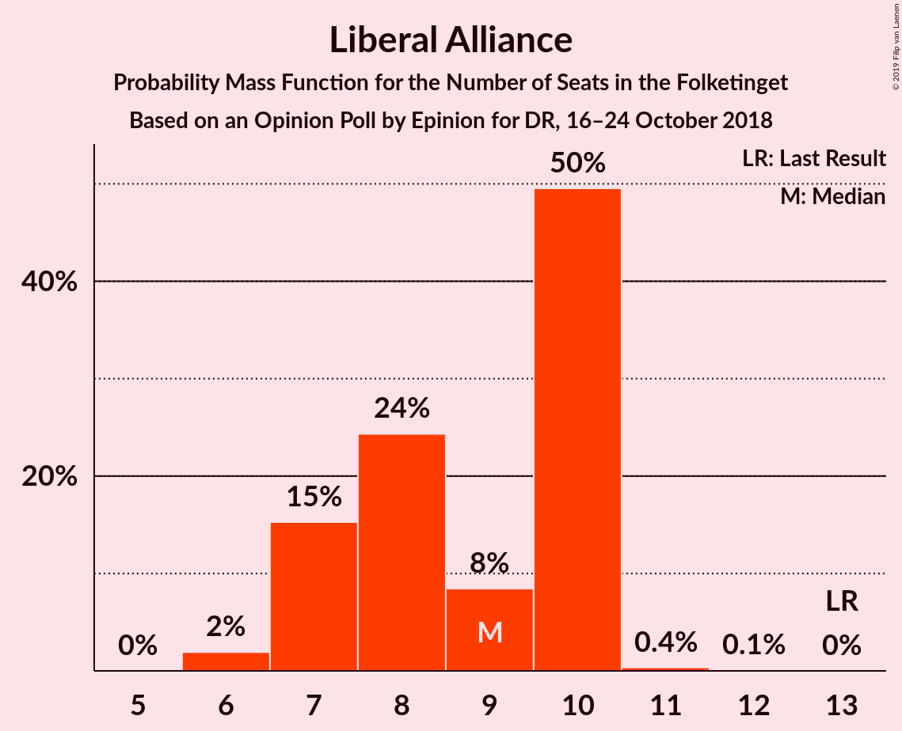
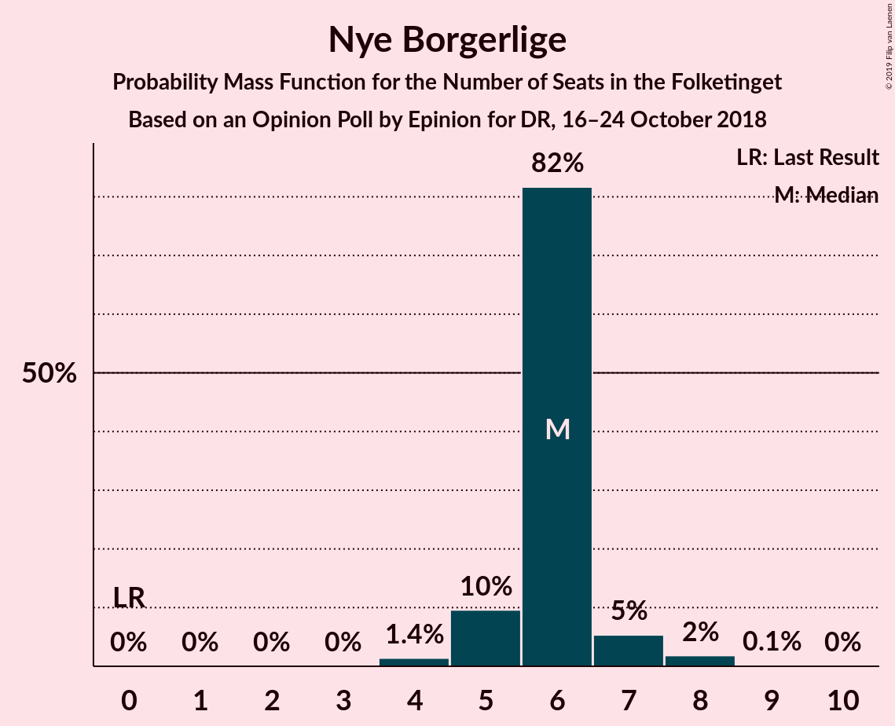

# Opinion Poll by Epinion for DR, 16–24 October 2018

<a href="#voting-intentions">Voting Intentions</a> | <a href="#seats">Seats</a> | <a href="#coalitions">Coalitions</a> | <a href="#technical-information">Technical Information</a>

## Voting Intentions

### Confidence Intervals

| Party | Last Result | Poll Result | 80% Confidence Interval | 90% Confidence Interval | 95% Confidence Interval | 99% Confidence Interval |
|:-----:|:-----------:|:-----------:|:-----------------------:|:-----------------------:|:-----------------------:|:-----------------------:|
| Socialdemokraterne | 26.3% | 27.5% | 26.1–29.0% |25.7–29.4% |25.3–29.8% |24.6–30.5% |
| Dansk Folkeparti | 21.1% | 18.6% | 17.4–19.9% |17.0–20.3% |16.7–20.6% |16.2–21.3% |
| Venstre | 19.5% | 17.8% | 16.6–19.1% |16.3–19.5% |16.0–19.8% |15.4–20.5% |
| Enhedslisten–De Rød-Grønne | 7.8% | 9.1% | 8.2–10.1% |8.0–10.4% |7.8–10.7% |7.4–11.2% |
| Radikale Venstre | 4.6% | 5.0% | 4.4–5.8% |4.2–6.0% |4.0–6.2% |3.7–6.6% |
| Liberal Alliance | 7.5% | 4.8% | 4.2–5.6% |4.0–5.8% |3.8–6.0% |3.6–6.4% |
| Alternativet | 4.8% | 4.7% | 4.1–5.5% |3.9–5.7% |3.7–5.9% |3.4–6.2% |
| Socialistisk Folkeparti | 4.2% | 4.5% | 3.9–5.2% |3.7–5.5% |3.6–5.7% |3.3–6.0% |
| Det Konservative Folkeparti | 3.4% | 4.0% | 3.4–4.8% |3.3–5.0% |3.2–5.1% |2.9–5.5% |
| Nye Borgerlige | 0.0% | 3.4% | 2.9–4.1% |2.7–4.3% |2.6–4.4% |2.3–4.8% |
| Kristendemokraterne | 0.8% | 0.7% | 0.5–1.1% |0.4–1.2% |0.4–1.3% |0.3–1.5% |

*Note:* The poll result column reflects the actual value used in the calculations. Published results may vary slightly, and in addition be rounded to fewer digits.

## Seats

### Confidence Intervals

| Party | Last Result | Median | 80% Confidence Interval | 90% Confidence Interval | 95% Confidence Interval | 99% Confidence Interval |
|:-----:|:-----------:|:------:|:-----------------------:|:-----------------------:|:-----------------------:|:-----------------------:|
| <a href="#socialdemokraterne">Socialdemokraterne</a> | 47 | 43 | 43 |43 |43 |43–45 |
| <a href="#dansk-folkeparti">Dansk Folkeparti</a> | 37 | 32 | 32 |32 |32 |32–36 |
| <a href="#venstre">Venstre</a> | 34 | 33 | 33 |33 |33 |31–33 |
| <a href="#enhedslisten–de-rød-grønne">Enhedslisten–De Rød-Grønne</a> | 14 | 17 | 17 |17 |17 |15–17 |
| <a href="#radikale-venstre">Radikale Venstre</a> | 8 | 10 | 10 |10 |10 |10 |
| <a href="#liberal-alliance">Liberal Alliance</a> | 13 | 10 | 10 |10 |10 |5–10 |
| <a href="#alternativet">Alternativet</a> | 9 | 10 | 10 |10 |10 |9–10 |
| <a href="#socialistisk-folkeparti">Socialistisk Folkeparti</a> | 7 | 8 | 8 |8 |8 |8–9 |
| <a href="#det-konservative-folkeparti">Det Konservative Folkeparti</a> | 6 | 4 | 4 |4 |4 |4–8 |
| <a href="#nye-borgerlige">Nye Borgerlige</a> | 0 | 8 | 8 |8 |8 |7–8 |
| <a href="#kristendemokraterne">Kristendemokraterne</a> | 0 | 0 | 0 |0 |0 |0 |

### Socialdemokraterne

*For a full overview of the results for this party, see the [Socialdemokraterne](party-socialdemokraterne.html) page.*

| Number of Seats | Probability | Accumulated | Special Marks |
|:---------------:|:-----------:|:-----------:|:-------------:|
| 43 | 98.8% | 100% | Median |
| 44 | 0% | 1.2% |  |
| 45 | 1.0% | 1.2% |  |
| 46 | 0.1% | 0.2% |  |
| 47 | 0% | 0.1% | Last Result |
| 48 | 0% | 0.1% |  |
| 49 | 0% | 0.1% |  |
| 50 | 0% | 0.1% |  |
| 51 | 0% | 0.1% |  |
| 52 | 0% | 0% |  |

### Dansk Folkeparti

*For a full overview of the results for this party, see the [Dansk Folkeparti](party-danskfolkeparti.html) page.*

| Number of Seats | Probability | Accumulated | Special Marks |
|:---------------:|:-----------:|:-----------:|:-------------:|
| 32 | 98.6% | 100% | Median |
| 33 | 0% | 1.3% |  |
| 34 | 0% | 1.3% |  |
| 35 | 0% | 1.3% |  |
| 36 | 1.0% | 1.3% |  |
| 37 | 0% | 0.3% | Last Result |
| 38 | 0% | 0.3% |  |
| 39 | 0% | 0.2% |  |
| 40 | 0.2% | 0.2% |  |
| 41 | 0% | 0% |  |

### Venstre

*For a full overview of the results for this party, see the [Venstre](party-venstre.html) page.*

| Number of Seats | Probability | Accumulated | Special Marks |
|:---------------:|:-----------:|:-----------:|:-------------:|
| 30 | 0.2% | 100% |  |
| 31 | 1.0% | 99.8% |  |
| 32 | 0% | 98.8% |  |
| 33 | 98% | 98.8% | Median |
| 34 | 0.2% | 0.3% | Last Result |
| 35 | 0% | 0.1% |  |
| 36 | 0.1% | 0.1% |  |
| 37 | 0% | 0% |  |

### Enhedslisten–De Rød-Grønne

*For a full overview of the results for this party, see the [Enhedslisten–De Rød-Grønne](party-enhedslisten–derød-grønne.html) page.*

| Number of Seats | Probability | Accumulated | Special Marks |
|:---------------:|:-----------:|:-----------:|:-------------:|
| 14 | 0% | 100% | Last Result |
| 15 | 1.0% | 100% |  |
| 16 | 0% | 99.0% |  |
| 17 | 98.8% | 98.9% | Median |
| 18 | 0.1% | 0.2% |  |
| 19 | 0.1% | 0.1% |  |
| 20 | 0% | 0% |  |

### Radikale Venstre

*For a full overview of the results for this party, see the [Radikale Venstre](party-radikalevenstre.html) page.*

| Number of Seats | Probability | Accumulated | Special Marks |
|:---------------:|:-----------:|:-----------:|:-------------:|
| 7 | 0.1% | 100% |  |
| 8 | 0.3% | 99.9% | Last Result |
| 9 | 0% | 99.7% |  |
| 10 | 99.6% | 99.6% | Median |
| 11 | 0% | 0.1% |  |
| 12 | 0% | 0.1% |  |
| 13 | 0% | 0% |  |

### Liberal Alliance

*For a full overview of the results for this party, see the [Liberal Alliance](party-liberalalliance.html) page.*

| Number of Seats | Probability | Accumulated | Special Marks |
|:---------------:|:-----------:|:-----------:|:-------------:|
| 5 | 1.0% | 100% |  |
| 6 | 0.1% | 99.0% |  |
| 7 | 0.1% | 99.0% |  |
| 8 | 0.3% | 98.9% |  |
| 9 | 0% | 98.6% |  |
| 10 | 98.6% | 98.6% | Median |
| 11 | 0% | 0% |  |
| 12 | 0% | 0% |  |
| 13 | 0% | 0% | Last Result |

### Alternativet

*For a full overview of the results for this party, see the [Alternativet](party-alternativet.html) page.*

| Number of Seats | Probability | Accumulated | Special Marks |
|:---------------:|:-----------:|:-----------:|:-------------:|
| 8 | 0.1% | 100% |  |
| 9 | 1.4% | 99.9% | Last Result |
| 10 | 98% | 98% | Median |
| 11 | 0% | 0% |  |

### Socialistisk Folkeparti

*For a full overview of the results for this party, see the [Socialistisk Folkeparti](party-socialistiskfolkeparti.html) page.*

| Number of Seats | Probability | Accumulated | Special Marks |
|:---------------:|:-----------:|:-----------:|:-------------:|
| 4 | 0.2% | 100% |  |
| 5 | 0% | 99.8% |  |
| 6 | 0% | 99.8% |  |
| 7 | 0.1% | 99.7% | Last Result |
| 8 | 98.5% | 99.7% | Median |
| 9 | 1.1% | 1.2% |  |
| 10 | 0% | 0.1% |  |
| 11 | 0.1% | 0.1% |  |
| 12 | 0% | 0% |  |

### Det Konservative Folkeparti

*For a full overview of the results for this party, see the [Det Konservative Folkeparti](party-detkonservativefolkeparti.html) page.*

| Number of Seats | Probability | Accumulated | Special Marks |
|:---------------:|:-----------:|:-----------:|:-------------:|
| 4 | 98% | 100% | Median |
| 5 | 0.1% | 2% |  |
| 6 | 0.3% | 1.4% | Last Result |
| 7 | 0% | 1.2% |  |
| 8 | 1.0% | 1.2% |  |
| 9 | 0% | 0.1% |  |
| 10 | 0.1% | 0.1% |  |
| 11 | 0% | 0% |  |

### Nye Borgerlige

*For a full overview of the results for this party, see the [Nye Borgerlige](party-nyeborgerlige.html) page.*

| Number of Seats | Probability | Accumulated | Special Marks |
|:---------------:|:-----------:|:-----------:|:-------------:|
| 0 | 0.1% | 100% | Last Result |
| 1 | 0% | 99.9% |  |
| 2 | 0% | 99.9% |  |
| 3 | 0% | 99.9% |  |
| 4 | 0.1% | 99.9% |  |
| 5 | 0.1% | 99.8% |  |
| 6 | 0.3% | 99.8% |  |
| 7 | 1.0% | 99.5% |  |
| 8 | 98% | 98.5% | Median |
| 9 | 0% | 0% |  |

### Kristendemokraterne

*For a full overview of the results for this party, see the [Kristendemokraterne](party-kristendemokraterne.html) page.*

| Number of Seats | Probability | Accumulated | Special Marks |
|:---------------:|:-----------:|:-----------:|:-------------:|
| 0 | 100% | 100% | Last Result, Median |

## Coalitions

### Confidence Intervals

| Coalition | Last Result | Median | Majority? | 80% Confidence Interval | 90% Confidence Interval | 95% Confidence Interval | 99% Confidence Interval |
|:---------:|:-----------:|:------:|:---------:|:-----------------------:|:-----------------------:|:-----------------------:|:-----------------------:|
| Socialdemokraterne – Enhedslisten–De Rød-Grønne – Radikale Venstre – Alternativet – Socialistisk Folkeparti | 85 | 88 | 0.2% | 88 | 88 | 88 | 88 |
| Dansk Folkeparti – Venstre – Liberal Alliance – Det Konservative Folkeparti – Nye Borgerlige – Kristendemokraterne | 90 | 87 | 0.3% | 87 | 87 | 87 | 87 |
| Dansk Folkeparti – Venstre – Liberal Alliance – Det Konservative Folkeparti – Nye Borgerlige | 90 | 87 | 0.3% | 87 | 87 | 87 | 87 |
| Dansk Folkeparti – Venstre – Liberal Alliance – Det Konservative Folkeparti – Kristendemokraterne | 90 | 79 | 0% | 79 | 79 | 79 | 79–80 |
| Dansk Folkeparti – Venstre – Liberal Alliance – Det Konservative Folkeparti | 90 | 79 | 0% | 79 | 79 | 79 | 79–80 |
| Socialdemokraterne – Enhedslisten–De Rød-Grønne – Radikale Venstre – Socialistisk Folkeparti | 76 | 78 | 0% | 78 | 78 | 78 | 78–79 |

### Socialdemokraterne – Enhedslisten–De Rød-Grønne – Radikale Venstre – Alternativet – Socialistisk Folkeparti

| Number of Seats | Probability | Accumulated | Special Marks |
|:---------------:|:-----------:|:-----------:|:-------------:|
| 81 | 0.3% | 100% |  |
| 82 | 0% | 99.7% |  |
| 83 | 0% | 99.7% |  |
| 84 | 0% | 99.7% |  |
| 85 | 0% | 99.7% | Last Result |
| 86 | 0% | 99.7% |  |
| 87 | 0.1% | 99.7% |  |
| 88 | 99.5% | 99.7% | Median |
| 89 | 0% | 0.2% |  |
| 90 | 0% | 0.2% | Majority |
| 91 | 0.1% | 0.2% |  |
| 92 | 0% | 0.1% |  |
| 93 | 0.1% | 0.1% |  |
| 94 | 0% | 0% |  |

### Dansk Folkeparti – Venstre – Liberal Alliance – Det Konservative Folkeparti – Nye Borgerlige – Kristendemokraterne

| Number of Seats | Probability | Accumulated | Special Marks |
|:---------------:|:-----------:|:-----------:|:-------------:|
| 82 | 0.1% | 100% |  |
| 83 | 0% | 99.9% |  |
| 84 | 0.1% | 99.9% |  |
| 85 | 0% | 99.8% |  |
| 86 | 0% | 99.8% |  |
| 87 | 99.5% | 99.8% | Median |
| 88 | 0.1% | 0.3% |  |
| 89 | 0% | 0.3% |  |
| 90 | 0% | 0.3% | Last Result, Majority |
| 91 | 0% | 0.3% |  |
| 92 | 0% | 0.3% |  |
| 93 | 0% | 0.3% |  |
| 94 | 0.3% | 0.3% |  |
| 95 | 0% | 0% |  |

### Dansk Folkeparti – Venstre – Liberal Alliance – Det Konservative Folkeparti – Nye Borgerlige

| Number of Seats | Probability | Accumulated | Special Marks |
|:---------------:|:-----------:|:-----------:|:-------------:|
| 82 | 0.1% | 100% |  |
| 83 | 0% | 99.9% |  |
| 84 | 0.1% | 99.9% |  |
| 85 | 0% | 99.8% |  |
| 86 | 0% | 99.8% |  |
| 87 | 99.5% | 99.8% | Median |
| 88 | 0.1% | 0.3% |  |
| 89 | 0% | 0.3% |  |
| 90 | 0% | 0.3% | Last Result, Majority |
| 91 | 0% | 0.3% |  |
| 92 | 0% | 0.3% |  |
| 93 | 0% | 0.3% |  |
| 94 | 0.3% | 0.3% |  |
| 95 | 0% | 0% |  |

### Dansk Folkeparti – Venstre – Liberal Alliance – Det Konservative Folkeparti – Kristendemokraterne

| Number of Seats | Probability | Accumulated | Special Marks |
|:---------------:|:-----------:|:-----------:|:-------------:|
| 79 | 98% | 100% | Median |
| 80 | 1.0% | 1.5% |  |
| 81 | 0% | 0.4% |  |
| 82 | 0.1% | 0.4% |  |
| 83 | 0.1% | 0.3% |  |
| 84 | 0% | 0.3% |  |
| 85 | 0% | 0.3% |  |
| 86 | 0% | 0.3% |  |
| 87 | 0% | 0.3% |  |
| 88 | 0.2% | 0.2% |  |
| 89 | 0% | 0% |  |
| 90 | 0% | 0% | Last Result, Majority |

### Dansk Folkeparti – Venstre – Liberal Alliance – Det Konservative Folkeparti

| Number of Seats | Probability | Accumulated | Special Marks |
|:---------------:|:-----------:|:-----------:|:-------------:|
| 79 | 98% | 100% | Median |
| 80 | 1.0% | 1.5% |  |
| 81 | 0% | 0.4% |  |
| 82 | 0.1% | 0.4% |  |
| 83 | 0.1% | 0.3% |  |
| 84 | 0% | 0.3% |  |
| 85 | 0% | 0.3% |  |
| 86 | 0% | 0.3% |  |
| 87 | 0% | 0.3% |  |
| 88 | 0.2% | 0.2% |  |
| 89 | 0% | 0% |  |
| 90 | 0% | 0% | Last Result, Majority |

### Socialdemokraterne – Enhedslisten–De Rød-Grønne – Radikale Venstre – Socialistisk Folkeparti

| Number of Seats | Probability | Accumulated | Special Marks |
|:---------------:|:-----------:|:-----------:|:-------------:|
| 72 | 0.3% | 100% |  |
| 73 | 0% | 99.7% |  |
| 74 | 0% | 99.7% |  |
| 75 | 0% | 99.7% |  |
| 76 | 0% | 99.7% | Last Result |
| 77 | 0% | 99.7% |  |
| 78 | 98% | 99.7% | Median |
| 79 | 1.0% | 1.3% |  |
| 80 | 0% | 0.2% |  |
| 81 | 0% | 0.2% |  |
| 82 | 0% | 0.2% |  |
| 83 | 0% | 0.2% |  |
| 84 | 0.1% | 0.1% |  |
| 85 | 0% | 0% |  |

## Technical Information

### Opinion Poll

+ **Polling firm:** Epinion
+ **Commissioner(s):** DR
+ **Fieldwork period:** 16–24 October 2018

### Calculations

+ **Sample size:** 1538
+ **Simulations done:** 1,024
+ **Error estimate:** 2.42%

