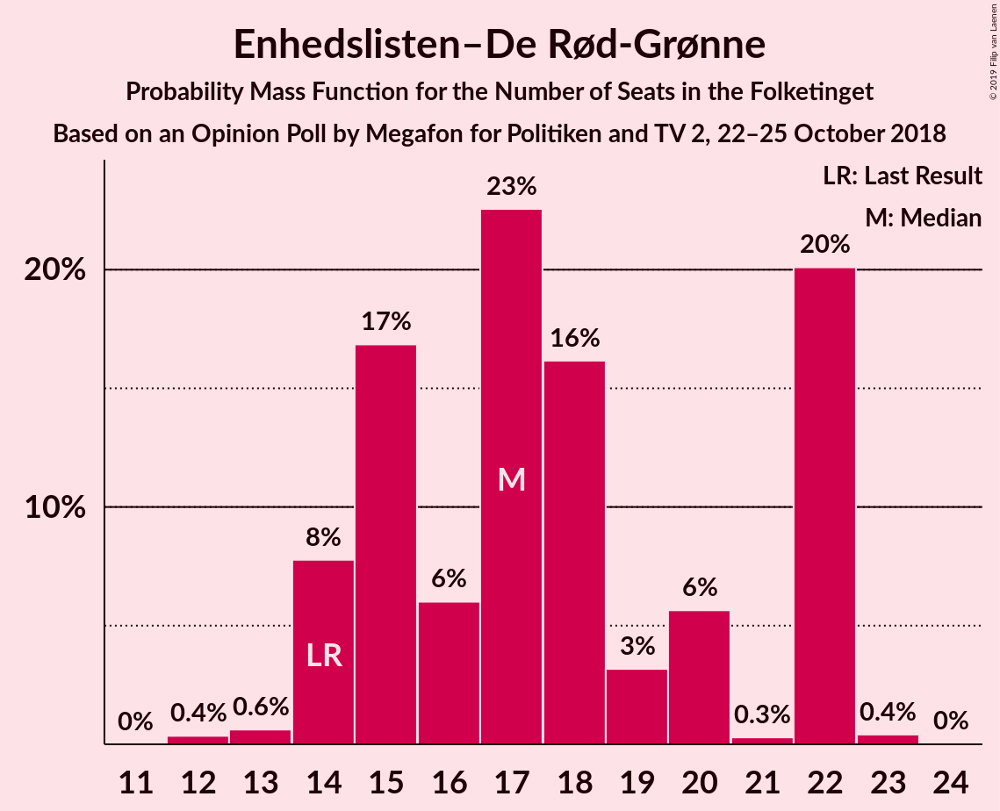

# Opinion Poll by Megafon for Politiken and TV 2, 22–25 October 2018

<a href="#voting-intentions">Voting Intentions</a> | <a href="#seats">Seats</a> | <a href="#coalitions">Coalitions</a> | <a href="#technical-information">Technical Information</a>

## Voting Intentions

### Confidence Intervals

| Party | Last Result | Poll Result | 80% Confidence Interval | 90% Confidence Interval | 95% Confidence Interval | 99% Confidence Interval |
|:-----:|:-----------:|:-----------:|:-----------------------:|:-----------------------:|:-----------------------:|:-----------------------:|
| Socialdemokraterne | 26.3% | 22.6% | 20.9–24.5% |20.4–25.1% |20.0–25.5% |19.2–26.5% |
| Venstre | 19.5% | 19.0% | 17.3–20.8% |16.9–21.3% |16.5–21.7% |15.7–22.6% |
| Dansk Folkeparti | 21.1% | 14.8% | 13.4–16.5% |13.0–16.9% |12.6–17.4% |11.9–18.2% |
| Enhedslisten–De Rød-Grønne | 7.8% | 9.7% | 8.5–11.1% |8.1–11.5% |7.9–11.8% |7.3–12.5% |
| Radikale Venstre | 4.6% | 9.7% | 8.5–11.1% |8.1–11.5% |7.9–11.8% |7.3–12.5% |
| Socialistisk Folkeparti | 4.2% | 7.0% | 6.0–8.2% |5.7–8.6% |5.5–8.9% |5.0–9.5% |
| Det Konservative Folkeparti | 3.4% | 5.3% | 4.4–6.4% |4.2–6.7% |4.0–7.0% |3.6–7.6% |
| Liberal Alliance | 7.5% | 4.5% | 3.7–5.5% |3.5–5.8% |3.3–6.1% |3.0–6.6% |
| Alternativet | 4.8% | 4.0% | 3.3–5.0% |3.1–5.3% |2.9–5.5% |2.6–6.1% |
| Nye Borgerlige | 0.0% | 2.6% | 2.1–3.5% |1.9–3.7% |1.8–3.9% |1.5–4.4% |
| Kristendemokraterne | 0.8% | 0.7% | 0.4–1.2% |0.4–1.4% |0.3–1.5% |0.2–1.8% |

*Note:* The poll result column reflects the actual value used in the calculations. Published results may vary slightly, and in addition be rounded to fewer digits.

## Seats

### Confidence Intervals

| Party | Last Result | Median | 80% Confidence Interval | 90% Confidence Interval | 95% Confidence Interval | 99% Confidence Interval |
|:-----:|:-----------:|:------:|:-----------------------:|:-----------------------:|:-----------------------:|:-----------------------:|
| <a href="#socialdemokraterne">Socialdemokraterne</a> | 47 | 39 | 36–44 |36–45 |35–45 |34–47 |
| <a href="#venstre">Venstre</a> | 34 | 34 | 31–35 |28–37 |28–38 |28–39 |
| <a href="#dansk-folkeparti">Dansk Folkeparti</a> | 37 | 25 | 23–28 |22–29 |20–29 |20–31 |
| <a href="#enhedslisten–de-rød-grønne">Enhedslisten–De Rød-Grønne</a> | 14 | 17 | 15–22 |14–22 |14–22 |13–22 |
| <a href="#radikale-venstre">Radikale Venstre</a> | 8 | 17 | 15–20 |14–21 |13–21 |13–21 |
| <a href="#socialistisk-folkeparti">Socialistisk Folkeparti</a> | 7 | 12 | 10–14 |10–15 |9–15 |9–16 |
| <a href="#det-konservative-folkeparti">Det Konservative Folkeparti</a> | 6 | 9 | 8–12 |8–12 |7–12 |7–13 |
| <a href="#liberal-alliance">Liberal Alliance</a> | 13 | 8 | 7–9 |6–10 |6–10 |5–12 |
| <a href="#alternativet">Alternativet</a> | 9 | 8 | 6–9 |6–9 |5–9 |5–11 |
| <a href="#nye-borgerlige">Nye Borgerlige</a> | 0 | 5 | 4–6 |0–7 |0–7 |0–7 |
| <a href="#kristendemokraterne">Kristendemokraterne</a> | 0 | 0 | 0 |0 |0 |0 |

### Socialdemokraterne

*For a full overview of the results for this party, see the [Socialdemokraterne](party-socialdemokraterne.html) page.*

| Number of Seats | Probability | Accumulated | Special Marks |
|:---------------:|:-----------:|:-----------:|:-------------:|
| 32 | 0.1% | 100% |  |
| 33 | 0.3% | 99.9% |  |
| 34 | 1.3% | 99.6% |  |
| 35 | 3% | 98% |  |
| 36 | 8% | 96% |  |
| 37 | 22% | 88% |  |
| 38 | 12% | 66% |  |
| 39 | 5% | 54% | Median |
| 40 | 8% | 49% |  |
| 41 | 14% | 41% |  |
| 42 | 7% | 27% |  |
| 43 | 9% | 20% |  |
| 44 | 4% | 11% |  |
| 45 | 6% | 7% |  |
| 46 | 0.1% | 0.7% |  |
| 47 | 0.5% | 0.6% | Last Result |
| 48 | 0% | 0.1% |  |
| 49 | 0% | 0% |  |

### Venstre

*For a full overview of the results for this party, see the [Venstre](party-venstre.html) page.*

| Number of Seats | Probability | Accumulated | Special Marks |
|:---------------:|:-----------:|:-----------:|:-------------:|
| 27 | 0.1% | 100% |  |
| 28 | 7% | 99.8% |  |
| 29 | 1.0% | 93% |  |
| 30 | 1.3% | 92% |  |
| 31 | 15% | 91% |  |
| 32 | 5% | 76% |  |
| 33 | 20% | 71% |  |
| 34 | 20% | 51% | Last Result, Median |
| 35 | 23% | 31% |  |
| 36 | 3% | 9% |  |
| 37 | 1.0% | 5% |  |
| 38 | 3% | 5% |  |
| 39 | 1.4% | 2% |  |
| 40 | 0.1% | 0.2% |  |
| 41 | 0% | 0.2% |  |
| 42 | 0.1% | 0.1% |  |
| 43 | 0% | 0% |  |

### Dansk Folkeparti

*For a full overview of the results for this party, see the [Dansk Folkeparti](party-danskfolkeparti.html) page.*

| Number of Seats | Probability | Accumulated | Special Marks |
|:---------------:|:-----------:|:-----------:|:-------------:|
| 20 | 4% | 100% |  |
| 21 | 0.3% | 96% |  |
| 22 | 0.9% | 96% |  |
| 23 | 7% | 95% |  |
| 24 | 24% | 87% |  |
| 25 | 16% | 64% | Median |
| 26 | 9% | 48% |  |
| 27 | 13% | 39% |  |
| 28 | 17% | 26% |  |
| 29 | 6% | 9% |  |
| 30 | 2% | 2% |  |
| 31 | 0.2% | 0.5% |  |
| 32 | 0.2% | 0.3% |  |
| 33 | 0.1% | 0.1% |  |
| 34 | 0% | 0% |  |
| 35 | 0% | 0% |  |
| 36 | 0% | 0% |  |
| 37 | 0% | 0% | Last Result |

### Enhedslisten–De Rød-Grønne

*For a full overview of the results for this party, see the [Enhedslisten–De Rød-Grønne](party-enhedslisten–derød-grønne.html) page.*

| Number of Seats | Probability | Accumulated | Special Marks |
|:---------------:|:-----------:|:-----------:|:-------------:|
| 12 | 0.4% | 100% |  |
| 13 | 0.6% | 99.6% |  |
| 14 | 8% | 99.0% | Last Result |
| 15 | 17% | 91% |  |
| 16 | 6% | 74% |  |
| 17 | 23% | 68% | Median |
| 18 | 16% | 46% |  |
| 19 | 3% | 30% |  |
| 20 | 6% | 26% |  |
| 21 | 0.3% | 21% |  |
| 22 | 20% | 21% |  |
| 23 | 0.4% | 0.4% |  |
| 24 | 0% | 0% |  |

### Radikale Venstre

*For a full overview of the results for this party, see the [Radikale Venstre](party-radikalevenstre.html) page.*

| Number of Seats | Probability | Accumulated | Special Marks |
|:---------------:|:-----------:|:-----------:|:-------------:|
| 8 | 0% | 100% | Last Result |
| 9 | 0% | 100% |  |
| 10 | 0% | 100% |  |
| 11 | 0% | 100% |  |
| 12 | 0.1% | 100% |  |
| 13 | 3% | 99.9% |  |
| 14 | 3% | 97% |  |
| 15 | 12% | 94% |  |
| 16 | 18% | 82% |  |
| 17 | 26% | 65% | Median |
| 18 | 13% | 39% |  |
| 19 | 11% | 26% |  |
| 20 | 7% | 15% |  |
| 21 | 7% | 8% |  |
| 22 | 0.3% | 0.4% |  |
| 23 | 0.1% | 0.1% |  |
| 24 | 0% | 0% |  |

### Socialistisk Folkeparti

*For a full overview of the results for this party, see the [Socialistisk Folkeparti](party-socialistiskfolkeparti.html) page.*

| Number of Seats | Probability | Accumulated | Special Marks |
|:---------------:|:-----------:|:-----------:|:-------------:|
| 7 | 0% | 100% | Last Result |
| 8 | 0.1% | 100% |  |
| 9 | 5% | 99.9% |  |
| 10 | 10% | 95% |  |
| 11 | 34% | 85% |  |
| 12 | 11% | 51% | Median |
| 13 | 25% | 40% |  |
| 14 | 8% | 16% |  |
| 15 | 6% | 8% |  |
| 16 | 1.4% | 2% |  |
| 17 | 0.1% | 0.2% |  |
| 18 | 0.1% | 0.1% |  |
| 19 | 0% | 0% |  |

### Det Konservative Folkeparti

*For a full overview of the results for this party, see the [Det Konservative Folkeparti](party-detkonservativefolkeparti.html) page.*

| Number of Seats | Probability | Accumulated | Special Marks |
|:---------------:|:-----------:|:-----------:|:-------------:|
| 6 | 0.3% | 100% | Last Result |
| 7 | 4% | 99.7% |  |
| 8 | 6% | 96% |  |
| 9 | 51% | 90% | Median |
| 10 | 20% | 39% |  |
| 11 | 8% | 19% |  |
| 12 | 11% | 11% |  |
| 13 | 0.3% | 0.7% |  |
| 14 | 0.3% | 0.4% |  |
| 15 | 0% | 0.1% |  |
| 16 | 0% | 0% |  |

### Liberal Alliance

*For a full overview of the results for this party, see the [Liberal Alliance](party-liberalalliance.html) page.*

| Number of Seats | Probability | Accumulated | Special Marks |
|:---------------:|:-----------:|:-----------:|:-------------:|
| 5 | 0.9% | 100% |  |
| 6 | 7% | 99.1% |  |
| 7 | 38% | 93% |  |
| 8 | 20% | 54% | Median |
| 9 | 27% | 35% |  |
| 10 | 5% | 8% |  |
| 11 | 2% | 2% |  |
| 12 | 0.8% | 0.8% |  |
| 13 | 0.1% | 0.1% | Last Result |
| 14 | 0% | 0% |  |

### Alternativet

*For a full overview of the results for this party, see the [Alternativet](party-alternativet.html) page.*

| Number of Seats | Probability | Accumulated | Special Marks |
|:---------------:|:-----------:|:-----------:|:-------------:|
| 4 | 0.1% | 100% |  |
| 5 | 3% | 99.9% |  |
| 6 | 22% | 97% |  |
| 7 | 21% | 74% |  |
| 8 | 38% | 54% | Median |
| 9 | 14% | 16% | Last Result |
| 10 | 1.0% | 2% |  |
| 11 | 1.4% | 1.5% |  |
| 12 | 0.1% | 0.1% |  |
| 13 | 0% | 0% |  |

### Nye Borgerlige

*For a full overview of the results for this party, see the [Nye Borgerlige](party-nyeborgerlige.html) page.*

| Number of Seats | Probability | Accumulated | Special Marks |
|:---------------:|:-----------:|:-----------:|:-------------:|
| 0 | 7% | 100% | Last Result |
| 1 | 0% | 93% |  |
| 2 | 0% | 93% |  |
| 3 | 0.1% | 93% |  |
| 4 | 31% | 93% |  |
| 5 | 42% | 62% | Median |
| 6 | 12% | 21% |  |
| 7 | 9% | 9% |  |
| 8 | 0.1% | 0.2% |  |
| 9 | 0.1% | 0.1% |  |
| 10 | 0% | 0% |  |

### Kristendemokraterne

*For a full overview of the results for this party, see the [Kristendemokraterne](party-kristendemokraterne.html) page.*

| Number of Seats | Probability | Accumulated | Special Marks |
|:---------------:|:-----------:|:-----------:|:-------------:|
| 0 | 99.9% | 100% | Last Result, Median |
| 1 | 0% | 0.1% |  |
| 2 | 0% | 0.1% |  |
| 3 | 0% | 0.1% |  |
| 4 | 0.1% | 0.1% |  |
| 5 | 0% | 0% |  |

## Coalitions

### Confidence Intervals

| Coalition | Last Result | Median | Majority? | 80% Confidence Interval | 90% Confidence Interval | 95% Confidence Interval | 99% Confidence Interval |
|:---------:|:-----------:|:------:|:---------:|:-----------------------:|:-----------------------:|:-----------------------:|:-----------------------:|
| Socialdemokraterne – Enhedslisten–De Rød-Grønne – Radikale Venstre – Socialistisk Folkeparti – Alternativet | 85 | 95 | 95% | 91–97 | 89–99 | 89–99 | 87–101 |
| Socialdemokraterne – Enhedslisten–De Rød-Grønne – Radikale Venstre – Socialistisk Folkeparti | 76 | 87 | 17% | 82–91 | 82–92 | 81–92 | 80–95 |
| Venstre – Dansk Folkeparti – Det Konservative Folkeparti – Liberal Alliance – Nye Borgerlige – Kristendemokraterne | 90 | 80 | 0.1% | 78–84 | 76–86 | 76–86 | 74–88 |
| Venstre – Dansk Folkeparti – Det Konservative Folkeparti – Liberal Alliance – Nye Borgerlige | 90 | 80 | 0.1% | 78–84 | 76–86 | 76–86 | 74–88 |
| Venstre – Dansk Folkeparti – Det Konservative Folkeparti – Liberal Alliance – Kristendemokraterne | 90 | 75 | 0% | 74–79 | 71–80 | 71–82 | 69–85 |
| Venstre – Dansk Folkeparti – Det Konservative Folkeparti – Liberal Alliance | 90 | 75 | 0% | 74–79 | 71–80 | 71–82 | 69–85 |
| Socialdemokraterne – Radikale Venstre – Socialistisk Folkeparti | 62 | 69 | 0% | 65–74 | 65–74 | 65–74 | 62–78 |
| Socialdemokraterne – Radikale Venstre | 55 | 57 | 0% | 54–61 | 53–63 | 51–63 | 50–64 |
| Venstre – Det Konservative Folkeparti – Liberal Alliance | 53 | 51 | 0% | 47–54 | 47–55 | 46–56 | 44–57 |
| Venstre – Det Konservative Folkeparti | 40 | 44 | 0% | 40–46 | 38–46 | 37–47 | 36–49 |
| Venstre | 34 | 34 | 0% | 31–35 | 28–37 | 28–38 | 28–39 |

### Socialdemokraterne – Enhedslisten–De Rød-Grønne – Radikale Venstre – Socialistisk Folkeparti – Alternativet

| Number of Seats | Probability | Accumulated | Special Marks |
|:---------------:|:-----------:|:-----------:|:-------------:|
| 85 | 0.1% | 100% | Last Result |
| 86 | 0.3% | 99.9% |  |
| 87 | 0.9% | 99.6% |  |
| 88 | 0.5% | 98.6% |  |
| 89 | 3% | 98% |  |
| 90 | 5% | 95% | Majority |
| 91 | 9% | 90% |  |
| 92 | 16% | 82% |  |
| 93 | 6% | 66% | Median |
| 94 | 9% | 60% |  |
| 95 | 23% | 51% |  |
| 96 | 17% | 29% |  |
| 97 | 2% | 12% |  |
| 98 | 2% | 9% |  |
| 99 | 5% | 7% |  |
| 100 | 0.8% | 2% |  |
| 101 | 1.1% | 1.3% |  |
| 102 | 0.1% | 0.2% |  |
| 103 | 0.1% | 0.1% |  |
| 104 | 0% | 0% |  |

### Socialdemokraterne – Enhedslisten–De Rød-Grønne – Radikale Venstre – Socialistisk Folkeparti

| Number of Seats | Probability | Accumulated | Special Marks |
|:---------------:|:-----------:|:-----------:|:-------------:|
| 76 | 0% | 100% | Last Result |
| 77 | 0% | 99.9% |  |
| 78 | 0.1% | 99.9% |  |
| 79 | 0.2% | 99.8% |  |
| 80 | 0.6% | 99.6% |  |
| 81 | 4% | 99.0% |  |
| 82 | 8% | 95% |  |
| 83 | 3% | 87% |  |
| 84 | 13% | 84% |  |
| 85 | 4% | 72% | Median |
| 86 | 9% | 68% |  |
| 87 | 29% | 59% |  |
| 88 | 7% | 30% |  |
| 89 | 6% | 23% |  |
| 90 | 7% | 17% | Majority |
| 91 | 4% | 10% |  |
| 92 | 4% | 6% |  |
| 93 | 1.2% | 2% |  |
| 94 | 0.1% | 0.8% |  |
| 95 | 0.6% | 0.7% |  |
| 96 | 0% | 0.1% |  |
| 97 | 0% | 0% |  |

### Venstre – Dansk Folkeparti – Det Konservative Folkeparti – Liberal Alliance – Nye Borgerlige – Kristendemokraterne

| Number of Seats | Probability | Accumulated | Special Marks |
|:---------------:|:-----------:|:-----------:|:-------------:|
| 72 | 0.1% | 100% |  |
| 73 | 0.1% | 99.9% |  |
| 74 | 1.1% | 99.8% |  |
| 75 | 0.8% | 98.7% |  |
| 76 | 5% | 98% |  |
| 77 | 2% | 93% |  |
| 78 | 2% | 91% |  |
| 79 | 17% | 88% |  |
| 80 | 23% | 71% |  |
| 81 | 9% | 49% | Median |
| 82 | 6% | 40% |  |
| 83 | 16% | 34% |  |
| 84 | 9% | 18% |  |
| 85 | 5% | 10% |  |
| 86 | 3% | 5% |  |
| 87 | 0.5% | 2% |  |
| 88 | 0.9% | 1.4% |  |
| 89 | 0.3% | 0.4% |  |
| 90 | 0.1% | 0.1% | Last Result, Majority |
| 91 | 0% | 0% |  |

### Venstre – Dansk Folkeparti – Det Konservative Folkeparti – Liberal Alliance – Nye Borgerlige

| Number of Seats | Probability | Accumulated | Special Marks |
|:---------------:|:-----------:|:-----------:|:-------------:|
| 72 | 0.1% | 100% |  |
| 73 | 0.1% | 99.9% |  |
| 74 | 1.1% | 99.8% |  |
| 75 | 0.8% | 98.7% |  |
| 76 | 5% | 98% |  |
| 77 | 2% | 93% |  |
| 78 | 2% | 91% |  |
| 79 | 17% | 88% |  |
| 80 | 23% | 71% |  |
| 81 | 9% | 49% | Median |
| 82 | 6% | 40% |  |
| 83 | 16% | 34% |  |
| 84 | 9% | 18% |  |
| 85 | 5% | 10% |  |
| 86 | 3% | 5% |  |
| 87 | 0.5% | 2% |  |
| 88 | 0.9% | 1.4% |  |
| 89 | 0.3% | 0.4% |  |
| 90 | 0.1% | 0.1% | Last Result, Majority |
| 91 | 0% | 0% |  |

### Venstre – Dansk Folkeparti – Det Konservative Folkeparti – Liberal Alliance – Kristendemokraterne

| Number of Seats | Probability | Accumulated | Special Marks |
|:---------------:|:-----------:|:-----------:|:-------------:|
| 68 | 0% | 100% |  |
| 69 | 0.7% | 99.9% |  |
| 70 | 0.7% | 99.2% |  |
| 71 | 4% | 98% |  |
| 72 | 4% | 95% |  |
| 73 | 0.6% | 91% |  |
| 74 | 5% | 90% |  |
| 75 | 37% | 85% |  |
| 76 | 6% | 48% | Median |
| 77 | 3% | 42% |  |
| 78 | 12% | 40% |  |
| 79 | 19% | 28% |  |
| 80 | 4% | 9% |  |
| 81 | 0.4% | 4% |  |
| 82 | 1.3% | 4% |  |
| 83 | 2% | 2% |  |
| 84 | 0.1% | 0.7% |  |
| 85 | 0.5% | 0.6% |  |
| 86 | 0.1% | 0.1% |  |
| 87 | 0% | 0% |  |
| 88 | 0% | 0% |  |
| 89 | 0% | 0% |  |
| 90 | 0% | 0% | Last Result, Majority |

### Venstre – Dansk Folkeparti – Det Konservative Folkeparti – Liberal Alliance

| Number of Seats | Probability | Accumulated | Special Marks |
|:---------------:|:-----------:|:-----------:|:-------------:|
| 68 | 0% | 100% |  |
| 69 | 0.7% | 99.9% |  |
| 70 | 0.7% | 99.2% |  |
| 71 | 4% | 98% |  |
| 72 | 4% | 95% |  |
| 73 | 0.6% | 91% |  |
| 74 | 5% | 90% |  |
| 75 | 37% | 85% |  |
| 76 | 6% | 48% | Median |
| 77 | 3% | 42% |  |
| 78 | 12% | 40% |  |
| 79 | 19% | 28% |  |
| 80 | 4% | 8% |  |
| 81 | 0.4% | 4% |  |
| 82 | 1.3% | 4% |  |
| 83 | 2% | 2% |  |
| 84 | 0.1% | 0.7% |  |
| 85 | 0.5% | 0.6% |  |
| 86 | 0.1% | 0.1% |  |
| 87 | 0% | 0% |  |
| 88 | 0% | 0% |  |
| 89 | 0% | 0% |  |
| 90 | 0% | 0% | Last Result, Majority |

### Socialdemokraterne – Radikale Venstre – Socialistisk Folkeparti

| Number of Seats | Probability | Accumulated | Special Marks |
|:---------------:|:-----------:|:-----------:|:-------------:|
| 60 | 0.2% | 100% |  |
| 61 | 0.1% | 99.8% |  |
| 62 | 0.3% | 99.7% | Last Result |
| 63 | 0.5% | 99.4% |  |
| 64 | 0.7% | 99.0% |  |
| 65 | 26% | 98% |  |
| 66 | 1.4% | 72% |  |
| 67 | 18% | 71% |  |
| 68 | 2% | 53% | Median |
| 69 | 5% | 51% |  |
| 70 | 14% | 45% |  |
| 71 | 0.9% | 32% |  |
| 72 | 19% | 31% |  |
| 73 | 1.1% | 12% |  |
| 74 | 9% | 10% |  |
| 75 | 0.4% | 2% |  |
| 76 | 0.2% | 1.4% |  |
| 77 | 0.3% | 1.2% |  |
| 78 | 0.8% | 0.9% |  |
| 79 | 0% | 0.1% |  |
| 80 | 0% | 0% |  |

### Socialdemokraterne – Radikale Venstre

| Number of Seats | Probability | Accumulated | Special Marks |
|:---------------:|:-----------:|:-----------:|:-------------:|
| 47 | 0.2% | 100% |  |
| 48 | 0% | 99.8% |  |
| 49 | 0.2% | 99.8% |  |
| 50 | 0.6% | 99.6% |  |
| 51 | 2% | 99.1% |  |
| 52 | 0.6% | 97% |  |
| 53 | 2% | 96% |  |
| 54 | 33% | 94% |  |
| 55 | 2% | 60% | Last Result |
| 56 | 5% | 58% | Median |
| 57 | 14% | 54% |  |
| 58 | 3% | 40% |  |
| 59 | 18% | 37% |  |
| 60 | 6% | 19% |  |
| 61 | 5% | 13% |  |
| 62 | 0.8% | 8% |  |
| 63 | 6% | 7% |  |
| 64 | 0.5% | 0.8% |  |
| 65 | 0.2% | 0.3% |  |
| 66 | 0.1% | 0.1% |  |
| 67 | 0% | 0% |  |

### Venstre – Det Konservative Folkeparti – Liberal Alliance

| Number of Seats | Probability | Accumulated | Special Marks |
|:---------------:|:-----------:|:-----------:|:-------------:|
| 42 | 0.1% | 100% |  |
| 43 | 0% | 99.9% |  |
| 44 | 0.5% | 99.9% |  |
| 45 | 0.8% | 99.3% |  |
| 46 | 2% | 98.5% |  |
| 47 | 9% | 97% |  |
| 48 | 3% | 88% |  |
| 49 | 14% | 85% |  |
| 50 | 8% | 71% |  |
| 51 | 38% | 64% | Median |
| 52 | 5% | 26% |  |
| 53 | 9% | 21% | Last Result |
| 54 | 6% | 12% |  |
| 55 | 2% | 6% |  |
| 56 | 3% | 4% |  |
| 57 | 1.0% | 1.3% |  |
| 58 | 0.1% | 0.3% |  |
| 59 | 0% | 0.1% |  |
| 60 | 0% | 0.1% |  |
| 61 | 0.1% | 0.1% |  |
| 62 | 0% | 0% |  |

### Venstre – Det Konservative Folkeparti

| Number of Seats | Probability | Accumulated | Special Marks |
|:---------------:|:-----------:|:-----------:|:-------------:|
| 34 | 0.1% | 100% |  |
| 35 | 0% | 99.9% |  |
| 36 | 2% | 99.9% |  |
| 37 | 0.7% | 98% |  |
| 38 | 5% | 97% |  |
| 39 | 2% | 92% |  |
| 40 | 13% | 91% | Last Result |
| 41 | 4% | 78% |  |
| 42 | 15% | 74% |  |
| 43 | 9% | 59% | Median |
| 44 | 30% | 51% |  |
| 45 | 7% | 21% |  |
| 46 | 10% | 14% |  |
| 47 | 0.9% | 3% |  |
| 48 | 2% | 2% |  |
| 49 | 0.5% | 0.8% |  |
| 50 | 0.1% | 0.3% |  |
| 51 | 0.1% | 0.2% |  |
| 52 | 0% | 0.1% |  |
| 53 | 0.1% | 0.1% |  |
| 54 | 0% | 0% |  |

### Venstre

| Number of Seats | Probability | Accumulated | Special Marks |
|:---------------:|:-----------:|:-----------:|:-------------:|
| 27 | 0.1% | 100% |  |
| 28 | 7% | 99.8% |  |
| 29 | 1.0% | 93% |  |
| 30 | 1.3% | 92% |  |
| 31 | 15% | 91% |  |
| 32 | 5% | 76% |  |
| 33 | 20% | 71% |  |
| 34 | 20% | 51% | Last Result, Median |
| 35 | 23% | 31% |  |
| 36 | 3% | 9% |  |
| 37 | 1.0% | 5% |  |
| 38 | 3% | 5% |  |
| 39 | 1.4% | 2% |  |
| 40 | 0.1% | 0.2% |  |
| 41 | 0% | 0.2% |  |
| 42 | 0.1% | 0.1% |  |
| 43 | 0% | 0% |  |

## Technical Information

### Opinion Poll

+ **Polling firm:** Megafon
+ **Commissioner(s):** Politiken and TV 2
+ **Fieldwork period:** 22–25 October 2018

### Calculations

+ **Sample size:** 870
+ **Simulations done:** 1,048,575
+ **Error estimate:** 3.55%

