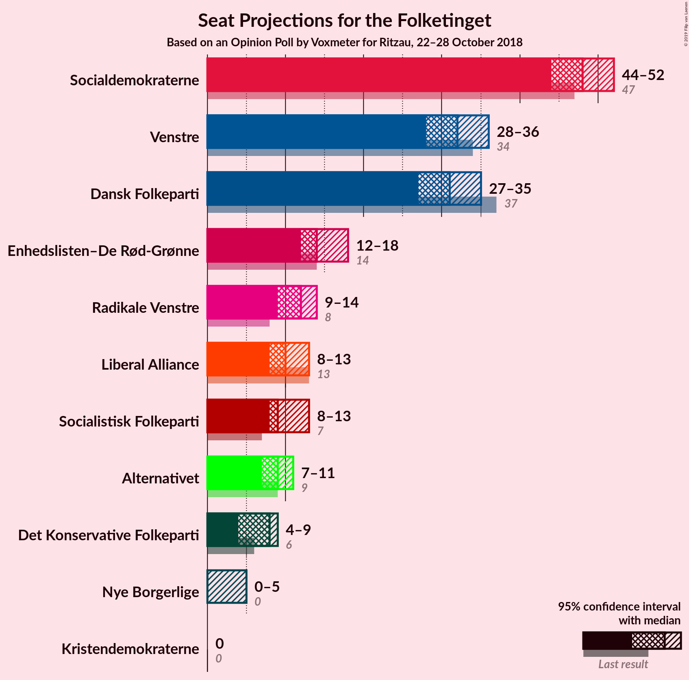
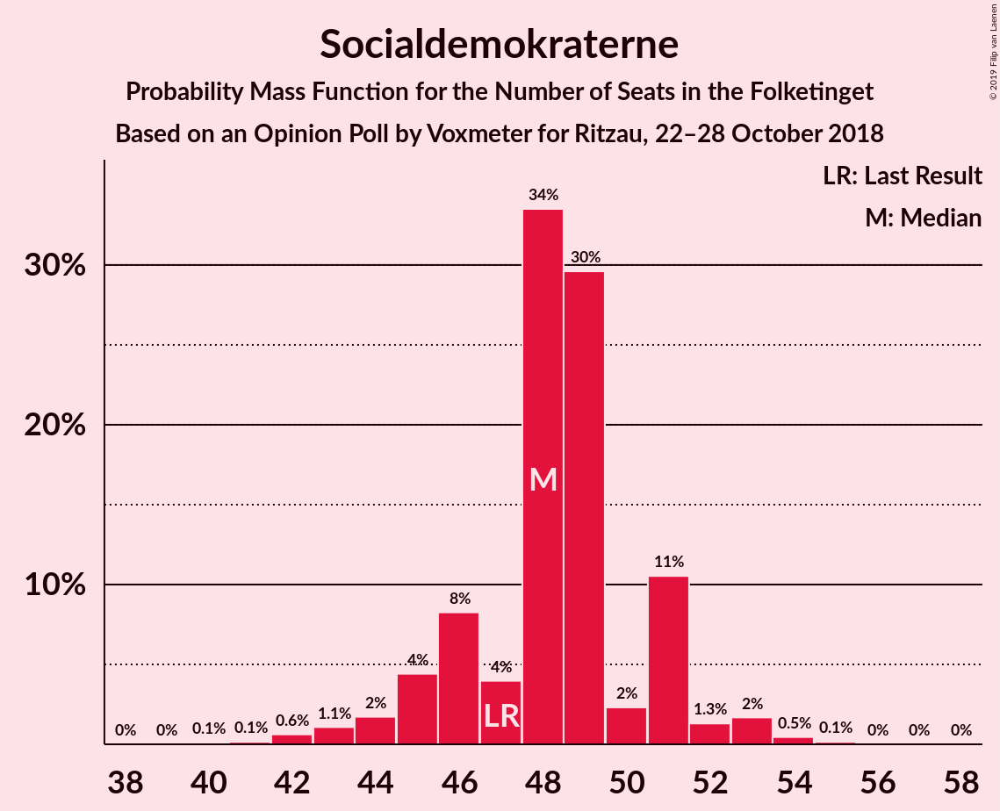
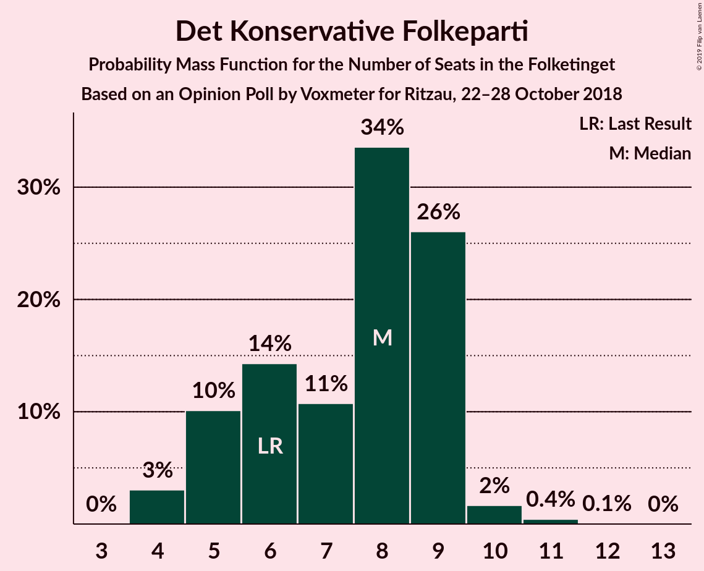

# Opinion Poll by Voxmeter for Ritzau, 22–28 October 2018

<a href="#voting-intentions">Voting Intentions</a> | <a href="#seats">Seats</a> | <a href="#coalitions">Coalitions</a> | <a href="#technical-information">Technical Information</a>

## Voting Intentions

### Confidence Intervals

| Party | Last Result | Poll Result | 80% Confidence Interval | 90% Confidence Interval | 95% Confidence Interval | 99% Confidence Interval |
|:-----:|:-----------:|:-----------:|:-----------------------:|:-----------------------:|:-----------------------:|:-----------------------:|
| Socialdemokraterne | 26.3% | 26.8% | 25.1–28.6% |24.6–29.2% |24.2–29.6% |23.4–30.5% |
| Venstre | 19.5% | 18.2% | 16.7–19.8% |16.3–20.3% |16.0–20.7% |15.3–21.5% |
| Dansk Folkeparti | 21.1% | 17.5% | 16.1–19.1% |15.7–19.6% |15.3–20.0% |14.6–20.8% |
| Enhedslisten–De Rød-Grønne | 7.8% | 8.4% | 7.4–9.6% |7.1–10.0% |6.9–10.3% |6.4–10.9% |
| Radikale Venstre | 4.6% | 6.4% | 5.5–7.5% |5.3–7.8% |5.0–8.1% |4.7–8.6% |
| Liberal Alliance | 7.5% | 5.7% | 4.9–6.8% |4.6–7.0% |4.5–7.3% |4.1–7.8% |
| Socialistisk Folkeparti | 4.2% | 5.6% | 4.8–6.6% |4.6–6.9% |4.4–7.2% |4.0–7.7% |
| Alternativet | 4.8% | 4.7% | 4.0–5.7% |3.8–6.0% |3.6–6.2% |3.3–6.7% |
| Det Konservative Folkeparti | 3.4% | 3.8% | 3.1–4.7% |2.9–4.9% |2.8–5.1% |2.5–5.6% |
| Nye Borgerlige | 0.0% | 1.8% | 1.4–2.5% |1.3–2.7% |1.2–2.9% |1.0–3.2% |
| Kristendemokraterne | 0.8% | 0.5% | 0.3–0.9% |0.2–1.0% |0.2–1.1% |0.1–1.4% |

*Note:* The poll result column reflects the actual value used in the calculations. Published results may vary slightly, and in addition be rounded to fewer digits.

## Seats

### Confidence Intervals

| Party | Last Result | Median | 80% Confidence Interval | 90% Confidence Interval | 95% Confidence Interval | 99% Confidence Interval |
|:-----:|:-----------:|:------:|:-----------------------:|:-----------------------:|:-----------------------:|:-----------------------:|
| <a href="#socialdemokraterne">Socialdemokraterne</a> | 47 | 49 | 43–49 |42–49 |38–49 |38–51 |
| <a href="#venstre">Venstre</a> | 34 | 27 | 27–33 |27–36 |27–37 |27–37 |
| <a href="#dansk-folkeparti">Dansk Folkeparti</a> | 37 | 32 | 27–32 |26–32 |26–32 |22–34 |
| <a href="#enhedslisten–de-rød-grønne">Enhedslisten–De Rød-Grønne</a> | 14 | 11 | 11–19 |11–19 |11–21 |11–21 |
| <a href="#radikale-venstre">Radikale Venstre</a> | 8 | 11 | 11–13 |11–13 |10–13 |8–14 |
| <a href="#liberal-alliance">Liberal Alliance</a> | 13 | 10 | 10–12 |8–12 |8–14 |8–16 |
| <a href="#socialistisk-folkeparti">Socialistisk Folkeparti</a> | 7 | 12 | 10–12 |9–12 |9–12 |7–12 |
| <a href="#alternativet">Alternativet</a> | 9 | 11 | 9–11 |9–11 |7–11 |5–12 |
| <a href="#det-konservative-folkeparti">Det Konservative Folkeparti</a> | 6 | 6 | 6–12 |6–12 |6–12 |6–12 |
| <a href="#nye-borgerlige">Nye Borgerlige</a> | 0 | 6 | 0–6 |0–6 |0–6 |0–7 |
| <a href="#kristendemokraterne">Kristendemokraterne</a> | 0 | 0 | 0 |0 |0 |0 |

### Socialdemokraterne

*For a full overview of the results for this party, see the [Socialdemokraterne](party-socialdemokraterne.html) page.*

| Number of Seats | Probability | Accumulated | Special Marks |
|:---------------:|:-----------:|:-----------:|:-------------:|
| 38 | 4% | 100% |  |
| 39 | 0% | 96% |  |
| 40 | 0% | 96% |  |
| 41 | 0.5% | 96% |  |
| 42 | 2% | 95% |  |
| 43 | 16% | 94% |  |
| 44 | 11% | 78% |  |
| 45 | 5% | 67% |  |
| 46 | 0% | 62% |  |
| 47 | 1.3% | 62% | Last Result |
| 48 | 0% | 61% |  |
| 49 | 59% | 61% | Median |
| 50 | 0% | 2% |  |
| 51 | 1.0% | 2% |  |
| 52 | 0% | 0.5% |  |
| 53 | 0.3% | 0.5% |  |
| 54 | 0.1% | 0.2% |  |
| 55 | 0% | 0.1% |  |
| 56 | 0% | 0.1% |  |
| 57 | 0.1% | 0.1% |  |
| 58 | 0% | 0% |  |

### Venstre

*For a full overview of the results for this party, see the [Venstre](party-venstre.html) page.*

| Number of Seats | Probability | Accumulated | Special Marks |
|:---------------:|:-----------:|:-----------:|:-------------:|
| 27 | 59% | 100% | Median |
| 28 | 12% | 41% |  |
| 29 | 0.1% | 29% |  |
| 30 | 0% | 29% |  |
| 31 | 17% | 29% |  |
| 32 | 0% | 12% |  |
| 33 | 5% | 12% |  |
| 34 | 0.1% | 7% | Last Result |
| 35 | 0% | 6% |  |
| 36 | 2% | 6% |  |
| 37 | 5% | 5% |  |
| 38 | 0% | 0% |  |

### Dansk Folkeparti

*For a full overview of the results for this party, see the [Dansk Folkeparti](party-danskfolkeparti.html) page.*

| Number of Seats | Probability | Accumulated | Special Marks |
|:---------------:|:-----------:|:-----------:|:-------------:|
| 22 | 1.3% | 100% |  |
| 23 | 0% | 98.7% |  |
| 24 | 0% | 98.7% |  |
| 25 | 0% | 98.7% |  |
| 26 | 5% | 98.7% |  |
| 27 | 16% | 94% |  |
| 28 | 0.1% | 78% |  |
| 29 | 12% | 78% |  |
| 30 | 0% | 66% |  |
| 31 | 2% | 66% |  |
| 32 | 63% | 64% | Median |
| 33 | 0.4% | 1.0% |  |
| 34 | 0.5% | 0.7% |  |
| 35 | 0% | 0.2% |  |
| 36 | 0% | 0.2% |  |
| 37 | 0.1% | 0.2% | Last Result |
| 38 | 0% | 0.1% |  |
| 39 | 0% | 0.1% |  |
| 40 | 0.1% | 0.1% |  |
| 41 | 0% | 0% |  |

### Enhedslisten–De Rød-Grønne

*For a full overview of the results for this party, see the [Enhedslisten–De Rød-Grønne](party-enhedslisten–derød-grønne.html) page.*

| Number of Seats | Probability | Accumulated | Special Marks |
|:---------------:|:-----------:|:-----------:|:-------------:|
| 10 | 0.1% | 100% |  |
| 11 | 61% | 99.9% | Median |
| 12 | 0.1% | 39% |  |
| 13 | 16% | 39% |  |
| 14 | 4% | 23% | Last Result |
| 15 | 0% | 19% |  |
| 16 | 0.1% | 19% |  |
| 17 | 1.1% | 18% |  |
| 18 | 1.4% | 17% |  |
| 19 | 11% | 16% |  |
| 20 | 0% | 5% |  |
| 21 | 5% | 5% |  |
| 22 | 0% | 0% |  |

### Radikale Venstre

*For a full overview of the results for this party, see the [Radikale Venstre](party-radikalevenstre.html) page.*

| Number of Seats | Probability | Accumulated | Special Marks |
|:---------------:|:-----------:|:-----------:|:-------------:|
| 8 | 1.1% | 100% | Last Result |
| 9 | 0.1% | 98.8% |  |
| 10 | 2% | 98.7% |  |
| 11 | 60% | 97% | Median |
| 12 | 16% | 37% |  |
| 13 | 20% | 21% |  |
| 14 | 1.3% | 1.3% |  |
| 15 | 0% | 0% |  |

### Liberal Alliance

*For a full overview of the results for this party, see the [Liberal Alliance](party-liberalalliance.html) page.*

| Number of Seats | Probability | Accumulated | Special Marks |
|:---------------:|:-----------:|:-----------:|:-------------:|
| 7 | 0.4% | 100% |  |
| 8 | 5% | 99.6% |  |
| 9 | 0.9% | 95% |  |
| 10 | 63% | 94% | Median |
| 11 | 11% | 31% |  |
| 12 | 16% | 20% |  |
| 13 | 1.1% | 4% | Last Result |
| 14 | 1.3% | 3% |  |
| 15 | 0% | 2% |  |
| 16 | 2% | 2% |  |
| 17 | 0.1% | 0.1% |  |
| 18 | 0% | 0% |  |

### Socialistisk Folkeparti

*For a full overview of the results for this party, see the [Socialistisk Folkeparti](party-socialistiskfolkeparti.html) page.*

| Number of Seats | Probability | Accumulated | Special Marks |
|:---------------:|:-----------:|:-----------:|:-------------:|
| 7 | 1.2% | 100% | Last Result |
| 8 | 0.6% | 98.8% |  |
| 9 | 6% | 98% |  |
| 10 | 16% | 93% |  |
| 11 | 13% | 77% |  |
| 12 | 64% | 64% | Median |
| 13 | 0.4% | 0.5% |  |
| 14 | 0% | 0% |  |

### Alternativet

*For a full overview of the results for this party, see the [Alternativet](party-alternativet.html) page.*

| Number of Seats | Probability | Accumulated | Special Marks |
|:---------------:|:-----------:|:-----------:|:-------------:|
| 5 | 1.1% | 100% |  |
| 6 | 0% | 98.9% |  |
| 7 | 1.4% | 98.9% |  |
| 8 | 0.4% | 97% |  |
| 9 | 16% | 97% | Last Result |
| 10 | 2% | 81% |  |
| 11 | 79% | 79% | Median |
| 12 | 0.2% | 0.6% |  |
| 13 | 0.4% | 0.4% |  |
| 14 | 0% | 0% |  |

### Det Konservative Folkeparti

*For a full overview of the results for this party, see the [Det Konservative Folkeparti](party-detkonservativefolkeparti.html) page.*

| Number of Seats | Probability | Accumulated | Special Marks |
|:---------------:|:-----------:|:-----------:|:-------------:|
| 4 | 0.1% | 100% |  |
| 5 | 0.1% | 99.9% |  |
| 6 | 75% | 99.8% | Last Result, Median |
| 7 | 0.5% | 25% |  |
| 8 | 3% | 24% |  |
| 9 | 6% | 21% |  |
| 10 | 0% | 15% |  |
| 11 | 4% | 15% |  |
| 12 | 11% | 11% |  |
| 13 | 0% | 0% |  |

### Nye Borgerlige

*For a full overview of the results for this party, see the [Nye Borgerlige](party-nyeborgerlige.html) page.*

| Number of Seats | Probability | Accumulated | Special Marks |
|:---------------:|:-----------:|:-----------:|:-------------:|
| 0 | 22% | 100% | Last Result |
| 1 | 0% | 78% |  |
| 2 | 0% | 78% |  |
| 3 | 0% | 78% |  |
| 4 | 2% | 78% |  |
| 5 | 16% | 76% |  |
| 6 | 59% | 60% | Median |
| 7 | 0.1% | 0.5% |  |
| 8 | 0.5% | 0.5% |  |
| 9 | 0% | 0% |  |

### Kristendemokraterne

*For a full overview of the results for this party, see the [Kristendemokraterne](party-kristendemokraterne.html) page.*

| Number of Seats | Probability | Accumulated | Special Marks |
|:---------------:|:-----------:|:-----------:|:-------------:|
| 0 | 99.9% | 100% | Last Result, Median |
| 1 | 0% | 0.1% |  |
| 2 | 0% | 0.1% |  |
| 3 | 0% | 0.1% |  |
| 4 | 0.1% | 0.1% |  |
| 5 | 0% | 0% |  |

## Coalitions

### Confidence Intervals

| Coalition | Last Result | Median | Majority? | 80% Confidence Interval | 90% Confidence Interval | 95% Confidence Interval | 99% Confidence Interval |
|:---------:|:-----------:|:------:|:---------:|:-----------------------:|:-----------------------:|:-----------------------:|:-----------------------:|
| Socialdemokraterne – Enhedslisten–De Rød-Grønne – Radikale Venstre – Socialistisk Folkeparti – Alternativet | 85 | 94 | 93% | 90–95 | 85–95 | 85–99 | 84–99 |
| Venstre – Dansk Folkeparti – Liberal Alliance – Det Konservative Folkeparti – Nye Borgerlige – Kristendemokraterne | 90 | 81 | 5% | 80–81 | 80–90 | 76–90 | 76–91 |
| Venstre – Dansk Folkeparti – Liberal Alliance – Det Konservative Folkeparti – Nye Borgerlige | 90 | 81 | 5% | 80–81 | 80–90 | 76–90 | 76–91 |
| Venstre – Dansk Folkeparti – Liberal Alliance – Det Konservative Folkeparti – Kristendemokraterne | 90 | 75 | 5% | 75–80 | 75–90 | 75–90 | 75–91 |
| Venstre – Dansk Folkeparti – Liberal Alliance – Det Konservative Folkeparti | 90 | 75 | 5% | 75–80 | 75–90 | 75–90 | 75–91 |
| Socialdemokraterne – Enhedslisten–De Rød-Grønne – Radikale Venstre – Socialistisk Folkeparti | 76 | 83 | 5% | 79–86 | 74–88 | 74–90 | 74–90 |

### Socialdemokraterne – Enhedslisten–De Rød-Grønne – Radikale Venstre – Socialistisk Folkeparti – Alternativet

| Number of Seats | Probability | Accumulated | Special Marks |
|:---------------:|:-----------:|:-----------:|:-------------:|
| 80 | 0.1% | 100% |  |
| 81 | 0% | 99.9% |  |
| 82 | 0% | 99.9% |  |
| 83 | 0% | 99.9% |  |
| 84 | 2% | 99.9% |  |
| 85 | 4% | 98% | Last Result |
| 86 | 0.5% | 95% |  |
| 87 | 0% | 94% |  |
| 88 | 1.0% | 94% |  |
| 89 | 0% | 93% |  |
| 90 | 16% | 93% | Majority |
| 91 | 0% | 77% |  |
| 92 | 0.4% | 77% |  |
| 93 | 0.3% | 77% |  |
| 94 | 59% | 76% | Median |
| 95 | 12% | 17% |  |
| 96 | 0% | 5% |  |
| 97 | 0.1% | 5% |  |
| 98 | 0% | 5% |  |
| 99 | 5% | 5% |  |
| 100 | 0% | 0% |  |

### Venstre – Dansk Folkeparti – Liberal Alliance – Det Konservative Folkeparti – Nye Borgerlige – Kristendemokraterne

| Number of Seats | Probability | Accumulated | Special Marks |
|:---------------:|:-----------:|:-----------:|:-------------:|
| 76 | 5% | 100% |  |
| 77 | 0% | 95% |  |
| 78 | 0.1% | 95% |  |
| 79 | 0% | 95% |  |
| 80 | 12% | 95% |  |
| 81 | 75% | 83% | Median |
| 82 | 0.4% | 8% |  |
| 83 | 0.4% | 8% |  |
| 84 | 0% | 7% |  |
| 85 | 0% | 7% |  |
| 86 | 0% | 7% |  |
| 87 | 1.0% | 7% |  |
| 88 | 0% | 6% |  |
| 89 | 0.5% | 6% |  |
| 90 | 4% | 5% | Last Result, Majority |
| 91 | 2% | 2% |  |
| 92 | 0% | 0.1% |  |
| 93 | 0% | 0.1% |  |
| 94 | 0% | 0.1% |  |
| 95 | 0.1% | 0.1% |  |
| 96 | 0% | 0% |  |

### Venstre – Dansk Folkeparti – Liberal Alliance – Det Konservative Folkeparti – Nye Borgerlige

| Number of Seats | Probability | Accumulated | Special Marks |
|:---------------:|:-----------:|:-----------:|:-------------:|
| 76 | 5% | 100% |  |
| 77 | 0% | 95% |  |
| 78 | 0.1% | 95% |  |
| 79 | 0% | 95% |  |
| 80 | 12% | 95% |  |
| 81 | 75% | 83% | Median |
| 82 | 0.4% | 8% |  |
| 83 | 0.4% | 8% |  |
| 84 | 0% | 7% |  |
| 85 | 0% | 7% |  |
| 86 | 0% | 7% |  |
| 87 | 1.0% | 7% |  |
| 88 | 0% | 6% |  |
| 89 | 0.5% | 6% |  |
| 90 | 4% | 5% | Last Result, Majority |
| 91 | 2% | 2% |  |
| 92 | 0% | 0% |  |

### Venstre – Dansk Folkeparti – Liberal Alliance – Det Konservative Folkeparti – Kristendemokraterne

| Number of Seats | Probability | Accumulated | Special Marks |
|:---------------:|:-----------:|:-----------:|:-------------:|
| 71 | 0.1% | 100% |  |
| 72 | 0% | 99.9% |  |
| 73 | 0% | 99.9% |  |
| 74 | 0% | 99.9% |  |
| 75 | 59% | 99.9% | Median |
| 76 | 22% | 41% |  |
| 77 | 0% | 19% |  |
| 78 | 0% | 19% |  |
| 79 | 0.4% | 19% |  |
| 80 | 11% | 19% |  |
| 81 | 0.5% | 7% |  |
| 82 | 0.4% | 7% |  |
| 83 | 0% | 7% |  |
| 84 | 0% | 7% |  |
| 85 | 0.1% | 7% |  |
| 86 | 0% | 7% |  |
| 87 | 1.0% | 7% |  |
| 88 | 0% | 5% |  |
| 89 | 0% | 5% |  |
| 90 | 4% | 5% | Last Result, Majority |
| 91 | 2% | 2% |  |
| 92 | 0% | 0% |  |

### Venstre – Dansk Folkeparti – Liberal Alliance – Det Konservative Folkeparti

| Number of Seats | Probability | Accumulated | Special Marks |
|:---------------:|:-----------:|:-----------:|:-------------:|
| 71 | 0.1% | 100% |  |
| 72 | 0% | 99.9% |  |
| 73 | 0% | 99.9% |  |
| 74 | 0% | 99.9% |  |
| 75 | 59% | 99.9% | Median |
| 76 | 22% | 41% |  |
| 77 | 0% | 19% |  |
| 78 | 0% | 19% |  |
| 79 | 0.4% | 19% |  |
| 80 | 11% | 19% |  |
| 81 | 0.5% | 7% |  |
| 82 | 0.4% | 7% |  |
| 83 | 0% | 7% |  |
| 84 | 0% | 7% |  |
| 85 | 0.1% | 7% |  |
| 86 | 0% | 7% |  |
| 87 | 1.1% | 7% |  |
| 88 | 0% | 5% |  |
| 89 | 0% | 5% |  |
| 90 | 4% | 5% | Last Result, Majority |
| 91 | 2% | 2% |  |
| 92 | 0% | 0% |  |

### Socialdemokraterne – Enhedslisten–De Rød-Grønne – Radikale Venstre – Socialistisk Folkeparti

| Number of Seats | Probability | Accumulated | Special Marks |
|:---------------:|:-----------:|:-----------:|:-------------:|
| 73 | 0.1% | 100% |  |
| 74 | 5% | 99.9% |  |
| 75 | 0% | 94% |  |
| 76 | 0% | 94% | Last Result |
| 77 | 0.4% | 94% |  |
| 78 | 0% | 94% |  |
| 79 | 16% | 94% |  |
| 80 | 0% | 78% |  |
| 81 | 0% | 78% |  |
| 82 | 0% | 78% |  |
| 83 | 60% | 78% | Median |
| 84 | 0% | 17% |  |
| 85 | 0.4% | 17% |  |
| 86 | 11% | 17% |  |
| 87 | 0% | 6% |  |
| 88 | 1.3% | 6% |  |
| 89 | 0% | 5% |  |
| 90 | 5% | 5% | Majority |
| 91 | 0% | 0% |  |

## Technical Information

### Opinion Poll

+ **Polling firm:** Voxmeter
+ **Commissioner(s):** Ritzau
+ **Fieldwork period:** 22–28 October 2018

### Calculations

+ **Sample size:** 1033
+ **Simulations done:** 1,024
+ **Error estimate:** 6.39%

