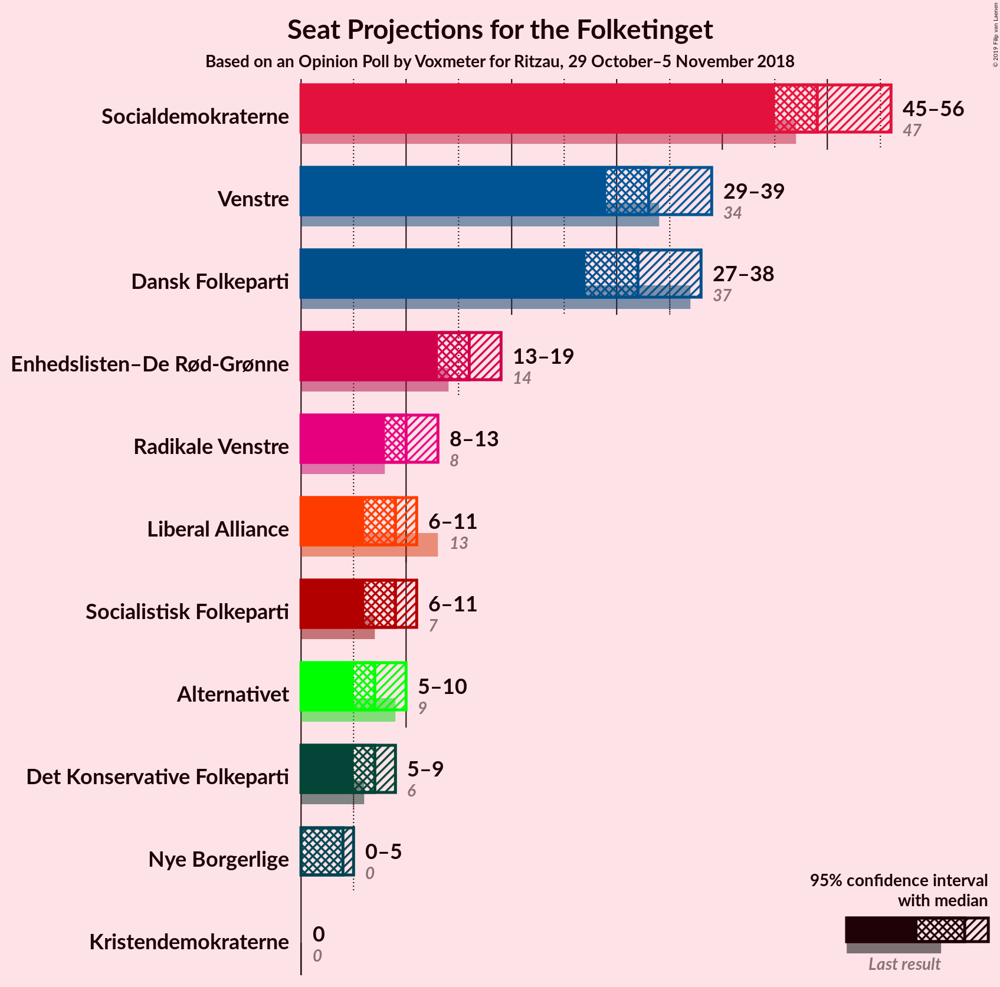
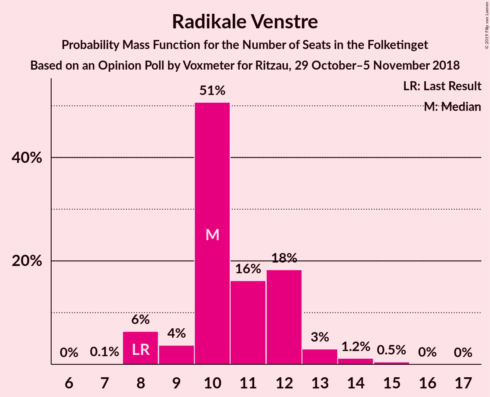
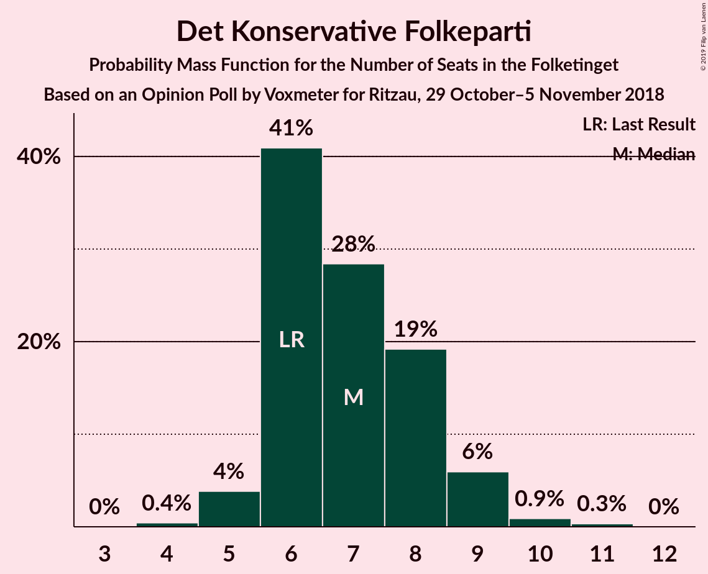
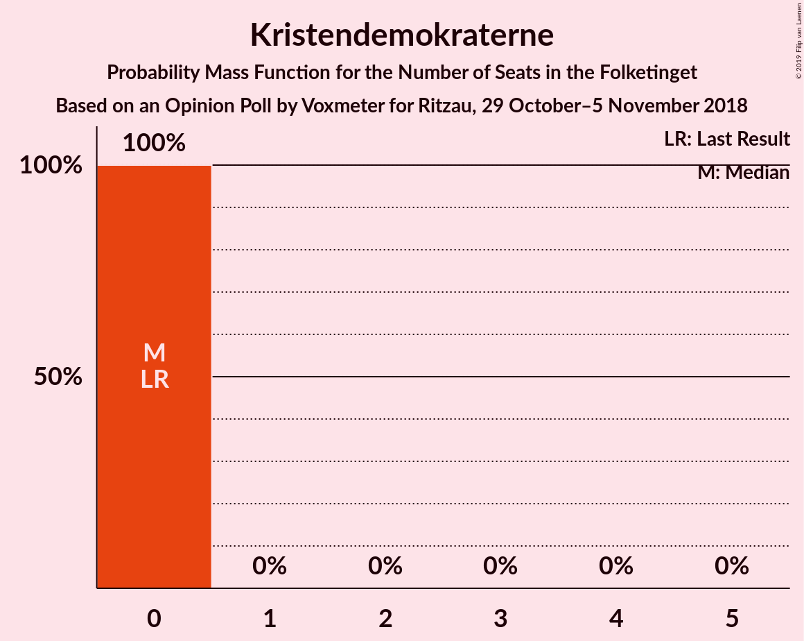
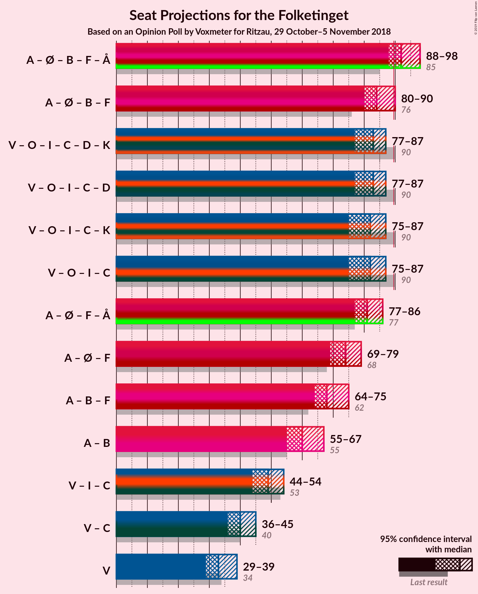

# Opinion Poll by Voxmeter for Ritzau, 29 October–5 November 2018

<a href="#voting-intentions">Voting Intentions</a> | <a href="#seats">Seats</a> | <a href="#coalitions">Coalitions</a> | <a href="#technical-information">Technical Information</a>

## Voting Intentions

### Confidence Intervals

| Party | Last Result | Poll Result | 80% Confidence Interval | 90% Confidence Interval | 95% Confidence Interval | 99% Confidence Interval |
|:-----:|:-----------:|:-----------:|:-----------------------:|:-----------------------:|:-----------------------:|:-----------------------:|
| Socialdemokraterne | 26.3% | 27.8% | 26.0–29.6% |25.6–30.2% |25.1–30.6% |24.3–31.5% |
| Venstre | 19.5% | 18.8% | 17.3–20.4% |16.8–20.9% |16.5–21.3% |15.8–22.1% |
| Dansk Folkeparti | 21.1% | 18.1% | 16.6–19.7% |16.2–20.1% |15.8–20.6% |15.2–21.4% |
| Enhedslisten–De Rød-Grønne | 7.8% | 8.9% | 7.9–10.2% |7.6–10.5% |7.3–10.9% |6.9–11.5% |
| Radikale Venstre | 4.6% | 6.0% | 5.2–7.1% |4.9–7.4% |4.7–7.7% |4.3–8.2% |
| Socialistisk Folkeparti | 4.2% | 4.9% | 4.1–5.8% |3.9–6.1% |3.7–6.4% |3.4–6.9% |
| Liberal Alliance | 7.5% | 4.8% | 4.0–5.7% |3.8–6.0% |3.6–6.2% |3.3–6.7% |
| Alternativet | 4.8% | 4.2% | 3.5–5.1% |3.3–5.4% |3.1–5.6% |2.8–6.1% |
| Det Konservative Folkeparti | 3.4% | 3.9% | 3.2–4.8% |3.0–5.0% |2.9–5.3% |2.6–5.7% |
| Nye Borgerlige | 0.0% | 1.8% | 1.4–2.5% |1.3–2.7% |1.2–2.9% |1.0–3.2% |
| Kristendemokraterne | 0.8% | 0.5% | 0.3–0.9% |0.2–1.0% |0.2–1.1% |0.1–1.4% |

*Note:* The poll result column reflects the actual value used in the calculations. Published results may vary slightly, and in addition be rounded to fewer digits.

## Seats

### Confidence Intervals

| Party | Last Result | Median | 80% Confidence Interval | 90% Confidence Interval | 95% Confidence Interval | 99% Confidence Interval |
|:-----:|:-----------:|:------:|:-----------------------:|:-----------------------:|:-----------------------:|:-----------------------:|
| <a href="#socialdemokraterne">Socialdemokraterne</a> | 47 | 48 | 48 |47–50 |40–52 |40–56 |
| <a href="#venstre">Venstre</a> | 34 | 39 | 34–39 |30–39 |30–39 |26–39 |
| <a href="#dansk-folkeparti">Dansk Folkeparti</a> | 37 | 27 | 27–33 |27–35 |27–35 |26–35 |
| <a href="#enhedslisten–de-rød-grønne">Enhedslisten–De Rød-Grønne</a> | 14 | 15 | 15 |14–20 |12–20 |12–20 |
| <a href="#radikale-venstre">Radikale Venstre</a> | 8 | 10 | 10 |9–10 |9–10 |9–13 |
| <a href="#socialistisk-folkeparti">Socialistisk Folkeparti</a> | 7 | 10 | 10 |9–11 |6–13 |6–13 |
| <a href="#liberal-alliance">Liberal Alliance</a> | 13 | 6 | 6–10 |6–10 |6–11 |5–12 |
| <a href="#alternativet">Alternativet</a> | 9 | 7 | 6–7 |5–8 |5–8 |5–9 |
| <a href="#det-konservative-folkeparti">Det Konservative Folkeparti</a> | 6 | 8 | 7–8 |4–8 |4–8 |4–12 |
| <a href="#nye-borgerlige">Nye Borgerlige</a> | 0 | 5 | 5 |5 |4–5 |0–5 |
| <a href="#kristendemokraterne">Kristendemokraterne</a> | 0 | 0 | 0 |0 |0 |0 |

### Socialdemokraterne

*For a full overview of the results for this party, see the [Socialdemokraterne](party-socialdemokraterne.html) page.*

| Number of Seats | Probability | Accumulated | Special Marks |
|:---------------:|:-----------:|:-----------:|:-------------:|
| 40 | 3% | 100% |  |
| 41 | 0% | 97% |  |
| 42 | 0.1% | 97% |  |
| 43 | 0% | 97% |  |
| 44 | 0% | 97% |  |
| 45 | 0% | 97% |  |
| 46 | 0.4% | 97% |  |
| 47 | 6% | 96% | Last Result |
| 48 | 82% | 90% | Median |
| 49 | 0% | 8% |  |
| 50 | 5% | 8% |  |
| 51 | 0% | 3% |  |
| 52 | 1.3% | 3% |  |
| 53 | 0% | 1.5% |  |
| 54 | 0% | 1.5% |  |
| 55 | 0% | 1.5% |  |
| 56 | 1.4% | 1.5% |  |
| 57 | 0% | 0% |  |

### Venstre

*For a full overview of the results for this party, see the [Venstre](party-venstre.html) page.*

| Number of Seats | Probability | Accumulated | Special Marks |
|:---------------:|:-----------:|:-----------:|:-------------:|
| 26 | 1.3% | 100% |  |
| 27 | 0% | 98.7% |  |
| 28 | 0.1% | 98.6% |  |
| 29 | 0% | 98.5% |  |
| 30 | 7% | 98.5% |  |
| 31 | 0.7% | 91% |  |
| 32 | 0% | 90% |  |
| 33 | 0.1% | 90% |  |
| 34 | 5% | 90% | Last Result |
| 35 | 3% | 86% |  |
| 36 | 0.6% | 82% |  |
| 37 | 0% | 82% |  |
| 38 | 0% | 82% |  |
| 39 | 82% | 82% | Median |
| 40 | 0% | 0% |  |

### Dansk Folkeparti

*For a full overview of the results for this party, see the [Dansk Folkeparti](party-danskfolkeparti.html) page.*

| Number of Seats | Probability | Accumulated | Special Marks |
|:---------------:|:-----------:|:-----------:|:-------------:|
| 26 | 1.4% | 100% |  |
| 27 | 82% | 98.6% | Median |
| 28 | 0.1% | 17% |  |
| 29 | 0.1% | 17% |  |
| 30 | 1.2% | 16% |  |
| 31 | 0% | 15% |  |
| 32 | 5% | 15% |  |
| 33 | 3% | 10% |  |
| 34 | 0.1% | 7% |  |
| 35 | 7% | 7% |  |
| 36 | 0% | 0% |  |
| 37 | 0% | 0% | Last Result |

### Enhedslisten–De Rød-Grønne

*For a full overview of the results for this party, see the [Enhedslisten–De Rød-Grønne](party-enhedslisten–derød-grønne.html) page.*

| Number of Seats | Probability | Accumulated | Special Marks |
|:---------------:|:-----------:|:-----------:|:-------------:|
| 12 | 5% | 100% |  |
| 13 | 0.1% | 95% |  |
| 14 | 0.6% | 95% | Last Result |
| 15 | 85% | 94% | Median |
| 16 | 1.5% | 10% |  |
| 17 | 2% | 8% |  |
| 18 | 0% | 6% |  |
| 19 | 0% | 6% |  |
| 20 | 6% | 6% |  |
| 21 | 0% | 0.3% |  |
| 22 | 0% | 0.3% |  |
| 23 | 0% | 0.3% |  |
| 24 | 0.3% | 0.3% |  |
| 25 | 0% | 0% |  |

### Radikale Venstre

*For a full overview of the results for this party, see the [Radikale Venstre](party-radikalevenstre.html) page.*

| Number of Seats | Probability | Accumulated | Special Marks |
|:---------------:|:-----------:|:-----------:|:-------------:|
| 8 | 0% | 100% | Last Result |
| 9 | 7% | 100% |  |
| 10 | 91% | 93% | Median |
| 11 | 0% | 2% |  |
| 12 | 0% | 2% |  |
| 13 | 2% | 2% |  |
| 14 | 0.1% | 0.2% |  |
| 15 | 0.1% | 0.1% |  |
| 16 | 0% | 0% |  |

### Socialistisk Folkeparti

*For a full overview of the results for this party, see the [Socialistisk Folkeparti](party-socialistiskfolkeparti.html) page.*

| Number of Seats | Probability | Accumulated | Special Marks |
|:---------------:|:-----------:|:-----------:|:-------------:|
| 6 | 5% | 100% |  |
| 7 | 0% | 95% | Last Result |
| 8 | 0% | 95% |  |
| 9 | 0.2% | 95% |  |
| 10 | 89% | 95% | Median |
| 11 | 1.4% | 6% |  |
| 12 | 1.4% | 4% |  |
| 13 | 3% | 3% |  |
| 14 | 0% | 0% |  |

### Liberal Alliance

*For a full overview of the results for this party, see the [Liberal Alliance](party-liberalalliance.html) page.*

| Number of Seats | Probability | Accumulated | Special Marks |
|:---------------:|:-----------:|:-----------:|:-------------:|
| 5 | 2% | 100% |  |
| 6 | 83% | 98% | Median |
| 7 | 0% | 15% |  |
| 8 | 0.3% | 15% |  |
| 9 | 0% | 14% |  |
| 10 | 11% | 14% |  |
| 11 | 3% | 4% |  |
| 12 | 0.6% | 0.7% |  |
| 13 | 0% | 0.1% | Last Result |
| 14 | 0% | 0.1% |  |
| 15 | 0.1% | 0.1% |  |
| 16 | 0% | 0% |  |

### Alternativet

*For a full overview of the results for this party, see the [Alternativet](party-alternativet.html) page.*

| Number of Seats | Probability | Accumulated | Special Marks |
|:---------------:|:-----------:|:-----------:|:-------------:|
| 5 | 7% | 100% |  |
| 6 | 3% | 93% |  |
| 7 | 83% | 90% | Median |
| 8 | 5% | 7% |  |
| 9 | 2% | 2% | Last Result |
| 10 | 0% | 0.1% |  |
| 11 | 0% | 0% |  |

### Det Konservative Folkeparti

*For a full overview of the results for this party, see the [Det Konservative Folkeparti](party-detkonservativefolkeparti.html) page.*

| Number of Seats | Probability | Accumulated | Special Marks |
|:---------------:|:-----------:|:-----------:|:-------------:|
| 4 | 6% | 100% |  |
| 5 | 0.6% | 94% |  |
| 6 | 1.5% | 94% | Last Result |
| 7 | 3% | 92% |  |
| 8 | 88% | 89% | Median |
| 9 | 0% | 1.0% |  |
| 10 | 0.4% | 1.0% |  |
| 11 | 0% | 0.6% |  |
| 12 | 0.6% | 0.6% |  |
| 13 | 0% | 0% |  |

### Nye Borgerlige

*For a full overview of the results for this party, see the [Nye Borgerlige](party-nyeborgerlige.html) page.*

| Number of Seats | Probability | Accumulated | Special Marks |
|:---------------:|:-----------:|:-----------:|:-------------:|
| 0 | 2% | 100% | Last Result |
| 1 | 0% | 98% |  |
| 2 | 0% | 98% |  |
| 3 | 0% | 98% |  |
| 4 | 1.5% | 98% |  |
| 5 | 97% | 97% | Median |
| 6 | 0% | 0% |  |

### Kristendemokraterne

*For a full overview of the results for this party, see the [Kristendemokraterne](party-kristendemokraterne.html) page.*

| Number of Seats | Probability | Accumulated | Special Marks |
|:---------------:|:-----------:|:-----------:|:-------------:|
| 0 | 100% | 100% | Last Result, Median |

## Coalitions

### Confidence Intervals

| Coalition | Last Result | Median | Majority? | 80% Confidence Interval | 90% Confidence Interval | 95% Confidence Interval | 99% Confidence Interval |
|:---------:|:-----------:|:------:|:---------:|:-----------------------:|:-----------------------:|:-----------------------:|:-----------------------:|
| Socialdemokraterne – Enhedslisten–De Rød-Grønne – Radikale Venstre – Socialistisk Folkeparti – Alternativet | 85 | 90 | 92% | 90–91 | 86–91 | 84–97 | 84–102 |
| Socialdemokraterne – Enhedslisten–De Rød-Grønne – Radikale Venstre – Socialistisk Folkeparti | 76 | 83 | 3% | 83–85 | 78–86 | 78–92 | 78–93 |
| Venstre – Dansk Folkeparti – Liberal Alliance – Det Konservative Folkeparti – Nye Borgerlige – Kristendemokraterne | 90 | 85 | 3% | 84–85 | 84–89 | 78–91 | 73–91 |
| Venstre – Dansk Folkeparti – Liberal Alliance – Det Konservative Folkeparti – Nye Borgerlige | 90 | 85 | 3% | 84–85 | 84–89 | 78–91 | 73–91 |
| Venstre – Dansk Folkeparti – Liberal Alliance – Det Konservative Folkeparti – Kristendemokraterne | 90 | 80 | 0% | 80 | 79–84 | 74–86 | 68–86 |
| Venstre – Dansk Folkeparti – Liberal Alliance – Det Konservative Folkeparti | 90 | 80 | 0% | 80 | 79–84 | 74–86 | 68–86 |

### Socialdemokraterne – Enhedslisten–De Rød-Grønne – Radikale Venstre – Socialistisk Folkeparti – Alternativet

| Number of Seats | Probability | Accumulated | Special Marks |
|:---------------:|:-----------:|:-----------:|:-------------:|
| 84 | 3% | 100% |  |
| 85 | 0% | 97% | Last Result |
| 86 | 5% | 97% |  |
| 87 | 0% | 92% |  |
| 88 | 0.1% | 92% |  |
| 89 | 0% | 92% |  |
| 90 | 82% | 92% | Median, Majority |
| 91 | 6% | 10% |  |
| 92 | 0.6% | 4% |  |
| 93 | 0% | 4% |  |
| 94 | 0.1% | 4% |  |
| 95 | 0.2% | 4% |  |
| 96 | 0% | 3% |  |
| 97 | 2% | 3% |  |
| 98 | 0% | 1.5% |  |
| 99 | 0% | 1.5% |  |
| 100 | 0% | 1.4% |  |
| 101 | 0% | 1.4% |  |
| 102 | 1.4% | 1.4% |  |
| 103 | 0% | 0% |  |

### Socialdemokraterne – Enhedslisten–De Rød-Grønne – Radikale Venstre – Socialistisk Folkeparti

| Number of Seats | Probability | Accumulated | Special Marks |
|:---------------:|:-----------:|:-----------:|:-------------:|
| 76 | 0% | 100% | Last Result |
| 77 | 0% | 100% |  |
| 78 | 8% | 100% |  |
| 79 | 0% | 92% |  |
| 80 | 0.1% | 92% |  |
| 81 | 0% | 92% |  |
| 82 | 0% | 92% |  |
| 83 | 82% | 92% | Median |
| 84 | 0% | 10% |  |
| 85 | 0.7% | 10% |  |
| 86 | 6% | 9% |  |
| 87 | 0% | 4% |  |
| 88 | 0.3% | 4% |  |
| 89 | 0.6% | 3% |  |
| 90 | 0% | 3% | Majority |
| 91 | 0% | 3% |  |
| 92 | 1.3% | 3% |  |
| 93 | 1.4% | 1.5% |  |
| 94 | 0% | 0% |  |

### Venstre – Dansk Folkeparti – Liberal Alliance – Det Konservative Folkeparti – Nye Borgerlige – Kristendemokraterne

| Number of Seats | Probability | Accumulated | Special Marks |
|:---------------:|:-----------:|:-----------:|:-------------:|
| 73 | 1.4% | 100% |  |
| 74 | 0% | 98.6% |  |
| 75 | 0% | 98.6% |  |
| 76 | 0% | 98.6% |  |
| 77 | 0% | 98.5% |  |
| 78 | 2% | 98.5% |  |
| 79 | 0% | 97% |  |
| 80 | 0.2% | 97% |  |
| 81 | 0.1% | 96% |  |
| 82 | 0% | 96% |  |
| 83 | 0.6% | 96% |  |
| 84 | 6% | 96% |  |
| 85 | 82% | 90% | Median |
| 86 | 0% | 8% |  |
| 87 | 0.1% | 8% |  |
| 88 | 0% | 8% |  |
| 89 | 5% | 8% |  |
| 90 | 0% | 3% | Last Result, Majority |
| 91 | 3% | 3% |  |
| 92 | 0% | 0% |  |

### Venstre – Dansk Folkeparti – Liberal Alliance – Det Konservative Folkeparti – Nye Borgerlige

| Number of Seats | Probability | Accumulated | Special Marks |
|:---------------:|:-----------:|:-----------:|:-------------:|
| 73 | 1.4% | 100% |  |
| 74 | 0% | 98.6% |  |
| 75 | 0% | 98.6% |  |
| 76 | 0% | 98.6% |  |
| 77 | 0% | 98.5% |  |
| 78 | 2% | 98.5% |  |
| 79 | 0% | 97% |  |
| 80 | 0.2% | 97% |  |
| 81 | 0.1% | 96% |  |
| 82 | 0% | 96% |  |
| 83 | 0.6% | 96% |  |
| 84 | 6% | 96% |  |
| 85 | 82% | 90% | Median |
| 86 | 0% | 8% |  |
| 87 | 0.1% | 8% |  |
| 88 | 0% | 8% |  |
| 89 | 5% | 8% |  |
| 90 | 0% | 3% | Last Result, Majority |
| 91 | 3% | 3% |  |
| 92 | 0% | 0% |  |

### Venstre – Dansk Folkeparti – Liberal Alliance – Det Konservative Folkeparti – Kristendemokraterne

| Number of Seats | Probability | Accumulated | Special Marks |
|:---------------:|:-----------:|:-----------:|:-------------:|
| 68 | 1.4% | 100% |  |
| 69 | 0% | 98.6% |  |
| 70 | 0% | 98.6% |  |
| 71 | 0% | 98.6% |  |
| 72 | 0% | 98.5% |  |
| 73 | 0% | 98.5% |  |
| 74 | 1.3% | 98.5% |  |
| 75 | 0% | 97% |  |
| 76 | 0% | 97% |  |
| 77 | 0.1% | 97% |  |
| 78 | 0.7% | 97% |  |
| 79 | 6% | 96% |  |
| 80 | 82% | 91% | Median |
| 81 | 0% | 9% |  |
| 82 | 0.1% | 8% |  |
| 83 | 0.6% | 8% |  |
| 84 | 5% | 8% |  |
| 85 | 0% | 3% |  |
| 86 | 3% | 3% |  |
| 87 | 0% | 0% |  |
| 88 | 0% | 0% |  |
| 89 | 0% | 0% |  |
| 90 | 0% | 0% | Last Result, Majority |

### Venstre – Dansk Folkeparti – Liberal Alliance – Det Konservative Folkeparti

| Number of Seats | Probability | Accumulated | Special Marks |
|:---------------:|:-----------:|:-----------:|:-------------:|
| 68 | 1.4% | 100% |  |
| 69 | 0% | 98.6% |  |
| 70 | 0% | 98.6% |  |
| 71 | 0% | 98.6% |  |
| 72 | 0% | 98.5% |  |
| 73 | 0% | 98.5% |  |
| 74 | 1.3% | 98.5% |  |
| 75 | 0% | 97% |  |
| 76 | 0% | 97% |  |
| 77 | 0.1% | 97% |  |
| 78 | 0.7% | 97% |  |
| 79 | 6% | 96% |  |
| 80 | 82% | 91% | Median |
| 81 | 0% | 9% |  |
| 82 | 0.1% | 8% |  |
| 83 | 0.6% | 8% |  |
| 84 | 5% | 8% |  |
| 85 | 0% | 3% |  |
| 86 | 3% | 3% |  |
| 87 | 0% | 0% |  |
| 88 | 0% | 0% |  |
| 89 | 0% | 0% |  |
| 90 | 0% | 0% | Last Result, Majority |

## Technical Information

### Opinion Poll

+ **Polling firm:** Voxmeter
+ **Commissioner(s):** Ritzau
+ **Fieldwork period:** 29 October–5 November 2018

### Calculations

+ **Sample size:** 1029
+ **Simulations done:** 1,024
+ **Error estimate:** 3.14%

