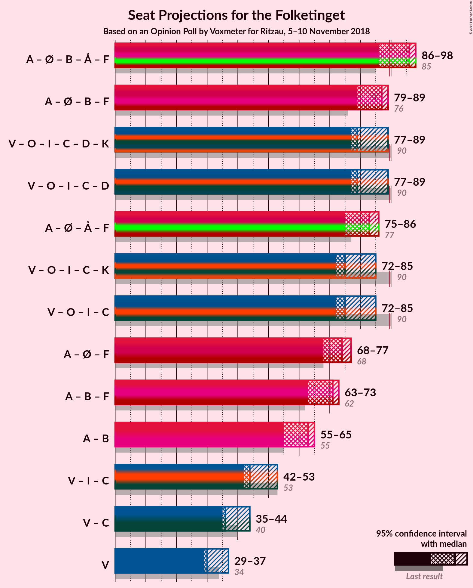

# Opinion Poll by Voxmeter for Ritzau, 5–10 November 2018

<a href="#voting-intentions">Voting Intentions</a> | <a href="#seats">Seats</a> | <a href="#coalitions">Coalitions</a> | <a href="#technical-information">Technical Information</a>

## Voting Intentions

### Confidence Intervals

| Party | Last Result | Poll Result | 80% Confidence Interval | 90% Confidence Interval | 95% Confidence Interval | 99% Confidence Interval |
|:-----:|:-----------:|:-----------:|:-----------------------:|:-----------------------:|:-----------------------:|:-----------------------:|
| Socialdemokraterne | 26.3% | 27.3% | 25.6–29.1% |25.1–29.7% |24.7–30.1% |23.9–31.0% |
| Venstre | 19.5% | 18.1% | 16.6–19.7% |16.2–20.1% |15.9–20.5% |15.2–21.3% |
| Dansk Folkeparti | 21.1% | 17.4% | 16.0–19.0% |15.6–19.4% |15.2–19.8% |14.6–20.6% |
| Enhedslisten–De Rød-Grønne | 7.8% | 9.1% | 8.1–10.4% |7.8–10.7% |7.5–11.1% |7.0–11.7% |
| Radikale Venstre | 4.6% | 6.6% | 5.7–7.7% |5.5–8.0% |5.3–8.3% |4.9–8.9% |
| Alternativet | 4.8% | 4.8% | 4.1–5.8% |3.8–6.1% |3.7–6.3% |3.3–6.8% |
| Socialistisk Folkeparti | 4.2% | 4.8% | 4.1–5.8% |3.8–6.1% |3.7–6.3% |3.3–6.8% |
| Liberal Alliance | 7.5% | 4.5% | 3.8–5.5% |3.6–5.7% |3.4–6.0% |3.1–6.4% |
| Det Konservative Folkeparti | 3.4% | 3.5% | 2.8–4.3% |2.7–4.5% |2.5–4.8% |2.2–5.2% |
| Nye Borgerlige | 0.0% | 2.6% | 2.1–3.4% |1.9–3.6% |1.8–3.8% |1.6–4.1% |
| Kristendemokraterne | 0.8% | 0.9% | 0.6–1.4% |0.5–1.5% |0.5–1.6% |0.4–1.9% |

*Note:* The poll result column reflects the actual value used in the calculations. Published results may vary slightly, and in addition be rounded to fewer digits.

## Seats

### Confidence Intervals

| Party | Last Result | Median | 80% Confidence Interval | 90% Confidence Interval | 95% Confidence Interval | 99% Confidence Interval |
|:-----:|:-----------:|:------:|:-----------------------:|:-----------------------:|:-----------------------:|:-----------------------:|
| <a href="#socialdemokraterne">Socialdemokraterne</a> | 47 | 53 | 48–53 |47–53 |44–53 |43–53 |
| <a href="#venstre">Venstre</a> | 34 | 30 | 30–33 |29–35 |29–35 |27–38 |
| <a href="#dansk-folkeparti">Dansk Folkeparti</a> | 37 | 30 | 28–31 |28–32 |28–33 |26–37 |
| <a href="#enhedslisten–de-rød-grønne">Enhedslisten–De Rød-Grønne</a> | 14 | 15 | 15–18 |15–18 |15–18 |13–20 |
| <a href="#radikale-venstre">Radikale Venstre</a> | 8 | 11 | 11–14 |11–14 |11–14 |9–15 |
| <a href="#alternativet">Alternativet</a> | 9 | 11 | 8–11 |7–11 |7–11 |6–12 |
| <a href="#socialistisk-folkeparti">Socialistisk Folkeparti</a> | 7 | 7 | 7–9 |7–9 |7–10 |6–11 |
| <a href="#liberal-alliance">Liberal Alliance</a> | 13 | 7 | 7–10 |7–10 |7–11 |6–12 |
| <a href="#det-konservative-folkeparti">Det Konservative Folkeparti</a> | 6 | 5 | 5–6 |4–7 |4–8 |4–9 |
| <a href="#nye-borgerlige">Nye Borgerlige</a> | 0 | 6 | 4–6 |0–6 |0–7 |0–7 |
| <a href="#kristendemokraterne">Kristendemokraterne</a> | 0 | 0 | 0 |0 |0 |0–4 |

### Socialdemokraterne

*For a full overview of the results for this party, see the [Socialdemokraterne](party-socialdemokraterne.html) page.*

| Number of Seats | Probability | Accumulated | Special Marks |
|:---------------:|:-----------:|:-----------:|:-------------:|
| 41 | 0% | 100% |  |
| 42 | 0.1% | 99.9% |  |
| 43 | 0.7% | 99.9% |  |
| 44 | 2% | 99.2% |  |
| 45 | 0.8% | 97% |  |
| 46 | 1.2% | 96% |  |
| 47 | 3% | 95% | Last Result |
| 48 | 9% | 92% |  |
| 49 | 19% | 83% |  |
| 50 | 0.9% | 64% |  |
| 51 | 0.4% | 63% |  |
| 52 | 4% | 62% |  |
| 53 | 58% | 58% | Median |
| 54 | 0.2% | 0.4% |  |
| 55 | 0% | 0.2% |  |
| 56 | 0% | 0.1% |  |
| 57 | 0.1% | 0.1% |  |
| 58 | 0% | 0% |  |

### Venstre

*For a full overview of the results for this party, see the [Venstre](party-venstre.html) page.*

| Number of Seats | Probability | Accumulated | Special Marks |
|:---------------:|:-----------:|:-----------:|:-------------:|
| 26 | 0.4% | 100% |  |
| 27 | 0.4% | 99.5% |  |
| 28 | 0.9% | 99.1% |  |
| 29 | 5% | 98% |  |
| 30 | 57% | 94% | Median |
| 31 | 21% | 37% |  |
| 32 | 0.7% | 15% |  |
| 33 | 5% | 15% |  |
| 34 | 3% | 10% | Last Result |
| 35 | 5% | 7% |  |
| 36 | 0.6% | 2% |  |
| 37 | 0.2% | 1.1% |  |
| 38 | 0.7% | 0.9% |  |
| 39 | 0% | 0.2% |  |
| 40 | 0.1% | 0.1% |  |
| 41 | 0% | 0% |  |

### Dansk Folkeparti

*For a full overview of the results for this party, see the [Dansk Folkeparti](party-danskfolkeparti.html) page.*

| Number of Seats | Probability | Accumulated | Special Marks |
|:---------------:|:-----------:|:-----------:|:-------------:|
| 25 | 0.2% | 100% |  |
| 26 | 0.7% | 99.8% |  |
| 27 | 1.1% | 99.2% |  |
| 28 | 10% | 98% |  |
| 29 | 2% | 89% |  |
| 30 | 58% | 86% | Median |
| 31 | 20% | 28% |  |
| 32 | 4% | 8% |  |
| 33 | 2% | 4% |  |
| 34 | 0.2% | 2% |  |
| 35 | 1.0% | 2% |  |
| 36 | 0.2% | 0.8% |  |
| 37 | 0.5% | 0.5% | Last Result |
| 38 | 0% | 0% |  |

### Enhedslisten–De Rød-Grønne

*For a full overview of the results for this party, see the [Enhedslisten–De Rød-Grønne](party-enhedslisten–derød-grønne.html) page.*

| Number of Seats | Probability | Accumulated | Special Marks |
|:---------------:|:-----------:|:-----------:|:-------------:|
| 12 | 0.3% | 100% |  |
| 13 | 0.4% | 99.7% |  |
| 14 | 1.1% | 99.3% | Last Result |
| 15 | 62% | 98% | Median |
| 16 | 23% | 36% |  |
| 17 | 1.1% | 13% |  |
| 18 | 10% | 12% |  |
| 19 | 0.9% | 2% |  |
| 20 | 1.0% | 1.1% |  |
| 21 | 0.1% | 0.1% |  |
| 22 | 0% | 0% |  |

### Radikale Venstre

*For a full overview of the results for this party, see the [Radikale Venstre](party-radikalevenstre.html) page.*

| Number of Seats | Probability | Accumulated | Special Marks |
|:---------------:|:-----------:|:-----------:|:-------------:|
| 7 | 0.1% | 100% |  |
| 8 | 0% | 99.9% | Last Result |
| 9 | 0.4% | 99.9% |  |
| 10 | 1.5% | 99.4% |  |
| 11 | 63% | 98% | Median |
| 12 | 8% | 35% |  |
| 13 | 5% | 27% |  |
| 14 | 20% | 22% |  |
| 15 | 2% | 2% |  |
| 16 | 0.1% | 0.2% |  |
| 17 | 0.1% | 0.1% |  |
| 18 | 0% | 0% |  |

### Alternativet

*For a full overview of the results for this party, see the [Alternativet](party-alternativet.html) page.*

| Number of Seats | Probability | Accumulated | Special Marks |
|:---------------:|:-----------:|:-----------:|:-------------:|
| 5 | 0.1% | 100% |  |
| 6 | 0.9% | 99.9% |  |
| 7 | 6% | 99.0% |  |
| 8 | 17% | 93% |  |
| 9 | 1.3% | 76% | Last Result |
| 10 | 15% | 74% |  |
| 11 | 58% | 59% | Median |
| 12 | 0.5% | 0.8% |  |
| 13 | 0.3% | 0.3% |  |
| 14 | 0% | 0% |  |

### Socialistisk Folkeparti

*For a full overview of the results for this party, see the [Socialistisk Folkeparti](party-socialistiskfolkeparti.html) page.*

| Number of Seats | Probability | Accumulated | Special Marks |
|:---------------:|:-----------:|:-----------:|:-------------:|
| 5 | 0.5% | 100% |  |
| 6 | 1.0% | 99.5% |  |
| 7 | 81% | 98.6% | Last Result, Median |
| 8 | 4% | 17% |  |
| 9 | 9% | 13% |  |
| 10 | 3% | 4% |  |
| 11 | 0.9% | 1.3% |  |
| 12 | 0.3% | 0.4% |  |
| 13 | 0.1% | 0.1% |  |
| 14 | 0% | 0% |  |

### Liberal Alliance

*For a full overview of the results for this party, see the [Liberal Alliance](party-liberalalliance.html) page.*

| Number of Seats | Probability | Accumulated | Special Marks |
|:---------------:|:-----------:|:-----------:|:-------------:|
| 5 | 0.5% | 100% |  |
| 6 | 2% | 99.5% |  |
| 7 | 62% | 98% | Median |
| 8 | 11% | 36% |  |
| 9 | 7% | 24% |  |
| 10 | 13% | 17% |  |
| 11 | 3% | 4% |  |
| 12 | 0.8% | 0.8% |  |
| 13 | 0% | 0% | Last Result |

### Det Konservative Folkeparti

*For a full overview of the results for this party, see the [Det Konservative Folkeparti](party-detkonservativefolkeparti.html) page.*

| Number of Seats | Probability | Accumulated | Special Marks |
|:---------------:|:-----------:|:-----------:|:-------------:|
| 0 | 0.2% | 100% |  |
| 1 | 0% | 99.8% |  |
| 2 | 0% | 99.8% |  |
| 3 | 0% | 99.8% |  |
| 4 | 6% | 99.8% |  |
| 5 | 77% | 93% | Median |
| 6 | 10% | 17% | Last Result |
| 7 | 2% | 6% |  |
| 8 | 3% | 4% |  |
| 9 | 1.0% | 1.2% |  |
| 10 | 0.2% | 0.2% |  |
| 11 | 0% | 0% |  |

### Nye Borgerlige

*For a full overview of the results for this party, see the [Nye Borgerlige](party-nyeborgerlige.html) page.*

| Number of Seats | Probability | Accumulated | Special Marks |
|:---------------:|:-----------:|:-----------:|:-------------:|
| 0 | 8% | 100% | Last Result |
| 1 | 0% | 92% |  |
| 2 | 0% | 92% |  |
| 3 | 0% | 92% |  |
| 4 | 17% | 92% |  |
| 5 | 12% | 75% |  |
| 6 | 59% | 63% | Median |
| 7 | 4% | 4% |  |
| 8 | 0.2% | 0.2% |  |
| 9 | 0% | 0% |  |

### Kristendemokraterne

*For a full overview of the results for this party, see the [Kristendemokraterne](party-kristendemokraterne.html) page.*

| Number of Seats | Probability | Accumulated | Special Marks |
|:---------------:|:-----------:|:-----------:|:-------------:|
| 0 | 99.2% | 100% | Last Result, Median |
| 1 | 0% | 0.8% |  |
| 2 | 0% | 0.8% |  |
| 3 | 0% | 0.8% |  |
| 4 | 0.7% | 0.8% |  |
| 5 | 0% | 0% |  |

## Coalitions

### Confidence Intervals

| Coalition | Last Result | Median | Majority? | 80% Confidence Interval | 90% Confidence Interval | 95% Confidence Interval | 99% Confidence Interval |
|:---------:|:-----------:|:------:|:---------:|:-----------------------:|:-----------------------:|:-----------------------:|:-----------------------:|
| Socialdemokraterne – Enhedslisten–De Rød-Grønne – Radikale Venstre – Alternativet – Socialistisk Folkeparti | 85 | 97 | 99.3% | 94–97 | 92–98 | 91–98 | 88–100 |
| Socialdemokraterne – Enhedslisten–De Rød-Grønne – Radikale Venstre – Socialistisk Folkeparti | 76 | 86 | 1.4% | 85–86 | 84–88 | 82–88 | 79–90 |
| Socialdemokraterne – Enhedslisten–De Rød-Grønne – Alternativet – Socialistisk Folkeparti | 77 | 86 | 0.3% | 80–86 | 80–86 | 80–86 | 77–88 |
| Venstre – Dansk Folkeparti – Liberal Alliance – Det Konservative Folkeparti – Nye Borgerlige – Kristendemokraterne | 90 | 78 | 0.1% | 78–81 | 77–83 | 77–84 | 75–87 |
| Venstre – Dansk Folkeparti – Liberal Alliance – Det Konservative Folkeparti – Nye Borgerlige | 90 | 78 | 0.1% | 78–81 | 77–83 | 77–84 | 75–87 |
| Venstre – Dansk Folkeparti – Liberal Alliance – Det Konservative Folkeparti – Kristendemokraterne | 90 | 72 | 0% | 72–77 | 72–78 | 72–81 | 68–84 |
| Venstre – Dansk Folkeparti – Liberal Alliance – Det Konservative Folkeparti | 90 | 72 | 0% | 72–77 | 72–78 | 72–81 | 68–84 |
| Socialdemokraterne – Enhedslisten–De Rød-Grønne – Socialistisk Folkeparti | 68 | 75 | 0% | 71–75 | 71–76 | 70–76 | 69–80 |
| Socialdemokraterne – Radikale Venstre – Socialistisk Folkeparti | 62 | 71 | 0% | 69–71 | 67–71 | 65–71 | 63–74 |
| Socialdemokraterne – Radikale Venstre | 55 | 64 | 0% | 61–64 | 59–64 | 56–64 | 55–65 |
| Venstre – Liberal Alliance – Det Konservative Folkeparti | 53 | 42 | 0% | 42–47 | 42–49 | 42–49 | 40–52 |
| Venstre – Det Konservative Folkeparti | 40 | 35 | 0% | 35–39 | 35–41 | 35–42 | 32–46 |
| Venstre | 34 | 30 | 0% | 30–33 | 29–35 | 29–35 | 27–38 |

### Socialdemokraterne – Enhedslisten–De Rød-Grønne – Radikale Venstre – Alternativet – Socialistisk Folkeparti

| Number of Seats | Probability | Accumulated | Special Marks |
|:---------------:|:-----------:|:-----------:|:-------------:|
| 85 | 0% | 100% | Last Result |
| 86 | 0.3% | 99.9% |  |
| 87 | 0.1% | 99.7% |  |
| 88 | 0% | 99.5% |  |
| 89 | 0.2% | 99.5% |  |
| 90 | 0.7% | 99.3% | Majority |
| 91 | 2% | 98.6% |  |
| 92 | 4% | 97% |  |
| 93 | 3% | 93% |  |
| 94 | 17% | 90% |  |
| 95 | 8% | 74% |  |
| 96 | 1.3% | 66% |  |
| 97 | 57% | 64% | Median |
| 98 | 6% | 7% |  |
| 99 | 0.5% | 1.1% |  |
| 100 | 0.2% | 0.7% |  |
| 101 | 0.1% | 0.5% |  |
| 102 | 0.2% | 0.4% |  |
| 103 | 0.2% | 0.2% |  |
| 104 | 0% | 0% |  |

### Socialdemokraterne – Enhedslisten–De Rød-Grønne – Radikale Venstre – Socialistisk Folkeparti

| Number of Seats | Probability | Accumulated | Special Marks |
|:---------------:|:-----------:|:-----------:|:-------------:|
| 76 | 0% | 100% | Last Result |
| 77 | 0% | 100% |  |
| 78 | 0.1% | 100% |  |
| 79 | 0.4% | 99.9% |  |
| 80 | 0.1% | 99.4% |  |
| 81 | 0.5% | 99.3% |  |
| 82 | 2% | 98.8% |  |
| 83 | 1.2% | 97% |  |
| 84 | 4% | 96% |  |
| 85 | 11% | 92% |  |
| 86 | 71% | 81% | Median |
| 87 | 0.3% | 10% |  |
| 88 | 8% | 9% |  |
| 89 | 0.5% | 2% |  |
| 90 | 0.9% | 1.4% | Majority |
| 91 | 0.1% | 0.5% |  |
| 92 | 0% | 0.4% |  |
| 93 | 0.2% | 0.4% |  |
| 94 | 0.2% | 0.2% |  |
| 95 | 0% | 0% |  |

### Socialdemokraterne – Enhedslisten–De Rød-Grønne – Alternativet – Socialistisk Folkeparti

| Number of Seats | Probability | Accumulated | Special Marks |
|:---------------:|:-----------:|:-----------:|:-------------:|
| 73 | 0% | 100% |  |
| 74 | 0.1% | 99.9% |  |
| 75 | 0% | 99.9% |  |
| 76 | 0.1% | 99.9% |  |
| 77 | 0.6% | 99.8% | Last Result |
| 78 | 0.4% | 99.1% |  |
| 79 | 1.2% | 98.7% |  |
| 80 | 16% | 98% |  |
| 81 | 13% | 82% |  |
| 82 | 2% | 68% |  |
| 83 | 1.4% | 66% |  |
| 84 | 0.5% | 65% |  |
| 85 | 0.6% | 64% |  |
| 86 | 62% | 64% | Median |
| 87 | 0.5% | 2% |  |
| 88 | 0.7% | 1.0% |  |
| 89 | 0% | 0.3% |  |
| 90 | 0.1% | 0.3% | Majority |
| 91 | 0.2% | 0.2% |  |
| 92 | 0% | 0% |  |

### Venstre – Dansk Folkeparti – Liberal Alliance – Det Konservative Folkeparti – Nye Borgerlige – Kristendemokraterne

| Number of Seats | Probability | Accumulated | Special Marks |
|:---------------:|:-----------:|:-----------:|:-------------:|
| 72 | 0.2% | 100% |  |
| 73 | 0.2% | 99.8% |  |
| 74 | 0.1% | 99.6% |  |
| 75 | 0.2% | 99.5% |  |
| 76 | 0.5% | 99.3% |  |
| 77 | 6% | 98.9% |  |
| 78 | 57% | 93% | Median |
| 79 | 1.3% | 36% |  |
| 80 | 8% | 34% |  |
| 81 | 17% | 26% |  |
| 82 | 3% | 10% |  |
| 83 | 4% | 7% |  |
| 84 | 2% | 3% |  |
| 85 | 0.7% | 1.4% |  |
| 86 | 0.2% | 0.7% |  |
| 87 | 0% | 0.5% |  |
| 88 | 0.1% | 0.5% |  |
| 89 | 0.3% | 0.3% |  |
| 90 | 0% | 0.1% | Last Result, Majority |
| 91 | 0% | 0% |  |

### Venstre – Dansk Folkeparti – Liberal Alliance – Det Konservative Folkeparti – Nye Borgerlige

| Number of Seats | Probability | Accumulated | Special Marks |
|:---------------:|:-----------:|:-----------:|:-------------:|
| 72 | 0.2% | 100% |  |
| 73 | 0.2% | 99.8% |  |
| 74 | 0.1% | 99.6% |  |
| 75 | 0.2% | 99.5% |  |
| 76 | 1.0% | 99.3% |  |
| 77 | 6% | 98% |  |
| 78 | 57% | 93% | Median |
| 79 | 1.3% | 35% |  |
| 80 | 8% | 34% |  |
| 81 | 17% | 26% |  |
| 82 | 3% | 9% |  |
| 83 | 4% | 7% |  |
| 84 | 2% | 3% |  |
| 85 | 0.6% | 1.3% |  |
| 86 | 0.2% | 0.7% |  |
| 87 | 0% | 0.5% |  |
| 88 | 0.1% | 0.5% |  |
| 89 | 0.3% | 0.3% |  |
| 90 | 0% | 0.1% | Last Result, Majority |
| 91 | 0% | 0% |  |

### Venstre – Dansk Folkeparti – Liberal Alliance – Det Konservative Folkeparti – Kristendemokraterne

| Number of Seats | Probability | Accumulated | Special Marks |
|:---------------:|:-----------:|:-----------:|:-------------:|
| 66 | 0.1% | 100% |  |
| 67 | 0.2% | 99.9% |  |
| 68 | 0.3% | 99.8% |  |
| 69 | 0.1% | 99.4% |  |
| 70 | 0.2% | 99.4% |  |
| 71 | 0.2% | 99.1% |  |
| 72 | 58% | 98.9% | Median |
| 73 | 0.9% | 41% |  |
| 74 | 4% | 40% |  |
| 75 | 6% | 37% |  |
| 76 | 3% | 30% |  |
| 77 | 18% | 28% |  |
| 78 | 5% | 10% |  |
| 79 | 0.8% | 4% |  |
| 80 | 1.1% | 4% |  |
| 81 | 0.7% | 3% |  |
| 82 | 0.6% | 2% |  |
| 83 | 0.1% | 1.3% |  |
| 84 | 0.9% | 1.2% |  |
| 85 | 0.2% | 0.3% |  |
| 86 | 0% | 0% |  |
| 87 | 0% | 0% |  |
| 88 | 0% | 0% |  |
| 89 | 0% | 0% |  |
| 90 | 0% | 0% | Last Result, Majority |

### Venstre – Dansk Folkeparti – Liberal Alliance – Det Konservative Folkeparti

| Number of Seats | Probability | Accumulated | Special Marks |
|:---------------:|:-----------:|:-----------:|:-------------:|
| 66 | 0.1% | 100% |  |
| 67 | 0.2% | 99.9% |  |
| 68 | 0.3% | 99.8% |  |
| 69 | 0.1% | 99.4% |  |
| 70 | 0.6% | 99.4% |  |
| 71 | 0.2% | 98.7% |  |
| 72 | 58% | 98.5% | Median |
| 73 | 0.9% | 41% |  |
| 74 | 3% | 40% |  |
| 75 | 6% | 36% |  |
| 76 | 3% | 30% |  |
| 77 | 18% | 27% |  |
| 78 | 5% | 9% |  |
| 79 | 0.8% | 4% |  |
| 80 | 1.0% | 3% |  |
| 81 | 0.7% | 3% |  |
| 82 | 0.5% | 2% |  |
| 83 | 0.1% | 1.3% |  |
| 84 | 0.9% | 1.2% |  |
| 85 | 0.2% | 0.3% |  |
| 86 | 0% | 0% |  |
| 87 | 0% | 0% |  |
| 88 | 0% | 0% |  |
| 89 | 0% | 0% |  |
| 90 | 0% | 0% | Last Result, Majority |

### Socialdemokraterne – Enhedslisten–De Rød-Grønne – Socialistisk Folkeparti

| Number of Seats | Probability | Accumulated | Special Marks |
|:---------------:|:-----------:|:-----------:|:-------------:|
| 65 | 0.1% | 100% |  |
| 66 | 0% | 99.9% |  |
| 67 | 0.1% | 99.9% |  |
| 68 | 0.2% | 99.8% | Last Result |
| 69 | 0.3% | 99.6% |  |
| 70 | 2% | 99.4% |  |
| 71 | 11% | 97% |  |
| 72 | 14% | 86% |  |
| 73 | 2% | 73% |  |
| 74 | 5% | 71% |  |
| 75 | 59% | 66% | Median |
| 76 | 6% | 7% |  |
| 77 | 0.2% | 2% |  |
| 78 | 0.2% | 2% |  |
| 79 | 0.4% | 1.3% |  |
| 80 | 0.7% | 0.9% |  |
| 81 | 0.2% | 0.2% |  |
| 82 | 0% | 0% |  |

### Socialdemokraterne – Radikale Venstre – Socialistisk Folkeparti

| Number of Seats | Probability | Accumulated | Special Marks |
|:---------------:|:-----------:|:-----------:|:-------------:|
| 61 | 0.2% | 100% |  |
| 62 | 0.2% | 99.7% | Last Result |
| 63 | 0.1% | 99.6% |  |
| 64 | 1.3% | 99.5% |  |
| 65 | 2% | 98% |  |
| 66 | 0.7% | 97% |  |
| 67 | 1.1% | 96% |  |
| 68 | 4% | 95% |  |
| 69 | 6% | 91% |  |
| 70 | 24% | 85% |  |
| 71 | 58% | 61% | Median |
| 72 | 0.7% | 2% |  |
| 73 | 0.5% | 2% |  |
| 74 | 0.7% | 1.1% |  |
| 75 | 0.1% | 0.4% |  |
| 76 | 0.1% | 0.3% |  |
| 77 | 0.2% | 0.3% |  |
| 78 | 0% | 0.1% |  |
| 79 | 0.1% | 0.1% |  |
| 80 | 0% | 0% |  |

### Socialdemokraterne – Radikale Venstre

| Number of Seats | Probability | Accumulated | Special Marks |
|:---------------:|:-----------:|:-----------:|:-------------:|
| 53 | 0.3% | 100% |  |
| 54 | 0% | 99.7% |  |
| 55 | 1.2% | 99.6% | Last Result |
| 56 | 0.9% | 98% |  |
| 57 | 0.7% | 97% |  |
| 58 | 0.6% | 97% |  |
| 59 | 2% | 96% |  |
| 60 | 3% | 94% |  |
| 61 | 7% | 91% |  |
| 62 | 7% | 83% |  |
| 63 | 18% | 76% |  |
| 64 | 57% | 58% | Median |
| 65 | 0.7% | 1.1% |  |
| 66 | 0.1% | 0.4% |  |
| 67 | 0.1% | 0.4% |  |
| 68 | 0.1% | 0.3% |  |
| 69 | 0.2% | 0.2% |  |
| 70 | 0% | 0% |  |

### Venstre – Liberal Alliance – Det Konservative Folkeparti

| Number of Seats | Probability | Accumulated | Special Marks |
|:---------------:|:-----------:|:-----------:|:-------------:|
| 38 | 0.3% | 100% |  |
| 39 | 0.1% | 99.7% |  |
| 40 | 0.3% | 99.6% |  |
| 41 | 0.7% | 99.3% |  |
| 42 | 58% | 98.6% | Median |
| 43 | 1.0% | 41% |  |
| 44 | 6% | 40% |  |
| 45 | 2% | 34% |  |
| 46 | 21% | 32% |  |
| 47 | 2% | 11% |  |
| 48 | 1.4% | 9% |  |
| 49 | 6% | 8% |  |
| 50 | 0.6% | 2% |  |
| 51 | 0.1% | 2% |  |
| 52 | 1.3% | 1.4% |  |
| 53 | 0% | 0.1% | Last Result |
| 54 | 0% | 0% |  |

### Venstre – Det Konservative Folkeparti

| Number of Seats | Probability | Accumulated | Special Marks |
|:---------------:|:-----------:|:-----------:|:-------------:|
| 29 | 0.2% | 100% |  |
| 30 | 0% | 99.8% |  |
| 31 | 0.2% | 99.8% |  |
| 32 | 0.2% | 99.7% |  |
| 33 | 0.6% | 99.5% |  |
| 34 | 1.0% | 98.8% |  |
| 35 | 66% | 98% | Median |
| 36 | 15% | 32% |  |
| 37 | 0.9% | 17% |  |
| 38 | 4% | 16% |  |
| 39 | 3% | 12% |  |
| 40 | 1.0% | 9% | Last Result |
| 41 | 5% | 8% |  |
| 42 | 1.1% | 3% |  |
| 43 | 0.2% | 2% |  |
| 44 | 0.9% | 2% |  |
| 45 | 0.1% | 0.8% |  |
| 46 | 0.2% | 0.6% |  |
| 47 | 0.4% | 0.4% |  |
| 48 | 0% | 0% |  |

### Venstre

| Number of Seats | Probability | Accumulated | Special Marks |
|:---------------:|:-----------:|:-----------:|:-------------:|
| 26 | 0.4% | 100% |  |
| 27 | 0.4% | 99.5% |  |
| 28 | 0.9% | 99.1% |  |
| 29 | 5% | 98% |  |
| 30 | 57% | 94% | Median |
| 31 | 21% | 37% |  |
| 32 | 0.7% | 15% |  |
| 33 | 5% | 15% |  |
| 34 | 3% | 10% | Last Result |
| 35 | 5% | 7% |  |
| 36 | 0.6% | 2% |  |
| 37 | 0.2% | 1.1% |  |
| 38 | 0.7% | 0.9% |  |
| 39 | 0% | 0.2% |  |
| 40 | 0.1% | 0.1% |  |
| 41 | 0% | 0% |  |

## Technical Information

### Opinion Poll

+ **Polling firm:** Voxmeter
+ **Commissioner(s):** Ritzau
+ **Fieldwork period:** 5–10 November 2018

### Calculations

+ **Sample size:** 1040
+ **Simulations done:** 131,072
+ **Error estimate:** 2.68%

