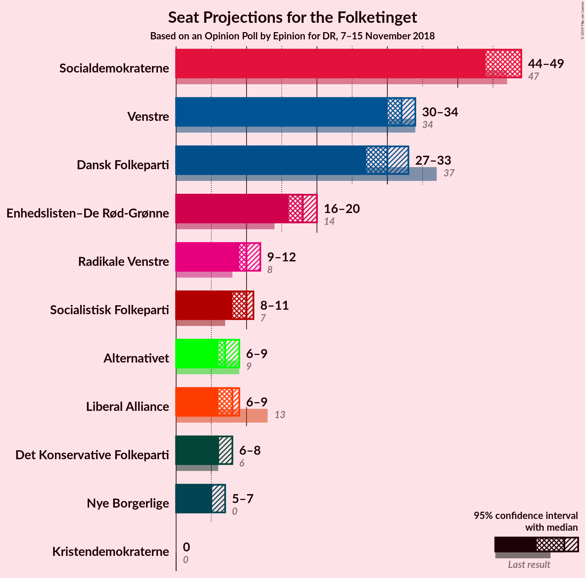
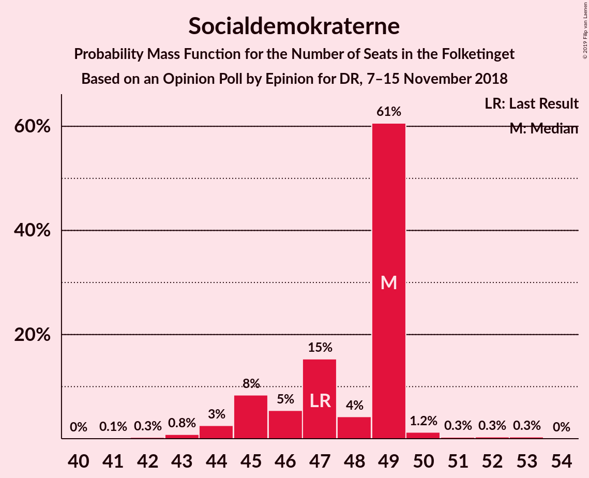
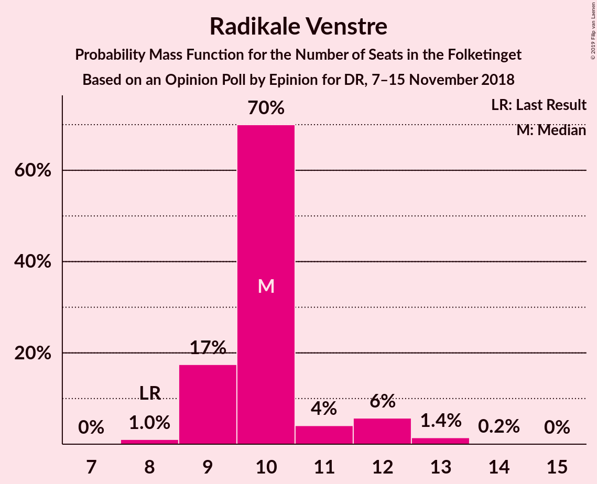
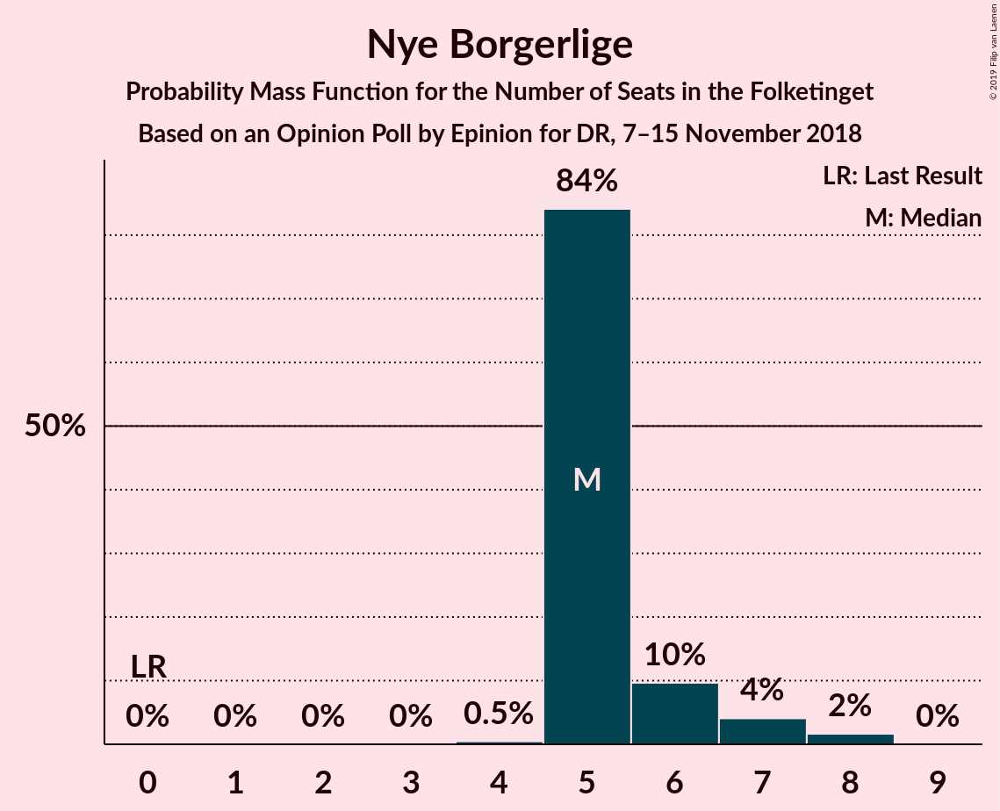
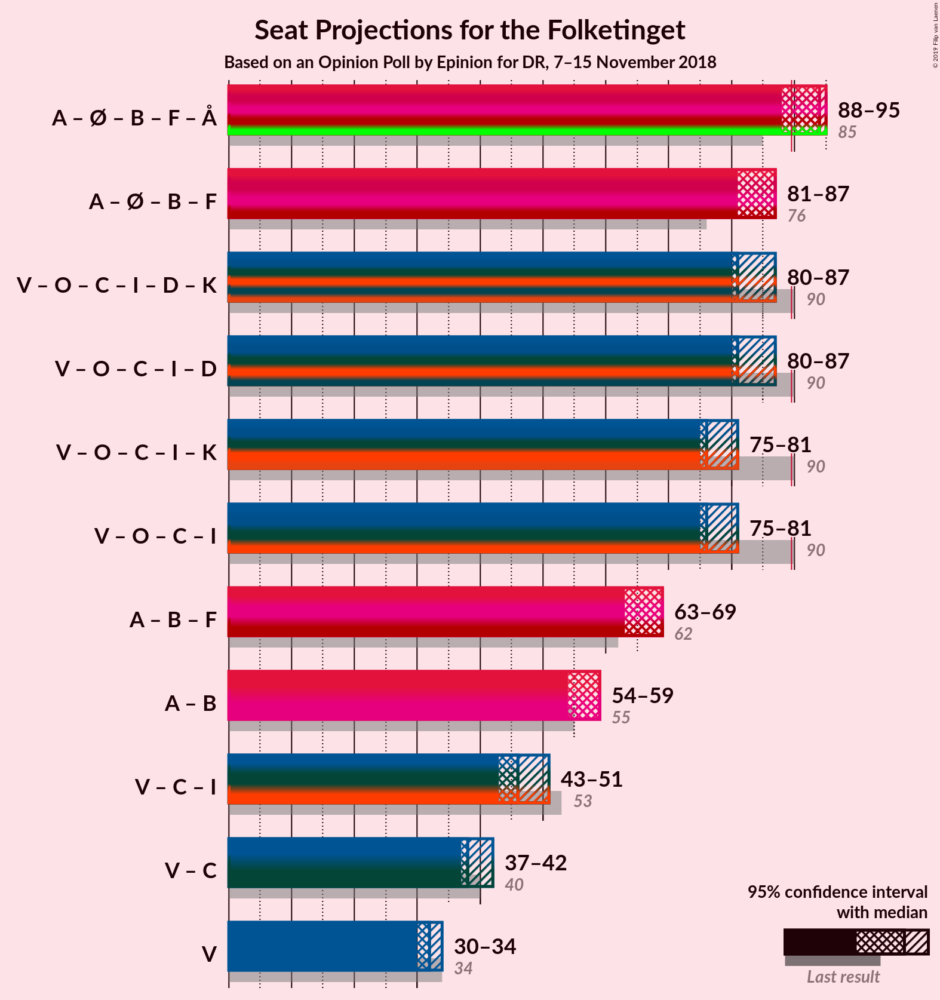

# Opinion Poll by Epinion for DR, 7–15 November 2018

<a href="#voting-intentions">Voting Intentions</a> | <a href="#seats">Seats</a> | <a href="#coalitions">Coalitions</a> | <a href="#technical-information">Technical Information</a>

## Voting Intentions

### Confidence Intervals

| Party | Last Result | Poll Result | 80% Confidence Interval | 90% Confidence Interval | 95% Confidence Interval | 99% Confidence Interval |
|:-----:|:-----------:|:-----------:|:-----------------------:|:-----------------------:|:-----------------------:|:-----------------------:|
| Socialdemokraterne | 26.3% | 26.5% | 25.1–28.0% |24.7–28.4% |24.4–28.8% |23.7–29.5% |
| Venstre | 19.5% | 18.3% | 17.1–19.6% |16.8–20.0% |16.5–20.3% |15.9–20.9% |
| Dansk Folkeparti | 21.1% | 17.5% | 16.3–18.8% |16.0–19.1% |15.7–19.4% |15.1–20.1% |
| Enhedslisten–De Rød-Grønne | 7.8% | 10.2% | 9.3–11.2% |9.0–11.5% |8.8–11.8% |8.4–12.3% |
| Radikale Venstre | 4.6% | 6.0% | 5.3–6.8% |5.1–7.1% |4.9–7.3% |4.6–7.7% |
| Socialistisk Folkeparti | 4.2% | 5.3% | 4.6–6.1% |4.4–6.3% |4.3–6.5% |4.0–6.9% |
| Liberal Alliance | 7.5% | 4.1% | 3.5–4.8% |3.3–5.0% |3.2–5.2% |2.9–5.5% |
| Alternativet | 4.8% | 4.1% | 3.5–4.8% |3.3–5.0% |3.2–5.2% |2.9–5.5% |
| Det Konservative Folkeparti | 3.4% | 4.1% | 3.5–4.8% |3.3–5.0% |3.2–5.2% |2.9–5.5% |
| Nye Borgerlige | 0.0% | 3.3% | 2.8–4.0% |2.7–4.1% |2.5–4.3% |2.3–4.6% |
| Kristendemokraterne | 0.8% | 0.5% | 0.3–0.8% |0.3–0.9% |0.3–1.0% |0.2–1.2% |

*Note:* The poll result column reflects the actual value used in the calculations. Published results may vary slightly, and in addition be rounded to fewer digits.

## Seats

### Confidence Intervals

| Party | Last Result | Median | 80% Confidence Interval | 90% Confidence Interval | 95% Confidence Interval | 99% Confidence Interval |
|:-----:|:-----------:|:------:|:-----------------------:|:-----------------------:|:-----------------------:|:-----------------------:|
| <a href="#socialdemokraterne">Socialdemokraterne</a> | 47 | 47 | 43–47 |43–47 |41–51 |41–51 |
| <a href="#venstre">Venstre</a> | 34 | 32 | 32–33 |32–33 |29–34 |29–34 |
| <a href="#dansk-folkeparti">Dansk Folkeparti</a> | 37 | 30 | 29–32 |29–33 |29–36 |27–36 |
| <a href="#enhedslisten–de-rød-grønne">Enhedslisten–De Rød-Grønne</a> | 14 | 18 | 17–20 |17–20 |14–20 |14–20 |
| <a href="#radikale-venstre">Radikale Venstre</a> | 8 | 11 | 10–12 |9–13 |8–13 |8–14 |
| <a href="#socialistisk-folkeparti">Socialistisk Folkeparti</a> | 7 | 10 | 7–10 |7–10 |7–13 |7–13 |
| <a href="#liberal-alliance">Liberal Alliance</a> | 13 | 6 | 6–8 |6–8 |5–8 |5–8 |
| <a href="#alternativet">Alternativet</a> | 9 | 6 | 4–7 |4–12 |4–12 |4–12 |
| <a href="#det-konservative-folkeparti">Det Konservative Folkeparti</a> | 6 | 10 | 7–11 |6–11 |5–11 |5–11 |
| <a href="#nye-borgerlige">Nye Borgerlige</a> | 0 | 7 | 5–8 |5–8 |4–8 |4–8 |
| <a href="#kristendemokraterne">Kristendemokraterne</a> | 0 | 0 | 0 |0 |0 |0 |

### Socialdemokraterne

*For a full overview of the results for this party, see the [Socialdemokraterne](party-socialdemokraterne.html) page.*

| Number of Seats | Probability | Accumulated | Special Marks |
|:---------------:|:-----------:|:-----------:|:-------------:|
| 41 | 3% | 100% |  |
| 42 | 0% | 97% |  |
| 43 | 39% | 97% |  |
| 44 | 0% | 58% |  |
| 45 | 0% | 58% |  |
| 46 | 2% | 58% |  |
| 47 | 53% | 57% | Last Result, Median |
| 48 | 0% | 4% |  |
| 49 | 0.1% | 4% |  |
| 50 | 0.1% | 4% |  |
| 51 | 4% | 4% |  |
| 52 | 0% | 0% |  |

### Venstre

*For a full overview of the results for this party, see the [Venstre](party-venstre.html) page.*

| Number of Seats | Probability | Accumulated | Special Marks |
|:---------------:|:-----------:|:-----------:|:-------------:|
| 29 | 3% | 100% |  |
| 30 | 0% | 97% |  |
| 31 | 0% | 97% |  |
| 32 | 73% | 97% | Median |
| 33 | 22% | 25% |  |
| 34 | 3% | 3% | Last Result |
| 35 | 0% | 0.1% |  |
| 36 | 0% | 0% |  |

### Dansk Folkeparti

*For a full overview of the results for this party, see the [Dansk Folkeparti](party-danskfolkeparti.html) page.*

| Number of Seats | Probability | Accumulated | Special Marks |
|:---------------:|:-----------:|:-----------:|:-------------:|
| 27 | 1.5% | 100% |  |
| 28 | 0% | 98% |  |
| 29 | 35% | 98% |  |
| 30 | 23% | 64% | Median |
| 31 | 10% | 41% |  |
| 32 | 25% | 31% |  |
| 33 | 2% | 5% |  |
| 34 | 0% | 3% |  |
| 35 | 0% | 3% |  |
| 36 | 3% | 3% |  |
| 37 | 0.1% | 0.1% | Last Result |
| 38 | 0% | 0% |  |

### Enhedslisten–De Rød-Grønne

*For a full overview of the results for this party, see the [Enhedslisten–De Rød-Grønne](party-enhedslisten–derød-grønne.html) page.*

| Number of Seats | Probability | Accumulated | Special Marks |
|:---------------:|:-----------:|:-----------:|:-------------:|
| 14 | 3% | 100% | Last Result |
| 15 | 0% | 97% |  |
| 16 | 1.2% | 97% |  |
| 17 | 10% | 96% |  |
| 18 | 55% | 86% | Median |
| 19 | 2% | 31% |  |
| 20 | 29% | 29% |  |
| 21 | 0% | 0.1% |  |
| 22 | 0% | 0.1% |  |
| 23 | 0.1% | 0.1% |  |
| 24 | 0% | 0% |  |

### Radikale Venstre

*For a full overview of the results for this party, see the [Radikale Venstre](party-radikalevenstre.html) page.*

| Number of Seats | Probability | Accumulated | Special Marks |
|:---------------:|:-----------:|:-----------:|:-------------:|
| 7 | 0.2% | 100% |  |
| 8 | 3% | 99.8% | Last Result |
| 9 | 4% | 97% |  |
| 10 | 33% | 93% |  |
| 11 | 29% | 61% | Median |
| 12 | 22% | 31% |  |
| 13 | 8% | 10% |  |
| 14 | 2% | 2% |  |
| 15 | 0% | 0% |  |

### Socialistisk Folkeparti

*For a full overview of the results for this party, see the [Socialistisk Folkeparti](party-socialistiskfolkeparti.html) page.*

| Number of Seats | Probability | Accumulated | Special Marks |
|:---------------:|:-----------:|:-----------:|:-------------:|
| 7 | 27% | 100% | Last Result |
| 8 | 2% | 73% |  |
| 9 | 8% | 71% |  |
| 10 | 60% | 63% | Median |
| 11 | 0% | 3% |  |
| 12 | 0% | 3% |  |
| 13 | 3% | 3% |  |
| 14 | 0% | 0% |  |

### Liberal Alliance

*For a full overview of the results for this party, see the [Liberal Alliance](party-liberalalliance.html) page.*

| Number of Seats | Probability | Accumulated | Special Marks |
|:---------------:|:-----------:|:-----------:|:-------------:|
| 5 | 4% | 100% |  |
| 6 | 51% | 96% | Median |
| 7 | 31% | 45% |  |
| 8 | 14% | 14% |  |
| 9 | 0% | 0% |  |
| 10 | 0% | 0% |  |
| 11 | 0% | 0% |  |
| 12 | 0% | 0% |  |
| 13 | 0% | 0% | Last Result |

### Alternativet

*For a full overview of the results for this party, see the [Alternativet](party-alternativet.html) page.*

| Number of Seats | Probability | Accumulated | Special Marks |
|:---------------:|:-----------:|:-----------:|:-------------:|
| 4 | 31% | 100% |  |
| 5 | 12% | 69% |  |
| 6 | 25% | 57% | Median |
| 7 | 22% | 31% |  |
| 8 | 3% | 10% |  |
| 9 | 0.2% | 7% | Last Result |
| 10 | 0.1% | 7% |  |
| 11 | 1.1% | 7% |  |
| 12 | 6% | 6% |  |
| 13 | 0% | 0% |  |

### Det Konservative Folkeparti

*For a full overview of the results for this party, see the [Det Konservative Folkeparti](party-detkonservativefolkeparti.html) page.*

| Number of Seats | Probability | Accumulated | Special Marks |
|:---------------:|:-----------:|:-----------:|:-------------:|
| 4 | 0.1% | 100% |  |
| 5 | 3% | 99.9% |  |
| 6 | 4% | 97% | Last Result |
| 7 | 22% | 93% |  |
| 8 | 3% | 71% |  |
| 9 | 8% | 69% |  |
| 10 | 29% | 60% | Median |
| 11 | 31% | 31% |  |
| 12 | 0% | 0% |  |

### Nye Borgerlige

*For a full overview of the results for this party, see the [Nye Borgerlige](party-nyeborgerlige.html) page.*

| Number of Seats | Probability | Accumulated | Special Marks |
|:---------------:|:-----------:|:-----------:|:-------------:|
| 0 | 0.1% | 100% | Last Result |
| 1 | 0% | 99.9% |  |
| 2 | 0% | 99.9% |  |
| 3 | 0% | 99.9% |  |
| 4 | 4% | 99.9% |  |
| 5 | 22% | 96% |  |
| 6 | 2% | 75% |  |
| 7 | 39% | 73% | Median |
| 8 | 34% | 34% |  |
| 9 | 0% | 0% |  |

### Kristendemokraterne

*For a full overview of the results for this party, see the [Kristendemokraterne](party-kristendemokraterne.html) page.*

| Number of Seats | Probability | Accumulated | Special Marks |
|:---------------:|:-----------:|:-----------:|:-------------:|
| 0 | 100% | 100% | Last Result, Median |

## Coalitions

### Confidence Intervals

| Coalition | Last Result | Median | Majority? | 80% Confidence Interval | 90% Confidence Interval | 95% Confidence Interval | 99% Confidence Interval |
|:---------:|:-----------:|:------:|:---------:|:-----------------------:|:-----------------------:|:-----------------------:|:-----------------------:|
| Socialdemokraterne – Enhedslisten–De Rød-Grønne – Radikale Venstre – Socialistisk Folkeparti – Alternativet | 85 | 89 | 32% | 87–94 | 87–95 | 84–95 | 84–97 |
| Venstre – Dansk Folkeparti – Det Konservative Folkeparti – Liberal Alliance – Nye Borgerlige – Kristendemokraterne | 90 | 86 | 3% | 81–88 | 80–88 | 80–91 | 78–91 |
| Venstre – Dansk Folkeparti – Det Konservative Folkeparti – Liberal Alliance – Nye Borgerlige | 90 | 86 | 3% | 81–88 | 80–88 | 80–91 | 78–91 |
| Socialdemokraterne – Enhedslisten–De Rød-Grønne – Radikale Venstre – Socialistisk Folkeparti | 76 | 85 | 4% | 81–87 | 80–87 | 76–90 | 76–90 |
| Venstre – Dansk Folkeparti – Det Konservative Folkeparti – Liberal Alliance – Kristendemokraterne | 90 | 79 | 0% | 76–80 | 76–80 | 74–84 | 72–84 |
| Venstre – Dansk Folkeparti – Det Konservative Folkeparti – Liberal Alliance | 90 | 79 | 0% | 76–80 | 76–80 | 74–84 | 72–84 |

### Socialdemokraterne – Enhedslisten–De Rød-Grønne – Radikale Venstre – Socialistisk Folkeparti – Alternativet

| Number of Seats | Probability | Accumulated | Special Marks |
|:---------------:|:-----------:|:-----------:|:-------------:|
| 84 | 3% | 100% |  |
| 85 | 0% | 97% | Last Result |
| 86 | 0% | 97% |  |
| 87 | 34% | 97% |  |
| 88 | 0% | 63% |  |
| 89 | 31% | 63% |  |
| 90 | 0% | 32% | Majority |
| 91 | 3% | 32% |  |
| 92 | 0.2% | 30% | Median |
| 93 | 0% | 29% |  |
| 94 | 24% | 29% |  |
| 95 | 4% | 5% |  |
| 96 | 0% | 2% |  |
| 97 | 1.5% | 1.5% |  |
| 98 | 0% | 0% |  |

### Venstre – Dansk Folkeparti – Det Konservative Folkeparti – Liberal Alliance – Nye Borgerlige – Kristendemokraterne

| Number of Seats | Probability | Accumulated | Special Marks |
|:---------------:|:-----------:|:-----------:|:-------------:|
| 78 | 1.5% | 100% |  |
| 79 | 0% | 98.5% |  |
| 80 | 4% | 98% |  |
| 81 | 24% | 95% |  |
| 82 | 0% | 71% |  |
| 83 | 0.2% | 71% |  |
| 84 | 3% | 70% |  |
| 85 | 0% | 68% | Median |
| 86 | 31% | 68% |  |
| 87 | 0% | 37% |  |
| 88 | 34% | 37% |  |
| 89 | 0% | 3% |  |
| 90 | 0% | 3% | Last Result, Majority |
| 91 | 3% | 3% |  |
| 92 | 0% | 0% |  |

### Venstre – Dansk Folkeparti – Det Konservative Folkeparti – Liberal Alliance – Nye Borgerlige

| Number of Seats | Probability | Accumulated | Special Marks |
|:---------------:|:-----------:|:-----------:|:-------------:|
| 78 | 1.5% | 100% |  |
| 79 | 0% | 98.5% |  |
| 80 | 4% | 98% |  |
| 81 | 24% | 95% |  |
| 82 | 0% | 71% |  |
| 83 | 0.2% | 71% |  |
| 84 | 3% | 70% |  |
| 85 | 0% | 68% | Median |
| 86 | 31% | 68% |  |
| 87 | 0% | 37% |  |
| 88 | 34% | 37% |  |
| 89 | 0% | 3% |  |
| 90 | 0% | 3% | Last Result, Majority |
| 91 | 3% | 3% |  |
| 92 | 0% | 0% |  |

### Socialdemokraterne – Enhedslisten–De Rød-Grønne – Radikale Venstre – Socialistisk Folkeparti

| Number of Seats | Probability | Accumulated | Special Marks |
|:---------------:|:-----------:|:-----------:|:-------------:|
| 76 | 3% | 100% | Last Result |
| 77 | 0% | 97% |  |
| 78 | 0% | 97% |  |
| 79 | 2% | 97% |  |
| 80 | 1.1% | 95% |  |
| 81 | 25% | 94% |  |
| 82 | 11% | 69% |  |
| 83 | 0.2% | 58% |  |
| 84 | 0% | 58% |  |
| 85 | 33% | 58% |  |
| 86 | 0.1% | 25% | Median |
| 87 | 22% | 25% |  |
| 88 | 0% | 4% |  |
| 89 | 0.1% | 4% |  |
| 90 | 4% | 4% | Majority |
| 91 | 0% | 0% |  |

### Venstre – Dansk Folkeparti – Det Konservative Folkeparti – Liberal Alliance – Kristendemokraterne

| Number of Seats | Probability | Accumulated | Special Marks |
|:---------------:|:-----------:|:-----------:|:-------------:|
| 72 | 1.5% | 100% |  |
| 73 | 0% | 98.5% |  |
| 74 | 2% | 98.5% |  |
| 75 | 0% | 96% |  |
| 76 | 25% | 96% |  |
| 77 | 3% | 71% |  |
| 78 | 0% | 68% | Median |
| 79 | 31% | 68% |  |
| 80 | 34% | 37% |  |
| 81 | 0% | 3% |  |
| 82 | 0% | 3% |  |
| 83 | 0% | 3% |  |
| 84 | 3% | 3% |  |
| 85 | 0% | 0% |  |
| 86 | 0% | 0% |  |
| 87 | 0% | 0% |  |
| 88 | 0% | 0% |  |
| 89 | 0% | 0% |  |
| 90 | 0% | 0% | Last Result, Majority |

### Venstre – Dansk Folkeparti – Det Konservative Folkeparti – Liberal Alliance

| Number of Seats | Probability | Accumulated | Special Marks |
|:---------------:|:-----------:|:-----------:|:-------------:|
| 72 | 1.5% | 100% |  |
| 73 | 0% | 98.5% |  |
| 74 | 2% | 98.5% |  |
| 75 | 0% | 96% |  |
| 76 | 25% | 96% |  |
| 77 | 3% | 71% |  |
| 78 | 0% | 68% | Median |
| 79 | 31% | 68% |  |
| 80 | 34% | 37% |  |
| 81 | 0% | 3% |  |
| 82 | 0% | 3% |  |
| 83 | 0% | 3% |  |
| 84 | 3% | 3% |  |
| 85 | 0% | 0% |  |
| 86 | 0% | 0% |  |
| 87 | 0% | 0% |  |
| 88 | 0% | 0% |  |
| 89 | 0% | 0% |  |
| 90 | 0% | 0% | Last Result, Majority |

## Technical Information

### Opinion Poll

+ **Polling firm:** Epinion
+ **Commissioner(s):** DR
+ **Fieldwork period:** 7–15 November 2018

### Calculations

+ **Sample size:** 1573
+ **Simulations done:** 1,024
+ **Error estimate:** 2.30%

