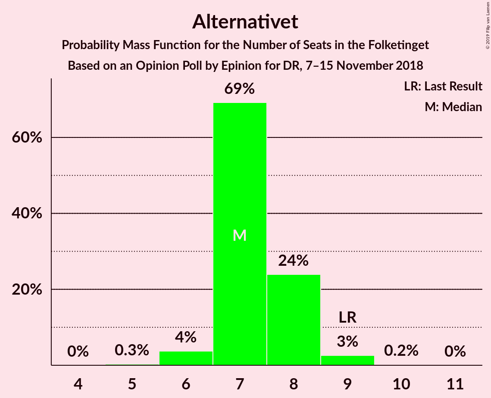

# Opinion Poll by Epinion for DR, 7–15 November 2018

<a href="#voting-intentions">Voting Intentions</a> | <a href="#seats">Seats</a> | <a href="#coalitions">Coalitions</a> | <a href="#technical-information">Technical Information</a>

## Voting Intentions

### Confidence Intervals

| Party | Last Result | Poll Result | 80% Confidence Interval | 90% Confidence Interval | 95% Confidence Interval | 99% Confidence Interval |
|:-----:|:-----------:|:-----------:|:-----------------------:|:-----------------------:|:-----------------------:|:-----------------------:|
| Socialdemokraterne | 26.3% | 26.5% | 25.1–28.0% |24.7–28.4% |24.4–28.8% |23.7–29.5% |
| Venstre | 19.5% | 18.3% | 17.1–19.6% |16.8–20.0% |16.5–20.3% |15.9–20.9% |
| Dansk Folkeparti | 21.1% | 17.5% | 16.3–18.8% |16.0–19.1% |15.7–19.4% |15.1–20.1% |
| Enhedslisten–De Rød-Grønne | 7.8% | 10.2% | 9.3–11.2% |9.0–11.5% |8.8–11.8% |8.4–12.3% |
| Radikale Venstre | 4.6% | 6.0% | 5.3–6.8% |5.1–7.1% |4.9–7.3% |4.6–7.7% |
| Socialistisk Folkeparti | 4.2% | 5.3% | 4.6–6.1% |4.4–6.3% |4.3–6.5% |4.0–6.9% |
| Liberal Alliance | 7.5% | 4.1% | 3.5–4.8% |3.3–5.0% |3.2–5.2% |2.9–5.5% |
| Alternativet | 4.8% | 4.1% | 3.5–4.8% |3.3–5.0% |3.2–5.2% |2.9–5.5% |
| Det Konservative Folkeparti | 3.4% | 4.1% | 3.5–4.8% |3.3–5.0% |3.2–5.2% |2.9–5.5% |
| Nye Borgerlige | 0.0% | 3.3% | 2.8–4.0% |2.7–4.1% |2.5–4.3% |2.3–4.6% |
| Kristendemokraterne | 0.8% | 0.5% | 0.3–0.8% |0.3–0.9% |0.3–1.0% |0.2–1.2% |

*Note:* The poll result column reflects the actual value used in the calculations. Published results may vary slightly, and in addition be rounded to fewer digits.

## Seats

### Confidence Intervals

| Party | Last Result | Median | 80% Confidence Interval | 90% Confidence Interval | 95% Confidence Interval | 99% Confidence Interval |
|:-----:|:-----------:|:------:|:-----------------------:|:-----------------------:|:-----------------------:|:-----------------------:|
| <a href="#socialdemokraterne">Socialdemokraterne</a> | 47 | 49 | 45–49 |45–49 |44–49 |43–52 |
| <a href="#venstre">Venstre</a> | 34 | 32 | 32–33 |31–34 |30–34 |28–36 |
| <a href="#dansk-folkeparti">Dansk Folkeparti</a> | 37 | 30 | 29–32 |28–33 |27–33 |27–36 |
| <a href="#enhedslisten–de-rød-grønne">Enhedslisten–De Rød-Grønne</a> | 14 | 18 | 17–19 |16–20 |16–20 |15–21 |
| <a href="#radikale-venstre">Radikale Venstre</a> | 8 | 10 | 9–11 |9–12 |9–12 |8–13 |
| <a href="#socialistisk-folkeparti">Socialistisk Folkeparti</a> | 7 | 10 | 8–10 |8–10 |8–11 |7–11 |
| <a href="#liberal-alliance">Liberal Alliance</a> | 13 | 8 | 7–8 |6–8 |6–9 |5–9 |
| <a href="#alternativet">Alternativet</a> | 9 | 7 | 7–8 |7–8 |6–9 |6–9 |
| <a href="#det-konservative-folkeparti">Det Konservative Folkeparti</a> | 6 | 6 | 6–8 |6–8 |6–8 |5–9 |
| <a href="#nye-borgerlige">Nye Borgerlige</a> | 0 | 5 | 5–6 |5–7 |5–7 |5–8 |
| <a href="#kristendemokraterne">Kristendemokraterne</a> | 0 | 0 | 0 |0 |0 |0 |

### Socialdemokraterne

*For a full overview of the results for this party, see the [Socialdemokraterne](party-socialdemokraterne.html) page.*

| Number of Seats | Probability | Accumulated | Special Marks |
|:---------------:|:-----------:|:-----------:|:-------------:|
| 40 | 0% | 100% |  |
| 41 | 0.1% | 99.9% |  |
| 42 | 0.3% | 99.9% |  |
| 43 | 0.8% | 99.6% |  |
| 44 | 3% | 98.8% |  |
| 45 | 8% | 96% |  |
| 46 | 5% | 88% |  |
| 47 | 15% | 82% | Last Result |
| 48 | 4% | 67% |  |
| 49 | 61% | 63% | Median |
| 50 | 1.2% | 2% |  |
| 51 | 0.3% | 1.0% |  |
| 52 | 0.3% | 0.7% |  |
| 53 | 0.3% | 0.3% |  |
| 54 | 0% | 0% |  |

### Venstre

*For a full overview of the results for this party, see the [Venstre](party-venstre.html) page.*

| Number of Seats | Probability | Accumulated | Special Marks |
|:---------------:|:-----------:|:-----------:|:-------------:|
| 27 | 0.1% | 100% |  |
| 28 | 0.5% | 99.9% |  |
| 29 | 1.3% | 99.5% |  |
| 30 | 1.3% | 98% |  |
| 31 | 3% | 97% |  |
| 32 | 65% | 94% | Median |
| 33 | 19% | 28% |  |
| 34 | 8% | 10% | Last Result |
| 35 | 0.9% | 2% |  |
| 36 | 0.7% | 1.1% |  |
| 37 | 0.3% | 0.4% |  |
| 38 | 0.1% | 0.1% |  |
| 39 | 0% | 0% |  |

### Dansk Folkeparti

*For a full overview of the results for this party, see the [Dansk Folkeparti](party-danskfolkeparti.html) page.*

| Number of Seats | Probability | Accumulated | Special Marks |
|:---------------:|:-----------:|:-----------:|:-------------:|
| 26 | 0.2% | 100% |  |
| 27 | 5% | 99.8% |  |
| 28 | 3% | 95% |  |
| 29 | 4% | 93% |  |
| 30 | 63% | 88% | Median |
| 31 | 15% | 26% |  |
| 32 | 3% | 10% |  |
| 33 | 6% | 8% |  |
| 34 | 0.5% | 2% |  |
| 35 | 0.4% | 1.4% |  |
| 36 | 0.8% | 1.0% |  |
| 37 | 0.2% | 0.2% | Last Result |
| 38 | 0% | 0% |  |

### Enhedslisten–De Rød-Grønne

*For a full overview of the results for this party, see the [Enhedslisten–De Rød-Grønne](party-enhedslisten–derød-grønne.html) page.*

| Number of Seats | Probability | Accumulated | Special Marks |
|:---------------:|:-----------:|:-----------:|:-------------:|
| 14 | 0.2% | 100% | Last Result |
| 15 | 2% | 99.8% |  |
| 16 | 5% | 98% |  |
| 17 | 13% | 93% |  |
| 18 | 67% | 80% | Median |
| 19 | 8% | 13% |  |
| 20 | 4% | 5% |  |
| 21 | 0.5% | 0.7% |  |
| 22 | 0.2% | 0.2% |  |
| 23 | 0% | 0% |  |

### Radikale Venstre

*For a full overview of the results for this party, see the [Radikale Venstre](party-radikalevenstre.html) page.*

| Number of Seats | Probability | Accumulated | Special Marks |
|:---------------:|:-----------:|:-----------:|:-------------:|
| 8 | 1.0% | 100% | Last Result |
| 9 | 17% | 98.9% |  |
| 10 | 70% | 81% | Median |
| 11 | 4% | 11% |  |
| 12 | 6% | 7% |  |
| 13 | 1.4% | 2% |  |
| 14 | 0.2% | 0.2% |  |
| 15 | 0% | 0% |  |

### Socialistisk Folkeparti

*For a full overview of the results for this party, see the [Socialistisk Folkeparti](party-socialistiskfolkeparti.html) page.*

| Number of Seats | Probability | Accumulated | Special Marks |
|:---------------:|:-----------:|:-----------:|:-------------:|
| 6 | 0.1% | 100% |  |
| 7 | 0.9% | 99.9% | Last Result |
| 8 | 10% | 99.1% |  |
| 9 | 8% | 90% |  |
| 10 | 78% | 82% | Median |
| 11 | 4% | 4% |  |
| 12 | 0.3% | 0.5% |  |
| 13 | 0.1% | 0.1% |  |
| 14 | 0% | 0% |  |

### Liberal Alliance

*For a full overview of the results for this party, see the [Liberal Alliance](party-liberalalliance.html) page.*

| Number of Seats | Probability | Accumulated | Special Marks |
|:---------------:|:-----------:|:-----------:|:-------------:|
| 5 | 0.6% | 100% |  |
| 6 | 5% | 99.4% |  |
| 7 | 10% | 95% |  |
| 8 | 80% | 84% | Median |
| 9 | 4% | 4% |  |
| 10 | 0.1% | 0.2% |  |
| 11 | 0% | 0% |  |
| 12 | 0% | 0% |  |
| 13 | 0% | 0% | Last Result |

### Alternativet

*For a full overview of the results for this party, see the [Alternativet](party-alternativet.html) page.*

| Number of Seats | Probability | Accumulated | Special Marks |
|:---------------:|:-----------:|:-----------:|:-------------:|
| 5 | 0.3% | 100% |  |
| 6 | 4% | 99.7% |  |
| 7 | 69% | 96% | Median |
| 8 | 24% | 27% |  |
| 9 | 3% | 3% | Last Result |
| 10 | 0.2% | 0.2% |  |
| 11 | 0% | 0% |  |

### Det Konservative Folkeparti

*For a full overview of the results for this party, see the [Det Konservative Folkeparti](party-detkonservativefolkeparti.html) page.*

| Number of Seats | Probability | Accumulated | Special Marks |
|:---------------:|:-----------:|:-----------:|:-------------:|
| 5 | 0.6% | 100% |  |
| 6 | 65% | 99.4% | Last Result, Median |
| 7 | 20% | 34% |  |
| 8 | 13% | 15% |  |
| 9 | 1.3% | 1.5% |  |
| 10 | 0.2% | 0.2% |  |
| 11 | 0% | 0% |  |

### Nye Borgerlige

*For a full overview of the results for this party, see the [Nye Borgerlige](party-nyeborgerlige.html) page.*

| Number of Seats | Probability | Accumulated | Special Marks |
|:---------------:|:-----------:|:-----------:|:-------------:|
| 0 | 0% | 100% | Last Result |
| 1 | 0% | 100% |  |
| 2 | 0% | 100% |  |
| 3 | 0% | 100% |  |
| 4 | 0.5% | 100% |  |
| 5 | 84% | 99.5% | Median |
| 6 | 10% | 15% |  |
| 7 | 4% | 6% |  |
| 8 | 2% | 2% |  |
| 9 | 0% | 0% |  |

### Kristendemokraterne

*For a full overview of the results for this party, see the [Kristendemokraterne](party-kristendemokraterne.html) page.*

| Number of Seats | Probability | Accumulated | Special Marks |
|:---------------:|:-----------:|:-----------:|:-------------:|
| 0 | 100% | 100% | Last Result, Median |

## Coalitions

### Confidence Intervals

| Coalition | Last Result | Median | Majority? | 80% Confidence Interval | 90% Confidence Interval | 95% Confidence Interval | 99% Confidence Interval |
|:---------:|:-----------:|:------:|:---------:|:-----------------------:|:-----------------------:|:-----------------------:|:-----------------------:|
| Socialdemokraterne – Enhedslisten–De Rød-Grønne – Radikale Venstre – Socialistisk Folkeparti – Alternativet | 85 | 94 | 94% | 90–94 | 89–95 | 88–95 | 86–96 |
| Socialdemokraterne – Enhedslisten–De Rød-Grønne – Radikale Venstre – Socialistisk Folkeparti | 76 | 87 | 0.4% | 82–87 | 82–87 | 81–87 | 79–89 |
| Venstre – Dansk Folkeparti – Det Konservative Folkeparti – Liberal Alliance – Nye Borgerlige – Kristendemokraterne | 90 | 81 | 0.2% | 81–85 | 80–86 | 80–87 | 79–89 |
| Venstre – Dansk Folkeparti – Det Konservative Folkeparti – Liberal Alliance – Nye Borgerlige | 90 | 81 | 0.2% | 81–85 | 80–86 | 80–87 | 79–89 |
| Venstre – Dansk Folkeparti – Det Konservative Folkeparti – Liberal Alliance – Kristendemokraterne | 90 | 76 | 0% | 76–79 | 75–80 | 75–81 | 73–83 |
| Venstre – Dansk Folkeparti – Det Konservative Folkeparti – Liberal Alliance | 90 | 76 | 0% | 76–79 | 75–80 | 75–81 | 73–83 |
| Socialdemokraterne – Radikale Venstre – Socialistisk Folkeparti | 62 | 69 | 0% | 65–69 | 63–69 | 63–69 | 61–71 |
| Socialdemokraterne – Radikale Venstre | 55 | 59 | 0% | 56–59 | 55–59 | 54–59 | 53–62 |
| Venstre – Det Konservative Folkeparti – Liberal Alliance | 53 | 46 | 0% | 46–48 | 45–50 | 43–51 | 42–51 |
| Venstre – Det Konservative Folkeparti | 40 | 38 | 0% | 38–40 | 38–42 | 37–42 | 35–44 |
| Venstre | 34 | 32 | 0% | 32–33 | 31–34 | 30–34 | 28–36 |

### Socialdemokraterne – Enhedslisten–De Rød-Grønne – Radikale Venstre – Socialistisk Folkeparti – Alternativet

| Number of Seats | Probability | Accumulated | Special Marks |
|:---------------:|:-----------:|:-----------:|:-------------:|
| 85 | 0.1% | 100% | Last Result |
| 86 | 0.5% | 99.8% |  |
| 87 | 0.6% | 99.4% |  |
| 88 | 3% | 98.8% |  |
| 89 | 1.5% | 96% |  |
| 90 | 7% | 94% | Majority |
| 91 | 14% | 87% |  |
| 92 | 3% | 73% |  |
| 93 | 5% | 70% |  |
| 94 | 60% | 65% | Median |
| 95 | 4% | 6% |  |
| 96 | 0.7% | 1.1% |  |
| 97 | 0.2% | 0.4% |  |
| 98 | 0.1% | 0.2% |  |
| 99 | 0.1% | 0.1% |  |
| 100 | 0% | 0% |  |

### Socialdemokraterne – Enhedslisten–De Rød-Grønne – Radikale Venstre – Socialistisk Folkeparti

| Number of Seats | Probability | Accumulated | Special Marks |
|:---------------:|:-----------:|:-----------:|:-------------:|
| 76 | 0% | 100% | Last Result |
| 77 | 0.1% | 100% |  |
| 78 | 0.1% | 99.9% |  |
| 79 | 0.4% | 99.8% |  |
| 80 | 0.9% | 99.3% |  |
| 81 | 2% | 98% |  |
| 82 | 7% | 96% |  |
| 83 | 12% | 89% |  |
| 84 | 5% | 77% |  |
| 85 | 4% | 71% |  |
| 86 | 2% | 67% |  |
| 87 | 63% | 64% | Median |
| 88 | 1.2% | 2% |  |
| 89 | 0.2% | 0.7% |  |
| 90 | 0.3% | 0.4% | Majority |
| 91 | 0.1% | 0.2% |  |
| 92 | 0.1% | 0.1% |  |
| 93 | 0% | 0% |  |

### Venstre – Dansk Folkeparti – Det Konservative Folkeparti – Liberal Alliance – Nye Borgerlige – Kristendemokraterne

| Number of Seats | Probability | Accumulated | Special Marks |
|:---------------:|:-----------:|:-----------:|:-------------:|
| 76 | 0.1% | 100% |  |
| 77 | 0.1% | 99.9% |  |
| 78 | 0.2% | 99.8% |  |
| 79 | 0.7% | 99.6% |  |
| 80 | 4% | 98.9% |  |
| 81 | 60% | 94% | Median |
| 82 | 5% | 35% |  |
| 83 | 3% | 30% |  |
| 84 | 14% | 27% |  |
| 85 | 7% | 13% |  |
| 86 | 1.5% | 6% |  |
| 87 | 3% | 4% |  |
| 88 | 0.6% | 1.2% |  |
| 89 | 0.5% | 0.6% |  |
| 90 | 0.1% | 0.2% | Last Result, Majority |
| 91 | 0% | 0% |  |

### Venstre – Dansk Folkeparti – Det Konservative Folkeparti – Liberal Alliance – Nye Borgerlige

| Number of Seats | Probability | Accumulated | Special Marks |
|:---------------:|:-----------:|:-----------:|:-------------:|
| 76 | 0.1% | 100% |  |
| 77 | 0.1% | 99.9% |  |
| 78 | 0.2% | 99.8% |  |
| 79 | 0.7% | 99.6% |  |
| 80 | 4% | 98.9% |  |
| 81 | 60% | 94% | Median |
| 82 | 5% | 35% |  |
| 83 | 3% | 30% |  |
| 84 | 14% | 27% |  |
| 85 | 7% | 13% |  |
| 86 | 1.5% | 6% |  |
| 87 | 3% | 4% |  |
| 88 | 0.6% | 1.2% |  |
| 89 | 0.5% | 0.6% |  |
| 90 | 0.1% | 0.2% | Last Result, Majority |
| 91 | 0% | 0% |  |

### Venstre – Dansk Folkeparti – Det Konservative Folkeparti – Liberal Alliance – Kristendemokraterne

| Number of Seats | Probability | Accumulated | Special Marks |
|:---------------:|:-----------:|:-----------:|:-------------:|
| 70 | 0.1% | 100% |  |
| 71 | 0% | 99.9% |  |
| 72 | 0.2% | 99.9% |  |
| 73 | 0.9% | 99.7% |  |
| 74 | 1.0% | 98.7% |  |
| 75 | 4% | 98% |  |
| 76 | 61% | 93% | Median |
| 77 | 5% | 32% |  |
| 78 | 5% | 27% |  |
| 79 | 12% | 22% |  |
| 80 | 5% | 10% |  |
| 81 | 3% | 5% |  |
| 82 | 1.1% | 2% |  |
| 83 | 0.7% | 0.8% |  |
| 84 | 0.1% | 0.1% |  |
| 85 | 0% | 0% |  |
| 86 | 0% | 0% |  |
| 87 | 0% | 0% |  |
| 88 | 0% | 0% |  |
| 89 | 0% | 0% |  |
| 90 | 0% | 0% | Last Result, Majority |

### Venstre – Dansk Folkeparti – Det Konservative Folkeparti – Liberal Alliance

| Number of Seats | Probability | Accumulated | Special Marks |
|:---------------:|:-----------:|:-----------:|:-------------:|
| 70 | 0.1% | 100% |  |
| 71 | 0% | 99.9% |  |
| 72 | 0.2% | 99.9% |  |
| 73 | 0.9% | 99.7% |  |
| 74 | 1.0% | 98.7% |  |
| 75 | 4% | 98% |  |
| 76 | 61% | 93% | Median |
| 77 | 5% | 32% |  |
| 78 | 5% | 27% |  |
| 79 | 12% | 22% |  |
| 80 | 5% | 10% |  |
| 81 | 3% | 5% |  |
| 82 | 1.1% | 2% |  |
| 83 | 0.7% | 0.8% |  |
| 84 | 0.1% | 0.1% |  |
| 85 | 0% | 0% |  |
| 86 | 0% | 0% |  |
| 87 | 0% | 0% |  |
| 88 | 0% | 0% |  |
| 89 | 0% | 0% |  |
| 90 | 0% | 0% | Last Result, Majority |

### Socialdemokraterne – Radikale Venstre – Socialistisk Folkeparti

| Number of Seats | Probability | Accumulated | Special Marks |
|:---------------:|:-----------:|:-----------:|:-------------:|
| 58 | 0.1% | 100% |  |
| 59 | 0% | 99.9% |  |
| 60 | 0.2% | 99.8% |  |
| 61 | 0.3% | 99.7% |  |
| 62 | 1.4% | 99.4% | Last Result |
| 63 | 4% | 98% |  |
| 64 | 4% | 94% |  |
| 65 | 3% | 91% |  |
| 66 | 14% | 88% |  |
| 67 | 7% | 73% |  |
| 68 | 4% | 66% |  |
| 69 | 60% | 62% | Median |
| 70 | 1.2% | 2% |  |
| 71 | 0.8% | 1.2% |  |
| 72 | 0.2% | 0.3% |  |
| 73 | 0% | 0.2% |  |
| 74 | 0% | 0.1% |  |
| 75 | 0.1% | 0.1% |  |
| 76 | 0% | 0% |  |

### Socialdemokraterne – Radikale Venstre

| Number of Seats | Probability | Accumulated | Special Marks |
|:---------------:|:-----------:|:-----------:|:-------------:|
| 51 | 0.2% | 100% |  |
| 52 | 0.3% | 99.8% |  |
| 53 | 0.3% | 99.5% |  |
| 54 | 3% | 99.2% |  |
| 55 | 6% | 97% | Last Result |
| 56 | 16% | 91% |  |
| 57 | 6% | 76% |  |
| 58 | 6% | 70% |  |
| 59 | 61% | 63% | Median |
| 60 | 0.7% | 2% |  |
| 61 | 0.7% | 1.5% |  |
| 62 | 0.3% | 0.8% |  |
| 63 | 0.4% | 0.5% |  |
| 64 | 0% | 0.1% |  |
| 65 | 0.1% | 0.1% |  |
| 66 | 0% | 0% |  |

### Venstre – Det Konservative Folkeparti – Liberal Alliance

| Number of Seats | Probability | Accumulated | Special Marks |
|:---------------:|:-----------:|:-----------:|:-------------:|
| 41 | 0.3% | 100% |  |
| 42 | 0.5% | 99.7% |  |
| 43 | 2% | 99.2% |  |
| 44 | 0.9% | 97% |  |
| 45 | 2% | 97% |  |
| 46 | 62% | 95% | Median |
| 47 | 8% | 33% |  |
| 48 | 16% | 24% |  |
| 49 | 2% | 8% |  |
| 50 | 3% | 6% |  |
| 51 | 3% | 3% |  |
| 52 | 0.2% | 0.3% |  |
| 53 | 0% | 0.1% | Last Result |
| 54 | 0% | 0% |  |

### Venstre – Det Konservative Folkeparti

| Number of Seats | Probability | Accumulated | Special Marks |
|:---------------:|:-----------:|:-----------:|:-------------:|
| 34 | 0.3% | 100% |  |
| 35 | 0.3% | 99.7% |  |
| 36 | 1.0% | 99.4% |  |
| 37 | 2% | 98% |  |
| 38 | 61% | 97% | Median |
| 39 | 6% | 35% |  |
| 40 | 19% | 29% | Last Result |
| 41 | 1.5% | 10% |  |
| 42 | 7% | 9% |  |
| 43 | 0.6% | 2% |  |
| 44 | 1.0% | 1.2% |  |
| 45 | 0.1% | 0.2% |  |
| 46 | 0% | 0% |  |

### Venstre

| Number of Seats | Probability | Accumulated | Special Marks |
|:---------------:|:-----------:|:-----------:|:-------------:|
| 27 | 0.1% | 100% |  |
| 28 | 0.5% | 99.9% |  |
| 29 | 1.3% | 99.5% |  |
| 30 | 1.3% | 98% |  |
| 31 | 3% | 97% |  |
| 32 | 65% | 94% | Median |
| 33 | 19% | 28% |  |
| 34 | 8% | 10% | Last Result |
| 35 | 0.9% | 2% |  |
| 36 | 0.7% | 1.1% |  |
| 37 | 0.3% | 0.4% |  |
| 38 | 0.1% | 0.1% |  |
| 39 | 0% | 0% |  |

## Technical Information

### Opinion Poll

+ **Polling firm:** Epinion
+ **Commissioner(s):** DR
+ **Fieldwork period:** 7–15 November 2018

### Calculations

+ **Sample size:** 1573
+ **Simulations done:** 1,048,576
+ **Error estimate:** 2.64%

