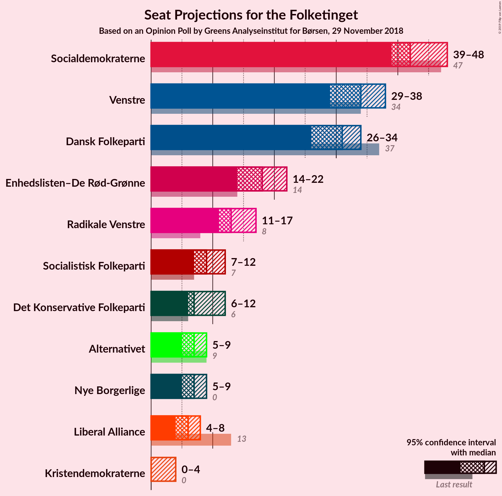
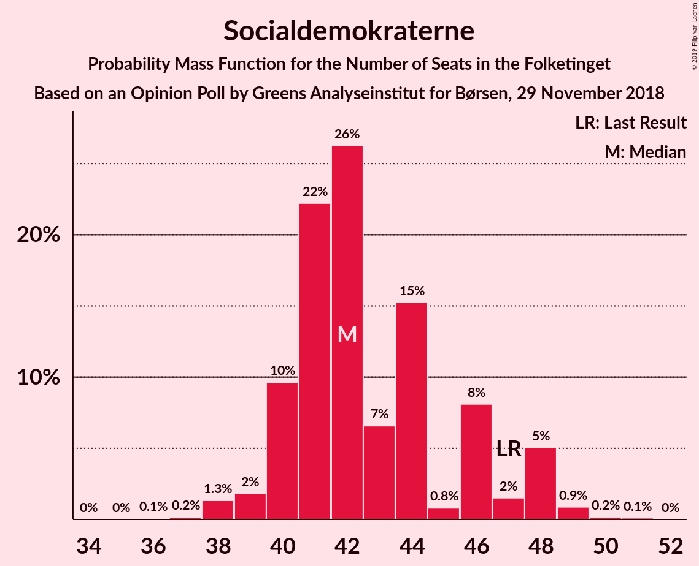
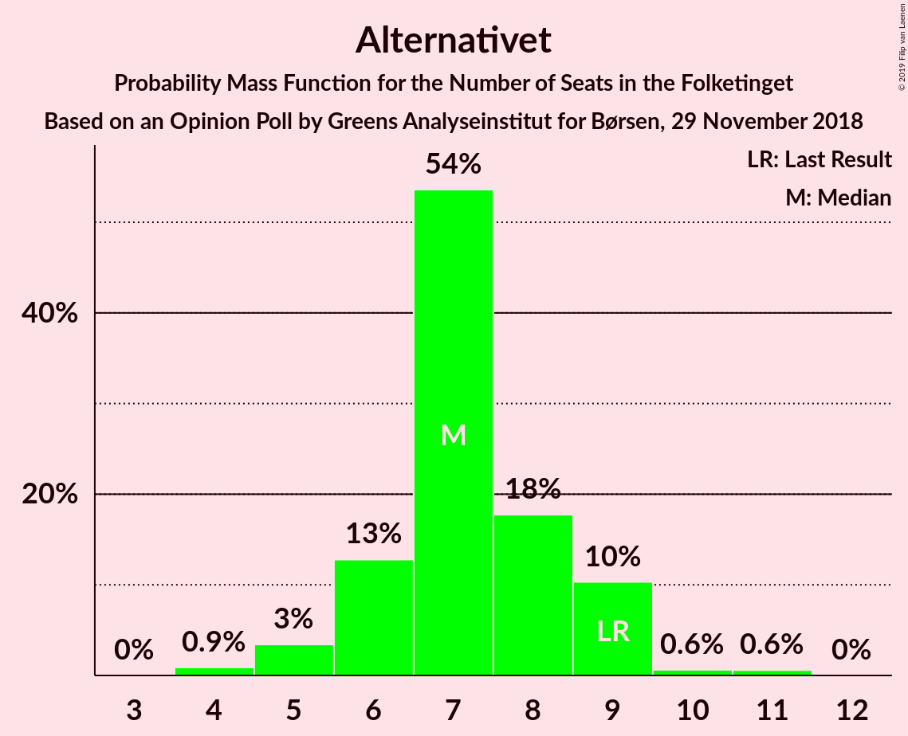
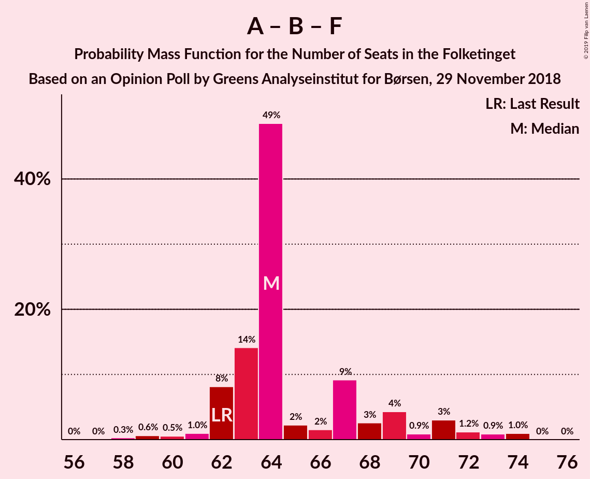
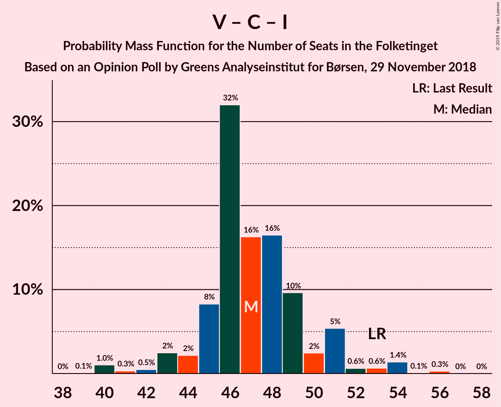

# Opinion Poll by Greens Analyseinstitut for Børsen, 29 November 2018

<a href="#voting-intentions">Voting Intentions</a> | <a href="#seats">Seats</a> | <a href="#coalitions">Coalitions</a> | <a href="#technical-information">Technical Information</a>

## Voting Intentions

### Confidence Intervals

| Party | Last Result | Poll Result | 80% Confidence Interval | 90% Confidence Interval | 95% Confidence Interval | 99% Confidence Interval |
|:-----:|:-----------:|:-----------:|:-----------------------:|:-----------------------:|:-----------------------:|:-----------------------:|
| Socialdemokraterne | 26.3% | 24.6% | 23.0–26.4% |22.6–26.9% |22.2–27.3% |21.4–28.1% |
| Venstre | 19.5% | 19.2% | 17.7–20.8% |17.3–21.2% |17.0–21.6% |16.3–22.4% |
| Dansk Folkeparti | 21.1% | 17.1% | 15.7–18.6% |15.3–19.1% |15.0–19.4% |14.3–20.2% |
| Enhedslisten–De Rød-Grønne | 7.8% | 9.6% | 8.6–10.9% |8.3–11.2% |8.0–11.5% |7.5–12.1% |
| Radikale Venstre | 4.6% | 7.6% | 6.7–8.8% |6.4–9.1% |6.2–9.4% |5.8–9.9% |
| Socialistisk Folkeparti | 4.2% | 4.8% | 4.1–5.8% |3.9–6.0% |3.7–6.3% |3.4–6.7% |
| Det Konservative Folkeparti | 3.4% | 4.6% | 3.9–5.6% |3.7–5.8% |3.5–6.1% |3.2–6.5% |
| Alternativet | 4.8% | 3.8% | 3.2–4.7% |3.0–4.9% |2.8–5.1% |2.5–5.6% |
| Nye Borgerlige | 0.0% | 3.8% | 3.2–4.7% |3.0–4.9% |2.8–5.1% |2.5–5.6% |
| Liberal Alliance | 7.5% | 3.1% | 2.5–3.9% |2.3–4.1% |2.2–4.3% |2.0–4.7% |
| Kristendemokraterne | 0.8% | 1.2% | 0.9–1.7% |0.8–1.9% |0.7–2.0% |0.6–2.3% |

*Note:* The poll result column reflects the actual value used in the calculations. Published results may vary slightly, and in addition be rounded to fewer digits.

## Seats

### Confidence Intervals

| Party | Last Result | Median | 80% Confidence Interval | 90% Confidence Interval | 95% Confidence Interval | 99% Confidence Interval |
|:-----:|:-----------:|:------:|:-----------------------:|:-----------------------:|:-----------------------:|:-----------------------:|
| <a href="#socialdemokraterne">Socialdemokraterne</a> | 47 | 43 | 40–48 |40–48 |39–48 |37–49 |
| <a href="#venstre">Venstre</a> | 34 | 35 | 31–37 |31–37 |30–38 |29–39 |
| <a href="#dansk-folkeparti">Dansk Folkeparti</a> | 37 | 30 | 28–33 |27–34 |26–35 |25–36 |
| <a href="#enhedslisten–de-rød-grønne">Enhedslisten–De Rød-Grønne</a> | 14 | 18 | 16–19 |15–20 |15–20 |14–21 |
| <a href="#radikale-venstre">Radikale Venstre</a> | 8 | 13 | 12–15 |11–15 |11–16 |10–17 |
| <a href="#socialistisk-folkeparti">Socialistisk Folkeparti</a> | 7 | 8 | 7–10 |7–10 |6–11 |6–12 |
| <a href="#det-konservative-folkeparti">Det Konservative Folkeparti</a> | 6 | 8 | 6–10 |6–10 |6–11 |6–12 |
| <a href="#alternativet">Alternativet</a> | 9 | 7 | 6–8 |6–9 |6–9 |4–10 |
| <a href="#nye-borgerlige">Nye Borgerlige</a> | 0 | 6 | 5–8 |5–8 |5–9 |4–9 |
| <a href="#liberal-alliance">Liberal Alliance</a> | 13 | 5 | 4–7 |4–7 |4–7 |0–8 |
| <a href="#kristendemokraterne">Kristendemokraterne</a> | 0 | 0 | 0 |0 |0 |0–4 |

### Socialdemokraterne

*For a full overview of the results for this party, see the [Socialdemokraterne](party-socialdemokraterne.html) page.*

| Number of Seats | Probability | Accumulated | Special Marks |
|:---------------:|:-----------:|:-----------:|:-------------:|
| 37 | 0.5% | 100% |  |
| 38 | 0.8% | 99.5% |  |
| 39 | 2% | 98.7% |  |
| 40 | 14% | 97% |  |
| 41 | 4% | 83% |  |
| 42 | 20% | 79% |  |
| 43 | 19% | 59% | Median |
| 44 | 5% | 40% |  |
| 45 | 15% | 35% |  |
| 46 | 7% | 20% |  |
| 47 | 0.9% | 13% | Last Result |
| 48 | 11% | 12% |  |
| 49 | 0.6% | 0.9% |  |
| 50 | 0.2% | 0.3% |  |
| 51 | 0.1% | 0.1% |  |
| 52 | 0% | 0% |  |

### Venstre

*For a full overview of the results for this party, see the [Venstre](party-venstre.html) page.*

| Number of Seats | Probability | Accumulated | Special Marks |
|:---------------:|:-----------:|:-----------:|:-------------:|
| 27 | 0.1% | 100% |  |
| 28 | 0.4% | 99.9% |  |
| 29 | 0.9% | 99.5% |  |
| 30 | 4% | 98.6% |  |
| 31 | 7% | 95% |  |
| 32 | 13% | 88% |  |
| 33 | 8% | 76% |  |
| 34 | 16% | 68% | Last Result |
| 35 | 20% | 52% | Median |
| 36 | 21% | 32% |  |
| 37 | 7% | 11% |  |
| 38 | 2% | 3% |  |
| 39 | 1.1% | 1.2% |  |
| 40 | 0.1% | 0.1% |  |
| 41 | 0% | 0% |  |

### Dansk Folkeparti

*For a full overview of the results for this party, see the [Dansk Folkeparti](party-danskfolkeparti.html) page.*

| Number of Seats | Probability | Accumulated | Special Marks |
|:---------------:|:-----------:|:-----------:|:-------------:|
| 24 | 0.1% | 100% |  |
| 25 | 0.4% | 99.9% |  |
| 26 | 4% | 99.5% |  |
| 27 | 5% | 95% |  |
| 28 | 12% | 91% |  |
| 29 | 18% | 78% |  |
| 30 | 15% | 60% | Median |
| 31 | 13% | 46% |  |
| 32 | 20% | 33% |  |
| 33 | 7% | 13% |  |
| 34 | 2% | 7% |  |
| 35 | 4% | 5% |  |
| 36 | 0.8% | 1.2% |  |
| 37 | 0.3% | 0.4% | Last Result |
| 38 | 0% | 0.1% |  |
| 39 | 0% | 0% |  |

### Enhedslisten–De Rød-Grønne

*For a full overview of the results for this party, see the [Enhedslisten–De Rød-Grønne](party-enhedslisten–derød-grønne.html) page.*

| Number of Seats | Probability | Accumulated | Special Marks |
|:---------------:|:-----------:|:-----------:|:-------------:|
| 12 | 0.1% | 100% |  |
| 13 | 0.2% | 99.9% |  |
| 14 | 1.5% | 99.8% | Last Result |
| 15 | 5% | 98% |  |
| 16 | 7% | 93% |  |
| 17 | 8% | 86% |  |
| 18 | 29% | 78% | Median |
| 19 | 42% | 49% |  |
| 20 | 5% | 6% |  |
| 21 | 1.3% | 2% |  |
| 22 | 0.4% | 0.5% |  |
| 23 | 0% | 0.1% |  |
| 24 | 0% | 0% |  |

### Radikale Venstre

*For a full overview of the results for this party, see the [Radikale Venstre](party-radikalevenstre.html) page.*

| Number of Seats | Probability | Accumulated | Special Marks |
|:---------------:|:-----------:|:-----------:|:-------------:|
| 8 | 0% | 100% | Last Result |
| 9 | 0% | 100% |  |
| 10 | 1.1% | 100% |  |
| 11 | 4% | 98.9% |  |
| 12 | 14% | 95% |  |
| 13 | 36% | 81% | Median |
| 14 | 16% | 45% |  |
| 15 | 25% | 29% |  |
| 16 | 2% | 4% |  |
| 17 | 1.1% | 2% |  |
| 18 | 0.3% | 0.4% |  |
| 19 | 0.1% | 0.1% |  |
| 20 | 0% | 0% |  |

### Socialistisk Folkeparti

*For a full overview of the results for this party, see the [Socialistisk Folkeparti](party-socialistiskfolkeparti.html) page.*

| Number of Seats | Probability | Accumulated | Special Marks |
|:---------------:|:-----------:|:-----------:|:-------------:|
| 5 | 0.1% | 100% |  |
| 6 | 4% | 99.9% |  |
| 7 | 13% | 96% | Last Result |
| 8 | 38% | 83% | Median |
| 9 | 25% | 45% |  |
| 10 | 17% | 20% |  |
| 11 | 2% | 3% |  |
| 12 | 0.7% | 0.8% |  |
| 13 | 0.1% | 0.1% |  |
| 14 | 0% | 0% |  |

### Det Konservative Folkeparti

*For a full overview of the results for this party, see the [Det Konservative Folkeparti](party-detkonservativefolkeparti.html) page.*

| Number of Seats | Probability | Accumulated | Special Marks |
|:---------------:|:-----------:|:-----------:|:-------------:|
| 5 | 0.4% | 100% |  |
| 6 | 17% | 99.6% | Last Result |
| 7 | 12% | 83% |  |
| 8 | 29% | 71% | Median |
| 9 | 31% | 41% |  |
| 10 | 7% | 10% |  |
| 11 | 2% | 3% |  |
| 12 | 0.5% | 0.5% |  |
| 13 | 0% | 0% |  |

### Alternativet

*For a full overview of the results for this party, see the [Alternativet](party-alternativet.html) page.*

| Number of Seats | Probability | Accumulated | Special Marks |
|:---------------:|:-----------:|:-----------:|:-------------:|
| 4 | 0.6% | 100% |  |
| 5 | 2% | 99.4% |  |
| 6 | 28% | 98% |  |
| 7 | 50% | 70% | Median |
| 8 | 13% | 20% |  |
| 9 | 7% | 7% | Last Result |
| 10 | 0.7% | 0.8% |  |
| 11 | 0.1% | 0.1% |  |
| 12 | 0% | 0% |  |

### Nye Borgerlige

*For a full overview of the results for this party, see the [Nye Borgerlige](party-nyeborgerlige.html) page.*

| Number of Seats | Probability | Accumulated | Special Marks |
|:---------------:|:-----------:|:-----------:|:-------------:|
| 0 | 0% | 100% | Last Result |
| 1 | 0% | 100% |  |
| 2 | 0% | 100% |  |
| 3 | 0% | 100% |  |
| 4 | 0.5% | 100% |  |
| 5 | 14% | 99.5% |  |
| 6 | 42% | 85% | Median |
| 7 | 14% | 43% |  |
| 8 | 27% | 29% |  |
| 9 | 2% | 3% |  |
| 10 | 0.3% | 0.4% |  |
| 11 | 0.1% | 0.1% |  |
| 12 | 0% | 0% |  |

### Liberal Alliance

*For a full overview of the results for this party, see the [Liberal Alliance](party-liberalalliance.html) page.*

| Number of Seats | Probability | Accumulated | Special Marks |
|:---------------:|:-----------:|:-----------:|:-------------:|
| 0 | 0.6% | 100% |  |
| 1 | 0% | 99.4% |  |
| 2 | 0% | 99.4% |  |
| 3 | 0% | 99.4% |  |
| 4 | 24% | 99.4% |  |
| 5 | 37% | 76% | Median |
| 6 | 22% | 39% |  |
| 7 | 15% | 17% |  |
| 8 | 1.4% | 2% |  |
| 9 | 0.2% | 0.2% |  |
| 10 | 0% | 0% |  |
| 11 | 0% | 0% |  |
| 12 | 0% | 0% |  |
| 13 | 0% | 0% | Last Result |

### Kristendemokraterne

*For a full overview of the results for this party, see the [Kristendemokraterne](party-kristendemokraterne.html) page.*

| Number of Seats | Probability | Accumulated | Special Marks |
|:---------------:|:-----------:|:-----------:|:-------------:|
| 0 | 99.1% | 100% | Last Result, Median |
| 1 | 0% | 0.9% |  |
| 2 | 0% | 0.9% |  |
| 3 | 0% | 0.9% |  |
| 4 | 0.8% | 0.9% |  |
| 5 | 0.1% | 0.1% |  |
| 6 | 0% | 0% |  |

## Coalitions

### Confidence Intervals

| Coalition | Last Result | Median | Majority? | 80% Confidence Interval | 90% Confidence Interval | 95% Confidence Interval | 99% Confidence Interval |
|:---------:|:-----------:|:------:|:---------:|:-----------------------:|:-----------------------:|:-----------------------:|:-----------------------:|
| Socialdemokraterne – Enhedslisten–De Rød-Grønne – Radikale Venstre – Socialistisk Folkeparti – Alternativet | 85 | 91 | 62% | 87–95 | 85–96 | 85–96 | 82–97 |
| Venstre – Dansk Folkeparti – Det Konservative Folkeparti – Nye Borgerlige – Liberal Alliance – Kristendemokraterne | 90 | 84 | 5% | 80–88 | 79–90 | 79–90 | 78–93 |
| Venstre – Dansk Folkeparti – Det Konservative Folkeparti – Nye Borgerlige – Liberal Alliance | 90 | 84 | 5% | 80–87 | 79–90 | 79–90 | 78–93 |
| Socialdemokraterne – Enhedslisten–De Rød-Grønne – Radikale Venstre – Socialistisk Folkeparti | 76 | 84 | 0.6% | 80–87 | 78–89 | 77–89 | 76–90 |
| Venstre – Dansk Folkeparti – Det Konservative Folkeparti – Liberal Alliance – Kristendemokraterne | 90 | 78 | 0% | 73–81 | 73–83 | 73–84 | 72–85 |
| Venstre – Dansk Folkeparti – Det Konservative Folkeparti – Liberal Alliance | 90 | 78 | 0% | 73–81 | 73–83 | 73–84 | 72–85 |
| Socialdemokraterne – Radikale Venstre – Socialistisk Folkeparti | 62 | 66 | 0% | 62–69 | 61–70 | 60–70 | 59–72 |
| Socialdemokraterne – Radikale Venstre | 55 | 58 | 0% | 54–61 | 53–61 | 52–62 | 51–63 |
| Venstre – Det Konservative Folkeparti – Liberal Alliance | 53 | 48 | 0% | 45–50 | 44–51 | 43–52 | 42–54 |
| Venstre – Det Konservative Folkeparti | 40 | 42 | 0% | 40–45 | 39–45 | 38–47 | 37–48 |
| Venstre | 34 | 35 | 0% | 31–37 | 31–37 | 30–38 | 29–39 |

### Socialdemokraterne – Enhedslisten–De Rød-Grønne – Radikale Venstre – Socialistisk Folkeparti – Alternativet

| Number of Seats | Probability | Accumulated | Special Marks |
|:---------------:|:-----------:|:-----------:|:-------------:|
| 81 | 0.1% | 100% |  |
| 82 | 0.7% | 99.9% |  |
| 83 | 0.1% | 99.2% |  |
| 84 | 0.9% | 99.1% |  |
| 85 | 3% | 98% | Last Result |
| 86 | 4% | 95% |  |
| 87 | 1.5% | 91% |  |
| 88 | 13% | 90% |  |
| 89 | 15% | 77% | Median |
| 90 | 11% | 62% | Majority |
| 91 | 22% | 50% |  |
| 92 | 7% | 28% |  |
| 93 | 8% | 21% |  |
| 94 | 0.9% | 13% |  |
| 95 | 3% | 12% |  |
| 96 | 8% | 9% |  |
| 97 | 0.4% | 0.6% |  |
| 98 | 0.1% | 0.2% |  |
| 99 | 0.1% | 0.1% |  |
| 100 | 0% | 0% |  |

### Venstre – Dansk Folkeparti – Det Konservative Folkeparti – Nye Borgerlige – Liberal Alliance – Kristendemokraterne

| Number of Seats | Probability | Accumulated | Special Marks |
|:---------------:|:-----------:|:-----------:|:-------------:|
| 76 | 0.1% | 100% |  |
| 77 | 0.1% | 99.9% |  |
| 78 | 0.4% | 99.8% |  |
| 79 | 8% | 99.4% |  |
| 80 | 3% | 91% |  |
| 81 | 0.9% | 88% |  |
| 82 | 8% | 87% |  |
| 83 | 7% | 79% |  |
| 84 | 22% | 72% | Median |
| 85 | 11% | 50% |  |
| 86 | 15% | 38% |  |
| 87 | 13% | 23% |  |
| 88 | 1.5% | 10% |  |
| 89 | 4% | 9% |  |
| 90 | 3% | 5% | Last Result, Majority |
| 91 | 0.9% | 2% |  |
| 92 | 0.1% | 0.9% |  |
| 93 | 0.7% | 0.8% |  |
| 94 | 0.1% | 0.1% |  |
| 95 | 0% | 0% |  |

### Venstre – Dansk Folkeparti – Det Konservative Folkeparti – Nye Borgerlige – Liberal Alliance

| Number of Seats | Probability | Accumulated | Special Marks |
|:---------------:|:-----------:|:-----------:|:-------------:|
| 76 | 0.1% | 100% |  |
| 77 | 0.1% | 99.9% |  |
| 78 | 0.5% | 99.8% |  |
| 79 | 8% | 99.3% |  |
| 80 | 3% | 91% |  |
| 81 | 1.2% | 88% |  |
| 82 | 8% | 87% |  |
| 83 | 7% | 79% |  |
| 84 | 22% | 71% | Median |
| 85 | 11% | 49% |  |
| 86 | 15% | 38% |  |
| 87 | 13% | 23% |  |
| 88 | 1.4% | 10% |  |
| 89 | 4% | 9% |  |
| 90 | 3% | 5% | Last Result, Majority |
| 91 | 0.9% | 2% |  |
| 92 | 0.1% | 0.9% |  |
| 93 | 0.7% | 0.8% |  |
| 94 | 0.1% | 0.1% |  |
| 95 | 0% | 0% |  |

### Socialdemokraterne – Enhedslisten–De Rød-Grønne – Radikale Venstre – Socialistisk Folkeparti

| Number of Seats | Probability | Accumulated | Special Marks |
|:---------------:|:-----------:|:-----------:|:-------------:|
| 75 | 0.1% | 100% |  |
| 76 | 1.0% | 99.8% | Last Result |
| 77 | 3% | 98.8% |  |
| 78 | 2% | 96% |  |
| 79 | 2% | 94% |  |
| 80 | 5% | 92% |  |
| 81 | 10% | 87% |  |
| 82 | 9% | 77% | Median |
| 83 | 17% | 68% |  |
| 84 | 13% | 51% |  |
| 85 | 21% | 38% |  |
| 86 | 6% | 17% |  |
| 87 | 2% | 11% |  |
| 88 | 0.8% | 10% |  |
| 89 | 8% | 9% |  |
| 90 | 0.3% | 0.6% | Majority |
| 91 | 0.1% | 0.3% |  |
| 92 | 0.1% | 0.1% |  |
| 93 | 0% | 0% |  |

### Venstre – Dansk Folkeparti – Det Konservative Folkeparti – Liberal Alliance – Kristendemokraterne

| Number of Seats | Probability | Accumulated | Special Marks |
|:---------------:|:-----------:|:-----------:|:-------------:|
| 69 | 0% | 100% |  |
| 70 | 0.3% | 99.9% |  |
| 71 | 0.1% | 99.7% |  |
| 72 | 1.2% | 99.5% |  |
| 73 | 9% | 98% |  |
| 74 | 5% | 90% |  |
| 75 | 3% | 84% |  |
| 76 | 7% | 81% |  |
| 77 | 5% | 75% |  |
| 78 | 34% | 69% | Median |
| 79 | 10% | 35% |  |
| 80 | 5% | 25% |  |
| 81 | 12% | 20% |  |
| 82 | 2% | 7% |  |
| 83 | 2% | 6% |  |
| 84 | 3% | 4% |  |
| 85 | 0.4% | 0.8% |  |
| 86 | 0.3% | 0.4% |  |
| 87 | 0.1% | 0.1% |  |
| 88 | 0% | 0% |  |
| 89 | 0% | 0% |  |
| 90 | 0% | 0% | Last Result, Majority |

### Venstre – Dansk Folkeparti – Det Konservative Folkeparti – Liberal Alliance

| Number of Seats | Probability | Accumulated | Special Marks |
|:---------------:|:-----------:|:-----------:|:-------------:|
| 69 | 0% | 100% |  |
| 70 | 0.3% | 99.9% |  |
| 71 | 0.1% | 99.7% |  |
| 72 | 1.2% | 99.5% |  |
| 73 | 9% | 98% |  |
| 74 | 5% | 89% |  |
| 75 | 3% | 84% |  |
| 76 | 7% | 81% |  |
| 77 | 5% | 74% |  |
| 78 | 34% | 69% | Median |
| 79 | 10% | 35% |  |
| 80 | 5% | 25% |  |
| 81 | 12% | 20% |  |
| 82 | 2% | 7% |  |
| 83 | 1.5% | 5% |  |
| 84 | 3% | 4% |  |
| 85 | 0.4% | 0.8% |  |
| 86 | 0.3% | 0.4% |  |
| 87 | 0.1% | 0.1% |  |
| 88 | 0% | 0% |  |
| 89 | 0% | 0% |  |
| 90 | 0% | 0% | Last Result, Majority |

### Socialdemokraterne – Radikale Venstre – Socialistisk Folkeparti

| Number of Seats | Probability | Accumulated | Special Marks |
|:---------------:|:-----------:|:-----------:|:-------------:|
| 58 | 0.3% | 100% |  |
| 59 | 1.4% | 99.6% |  |
| 60 | 2% | 98% |  |
| 61 | 2% | 96% |  |
| 62 | 10% | 94% | Last Result |
| 63 | 9% | 84% |  |
| 64 | 12% | 75% | Median |
| 65 | 13% | 64% |  |
| 66 | 24% | 51% |  |
| 67 | 6% | 27% |  |
| 68 | 5% | 21% |  |
| 69 | 6% | 16% |  |
| 70 | 8% | 10% |  |
| 71 | 0.7% | 1.5% |  |
| 72 | 0.3% | 0.7% |  |
| 73 | 0.2% | 0.4% |  |
| 74 | 0.2% | 0.2% |  |
| 75 | 0% | 0% |  |

### Socialdemokraterne – Radikale Venstre

| Number of Seats | Probability | Accumulated | Special Marks |
|:---------------:|:-----------:|:-----------:|:-------------:|
| 49 | 0% | 100% |  |
| 50 | 0.3% | 99.9% |  |
| 51 | 0.5% | 99.6% |  |
| 52 | 2% | 99.1% |  |
| 53 | 5% | 97% |  |
| 54 | 16% | 92% |  |
| 55 | 14% | 76% | Last Result |
| 56 | 7% | 62% | Median |
| 57 | 4% | 54% |  |
| 58 | 29% | 50% |  |
| 59 | 3% | 21% |  |
| 60 | 2% | 18% |  |
| 61 | 13% | 16% |  |
| 62 | 2% | 3% |  |
| 63 | 0.8% | 1.2% |  |
| 64 | 0.2% | 0.4% |  |
| 65 | 0.1% | 0.2% |  |
| 66 | 0.1% | 0.1% |  |
| 67 | 0% | 0% |  |

### Venstre – Det Konservative Folkeparti – Liberal Alliance

| Number of Seats | Probability | Accumulated | Special Marks |
|:---------------:|:-----------:|:-----------:|:-------------:|
| 40 | 0.2% | 100% |  |
| 41 | 0.3% | 99.8% |  |
| 42 | 0.8% | 99.6% |  |
| 43 | 1.4% | 98.7% |  |
| 44 | 4% | 97% |  |
| 45 | 11% | 94% |  |
| 46 | 20% | 82% |  |
| 47 | 8% | 63% |  |
| 48 | 8% | 54% | Median |
| 49 | 32% | 47% |  |
| 50 | 9% | 15% |  |
| 51 | 3% | 6% |  |
| 52 | 0.9% | 3% |  |
| 53 | 0.6% | 2% | Last Result |
| 54 | 1.1% | 1.3% |  |
| 55 | 0% | 0.1% |  |
| 56 | 0% | 0.1% |  |
| 57 | 0% | 0.1% |  |
| 58 | 0% | 0% |  |

### Venstre – Det Konservative Folkeparti

| Number of Seats | Probability | Accumulated | Special Marks |
|:---------------:|:-----------:|:-----------:|:-------------:|
| 35 | 0.1% | 100% |  |
| 36 | 0.3% | 99.9% |  |
| 37 | 0.6% | 99.6% |  |
| 38 | 3% | 99.0% |  |
| 39 | 4% | 96% |  |
| 40 | 14% | 92% | Last Result |
| 41 | 15% | 79% |  |
| 42 | 24% | 63% |  |
| 43 | 10% | 40% | Median |
| 44 | 6% | 30% |  |
| 45 | 20% | 24% |  |
| 46 | 1.3% | 4% |  |
| 47 | 2% | 3% |  |
| 48 | 0.8% | 0.9% |  |
| 49 | 0% | 0.1% |  |
| 50 | 0% | 0.1% |  |
| 51 | 0.1% | 0.1% |  |
| 52 | 0% | 0% |  |

### Venstre

| Number of Seats | Probability | Accumulated | Special Marks |
|:---------------:|:-----------:|:-----------:|:-------------:|
| 27 | 0.1% | 100% |  |
| 28 | 0.4% | 99.9% |  |
| 29 | 0.9% | 99.5% |  |
| 30 | 4% | 98.6% |  |
| 31 | 7% | 95% |  |
| 32 | 13% | 88% |  |
| 33 | 8% | 76% |  |
| 34 | 16% | 68% | Last Result |
| 35 | 20% | 52% | Median |
| 36 | 21% | 32% |  |
| 37 | 7% | 11% |  |
| 38 | 2% | 3% |  |
| 39 | 1.1% | 1.2% |  |
| 40 | 0.1% | 0.1% |  |
| 41 | 0% | 0% |  |

## Technical Information

### Opinion Poll

+ **Polling firm:** Greens Analyseinstitut
+ **Commissioner(s):** Børsen
+ **Fieldwork period:** 29 November 2018

### Calculations

+ **Sample size:** 1100
+ **Simulations done:** 1,048,576
+ **Error estimate:** 2.97%

