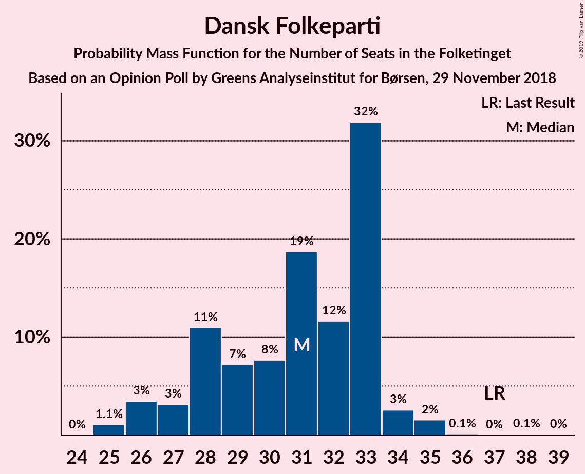
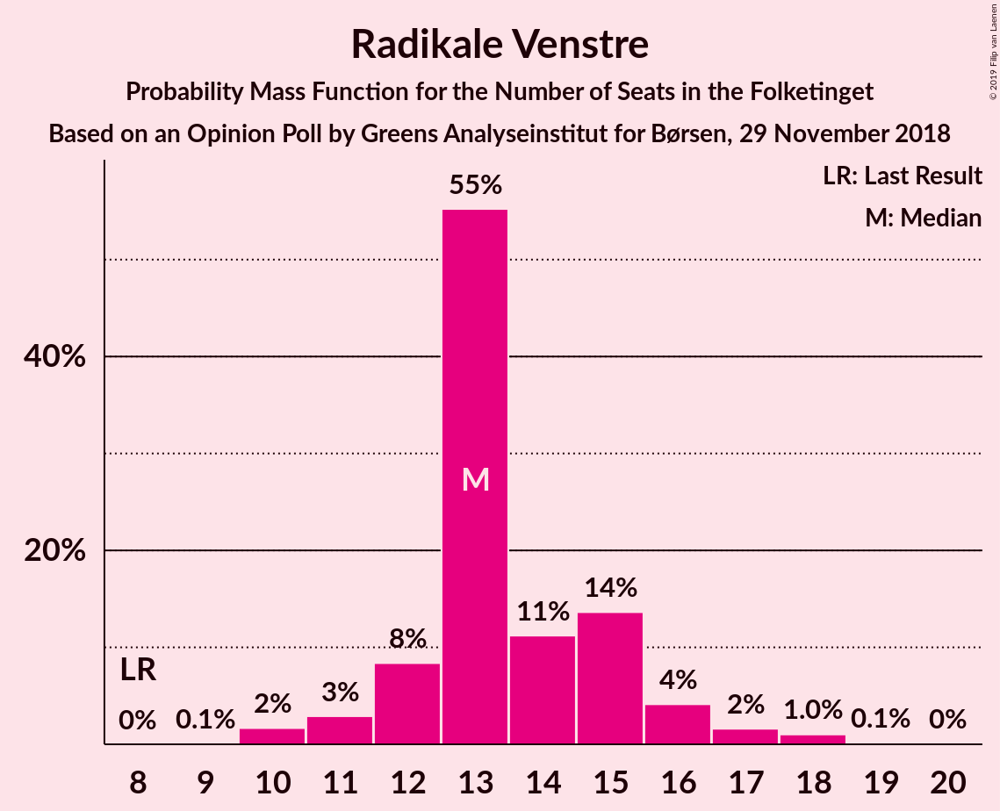
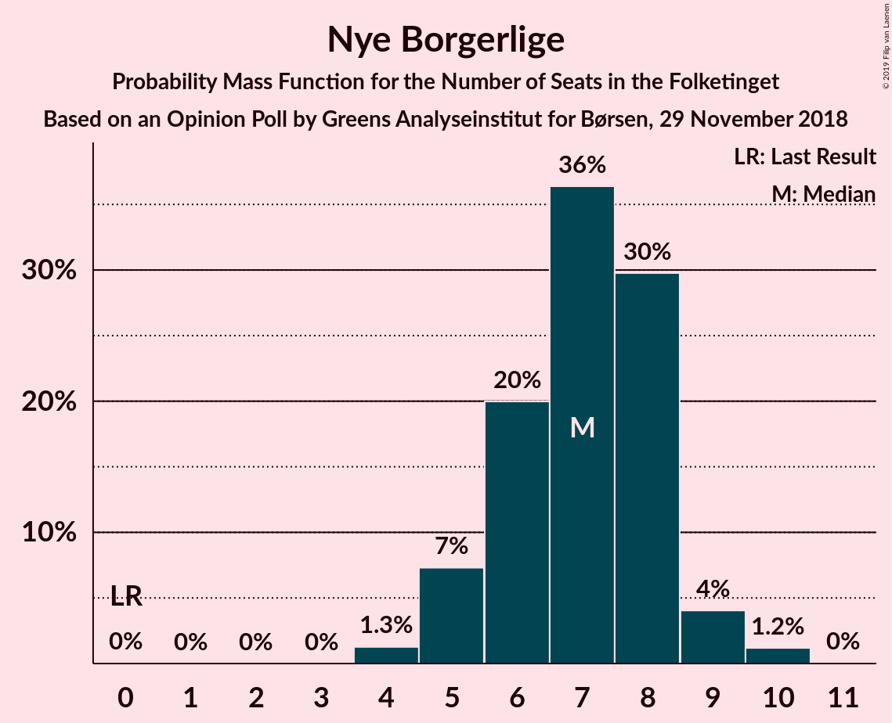
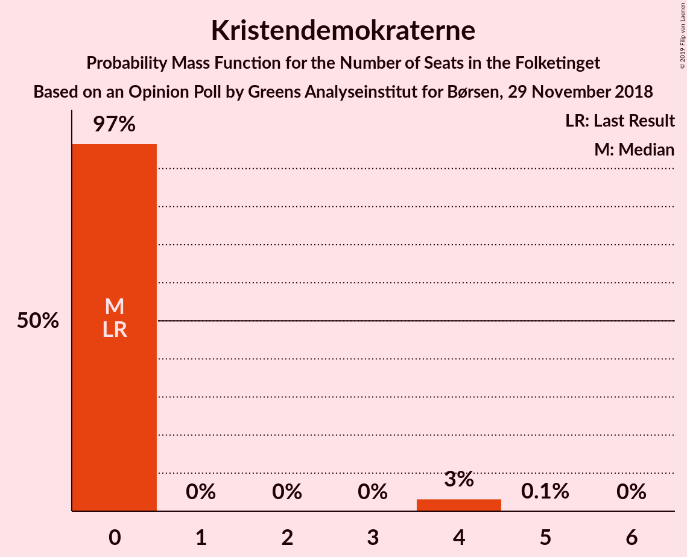
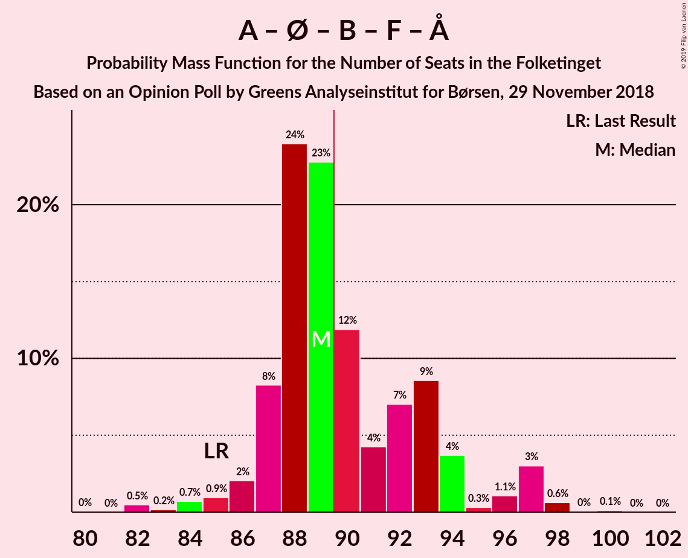
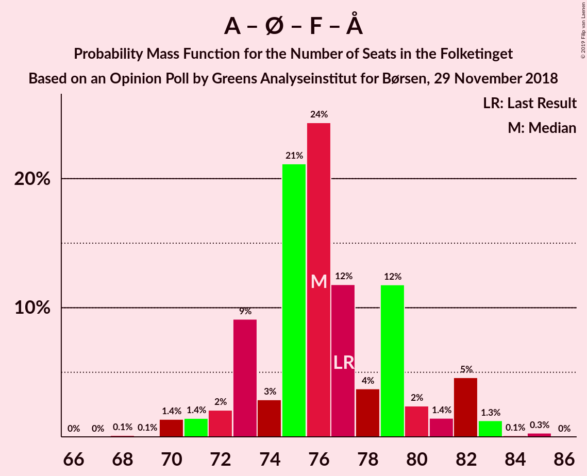
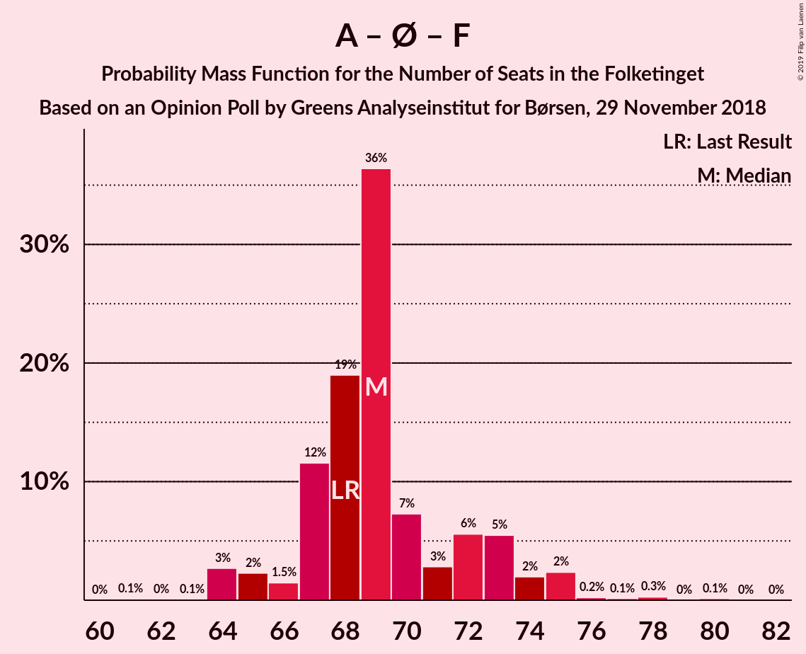

# Opinion Poll by Greens Analyseinstitut for Børsen, 29 November 2018

<a href="#voting-intentions">Voting Intentions</a> | <a href="#seats">Seats</a> | <a href="#coalitions">Coalitions</a> | <a href="#technical-information">Technical Information</a>

## Voting Intentions

### Confidence Intervals

| Party | Last Result | Poll Result | 80% Confidence Interval | 90% Confidence Interval | 95% Confidence Interval | 99% Confidence Interval |
|:-----:|:-----------:|:-----------:|:-----------------------:|:-----------------------:|:-----------------------:|:-----------------------:|
| Socialdemokraterne | 26.3% | 24.6% | 23.0–26.4% |22.6–26.9% |22.2–27.3% |21.4–28.1% |
| Venstre | 19.5% | 19.2% | 17.7–20.8% |17.3–21.2% |17.0–21.6% |16.3–22.4% |
| Dansk Folkeparti | 21.1% | 17.1% | 15.7–18.6% |15.3–19.1% |15.0–19.4% |14.3–20.2% |
| Enhedslisten–De Rød-Grønne | 7.8% | 9.6% | 8.6–10.9% |8.3–11.2% |8.0–11.5% |7.5–12.1% |
| Radikale Venstre | 4.6% | 7.6% | 6.7–8.8% |6.4–9.1% |6.2–9.4% |5.8–9.9% |
| Socialistisk Folkeparti | 4.2% | 4.8% | 4.1–5.8% |3.9–6.0% |3.7–6.3% |3.4–6.7% |
| Det Konservative Folkeparti | 3.4% | 4.6% | 3.9–5.6% |3.7–5.8% |3.5–6.1% |3.2–6.5% |
| Alternativet | 4.8% | 3.8% | 3.2–4.7% |3.0–4.9% |2.8–5.1% |2.5–5.6% |
| Nye Borgerlige | 0.0% | 3.8% | 3.2–4.7% |3.0–4.9% |2.8–5.1% |2.5–5.6% |
| Liberal Alliance | 7.5% | 3.1% | 2.5–3.9% |2.3–4.1% |2.2–4.3% |2.0–4.7% |
| Kristendemokraterne | 0.8% | 1.2% | 0.9–1.7% |0.8–1.9% |0.7–2.0% |0.6–2.3% |

*Note:* The poll result column reflects the actual value used in the calculations. Published results may vary slightly, and in addition be rounded to fewer digits.

## Seats

### Confidence Intervals

| Party | Last Result | Median | 80% Confidence Interval | 90% Confidence Interval | 95% Confidence Interval | 99% Confidence Interval |
|:-----:|:-----------:|:------:|:-----------------------:|:-----------------------:|:-----------------------:|:-----------------------:|
| <a href="#socialdemokraterne">Socialdemokraterne</a> | 47 | 42 | 40–46 |40–48 |39–48 |38–49 |
| <a href="#venstre">Venstre</a> | 34 | 34 | 31–35 |29–36 |29–38 |27–39 |
| <a href="#dansk-folkeparti">Dansk Folkeparti</a> | 37 | 31 | 28–33 |27–33 |26–34 |25–35 |
| <a href="#enhedslisten–de-rød-grønne">Enhedslisten–De Rød-Grønne</a> | 14 | 18 | 16–20 |15–22 |14–22 |14–22 |
| <a href="#radikale-venstre">Radikale Venstre</a> | 8 | 13 | 12–15 |12–16 |11–17 |10–18 |
| <a href="#socialistisk-folkeparti">Socialistisk Folkeparti</a> | 7 | 9 | 7–10 |7–11 |7–12 |5–13 |
| <a href="#det-konservative-folkeparti">Det Konservative Folkeparti</a> | 6 | 7 | 6–11 |6–12 |6–12 |6–12 |
| <a href="#alternativet">Alternativet</a> | 9 | 7 | 6–9 |6–9 |5–9 |4–11 |
| <a href="#nye-borgerlige">Nye Borgerlige</a> | 0 | 7 | 6–8 |5–9 |5–9 |4–10 |
| <a href="#liberal-alliance">Liberal Alliance</a> | 13 | 6 | 4–7 |4–7 |4–8 |4–8 |
| <a href="#kristendemokraterne">Kristendemokraterne</a> | 0 | 0 | 0 |0 |0–4 |0–4 |

### Socialdemokraterne

*For a full overview of the results for this party, see the [Socialdemokraterne](party-socialdemokraterne.html) page.*

| Number of Seats | Probability | Accumulated | Special Marks |
|:---------------:|:-----------:|:-----------:|:-------------:|
| 36 | 0.1% | 100% |  |
| 37 | 0.2% | 99.9% |  |
| 38 | 1.3% | 99.7% |  |
| 39 | 2% | 98% |  |
| 40 | 10% | 97% |  |
| 41 | 22% | 87% |  |
| 42 | 26% | 65% | Median |
| 43 | 7% | 38% |  |
| 44 | 15% | 32% |  |
| 45 | 0.8% | 17% |  |
| 46 | 8% | 16% |  |
| 47 | 2% | 8% | Last Result |
| 48 | 5% | 6% |  |
| 49 | 0.9% | 1.2% |  |
| 50 | 0.2% | 0.3% |  |
| 51 | 0.1% | 0.1% |  |
| 52 | 0% | 0% |  |

### Venstre

*For a full overview of the results for this party, see the [Venstre](party-venstre.html) page.*

| Number of Seats | Probability | Accumulated | Special Marks |
|:---------------:|:-----------:|:-----------:|:-------------:|
| 27 | 1.0% | 100% |  |
| 28 | 0.2% | 99.0% |  |
| 29 | 4% | 98.8% |  |
| 30 | 3% | 95% |  |
| 31 | 13% | 92% |  |
| 32 | 2% | 79% |  |
| 33 | 25% | 77% |  |
| 34 | 15% | 52% | Last Result, Median |
| 35 | 29% | 37% |  |
| 36 | 3% | 8% |  |
| 37 | 1.4% | 4% |  |
| 38 | 1.2% | 3% |  |
| 39 | 1.3% | 2% |  |
| 40 | 0.3% | 0.3% |  |
| 41 | 0% | 0% |  |

### Dansk Folkeparti

*For a full overview of the results for this party, see the [Dansk Folkeparti](party-danskfolkeparti.html) page.*

| Number of Seats | Probability | Accumulated | Special Marks |
|:---------------:|:-----------:|:-----------:|:-------------:|
| 25 | 1.1% | 100% |  |
| 26 | 3% | 98.9% |  |
| 27 | 3% | 95% |  |
| 28 | 11% | 92% |  |
| 29 | 7% | 81% |  |
| 30 | 8% | 74% |  |
| 31 | 19% | 67% | Median |
| 32 | 12% | 48% |  |
| 33 | 32% | 36% |  |
| 34 | 3% | 4% |  |
| 35 | 2% | 2% |  |
| 36 | 0.1% | 0.3% |  |
| 37 | 0% | 0.1% | Last Result |
| 38 | 0.1% | 0.1% |  |
| 39 | 0% | 0% |  |

### Enhedslisten–De Rød-Grønne

*For a full overview of the results for this party, see the [Enhedslisten–De Rød-Grønne](party-enhedslisten–derød-grønne.html) page.*

| Number of Seats | Probability | Accumulated | Special Marks |
|:---------------:|:-----------:|:-----------:|:-------------:|
| 12 | 0.1% | 100% |  |
| 13 | 0.3% | 99.9% |  |
| 14 | 4% | 99.7% | Last Result |
| 15 | 5% | 96% |  |
| 16 | 8% | 91% |  |
| 17 | 24% | 83% |  |
| 18 | 36% | 58% | Median |
| 19 | 6% | 22% |  |
| 20 | 7% | 15% |  |
| 21 | 3% | 8% |  |
| 22 | 5% | 5% |  |
| 23 | 0% | 0.1% |  |
| 24 | 0% | 0.1% |  |
| 25 | 0% | 0% |  |

### Radikale Venstre

*For a full overview of the results for this party, see the [Radikale Venstre](party-radikalevenstre.html) page.*

| Number of Seats | Probability | Accumulated | Special Marks |
|:---------------:|:-----------:|:-----------:|:-------------:|
| 8 | 0% | 100% | Last Result |
| 9 | 0.1% | 100% |  |
| 10 | 2% | 99.9% |  |
| 11 | 3% | 98% |  |
| 12 | 8% | 95% |  |
| 13 | 55% | 87% | Median |
| 14 | 11% | 32% |  |
| 15 | 14% | 21% |  |
| 16 | 4% | 7% |  |
| 17 | 2% | 3% |  |
| 18 | 1.0% | 1.2% |  |
| 19 | 0.1% | 0.1% |  |
| 20 | 0% | 0% |  |

### Socialistisk Folkeparti

*For a full overview of the results for this party, see the [Socialistisk Folkeparti](party-socialistiskfolkeparti.html) page.*

| Number of Seats | Probability | Accumulated | Special Marks |
|:---------------:|:-----------:|:-----------:|:-------------:|
| 5 | 1.0% | 100% |  |
| 6 | 1.1% | 99.0% |  |
| 7 | 26% | 98% | Last Result |
| 8 | 10% | 72% |  |
| 9 | 33% | 61% | Median |
| 10 | 22% | 28% |  |
| 11 | 3% | 6% |  |
| 12 | 2% | 3% |  |
| 13 | 1.1% | 1.1% |  |
| 14 | 0% | 0% |  |

### Det Konservative Folkeparti

*For a full overview of the results for this party, see the [Det Konservative Folkeparti](party-detkonservativefolkeparti.html) page.*

| Number of Seats | Probability | Accumulated | Special Marks |
|:---------------:|:-----------:|:-----------:|:-------------:|
| 5 | 0.1% | 100% |  |
| 6 | 24% | 99.9% | Last Result |
| 7 | 39% | 76% | Median |
| 8 | 11% | 37% |  |
| 9 | 6% | 25% |  |
| 10 | 3% | 19% |  |
| 11 | 11% | 16% |  |
| 12 | 5% | 5% |  |
| 13 | 0.2% | 0.2% |  |
| 14 | 0% | 0% |  |

### Alternativet

*For a full overview of the results for this party, see the [Alternativet](party-alternativet.html) page.*

| Number of Seats | Probability | Accumulated | Special Marks |
|:---------------:|:-----------:|:-----------:|:-------------:|
| 4 | 0.9% | 100% |  |
| 5 | 3% | 99.1% |  |
| 6 | 13% | 96% |  |
| 7 | 54% | 83% | Median |
| 8 | 18% | 29% |  |
| 9 | 10% | 12% | Last Result |
| 10 | 0.6% | 1.2% |  |
| 11 | 0.6% | 0.6% |  |
| 12 | 0% | 0% |  |

### Nye Borgerlige

*For a full overview of the results for this party, see the [Nye Borgerlige](party-nyeborgerlige.html) page.*

| Number of Seats | Probability | Accumulated | Special Marks |
|:---------------:|:-----------:|:-----------:|:-------------:|
| 0 | 0% | 100% | Last Result |
| 1 | 0% | 100% |  |
| 2 | 0% | 100% |  |
| 3 | 0% | 100% |  |
| 4 | 1.3% | 100% |  |
| 5 | 7% | 98.7% |  |
| 6 | 20% | 91% |  |
| 7 | 36% | 71% | Median |
| 8 | 30% | 35% |  |
| 9 | 4% | 5% |  |
| 10 | 1.2% | 1.2% |  |
| 11 | 0% | 0% |  |

### Liberal Alliance

*For a full overview of the results for this party, see the [Liberal Alliance](party-liberalalliance.html) page.*

| Number of Seats | Probability | Accumulated | Special Marks |
|:---------------:|:-----------:|:-----------:|:-------------:|
| 0 | 0.3% | 100% |  |
| 1 | 0% | 99.7% |  |
| 2 | 0% | 99.7% |  |
| 3 | 0% | 99.7% |  |
| 4 | 14% | 99.7% |  |
| 5 | 25% | 86% |  |
| 6 | 26% | 61% | Median |
| 7 | 32% | 35% |  |
| 8 | 3% | 3% |  |
| 9 | 0.5% | 0.5% |  |
| 10 | 0% | 0% |  |
| 11 | 0% | 0% |  |
| 12 | 0% | 0% |  |
| 13 | 0% | 0% | Last Result |

### Kristendemokraterne

*For a full overview of the results for this party, see the [Kristendemokraterne](party-kristendemokraterne.html) page.*

| Number of Seats | Probability | Accumulated | Special Marks |
|:---------------:|:-----------:|:-----------:|:-------------:|
| 0 | 97% | 100% | Last Result, Median |
| 1 | 0% | 3% |  |
| 2 | 0% | 3% |  |
| 3 | 0% | 3% |  |
| 4 | 3% | 3% |  |
| 5 | 0.1% | 0.1% |  |
| 6 | 0% | 0% |  |

## Coalitions

### Confidence Intervals

| Coalition | Last Result | Median | Majority? | 80% Confidence Interval | 90% Confidence Interval | 95% Confidence Interval | 99% Confidence Interval |
|:---------:|:-----------:|:------:|:---------:|:-----------------------:|:-----------------------:|:-----------------------:|:-----------------------:|
| Socialdemokraterne – Enhedslisten–De Rød-Grønne – Radikale Venstre – Socialistisk Folkeparti – Alternativet | 85 | 89 | 41% | 87–93 | 87–95 | 86–97 | 82–98 |
| Socialdemokraterne – Enhedslisten–De Rød-Grønne – Radikale Venstre – Socialistisk Folkeparti | 76 | 82 | 3% | 80–86 | 79–88 | 79–90 | 75–90 |
| Venstre – Dansk Folkeparti – Det Konservative Folkeparti – Nye Borgerlige – Liberal Alliance – Kristendemokraterne | 90 | 86 | 2% | 82–88 | 80–88 | 78–89 | 77–93 |
| Venstre – Dansk Folkeparti – Det Konservative Folkeparti – Nye Borgerlige – Liberal Alliance | 90 | 86 | 2% | 81–88 | 79–88 | 78–89 | 77–93 |
| Venstre – Dansk Folkeparti – Det Konservative Folkeparti – Liberal Alliance – Kristendemokraterne | 90 | 79 | 0% | 75–80 | 73–82 | 72–84 | 70–84 |
| Venstre – Dansk Folkeparti – Det Konservative Folkeparti – Liberal Alliance | 90 | 79 | 0% | 75–80 | 73–82 | 72–84 | 70–84 |
| Socialdemokraterne – Enhedslisten–De Rød-Grønne – Socialistisk Folkeparti – Alternativet | 77 | 76 | 0% | 73–80 | 72–82 | 71–82 | 70–83 |
| Socialdemokraterne – Enhedslisten–De Rød-Grønne – Socialistisk Folkeparti | 68 | 69 | 0% | 67–73 | 65–74 | 64–75 | 64–77 |
| Socialdemokraterne – Radikale Venstre – Socialistisk Folkeparti | 62 | 64 | 0% | 62–69 | 62–71 | 62–72 | 59–74 |
| Socialdemokraterne – Radikale Venstre | 55 | 55 | 0% | 54–60 | 54–62 | 53–63 | 51–63 |
| Venstre – Det Konservative Folkeparti – Liberal Alliance | 53 | 47 | 0% | 45–50 | 44–51 | 43–52 | 40–54 |
| Venstre – Det Konservative Folkeparti | 40 | 42 | 0% | 39–44 | 38–46 | 37–46 | 34–49 |
| Venstre | 34 | 34 | 0% | 31–35 | 29–36 | 29–38 | 27–39 |

### Socialdemokraterne – Enhedslisten–De Rød-Grønne – Radikale Venstre – Socialistisk Folkeparti – Alternativet

| Number of Seats | Probability | Accumulated | Special Marks |
|:---------------:|:-----------:|:-----------:|:-------------:|
| 81 | 0% | 100% |  |
| 82 | 0.5% | 99.9% |  |
| 83 | 0.2% | 99.5% |  |
| 84 | 0.7% | 99.3% |  |
| 85 | 0.9% | 98.6% | Last Result |
| 86 | 2% | 98% |  |
| 87 | 8% | 96% |  |
| 88 | 24% | 87% |  |
| 89 | 23% | 63% | Median |
| 90 | 12% | 41% | Majority |
| 91 | 4% | 29% |  |
| 92 | 7% | 24% |  |
| 93 | 9% | 17% |  |
| 94 | 4% | 9% |  |
| 95 | 0.3% | 5% |  |
| 96 | 1.1% | 5% |  |
| 97 | 3% | 4% |  |
| 98 | 0.6% | 0.8% |  |
| 99 | 0% | 0.1% |  |
| 100 | 0.1% | 0.1% |  |
| 101 | 0% | 0% |  |

### Socialdemokraterne – Enhedslisten–De Rød-Grønne – Radikale Venstre – Socialistisk Folkeparti

| Number of Seats | Probability | Accumulated | Special Marks |
|:---------------:|:-----------:|:-----------:|:-------------:|
| 75 | 0.5% | 100% |  |
| 76 | 0.1% | 99.5% | Last Result |
| 77 | 0.7% | 99.3% |  |
| 78 | 0.6% | 98.7% |  |
| 79 | 7% | 98% |  |
| 80 | 2% | 91% |  |
| 81 | 18% | 89% |  |
| 82 | 40% | 71% | Median |
| 83 | 3% | 31% |  |
| 84 | 10% | 28% |  |
| 85 | 7% | 17% |  |
| 86 | 2% | 10% |  |
| 87 | 3% | 9% |  |
| 88 | 1.5% | 5% |  |
| 89 | 1.3% | 4% |  |
| 90 | 2% | 3% | Majority |
| 91 | 0% | 0.4% |  |
| 92 | 0.2% | 0.3% |  |
| 93 | 0.1% | 0.1% |  |
| 94 | 0% | 0% |  |

### Venstre – Dansk Folkeparti – Det Konservative Folkeparti – Nye Borgerlige – Liberal Alliance – Kristendemokraterne

| Number of Seats | Probability | Accumulated | Special Marks |
|:---------------:|:-----------:|:-----------:|:-------------:|
| 75 | 0.1% | 100% |  |
| 76 | 0% | 99.9% |  |
| 77 | 0.6% | 99.9% |  |
| 78 | 3% | 99.2% |  |
| 79 | 1.1% | 96% |  |
| 80 | 0.3% | 95% |  |
| 81 | 4% | 95% |  |
| 82 | 9% | 91% |  |
| 83 | 7% | 83% |  |
| 84 | 4% | 76% |  |
| 85 | 12% | 71% | Median |
| 86 | 23% | 59% |  |
| 87 | 24% | 37% |  |
| 88 | 8% | 13% |  |
| 89 | 2% | 4% |  |
| 90 | 0.9% | 2% | Last Result, Majority |
| 91 | 0.7% | 1.4% |  |
| 92 | 0.2% | 0.7% |  |
| 93 | 0.5% | 0.5% |  |
| 94 | 0% | 0.1% |  |
| 95 | 0% | 0% |  |

### Venstre – Dansk Folkeparti – Det Konservative Folkeparti – Nye Borgerlige – Liberal Alliance

| Number of Seats | Probability | Accumulated | Special Marks |
|:---------------:|:-----------:|:-----------:|:-------------:|
| 75 | 0.1% | 100% |  |
| 76 | 0.1% | 99.9% |  |
| 77 | 0.6% | 99.8% |  |
| 78 | 3% | 99.2% |  |
| 79 | 1.3% | 96% |  |
| 80 | 2% | 95% |  |
| 81 | 4% | 93% |  |
| 82 | 8% | 89% |  |
| 83 | 7% | 81% |  |
| 84 | 4% | 74% |  |
| 85 | 12% | 70% | Median |
| 86 | 23% | 58% |  |
| 87 | 24% | 36% |  |
| 88 | 7% | 11% |  |
| 89 | 2% | 4% |  |
| 90 | 0.9% | 2% | Last Result, Majority |
| 91 | 0.4% | 1.1% |  |
| 92 | 0.1% | 0.7% |  |
| 93 | 0.5% | 0.5% |  |
| 94 | 0% | 0.1% |  |
| 95 | 0% | 0% |  |

### Venstre – Dansk Folkeparti – Det Konservative Folkeparti – Liberal Alliance – Kristendemokraterne

| Number of Seats | Probability | Accumulated | Special Marks |
|:---------------:|:-----------:|:-----------:|:-------------:|
| 68 | 0.1% | 100% |  |
| 69 | 0% | 99.9% |  |
| 70 | 0.5% | 99.9% |  |
| 71 | 0.4% | 99.4% |  |
| 72 | 3% | 99.0% |  |
| 73 | 2% | 96% |  |
| 74 | 3% | 94% |  |
| 75 | 8% | 91% |  |
| 76 | 3% | 82% |  |
| 77 | 6% | 80% |  |
| 78 | 3% | 73% | Median |
| 79 | 56% | 70% |  |
| 80 | 6% | 14% |  |
| 81 | 1.4% | 8% |  |
| 82 | 1.4% | 6% |  |
| 83 | 2% | 5% |  |
| 84 | 2% | 3% |  |
| 85 | 0.2% | 0.4% |  |
| 86 | 0.2% | 0.2% |  |
| 87 | 0% | 0% |  |
| 88 | 0% | 0% |  |
| 89 | 0% | 0% |  |
| 90 | 0% | 0% | Last Result, Majority |

### Venstre – Dansk Folkeparti – Det Konservative Folkeparti – Liberal Alliance

| Number of Seats | Probability | Accumulated | Special Marks |
|:---------------:|:-----------:|:-----------:|:-------------:|
| 68 | 0.1% | 100% |  |
| 69 | 0.1% | 99.9% |  |
| 70 | 0.5% | 99.8% |  |
| 71 | 0.7% | 99.4% |  |
| 72 | 3% | 98.6% |  |
| 73 | 2% | 96% |  |
| 74 | 3% | 94% |  |
| 75 | 10% | 90% |  |
| 76 | 3% | 81% |  |
| 77 | 6% | 78% |  |
| 78 | 3% | 72% | Median |
| 79 | 56% | 68% |  |
| 80 | 6% | 13% |  |
| 81 | 1.4% | 7% |  |
| 82 | 1.2% | 5% |  |
| 83 | 1.4% | 4% |  |
| 84 | 2% | 3% |  |
| 85 | 0.2% | 0.4% |  |
| 86 | 0.1% | 0.2% |  |
| 87 | 0% | 0% |  |
| 88 | 0% | 0% |  |
| 89 | 0% | 0% |  |
| 90 | 0% | 0% | Last Result, Majority |

### Socialdemokraterne – Enhedslisten–De Rød-Grønne – Socialistisk Folkeparti – Alternativet

| Number of Seats | Probability | Accumulated | Special Marks |
|:---------------:|:-----------:|:-----------:|:-------------:|
| 68 | 0.1% | 100% |  |
| 69 | 0.1% | 99.9% |  |
| 70 | 1.4% | 99.8% |  |
| 71 | 1.4% | 98% |  |
| 72 | 2% | 97% |  |
| 73 | 9% | 95% |  |
| 74 | 3% | 86% |  |
| 75 | 21% | 83% |  |
| 76 | 24% | 62% | Median |
| 77 | 12% | 37% | Last Result |
| 78 | 4% | 26% |  |
| 79 | 12% | 22% |  |
| 80 | 2% | 10% |  |
| 81 | 1.4% | 8% |  |
| 82 | 5% | 6% |  |
| 83 | 1.3% | 2% |  |
| 84 | 0.1% | 0.4% |  |
| 85 | 0.3% | 0.3% |  |
| 86 | 0% | 0% |  |

### Socialdemokraterne – Enhedslisten–De Rød-Grønne – Socialistisk Folkeparti

| Number of Seats | Probability | Accumulated | Special Marks |
|:---------------:|:-----------:|:-----------:|:-------------:|
| 61 | 0.1% | 100% |  |
| 62 | 0% | 99.9% |  |
| 63 | 0.1% | 99.8% |  |
| 64 | 3% | 99.8% |  |
| 65 | 2% | 97% |  |
| 66 | 1.5% | 95% |  |
| 67 | 12% | 93% |  |
| 68 | 19% | 82% | Last Result |
| 69 | 36% | 63% | Median |
| 70 | 7% | 26% |  |
| 71 | 3% | 19% |  |
| 72 | 6% | 16% |  |
| 73 | 5% | 11% |  |
| 74 | 2% | 5% |  |
| 75 | 2% | 3% |  |
| 76 | 0.2% | 0.8% |  |
| 77 | 0.1% | 0.6% |  |
| 78 | 0.3% | 0.4% |  |
| 79 | 0% | 0.2% |  |
| 80 | 0.1% | 0.1% |  |
| 81 | 0% | 0% |  |

### Socialdemokraterne – Radikale Venstre – Socialistisk Folkeparti

| Number of Seats | Probability | Accumulated | Special Marks |
|:---------------:|:-----------:|:-----------:|:-------------:|
| 58 | 0.3% | 100% |  |
| 59 | 0.6% | 99.7% |  |
| 60 | 0.5% | 99.1% |  |
| 61 | 1.0% | 98.5% |  |
| 62 | 8% | 98% | Last Result |
| 63 | 14% | 89% |  |
| 64 | 49% | 75% | Median |
| 65 | 2% | 27% |  |
| 66 | 2% | 25% |  |
| 67 | 9% | 23% |  |
| 68 | 3% | 14% |  |
| 69 | 4% | 11% |  |
| 70 | 0.9% | 7% |  |
| 71 | 3% | 6% |  |
| 72 | 1.2% | 3% |  |
| 73 | 0.9% | 2% |  |
| 74 | 1.0% | 1.0% |  |
| 75 | 0% | 0% |  |

### Socialdemokraterne – Radikale Venstre

| Number of Seats | Probability | Accumulated | Special Marks |
|:---------------:|:-----------:|:-----------:|:-------------:|
| 49 | 0.1% | 100% |  |
| 50 | 0.3% | 99.8% |  |
| 51 | 0.2% | 99.6% |  |
| 52 | 0.7% | 99.4% |  |
| 53 | 3% | 98.6% |  |
| 54 | 23% | 96% |  |
| 55 | 36% | 73% | Last Result, Median |
| 56 | 5% | 37% |  |
| 57 | 11% | 31% |  |
| 58 | 3% | 21% |  |
| 59 | 2% | 17% |  |
| 60 | 6% | 16% |  |
| 61 | 4% | 10% |  |
| 62 | 2% | 6% |  |
| 63 | 3% | 4% |  |
| 64 | 0.2% | 0.5% |  |
| 65 | 0.2% | 0.3% |  |
| 66 | 0% | 0% |  |

### Venstre – Det Konservative Folkeparti – Liberal Alliance

| Number of Seats | Probability | Accumulated | Special Marks |
|:---------------:|:-----------:|:-----------:|:-------------:|
| 39 | 0.1% | 100% |  |
| 40 | 1.0% | 99.9% |  |
| 41 | 0.3% | 98.9% |  |
| 42 | 0.5% | 98.6% |  |
| 43 | 2% | 98% |  |
| 44 | 2% | 96% |  |
| 45 | 8% | 94% |  |
| 46 | 32% | 85% |  |
| 47 | 16% | 53% | Median |
| 48 | 16% | 37% |  |
| 49 | 10% | 20% |  |
| 50 | 2% | 11% |  |
| 51 | 5% | 8% |  |
| 52 | 0.6% | 3% |  |
| 53 | 0.6% | 2% | Last Result |
| 54 | 1.4% | 2% |  |
| 55 | 0.1% | 0.4% |  |
| 56 | 0.3% | 0.3% |  |
| 57 | 0% | 0% |  |

### Venstre – Det Konservative Folkeparti

| Number of Seats | Probability | Accumulated | Special Marks |
|:---------------:|:-----------:|:-----------:|:-------------:|
| 34 | 0.8% | 100% |  |
| 35 | 0.4% | 99.2% |  |
| 36 | 1.2% | 98.8% |  |
| 37 | 2% | 98% |  |
| 38 | 2% | 96% |  |
| 39 | 26% | 94% |  |
| 40 | 4% | 68% | Last Result |
| 41 | 6% | 64% | Median |
| 42 | 43% | 58% |  |
| 43 | 3% | 15% |  |
| 44 | 3% | 12% |  |
| 45 | 2% | 9% |  |
| 46 | 5% | 7% |  |
| 47 | 0.2% | 2% |  |
| 48 | 1.2% | 2% |  |
| 49 | 0.3% | 0.7% |  |
| 50 | 0.4% | 0.4% |  |
| 51 | 0% | 0% |  |

### Venstre

| Number of Seats | Probability | Accumulated | Special Marks |
|:---------------:|:-----------:|:-----------:|:-------------:|
| 27 | 1.0% | 100% |  |
| 28 | 0.2% | 99.0% |  |
| 29 | 4% | 98.8% |  |
| 30 | 3% | 95% |  |
| 31 | 13% | 92% |  |
| 32 | 2% | 79% |  |
| 33 | 25% | 77% |  |
| 34 | 15% | 52% | Last Result, Median |
| 35 | 29% | 37% |  |
| 36 | 3% | 8% |  |
| 37 | 1.4% | 4% |  |
| 38 | 1.2% | 3% |  |
| 39 | 1.3% | 2% |  |
| 40 | 0.3% | 0.3% |  |
| 41 | 0% | 0% |  |

## Technical Information

### Opinion Poll

+ **Polling firm:** Greens Analyseinstitut
+ **Commissioner(s):** Børsen
+ **Fieldwork period:** 29 November 2018

### Calculations

+ **Sample size:** 1100
+ **Simulations done:** 131,072
+ **Error estimate:** 1.55%

