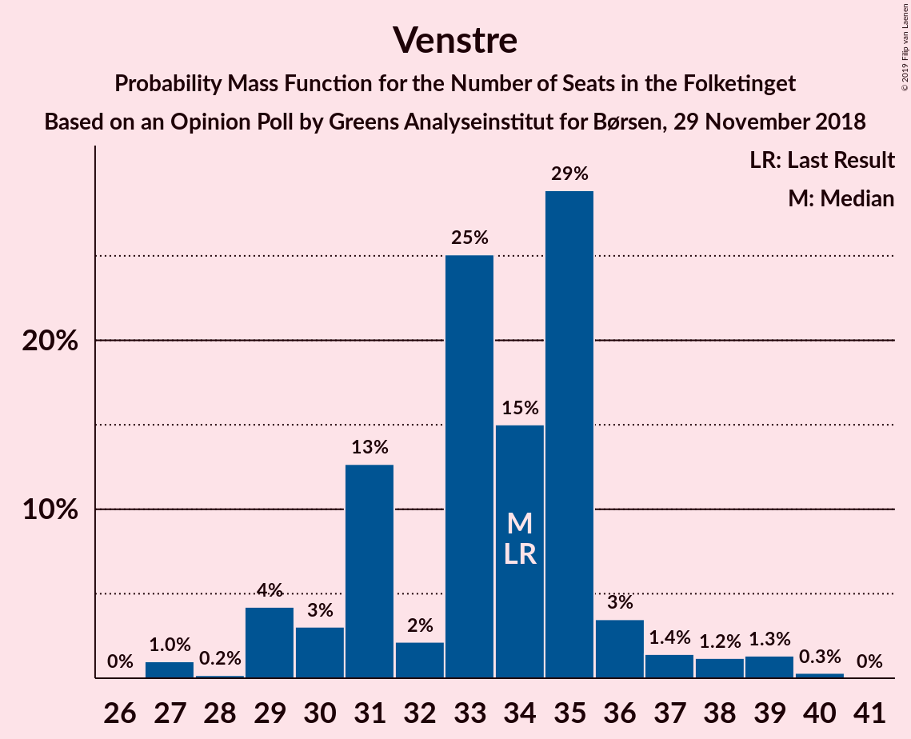
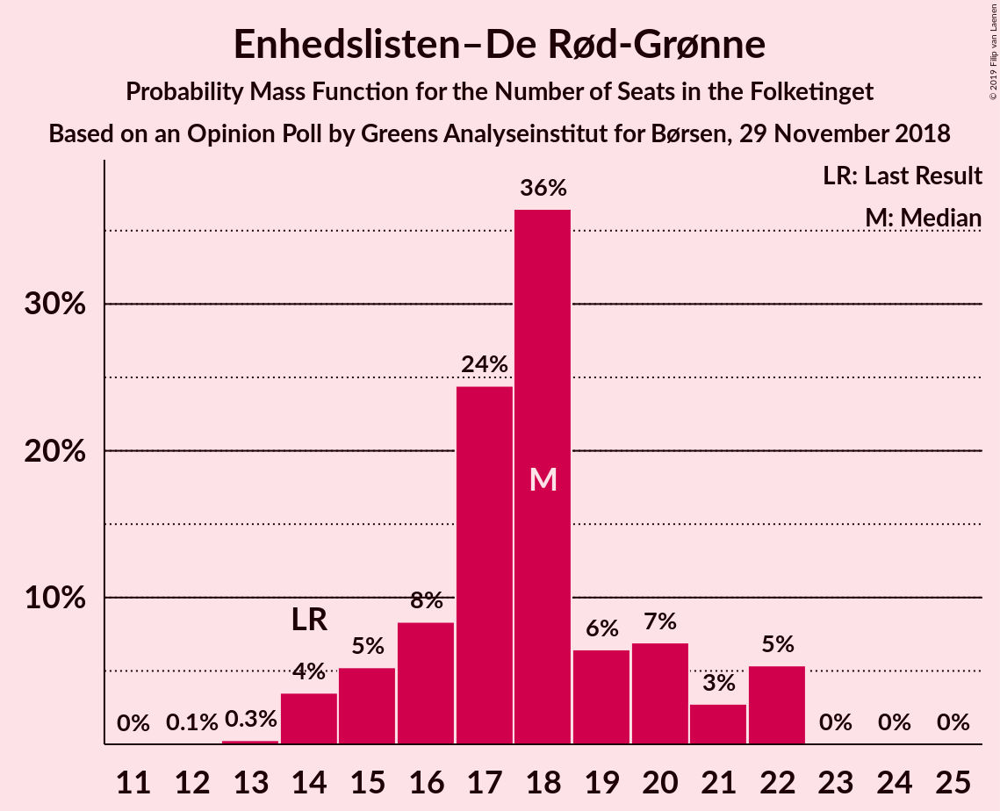
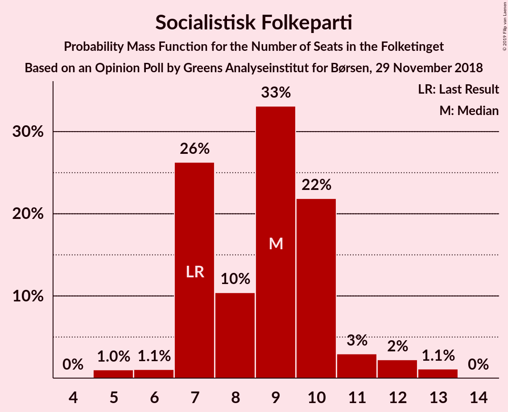
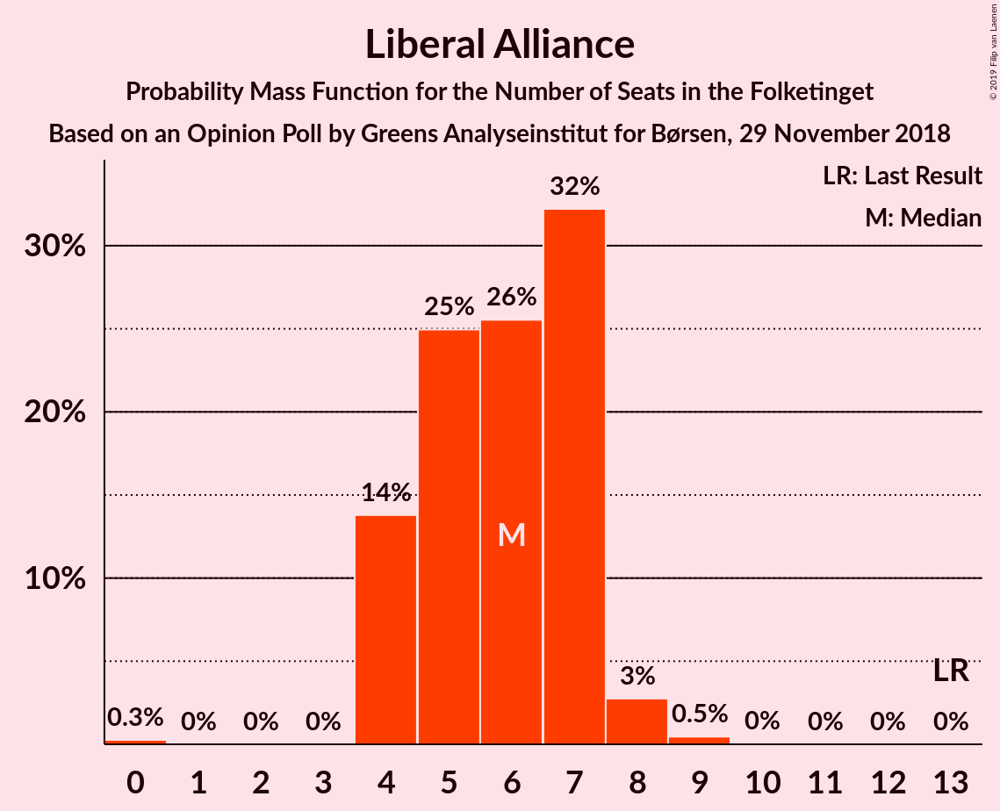
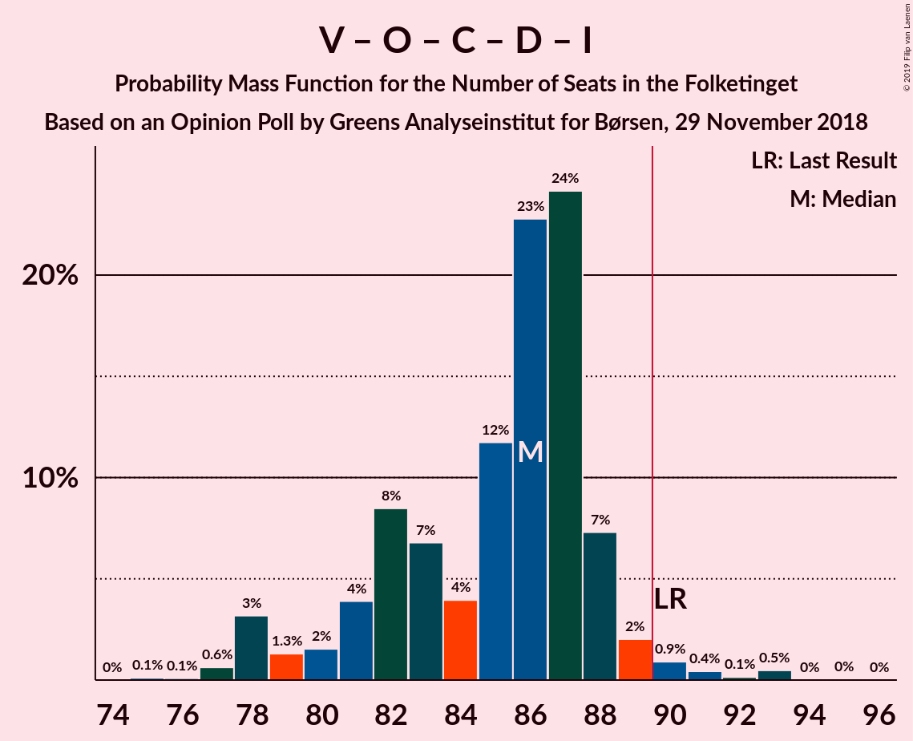
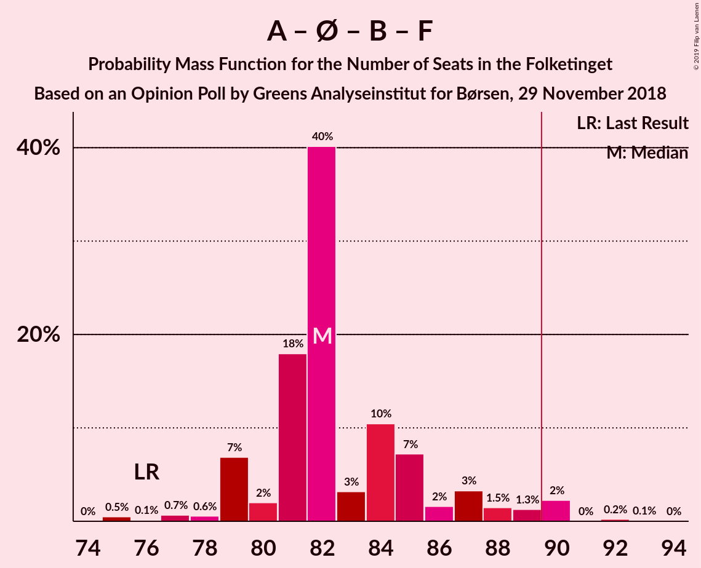
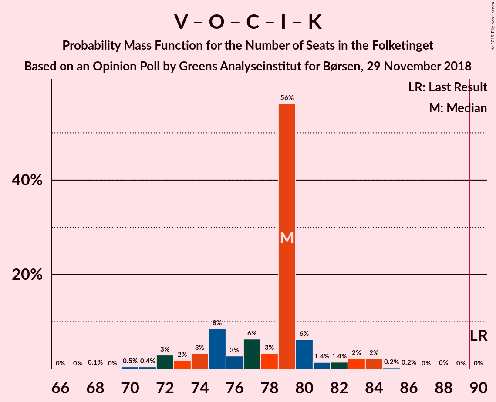

# Opinion Poll by Greens Analyseinstitut for Børsen, 29 November 2018

<a href="#voting-intentions">Voting Intentions</a> | <a href="#seats">Seats</a> | <a href="#coalitions">Coalitions</a> | <a href="#technical-information">Technical Information</a>

## Voting Intentions

### Confidence Intervals

| Party | Last Result | Poll Result | 80% Confidence Interval | 90% Confidence Interval | 95% Confidence Interval | 99% Confidence Interval |
|:-----:|:-----------:|:-----------:|:-----------------------:|:-----------------------:|:-----------------------:|:-----------------------:|
| Socialdemokraterne | 26.3% | 24.6% | 23.0–26.4% |22.6–26.9% |22.2–27.3% |21.4–28.1% |
| Venstre | 19.5% | 19.2% | 17.7–20.8% |17.3–21.2% |17.0–21.6% |16.3–22.4% |
| Dansk Folkeparti | 21.1% | 17.1% | 15.7–18.6% |15.3–19.1% |15.0–19.4% |14.3–20.2% |
| Enhedslisten–De Rød-Grønne | 7.8% | 9.6% | 8.6–10.9% |8.3–11.2% |8.0–11.5% |7.5–12.1% |
| Radikale Venstre | 4.6% | 7.6% | 6.7–8.8% |6.4–9.1% |6.2–9.4% |5.8–9.9% |
| Socialistisk Folkeparti | 4.2% | 4.8% | 4.1–5.8% |3.9–6.0% |3.7–6.3% |3.4–6.7% |
| Det Konservative Folkeparti | 3.4% | 4.6% | 3.9–5.6% |3.7–5.8% |3.5–6.1% |3.2–6.5% |
| Alternativet | 4.8% | 3.8% | 3.2–4.7% |3.0–4.9% |2.8–5.1% |2.5–5.6% |
| Nye Borgerlige | 0.0% | 3.8% | 3.2–4.7% |3.0–4.9% |2.8–5.1% |2.5–5.6% |
| Liberal Alliance | 7.5% | 3.1% | 2.5–3.9% |2.3–4.1% |2.2–4.3% |2.0–4.7% |
| Kristendemokraterne | 0.8% | 1.2% | 0.9–1.7% |0.8–1.9% |0.7–2.0% |0.6–2.3% |

*Note:* The poll result column reflects the actual value used in the calculations. Published results may vary slightly, and in addition be rounded to fewer digits.

## Seats

### Confidence Intervals

| Party | Last Result | Median | 80% Confidence Interval | 90% Confidence Interval | 95% Confidence Interval | 99% Confidence Interval |
|:-----:|:-----------:|:------:|:-----------------------:|:-----------------------:|:-----------------------:|:-----------------------:|
| <a href="#socialdemokraterne">Socialdemokraterne</a> | 47 | 43 | 43 |43 |39–44 |39–47 |
| <a href="#venstre">Venstre</a> | 34 | 34 | 34–37 |33–37 |32–37 |32–37 |
| <a href="#dansk-folkeparti">Dansk Folkeparti</a> | 37 | 30 | 30–32 |29–32 |28–32 |22–32 |
| <a href="#enhedslisten–de-rød-grønne">Enhedslisten–De Rød-Grønne</a> | 14 | 18 | 16–18 |16–18 |15–20 |15–24 |
| <a href="#radikale-venstre">Radikale Venstre</a> | 8 | 14 | 14–15 |14–15 |13–15 |10–15 |
| <a href="#socialistisk-folkeparti">Socialistisk Folkeparti</a> | 7 | 10 | 10 |8–10 |8–11 |6–13 |
| <a href="#det-konservative-folkeparti">Det Konservative Folkeparti</a> | 6 | 9 | 9 |7–9 |7–9 |7–12 |
| <a href="#alternativet">Alternativet</a> | 9 | 6 | 6 |6–7 |6–10 |6–12 |
| <a href="#nye-borgerlige">Nye Borgerlige</a> | 0 | 7 | 0–7 |0–7 |0–9 |0–9 |
| <a href="#liberal-alliance">Liberal Alliance</a> | 13 | 4 | 4–7 |4–7 |4–7 |0–7 |
| <a href="#kristendemokraterne">Kristendemokraterne</a> | 0 | 0 | 0 |0 |0 |0–4 |

### Socialdemokraterne

*For a full overview of the results for this party, see the [Socialdemokraterne](party-socialdemokraterne.html) page.*

| Number of Seats | Probability | Accumulated | Special Marks |
|:---------------:|:-----------:|:-----------:|:-------------:|
| 39 | 4% | 100% |  |
| 40 | 0.1% | 96% |  |
| 41 | 0.1% | 96% |  |
| 42 | 0% | 96% |  |
| 43 | 93% | 96% | Median |
| 44 | 2% | 3% |  |
| 45 | 0.2% | 0.9% |  |
| 46 | 0.1% | 0.7% |  |
| 47 | 0.6% | 0.6% | Last Result |
| 48 | 0% | 0% |  |

### Venstre

*For a full overview of the results for this party, see the [Venstre](party-venstre.html) page.*

| Number of Seats | Probability | Accumulated | Special Marks |
|:---------------:|:-----------:|:-----------:|:-------------:|
| 26 | 0.1% | 100% |  |
| 27 | 0% | 99.9% |  |
| 28 | 0.1% | 99.9% |  |
| 29 | 0% | 99.8% |  |
| 30 | 0.1% | 99.7% |  |
| 31 | 0% | 99.7% |  |
| 32 | 2% | 99.7% |  |
| 33 | 2% | 97% |  |
| 34 | 78% | 95% | Last Result, Median |
| 35 | 2% | 16% |  |
| 36 | 2% | 14% |  |
| 37 | 12% | 12% |  |
| 38 | 0% | 0.2% |  |
| 39 | 0% | 0.2% |  |
| 40 | 0% | 0.2% |  |
| 41 | 0% | 0.2% |  |
| 42 | 0.2% | 0.2% |  |
| 43 | 0% | 0% |  |

### Dansk Folkeparti

*For a full overview of the results for this party, see the [Dansk Folkeparti](party-danskfolkeparti.html) page.*

| Number of Seats | Probability | Accumulated | Special Marks |
|:---------------:|:-----------:|:-----------:|:-------------:|
| 22 | 0.6% | 100% |  |
| 23 | 0% | 99.4% |  |
| 24 | 0% | 99.4% |  |
| 25 | 0% | 99.4% |  |
| 26 | 0% | 99.4% |  |
| 27 | 0.1% | 99.4% |  |
| 28 | 3% | 99.3% |  |
| 29 | 4% | 97% |  |
| 30 | 78% | 93% | Median |
| 31 | 0% | 14% |  |
| 32 | 14% | 14% |  |
| 33 | 0% | 0.1% |  |
| 34 | 0% | 0.1% |  |
| 35 | 0% | 0.1% |  |
| 36 | 0% | 0.1% |  |
| 37 | 0% | 0.1% | Last Result |
| 38 | 0% | 0.1% |  |
| 39 | 0.1% | 0.1% |  |
| 40 | 0% | 0% |  |

### Enhedslisten–De Rød-Grønne

*For a full overview of the results for this party, see the [Enhedslisten–De Rød-Grønne](party-enhedslisten–derød-grønne.html) page.*

| Number of Seats | Probability | Accumulated | Special Marks |
|:---------------:|:-----------:|:-----------:|:-------------:|
| 14 | 0.2% | 100% | Last Result |
| 15 | 2% | 99.8% |  |
| 16 | 12% | 97% |  |
| 17 | 3% | 86% |  |
| 18 | 78% | 83% | Median |
| 19 | 0% | 4% |  |
| 20 | 2% | 4% |  |
| 21 | 0% | 2% |  |
| 22 | 0% | 2% |  |
| 23 | 0% | 2% |  |
| 24 | 2% | 2% |  |
| 25 | 0% | 0% |  |

### Radikale Venstre

*For a full overview of the results for this party, see the [Radikale Venstre](party-radikalevenstre.html) page.*

| Number of Seats | Probability | Accumulated | Special Marks |
|:---------------:|:-----------:|:-----------:|:-------------:|
| 8 | 0% | 100% | Last Result |
| 9 | 0% | 100% |  |
| 10 | 2% | 100% |  |
| 11 | 0% | 98% |  |
| 12 | 0.1% | 98% |  |
| 13 | 0.1% | 98% |  |
| 14 | 79% | 97% | Median |
| 15 | 19% | 19% |  |
| 16 | 0.1% | 0.2% |  |
| 17 | 0.1% | 0.1% |  |
| 18 | 0% | 0% |  |

### Socialistisk Folkeparti

*For a full overview of the results for this party, see the [Socialistisk Folkeparti](party-socialistiskfolkeparti.html) page.*

| Number of Seats | Probability | Accumulated | Special Marks |
|:---------------:|:-----------:|:-----------:|:-------------:|
| 6 | 2% | 100% |  |
| 7 | 0% | 98% | Last Result |
| 8 | 5% | 98% |  |
| 9 | 0.2% | 93% |  |
| 10 | 90% | 93% | Median |
| 11 | 0.1% | 3% |  |
| 12 | 0% | 2% |  |
| 13 | 2% | 2% |  |
| 14 | 0% | 0% |  |

### Det Konservative Folkeparti

*For a full overview of the results for this party, see the [Det Konservative Folkeparti](party-detkonservativefolkeparti.html) page.*

| Number of Seats | Probability | Accumulated | Special Marks |
|:---------------:|:-----------:|:-----------:|:-------------:|
| 5 | 0.2% | 100% |  |
| 6 | 0.1% | 99.8% | Last Result |
| 7 | 5% | 99.7% |  |
| 8 | 2% | 95% |  |
| 9 | 92% | 93% | Median |
| 10 | 0.1% | 0.8% |  |
| 11 | 0% | 0.7% |  |
| 12 | 0.7% | 0.7% |  |
| 13 | 0% | 0% |  |

### Alternativet

*For a full overview of the results for this party, see the [Alternativet](party-alternativet.html) page.*

| Number of Seats | Probability | Accumulated | Special Marks |
|:---------------:|:-----------:|:-----------:|:-------------:|
| 5 | 0.2% | 100% |  |
| 6 | 93% | 99.8% | Median |
| 7 | 3% | 7% |  |
| 8 | 0.2% | 5% |  |
| 9 | 0% | 4% | Last Result |
| 10 | 2% | 4% |  |
| 11 | 0.1% | 2% |  |
| 12 | 2% | 2% |  |
| 13 | 0% | 0% |  |

### Nye Borgerlige

*For a full overview of the results for this party, see the [Nye Borgerlige](party-nyeborgerlige.html) page.*

| Number of Seats | Probability | Accumulated | Special Marks |
|:---------------:|:-----------:|:-----------:|:-------------:|
| 0 | 12% | 100% | Last Result |
| 1 | 0% | 88% |  |
| 2 | 0% | 88% |  |
| 3 | 0% | 88% |  |
| 4 | 0% | 88% |  |
| 5 | 0% | 88% |  |
| 6 | 4% | 88% |  |
| 7 | 81% | 84% | Median |
| 8 | 0.8% | 3% |  |
| 9 | 2% | 3% |  |
| 10 | 0% | 0.1% |  |
| 11 | 0% | 0.1% |  |
| 12 | 0% | 0.1% |  |
| 13 | 0.1% | 0.1% |  |
| 14 | 0% | 0% |  |

### Liberal Alliance

*For a full overview of the results for this party, see the [Liberal Alliance](party-liberalalliance.html) page.*

| Number of Seats | Probability | Accumulated | Special Marks |
|:---------------:|:-----------:|:-----------:|:-------------:|
| 0 | 2% | 100% |  |
| 1 | 0% | 98% |  |
| 2 | 0% | 98% |  |
| 3 | 0% | 98% |  |
| 4 | 78% | 98% | Median |
| 5 | 4% | 20% |  |
| 6 | 0.1% | 15% |  |
| 7 | 15% | 15% |  |
| 8 | 0.1% | 0.2% |  |
| 9 | 0% | 0% |  |
| 10 | 0% | 0% |  |
| 11 | 0% | 0% |  |
| 12 | 0% | 0% |  |
| 13 | 0% | 0% | Last Result |

### Kristendemokraterne

*For a full overview of the results for this party, see the [Kristendemokraterne](party-kristendemokraterne.html) page.*

| Number of Seats | Probability | Accumulated | Special Marks |
|:---------------:|:-----------:|:-----------:|:-------------:|
| 0 | 98% | 100% | Last Result, Median |
| 1 | 0% | 2% |  |
| 2 | 0% | 2% |  |
| 3 | 0% | 2% |  |
| 4 | 2% | 2% |  |
| 5 | 0% | 0% |  |

## Coalitions

### Confidence Intervals

| Coalition | Last Result | Median | Majority? | 80% Confidence Interval | 90% Confidence Interval | 95% Confidence Interval | 99% Confidence Interval |
|:---------:|:-----------:|:------:|:---------:|:-----------------------:|:-----------------------:|:-----------------------:|:-----------------------:|
| Socialdemokraterne – Enhedslisten–De Rød-Grønne – Radikale Venstre – Socialistisk Folkeparti – Alternativet | 85 | 91 | 99.6% | 90–91 | 90–92 | 90–93 | 90–93 |
| Venstre – Dansk Folkeparti – Det Konservative Folkeparti – Nye Borgerlige – Liberal Alliance – Kristendemokraterne | 90 | 84 | 0.2% | 84–85 | 83–85 | 82–85 | 82–85 |
| Venstre – Dansk Folkeparti – Det Konservative Folkeparti – Nye Borgerlige – Liberal Alliance | 90 | 84 | 0.2% | 84–85 | 83–85 | 82–85 | 81–85 |
| Socialdemokraterne – Enhedslisten–De Rød-Grønne – Radikale Venstre – Socialistisk Folkeparti | 76 | 85 | 0% | 84–85 | 84–85 | 81–85 | 81–87 |
| Venstre – Dansk Folkeparti – Det Konservative Folkeparti – Liberal Alliance – Kristendemokraterne | 90 | 77 | 0% | 77–85 | 75–85 | 75–85 | 74–85 |
| Venstre – Dansk Folkeparti – Det Konservative Folkeparti – Liberal Alliance | 90 | 77 | 0% | 77–85 | 75–85 | 75–85 | 74–85 |

### Socialdemokraterne – Enhedslisten–De Rød-Grønne – Radikale Venstre – Socialistisk Folkeparti – Alternativet

| Number of Seats | Probability | Accumulated | Special Marks |
|:---------------:|:-----------:|:-----------:|:-------------:|
| 83 | 0.2% | 100% |  |
| 84 | 0% | 99.8% |  |
| 85 | 0% | 99.8% | Last Result |
| 86 | 0.1% | 99.8% |  |
| 87 | 0.2% | 99.7% |  |
| 88 | 0% | 99.6% |  |
| 89 | 0% | 99.6% |  |
| 90 | 14% | 99.6% | Majority |
| 91 | 81% | 86% | Median |
| 92 | 2% | 5% |  |
| 93 | 3% | 3% |  |
| 94 | 0% | 0% |  |

### Venstre – Dansk Folkeparti – Det Konservative Folkeparti – Nye Borgerlige – Liberal Alliance – Kristendemokraterne

| Number of Seats | Probability | Accumulated | Special Marks |
|:---------------:|:-----------:|:-----------:|:-------------:|
| 82 | 3% | 100% |  |
| 83 | 2% | 97% |  |
| 84 | 81% | 95% | Median |
| 85 | 14% | 14% |  |
| 86 | 0% | 0.4% |  |
| 87 | 0% | 0.4% |  |
| 88 | 0.2% | 0.4% |  |
| 89 | 0% | 0.2% |  |
| 90 | 0% | 0.2% | Last Result, Majority |
| 91 | 0% | 0.2% |  |
| 92 | 0.2% | 0.2% |  |
| 93 | 0% | 0% |  |

### Venstre – Dansk Folkeparti – Det Konservative Folkeparti – Nye Borgerlige – Liberal Alliance

| Number of Seats | Probability | Accumulated | Special Marks |
|:---------------:|:-----------:|:-----------:|:-------------:|
| 78 | 0.1% | 100% |  |
| 79 | 0% | 99.9% |  |
| 80 | 0% | 99.9% |  |
| 81 | 2% | 99.9% |  |
| 82 | 3% | 98% |  |
| 83 | 2% | 95% |  |
| 84 | 81% | 93% | Median |
| 85 | 12% | 12% |  |
| 86 | 0% | 0.3% |  |
| 87 | 0% | 0.3% |  |
| 88 | 0.2% | 0.3% |  |
| 89 | 0% | 0.2% |  |
| 90 | 0% | 0.2% | Last Result, Majority |
| 91 | 0% | 0.2% |  |
| 92 | 0.2% | 0.2% |  |
| 93 | 0% | 0% |  |

### Socialdemokraterne – Enhedslisten–De Rød-Grønne – Radikale Venstre – Socialistisk Folkeparti

| Number of Seats | Probability | Accumulated | Special Marks |
|:---------------:|:-----------:|:-----------:|:-------------:|
| 76 | 0% | 100% | Last Result |
| 77 | 0.1% | 100% |  |
| 78 | 0.1% | 99.9% |  |
| 79 | 0% | 99.8% |  |
| 80 | 0.2% | 99.8% |  |
| 81 | 2% | 99.6% |  |
| 82 | 2% | 97% |  |
| 83 | 0% | 95% |  |
| 84 | 16% | 95% |  |
| 85 | 79% | 79% | Median |
| 86 | 0% | 0.6% |  |
| 87 | 0.6% | 0.6% |  |
| 88 | 0% | 0% |  |

### Venstre – Dansk Folkeparti – Det Konservative Folkeparti – Liberal Alliance – Kristendemokraterne

| Number of Seats | Probability | Accumulated | Special Marks |
|:---------------:|:-----------:|:-----------:|:-------------:|
| 74 | 0.6% | 100% |  |
| 75 | 5% | 99.4% |  |
| 76 | 0.2% | 95% |  |
| 77 | 80% | 94% | Median |
| 78 | 0% | 14% |  |
| 79 | 2% | 14% |  |
| 80 | 0.2% | 12% |  |
| 81 | 0% | 12% |  |
| 82 | 0% | 12% |  |
| 83 | 0% | 12% |  |
| 84 | 0% | 12% |  |
| 85 | 12% | 12% |  |
| 86 | 0% | 0% |  |
| 87 | 0% | 0% |  |
| 88 | 0% | 0% |  |
| 89 | 0% | 0% |  |
| 90 | 0% | 0% | Last Result, Majority |

### Venstre – Dansk Folkeparti – Det Konservative Folkeparti – Liberal Alliance

| Number of Seats | Probability | Accumulated | Special Marks |
|:---------------:|:-----------:|:-----------:|:-------------:|
| 72 | 0.1% | 100% |  |
| 73 | 0% | 99.9% |  |
| 74 | 0.6% | 99.9% |  |
| 75 | 7% | 99.3% |  |
| 76 | 0.1% | 93% |  |
| 77 | 80% | 93% | Median |
| 78 | 0% | 12% |  |
| 79 | 0.1% | 12% |  |
| 80 | 0.2% | 12% |  |
| 81 | 0% | 12% |  |
| 82 | 0% | 12% |  |
| 83 | 0% | 12% |  |
| 84 | 0% | 12% |  |
| 85 | 12% | 12% |  |
| 86 | 0% | 0% |  |
| 87 | 0% | 0% |  |
| 88 | 0% | 0% |  |
| 89 | 0% | 0% |  |
| 90 | 0% | 0% | Last Result, Majority |

## Technical Information

### Opinion Poll

+ **Polling firm:** Greens Analyseinstitut
+ **Commissioner(s):** Børsen
+ **Fieldwork period:** 29 November 2018

### Calculations

+ **Sample size:** 1100
+ **Simulations done:** 1,024
+ **Error estimate:** 1.81%

