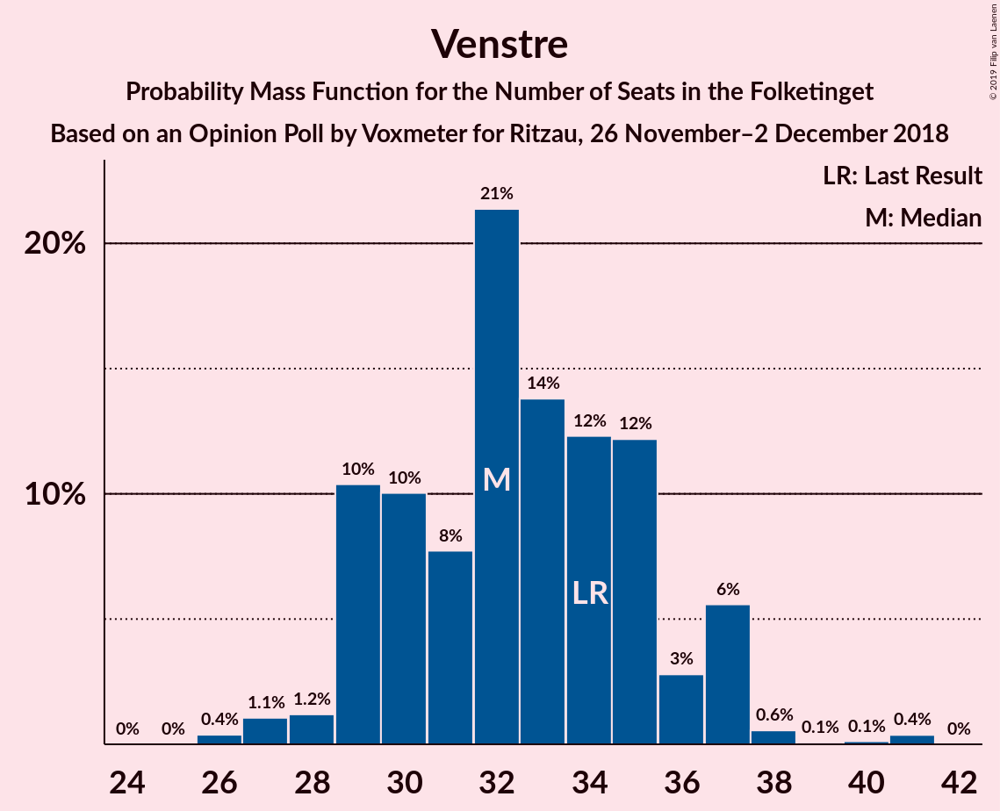
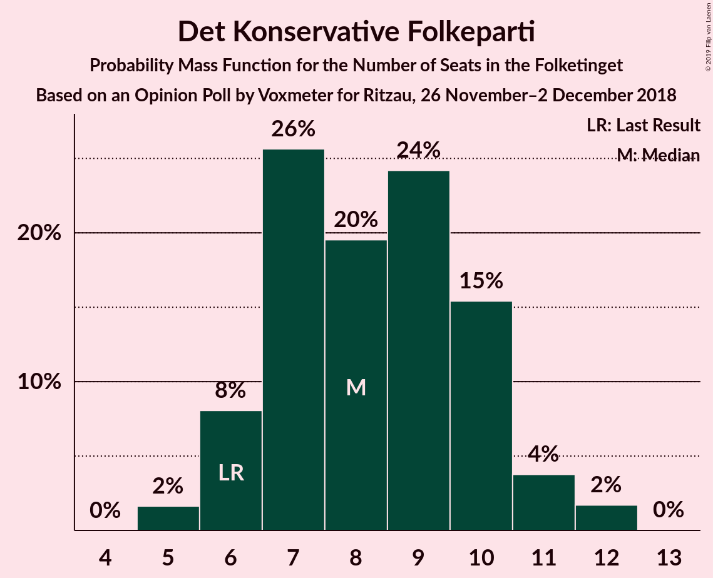

# Opinion Poll by Voxmeter for Ritzau, 26 November–2 December 2018

<a href="#voting-intentions">Voting Intentions</a> | <a href="#seats">Seats</a> | <a href="#coalitions">Coalitions</a> | <a href="#technical-information">Technical Information</a>

## Voting Intentions

### Confidence Intervals

| Party | Last Result | Poll Result | 80% Confidence Interval | 90% Confidence Interval | 95% Confidence Interval | 99% Confidence Interval |
|:-----:|:-----------:|:-----------:|:-----------------------:|:-----------------------:|:-----------------------:|:-----------------------:|
| Socialdemokraterne | 26.3% | 26.5% | 24.8–28.3% |24.3–28.8% |23.9–29.2% |23.1–30.1% |
| Venstre | 19.5% | 18.3% | 16.9–19.9% |16.5–20.4% |16.1–20.8% |15.4–21.6% |
| Dansk Folkeparti | 21.1% | 18.2% | 16.8–19.8% |16.4–20.3% |16.0–20.7% |15.3–21.5% |
| Enhedslisten–De Rød-Grønne | 7.8% | 8.5% | 7.5–9.8% |7.2–10.1% |7.0–10.4% |6.5–11.0% |
| Radikale Venstre | 4.6% | 6.2% | 5.3–7.2% |5.1–7.5% |4.9–7.8% |4.5–8.3% |
| Socialistisk Folkeparti | 4.2% | 5.8% | 5.0–6.8% |4.7–7.1% |4.5–7.4% |4.2–7.9% |
| Liberal Alliance | 7.5% | 5.1% | 4.3–6.1% |4.1–6.4% |3.9–6.6% |3.6–7.1% |
| Det Konservative Folkeparti | 3.4% | 4.5% | 3.7–5.4% |3.5–5.7% |3.4–5.9% |3.0–6.4% |
| Alternativet | 4.8% | 3.5% | 2.9–4.4% |2.7–4.6% |2.6–4.8% |2.3–5.2% |
| Nye Borgerlige | 0.0% | 2.1% | 1.6–2.8% |1.5–3.0% |1.4–3.2% |1.2–3.5% |
| Kristendemokraterne | 0.8% | 1.1% | 0.8–1.7% |0.7–1.8% |0.7–2.0% |0.5–2.3% |

*Note:* The poll result column reflects the actual value used in the calculations. Published results may vary slightly, and in addition be rounded to fewer digits.

## Seats

### Confidence Intervals

| Party | Last Result | Median | 80% Confidence Interval | 90% Confidence Interval | 95% Confidence Interval | 99% Confidence Interval |
|:-----:|:-----------:|:------:|:-----------------------:|:-----------------------:|:-----------------------:|:-----------------------:|
| <a href="#socialdemokraterne">Socialdemokraterne</a> | 47 | 44 | 44–47 |44–47 |44–47 |44–51 |
| <a href="#venstre">Venstre</a> | 34 | 31 | 31–33 |31–33 |31–33 |31–33 |
| <a href="#dansk-folkeparti">Dansk Folkeparti</a> | 37 | 33 | 32–33 |32–33 |32–33 |30–33 |
| <a href="#enhedslisten–de-rød-grønne">Enhedslisten–De Rød-Grønne</a> | 14 | 16 | 16–17 |16–17 |16–17 |13–17 |
| <a href="#radikale-venstre">Radikale Venstre</a> | 8 | 10 | 10–13 |10–13 |10–13 |10–14 |
| <a href="#socialistisk-folkeparti">Socialistisk Folkeparti</a> | 7 | 9 | 9–12 |9–12 |9–12 |6–12 |
| <a href="#liberal-alliance">Liberal Alliance</a> | 13 | 10 | 9–10 |9–10 |9–10 |8–11 |
| <a href="#det-konservative-folkeparti">Det Konservative Folkeparti</a> | 6 | 6 | 6–7 |6–7 |6–7 |6–11 |
| <a href="#alternativet">Alternativet</a> | 9 | 6 | 5–6 |5–6 |5–6 |5–10 |
| <a href="#nye-borgerlige">Nye Borgerlige</a> | 0 | 4 | 0–4 |0–4 |0–4 |0–4 |
| <a href="#kristendemokraterne">Kristendemokraterne</a> | 0 | 6 | 0–6 |0–6 |0–6 |0–6 |

### Socialdemokraterne

*For a full overview of the results for this party, see the [Socialdemokraterne](party-socialdemokraterne.html) page.*

| Number of Seats | Probability | Accumulated | Special Marks |
|:---------------:|:-----------:|:-----------:|:-------------:|
| 44 | 82% | 100% | Median |
| 45 | 0.5% | 18% |  |
| 46 | 0% | 18% |  |
| 47 | 17% | 18% | Last Result |
| 48 | 0% | 1.1% |  |
| 49 | 0% | 1.1% |  |
| 50 | 0% | 1.0% |  |
| 51 | 0.8% | 1.0% |  |
| 52 | 0% | 0.3% |  |
| 53 | 0.2% | 0.3% |  |
| 54 | 0% | 0.1% |  |
| 55 | 0% | 0.1% |  |
| 56 | 0% | 0% |  |

### Venstre

*For a full overview of the results for this party, see the [Venstre](party-venstre.html) page.*

| Number of Seats | Probability | Accumulated | Special Marks |
|:---------------:|:-----------:|:-----------:|:-------------:|
| 27 | 0% | 100% |  |
| 28 | 0% | 99.9% |  |
| 29 | 0% | 99.9% |  |
| 30 | 0% | 99.9% |  |
| 31 | 82% | 99.9% | Median |
| 32 | 0.8% | 18% |  |
| 33 | 17% | 17% |  |
| 34 | 0% | 0.1% | Last Result |
| 35 | 0% | 0.1% |  |
| 36 | 0% | 0% |  |

### Dansk Folkeparti

*For a full overview of the results for this party, see the [Dansk Folkeparti](party-danskfolkeparti.html) page.*

| Number of Seats | Probability | Accumulated | Special Marks |
|:---------------:|:-----------:|:-----------:|:-------------:|
| 28 | 0% | 100% |  |
| 29 | 0% | 99.9% |  |
| 30 | 0.5% | 99.9% |  |
| 31 | 0% | 99.4% |  |
| 32 | 17% | 99.4% |  |
| 33 | 82% | 83% | Median |
| 34 | 0% | 0.3% |  |
| 35 | 0% | 0.3% |  |
| 36 | 0.2% | 0.2% |  |
| 37 | 0% | 0% | Last Result |

### Enhedslisten–De Rød-Grønne

*For a full overview of the results for this party, see the [Enhedslisten–De Rød-Grønne](party-enhedslisten–derød-grønne.html) page.*

| Number of Seats | Probability | Accumulated | Special Marks |
|:---------------:|:-----------:|:-----------:|:-------------:|
| 10 | 0.2% | 100% |  |
| 11 | 0% | 99.8% |  |
| 12 | 0.1% | 99.8% |  |
| 13 | 0.8% | 99.7% |  |
| 14 | 0.1% | 98.9% | Last Result |
| 15 | 0.5% | 98.9% |  |
| 16 | 82% | 98% | Median |
| 17 | 17% | 17% |  |
| 18 | 0% | 0% |  |

### Radikale Venstre

*For a full overview of the results for this party, see the [Radikale Venstre](party-radikalevenstre.html) page.*

| Number of Seats | Probability | Accumulated | Special Marks |
|:---------------:|:-----------:|:-----------:|:-------------:|
| 8 | 0% | 100% | Last Result |
| 9 | 0% | 100% |  |
| 10 | 82% | 100% | Median |
| 11 | 0.1% | 18% |  |
| 12 | 0% | 18% |  |
| 13 | 18% | 18% |  |
| 14 | 0.6% | 0.6% |  |
| 15 | 0% | 0% |  |

### Socialistisk Folkeparti

*For a full overview of the results for this party, see the [Socialistisk Folkeparti](party-socialistiskfolkeparti.html) page.*

| Number of Seats | Probability | Accumulated | Special Marks |
|:---------------:|:-----------:|:-----------:|:-------------:|
| 6 | 0.8% | 100% |  |
| 7 | 0.5% | 99.2% | Last Result |
| 8 | 0.1% | 98.7% |  |
| 9 | 82% | 98.6% | Median |
| 10 | 0.2% | 17% |  |
| 11 | 0.1% | 17% |  |
| 12 | 17% | 17% |  |
| 13 | 0% | 0% |  |

### Liberal Alliance

*For a full overview of the results for this party, see the [Liberal Alliance](party-liberalalliance.html) page.*

| Number of Seats | Probability | Accumulated | Special Marks |
|:---------------:|:-----------:|:-----------:|:-------------:|
| 7 | 0% | 100% |  |
| 8 | 0.8% | 99.9% |  |
| 9 | 17% | 99.1% |  |
| 10 | 82% | 82% | Median |
| 11 | 0.8% | 0.8% |  |
| 12 | 0% | 0% |  |
| 13 | 0% | 0% | Last Result |

### Det Konservative Folkeparti

*For a full overview of the results for this party, see the [Det Konservative Folkeparti](party-detkonservativefolkeparti.html) page.*

| Number of Seats | Probability | Accumulated | Special Marks |
|:---------------:|:-----------:|:-----------:|:-------------:|
| 6 | 82% | 100% | Last Result, Median |
| 7 | 17% | 18% |  |
| 8 | 0.3% | 2% |  |
| 9 | 0.8% | 1.4% |  |
| 10 | 0% | 0.5% |  |
| 11 | 0.5% | 0.5% |  |
| 12 | 0% | 0% |  |

### Alternativet

*For a full overview of the results for this party, see the [Alternativet](party-alternativet.html) page.*

| Number of Seats | Probability | Accumulated | Special Marks |
|:---------------:|:-----------:|:-----------:|:-------------:|
| 5 | 17% | 100% |  |
| 6 | 82% | 83% | Median |
| 7 | 0.8% | 1.4% |  |
| 8 | 0.1% | 0.7% |  |
| 9 | 0% | 0.6% | Last Result |
| 10 | 0.5% | 0.5% |  |
| 11 | 0% | 0% |  |

### Nye Borgerlige

*For a full overview of the results for this party, see the [Nye Borgerlige](party-nyeborgerlige.html) page.*

| Number of Seats | Probability | Accumulated | Special Marks |
|:---------------:|:-----------:|:-----------:|:-------------:|
| 0 | 18% | 100% | Last Result |
| 1 | 0% | 82% |  |
| 2 | 0% | 82% |  |
| 3 | 0% | 82% |  |
| 4 | 82% | 82% | Median |
| 5 | 0.1% | 0.1% |  |
| 6 | 0% | 0% |  |

### Kristendemokraterne

*For a full overview of the results for this party, see the [Kristendemokraterne](party-kristendemokraterne.html) page.*

| Number of Seats | Probability | Accumulated | Special Marks |
|:---------------:|:-----------:|:-----------:|:-------------:|
| 0 | 18% | 100% | Last Result |
| 1 | 0% | 82% |  |
| 2 | 0% | 82% |  |
| 3 | 0% | 82% |  |
| 4 | 0% | 82% |  |
| 5 | 0% | 82% |  |
| 6 | 82% | 82% | Median |
| 7 | 0% | 0% |  |

## Coalitions

### Confidence Intervals

| Coalition | Last Result | Median | Majority? | 80% Confidence Interval | 90% Confidence Interval | 95% Confidence Interval | 99% Confidence Interval |
|:---------:|:-----------:|:------:|:---------:|:-----------------------:|:-----------------------:|:-----------------------:|:-----------------------:|
| Socialdemokraterne – Enhedslisten–De Rød-Grønne – Radikale Venstre – Socialistisk Folkeparti – Alternativet | 85 | 85 | 18% | 85–94 | 85–94 | 85–94 | 85–94 |
| Venstre – Dansk Folkeparti – Liberal Alliance – Det Konservative Folkeparti – Nye Borgerlige – Kristendemokraterne | 90 | 90 | 82% | 81–90 | 81–90 | 81–90 | 81–90 |
| Socialdemokraterne – Enhedslisten–De Rød-Grønne – Radikale Venstre – Socialistisk Folkeparti | 76 | 79 | 0.1% | 79–89 | 79–89 | 79–89 | 79–89 |
| Venstre – Dansk Folkeparti – Liberal Alliance – Det Konservative Folkeparti – Kristendemokraterne | 90 | 86 | 0.1% | 81–86 | 81–86 | 81–86 | 80–86 |
| Venstre – Dansk Folkeparti – Liberal Alliance – Det Konservative Folkeparti – Nye Borgerlige | 90 | 84 | 0.1% | 81–84 | 81–84 | 81–84 | 81–85 |
| Venstre – Dansk Folkeparti – Liberal Alliance – Det Konservative Folkeparti | 90 | 80 | 0% | 80–81 | 80–81 | 80–81 | 80–85 |

### Socialdemokraterne – Enhedslisten–De Rød-Grønne – Radikale Venstre – Socialistisk Folkeparti – Alternativet

| Number of Seats | Probability | Accumulated | Special Marks |
|:---------------:|:-----------:|:-----------:|:-------------:|
| 84 | 0% | 100% |  |
| 85 | 82% | 99.9% | Last Result, Median |
| 86 | 0% | 18% |  |
| 87 | 0% | 18% |  |
| 88 | 0% | 18% |  |
| 89 | 0% | 18% |  |
| 90 | 0.8% | 18% | Majority |
| 91 | 0.5% | 18% |  |
| 92 | 0.3% | 17% |  |
| 93 | 0% | 17% |  |
| 94 | 17% | 17% |  |
| 95 | 0% | 0.1% |  |
| 96 | 0% | 0.1% |  |
| 97 | 0% | 0.1% |  |
| 98 | 0% | 0.1% |  |
| 99 | 0% | 0.1% |  |
| 100 | 0% | 0.1% |  |
| 101 | 0% | 0.1% |  |
| 102 | 0% | 0.1% |  |
| 103 | 0% | 0% |  |

### Venstre – Dansk Folkeparti – Liberal Alliance – Det Konservative Folkeparti – Nye Borgerlige – Kristendemokraterne

| Number of Seats | Probability | Accumulated | Special Marks |
|:---------------:|:-----------:|:-----------:|:-------------:|
| 73 | 0% | 100% |  |
| 74 | 0% | 99.9% |  |
| 75 | 0% | 99.9% |  |
| 76 | 0% | 99.9% |  |
| 77 | 0% | 99.9% |  |
| 78 | 0% | 99.9% |  |
| 79 | 0% | 99.9% |  |
| 80 | 0% | 99.9% |  |
| 81 | 17% | 99.9% |  |
| 82 | 0% | 83% |  |
| 83 | 0.3% | 83% |  |
| 84 | 0.5% | 83% |  |
| 85 | 0.8% | 82% |  |
| 86 | 0% | 82% |  |
| 87 | 0% | 82% |  |
| 88 | 0% | 82% |  |
| 89 | 0% | 82% |  |
| 90 | 82% | 82% | Last Result, Median, Majority |
| 91 | 0% | 0.1% |  |
| 92 | 0% | 0% |  |

### Socialdemokraterne – Enhedslisten–De Rød-Grønne – Radikale Venstre – Socialistisk Folkeparti

| Number of Seats | Probability | Accumulated | Special Marks |
|:---------------:|:-----------:|:-----------:|:-------------:|
| 76 | 0% | 100% | Last Result |
| 77 | 0% | 100% |  |
| 78 | 0% | 100% |  |
| 79 | 82% | 99.9% | Median |
| 80 | 0% | 18% |  |
| 81 | 0.5% | 18% |  |
| 82 | 0% | 18% |  |
| 83 | 0.8% | 18% |  |
| 84 | 0.1% | 17% |  |
| 85 | 0% | 17% |  |
| 86 | 0.2% | 17% |  |
| 87 | 0% | 17% |  |
| 88 | 0% | 17% |  |
| 89 | 17% | 17% |  |
| 90 | 0% | 0.1% | Majority |
| 91 | 0% | 0.1% |  |
| 92 | 0% | 0.1% |  |
| 93 | 0% | 0.1% |  |
| 94 | 0.1% | 0.1% |  |
| 95 | 0% | 0% |  |

### Venstre – Dansk Folkeparti – Liberal Alliance – Det Konservative Folkeparti – Kristendemokraterne

| Number of Seats | Probability | Accumulated | Special Marks |
|:---------------:|:-----------:|:-----------:|:-------------:|
| 73 | 0% | 100% |  |
| 74 | 0% | 99.9% |  |
| 75 | 0% | 99.9% |  |
| 76 | 0% | 99.9% |  |
| 77 | 0% | 99.9% |  |
| 78 | 0% | 99.9% |  |
| 79 | 0% | 99.9% |  |
| 80 | 0.5% | 99.9% |  |
| 81 | 17% | 99.3% |  |
| 82 | 0% | 83% |  |
| 83 | 0.2% | 83% |  |
| 84 | 0% | 82% |  |
| 85 | 0.8% | 82% |  |
| 86 | 82% | 82% | Median |
| 87 | 0% | 0.1% |  |
| 88 | 0% | 0.1% |  |
| 89 | 0% | 0.1% |  |
| 90 | 0% | 0.1% | Last Result, Majority |
| 91 | 0% | 0.1% |  |
| 92 | 0% | 0% |  |

### Venstre – Dansk Folkeparti – Liberal Alliance – Det Konservative Folkeparti – Nye Borgerlige

| Number of Seats | Probability | Accumulated | Special Marks |
|:---------------:|:-----------:|:-----------:|:-------------:|
| 72 | 0% | 100% |  |
| 73 | 0% | 99.9% |  |
| 74 | 0% | 99.9% |  |
| 75 | 0% | 99.9% |  |
| 76 | 0% | 99.9% |  |
| 77 | 0% | 99.9% |  |
| 78 | 0% | 99.9% |  |
| 79 | 0% | 99.9% |  |
| 80 | 0% | 99.9% |  |
| 81 | 17% | 99.9% |  |
| 82 | 0% | 83% |  |
| 83 | 0.3% | 83% |  |
| 84 | 82% | 83% | Median |
| 85 | 0.8% | 0.8% |  |
| 86 | 0% | 0.1% |  |
| 87 | 0% | 0.1% |  |
| 88 | 0% | 0.1% |  |
| 89 | 0% | 0.1% |  |
| 90 | 0% | 0.1% | Last Result, Majority |
| 91 | 0% | 0.1% |  |
| 92 | 0% | 0% |  |

### Venstre – Dansk Folkeparti – Liberal Alliance – Det Konservative Folkeparti

| Number of Seats | Probability | Accumulated | Special Marks |
|:---------------:|:-----------:|:-----------:|:-------------:|
| 72 | 0% | 100% |  |
| 73 | 0% | 99.9% |  |
| 74 | 0% | 99.9% |  |
| 75 | 0% | 99.9% |  |
| 76 | 0% | 99.9% |  |
| 77 | 0% | 99.9% |  |
| 78 | 0.1% | 99.9% |  |
| 79 | 0% | 99.9% |  |
| 80 | 82% | 99.9% | Median |
| 81 | 17% | 18% |  |
| 82 | 0% | 1.0% |  |
| 83 | 0.2% | 1.0% |  |
| 84 | 0% | 0.8% |  |
| 85 | 0.8% | 0.8% |  |
| 86 | 0% | 0.1% |  |
| 87 | 0% | 0.1% |  |
| 88 | 0% | 0.1% |  |
| 89 | 0% | 0.1% |  |
| 90 | 0% | 0% | Last Result, Majority |

## Technical Information

### Opinion Poll

+ **Polling firm:** Voxmeter
+ **Commissioner(s):** Ritzau
+ **Fieldwork period:** 26 November–2 December 2018

### Calculations

+ **Sample size:** 1053
+ **Simulations done:** 1,024
+ **Error estimate:** 2.94%

