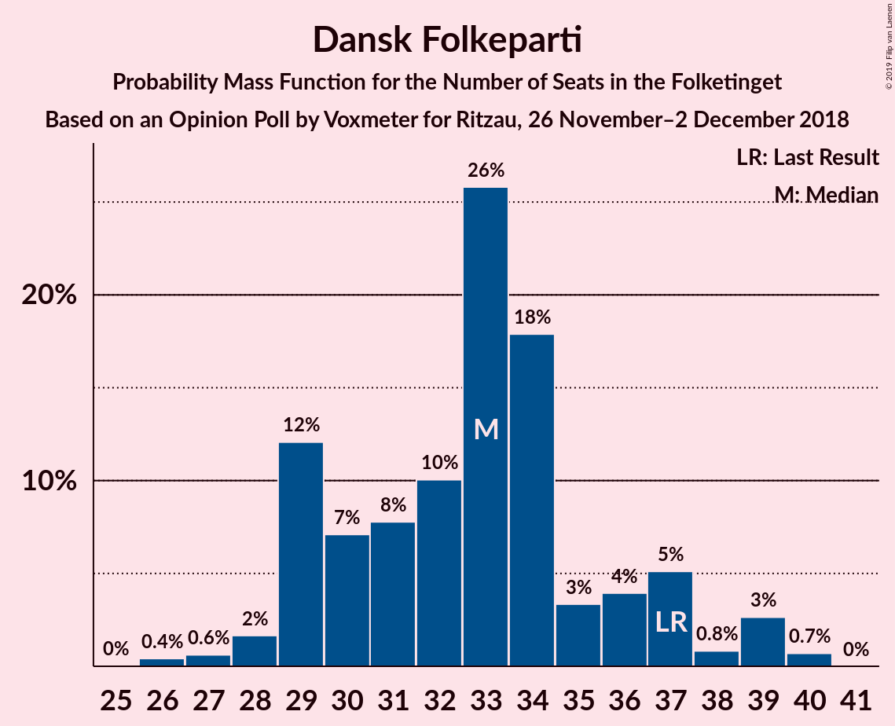
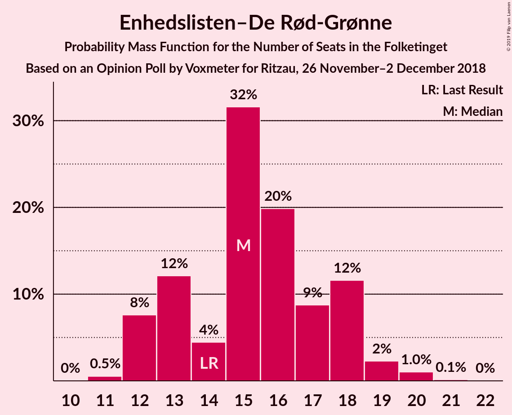
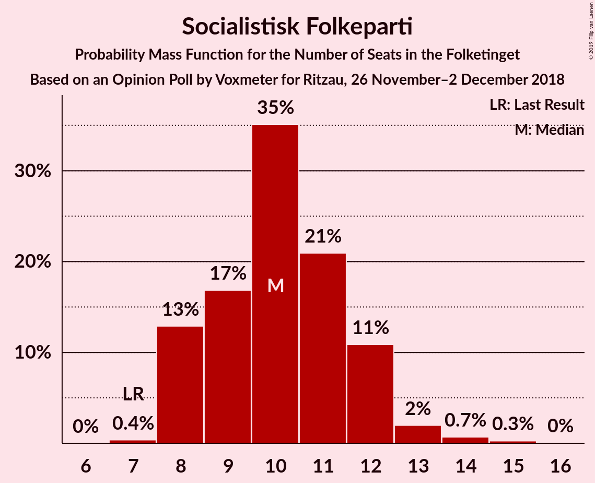
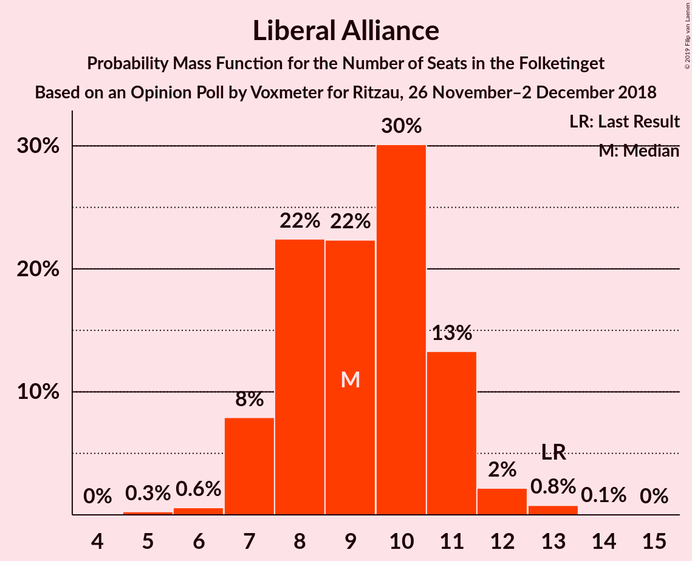

# Opinion Poll by Voxmeter for Ritzau, 26 November–2 December 2018

<a href="#voting-intentions">Voting Intentions</a> | <a href="#seats">Seats</a> | <a href="#coalitions">Coalitions</a> | <a href="#technical-information">Technical Information</a>

## Voting Intentions

### Confidence Intervals

| Party | Last Result | Poll Result | 80% Confidence Interval | 90% Confidence Interval | 95% Confidence Interval | 99% Confidence Interval |
|:-----:|:-----------:|:-----------:|:-----------------------:|:-----------------------:|:-----------------------:|:-----------------------:|
| Socialdemokraterne | 26.3% | 26.5% | 24.8–28.3% |24.3–28.8% |23.9–29.2% |23.1–30.1% |
| Venstre | 19.5% | 18.3% | 16.9–19.9% |16.5–20.4% |16.1–20.8% |15.4–21.6% |
| Dansk Folkeparti | 21.1% | 18.2% | 16.8–19.8% |16.4–20.3% |16.0–20.7% |15.3–21.5% |
| Enhedslisten–De Rød-Grønne | 7.8% | 8.5% | 7.5–9.8% |7.2–10.1% |7.0–10.4% |6.5–11.0% |
| Radikale Venstre | 4.6% | 6.2% | 5.3–7.2% |5.1–7.5% |4.9–7.8% |4.5–8.3% |
| Socialistisk Folkeparti | 4.2% | 5.8% | 5.0–6.8% |4.7–7.1% |4.5–7.4% |4.2–7.9% |
| Liberal Alliance | 7.5% | 5.1% | 4.3–6.1% |4.1–6.4% |3.9–6.6% |3.6–7.1% |
| Det Konservative Folkeparti | 3.4% | 4.5% | 3.7–5.4% |3.5–5.7% |3.4–5.9% |3.0–6.4% |
| Alternativet | 4.8% | 3.5% | 2.9–4.4% |2.7–4.6% |2.6–4.8% |2.3–5.2% |
| Nye Borgerlige | 0.0% | 2.1% | 1.6–2.8% |1.5–3.0% |1.4–3.2% |1.2–3.5% |
| Kristendemokraterne | 0.8% | 1.1% | 0.8–1.7% |0.7–1.8% |0.7–2.0% |0.5–2.3% |

*Note:* The poll result column reflects the actual value used in the calculations. Published results may vary slightly, and in addition be rounded to fewer digits.

## Seats

### Confidence Intervals

| Party | Last Result | Median | 80% Confidence Interval | 90% Confidence Interval | 95% Confidence Interval | 99% Confidence Interval |
|:-----:|:-----------:|:------:|:-----------------------:|:-----------------------:|:-----------------------:|:-----------------------:|
| <a href="#socialdemokraterne">Socialdemokraterne</a> | 47 | 48 | 44–54 |42–54 |42–54 |40–54 |
| <a href="#venstre">Venstre</a> | 34 | 32 | 31–34 |30–34 |30–34 |29–38 |
| <a href="#dansk-folkeparti">Dansk Folkeparti</a> | 37 | 31 | 30–38 |27–38 |27–38 |27–38 |
| <a href="#enhedslisten–de-rød-grønne">Enhedslisten–De Rød-Grønne</a> | 14 | 15 | 13–17 |13–18 |13–18 |12–18 |
| <a href="#radikale-venstre">Radikale Venstre</a> | 8 | 10 | 9–13 |9–13 |9–13 |8–14 |
| <a href="#socialistisk-folkeparti">Socialistisk Folkeparti</a> | 7 | 10 | 10–11 |9–12 |9–13 |9–13 |
| <a href="#liberal-alliance">Liberal Alliance</a> | 13 | 8 | 7–13 |7–13 |7–13 |7–13 |
| <a href="#det-konservative-folkeparti">Det Konservative Folkeparti</a> | 6 | 8 | 6–9 |6–10 |6–10 |6–11 |
| <a href="#alternativet">Alternativet</a> | 9 | 8 | 6–9 |6–10 |5–10 |4–10 |
| <a href="#nye-borgerlige">Nye Borgerlige</a> | 0 | 0 | 0–4 |0–5 |0–5 |0–5 |
| <a href="#kristendemokraterne">Kristendemokraterne</a> | 0 | 0 | 0 |0–4 |0–4 |0–5 |

### Socialdemokraterne

*For a full overview of the results for this party, see the [Socialdemokraterne](party-socialdemokraterne.html) page.*

| Number of Seats | Probability | Accumulated | Special Marks |
|:---------------:|:-----------:|:-----------:|:-------------:|
| 39 | 0.1% | 100% |  |
| 40 | 1.0% | 99.9% |  |
| 41 | 0.2% | 99.0% |  |
| 42 | 8% | 98.8% |  |
| 43 | 0% | 91% |  |
| 44 | 4% | 91% |  |
| 45 | 20% | 87% |  |
| 46 | 0.2% | 68% |  |
| 47 | 8% | 67% | Last Result |
| 48 | 18% | 60% | Median |
| 49 | 0% | 42% |  |
| 50 | 1.3% | 42% |  |
| 51 | 0.4% | 41% |  |
| 52 | 0% | 40% |  |
| 53 | 0% | 40% |  |
| 54 | 40% | 40% |  |
| 55 | 0% | 0% |  |

### Venstre

*For a full overview of the results for this party, see the [Venstre](party-venstre.html) page.*

| Number of Seats | Probability | Accumulated | Special Marks |
|:---------------:|:-----------:|:-----------:|:-------------:|
| 26 | 0.2% | 100% |  |
| 27 | 0.2% | 99.8% |  |
| 28 | 0.2% | 99.7% |  |
| 29 | 1.0% | 99.5% |  |
| 30 | 7% | 98.5% |  |
| 31 | 13% | 92% |  |
| 32 | 62% | 79% | Median |
| 33 | 0.2% | 17% |  |
| 34 | 14% | 17% | Last Result |
| 35 | 0.3% | 2% |  |
| 36 | 0.5% | 2% |  |
| 37 | 0% | 2% |  |
| 38 | 2% | 2% |  |
| 39 | 0% | 0.1% |  |
| 40 | 0.1% | 0.1% |  |
| 41 | 0% | 0% |  |

### Dansk Folkeparti

*For a full overview of the results for this party, see the [Dansk Folkeparti](party-danskfolkeparti.html) page.*

| Number of Seats | Probability | Accumulated | Special Marks |
|:---------------:|:-----------:|:-----------:|:-------------:|
| 27 | 7% | 100% |  |
| 28 | 1.3% | 93% |  |
| 29 | 0.1% | 92% |  |
| 30 | 7% | 92% |  |
| 31 | 47% | 85% | Median |
| 32 | 0.5% | 38% |  |
| 33 | 14% | 38% |  |
| 34 | 2% | 24% |  |
| 35 | 2% | 22% |  |
| 36 | 0.2% | 20% |  |
| 37 | 0.2% | 20% | Last Result |
| 38 | 19% | 19% |  |
| 39 | 0% | 0% |  |

### Enhedslisten–De Rød-Grønne

*For a full overview of the results for this party, see the [Enhedslisten–De Rød-Grønne](party-enhedslisten–derød-grønne.html) page.*

| Number of Seats | Probability | Accumulated | Special Marks |
|:---------------:|:-----------:|:-----------:|:-------------:|
| 12 | 1.0% | 100% |  |
| 13 | 20% | 99.0% |  |
| 14 | 8% | 79% | Last Result |
| 15 | 59% | 71% | Median |
| 16 | 0.8% | 11% |  |
| 17 | 4% | 10% |  |
| 18 | 6% | 7% |  |
| 19 | 0.2% | 0.5% |  |
| 20 | 0.2% | 0.3% |  |
| 21 | 0% | 0.1% |  |
| 22 | 0.1% | 0.1% |  |
| 23 | 0% | 0% |  |

### Radikale Venstre

*For a full overview of the results for this party, see the [Radikale Venstre](party-radikalevenstre.html) page.*

| Number of Seats | Probability | Accumulated | Special Marks |
|:---------------:|:-----------:|:-----------:|:-------------:|
| 7 | 0.1% | 100% |  |
| 8 | 2% | 99.9% | Last Result |
| 9 | 14% | 98% |  |
| 10 | 52% | 84% | Median |
| 11 | 9% | 32% |  |
| 12 | 1.4% | 23% |  |
| 13 | 21% | 22% |  |
| 14 | 0.4% | 0.5% |  |
| 15 | 0.1% | 0.1% |  |
| 16 | 0% | 0% |  |

### Socialistisk Folkeparti

*For a full overview of the results for this party, see the [Socialistisk Folkeparti](party-socialistiskfolkeparti.html) page.*

| Number of Seats | Probability | Accumulated | Special Marks |
|:---------------:|:-----------:|:-----------:|:-------------:|
| 7 | 0.2% | 100% | Last Result |
| 8 | 0.1% | 99.8% |  |
| 9 | 10% | 99.7% |  |
| 10 | 43% | 90% | Median |
| 11 | 38% | 48% |  |
| 12 | 7% | 10% |  |
| 13 | 3% | 3% |  |
| 14 | 0.1% | 0.2% |  |
| 15 | 0.1% | 0.1% |  |
| 16 | 0% | 0% |  |

### Liberal Alliance

*For a full overview of the results for this party, see the [Liberal Alliance](party-liberalalliance.html) page.*

| Number of Seats | Probability | Accumulated | Special Marks |
|:---------------:|:-----------:|:-----------:|:-------------:|
| 6 | 0.2% | 100% |  |
| 7 | 40% | 99.8% |  |
| 8 | 27% | 59% | Median |
| 9 | 11% | 33% |  |
| 10 | 8% | 21% |  |
| 11 | 2% | 13% |  |
| 12 | 0.5% | 12% |  |
| 13 | 11% | 11% | Last Result |
| 14 | 0.1% | 0.1% |  |
| 15 | 0% | 0% |  |

### Det Konservative Folkeparti

*For a full overview of the results for this party, see the [Det Konservative Folkeparti](party-detkonservativefolkeparti.html) page.*

| Number of Seats | Probability | Accumulated | Special Marks |
|:---------------:|:-----------:|:-----------:|:-------------:|
| 4 | 0.1% | 100% |  |
| 5 | 0.4% | 99.9% |  |
| 6 | 20% | 99.5% | Last Result |
| 7 | 11% | 80% |  |
| 8 | 49% | 68% | Median |
| 9 | 11% | 19% |  |
| 10 | 7% | 8% |  |
| 11 | 0.4% | 0.9% |  |
| 12 | 0.5% | 0.5% |  |
| 13 | 0% | 0% |  |

### Alternativet

*For a full overview of the results for this party, see the [Alternativet](party-alternativet.html) page.*

| Number of Seats | Probability | Accumulated | Special Marks |
|:---------------:|:-----------:|:-----------:|:-------------:|
| 4 | 1.5% | 100% |  |
| 5 | 2% | 98.5% |  |
| 6 | 9% | 96% |  |
| 7 | 20% | 87% |  |
| 8 | 41% | 67% | Median |
| 9 | 20% | 26% | Last Result |
| 10 | 6% | 6% |  |
| 11 | 0% | 0% |  |

### Nye Borgerlige

*For a full overview of the results for this party, see the [Nye Borgerlige](party-nyeborgerlige.html) page.*

| Number of Seats | Probability | Accumulated | Special Marks |
|:---------------:|:-----------:|:-----------:|:-------------:|
| 0 | 76% | 100% | Last Result, Median |
| 1 | 0% | 24% |  |
| 2 | 0% | 24% |  |
| 3 | 0.4% | 24% |  |
| 4 | 15% | 24% |  |
| 5 | 9% | 9% |  |
| 6 | 0.1% | 0.1% |  |
| 7 | 0% | 0% |  |

### Kristendemokraterne

*For a full overview of the results for this party, see the [Kristendemokraterne](party-kristendemokraterne.html) page.*

| Number of Seats | Probability | Accumulated | Special Marks |
|:---------------:|:-----------:|:-----------:|:-------------:|
| 0 | 90% | 100% | Last Result, Median |
| 1 | 0% | 10% |  |
| 2 | 0% | 10% |  |
| 3 | 0% | 10% |  |
| 4 | 9% | 10% |  |
| 5 | 0.3% | 0.6% |  |
| 6 | 0.3% | 0.3% |  |
| 7 | 0% | 0% |  |

## Coalitions

### Confidence Intervals

| Coalition | Last Result | Median | Majority? | 80% Confidence Interval | 90% Confidence Interval | 95% Confidence Interval | 99% Confidence Interval |
|:---------:|:-----------:|:------:|:---------:|:-----------------------:|:-----------------------:|:-----------------------:|:-----------------------:|
| Socialdemokraterne – Enhedslisten–De Rød-Grønne – Radikale Venstre – Socialistisk Folkeparti – Alternativet | 85 | 91 | 79% | 87–97 | 87–97 | 83–97 | 83–97 |
| Venstre – Dansk Folkeparti – Liberal Alliance – Det Konservative Folkeparti – Nye Borgerlige – Kristendemokraterne | 90 | 84 | 5% | 78–88 | 78–88 | 78–92 | 78–92 |
| Socialdemokraterne – Enhedslisten–De Rød-Grønne – Radikale Venstre – Socialistisk Folkeparti | 76 | 84 | 0.1% | 80–89 | 80–89 | 79–89 | 76–89 |
| Venstre – Dansk Folkeparti – Liberal Alliance – Det Konservative Folkeparti – Kristendemokraterne | 90 | 82 | 2% | 78–84 | 78–86 | 78–88 | 75–90 |
| Venstre – Dansk Folkeparti – Liberal Alliance – Det Konservative Folkeparti – Nye Borgerlige | 90 | 83 | 2% | 78–88 | 78–88 | 78–88 | 78–90 |
| Socialdemokraterne – Enhedslisten–De Rød-Grønne – Socialistisk Folkeparti – Alternativet | 77 | 81 | 0% | 78–87 | 76–87 | 74–87 | 72–87 |
| Venstre – Dansk Folkeparti – Liberal Alliance – Det Konservative Folkeparti | 90 | 78 | 2% | 78–84 | 78–84 | 78–86 | 75–90 |
| Socialdemokraterne – Enhedslisten–De Rød-Grønne – Socialistisk Folkeparti | 68 | 74 | 0% | 69–79 | 69–79 | 69–79 | 65–79 |
| Socialdemokraterne – Radikale Venstre – Socialistisk Folkeparti | 62 | 69 | 0% | 65–74 | 64–74 | 64–74 | 63–74 |
| Socialdemokraterne – Radikale Venstre | 55 | 58 | 0% | 53–64 | 53–64 | 52–64 | 51–64 |
| Venstre – Liberal Alliance – Det Konservative Folkeparti | 53 | 47 | 0% | 46–51 | 46–53 | 46–53 | 46–56 |
| Venstre – Det Konservative Folkeparti | 40 | 40 | 0% | 38–43 | 38–44 | 38–44 | 37–47 |
| Venstre | 34 | 32 | 0% | 31–34 | 30–34 | 30–34 | 29–38 |

### Socialdemokraterne – Enhedslisten–De Rød-Grønne – Radikale Venstre – Socialistisk Folkeparti – Alternativet

| Number of Seats | Probability | Accumulated | Special Marks |
|:---------------:|:-----------:|:-----------:|:-------------:|
| 81 | 0.1% | 100% |  |
| 82 | 0.1% | 99.9% |  |
| 83 | 2% | 99.9% |  |
| 84 | 0.2% | 97% |  |
| 85 | 2% | 97% | Last Result |
| 86 | 0.2% | 95% |  |
| 87 | 7% | 95% |  |
| 88 | 0.2% | 88% |  |
| 89 | 9% | 88% |  |
| 90 | 0.3% | 79% | Majority |
| 91 | 30% | 79% | Median |
| 92 | 6% | 49% |  |
| 93 | 0% | 42% |  |
| 94 | 0.3% | 42% |  |
| 95 | 1.3% | 42% |  |
| 96 | 0.5% | 41% |  |
| 97 | 40% | 40% |  |
| 98 | 0% | 0% |  |

### Venstre – Dansk Folkeparti – Liberal Alliance – Det Konservative Folkeparti – Nye Borgerlige – Kristendemokraterne

| Number of Seats | Probability | Accumulated | Special Marks |
|:---------------:|:-----------:|:-----------:|:-------------:|
| 78 | 40% | 100% |  |
| 79 | 0.5% | 60% | Median |
| 80 | 1.3% | 59% |  |
| 81 | 0.3% | 58% |  |
| 82 | 0% | 58% |  |
| 83 | 6% | 58% |  |
| 84 | 30% | 51% |  |
| 85 | 0.3% | 21% |  |
| 86 | 9% | 21% |  |
| 87 | 0.2% | 12% |  |
| 88 | 7% | 12% |  |
| 89 | 0.2% | 5% |  |
| 90 | 2% | 5% | Last Result, Majority |
| 91 | 0.2% | 3% |  |
| 92 | 2% | 3% |  |
| 93 | 0.1% | 0.1% |  |
| 94 | 0.1% | 0.1% |  |
| 95 | 0% | 0% |  |

### Socialdemokraterne – Enhedslisten–De Rød-Grønne – Radikale Venstre – Socialistisk Folkeparti

| Number of Seats | Probability | Accumulated | Special Marks |
|:---------------:|:-----------:|:-----------:|:-------------:|
| 73 | 0.1% | 100% |  |
| 74 | 0% | 99.9% |  |
| 75 | 0% | 99.9% |  |
| 76 | 1.0% | 99.9% | Last Result |
| 77 | 0.3% | 99.0% |  |
| 78 | 0.1% | 98.7% |  |
| 79 | 2% | 98.6% |  |
| 80 | 9% | 97% |  |
| 81 | 0.3% | 88% |  |
| 82 | 26% | 88% |  |
| 83 | 8% | 62% | Median |
| 84 | 11% | 54% |  |
| 85 | 0.4% | 43% |  |
| 86 | 0.3% | 42% |  |
| 87 | 0.4% | 42% |  |
| 88 | 1.0% | 42% |  |
| 89 | 41% | 41% |  |
| 90 | 0.1% | 0.1% | Majority |
| 91 | 0% | 0% |  |

### Venstre – Dansk Folkeparti – Liberal Alliance – Det Konservative Folkeparti – Kristendemokraterne

| Number of Seats | Probability | Accumulated | Special Marks |
|:---------------:|:-----------:|:-----------:|:-------------:|
| 75 | 0.9% | 100% |  |
| 76 | 0% | 99.1% |  |
| 77 | 0.4% | 99.0% |  |
| 78 | 46% | 98.6% |  |
| 79 | 0.5% | 52% | Median |
| 80 | 0% | 52% |  |
| 81 | 0.3% | 52% |  |
| 82 | 7% | 51% |  |
| 83 | 0.2% | 45% |  |
| 84 | 37% | 45% |  |
| 85 | 0.3% | 7% |  |
| 86 | 2% | 7% |  |
| 87 | 2% | 5% |  |
| 88 | 1.4% | 3% |  |
| 89 | 0.1% | 2% |  |
| 90 | 2% | 2% | Last Result, Majority |
| 91 | 0% | 0% |  |

### Venstre – Dansk Folkeparti – Liberal Alliance – Det Konservative Folkeparti – Nye Borgerlige

| Number of Seats | Probability | Accumulated | Special Marks |
|:---------------:|:-----------:|:-----------:|:-------------:|
| 78 | 40% | 100% |  |
| 79 | 0.5% | 60% | Median |
| 80 | 2% | 59% |  |
| 81 | 0.3% | 58% |  |
| 82 | 7% | 57% |  |
| 83 | 6% | 51% |  |
| 84 | 31% | 45% |  |
| 85 | 0% | 14% |  |
| 86 | 2% | 14% |  |
| 87 | 0.2% | 12% |  |
| 88 | 10% | 12% |  |
| 89 | 0.2% | 2% |  |
| 90 | 2% | 2% | Last Result, Majority |
| 91 | 0.2% | 0.3% |  |
| 92 | 0% | 0.1% |  |
| 93 | 0.1% | 0.1% |  |
| 94 | 0.1% | 0.1% |  |
| 95 | 0% | 0% |  |

### Socialdemokraterne – Enhedslisten–De Rød-Grønne – Socialistisk Folkeparti – Alternativet

| Number of Seats | Probability | Accumulated | Special Marks |
|:---------------:|:-----------:|:-----------:|:-------------:|
| 70 | 0.1% | 100% |  |
| 71 | 0% | 99.9% |  |
| 72 | 1.0% | 99.9% |  |
| 73 | 0% | 99.0% |  |
| 74 | 2% | 99.0% |  |
| 75 | 2% | 97% |  |
| 76 | 2% | 95% |  |
| 77 | 0.1% | 93% | Last Result |
| 78 | 26% | 93% |  |
| 79 | 0.1% | 67% |  |
| 80 | 7% | 67% |  |
| 81 | 17% | 59% | Median |
| 82 | 0% | 42% |  |
| 83 | 0.8% | 42% |  |
| 84 | 0.1% | 41% |  |
| 85 | 0.5% | 41% |  |
| 86 | 0.3% | 41% |  |
| 87 | 40% | 40% |  |
| 88 | 0% | 0% |  |

### Venstre – Dansk Folkeparti – Liberal Alliance – Det Konservative Folkeparti

| Number of Seats | Probability | Accumulated | Special Marks |
|:---------------:|:-----------:|:-----------:|:-------------:|
| 75 | 0.9% | 100% |  |
| 76 | 0% | 99.1% |  |
| 77 | 0.4% | 99.0% |  |
| 78 | 53% | 98.6% |  |
| 79 | 0.6% | 46% | Median |
| 80 | 0.6% | 45% |  |
| 81 | 0.3% | 44% |  |
| 82 | 0.1% | 44% |  |
| 83 | 2% | 44% |  |
| 84 | 38% | 43% |  |
| 85 | 0% | 4% |  |
| 86 | 2% | 4% |  |
| 87 | 0.2% | 2% |  |
| 88 | 0.4% | 2% |  |
| 89 | 0.1% | 2% |  |
| 90 | 2% | 2% | Last Result, Majority |
| 91 | 0% | 0% |  |

### Socialdemokraterne – Enhedslisten–De Rød-Grønne – Socialistisk Folkeparti

| Number of Seats | Probability | Accumulated | Special Marks |
|:---------------:|:-----------:|:-----------:|:-------------:|
| 62 | 0.1% | 100% |  |
| 63 | 0% | 99.9% |  |
| 64 | 0% | 99.9% |  |
| 65 | 1.0% | 99.9% |  |
| 66 | 0.1% | 98.9% |  |
| 67 | 0.1% | 98.9% |  |
| 68 | 0.2% | 98.8% | Last Result |
| 69 | 22% | 98.5% |  |
| 70 | 2% | 77% |  |
| 71 | 15% | 75% |  |
| 72 | 0% | 61% |  |
| 73 | 0.6% | 60% | Median |
| 74 | 18% | 60% |  |
| 75 | 0.1% | 42% |  |
| 76 | 1.0% | 42% |  |
| 77 | 0.4% | 41% |  |
| 78 | 0.1% | 41% |  |
| 79 | 40% | 41% |  |
| 80 | 0.1% | 0.1% |  |
| 81 | 0% | 0% |  |

### Socialdemokraterne – Radikale Venstre – Socialistisk Folkeparti

| Number of Seats | Probability | Accumulated | Special Marks |
|:---------------:|:-----------:|:-----------:|:-------------:|
| 60 | 0.2% | 100% |  |
| 61 | 0% | 99.8% |  |
| 62 | 0.1% | 99.7% | Last Result |
| 63 | 2% | 99.7% |  |
| 64 | 7% | 98% |  |
| 65 | 8% | 91% |  |
| 66 | 2% | 82% |  |
| 67 | 0% | 81% |  |
| 68 | 0.6% | 81% | Median |
| 69 | 38% | 80% |  |
| 70 | 0.9% | 42% |  |
| 71 | 0% | 41% |  |
| 72 | 0.1% | 41% |  |
| 73 | 0.8% | 41% |  |
| 74 | 40% | 41% |  |
| 75 | 0% | 0% |  |

### Socialdemokraterne – Radikale Venstre

| Number of Seats | Probability | Accumulated | Special Marks |
|:---------------:|:-----------:|:-----------:|:-------------:|
| 49 | 0.1% | 100% |  |
| 50 | 0.1% | 99.9% |  |
| 51 | 1.0% | 99.9% |  |
| 52 | 2% | 98.9% |  |
| 53 | 8% | 97% |  |
| 54 | 0.5% | 90% |  |
| 55 | 0.2% | 89% | Last Result |
| 56 | 7% | 89% |  |
| 57 | 8% | 82% |  |
| 58 | 31% | 73% | Median |
| 59 | 0.8% | 43% |  |
| 60 | 0.1% | 42% |  |
| 61 | 0.6% | 42% |  |
| 62 | 0.9% | 41% |  |
| 63 | 0% | 40% |  |
| 64 | 40% | 40% |  |
| 65 | 0% | 0% |  |

### Venstre – Liberal Alliance – Det Konservative Folkeparti

| Number of Seats | Probability | Accumulated | Special Marks |
|:---------------:|:-----------:|:-----------:|:-------------:|
| 45 | 0.3% | 100% |  |
| 46 | 20% | 99.7% |  |
| 47 | 42% | 80% |  |
| 48 | 6% | 38% | Median |
| 49 | 0.6% | 32% |  |
| 50 | 2% | 31% |  |
| 51 | 21% | 30% |  |
| 52 | 0.2% | 9% |  |
| 53 | 7% | 9% | Last Result |
| 54 | 0% | 2% |  |
| 55 | 0% | 2% |  |
| 56 | 2% | 2% |  |
| 57 | 0% | 0.5% |  |
| 58 | 0.3% | 0.5% |  |
| 59 | 0.1% | 0.1% |  |
| 60 | 0% | 0% |  |

### Venstre – Det Konservative Folkeparti

| Number of Seats | Probability | Accumulated | Special Marks |
|:---------------:|:-----------:|:-----------:|:-------------:|
| 35 | 0.2% | 100% |  |
| 36 | 0.3% | 99.8% |  |
| 37 | 0.4% | 99.6% |  |
| 38 | 37% | 99.2% |  |
| 39 | 2% | 62% |  |
| 40 | 41% | 60% | Last Result, Median |
| 41 | 2% | 19% |  |
| 42 | 1.5% | 17% |  |
| 43 | 7% | 16% |  |
| 44 | 7% | 9% |  |
| 45 | 0% | 2% |  |
| 46 | 0.3% | 2% |  |
| 47 | 2% | 2% |  |
| 48 | 0% | 0.1% |  |
| 49 | 0% | 0.1% |  |
| 50 | 0.1% | 0.1% |  |
| 51 | 0% | 0% |  |

### Venstre

| Number of Seats | Probability | Accumulated | Special Marks |
|:---------------:|:-----------:|:-----------:|:-------------:|
| 26 | 0.2% | 100% |  |
| 27 | 0.2% | 99.8% |  |
| 28 | 0.2% | 99.7% |  |
| 29 | 1.0% | 99.5% |  |
| 30 | 7% | 98.5% |  |
| 31 | 13% | 92% |  |
| 32 | 62% | 79% | Median |
| 33 | 0.2% | 17% |  |
| 34 | 14% | 17% | Last Result |
| 35 | 0.3% | 2% |  |
| 36 | 0.5% | 2% |  |
| 37 | 0% | 2% |  |
| 38 | 2% | 2% |  |
| 39 | 0% | 0.1% |  |
| 40 | 0.1% | 0.1% |  |
| 41 | 0% | 0% |  |

## Technical Information

### Opinion Poll

+ **Polling firm:** Voxmeter
+ **Commissioner(s):** Ritzau
+ **Fieldwork period:** 26 November–2 December 2018

### Calculations

+ **Sample size:** 1053
+ **Simulations done:** 32,768
+ **Error estimate:** 3.14%

