# Opinion Poll by YouGov, 7–9 December 2018

<a href="#voting-intentions">Voting Intentions</a> | <a href="#seats">Seats</a> | <a href="#coalitions">Coalitions</a> | <a href="#technical-information">Technical Information</a>

## Voting Intentions

### Confidence Intervals

| Party | Last Result | Poll Result | 80% Confidence Interval | 90% Confidence Interval | 95% Confidence Interval | 99% Confidence Interval |
|:-----:|:-----------:|:-----------:|:-----------------------:|:-----------------------:|:-----------------------:|:-----------------------:|
| Socialdemokraterne | 26.3% | 25.0% | 23.7–26.4% |23.3–26.8% |23.0–27.2% |22.4–27.9% |
| Venstre | 19.5% | 18.9% | 17.7–20.2% |17.4–20.5% |17.1–20.9% |16.5–21.5% |
| Dansk Folkeparti | 21.1% | 15.8% | 14.7–17.0% |14.4–17.4% |14.1–17.7% |13.6–18.3% |
| Enhedslisten–De Rød-Grønne | 7.8% | 8.6% | 7.8–9.6% |7.5–9.8% |7.3–10.1% |7.0–10.5% |
| Socialistisk Folkeparti | 4.2% | 5.9% | 5.2–6.7% |5.0–6.9% |4.9–7.1% |4.5–7.5% |
| Alternativet | 4.8% | 5.8% | 5.1–6.6% |4.9–6.8% |4.8–7.0% |4.5–7.4% |
| Radikale Venstre | 4.6% | 5.4% | 4.8–6.2% |4.6–6.4% |4.4–6.6% |4.1–7.0% |
| Nye Borgerlige | 0.0% | 5.3% | 4.6–6.1% |4.5–6.3% |4.3–6.5% |4.0–6.9% |
| Det Konservative Folkeparti | 3.4% | 4.7% | 4.1–5.4% |3.9–5.6% |3.8–5.8% |3.5–6.2% |
| Liberal Alliance | 7.5% | 4.0% | 3.4–4.7% |3.3–4.9% |3.1–5.0% |2.9–5.4% |
| Kristendemokraterne | 0.8% | 0.6% | 0.4–0.9% |0.4–1.0% |0.3–1.1% |0.3–1.3% |

*Note:* The poll result column reflects the actual value used in the calculations. Published results may vary slightly, and in addition be rounded to fewer digits.

## Seats

### Confidence Intervals

| Party | Last Result | Median | 80% Confidence Interval | 90% Confidence Interval | 95% Confidence Interval | 99% Confidence Interval |
|:-----:|:-----------:|:------:|:-----------------------:|:-----------------------:|:-----------------------:|:-----------------------:|
| <a href="#socialdemokraterne">Socialdemokraterne</a> | 47 | 44 | 41–49 |41–49 |41–49 |41–49 |
| <a href="#venstre">Venstre</a> | 34 | 34 | 30–35 |29–35 |29–36 |29–38 |
| <a href="#dansk-folkeparti">Dansk Folkeparti</a> | 37 | 27 | 26–31 |26–31 |25–31 |24–31 |
| <a href="#enhedslisten–de-rød-grønne">Enhedslisten–De Rød-Grønne</a> | 14 | 14 | 13–17 |12–17 |12–17 |12–18 |
| <a href="#socialistisk-folkeparti">Socialistisk Folkeparti</a> | 7 | 10 | 9–12 |9–12 |9–12 |8–13 |
| <a href="#alternativet">Alternativet</a> | 9 | 10 | 8–12 |8–12 |8–12 |8–12 |
| <a href="#radikale-venstre">Radikale Venstre</a> | 8 | 9 | 9–11 |9–11 |8–12 |6–12 |
| <a href="#nye-borgerlige">Nye Borgerlige</a> | 0 | 9 | 8–11 |8–11 |8–11 |7–11 |
| <a href="#det-konservative-folkeparti">Det Konservative Folkeparti</a> | 6 | 9 | 6–10 |6–10 |6–10 |6–10 |
| <a href="#liberal-alliance">Liberal Alliance</a> | 13 | 7 | 6–9 |5–9 |5–9 |5–9 |
| <a href="#kristendemokraterne">Kristendemokraterne</a> | 0 | 0 | 0 |0 |0 |0 |

### Socialdemokraterne

*For a full overview of the results for this party, see the [Socialdemokraterne](party-socialdemokraterne.html) page.*

| Number of Seats | Probability | Accumulated | Special Marks |
|:---------------:|:-----------:|:-----------:|:-------------:|
| 39 | 0% | 100% |  |
| 40 | 0.3% | 99.9% |  |
| 41 | 36% | 99.6% |  |
| 42 | 11% | 64% |  |
| 43 | 2% | 53% |  |
| 44 | 0.9% | 51% | Median |
| 45 | 1.3% | 50% |  |
| 46 | 9% | 49% |  |
| 47 | 6% | 40% | Last Result |
| 48 | 13% | 34% |  |
| 49 | 21% | 22% |  |
| 50 | 0.3% | 0.3% |  |
| 51 | 0% | 0% |  |

### Venstre

*For a full overview of the results for this party, see the [Venstre](party-venstre.html) page.*

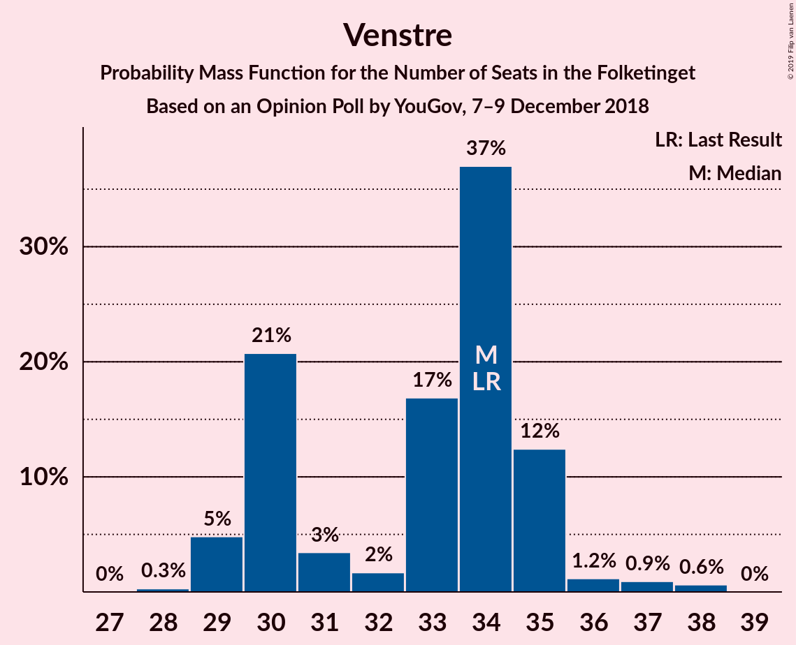

| Number of Seats | Probability | Accumulated | Special Marks |
|:---------------:|:-----------:|:-----------:|:-------------:|
| 28 | 0.3% | 100% |  |
| 29 | 5% | 99.7% |  |
| 30 | 21% | 95% |  |
| 31 | 3% | 74% |  |
| 32 | 2% | 71% |  |
| 33 | 17% | 69% |  |
| 34 | 37% | 52% | Last Result, Median |
| 35 | 12% | 15% |  |
| 36 | 1.2% | 3% |  |
| 37 | 0.9% | 2% |  |
| 38 | 0.6% | 0.6% |  |
| 39 | 0% | 0% |  |

### Dansk Folkeparti

*For a full overview of the results for this party, see the [Dansk Folkeparti](party-danskfolkeparti.html) page.*

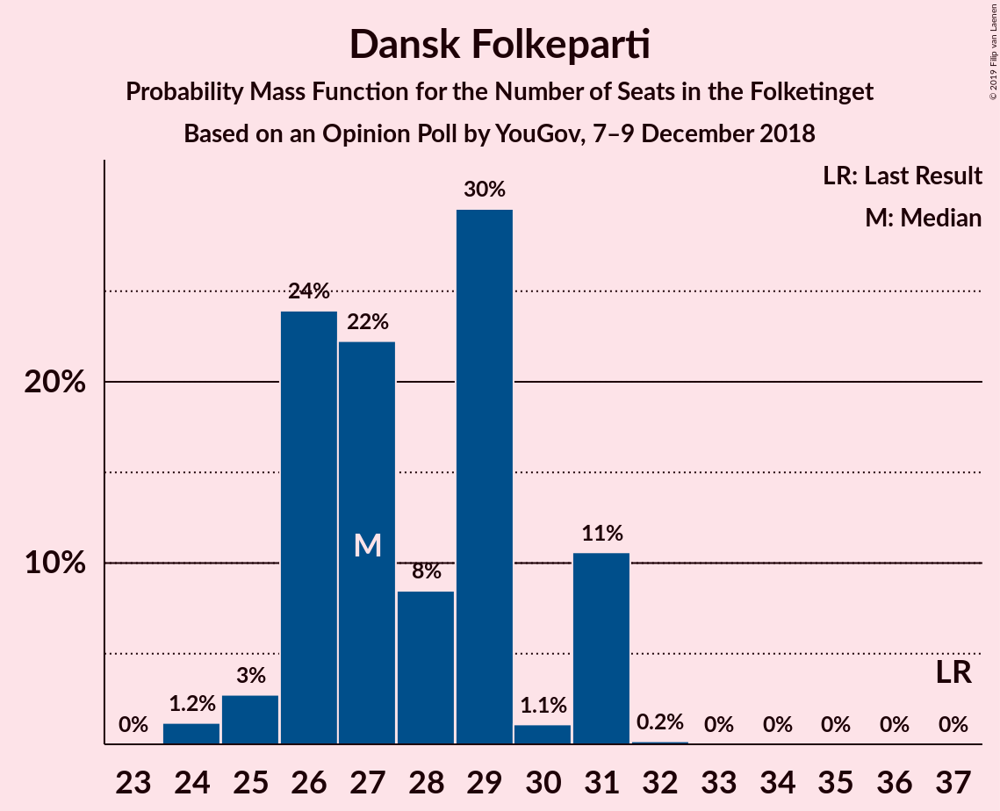

| Number of Seats | Probability | Accumulated | Special Marks |
|:---------------:|:-----------:|:-----------:|:-------------:|
| 24 | 1.2% | 100% |  |
| 25 | 3% | 98.8% |  |
| 26 | 24% | 96% |  |
| 27 | 22% | 72% | Median |
| 28 | 8% | 50% |  |
| 29 | 30% | 41% |  |
| 30 | 1.1% | 12% |  |
| 31 | 11% | 11% |  |
| 32 | 0.2% | 0.2% |  |
| 33 | 0% | 0% |  |
| 34 | 0% | 0% |  |
| 35 | 0% | 0% |  |
| 36 | 0% | 0% |  |
| 37 | 0% | 0% | Last Result |

### Enhedslisten–De Rød-Grønne

*For a full overview of the results for this party, see the [Enhedslisten–De Rød-Grønne](party-enhedslisten–derød-grønne.html) page.*

| Number of Seats | Probability | Accumulated | Special Marks |
|:---------------:|:-----------:|:-----------:|:-------------:|
| 11 | 0.1% | 100% |  |
| 12 | 7% | 99.9% |  |
| 13 | 39% | 93% |  |
| 14 | 4% | 54% | Last Result, Median |
| 15 | 11% | 50% |  |
| 16 | 23% | 38% |  |
| 17 | 14% | 16% |  |
| 18 | 2% | 2% |  |
| 19 | 0% | 0% |  |

### Socialistisk Folkeparti

*For a full overview of the results for this party, see the [Socialistisk Folkeparti](party-socialistiskfolkeparti.html) page.*

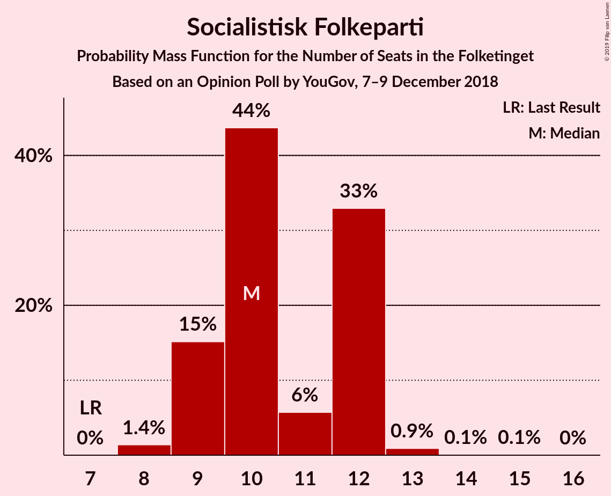

| Number of Seats | Probability | Accumulated | Special Marks |
|:---------------:|:-----------:|:-----------:|:-------------:|
| 7 | 0% | 100% | Last Result |
| 8 | 1.4% | 100% |  |
| 9 | 15% | 98.6% |  |
| 10 | 44% | 83% | Median |
| 11 | 6% | 40% |  |
| 12 | 33% | 34% |  |
| 13 | 0.9% | 1.1% |  |
| 14 | 0.1% | 0.2% |  |
| 15 | 0.1% | 0.1% |  |
| 16 | 0% | 0% |  |

### Alternativet

*For a full overview of the results for this party, see the [Alternativet](party-alternativet.html) page.*

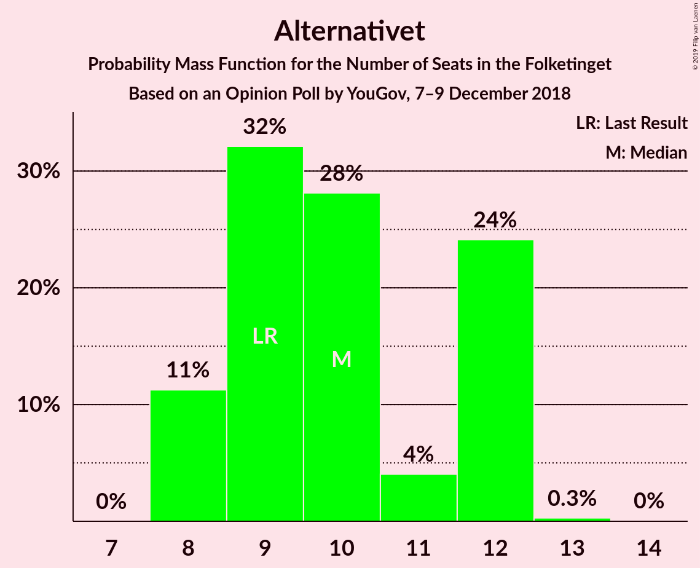

| Number of Seats | Probability | Accumulated | Special Marks |
|:---------------:|:-----------:|:-----------:|:-------------:|
| 8 | 11% | 100% |  |
| 9 | 32% | 89% | Last Result |
| 10 | 28% | 57% | Median |
| 11 | 4% | 28% |  |
| 12 | 24% | 24% |  |
| 13 | 0.3% | 0.3% |  |
| 14 | 0% | 0% |  |

### Radikale Venstre

*For a full overview of the results for this party, see the [Radikale Venstre](party-radikalevenstre.html) page.*

| Number of Seats | Probability | Accumulated | Special Marks |
|:---------------:|:-----------:|:-----------:|:-------------:|
| 6 | 0.5% | 100% |  |
| 7 | 0.8% | 99.5% |  |
| 8 | 2% | 98.7% | Last Result |
| 9 | 57% | 97% | Median |
| 10 | 19% | 40% |  |
| 11 | 17% | 20% |  |
| 12 | 3% | 3% |  |
| 13 | 0% | 0% |  |

### Nye Borgerlige

*For a full overview of the results for this party, see the [Nye Borgerlige](party-nyeborgerlige.html) page.*

| Number of Seats | Probability | Accumulated | Special Marks |
|:---------------:|:-----------:|:-----------:|:-------------:|
| 0 | 0% | 100% | Last Result |
| 1 | 0% | 100% |  |
| 2 | 0% | 100% |  |
| 3 | 0% | 100% |  |
| 4 | 0% | 100% |  |
| 5 | 0% | 100% |  |
| 6 | 0% | 100% |  |
| 7 | 0.8% | 100% |  |
| 8 | 29% | 99.2% |  |
| 9 | 26% | 70% | Median |
| 10 | 14% | 44% |  |
| 11 | 29% | 29% |  |
| 12 | 0.4% | 0.5% |  |
| 13 | 0% | 0% |  |

### Det Konservative Folkeparti

*For a full overview of the results for this party, see the [Det Konservative Folkeparti](party-detkonservativefolkeparti.html) page.*

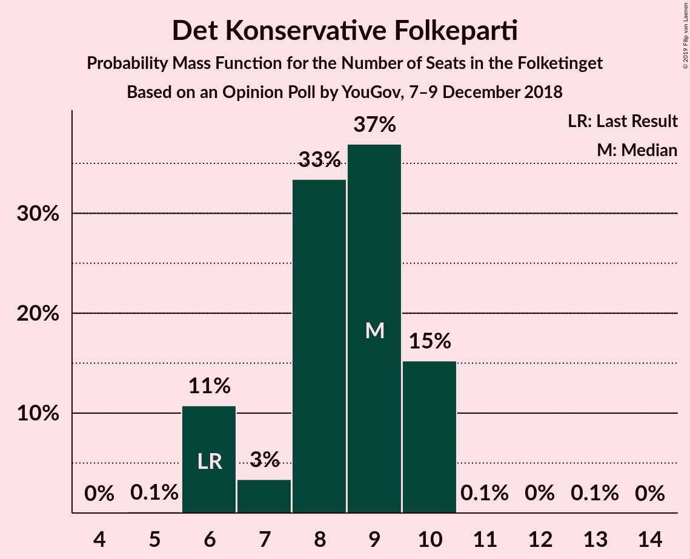

| Number of Seats | Probability | Accumulated | Special Marks |
|:---------------:|:-----------:|:-----------:|:-------------:|
| 5 | 0.1% | 100% |  |
| 6 | 11% | 99.9% | Last Result |
| 7 | 3% | 89% |  |
| 8 | 33% | 86% |  |
| 9 | 37% | 52% | Median |
| 10 | 15% | 15% |  |
| 11 | 0.1% | 0.1% |  |
| 12 | 0% | 0.1% |  |
| 13 | 0.1% | 0.1% |  |
| 14 | 0% | 0% |  |

### Liberal Alliance

*For a full overview of the results for this party, see the [Liberal Alliance](party-liberalalliance.html) page.*

| Number of Seats | Probability | Accumulated | Special Marks |
|:---------------:|:-----------:|:-----------:|:-------------:|
| 4 | 0.1% | 100% |  |
| 5 | 8% | 99.9% |  |
| 6 | 34% | 91% |  |
| 7 | 8% | 58% | Median |
| 8 | 23% | 50% |  |
| 9 | 26% | 26% |  |
| 10 | 0.2% | 0.2% |  |
| 11 | 0% | 0% |  |
| 12 | 0% | 0% |  |
| 13 | 0% | 0% | Last Result |

### Kristendemokraterne

*For a full overview of the results for this party, see the [Kristendemokraterne](party-kristendemokraterne.html) page.*

| Number of Seats | Probability | Accumulated | Special Marks |
|:---------------:|:-----------:|:-----------:|:-------------:|
| 0 | 100% | 100% | Last Result, Median |

## Coalitions

### Confidence Intervals

| Coalition | Last Result | Median | Majority? | 80% Confidence Interval | 90% Confidence Interval | 95% Confidence Interval | 99% Confidence Interval |
|:---------:|:-----------:|:------:|:---------:|:-----------------------:|:-----------------------:|:-----------------------:|:-----------------------:|
| Socialdemokraterne – Enhedslisten–De Rød-Grønne – Socialistisk Folkeparti – Alternativet – Radikale Venstre | 85 | 90 | 50% | 86–92 | 86–94 | 86–94 | 86–95 |
| Venstre – Dansk Folkeparti – Nye Borgerlige – Det Konservative Folkeparti – Liberal Alliance – Kristendemokraterne | 90 | 85 | 0.4% | 83–89 | 81–89 | 81–89 | 80–89 |
| Venstre – Dansk Folkeparti – Nye Borgerlige – Det Konservative Folkeparti – Liberal Alliance | 90 | 85 | 0.4% | 83–89 | 81–89 | 81–89 | 80–89 |
| Socialdemokraterne – Enhedslisten–De Rød-Grønne – Socialistisk Folkeparti – Alternativet | 77 | 81 | 0% | 76–82 | 75–85 | 75–85 | 75–85 |
| Socialdemokraterne – Enhedslisten–De Rød-Grønne – Socialistisk Folkeparti – Radikale Venstre | 76 | 79 | 0% | 77–82 | 77–82 | 77–84 | 75–85 |
| Venstre – Dansk Folkeparti – Det Konservative Folkeparti – Liberal Alliance – Kristendemokraterne | 90 | 76 | 0% | 72–80 | 71–80 | 70–80 | 70–80 |
| Venstre – Dansk Folkeparti – Det Konservative Folkeparti – Liberal Alliance | 90 | 76 | 0% | 72–80 | 71–80 | 70–80 | 70–80 |
| Socialdemokraterne – Enhedslisten–De Rød-Grønne – Socialistisk Folkeparti | 68 | 70 | 0% | 67–72 | 66–73 | 66–75 | 66–76 |
| Socialdemokraterne – Socialistisk Folkeparti – Radikale Venstre | 62 | 65 | 0% | 60–69 | 60–69 | 60–69 | 60–69 |
| Socialdemokraterne – Radikale Venstre | 55 | 55 | 0% | 50–59 | 50–59 | 50–59 | 50–59 |
| Venstre – Det Konservative Folkeparti – Liberal Alliance | 53 | 50 | 0% | 45–51 | 44–51 | 44–51 | 43–53 |
| Venstre – Det Konservative Folkeparti | 40 | 42 | 0% | 39–45 | 37–45 | 37–45 | 37–46 |
| Venstre | 34 | 34 | 0% | 30–35 | 29–35 | 29–36 | 29–38 |

### Socialdemokraterne – Enhedslisten–De Rød-Grønne – Socialistisk Folkeparti – Alternativet – Radikale Venstre

| Number of Seats | Probability | Accumulated | Special Marks |
|:---------------:|:-----------:|:-----------:|:-------------:|
| 84 | 0% | 100% |  |
| 85 | 0.3% | 99.9% | Last Result |
| 86 | 23% | 99.6% |  |
| 87 | 23% | 77% | Median |
| 88 | 2% | 53% |  |
| 89 | 1.2% | 51% |  |
| 90 | 1.0% | 50% | Majority |
| 91 | 19% | 49% |  |
| 92 | 21% | 30% |  |
| 93 | 3% | 9% |  |
| 94 | 5% | 6% |  |
| 95 | 0.4% | 0.6% |  |
| 96 | 0% | 0.3% |  |
| 97 | 0.2% | 0.2% |  |
| 98 | 0% | 0% |  |

### Venstre – Dansk Folkeparti – Nye Borgerlige – Det Konservative Folkeparti – Liberal Alliance – Kristendemokraterne

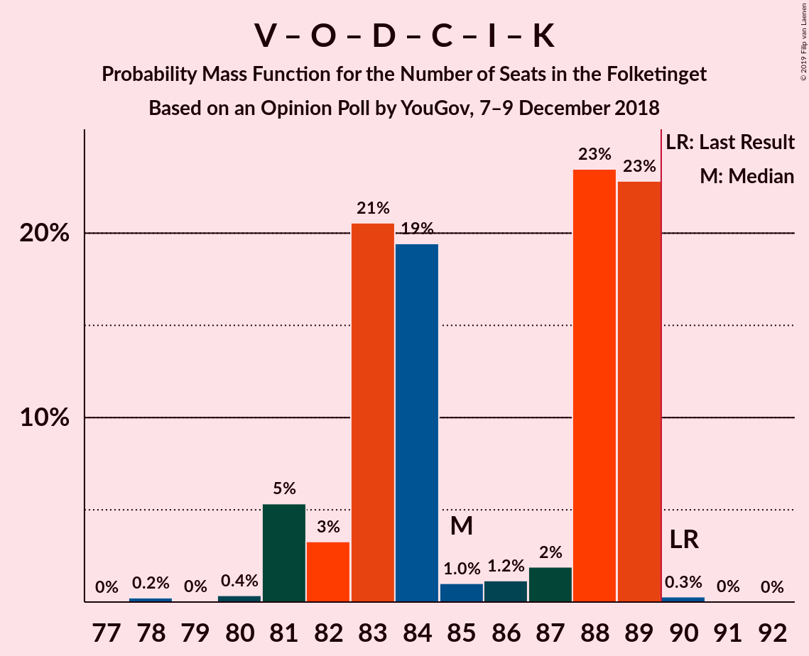

| Number of Seats | Probability | Accumulated | Special Marks |
|:---------------:|:-----------:|:-----------:|:-------------:|
| 78 | 0.2% | 100% |  |
| 79 | 0% | 99.8% |  |
| 80 | 0.4% | 99.7% |  |
| 81 | 5% | 99.4% |  |
| 82 | 3% | 94% |  |
| 83 | 21% | 91% |  |
| 84 | 19% | 70% |  |
| 85 | 1.0% | 51% |  |
| 86 | 1.2% | 50% | Median |
| 87 | 2% | 49% |  |
| 88 | 23% | 47% |  |
| 89 | 23% | 23% |  |
| 90 | 0.3% | 0.4% | Last Result, Majority |
| 91 | 0% | 0.1% |  |
| 92 | 0% | 0% |  |

### Venstre – Dansk Folkeparti – Nye Borgerlige – Det Konservative Folkeparti – Liberal Alliance

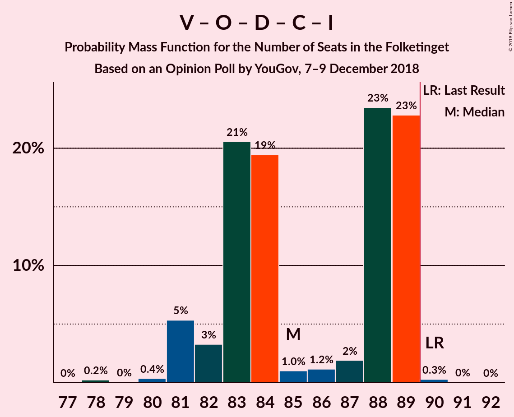

| Number of Seats | Probability | Accumulated | Special Marks |
|:---------------:|:-----------:|:-----------:|:-------------:|
| 78 | 0.2% | 100% |  |
| 79 | 0% | 99.8% |  |
| 80 | 0.4% | 99.7% |  |
| 81 | 5% | 99.4% |  |
| 82 | 3% | 94% |  |
| 83 | 21% | 91% |  |
| 84 | 19% | 70% |  |
| 85 | 1.0% | 51% |  |
| 86 | 1.2% | 50% | Median |
| 87 | 2% | 49% |  |
| 88 | 23% | 47% |  |
| 89 | 23% | 23% |  |
| 90 | 0.3% | 0.4% | Last Result, Majority |
| 91 | 0% | 0.1% |  |
| 92 | 0% | 0% |  |

### Socialdemokraterne – Enhedslisten–De Rød-Grønne – Socialistisk Folkeparti – Alternativet

| Number of Seats | Probability | Accumulated | Special Marks |
|:---------------:|:-----------:|:-----------:|:-------------:|
| 74 | 0% | 100% |  |
| 75 | 9% | 99.9% |  |
| 76 | 7% | 90% |  |
| 77 | 13% | 84% | Last Result |
| 78 | 17% | 70% | Median |
| 79 | 0.8% | 53% |  |
| 80 | 2% | 53% |  |
| 81 | 4% | 51% |  |
| 82 | 39% | 46% |  |
| 83 | 0.1% | 8% |  |
| 84 | 2% | 8% |  |
| 85 | 5% | 6% |  |
| 86 | 0% | 0.4% |  |
| 87 | 0.1% | 0.3% |  |
| 88 | 0.2% | 0.2% |  |
| 89 | 0% | 0% |  |

### Socialdemokraterne – Enhedslisten–De Rød-Grønne – Socialistisk Folkeparti – Radikale Venstre

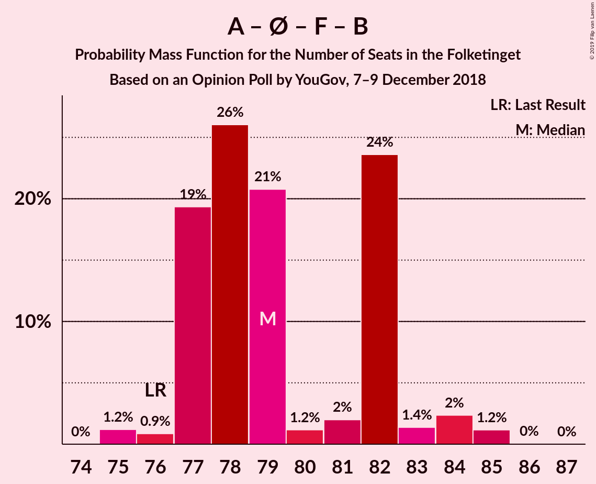

| Number of Seats | Probability | Accumulated | Special Marks |
|:---------------:|:-----------:|:-----------:|:-------------:|
| 75 | 1.2% | 100% |  |
| 76 | 0.9% | 98.8% | Last Result |
| 77 | 19% | 98% | Median |
| 78 | 26% | 79% |  |
| 79 | 21% | 53% |  |
| 80 | 1.2% | 32% |  |
| 81 | 2% | 31% |  |
| 82 | 24% | 29% |  |
| 83 | 1.4% | 5% |  |
| 84 | 2% | 4% |  |
| 85 | 1.2% | 1.2% |  |
| 86 | 0% | 0.1% |  |
| 87 | 0% | 0% |  |

### Venstre – Dansk Folkeparti – Det Konservative Folkeparti – Liberal Alliance – Kristendemokraterne

| Number of Seats | Probability | Accumulated | Special Marks |
|:---------------:|:-----------:|:-----------:|:-------------:|
| 70 | 3% | 100% |  |
| 71 | 2% | 97% |  |
| 72 | 19% | 94% |  |
| 73 | 3% | 76% |  |
| 74 | 3% | 73% |  |
| 75 | 8% | 69% |  |
| 76 | 13% | 62% |  |
| 77 | 8% | 49% | Median |
| 78 | 1.2% | 41% |  |
| 79 | 10% | 40% |  |
| 80 | 30% | 30% |  |
| 81 | 0.1% | 0.1% |  |
| 82 | 0% | 0% |  |
| 83 | 0% | 0% |  |
| 84 | 0% | 0% |  |
| 85 | 0% | 0% |  |
| 86 | 0% | 0% |  |
| 87 | 0% | 0% |  |
| 88 | 0% | 0% |  |
| 89 | 0% | 0% |  |
| 90 | 0% | 0% | Last Result, Majority |

### Venstre – Dansk Folkeparti – Det Konservative Folkeparti – Liberal Alliance

| Number of Seats | Probability | Accumulated | Special Marks |
|:---------------:|:-----------:|:-----------:|:-------------:|
| 70 | 3% | 100% |  |
| 71 | 2% | 97% |  |
| 72 | 19% | 94% |  |
| 73 | 3% | 76% |  |
| 74 | 3% | 73% |  |
| 75 | 8% | 69% |  |
| 76 | 13% | 62% |  |
| 77 | 8% | 49% | Median |
| 78 | 1.2% | 41% |  |
| 79 | 10% | 40% |  |
| 80 | 30% | 30% |  |
| 81 | 0.1% | 0.1% |  |
| 82 | 0% | 0% |  |
| 83 | 0% | 0% |  |
| 84 | 0% | 0% |  |
| 85 | 0% | 0% |  |
| 86 | 0% | 0% |  |
| 87 | 0% | 0% |  |
| 88 | 0% | 0% |  |
| 89 | 0% | 0% |  |
| 90 | 0% | 0% | Last Result, Majority |

### Socialdemokraterne – Enhedslisten–De Rød-Grønne – Socialistisk Folkeparti

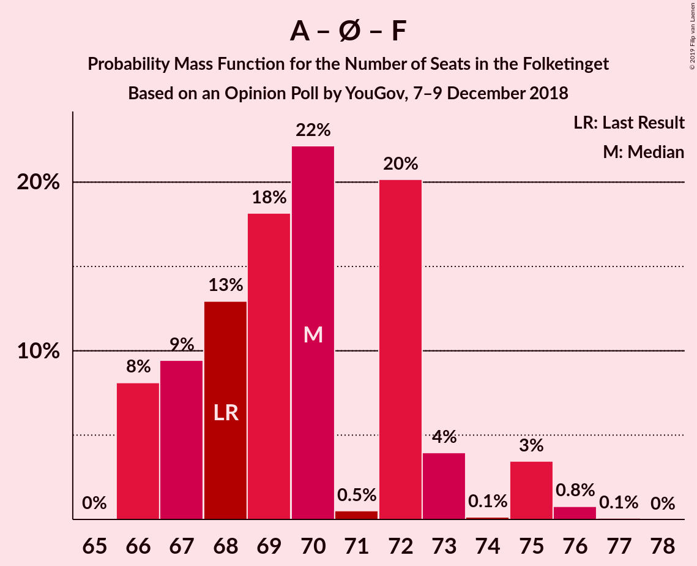

| Number of Seats | Probability | Accumulated | Special Marks |
|:---------------:|:-----------:|:-----------:|:-------------:|
| 65 | 0% | 100% |  |
| 66 | 8% | 99.9% |  |
| 67 | 9% | 92% |  |
| 68 | 13% | 82% | Last Result, Median |
| 69 | 18% | 69% |  |
| 70 | 22% | 51% |  |
| 71 | 0.5% | 29% |  |
| 72 | 20% | 29% |  |
| 73 | 4% | 8% |  |
| 74 | 0.1% | 4% |  |
| 75 | 3% | 4% |  |
| 76 | 0.8% | 0.9% |  |
| 77 | 0.1% | 0.1% |  |
| 78 | 0% | 0% |  |

### Socialdemokraterne – Socialistisk Folkeparti – Radikale Venstre

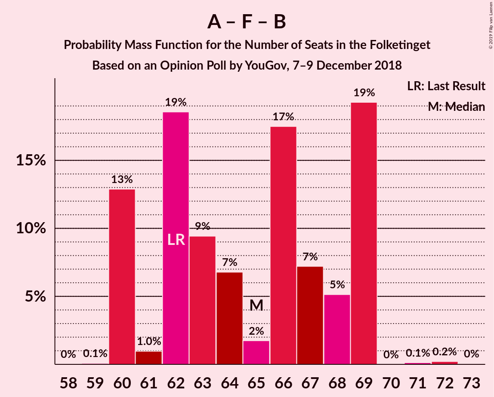

| Number of Seats | Probability | Accumulated | Special Marks |
|:---------------:|:-----------:|:-----------:|:-------------:|
| 59 | 0.1% | 100% |  |
| 60 | 13% | 99.9% |  |
| 61 | 1.0% | 87% |  |
| 62 | 19% | 86% | Last Result |
| 63 | 9% | 67% | Median |
| 64 | 7% | 58% |  |
| 65 | 2% | 51% |  |
| 66 | 17% | 50% |  |
| 67 | 7% | 32% |  |
| 68 | 5% | 25% |  |
| 69 | 19% | 20% |  |
| 70 | 0% | 0.4% |  |
| 71 | 0.1% | 0.4% |  |
| 72 | 0.2% | 0.3% |  |
| 73 | 0% | 0% |  |

### Socialdemokraterne – Radikale Venstre

| Number of Seats | Probability | Accumulated | Special Marks |
|:---------------:|:-----------:|:-----------:|:-------------:|
| 48 | 0% | 100% |  |
| 49 | 0.2% | 99.9% |  |
| 50 | 29% | 99.8% |  |
| 51 | 0.9% | 71% |  |
| 52 | 8% | 70% |  |
| 53 | 10% | 62% | Median |
| 54 | 1.4% | 52% |  |
| 55 | 12% | 50% | Last Result |
| 56 | 4% | 39% |  |
| 57 | 13% | 35% |  |
| 58 | 3% | 22% |  |
| 59 | 18% | 19% |  |
| 60 | 0.1% | 0.3% |  |
| 61 | 0% | 0.2% |  |
| 62 | 0.2% | 0.2% |  |
| 63 | 0% | 0% |  |

### Venstre – Det Konservative Folkeparti – Liberal Alliance

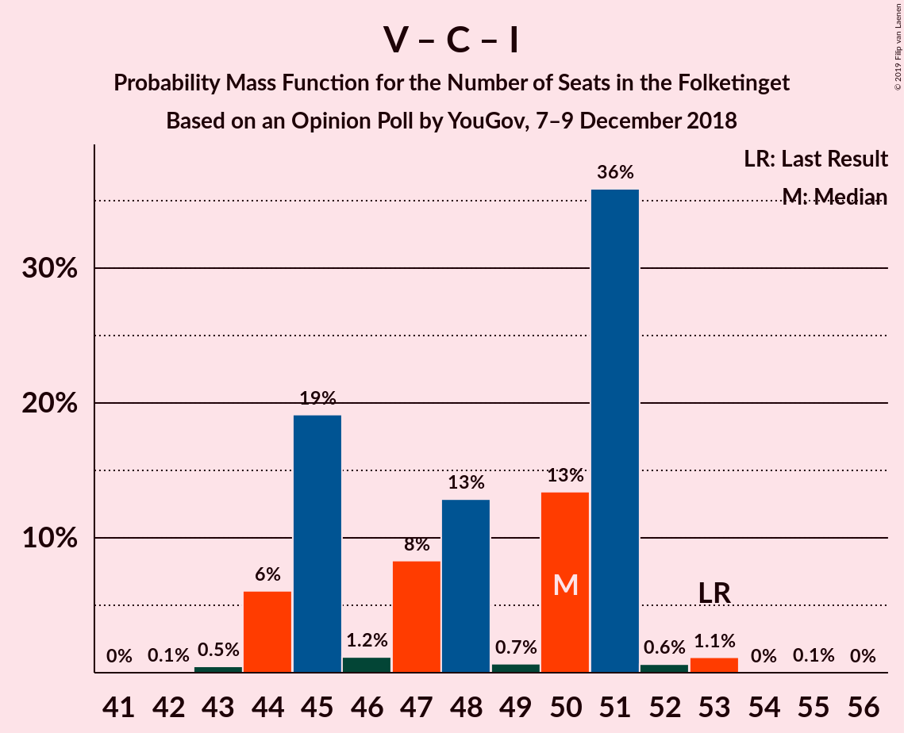

| Number of Seats | Probability | Accumulated | Special Marks |
|:---------------:|:-----------:|:-----------:|:-------------:|
| 42 | 0.1% | 100% |  |
| 43 | 0.5% | 99.9% |  |
| 44 | 6% | 99.4% |  |
| 45 | 19% | 93% |  |
| 46 | 1.2% | 74% |  |
| 47 | 8% | 73% |  |
| 48 | 13% | 65% |  |
| 49 | 0.7% | 52% |  |
| 50 | 13% | 51% | Median |
| 51 | 36% | 38% |  |
| 52 | 0.6% | 2% |  |
| 53 | 1.1% | 1.3% | Last Result |
| 54 | 0% | 0.1% |  |
| 55 | 0.1% | 0.1% |  |
| 56 | 0% | 0% |  |

### Venstre – Det Konservative Folkeparti

| Number of Seats | Probability | Accumulated | Special Marks |
|:---------------:|:-----------:|:-----------:|:-------------:|
| 36 | 0.1% | 100% |  |
| 37 | 7% | 99.9% |  |
| 38 | 0.6% | 93% |  |
| 39 | 22% | 92% |  |
| 40 | 10% | 70% | Last Result |
| 41 | 2% | 61% |  |
| 42 | 42% | 58% |  |
| 43 | 0.2% | 16% | Median |
| 44 | 1.4% | 16% |  |
| 45 | 13% | 15% |  |
| 46 | 2% | 2% |  |
| 47 | 0% | 0.1% |  |
| 48 | 0% | 0.1% |  |
| 49 | 0.1% | 0.1% |  |
| 50 | 0% | 0% |  |

### Venstre

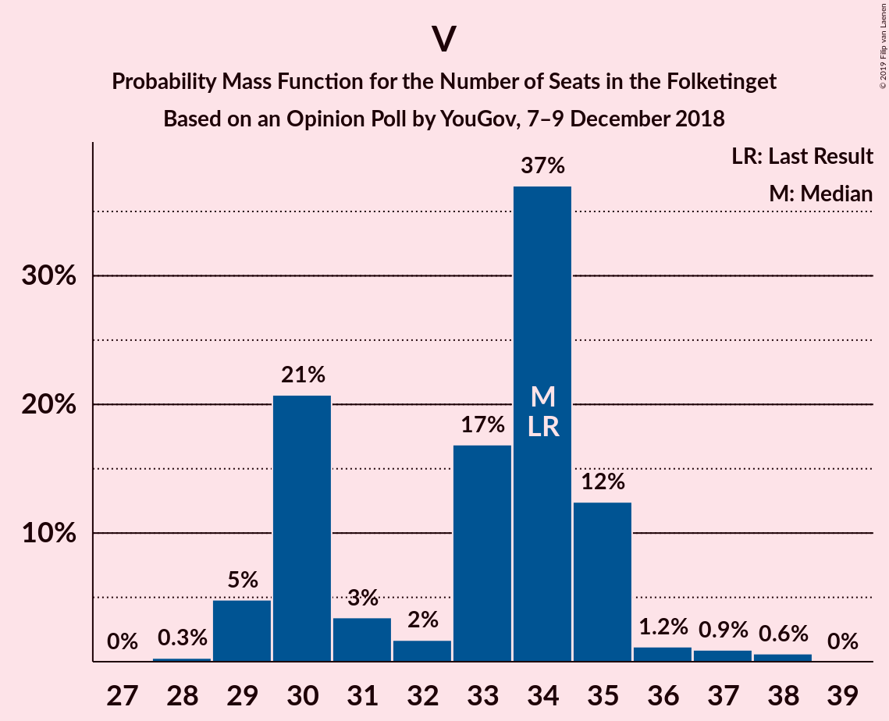

| Number of Seats | Probability | Accumulated | Special Marks |
|:---------------:|:-----------:|:-----------:|:-------------:|
| 28 | 0.3% | 100% |  |
| 29 | 5% | 99.7% |  |
| 30 | 21% | 95% |  |
| 31 | 3% | 74% |  |
| 32 | 2% | 71% |  |
| 33 | 17% | 69% |  |
| 34 | 37% | 52% | Last Result, Median |
| 35 | 12% | 15% |  |
| 36 | 1.2% | 3% |  |
| 37 | 0.9% | 2% |  |
| 38 | 0.6% | 0.6% |  |
| 39 | 0% | 0% |  |

## Technical Information

### Opinion Poll

+ **Polling firm:** YouGov
+ **Commissioner(s):** —
+ **Fieldwork period:** 7–9 December 2018

### Calculations

+ **Sample size:** 1662
+ **Simulations done:** 131,072
+ **Error estimate:** 4.36%

