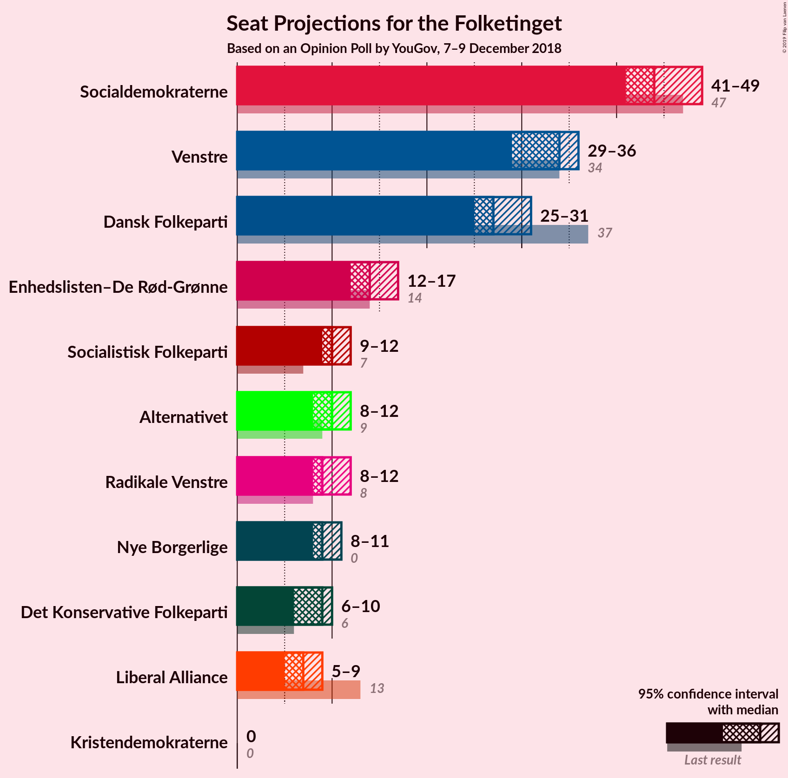
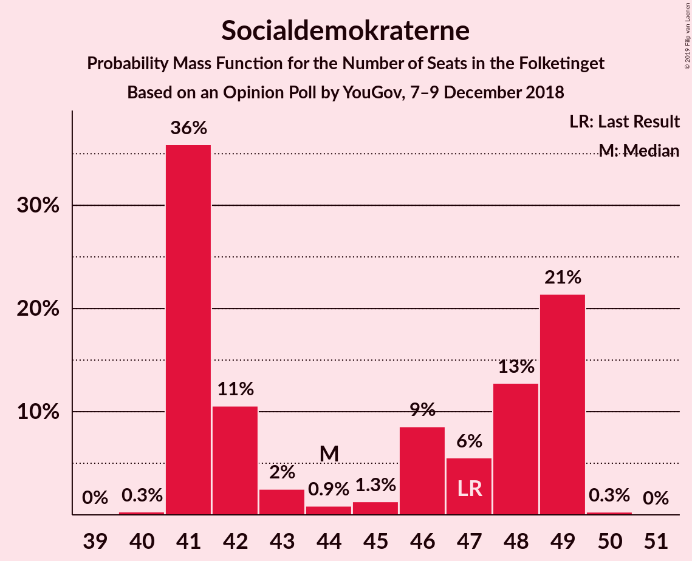
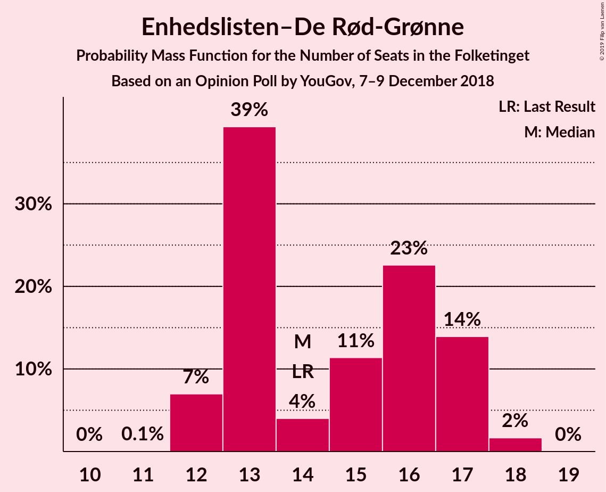
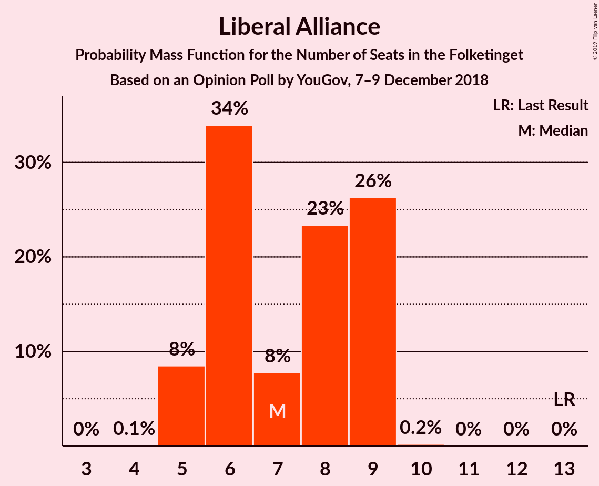
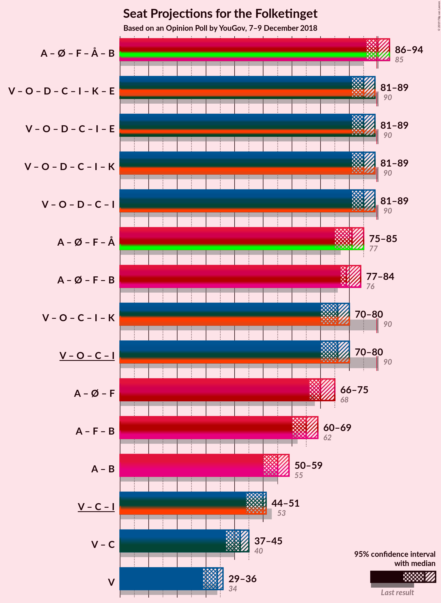
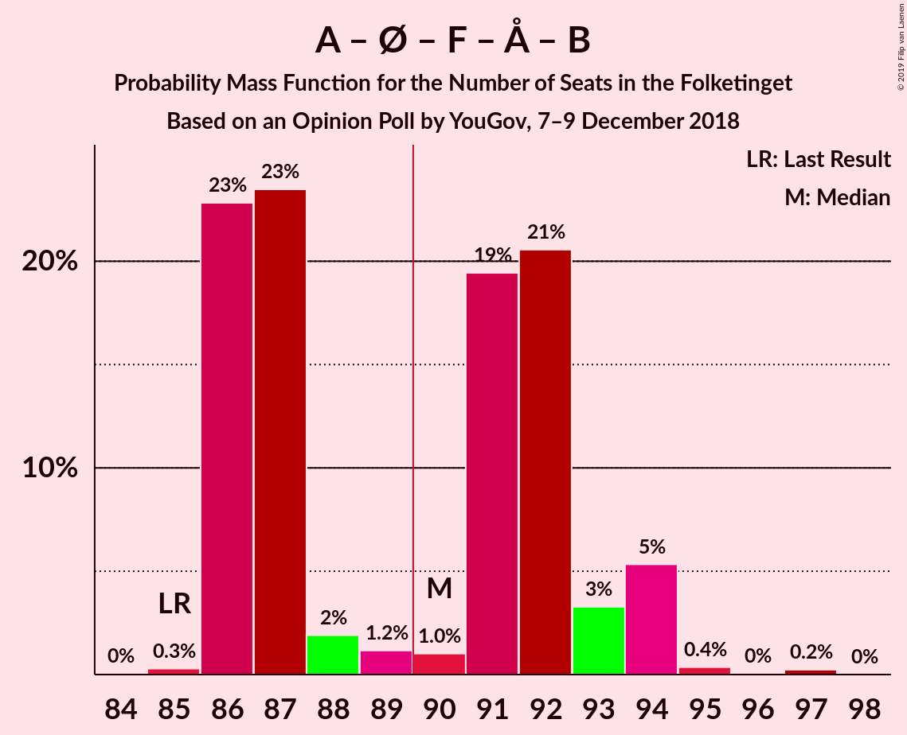

# Opinion Poll by YouGov, 7–9 December 2018

<a href="#voting-intentions">Voting Intentions</a> | <a href="#seats">Seats</a> | <a href="#coalitions">Coalitions</a> | <a href="#technical-information">Technical Information</a>

## Voting Intentions

### Confidence Intervals

| Party | Last Result | Poll Result | 80% Confidence Interval | 90% Confidence Interval | 95% Confidence Interval | 99% Confidence Interval |
|:-----:|:-----------:|:-----------:|:-----------------------:|:-----------------------:|:-----------------------:|:-----------------------:|
| Socialdemokraterne | 26.3% | 25.0% | 23.7–26.4% |23.3–26.8% |23.0–27.2% |22.4–27.9% |
| Venstre | 19.5% | 18.9% | 17.7–20.2% |17.4–20.5% |17.1–20.9% |16.5–21.5% |
| Dansk Folkeparti | 21.1% | 15.8% | 14.7–17.0% |14.4–17.4% |14.1–17.7% |13.6–18.3% |
| Enhedslisten–De Rød-Grønne | 7.8% | 8.6% | 7.8–9.6% |7.5–9.8% |7.3–10.1% |7.0–10.5% |
| Socialistisk Folkeparti | 4.2% | 5.9% | 5.2–6.7% |5.0–6.9% |4.9–7.1% |4.5–7.5% |
| Alternativet | 4.8% | 5.8% | 5.1–6.6% |4.9–6.8% |4.8–7.0% |4.5–7.4% |
| Radikale Venstre | 4.6% | 5.4% | 4.8–6.2% |4.6–6.4% |4.4–6.6% |4.1–7.0% |
| Nye Borgerlige | 0.0% | 5.3% | 4.6–6.1% |4.5–6.3% |4.3–6.5% |4.0–6.9% |
| Det Konservative Folkeparti | 3.4% | 4.7% | 4.1–5.4% |3.9–5.6% |3.8–5.8% |3.5–6.2% |
| Liberal Alliance | 7.5% | 4.0% | 3.4–4.7% |3.3–4.9% |3.1–5.0% |2.9–5.4% |
| Kristendemokraterne | 0.8% | 0.6% | 0.4–0.9% |0.4–1.0% |0.3–1.1% |0.3–1.3% |

*Note:* The poll result column reflects the actual value used in the calculations. Published results may vary slightly, and in addition be rounded to fewer digits.

## Seats

### Confidence Intervals

| Party | Last Result | Median | 80% Confidence Interval | 90% Confidence Interval | 95% Confidence Interval | 99% Confidence Interval |
|:-----:|:-----------:|:------:|:-----------------------:|:-----------------------:|:-----------------------:|:-----------------------:|
| <a href="#socialdemokraterne">Socialdemokraterne</a> | 47 | 44 | 44 |44 |44–46 |42–47 |
| <a href="#venstre">Venstre</a> | 34 | 32 | 32 |32 |32 |28–37 |
| <a href="#dansk-folkeparti">Dansk Folkeparti</a> | 37 | 30 | 30 |30 |28–30 |26–31 |
| <a href="#enhedslisten–de-rød-grønne">Enhedslisten–De Rød-Grønne</a> | 14 | 12 | 12 |12 |12–13 |12–15 |
| <a href="#socialistisk-folkeparti">Socialistisk Folkeparti</a> | 7 | 12 | 12 |12 |11–13 |10–13 |
| <a href="#alternativet">Alternativet</a> | 9 | 12 | 12 |9–12 |8–12 |8–12 |
| <a href="#radikale-venstre">Radikale Venstre</a> | 8 | 8 | 8 |8–9 |8–10 |8–12 |
| <a href="#nye-borgerlige">Nye Borgerlige</a> | 0 | 8 | 8 |8 |7–8 |7–15 |
| <a href="#det-konservative-folkeparti">Det Konservative Folkeparti</a> | 6 | 7 | 7 |7–8 |7–10 |7–10 |
| <a href="#liberal-alliance">Liberal Alliance</a> | 13 | 10 | 10 |8–10 |7–10 |7–10 |
| <a href="#kristendemokraterne">Kristendemokraterne</a> | 0 | 0 | 0 |0 |0 |0 |

### Socialdemokraterne

*For a full overview of the results for this party, see the [Socialdemokraterne](party-socialdemokraterne.html) page.*

| Number of Seats | Probability | Accumulated | Special Marks |
|:---------------:|:-----------:|:-----------:|:-------------:|
| 42 | 2% | 100% |  |
| 43 | 0% | 98% |  |
| 44 | 94% | 98% | Median |
| 45 | 0% | 4% |  |
| 46 | 2% | 4% |  |
| 47 | 1.4% | 2% | Last Result |
| 48 | 0.1% | 0.1% |  |
| 49 | 0% | 0% |  |

### Venstre

*For a full overview of the results for this party, see the [Venstre](party-venstre.html) page.*

| Number of Seats | Probability | Accumulated | Special Marks |
|:---------------:|:-----------:|:-----------:|:-------------:|
| 28 | 1.4% | 100% |  |
| 29 | 0% | 98.6% |  |
| 30 | 0% | 98.6% |  |
| 31 | 0.1% | 98.6% |  |
| 32 | 96% | 98% | Median |
| 33 | 0% | 2% |  |
| 34 | 0% | 2% | Last Result |
| 35 | 0% | 2% |  |
| 36 | 0% | 2% |  |
| 37 | 2% | 2% |  |
| 38 | 0% | 0% |  |

### Dansk Folkeparti

*For a full overview of the results for this party, see the [Dansk Folkeparti](party-danskfolkeparti.html) page.*

| Number of Seats | Probability | Accumulated | Special Marks |
|:---------------:|:-----------:|:-----------:|:-------------:|
| 22 | 0.1% | 100% |  |
| 23 | 0% | 99.9% |  |
| 24 | 0% | 99.9% |  |
| 25 | 0% | 99.9% |  |
| 26 | 1.4% | 99.9% |  |
| 27 | 0% | 98% |  |
| 28 | 2% | 98% |  |
| 29 | 0% | 96% |  |
| 30 | 94% | 96% | Median |
| 31 | 2% | 2% |  |
| 32 | 0% | 0% |  |
| 33 | 0% | 0% |  |
| 34 | 0% | 0% |  |
| 35 | 0% | 0% |  |
| 36 | 0% | 0% |  |
| 37 | 0% | 0% | Last Result |

### Enhedslisten–De Rød-Grønne

*For a full overview of the results for this party, see the [Enhedslisten–De Rød-Grønne](party-enhedslisten–derød-grønne.html) page.*

| Number of Seats | Probability | Accumulated | Special Marks |
|:---------------:|:-----------:|:-----------:|:-------------:|
| 12 | 96% | 100% | Median |
| 13 | 2% | 4% |  |
| 14 | 0% | 2% | Last Result |
| 15 | 2% | 2% |  |
| 16 | 0% | 0% |  |

### Socialistisk Folkeparti

*For a full overview of the results for this party, see the [Socialistisk Folkeparti](party-socialistiskfolkeparti.html) page.*

| Number of Seats | Probability | Accumulated | Special Marks |
|:---------------:|:-----------:|:-----------:|:-------------:|
| 7 | 0% | 100% | Last Result |
| 8 | 0% | 100% |  |
| 9 | 0% | 100% |  |
| 10 | 2% | 100% |  |
| 11 | 1.4% | 98% |  |
| 12 | 94% | 96% | Median |
| 13 | 3% | 3% |  |
| 14 | 0% | 0% |  |

### Alternativet

*For a full overview of the results for this party, see the [Alternativet](party-alternativet.html) page.*

| Number of Seats | Probability | Accumulated | Special Marks |
|:---------------:|:-----------:|:-----------:|:-------------:|
| 8 | 5% | 100% |  |
| 9 | 1.5% | 95% | Last Result |
| 10 | 0% | 94% |  |
| 11 | 0% | 94% |  |
| 12 | 94% | 94% | Median |
| 13 | 0% | 0% |  |

### Radikale Venstre

*For a full overview of the results for this party, see the [Radikale Venstre](party-radikalevenstre.html) page.*

| Number of Seats | Probability | Accumulated | Special Marks |
|:---------------:|:-----------:|:-----------:|:-------------:|
| 8 | 94% | 100% | Last Result, Median |
| 9 | 2% | 6% |  |
| 10 | 2% | 4% |  |
| 11 | 0% | 2% |  |
| 12 | 2% | 2% |  |
| 13 | 0% | 0% |  |

### Nye Borgerlige

*For a full overview of the results for this party, see the [Nye Borgerlige](party-nyeborgerlige.html) page.*

| Number of Seats | Probability | Accumulated | Special Marks |
|:---------------:|:-----------:|:-----------:|:-------------:|
| 0 | 0% | 100% | Last Result |
| 1 | 0% | 100% |  |
| 2 | 0% | 100% |  |
| 3 | 0% | 100% |  |
| 4 | 0% | 100% |  |
| 5 | 0% | 100% |  |
| 6 | 0% | 100% |  |
| 7 | 5% | 100% |  |
| 8 | 94% | 95% | Median |
| 9 | 0.1% | 2% |  |
| 10 | 0% | 1.5% |  |
| 11 | 0% | 1.5% |  |
| 12 | 0% | 1.4% |  |
| 13 | 0% | 1.4% |  |
| 14 | 0% | 1.4% |  |
| 15 | 1.4% | 1.4% |  |
| 16 | 0% | 0% |  |

### Det Konservative Folkeparti

*For a full overview of the results for this party, see the [Det Konservative Folkeparti](party-detkonservativefolkeparti.html) page.*

| Number of Seats | Probability | Accumulated | Special Marks |
|:---------------:|:-----------:|:-----------:|:-------------:|
| 6 | 0% | 100% | Last Result |
| 7 | 94% | 100% | Median |
| 8 | 2% | 6% |  |
| 9 | 1.4% | 4% |  |
| 10 | 2% | 3% |  |
| 11 | 0.1% | 0.1% |  |
| 12 | 0% | 0% |  |

### Liberal Alliance

*For a full overview of the results for this party, see the [Liberal Alliance](party-liberalalliance.html) page.*

| Number of Seats | Probability | Accumulated | Special Marks |
|:---------------:|:-----------:|:-----------:|:-------------:|
| 7 | 4% | 100% |  |
| 8 | 2% | 96% |  |
| 9 | 0% | 94% |  |
| 10 | 94% | 94% | Median |
| 11 | 0% | 0% |  |
| 12 | 0% | 0% |  |
| 13 | 0% | 0% | Last Result |

### Kristendemokraterne

*For a full overview of the results for this party, see the [Kristendemokraterne](party-kristendemokraterne.html) page.*

| Number of Seats | Probability | Accumulated | Special Marks |
|:---------------:|:-----------:|:-----------:|:-------------:|
| 0 | 100% | 100% | Last Result, Median |

## Coalitions

### Confidence Intervals

| Coalition | Last Result | Median | Majority? | 80% Confidence Interval | 90% Confidence Interval | 95% Confidence Interval | 99% Confidence Interval |
|:---------:|:-----------:|:------:|:---------:|:-----------------------:|:-----------------------:|:-----------------------:|:-----------------------:|
| Socialdemokraterne – Enhedslisten–De Rød-Grønne – Socialistisk Folkeparti – Alternativet – Radikale Venstre | 85 | 88 | 2% | 88 | 88 | 88 | 87–90 |
| Venstre – Dansk Folkeparti – Nye Borgerlige – Det Konservative Folkeparti – Liberal Alliance – Kristendemokraterne | 90 | 87 | 0% | 87 | 87 | 87 | 85–88 |
| Venstre – Dansk Folkeparti – Nye Borgerlige – Det Konservative Folkeparti – Liberal Alliance | 90 | 87 | 0% | 87 | 87 | 87 | 85–88 |
| Socialdemokraterne – Enhedslisten–De Rød-Grønne – Socialistisk Folkeparti – Alternativet | 77 | 80 | 0% | 80 | 80 | 79–80 | 75–80 |
| Venstre – Dansk Folkeparti – Det Konservative Folkeparti – Liberal Alliance – Kristendemokraterne | 90 | 79 | 0% | 79 | 79 | 79–80 | 70–81 |
| Venstre – Dansk Folkeparti – Det Konservative Folkeparti – Liberal Alliance | 90 | 79 | 0% | 79 | 79 | 79–80 | 70–81 |
| Socialdemokraterne – Enhedslisten–De Rød-Grønne – Socialistisk Folkeparti – Radikale Venstre | 76 | 76 | 0% | 76 | 76–79 | 76–80 | 76–81 |
| Socialdemokraterne – Enhedslisten–De Rød-Grønne – Socialistisk Folkeparti | 68 | 68 | 0% | 68 | 68 | 68–71 | 67–71 |
| Socialdemokraterne – Socialistisk Folkeparti – Radikale Venstre | 62 | 64 | 0% | 64 | 64 | 64–68 | 64–68 |
| Socialdemokraterne – Radikale Venstre | 55 | 52 | 0% | 52 | 52–54 | 52–55 | 52–57 |
| Venstre – Det Konservative Folkeparti – Liberal Alliance | 53 | 49 | 0% | 49 | 49 | 49 | 44–53 |
| Venstre – Det Konservative Folkeparti | 40 | 39 | 0% | 39 | 39 | 39–42 | 37–45 |
| Venstre | 34 | 32 | 0% | 32 | 32 | 32 | 28–37 |

### Socialdemokraterne – Enhedslisten–De Rød-Grønne – Socialistisk Folkeparti – Alternativet – Radikale Venstre

| Number of Seats | Probability | Accumulated | Special Marks |
|:---------------:|:-----------:|:-----------:|:-------------:|
| 85 | 0% | 100% | Last Result |
| 86 | 0% | 100% |  |
| 87 | 2% | 100% |  |
| 88 | 96% | 98% | Median |
| 89 | 0% | 2% |  |
| 90 | 1.4% | 2% | Majority |
| 91 | 0% | 0.1% |  |
| 92 | 0.1% | 0.1% |  |
| 93 | 0% | 0% |  |

### Venstre – Dansk Folkeparti – Nye Borgerlige – Det Konservative Folkeparti – Liberal Alliance – Kristendemokraterne

| Number of Seats | Probability | Accumulated | Special Marks |
|:---------------:|:-----------:|:-----------:|:-------------:|
| 83 | 0.1% | 100% |  |
| 84 | 0% | 99.9% |  |
| 85 | 1.4% | 99.9% |  |
| 86 | 0% | 98% |  |
| 87 | 96% | 98% | Median |
| 88 | 2% | 2% |  |
| 89 | 0% | 0% |  |
| 90 | 0% | 0% | Last Result, Majority |

### Venstre – Dansk Folkeparti – Nye Borgerlige – Det Konservative Folkeparti – Liberal Alliance

| Number of Seats | Probability | Accumulated | Special Marks |
|:---------------:|:-----------:|:-----------:|:-------------:|
| 83 | 0.1% | 100% |  |
| 84 | 0% | 99.9% |  |
| 85 | 1.4% | 99.9% |  |
| 86 | 0% | 98% |  |
| 87 | 96% | 98% | Median |
| 88 | 2% | 2% |  |
| 89 | 0% | 0% |  |
| 90 | 0% | 0% | Last Result, Majority |

### Socialdemokraterne – Enhedslisten–De Rød-Grønne – Socialistisk Folkeparti – Alternativet

| Number of Seats | Probability | Accumulated | Special Marks |
|:---------------:|:-----------:|:-----------:|:-------------:|
| 75 | 2% | 100% |  |
| 76 | 0% | 98% |  |
| 77 | 0% | 98% | Last Result |
| 78 | 0% | 98% |  |
| 79 | 2% | 98% |  |
| 80 | 95% | 95% | Median |
| 81 | 0% | 0.1% |  |
| 82 | 0.1% | 0.1% |  |
| 83 | 0% | 0% |  |

### Venstre – Dansk Folkeparti – Det Konservative Folkeparti – Liberal Alliance – Kristendemokraterne

| Number of Seats | Probability | Accumulated | Special Marks |
|:---------------:|:-----------:|:-----------:|:-------------:|
| 70 | 1.4% | 100% |  |
| 71 | 0% | 98.6% |  |
| 72 | 0% | 98.6% |  |
| 73 | 0% | 98.6% |  |
| 74 | 0.1% | 98.6% |  |
| 75 | 0% | 98% |  |
| 76 | 0% | 98% |  |
| 77 | 0% | 98% |  |
| 78 | 0% | 98% |  |
| 79 | 94% | 98% | Median |
| 80 | 2% | 5% |  |
| 81 | 2% | 2% |  |
| 82 | 0% | 0% |  |
| 83 | 0% | 0% |  |
| 84 | 0% | 0% |  |
| 85 | 0% | 0% |  |
| 86 | 0% | 0% |  |
| 87 | 0% | 0% |  |
| 88 | 0% | 0% |  |
| 89 | 0% | 0% |  |
| 90 | 0% | 0% | Last Result, Majority |

### Venstre – Dansk Folkeparti – Det Konservative Folkeparti – Liberal Alliance

| Number of Seats | Probability | Accumulated | Special Marks |
|:---------------:|:-----------:|:-----------:|:-------------:|
| 70 | 1.4% | 100% |  |
| 71 | 0% | 98.6% |  |
| 72 | 0% | 98.6% |  |
| 73 | 0% | 98.6% |  |
| 74 | 0.1% | 98.6% |  |
| 75 | 0% | 98% |  |
| 76 | 0% | 98% |  |
| 77 | 0% | 98% |  |
| 78 | 0% | 98% |  |
| 79 | 94% | 98% | Median |
| 80 | 2% | 5% |  |
| 81 | 2% | 2% |  |
| 82 | 0% | 0% |  |
| 83 | 0% | 0% |  |
| 84 | 0% | 0% |  |
| 85 | 0% | 0% |  |
| 86 | 0% | 0% |  |
| 87 | 0% | 0% |  |
| 88 | 0% | 0% |  |
| 89 | 0% | 0% |  |
| 90 | 0% | 0% | Last Result, Majority |

### Socialdemokraterne – Enhedslisten–De Rød-Grønne – Socialistisk Folkeparti – Radikale Venstre

| Number of Seats | Probability | Accumulated | Special Marks |
|:---------------:|:-----------:|:-----------:|:-------------:|
| 76 | 94% | 100% | Last Result, Median |
| 77 | 0% | 6% |  |
| 78 | 0% | 6% |  |
| 79 | 2% | 6% |  |
| 80 | 2% | 4% |  |
| 81 | 1.4% | 2% |  |
| 82 | 0% | 0.1% |  |
| 83 | 0% | 0.1% |  |
| 84 | 0.1% | 0.1% |  |
| 85 | 0% | 0% |  |

### Socialdemokraterne – Enhedslisten–De Rød-Grønne – Socialistisk Folkeparti

| Number of Seats | Probability | Accumulated | Special Marks |
|:---------------:|:-----------:|:-----------:|:-------------:|
| 67 | 2% | 100% |  |
| 68 | 94% | 98% | Last Result, Median |
| 69 | 0% | 4% |  |
| 70 | 0% | 4% |  |
| 71 | 4% | 4% |  |
| 72 | 0% | 0.1% |  |
| 73 | 0% | 0.1% |  |
| 74 | 0.1% | 0.1% |  |
| 75 | 0% | 0% |  |

### Socialdemokraterne – Socialistisk Folkeparti – Radikale Venstre

| Number of Seats | Probability | Accumulated | Special Marks |
|:---------------:|:-----------:|:-----------:|:-------------:|
| 62 | 0% | 100% | Last Result |
| 63 | 0% | 100% |  |
| 64 | 96% | 100% | Median |
| 65 | 0% | 4% |  |
| 66 | 0% | 4% |  |
| 67 | 0% | 4% |  |
| 68 | 4% | 4% |  |
| 69 | 0% | 0.1% |  |
| 70 | 0% | 0.1% |  |
| 71 | 0.1% | 0.1% |  |
| 72 | 0% | 0% |  |

### Socialdemokraterne – Radikale Venstre

| Number of Seats | Probability | Accumulated | Special Marks |
|:---------------:|:-----------:|:-----------:|:-------------:|
| 52 | 94% | 100% | Median |
| 53 | 0% | 6% |  |
| 54 | 2% | 6% |  |
| 55 | 2% | 4% | Last Result |
| 56 | 0% | 2% |  |
| 57 | 1.4% | 2% |  |
| 58 | 0.1% | 0.1% |  |
| 59 | 0% | 0% |  |

### Venstre – Det Konservative Folkeparti – Liberal Alliance

| Number of Seats | Probability | Accumulated | Special Marks |
|:---------------:|:-----------:|:-----------:|:-------------:|
| 44 | 1.4% | 100% |  |
| 45 | 0% | 98.6% |  |
| 46 | 0% | 98.6% |  |
| 47 | 0% | 98.6% |  |
| 48 | 0% | 98.5% |  |
| 49 | 96% | 98.5% | Median |
| 50 | 0% | 2% |  |
| 51 | 0% | 2% |  |
| 52 | 0.1% | 2% |  |
| 53 | 2% | 2% | Last Result |
| 54 | 0% | 0% |  |

### Venstre – Det Konservative Folkeparti

| Number of Seats | Probability | Accumulated | Special Marks |
|:---------------:|:-----------:|:-----------:|:-------------:|
| 37 | 1.4% | 100% |  |
| 38 | 0% | 98.6% |  |
| 39 | 94% | 98.6% | Median |
| 40 | 0% | 5% | Last Result |
| 41 | 0% | 5% |  |
| 42 | 3% | 5% |  |
| 43 | 0% | 2% |  |
| 44 | 0% | 2% |  |
| 45 | 2% | 2% |  |
| 46 | 0% | 0% |  |

### Venstre

| Number of Seats | Probability | Accumulated | Special Marks |
|:---------------:|:-----------:|:-----------:|:-------------:|
| 28 | 1.4% | 100% |  |
| 29 | 0% | 98.6% |  |
| 30 | 0% | 98.6% |  |
| 31 | 0.1% | 98.6% |  |
| 32 | 96% | 98% | Median |
| 33 | 0% | 2% |  |
| 34 | 0% | 2% | Last Result |
| 35 | 0% | 2% |  |
| 36 | 0% | 2% |  |
| 37 | 2% | 2% |  |
| 38 | 0% | 0% |  |

## Technical Information

### Opinion Poll

+ **Polling firm:** YouGov
+ **Commissioner(s):** —
+ **Fieldwork period:** 7–9 December 2018

### Calculations

+ **Sample size:** 1662
+ **Simulations done:** 1,024
+ **Error estimate:** 3.60%

