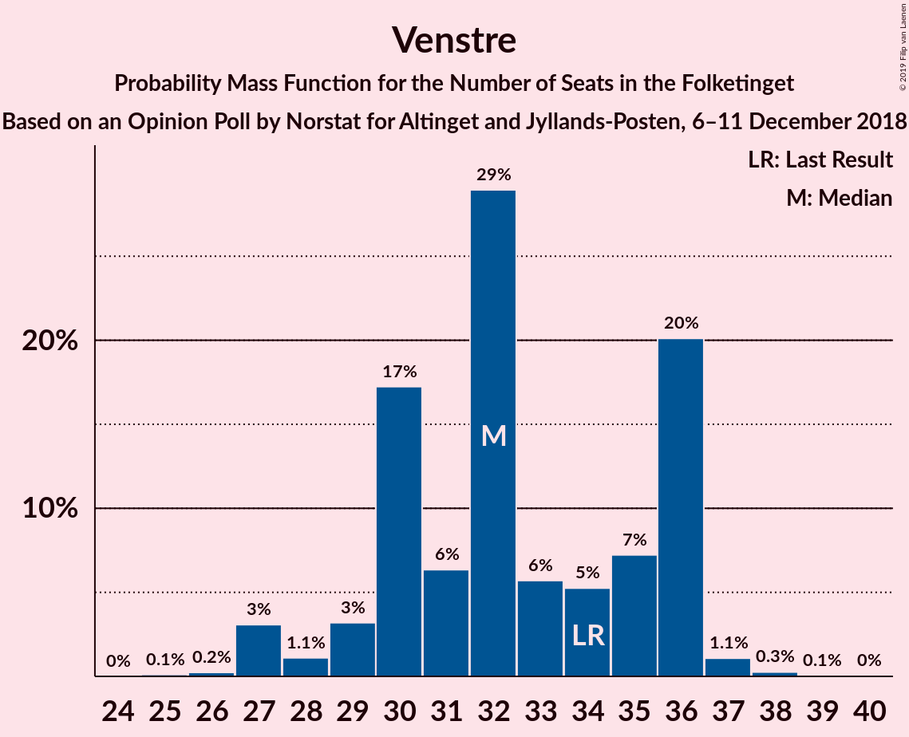
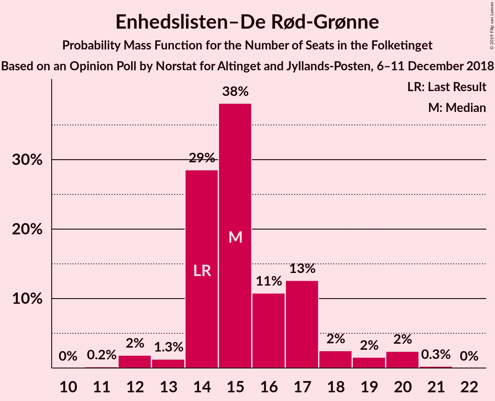
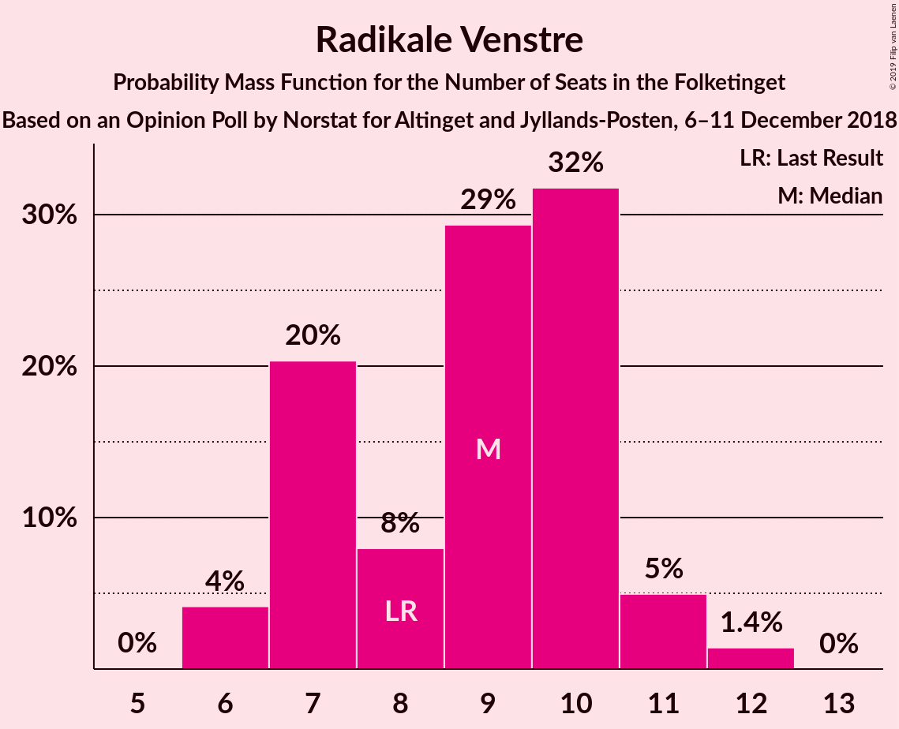
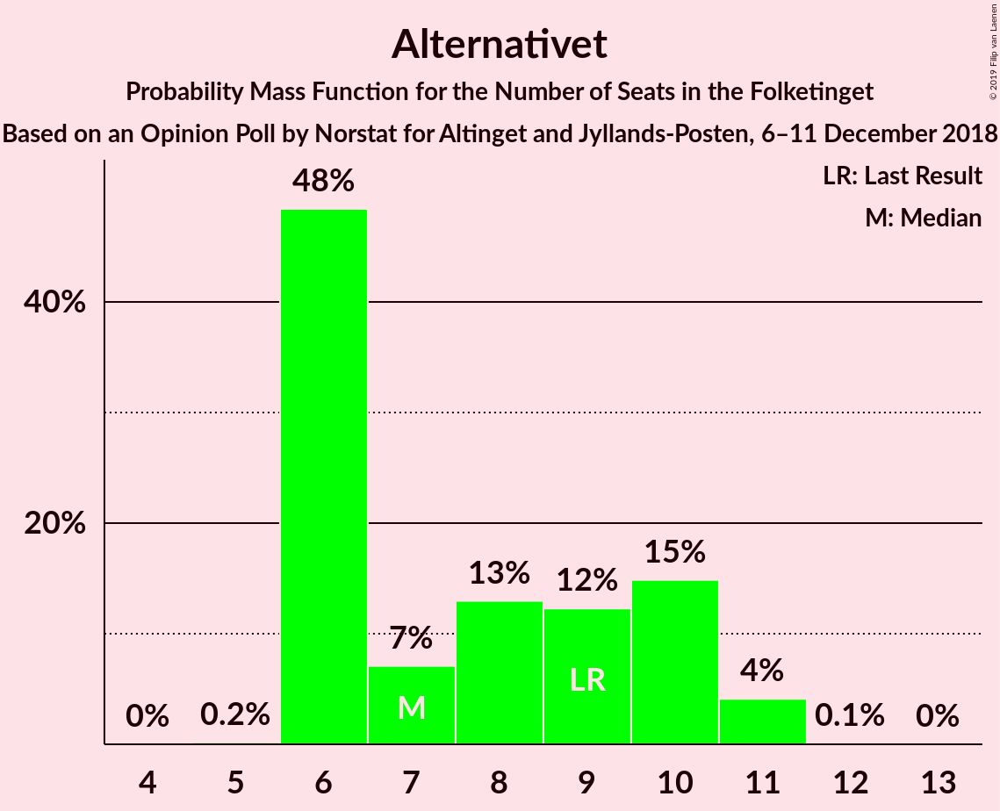
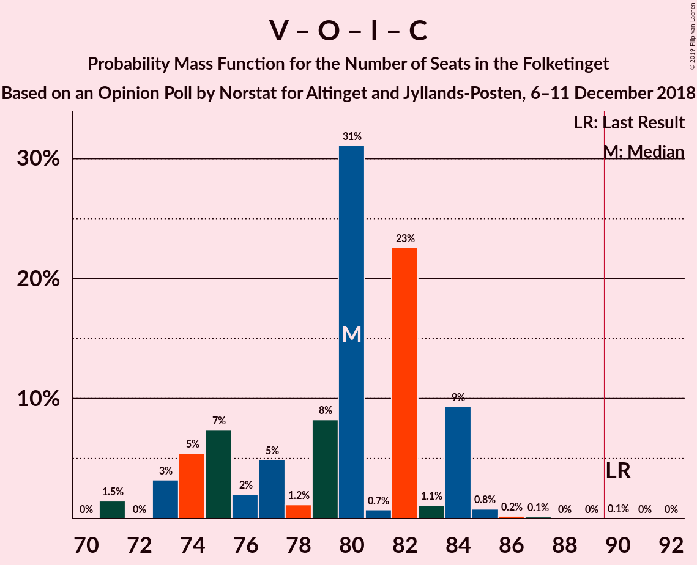
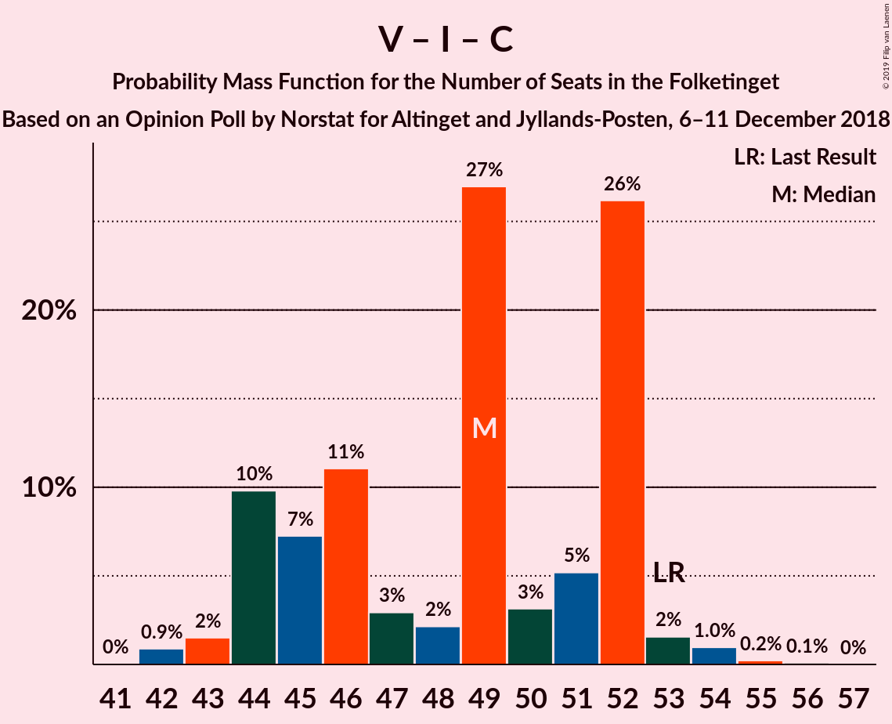

# Opinion Poll by Norstat for Altinget and Jyllands-Posten, 6–11 December 2018

<a href="#voting-intentions">Voting Intentions</a> | <a href="#seats">Seats</a> | <a href="#coalitions">Coalitions</a> | <a href="#technical-information">Technical Information</a>

## Voting Intentions

### Confidence Intervals

| Party | Last Result | Poll Result | 80% Confidence Interval | 90% Confidence Interval | 95% Confidence Interval | 99% Confidence Interval |
|:-----:|:-----------:|:-----------:|:-----------------------:|:-----------------------:|:-----------------------:|:-----------------------:|
| Socialdemokraterne | 26.3% | 26.6% | 25.0–28.3% |24.6–28.7% |24.2–29.1% |23.4–29.9% |
| Venstre | 19.5% | 18.2% | 16.9–19.7% |16.5–20.1% |16.1–20.5% |15.5–21.2% |
| Dansk Folkeparti | 21.1% | 17.6% | 16.3–19.1% |15.9–19.5% |15.6–19.9% |15.0–20.6% |
| Enhedslisten–De Rød-Grønne | 7.8% | 8.8% | 7.8–9.9% |7.5–10.2% |7.3–10.5% |6.9–11.1% |
| Socialistisk Folkeparti | 4.2% | 6.3% | 5.5–7.3% |5.3–7.6% |5.1–7.8% |4.7–8.3% |
| Liberal Alliance | 7.5% | 5.2% | 4.4–6.1% |4.2–6.3% |4.1–6.6% |3.7–7.0% |
| Radikale Venstre | 4.6% | 4.8% | 4.1–5.7% |3.9–6.0% |3.8–6.2% |3.5–6.6% |
| Alternativet | 4.8% | 4.5% | 3.8–5.4% |3.6–5.6% |3.5–5.8% |3.2–6.3% |
| Det Konservative Folkeparti | 3.4% | 3.9% | 3.3–4.8% |3.1–5.0% |3.0–5.2% |2.7–5.6% |
| Nye Borgerlige | 0.0% | 2.8% | 2.3–3.5% |2.1–3.7% |2.0–3.9% |1.8–4.3% |
| Kristendemokraterne | 0.8% | 0.5% | 0.3–0.9% |0.3–1.0% |0.2–1.1% |0.2–1.3% |

*Note:* The poll result column reflects the actual value used in the calculations. Published results may vary slightly, and in addition be rounded to fewer digits.

## Seats

### Confidence Intervals

| Party | Last Result | Median | 80% Confidence Interval | 90% Confidence Interval | 95% Confidence Interval | 99% Confidence Interval |
|:-----:|:-----------:|:------:|:-----------------------:|:-----------------------:|:-----------------------:|:-----------------------:|
| <a href="#socialdemokraterne">Socialdemokraterne</a> | 47 | 46 | 45–51 |44–51 |42–51 |41–52 |
| <a href="#venstre">Venstre</a> | 34 | 32 | 29–34 |29–35 |28–36 |27–37 |
| <a href="#dansk-folkeparti">Dansk Folkeparti</a> | 37 | 30 | 28–34 |28–35 |27–35 |27–37 |
| <a href="#enhedslisten–de-rød-grønne">Enhedslisten–De Rød-Grønne</a> | 14 | 16 | 14–18 |13–18 |13–19 |12–20 |
| <a href="#socialistisk-folkeparti">Socialistisk Folkeparti</a> | 7 | 11 | 10–13 |10–14 |9–14 |9–15 |
| <a href="#liberal-alliance">Liberal Alliance</a> | 13 | 10 | 8–11 |8–11 |7–12 |7–12 |
| <a href="#radikale-venstre">Radikale Venstre</a> | 8 | 8 | 8–10 |7–10 |7–11 |6–11 |
| <a href="#alternativet">Alternativet</a> | 9 | 8 | 7–10 |6–10 |6–10 |6–11 |
| <a href="#det-konservative-folkeparti">Det Konservative Folkeparti</a> | 6 | 7 | 6–8 |5–9 |5–9 |5–10 |
| <a href="#nye-borgerlige">Nye Borgerlige</a> | 0 | 5 | 4–6 |4–6 |4–7 |0–7 |
| <a href="#kristendemokraterne">Kristendemokraterne</a> | 0 | 0 | 0 |0 |0 |0 |

### Socialdemokraterne

*For a full overview of the results for this party, see the [Socialdemokraterne](party-socialdemokraterne.html) page.*

| Number of Seats | Probability | Accumulated | Special Marks |
|:---------------:|:-----------:|:-----------:|:-------------:|
| 40 | 0.1% | 100% |  |
| 41 | 0.5% | 99.9% |  |
| 42 | 2% | 99.4% |  |
| 43 | 2% | 97% |  |
| 44 | 4% | 96% |  |
| 45 | 13% | 92% |  |
| 46 | 32% | 79% | Median |
| 47 | 8% | 47% | Last Result |
| 48 | 2% | 39% |  |
| 49 | 19% | 37% |  |
| 50 | 6% | 18% |  |
| 51 | 12% | 12% |  |
| 52 | 0.5% | 0.8% |  |
| 53 | 0.2% | 0.3% |  |
| 54 | 0.1% | 0.1% |  |
| 55 | 0% | 0% |  |

### Venstre

*For a full overview of the results for this party, see the [Venstre](party-venstre.html) page.*

| Number of Seats | Probability | Accumulated | Special Marks |
|:---------------:|:-----------:|:-----------:|:-------------:|
| 26 | 0.1% | 100% |  |
| 27 | 0.9% | 99.9% |  |
| 28 | 2% | 99.0% |  |
| 29 | 19% | 97% |  |
| 30 | 14% | 78% |  |
| 31 | 10% | 64% |  |
| 32 | 13% | 54% | Median |
| 33 | 12% | 40% |  |
| 34 | 19% | 28% | Last Result |
| 35 | 7% | 9% |  |
| 36 | 2% | 3% |  |
| 37 | 0.6% | 1.0% |  |
| 38 | 0.3% | 0.4% |  |
| 39 | 0.1% | 0.1% |  |
| 40 | 0% | 0% |  |

### Dansk Folkeparti

*For a full overview of the results for this party, see the [Dansk Folkeparti](party-danskfolkeparti.html) page.*

| Number of Seats | Probability | Accumulated | Special Marks |
|:---------------:|:-----------:|:-----------:|:-------------:|
| 25 | 0% | 100% |  |
| 26 | 0.2% | 99.9% |  |
| 27 | 2% | 99.7% |  |
| 28 | 10% | 97% |  |
| 29 | 12% | 88% |  |
| 30 | 28% | 76% | Median |
| 31 | 11% | 47% |  |
| 32 | 17% | 36% |  |
| 33 | 9% | 19% |  |
| 34 | 4% | 10% |  |
| 35 | 4% | 6% |  |
| 36 | 0.5% | 1.4% |  |
| 37 | 0.5% | 0.8% | Last Result |
| 38 | 0.4% | 0.4% |  |
| 39 | 0% | 0% |  |

### Enhedslisten–De Rød-Grønne

*For a full overview of the results for this party, see the [Enhedslisten–De Rød-Grønne](party-enhedslisten–derød-grønne.html) page.*

| Number of Seats | Probability | Accumulated | Special Marks |
|:---------------:|:-----------:|:-----------:|:-------------:|
| 11 | 0.1% | 100% |  |
| 12 | 1.2% | 99.9% |  |
| 13 | 6% | 98.7% |  |
| 14 | 6% | 93% | Last Result |
| 15 | 30% | 87% |  |
| 16 | 22% | 57% | Median |
| 17 | 20% | 35% |  |
| 18 | 12% | 14% |  |
| 19 | 2% | 3% |  |
| 20 | 0.5% | 0.6% |  |
| 21 | 0.1% | 0.1% |  |
| 22 | 0% | 0% |  |

### Socialistisk Folkeparti

*For a full overview of the results for this party, see the [Socialistisk Folkeparti](party-socialistiskfolkeparti.html) page.*

| Number of Seats | Probability | Accumulated | Special Marks |
|:---------------:|:-----------:|:-----------:|:-------------:|
| 7 | 0% | 100% | Last Result |
| 8 | 0.4% | 100% |  |
| 9 | 4% | 99.6% |  |
| 10 | 43% | 96% |  |
| 11 | 17% | 53% | Median |
| 12 | 21% | 35% |  |
| 13 | 9% | 14% |  |
| 14 | 3% | 5% |  |
| 15 | 2% | 2% |  |
| 16 | 0% | 0% |  |

### Liberal Alliance

*For a full overview of the results for this party, see the [Liberal Alliance](party-liberalalliance.html) page.*

| Number of Seats | Probability | Accumulated | Special Marks |
|:---------------:|:-----------:|:-----------:|:-------------:|
| 6 | 0.4% | 100% |  |
| 7 | 4% | 99.6% |  |
| 8 | 17% | 95% |  |
| 9 | 27% | 78% |  |
| 10 | 33% | 51% | Median |
| 11 | 14% | 19% |  |
| 12 | 4% | 5% |  |
| 13 | 0.2% | 0.3% | Last Result |
| 14 | 0% | 0% |  |

### Radikale Venstre

*For a full overview of the results for this party, see the [Radikale Venstre](party-radikalevenstre.html) page.*

| Number of Seats | Probability | Accumulated | Special Marks |
|:---------------:|:-----------:|:-----------:|:-------------:|
| 6 | 2% | 100% |  |
| 7 | 7% | 98% |  |
| 8 | 51% | 90% | Last Result, Median |
| 9 | 21% | 39% |  |
| 10 | 14% | 18% |  |
| 11 | 3% | 4% |  |
| 12 | 0.4% | 0.5% |  |
| 13 | 0.1% | 0.1% |  |
| 14 | 0% | 0% |  |

### Alternativet

*For a full overview of the results for this party, see the [Alternativet](party-alternativet.html) page.*

| Number of Seats | Probability | Accumulated | Special Marks |
|:---------------:|:-----------:|:-----------:|:-------------:|
| 5 | 0.2% | 100% |  |
| 6 | 8% | 99.8% |  |
| 7 | 25% | 92% |  |
| 8 | 36% | 67% | Median |
| 9 | 13% | 31% | Last Result |
| 10 | 17% | 18% |  |
| 11 | 2% | 2% |  |
| 12 | 0.1% | 0.1% |  |
| 13 | 0% | 0% |  |

### Det Konservative Folkeparti

*For a full overview of the results for this party, see the [Det Konservative Folkeparti](party-detkonservativefolkeparti.html) page.*

| Number of Seats | Probability | Accumulated | Special Marks |
|:---------------:|:-----------:|:-----------:|:-------------:|
| 4 | 0.1% | 100% |  |
| 5 | 5% | 99.9% |  |
| 6 | 33% | 95% | Last Result |
| 7 | 21% | 62% | Median |
| 8 | 34% | 41% |  |
| 9 | 5% | 6% |  |
| 10 | 0.9% | 1.1% |  |
| 11 | 0.1% | 0.2% |  |
| 12 | 0% | 0% |  |

### Nye Borgerlige

*For a full overview of the results for this party, see the [Nye Borgerlige](party-nyeborgerlige.html) page.*

| Number of Seats | Probability | Accumulated | Special Marks |
|:---------------:|:-----------:|:-----------:|:-------------:|
| 0 | 2% | 100% | Last Result |
| 1 | 0% | 98% |  |
| 2 | 0% | 98% |  |
| 3 | 0% | 98% |  |
| 4 | 22% | 98% |  |
| 5 | 28% | 76% | Median |
| 6 | 44% | 48% |  |
| 7 | 3% | 3% |  |
| 8 | 0.2% | 0.3% |  |
| 9 | 0% | 0% |  |

### Kristendemokraterne

*For a full overview of the results for this party, see the [Kristendemokraterne](party-kristendemokraterne.html) page.*

| Number of Seats | Probability | Accumulated | Special Marks |
|:---------------:|:-----------:|:-----------:|:-------------:|
| 0 | 100% | 100% | Last Result, Median |

## Coalitions

### Confidence Intervals

| Coalition | Last Result | Median | Majority? | 80% Confidence Interval | 90% Confidence Interval | 95% Confidence Interval | 99% Confidence Interval |
|:---------:|:-----------:|:------:|:---------:|:-----------------------:|:-----------------------:|:-----------------------:|:-----------------------:|
| Socialdemokraterne – Enhedslisten–De Rød-Grønne – Socialistisk Folkeparti – Radikale Venstre – Alternativet | 85 | 90 | 66% | 88–94 | 86–94 | 84–95 | 83–97 |
| Venstre – Dansk Folkeparti – Liberal Alliance – Det Konservative Folkeparti – Nye Borgerlige – Kristendemokraterne | 90 | 85 | 4% | 81–87 | 81–89 | 80–91 | 78–92 |
| Venstre – Dansk Folkeparti – Liberal Alliance – Det Konservative Folkeparti – Nye Borgerlige | 90 | 85 | 4% | 81–87 | 81–89 | 80–91 | 78–92 |
| Socialdemokraterne – Enhedslisten–De Rød-Grønne – Socialistisk Folkeparti – Radikale Venstre | 76 | 82 | 0.1% | 79–86 | 78–86 | 76–87 | 76–89 |
| Venstre – Dansk Folkeparti – Liberal Alliance – Det Konservative Folkeparti – Kristendemokraterne | 90 | 79 | 0% | 77–82 | 75–84 | 75–85 | 73–87 |
| Venstre – Dansk Folkeparti – Liberal Alliance – Det Konservative Folkeparti | 90 | 79 | 0% | 77–82 | 75–84 | 75–85 | 73–87 |
| Socialdemokraterne – Socialistisk Folkeparti – Radikale Venstre | 62 | 66 | 0% | 64–69 | 63–70 | 62–71 | 61–73 |
| Socialdemokraterne – Radikale Venstre | 55 | 55 | 0% | 53–59 | 52–59 | 51–60 | 49–61 |
| Venstre – Liberal Alliance – Det Konservative Folkeparti | 53 | 48 | 0% | 45–51 | 45–52 | 44–53 | 43–54 |
| Venstre – Det Konservative Folkeparti | 40 | 39 | 0% | 36–42 | 36–43 | 35–43 | 34–44 |
| Venstre | 34 | 32 | 0% | 29–34 | 29–35 | 28–36 | 27–37 |

### Socialdemokraterne – Enhedslisten–De Rød-Grønne – Socialistisk Folkeparti – Radikale Venstre – Alternativet

| Number of Seats | Probability | Accumulated | Special Marks |
|:---------------:|:-----------:|:-----------:|:-------------:|
| 82 | 0.3% | 100% |  |
| 83 | 0.2% | 99.7% |  |
| 84 | 3% | 99.5% |  |
| 85 | 1.2% | 97% | Last Result |
| 86 | 1.4% | 96% |  |
| 87 | 3% | 94% |  |
| 88 | 3% | 91% |  |
| 89 | 23% | 89% | Median |
| 90 | 17% | 66% | Majority |
| 91 | 16% | 49% |  |
| 92 | 3% | 32% |  |
| 93 | 10% | 29% |  |
| 94 | 15% | 19% |  |
| 95 | 2% | 4% |  |
| 96 | 0.6% | 2% |  |
| 97 | 1.1% | 1.4% |  |
| 98 | 0.3% | 0.3% |  |
| 99 | 0% | 0.1% |  |
| 100 | 0% | 0% |  |

### Venstre – Dansk Folkeparti – Liberal Alliance – Det Konservative Folkeparti – Nye Borgerlige – Kristendemokraterne

| Number of Seats | Probability | Accumulated | Special Marks |
|:---------------:|:-----------:|:-----------:|:-------------:|
| 76 | 0% | 100% |  |
| 77 | 0.3% | 99.9% |  |
| 78 | 1.1% | 99.7% |  |
| 79 | 0.6% | 98.6% |  |
| 80 | 2% | 98% |  |
| 81 | 15% | 96% |  |
| 82 | 10% | 81% |  |
| 83 | 3% | 71% |  |
| 84 | 16% | 68% | Median |
| 85 | 17% | 51% |  |
| 86 | 23% | 34% |  |
| 87 | 3% | 11% |  |
| 88 | 3% | 9% |  |
| 89 | 1.4% | 6% |  |
| 90 | 1.2% | 4% | Last Result, Majority |
| 91 | 3% | 3% |  |
| 92 | 0.2% | 0.5% |  |
| 93 | 0.3% | 0.3% |  |
| 94 | 0% | 0% |  |

### Venstre – Dansk Folkeparti – Liberal Alliance – Det Konservative Folkeparti – Nye Borgerlige

| Number of Seats | Probability | Accumulated | Special Marks |
|:---------------:|:-----------:|:-----------:|:-------------:|
| 76 | 0% | 100% |  |
| 77 | 0.3% | 99.9% |  |
| 78 | 1.1% | 99.7% |  |
| 79 | 0.6% | 98.6% |  |
| 80 | 2% | 98% |  |
| 81 | 15% | 96% |  |
| 82 | 10% | 81% |  |
| 83 | 3% | 71% |  |
| 84 | 16% | 68% | Median |
| 85 | 17% | 51% |  |
| 86 | 23% | 34% |  |
| 87 | 3% | 11% |  |
| 88 | 3% | 9% |  |
| 89 | 1.4% | 6% |  |
| 90 | 1.2% | 4% | Last Result, Majority |
| 91 | 3% | 3% |  |
| 92 | 0.2% | 0.5% |  |
| 93 | 0.3% | 0.3% |  |
| 94 | 0% | 0% |  |

### Socialdemokraterne – Enhedslisten–De Rød-Grønne – Socialistisk Folkeparti – Radikale Venstre

| Number of Seats | Probability | Accumulated | Special Marks |
|:---------------:|:-----------:|:-----------:|:-------------:|
| 73 | 0.2% | 100% |  |
| 74 | 0.1% | 99.8% |  |
| 75 | 0.1% | 99.7% |  |
| 76 | 3% | 99.6% | Last Result |
| 77 | 0.6% | 97% |  |
| 78 | 2% | 96% |  |
| 79 | 14% | 94% |  |
| 80 | 5% | 80% |  |
| 81 | 6% | 75% | Median |
| 82 | 25% | 69% |  |
| 83 | 3% | 44% |  |
| 84 | 10% | 41% |  |
| 85 | 5% | 31% |  |
| 86 | 22% | 26% |  |
| 87 | 3% | 4% |  |
| 88 | 0.5% | 1.1% |  |
| 89 | 0.5% | 0.6% |  |
| 90 | 0.1% | 0.1% | Majority |
| 91 | 0% | 0% |  |

### Venstre – Dansk Folkeparti – Liberal Alliance – Det Konservative Folkeparti – Kristendemokraterne

| Number of Seats | Probability | Accumulated | Special Marks |
|:---------------:|:-----------:|:-----------:|:-------------:|
| 71 | 0.2% | 100% |  |
| 72 | 0.1% | 99.7% |  |
| 73 | 0.5% | 99.7% |  |
| 74 | 1.5% | 99.2% |  |
| 75 | 3% | 98% |  |
| 76 | 3% | 94% |  |
| 77 | 21% | 92% |  |
| 78 | 15% | 71% |  |
| 79 | 14% | 56% | Median |
| 80 | 19% | 42% |  |
| 81 | 8% | 23% |  |
| 82 | 5% | 14% |  |
| 83 | 2% | 9% |  |
| 84 | 2% | 7% |  |
| 85 | 3% | 4% |  |
| 86 | 1.0% | 2% |  |
| 87 | 0.2% | 0.6% |  |
| 88 | 0.3% | 0.4% |  |
| 89 | 0% | 0% |  |
| 90 | 0% | 0% | Last Result, Majority |

### Venstre – Dansk Folkeparti – Liberal Alliance – Det Konservative Folkeparti

| Number of Seats | Probability | Accumulated | Special Marks |
|:---------------:|:-----------:|:-----------:|:-------------:|
| 71 | 0.2% | 100% |  |
| 72 | 0.1% | 99.7% |  |
| 73 | 0.5% | 99.7% |  |
| 74 | 1.5% | 99.2% |  |
| 75 | 3% | 98% |  |
| 76 | 3% | 94% |  |
| 77 | 21% | 92% |  |
| 78 | 15% | 71% |  |
| 79 | 14% | 56% | Median |
| 80 | 19% | 42% |  |
| 81 | 8% | 23% |  |
| 82 | 5% | 14% |  |
| 83 | 2% | 9% |  |
| 84 | 2% | 7% |  |
| 85 | 3% | 4% |  |
| 86 | 1.0% | 2% |  |
| 87 | 0.2% | 0.6% |  |
| 88 | 0.3% | 0.4% |  |
| 89 | 0% | 0% |  |
| 90 | 0% | 0% | Last Result, Majority |

### Socialdemokraterne – Socialistisk Folkeparti – Radikale Venstre

| Number of Seats | Probability | Accumulated | Special Marks |
|:---------------:|:-----------:|:-----------:|:-------------:|
| 59 | 0.3% | 100% |  |
| 60 | 0.1% | 99.7% |  |
| 61 | 1.0% | 99.6% |  |
| 62 | 1.4% | 98.5% | Last Result |
| 63 | 5% | 97% |  |
| 64 | 14% | 93% |  |
| 65 | 9% | 78% | Median |
| 66 | 21% | 69% |  |
| 67 | 6% | 48% |  |
| 68 | 14% | 42% |  |
| 69 | 20% | 29% |  |
| 70 | 4% | 9% |  |
| 71 | 2% | 4% |  |
| 72 | 1.5% | 2% |  |
| 73 | 0.7% | 0.9% |  |
| 74 | 0.1% | 0.2% |  |
| 75 | 0.1% | 0.1% |  |
| 76 | 0% | 0% |  |

### Socialdemokraterne – Radikale Venstre

| Number of Seats | Probability | Accumulated | Special Marks |
|:---------------:|:-----------:|:-----------:|:-------------:|
| 48 | 0.1% | 100% |  |
| 49 | 0.5% | 99.9% |  |
| 50 | 1.0% | 99.4% |  |
| 51 | 2% | 98% |  |
| 52 | 3% | 97% |  |
| 53 | 7% | 94% |  |
| 54 | 34% | 87% | Median |
| 55 | 9% | 54% | Last Result |
| 56 | 7% | 45% |  |
| 57 | 11% | 38% |  |
| 58 | 6% | 27% |  |
| 59 | 17% | 21% |  |
| 60 | 3% | 4% |  |
| 61 | 0.7% | 1.0% |  |
| 62 | 0.1% | 0.2% |  |
| 63 | 0.1% | 0.1% |  |
| 64 | 0% | 0.1% |  |
| 65 | 0% | 0% |  |

### Venstre – Liberal Alliance – Det Konservative Folkeparti

| Number of Seats | Probability | Accumulated | Special Marks |
|:---------------:|:-----------:|:-----------:|:-------------:|
| 42 | 0.4% | 100% |  |
| 43 | 2% | 99.6% |  |
| 44 | 2% | 98% |  |
| 45 | 9% | 96% |  |
| 46 | 4% | 87% |  |
| 47 | 25% | 83% |  |
| 48 | 13% | 58% |  |
| 49 | 9% | 45% | Median |
| 50 | 24% | 36% |  |
| 51 | 4% | 12% |  |
| 52 | 3% | 8% |  |
| 53 | 3% | 5% | Last Result |
| 54 | 1.1% | 1.5% |  |
| 55 | 0.2% | 0.4% |  |
| 56 | 0.1% | 0.1% |  |
| 57 | 0% | 0.1% |  |
| 58 | 0% | 0% |  |

### Venstre – Det Konservative Folkeparti

| Number of Seats | Probability | Accumulated | Special Marks |
|:---------------:|:-----------:|:-----------:|:-------------:|
| 33 | 0.1% | 100% |  |
| 34 | 2% | 99.9% |  |
| 35 | 2% | 98% |  |
| 36 | 20% | 97% |  |
| 37 | 16% | 76% |  |
| 38 | 5% | 60% |  |
| 39 | 6% | 55% | Median |
| 40 | 25% | 49% | Last Result |
| 41 | 12% | 24% |  |
| 42 | 6% | 12% |  |
| 43 | 5% | 6% |  |
| 44 | 1.2% | 2% |  |
| 45 | 0.3% | 0.5% |  |
| 46 | 0.1% | 0.2% |  |
| 47 | 0.1% | 0.1% |  |
| 48 | 0% | 0% |  |

### Venstre

| Number of Seats | Probability | Accumulated | Special Marks |
|:---------------:|:-----------:|:-----------:|:-------------:|
| 26 | 0.1% | 100% |  |
| 27 | 0.9% | 99.9% |  |
| 28 | 2% | 99.0% |  |
| 29 | 19% | 97% |  |
| 30 | 14% | 78% |  |
| 31 | 10% | 64% |  |
| 32 | 13% | 54% | Median |
| 33 | 12% | 40% |  |
| 34 | 19% | 28% | Last Result |
| 35 | 7% | 9% |  |
| 36 | 2% | 3% |  |
| 37 | 0.6% | 1.0% |  |
| 38 | 0.3% | 0.4% |  |
| 39 | 0.1% | 0.1% |  |
| 40 | 0% | 0% |  |

## Technical Information

### Opinion Poll

+ **Polling firm:** Norstat
+ **Commissioner(s):** Altinget and Jyllands-Posten
+ **Fieldwork period:** 6–11 December 2018

### Calculations

+ **Sample size:** 1219
+ **Simulations done:** 1,048,575
+ **Error estimate:** 2.19%

